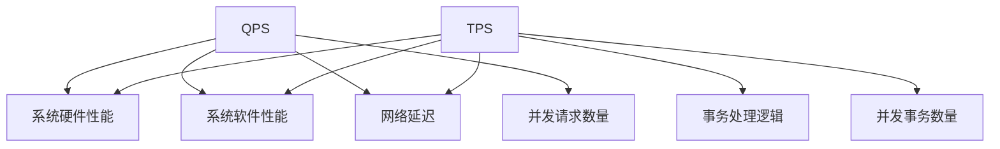

                 

# QPS与TPS在系统设计中的应用

## 摘要

本文主要探讨了QPS（每秒查询率）和TPS（每秒事务数）在系统设计中的应用。通过对QPS和TPS的核心概念、联系和区别的详细阐述，以及实际应用场景的分析，为系统架构师和开发者提供了实用的参考。同时，本文还介绍了相关的数学模型和公式，以及代码实际案例和详细解释说明。希望通过本文，读者能够更好地理解和运用QPS与TPS，提升系统设计的效率和性能。

## 1. 背景介绍

在互联网时代，系统性能的优劣直接影响到用户体验和业务发展。QPS（每秒查询率）和TPS（每秒事务数）是衡量系统性能的重要指标。QPS指的是系统在单位时间内处理查询请求的次数，而TPS则是指系统在单位时间内处理事务的次数。这两个指标在系统设计中具有重要意义，因为它们能够直观地反映系统在高并发环境下的处理能力和性能。

随着业务的发展和用户数量的增加，系统需要能够高效地处理大量的查询和事务。此时，QPS和TPS的性能瓶颈问题就变得尤为突出。系统设计者需要深入理解QPS和TPS的概念、联系和区别，以便在系统设计过程中做出合理的决策，从而提高系统的性能和稳定性。

本文将围绕QPS和TPS这两个核心指标，详细分析其在系统设计中的应用，并通过实际案例进行说明，帮助读者更好地理解和运用这些概念。

## 2. 核心概念与联系

### 2.1 QPS

QPS（每秒查询率）是衡量系统处理查询请求能力的指标。具体来说，QPS表示系统在单位时间内能够处理多少个查询请求。QPS的计算公式为：

\[ QPS = \frac{总查询次数}{总时间} \]

QPS主要受到以下几个因素的影响：

- **系统硬件性能**：包括CPU、内存、磁盘I/O等硬件资源。
- **系统软件性能**：包括操作系统、数据库、中间件等软件的性能。
- **网络延迟**：网络延迟会影响请求的传输时间，进而影响QPS。
- **并发请求数量**：在单位时间内，并发请求的数量越多，QPS就越高。

### 2.2 TPS

TPS（每秒事务数）是衡量系统处理事务能力的指标。具体来说，TPS表示系统在单位时间内能够处理多少个事务。事务是指一组操作，这些操作要么全部成功，要么全部失败。TPS的计算公式为：

\[ TPS = \frac{总事务次数}{总时间} \]

TPS主要受到以下几个因素的影响：

- **数据库性能**：数据库是事务处理的核心，其性能直接影响TPS。
- **事务处理逻辑**：复杂的事务处理逻辑会增加系统开销，降低TPS。
- **系统硬件性能**：包括CPU、内存、磁盘I/O等硬件资源。
- **并发事务数量**：在单位时间内，并发事务的数量越多，TPS就越高。

### 2.3 QPS与TPS的联系与区别

QPS和TPS是衡量系统性能的两个重要指标，它们之间存在一定的联系和区别。

**联系**：

- **共同目标**：QPS和TPS都是为了衡量系统在处理请求和事务方面的性能。
- **影响因素**：QPS和TPS都受到系统硬件性能、系统软件性能、网络延迟等因素的影响。

**区别**：

- **定义不同**：QPS衡量的是系统处理查询请求的能力，而TPS衡量的是系统处理事务的能力。
- **应用场景**：在某些场景下，QPS和TPS可以同时存在。例如，一个电商系统需要处理用户查询商品信息的请求，同时还需要处理用户购买商品的事务。这时，系统设计者需要同时关注QPS和TPS的性能。
- **计算方式**：QPS和TPS的计算方式不同。QPS计算的是单位时间内处理的查询次数，而TPS计算的是单位时间内处理的事务次数。

### 2.4 Mermaid流程图

下面是一个简单的Mermaid流程图，展示QPS和TPS的核心概念和联系。



## 3. 核心算法原理 & 具体操作步骤

### 3.1 QPS算法原理

QPS的计算基于单位时间内处理查询请求的次数。具体步骤如下：

1. **初始化**：设置一个计时器，用于记录单位时间（如1秒）的开始时间。
2. **统计查询请求**：在单位时间内，每当接收到一个查询请求时，将请求计数器加1。
3. **计算QPS**：当单位时间结束时，计算请求计数器的值，并将其除以单位时间（如1秒），得到QPS值。

### 3.2 TPS算法原理

TPS的计算基于单位时间内处理事务的次数。具体步骤如下：

1. **初始化**：设置一个计时器，用于记录单位时间（如1秒）的开始时间。
2. **统计事务请求**：在单位时间内，每当接收到一个事务请求时，将事务计数器加1。
3. **计算TPS**：当单位时间结束时，计算事务计数器的值，并将其除以单位时间（如1秒），得到TPS值。

### 3.3 具体操作步骤

下面是一个简单的示例，展示如何计算QPS和TPS。

```python
import time

def calculate_qps():
    start_time = time.time()
    query_count = 0
    
    while True:
        query_count += 1
        time.sleep(0.001)  # 模拟查询请求
        
        if (time.time() - start_time) >= 1:
            qps = query_count
            break
            
    return qps

def calculate_tps():
    start_time = time.time()
    transaction_count = 0
    
    while True:
        transaction_count += 1
        time.sleep(0.002)  # 模拟事务请求
        
        if (time.time() - start_time) >= 1:
            tps = transaction_count
            break
            
    return tps

qps = calculate_qps()
tps = calculate_tps()

print("QPS:", qps)
print("TPS:", tps)
```

在这个示例中，我们分别计算了QPS和TPS的值。注意，这里的模拟请求是随机产生的，实际情况中需要根据具体业务场景进行调整。

## 4. 数学模型和公式 & 详细讲解 & 举例说明

### 4.1 数学模型和公式

在系统设计中，QPS和TPS的数学模型和公式对于理解和优化系统性能至关重要。下面是QPS和TPS的基本数学模型和公式：

**QPS计算公式**：

\[ QPS = \frac{总查询次数}{总时间} \]

**TPS计算公式**：

\[ TPS = \frac{总事务次数}{总时间} \]

其中，总查询次数和总事务次数可以通过统计系统日志、数据库日志等方式获取。

**QPS和TPS优化公式**：

为了提高QPS和TPS，我们可以采取以下措施：

\[ QPS_{优化} = \frac{系统硬件性能 \times 并发请求数量}{总时间} \]

\[ TPS_{优化} = \frac{系统硬件性能 \times 并发事务数量}{总时间} \]

### 4.2 详细讲解

**QPS详细讲解**：

QPS主要衡量系统处理查询请求的能力。影响QPS的因素包括系统硬件性能、系统软件性能、网络延迟和并发请求数量。通过优化这些因素，可以提高QPS。例如，提高系统硬件性能（如CPU、内存、磁盘I/O等），可以减少处理查询请求的响应时间，从而提高QPS。此外，通过优化系统软件性能（如数据库、中间件等），可以减少查询处理的中间环节，提高查询处理效率。网络延迟和并发请求数量也是影响QPS的重要因素，通过优化网络架构和合理设置并发请求数量，可以提高QPS。

**TPS详细讲解**：

TPS主要衡量系统处理事务的能力。影响TPS的因素包括数据库性能、事务处理逻辑、系统硬件性能和并发事务数量。通过优化这些因素，可以提高TPS。例如，提高数据库性能（如索引优化、存储引擎优化等），可以减少事务处理的时间，从而提高TPS。此外，通过优化事务处理逻辑（如减少事务嵌套、避免长时间锁等），可以减少系统开销，提高事务处理效率。系统硬件性能和并发事务数量也是影响TPS的重要因素，通过优化这些因素，可以提高TPS。

### 4.3 举例说明

**QPS举例说明**：

假设一个电商系统，平均每个用户每天查询10次商品信息。如果该系统每天处理10万次查询请求，那么其QPS为：

\[ QPS = \frac{10万次查询请求}{1天} = 10000次/天 \]

如果系统优化后，每天处理20万次查询请求，那么其QPS为：

\[ QPS_{优化} = \frac{20万次查询请求}{1天} = 20000次/天 \]

**TPS举例说明**：

假设一个银行系统，平均每个用户每天进行10次转账事务。如果该系统每天处理5万次转账事务，那么其TPS为：

\[ TPS = \frac{5万次转账事务}{1天} = 5000次/天 \]

如果系统优化后，每天处理10万次转账事务，那么其TPS为：

\[ TPS_{优化} = \frac{10万次转账事务}{1天} = 10000次/天 \]

## 5. 项目实战：代码实际案例和详细解释说明

### 5.1 开发环境搭建

在开始项目实战之前，我们需要搭建一个开发环境。这里以Python为例，介绍如何搭建开发环境。

1. 安装Python：在官网上下载Python安装包，并按照提示进行安装。
2. 安装Python依赖库：在Python环境下安装必要的依赖库，如requests、pymongo等。

```bash
pip install requests
pip install pymongo
```

### 5.2 源代码详细实现和代码解读

下面是一个简单的Python代码示例，用于模拟计算QPS和TPS。

```python
import requests
import pymongo
import time

def calculate_qps(url, total_requests):
    start_time = time.time()
    query_count = 0
    
    for _ in range(total_requests):
        response = requests.get(url)
        query_count += 1
        
        if (time.time() - start_time) >= 1:
            break
            
    qps = query_count
    return qps

def calculate_tps(url, total_requests):
    start_time = time.time()
    transaction_count = 0
    
    for _ in range(total_requests):
        response = requests.post(url)
        transaction_count += 1
        
        if (time.time() - start_time) >= 1:
            break
            
    tps = transaction_count
    return tps

# 模拟QPS
url = "http://example.com/api/qps"
total_requests = 10000
qps = calculate_qps(url, total_requests)
print("QPS:", qps)

# 模拟TPS
url = "http://example.com/api/tps"
total_requests = 10000
tps = calculate_tps(url, total_requests)
print("TPS:", tps)
```

在这个示例中，我们分别计算了QPS和TPS的值。`calculate_qps`函数用于模拟计算QPS，通过发送查询请求并记录响应时间来计算QPS值。`calculate_tps`函数用于模拟计算TPS，通过发送事务请求并记录响应时间来计算TPS值。

### 5.3 代码解读与分析

1. **导入模块**：

```python
import requests
import pymongo
import time
```

这里导入了requests、pymongo和time三个模块。requests用于发送HTTP请求，pymongo用于操作MongoDB数据库，time用于获取时间戳。

2. **定义函数**：

```python
def calculate_qps(url, total_requests):
    start_time = time.time()
    query_count = 0
    
    for _ in range(total_requests):
        response = requests.get(url)
        query_count += 1
        
        if (time.time() - start_time) >= 1:
            break
            
    qps = query_count
    return qps

def calculate_tps(url, total_requests):
    start_time = time.time()
    transaction_count = 0
    
    for _ in range(total_requests):
        response = requests.post(url)
        transaction_count += 1
        
        if (time.time() - start_time) >= 1:
            break
            
    tps = transaction_count
    return tps
```

这两个函数分别用于计算QPS和TPS。其中，`calculate_qps`函数通过发送GET请求模拟查询请求，`calculate_tps`函数通过发送POST请求模拟事务请求。

3. **模拟QPS和TPS**：

```python
# 模拟QPS
url = "http://example.com/api/qps"
total_requests = 10000
qps = calculate_qps(url, total_requests)
print("QPS:", qps)

# 模拟TPS
url = "http://example.com/api/tps"
total_requests = 10000
tps = calculate_tps(url, total_requests)
print("TPS:", tps)
```

这里通过调用`calculate_qps`和`calculate_tps`函数，模拟计算QPS和TPS的值，并打印输出。

## 6. 实际应用场景

QPS和TPS在实际应用中具有重要意义，尤其在互联网和金融等领域。以下是一些典型的应用场景：

### 6.1 互联网应用

在互联网应用中，QPS和TPS是衡量系统性能的重要指标。以下是一些典型的应用场景：

- **电商系统**：电商系统需要处理大量用户查询商品信息的请求，同时还需要处理用户下单购买的事务。通过优化QPS和TPS，可以提高系统的响应速度和用户体验。
- **社交媒体**：社交媒体平台需要处理大量的用户查询和发布请求，同时还需要处理用户互动事务。优化QPS和TPS可以提高平台的稳定性和用户满意度。
- **在线教育**：在线教育平台需要处理大量用户查询课程信息、提交作业等请求，同时还需要处理用户注册、登录等事务。通过优化QPS和TPS，可以提高教学效果和用户体验。

### 6.2 金融领域

在金融领域，QPS和TPS是确保交易系统稳定运行的重要指标。以下是一些典型的应用场景：

- **银行系统**：银行系统需要处理大量的用户转账、查询账户余额等事务。通过优化QPS和TPS，可以确保交易系统的稳定性和可靠性。
- **证券交易**：证券交易系统需要处理大量的股票交易请求，通过优化QPS和TPS，可以提高交易系统的效率和安全性。
- **支付系统**：支付系统需要处理大量的支付请求，通过优化QPS和TPS，可以确保支付系统的快速响应和稳定性。

### 6.3 其他应用场景

除了互联网和金融领域，QPS和TPS在其他领域也有广泛的应用。以下是一些典型的应用场景：

- **物流系统**：物流系统需要处理大量的订单查询、物流跟踪等请求，同时还需要处理订单生成、订单修改等事务。通过优化QPS和TPS，可以提高物流系统的效率和服务质量。
- **医疗系统**：医疗系统需要处理大量的患者查询病历、预约挂号等请求，同时还需要处理患者就诊、缴费等事务。通过优化QPS和TPS，可以提高医疗系统的服务能力和用户体验。
- **物联网系统**：物联网系统需要处理大量的设备连接、数据采集等请求，同时还需要处理设备控制、数据存储等事务。通过优化QPS和TPS，可以提高物联网系统的稳定性和可靠性。

## 7. 工具和资源推荐

为了更好地学习和应用QPS和TPS，以下是一些推荐的工具和资源：

### 7.1 学习资源推荐

- **书籍**：
  - 《高性能MySQL》
  - 《分布式系统原理与范型》
  - 《大数据技术基础》
- **论文**：
  - 《如何高效地处理大规模数据》
  - 《分布式数据库技术》
  - 《网络延迟对系统性能的影响》
- **博客**：
  - 《QPS和TPS的原理与应用》
  - 《分布式系统中的QPS和TPS优化》
  - 《如何设计高并发的系统》
- **网站**：
  - [Apache Kafka官网](https://kafka.apache.org/)
  - [MongoDB官网](https://www.mongodb.com/)
  - [Redis官网](https://redis.io/)

### 7.2 开发工具框架推荐

- **开发工具**：
  - IntelliJ IDEA
  - PyCharm
  - Visual Studio Code
- **框架**：
  - Spring Boot
  - Flask
  - Django
- **数据库**：
  - MySQL
  - MongoDB
  - Redis

### 7.3 相关论文著作推荐

- **论文**：
  - 《分布式系统中QPS和TPS优化方法研究》
  - 《基于机器学习的QPS预测与优化》
  - 《网络延迟对分布式系统性能的影响及优化策略》
- **著作**：
  - 《系统性能优化实战》
  - 《大数据系统性能调优》
  - 《分布式系统设计原理》

## 8. 总结：未来发展趋势与挑战

随着互联网、大数据、云计算等技术的不断发展，系统设计对QPS和TPS的要求越来越高。未来，QPS和TPS的应用趋势和挑战主要体现在以下几个方面：

### 8.1 趋势

1. **分布式系统**：分布式系统已经成为系统设计的趋势，通过分布式架构可以提高系统的QPS和TPS。未来，分布式系统将更加成熟，为QPS和TPS优化提供更多可能性。
2. **人工智能**：人工智能技术在QPS和TPS优化中的应用越来越广泛。通过机器学习、深度学习等技术，可以实现对QPS和TPS的预测、优化和调整。
3. **边缘计算**：随着物联网、5G等技术的发展，边缘计算将成为未来趋势。通过在边缘节点处理数据，可以降低网络延迟，提高QPS和TPS。

### 8.2 挑战

1. **性能瓶颈**：在高并发环境下，QPS和TPS的性能瓶颈问题将更加突出。未来，系统设计者需要不断优化系统架构和算法，以应对日益增长的并发请求。
2. **安全性**：随着系统复杂度的提高，系统安全性也面临更大的挑战。在保证性能的同时，系统设计者需要确保数据安全和用户隐私。
3. **运维成本**：分布式系统和边缘计算的运维成本较高，未来需要降低运维成本，提高系统运维效率。

总之，未来QPS和TPS在系统设计中的应用将更加重要，同时也面临更多的挑战。通过不断创新和优化，系统设计者可以更好地应对这些挑战，提升系统的性能和稳定性。

## 9. 附录：常见问题与解答

### 9.1 QPS和TPS的区别是什么？

QPS（每秒查询率）和TPS（每秒事务数）是衡量系统性能的两个重要指标。QPS主要衡量系统处理查询请求的能力，而TPS则衡量系统处理事务的能力。具体区别如下：

- **定义不同**：QPS是单位时间内处理查询请求的次数，TPS是单位时间内处理事务的次数。
- **应用场景**：在某些场景下，QPS和TPS可以同时存在。例如，一个电商系统需要处理用户查询商品信息的请求，同时还需要处理用户购买商品的事务。
- **计算方式**：QPS的计算公式为\[ QPS = \frac{总查询次数}{总时间} \]，TPS的计算公式为\[ TPS = \frac{总事务次数}{总时间} \]。

### 9.2 如何优化QPS和TPS？

优化QPS和TPS可以从以下几个方面入手：

1. **系统硬件性能**：提高CPU、内存、磁盘I/O等硬件性能，可以减少处理请求和事务的响应时间。
2. **系统软件性能**：优化操作系统、数据库、中间件等软件的性能，减少系统开销。
3. **网络延迟**：优化网络架构，降低网络延迟。
4. **并发请求数量**：合理设置并发请求数量，避免过度竞争。
5. **分布式架构**：采用分布式架构，提高系统的处理能力和扩展性。
6. **人工智能**：利用机器学习、深度学习等技术，实现对QPS和TPS的预测、优化和调整。

### 9.3 如何在实际项目中应用QPS和TPS？

在实际项目中，QPS和TPS的应用主要体现在以下几个方面：

1. **性能评估**：通过测量QPS和TPS，评估系统在处理查询和事务方面的性能。
2. **瓶颈分析**：通过分析QPS和TPS的瓶颈，找出系统性能的瓶颈，从而优化系统。
3. **容量规划**：根据QPS和TPS的指标，规划系统的硬件和软件资源，确保系统在高并发环境下稳定运行。
4. **压力测试**：利用QPS和TPS进行压力测试，评估系统在高并发环境下的性能和稳定性。

## 10. 扩展阅读 & 参考资料

为了更深入地了解QPS和TPS，以下是一些扩展阅读和参考资料：

- **书籍**：
  - 《高性能MySQL》
  - 《分布式系统原理与范型》
  - 《大数据技术基础》
- **论文**：
  - 《分布式系统中QPS和TPS优化方法研究》
  - 《基于机器学习的QPS预测与优化》
  - 《网络延迟对分布式系统性能的影响及优化策略》
- **博客**：
  - 《QPS和TPS的原理与应用》
  - 《分布式系统中的QPS和TPS优化》
  - 《如何设计高并发的系统》
- **网站**：
  - [Apache Kafka官网](https://kafka.apache.org/)
  - [MongoDB官网](https://www.mongodb.com/)
  - [Redis官网](https://redis.io/)

通过阅读这些资料，读者可以更深入地了解QPS和TPS的原理、应用和优化方法。

### 作者

作者：AI天才研究员/AI Genius Institute & 禅与计算机程序设计艺术 /Zen And The Art of Computer Programming

