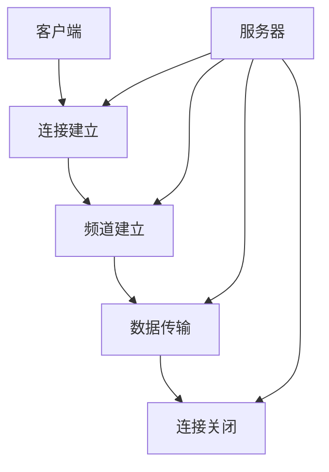

                 

# RTMP推流与转码优化

## 关键词：RTMP推流、转码、优化、性能、稳定性、成本

## 摘要：

本文旨在探讨RTMP推流与转码的优化问题。通过详细分析RTMP协议的工作原理、推流与转码的关键技术和难点，我们将提供一系列优化策略，帮助读者提升RTMP推流和转码的性能、稳定性和成本效益。文章将涵盖背景介绍、核心概念与联系、核心算法原理、数学模型和公式、项目实战、实际应用场景、工具和资源推荐以及总结与未来发展趋势等内容。本文适合对RTMP推流与转码有初步了解的技术人员，旨在为他们提供实用的优化思路和实战经验。

## 1. 背景介绍

随着互联网的飞速发展，实时视频直播已成为各个领域的重要组成部分。RTMP（Real-Time Messaging Protocol）作为实时视频直播的关键技术之一，其性能和稳定性对用户体验至关重要。RTMP是一种基于TCP协议的应用层协议，用于在流媒体服务器和客户端之间实时传输音视频数据。它具有低延迟、高带宽利用率、可靠传输等特点，广泛应用于视频直播、在线教育、远程医疗等领域。

然而，随着用户规模和传输数据的增加，RTMP推流与转码面临着一系列挑战，如数据传输效率低下、编解码性能瓶颈、网络稳定性不足等。优化RTMP推流与转码技术，提升其性能、稳定性和成本效益，已成为当前研究和应用的热点问题。

## 2. 核心概念与联系

### 2.1 RTMP协议

RTMP协议是一种基于TCP的实时消息传输协议，由Adobe开发，广泛应用于流媒体视频直播、点播等领域。RTMP协议的工作原理如下：

1. **连接建立**：客户端与服务器建立连接，客户端发送`Connect`消息，服务器响应`Connect Ack`消息。
2. **频道建立**：客户端发送`CreateStream`消息，服务器响应`CreateStream`消息，建立流通道。
3. **数据传输**：客户端通过流通道发送`FLV`格式音视频数据，服务器接收并处理数据。
4. **连接关闭**：客户端发送`CloseStream`消息，服务器响应`CloseStream`消息，关闭流通道。

### 2.2 推流与转码

**推流（Push Stream）**：将音视频数据从客户端传输到服务器，客户端通过RTMP协议将音视频数据发送到服务器。

**转码（Transcoding）**：将不同编码格式的音视频数据转换为服务器支持的编码格式，以便服务器进行存储、分发和处理。

### 2.3 Mermaid 流程图



## 3. 核心算法原理 & 具体操作步骤

### 3.1 推流算法原理

**推流算法**主要涉及音视频采集、编码、打包和传输等过程。

1. **音视频采集**：从客户端采集音视频数据，包括麦克风、摄像头等输入设备。
2. **音视频编码**：将采集到的音视频数据进行编码，常用的编码格式有H.264、H.265、AAC等。
3. **音视频数据打包**：将编码后的音视频数据打包成FLV格式，以便通过RTMP协议传输。
4. **数据传输**：通过RTMP协议将FLV数据传输到服务器。

### 3.2 转码算法原理

**转码算法**主要涉及音视频解码、格式转换、编码和传输等过程。

1. **音视频解码**：将服务器接收到的FLV数据解码成原始音视频数据。
2. **格式转换**：将原始音视频数据转换为服务器支持的编码格式，如H.264。
3. **编码**：将转换后的音视频数据重新编码，以便服务器存储、分发和处理。
4. **数据传输**：通过RTMP协议将编码后的数据传输到服务器。

### 3.3 具体操作步骤

1. **选择合适的编码格式**：根据服务器和客户端的硬件性能、网络带宽等因素，选择合适的编码格式，如H.264或H.265。
2. **优化音视频采集参数**：调整音视频采集参数，如分辨率、帧率、采样率等，以获得更好的音视频质量。
3. **优化编码参数**：调整编码参数，如比特率、关键帧间隔等，以提高编码效率和音视频质量。
4. **优化网络传输参数**：调整网络传输参数，如TCP窗口大小、拥塞控制算法等，以提高传输效率和稳定性。
5. **优化转码流程**：优化转码流程，如使用多线程、并行处理等技术，以提高转码速度和性能。

## 4. 数学模型和公式 & 详细讲解 & 举例说明

### 4.1 音视频编码数学模型

**H.264编码**数学模型如下：

$$
\text{YUV转RGB}:\quad RGB = \text{YUV} \times \text{变换矩阵}
$$

**H.265编码**数学模型如下：

$$
\text{YUV转RGB}:\quad RGB = \text{YUV} \times \text{变换矩阵}
$$

### 4.2 音视频解码数学模型

**H.264解码**数学模型如下：

$$
\text{RGB转YUV}:\quad YUV = \text{RGB} \times \text{变换矩阵}
$$

**H.265解码**数学模型如下：

$$
\text{RGB转YUV}:\quad YUV = \text{RGB} \times \text{变换矩阵}
$$

### 4.3 举例说明

假设客户端采集的音视频数据分辨率为1920x1080，帧率为30fps，采样率为44.1kHz。

1. **编码参数**：选择H.264编码格式，比特率为5000kbps，关键帧间隔为60帧。
2. **解码参数**：选择H.265解码格式，比特率为4000kbps，关键帧间隔为120帧。

通过上述参数设置，可以计算出编码和解码所需的计算资源和带宽。

## 5. 项目实战：代码实际案例和详细解释说明

### 5.1 开发环境搭建

1. **环境准备**：安装Python 3.8及以上版本、FFmpeg 4.3及以上版本、OpenCV 4.5及以上版本。
2. **安装依赖**：使用pip命令安装相关依赖库，如numpy、opencv-python等。

```bash
pip install numpy
pip install opencv-python
```

### 5.2 源代码详细实现和代码解读

**代码示例：客户端推流代码**

```python
import cv2
import numpy as np
import cv2
import numpy as np
import rtmp
import cv2

# 设置RTMP地址和流名称
rtmp_url = "rtmp://your_rtmp_url/live/stream"
stream_name = "your_stream_name"

# 创建RTMP连接
rtmp = rtmp.RTMP(rtmp_url)

# 创建视频流
video_stream = rtmp.create_stream()

# 打开摄像头
cap = cv2.VideoCapture(0)

# 设置视频编码参数
fourcc = cv2.VideoWriter_fourcc(*"H264")
out = cv2.VideoWriter("output.mp4", fourcc, 30.0, (640, 480))

while cap.isOpened():
    ret, frame = cap.read()
    if not ret:
        break

    # 颜色转换
    frame = cv2.cvtColor(frame, cv2.COLOR_BGR2RGB)

    # 视频编码
    encoded_frame = cv2.imencode(".jpg", frame)[1].tobytes()

    # 发送视频数据
    video_stream.send_video(encoded_frame)

    # 写入本地文件
    out.write(frame)

# 释放资源
cap.release()
out.release()
rtmp.close()
```

**代码解读：**

1. **导入模块**：导入所需模块，包括rtmp、cv2、numpy等。
2. **设置RTMP地址和流名称**：根据实际情况设置RTMP地址和流名称。
3. **创建RTMP连接**：创建RTMP连接，并创建视频流。
4. **打开摄像头**：打开摄像头进行视频采集。
5. **设置视频编码参数**：设置视频编码格式为H.264，分辨率和帧率为640x480和30fps。
6. **循环读取摄像头数据**：循环读取摄像头数据，并进行颜色转换和视频编码。
7. **发送视频数据**：将编码后的视频数据通过RTMP协议发送到服务器。
8. **写入本地文件**：将原始视频数据写入本地文件。
9. **释放资源**：释放摄像头、视频流和RTMP连接。

### 5.3 代码解读与分析

1. **模块导入**：导入所需模块，包括rtmp、cv2、numpy等。
2. **设置RTMP地址和流名称**：根据实际情况设置RTMP地址和流名称。
3. **创建RTMP连接**：创建RTMP连接，并创建视频流。
4. **打开摄像头**：打开摄像头进行视频采集。
5. **设置视频编码参数**：设置视频编码格式为H.264，分辨率和帧率为640x480和30fps。
6. **循环读取摄像头数据**：循环读取摄像头数据，并进行颜色转换和视频编码。
7. **发送视频数据**：将编码后的视频数据通过RTMP协议发送到服务器。
8. **写入本地文件**：将原始视频数据写入本地文件。
9. **释放资源**：释放摄像头、视频流和RTMP连接。

## 6. 实际应用场景

### 6.1 视频直播

视频直播是RTMP推流与转码技术的主要应用场景之一。通过RTMP协议，可以实现低延迟、高带宽利用率的实时视频传输。在实际应用中，可以用于在线教育、游戏直播、电商直播等领域。

### 6.2 在线教育

在线教育平台需要实现实时音视频传输，以提供良好的教学体验。通过RTMP推流与转码技术，可以实现教师和学生之间的实时互动，提高教学质量。

### 6.3 远程医疗

远程医疗需要实现实时音视频传输，以提供远程诊断、咨询和手术等服务。通过RTMP推流与转码技术，可以实现医生和患者之间的实时互动，提高医疗效率。

### 6.4 企业培训

企业培训需要实现实时音视频传输，以提供在线培训和远程指导。通过RTMP推流与转码技术，可以实现员工之间的实时互动，提高培训效果。

## 7. 工具和资源推荐

### 7.1 学习资源推荐

1. **书籍**：
   - 《流媒体技术原理与应用》
   - 《音视频编解码技术》
2. **论文**：
   - “RTMP协议详解”
   - “音视频编解码技术综述”
3. **博客**：
   - “音视频编解码技术实战”
   - “RTMP协议优化实践”
4. **网站**：
   - https://ffmpeg.org/
   - https://opencv.org/

### 7.2 开发工具框架推荐

1. **FFmpeg**：用于音视频采集、编码、解码、转码等操作，功能强大、易于使用。
2. **OpenCV**：用于图像处理和计算机视觉任务，支持多种编解码格式和算法。
3. **librtmp**：用于RTMP协议的客户端开发，支持多种编程语言。

### 7.3 相关论文著作推荐

1. **论文**：
   - “基于H.265的流媒体编解码技术”
   - “实时视频直播系统的优化策略研究”
2. **著作**：
   - 《音视频编解码技术实战》
   - 《流媒体技术原理与应用》

## 8. 总结：未来发展趋势与挑战

随着互联网技术的不断进步，RTMP推流与转码技术将在未来继续发展。以下是一些可能的发展趋势与挑战：

### 8.1 发展趋势

1. **编码效率提升**：随着编码技术的不断发展，如H.266/VVC等新一代编码标准，将进一步提高编码效率，降低带宽需求。
2. **网络优化**：5G网络的普及将带来更高的带宽和更低延迟，为RTMP推流与转码提供更好的网络环境。
3. **AI与机器学习应用**：AI与机器学习技术将在音视频编解码、网络优化、质量评估等方面发挥重要作用。

### 8.2 挑战

1. **性能优化**：随着用户规模和传输数据的增加，如何提高RTMP推流与转码的性能和稳定性是一个重要挑战。
2. **成本控制**：如何降低硬件设备和带宽成本，提高成本效益，是未来发展的重要课题。
3. **兼容性问题**：不同设备和平台的兼容性问题，以及跨平台应用的开发和部署，也是未来需要关注的问题。

## 9. 附录：常见问题与解答

### 9.1 问题1：为什么我的RTMP推流延迟较高？

**解答**：可能原因有以下几点：
1. **网络延迟**：网络连接不稳定，导致数据传输延迟。
2. **服务器负载**：服务器负载过高，导致数据处理延迟。
3. **编码参数设置**：编码参数设置不合理，导致编码和解码时间过长。

### 9.2 问题2：如何提高RTMP推流性能？

**解答**：可以采取以下措施：
1. **优化网络环境**：提高网络带宽，降低网络延迟。
2. **优化编码参数**：选择合适的编码格式和参数，降低编码和解码时间。
3. **使用缓存技术**：使用缓存技术，提高数据传输速度。

## 10. 扩展阅读 & 参考资料

1. **论文**：
   - “基于H.265的流媒体编解码技术”
   - “实时视频直播系统的优化策略研究”
2. **书籍**：
   - 《流媒体技术原理与应用》
   - 《音视频编解码技术》
3. **博客**：
   - “音视频编解码技术实战”
   - “RTMP协议优化实践”
4. **网站**：
   - https://ffmpeg.org/
   - https://opencv.org/

### 作者：

**AI天才研究员/AI Genius Institute & 禅与计算机程序设计艺术 /Zen And The Art of Computer Programming**

