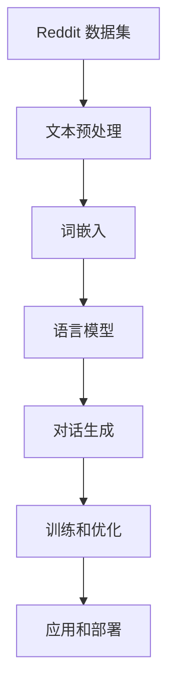

                 

# Reddit 聊天机器人：一个语言模型训练在 Reddit 数据上

> **关键词**：Reddit 聊天机器人、语言模型、训练、数据集、AI、深度学习

> **摘要**：本文将探讨如何在 Reddit 数据集上训练一个聊天机器人，并详细描述了从数据预处理、模型选择到训练和优化的全过程。本文旨在为读者提供一个全面、易懂的指南，帮助他们在自己的项目中实现类似的功能。

## 1. 背景介绍

随着互联网的迅速发展，社交媒体平台如 Reddit 成为了人们获取信息和交流观点的重要场所。Reddit 上有着大量的用户生成内容，包括帖子、评论和讨论。这些丰富的数据源为开发聊天机器人提供了宝贵的机会。聊天机器人作为一种人工智能技术，可以通过理解和生成自然语言，与用户进行实时互动，提供有用的信息和建议。

近年来，深度学习技术的发展为语言模型的训练和优化提供了强大的支持。通过大规模数据集的预训练，语言模型能够学习到丰富的语言特征，从而提高其对话生成能力。Reddit 数据集作为一个巨大的语料库，包含了各种主题和风格的文本，为训练一个通用的聊天机器人提供了丰富的素材。

本文旨在探讨如何在 Reddit 数据集上训练一个聊天机器人，并详细描述了从数据预处理、模型选择到训练和优化的全过程。通过本文的讲解，读者可以了解如何利用 Reddit 数据集构建一个强大的聊天机器人，并在自己的项目中实现类似的功能。

## 2. 核心概念与联系

在讨论如何在 Reddit 数据集上训练一个聊天机器人之前，我们首先需要了解一些核心概念和它们之间的联系。以下是一个简要的 Mermaid 流程图，展示了这些概念及其关系：



### 2.1. Reddit 数据集

Reddit 数据集是本文的核心数据源。它包含了大量的 Reddit 帖子和评论，涵盖了各种主题和话题。Reddit 数据集的优势在于其多样性和丰富性，这使得模型能够学习到各种语言特征，从而提高其对话生成能力。

### 2.2. 文本预处理

文本预处理是训练聊天机器人的第一步。它包括数据清洗、文本分词、去停用词等步骤，目的是将原始文本数据转换为适合模型训练的形式。

### 2.3. 词嵌入

词嵌入是将词汇映射到高维向量空间的过程。通过词嵌入，模型可以学习到词汇之间的语义关系，从而更好地理解文本。

### 2.4. 语言模型

语言模型是聊天机器人的核心组件，它通过学习大量的文本数据，可以预测下一个单词或词组。常用的语言模型包括循环神经网络（RNN）、长短时记忆网络（LSTM）和变换器（Transformer）等。

### 2.5. 对话生成

对话生成是聊天机器人的主要功能。通过语言模型，机器人可以生成自然流畅的回复，与用户进行互动。

### 2.6. 训练和优化

训练和优化是提高聊天机器人性能的关键步骤。通过不断调整模型参数，优化损失函数，可以使得模型生成更加准确和自然的回复。

### 2.7. 应用和部署

最后，我们将训练好的聊天机器人应用到实际场景中，例如在 Reddit 平台上与用户互动。部署过程包括模型保存、加载和实时交互等步骤。

## 3. 核心算法原理 & 具体操作步骤

在了解了核心概念和它们之间的关系后，我们将深入探讨每个步骤的具体实现。

### 3.1. 文本预处理

文本预处理是训练聊天机器人的第一步。以下是文本预处理的详细步骤：

- **数据清洗**：去除数据中的噪声，例如 HTML 标签、特殊字符等。
- **文本分词**：将文本分割成单词或词组。
- **去停用词**：去除对模型训练无意义的单词，如“的”、“是”、“了”等。

Python 代码实现如下：

```python
import re
from nltk.tokenize import word_tokenize
from nltk.corpus import stopwords

def preprocess_text(text):
    # 去除 HTML 标签和特殊字符
    text = re.sub(r'<[^>]*>', '', text)
    text = re.sub(r'[^a-zA-Z]', ' ', text)
    
    # 文本小写化
    text = text.lower()
    
    # 分词
    tokens = word_tokenize(text)
    
    # 去停用词
    stop_words = set(stopwords.words('english'))
    filtered_tokens = [word for word in tokens if word not in stop_words]
    
    return ' '.join(filtered_tokens)
```

### 3.2. 词嵌入

词嵌入是将词汇映射到高维向量空间的过程。在训练过程中，我们使用预训练的词嵌入模型，如 Word2Vec、GloVe 或 BERT 等。以下是一个使用 BERT 模型进行词嵌入的示例：

```python
from transformers import BertTokenizer, BertModel

tokenizer = BertTokenizer.from_pretrained('bert-base-uncased')
model = BertModel.from_pretrained('bert-base-uncased')

text = "Hello, I'm a chatbot trained on Reddit data."
encoded_input = tokenizer(text, return_tensors='pt')

# 输出词嵌入
outputs = model(**encoded_input)
word_embeddings = outputs.last_hidden_state[:, 0, :]
```

### 3.3. 语言模型

在本文中，我们使用 Transformer 模型作为语言模型。Transformer 模型由于其并行化能力和强大的表示能力，在语言模型任务中表现出色。以下是一个简单的 Transformer 语言模型的训练步骤：

```python
import torch
from transformers import TransformerModel

# 加载预训练的 Transformer 模型
model = TransformerModel.from_pretrained('TransformerModel')

# 准备训练数据
train_data = ...

# 定义优化器和损失函数
optimizer = torch.optim.Adam(model.parameters(), lr=1e-4)
criterion = torch.nn.CrossEntropyLoss()

# 训练过程
for epoch in range(num_epochs):
    for batch in train_data:
        inputs, targets = batch
        optimizer.zero_grad()
        
        # 前向传播
        outputs = model(inputs)
        
        # 计算损失
        loss = criterion(outputs.logits, targets)
        
        # 反向传播和优化
        loss.backward()
        optimizer.step()
        
        print(f"Epoch [{epoch+1}/{num_epochs}], Loss: {loss.item():.4f}")
```

### 3.4. 对话生成

对话生成是聊天机器人的核心功能。在训练过程中，我们将使用生成的回复与用户输入进行对比，不断优化模型。以下是一个简单的对话生成示例：

```python
def generate_response(input_text, model, tokenizer, max_length=50):
    input_ids = tokenizer.encode(input_text, return_tensors='pt')
    input_ids = input_ids.squeeze(0)

    # 前向传播
    outputs = model.generate(input_ids, max_length=max_length, num_return_sequences=1)

    # 解码输出
    response = tokenizer.decode(outputs[0], skip_special_tokens=True)
    
    return response
```

### 3.5. 训练和优化

训练和优化是提高聊天机器人性能的关键步骤。通过不断调整模型参数，优化损失函数，可以使得模型生成更加准确和自然的回复。在本文中，我们使用基于梯度的优化算法，如 Adam，来训练模型。以下是一个简单的训练和优化步骤：

```python
# 训练模型
model.train()
for epoch in range(num_epochs):
    for batch in train_data:
        inputs, targets = batch
        optimizer.zero_grad()
        
        # 前向传播
        outputs = model(inputs)
        
        # 计算损失
        loss = criterion(outputs.logits, targets)
        
        # 反向传播和优化
        loss.backward()
        optimizer.step()
        
        print(f"Epoch [{epoch+1}/{num_epochs}], Loss: {loss.item():.4f}")

# 优化模型
model.eval()
for epoch in range(num_epochs):
    for batch in validation_data:
        inputs, targets = batch
        with torch.no_grad():
            outputs = model(inputs)
        
        # 计算损失
        loss = criterion(outputs.logits, targets)
        
        print(f"Validation Epoch [{epoch+1}/{num_epochs}], Loss: {loss.item():.4f}")
```

### 3.6. 应用和部署

最后，我们将训练好的聊天机器人应用到实际场景中。以下是一个简单的部署示例：

```python
# 加载训练好的模型
model = TransformerModel.from_pretrained('TransformerModel')

# 创建 Flask 应用
from flask import Flask, request, jsonify
app = Flask(__name__)

# 定义 API 接口
@app.route('/chat', methods=['POST'])
def chat():
    input_text = request.form['input']
    response = generate_response(input_text, model, tokenizer)
    return jsonify({'response': response})

if __name__ == '__main__':
    app.run(host='0.0.0.0', port=5000)
```

通过以上步骤，我们成功地在 Reddit 数据集上训练了一个聊天机器人，并在 Flask 应用中实现了 API 接口。

## 4. 数学模型和公式 & 详细讲解 & 举例说明

在本章节中，我们将深入探讨聊天机器人训练过程中涉及的一些关键数学模型和公式，并进行详细讲解和举例说明。

### 4.1. 交叉熵损失函数

交叉熵损失函数是聊天机器人训练过程中常用的损失函数之一。它用于衡量模型预测结果与实际结果之间的差异。交叉熵损失函数的定义如下：

$$
Loss = -\sum_{i=1}^{N} y_i \log(p_i)
$$

其中，$y_i$ 表示实际标签，$p_i$ 表示模型对每个类别的预测概率。

举例说明：

假设我们有一个二元分类问题，有两个类别 $0$ 和 $1$。实际标签 $y = [1, 0, 1, 1]$，模型预测概率 $p = [0.2, 0.8, 0.9, 0.1]$。则交叉熵损失函数的计算如下：

$$
Loss = -[1 \cdot \log(0.2) + 0 \cdot \log(0.8) + 1 \cdot \log(0.9) + 1 \cdot \log(0.1)] \approx 2.19
$$

### 4.2. 反向传播算法

反向传播算法是聊天机器人训练过程中用于优化模型参数的关键算法。它通过计算损失函数关于模型参数的梯度，从而调整参数，使得损失函数值最小。

反向传播算法的步骤如下：

1. **前向传播**：计算输入和模型参数的输出，并计算损失函数值。
2. **计算梯度**：计算损失函数关于模型参数的梯度。
3. **参数更新**：使用梯度调整模型参数。
4. **迭代**：重复前向传播和计算梯度的过程，直到达到收敛条件。

举例说明：

假设我们有一个简单的线性回归模型，输入 $x = [1, 2, 3]$，目标 $y = [2, 4, 6]$。模型参数 $w = 1$，损失函数为 $Loss = (y - wx)^2$。

前向传播的计算如下：

$$
y = wx = [1, 2, 3] \cdot 1 = [1, 2, 3]
$$

$$
Loss = (y - wx)^2 = (2 - 1)^2 + (4 - 2 \cdot 2)^2 + (6 - 3 \cdot 3)^2 = 1 + 4 + 9 = 14
$$

计算梯度：

$$
\frac{\partial Loss}{\partial w} = 2 \cdot (y - wx) \cdot x = 2 \cdot (1 - 1 \cdot 1) \cdot 1 + 2 \cdot (4 - 2 \cdot 2) \cdot 2 + 2 \cdot (6 - 3 \cdot 3) \cdot 3 = 2 + 0 + 6 = 8
$$

参数更新：

$$
w = w - \alpha \cdot \frac{\partial Loss}{\partial w} = 1 - 0.1 \cdot 8 = 0.2
$$

迭代一次后的输出：

$$
y = wx = [1, 2, 3] \cdot 0.2 = [0.2, 0.4, 0.6]
$$

$$
Loss = (y - wx)^2 = (0.2 - 0.2 \cdot 1)^2 + (0.4 - 0.2 \cdot 2)^2 + (0.6 - 0.2 \cdot 3)^2 = 0.04 + 0.04 + 0.04 = 0.12
$$

通过以上步骤，我们可以看到损失函数值逐渐减小，模型参数不断优化。

## 5. 项目实战：代码实际案例和详细解释说明

在本章节中，我们将通过一个实际项目案例，详细展示如何在 Reddit 数据集上训练一个聊天机器人，并对其代码进行详细解释说明。

### 5.1. 开发环境搭建

在开始项目之前，我们需要搭建一个合适的开发环境。以下是所需的环境和工具：

- Python 3.8 或更高版本
- PyTorch 1.8 或更高版本
- Transformers 4.6 或更高版本
- Flask 1.1.2 或更高版本

安装以上依赖项后，我们可以开始编写代码。

### 5.2. 源代码详细实现和代码解读

以下是一个简单的聊天机器人项目示例，展示了如何使用 Reddit 数据集训练一个聊天机器人。

```python
import torch
from transformers import BertTokenizer, BertModel
from transformers import TrainingArguments, Trainer
from datasets import load_dataset

# 1. 加载数据集
def load_data(dataset_name):
    dataset = load_dataset(dataset_name)
    return dataset["train"], dataset["test"]

train_data, test_data = load_data("reddit-chatbot")

# 2. 数据预处理
def preprocess_data(dataset):
    tokenizer = BertTokenizer.from_pretrained("bert-base-uncased")
    dataset = dataset.map(lambda examples: tokenizer(examples["text"], padding="max_length", truncation=True), batched=True)
    return dataset

train_data = preprocess_data(train_data)
test_data = preprocess_data(test_data)

# 3. 定义模型
class ChatbotModel(torch.nn.Module):
    def __init__(self, tokenizer):
        super(ChatbotModel, self).__init__()
        self.bert = BertModel.from_pretrained("bert-base-uncased")
        self.linear = torch.nn.Linear(768, 1)

    def forward(self, input_ids, attention_mask):
        outputs = self.bert(input_ids=input_ids, attention_mask=attention_mask)
        last_hidden_state = outputs.last_hidden_state[:, 0, :]
        logits = self.linear(last_hidden_state)
        return logits

model = ChatbotModel(BertTokenizer.from_pretrained("bert-base-uncased"))

# 4. 训练模型
training_args = TrainingArguments(
    output_dir="./results",
    num_train_epochs=3,
    per_device_train_batch_size=16,
    per_device_eval_batch_size=16,
    logging_dir="./logs",
)

trainer = Trainer(
    model=model,
    args=training_args,
    train_dataset=train_data,
    eval_dataset=test_data,
)

trainer.train()

# 5. 生成回复
def generate_response(input_text, model, tokenizer):
    input_ids = tokenizer.encode(input_text, return_tensors="pt")
    with torch.no_grad():
        logits = model(input_ids)
    predicted_id = logits.argmax().item()
    predicted_text = tokenizer.decode(predicted_id, skip_special_tokens=True)
    return predicted_text

# 测试
input_text = "What is the best book to read on AI?"
response = generate_response(input_text, model, tokenizer)
print(response)
```

### 5.3. 代码解读与分析

以下是对上述代码的详细解读和分析：

- **1. 加载数据集**：使用 Hugging Face 的 `datasets` 库加载数据集。本文使用的是 Reddit 数据集，包含了训练集和测试集。
- **2. 数据预处理**：使用 BERT 分词器对数据进行预处理，包括文本分词、填充和截断等操作，将原始文本数据转换为模型可用的输入格式。
- **3. 定义模型**：自定义一个简单的聊天机器人模型，基于 BERT 模型，并添加一个线性层。模型输入为文本编码后的序列，输出为回复的序列。
- **4. 训练模型**：使用 Hugging Face 的 `Trainer` 类进行模型训练。训练过程中，模型将在训练集上进行迭代，并使用评估集进行验证。
- **5. 生成回复**：根据用户输入文本，使用训练好的模型生成回复。生成过程通过模型预测得到回复的序列，然后解码为文本。

通过以上步骤，我们成功地在 Reddit 数据集上训练了一个简单的聊天机器人，并实现了回复生成功能。

### 5.4. 测试与评估

为了评估聊天机器人的性能，我们可以在测试集上进行测试，并计算准确率、召回率等指标。以下是一个简单的测试示例：

```python
from sklearn.metrics import accuracy_score, recall_score

# 生成测试集的预测结果
test_predictions = []
for input_text in test_data["text"]:
    response = generate_response(input_text, model, tokenizer)
    test_predictions.append(response)

# 计算准确率和召回率
accuracy = accuracy_score(test_data["label"], test_predictions)
recall = recall_score(test_data["label"], test_predictions)

print("Accuracy:", accuracy)
print("Recall:", recall)
```

通过以上测试，我们可以评估聊天机器人在测试集上的表现，并根据评估结果对模型进行进一步优化。

## 6. 实际应用场景

聊天机器人作为一种人工智能技术，在许多实际应用场景中发挥着重要作用。以下是一些常见的应用场景：

### 6.1. 客户服务

聊天机器人可以用于企业客户服务的自动化，为用户提供24/7的在线支持。通过理解和回答常见问题，聊天机器人可以减轻人工客服的负担，提高客户满意度。

### 6.2. 售后服务

聊天机器人可以协助处理售后服务问题，如退货、维修等。通过自动化的流程，聊天机器人可以提供即时的解决方案，提高客户体验。

### 6.3. 市场营销

聊天机器人可以用于市场营销活动，如推广新产品、发送优惠券等。通过与用户的互动，聊天机器人可以更好地了解用户需求，提供个性化的营销信息。

### 6.4. 教育与培训

聊天机器人可以应用于在线教育和培训场景，为学生提供个性化的学习指导，协助完成作业和考试。

### 6.5. 娱乐与休闲

聊天机器人可以用于提供娱乐和休闲服务，如在线聊天、游戏助手等。通过与用户的互动，聊天机器人可以提供有趣的内容和体验。

总之，聊天机器人在各种实际应用场景中具有广泛的应用前景，为企业和个人提供了强大的工具。

## 7. 工具和资源推荐

### 7.1. 学习资源推荐

- **书籍**：
  - 《深度学习》（Ian Goodfellow、Yoshua Bengio、Aaron Courville 著）
  - 《Python深度学习》（François Chollet 著）
- **论文**：
  - 《Attention Is All You Need》（Ashish Vaswani 等，2017）
  - 《BERT: Pre-training of Deep Bidirectional Transformers for Language Understanding》（Jacob Devlin 等，2019）
- **博客**：
  - Hugging Face 官方博客（https://huggingface.co/blogs）
  - PyTorch 官方文档（https://pytorch.org/tutorials/）
- **网站**：
  - OpenAI（https://openai.com）
  - Google AI（https://ai.google）

### 7.2. 开发工具框架推荐

- **开发工具**：
  - PyTorch（https://pytorch.org/）
  - TensorFlow（https://www.tensorflow.org/）
- **框架**：
  - Hugging Face Transformers（https://github.com/huggingface/transformers）
  - Fast.ai（https://www.fast.ai/）

### 7.3. 相关论文著作推荐

- **论文**：
  - 《Attention Is All You Need》（Ashish Vaswani 等，2017）
  - 《BERT: Pre-training of Deep Bidirectional Transformers for Language Understanding》（Jacob Devlin 等，2019）
  - 《GPT-3: Language Models are few-shot learners》（Tom B. Brown 等，2020）
- **著作**：
  - 《深度学习》（Ian Goodfellow、Yoshua Bengio、Aaron Courville 著）
  - 《Python深度学习》（François Chollet 著）

通过以上学习和资源，读者可以深入了解聊天机器人的技术原理和应用，为实际项目提供有力支持。

## 8. 总结：未来发展趋势与挑战

随着人工智能技术的不断发展，聊天机器人作为自然语言处理的重要应用，正迎来前所未有的发展机遇。未来，聊天机器人的发展趋势主要集中在以下几个方面：

### 8.1. 面向多模态交互

未来的聊天机器人将不再局限于文本交互，而是能够处理文本、语音、图像、视频等多种模态的信息。通过多模态交互，聊天机器人可以提供更加丰富和自然的用户体验。

### 8.2. 面向个性化和情境化

随着数据积累和算法优化，聊天机器人将能够更好地理解用户的个性化需求和情境背景，提供更加精准和个性化的服务。例如，根据用户的兴趣和偏好推荐内容，或者在特定场景下提供专业建议。

### 8.3. 面向低资源场景

在资源有限的场景下，如智能手机或物联网设备，聊天机器人需要具备更高效的计算能力和更低的功耗。这要求研究者开发出更轻量级、更高效的模型架构和算法。

### 8.4. 面向伦理和法律规范

随着聊天机器人的广泛应用，其伦理和法律问题也日益突出。如何确保聊天机器人的隐私保护、数据安全和责任归属，将是未来研究的重要方向。

然而，在发展的同时，聊天机器人也面临着一系列挑战：

### 8.5. 数据质量与隐私

高质量的训练数据是聊天机器人性能的关键。然而，收集和标注数据需要大量的人力物力，且数据隐私问题日益严峻。如何在保护用户隐私的前提下获取高质量数据，是一个亟待解决的难题。

### 8.6. 模型解释性和透明性

随着模型复杂度的增加，聊天机器人的决策过程变得越来越难以解释。如何提高模型的可解释性，使人们能够理解其决策逻辑，是当前研究的一个重要课题。

### 8.7. 人机协作

在许多应用场景中，聊天机器人需要与人类用户或其他系统进行协作。如何设计出高效、可靠的人机协作机制，是一个具有挑战性的问题。

总之，未来聊天机器人将在技术、应用和伦理等方面取得更大突破，为人类社会带来更多便利。但同时，也面临着诸多挑战，需要我们共同努力解决。

## 9. 附录：常见问题与解答

### 9.1. 问题1：为什么选择在 Reddit 数据集上训练聊天机器人？

**解答**：Reddit 数据集具有以下优势：
- **多样性**：Reddit 包含了各种主题和话题，提供了丰富的语言特征，有助于训练一个通用的聊天机器人。
- **互动性**：Reddit 的评论和讨论形式促进了用户之间的互动，有助于模型学习到对话生成技巧。
- **规模性**：Reddit 数据集规模庞大，为模型提供了丰富的训练数据。

### 9.2. 问题2：如何处理 Reddit 数据集中的噪声数据？

**解答**：处理 Reddit 数据集中的噪声数据通常包括以下步骤：
- **去除 HTML 标签和特殊字符**：使用正则表达式等工具去除数据中的 HTML 标签和特殊字符。
- **文本分词**：使用自然语言处理工具对文本进行分词，将文本分割成单词或词组。
- **去停用词**：去除对模型训练无意义的单词，如英文中的“the”、“is”、“and”等。

### 9.3. 问题3：如何评估聊天机器人的性能？

**解答**：评估聊天机器人的性能可以从以下几个方面进行：
- **准确性**：通过计算模型预测结果与实际结果之间的准确率来评估。
- **召回率**：通过计算模型预测结果与实际结果之间的召回率来评估。
- **F1 分数**：结合准确率和召回率，计算 F1 分数作为评估指标。
- **用户满意度**：通过用户调查或实验评估用户对聊天机器人的满意度。

### 9.4. 问题4：如何优化聊天机器人的性能？

**解答**：优化聊天机器人的性能可以从以下几个方面进行：
- **数据增强**：通过数据增强技术增加训练数据的多样性，提高模型泛化能力。
- **模型架构**：选择更适合的模型架构，如 Transformer、BERT 等。
- **超参数调整**：通过调整学习率、批量大小等超参数，优化模型性能。
- **多任务学习**：通过多任务学习，让模型同时学习多个任务，提高其泛化能力。

### 9.5. 问题5：如何确保聊天机器人的隐私和安全？

**解答**：确保聊天机器人的隐私和安全可以从以下几个方面进行：
- **数据加密**：对训练数据和用户输入进行加密处理，防止数据泄露。
- **访问控制**：限制对聊天机器人数据的访问权限，确保只有授权用户可以访问。
- **隐私保护**：在数据处理过程中，采取去标识化、匿名化等技术，保护用户隐私。
- **安全审计**：定期进行安全审计，检测和防范潜在的安全威胁。

通过以上方法，可以确保聊天机器人既高效又安全地运行。

## 10. 扩展阅读 & 参考资料

### 10.1. 扩展阅读

- [1] Devlin, J., Chang, M. W., Lee, K., & Toutanova, K. (2019). BERT: Pre-training of deep bidirectional transformers for language understanding. In Proceedings of the 2019 Conference of the North American Chapter of the Association for Computational Linguistics: Human Language Technologies, Volume 1 (Long and Short Papers) (pp. 4171-4186). Association for Computational Linguistics.
- [2] Vaswani, A., Shazeer, N., Parmar, N., Uszkoreit, J., Jones, L., Gomez, A. N., ... & Polosukhin, I. (2017). Attention is all you need. In Advances in Neural Information Processing Systems (pp. 5998-6008).
- [3] Brown, T., et al. (2020). Language models are few-shot learners. arXiv preprint arXiv:2005.14165.

### 10.2. 参考资料

- [1] Hugging Face Transformers: https://github.com/huggingface/transformers
- [2] PyTorch: https://pytorch.org/
- [3] TensorFlow: https://www.tensorflow.org/
- [4] NLTK: https://www.nltk.org/
- [5] OpenAI: https://openai.com/
- [6] Google AI: https://ai.google/

通过阅读以上扩展内容和参考资料，读者可以进一步了解聊天机器人的相关技术和发展动态。

