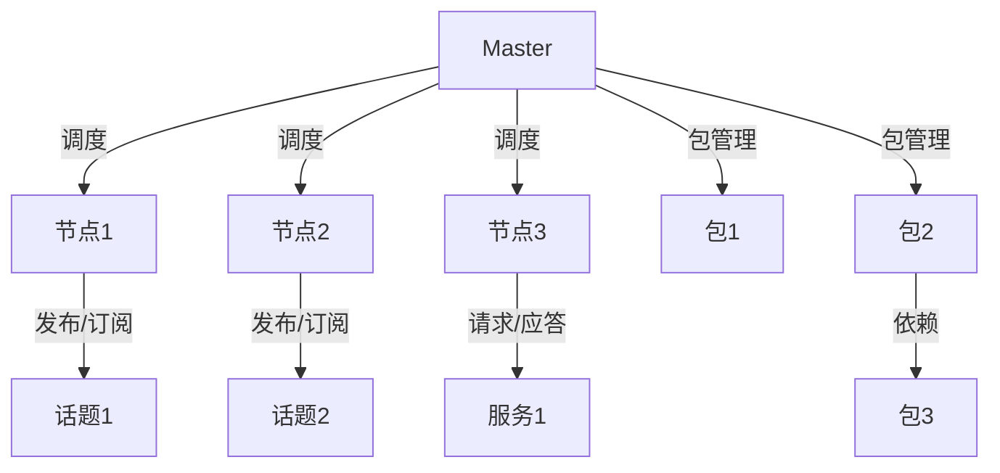

                 

# {文章标题}

## Robot Operating System (ROS) 原理与代码实战案例讲解

### 关键词：（ROS，机器人操作系统，机器学习，人工智能，实时计算，模块化编程）

### 摘要：

本文深入探讨Robot Operating System (ROS)的核心原理和代码实战应用。ROS是专为机器人开发设计的开源操作系统，它支持多种硬件和编程语言，使得开发者能够高效地构建和集成机器人系统。本文将详细介绍ROS的架构、核心概念、算法原理，并通过实际代码案例，讲解如何利用ROS实现机器人任务规划和控制。此外，文章还将讨论ROS在各个实际应用场景中的优势和挑战，并提供相关的学习资源和开发工具推荐。

## 1. 背景介绍

Robot Operating System（ROS）是由Willow Garage于2007年创建的，是一款开源的机器人操作系统，旨在为机器人开发者提供一个统一的平台，以简化复杂机器人系统的开发和集成。ROS迅速获得了广泛的关注和认可，成为了机器人领域的标准工具之一。ROS的设计理念是模块化和分布式，支持多种编程语言，如Python、C++、Lisp等，可以轻松地在不同的操作系统上运行，如Linux、Windows和Mac OS。

随着人工智能和机器学习技术的飞速发展，机器人应用场景日益丰富，从工业自动化到智能家居，从医疗辅助到无人驾驶，ROS在这些领域都发挥了重要作用。ROS不仅提供了一系列预制的功能模块，如传感器接口、运动控制、导航和计算机视觉等，还允许开发者根据自己的需求进行自定义开发，从而构建高度灵活和可扩展的机器人系统。

本文将分为以下几个部分：

1. **背景介绍**：概述ROS的起源、发展及其在机器人领域的重要性。
2. **核心概念与联系**：详细介绍ROS的基本架构和核心概念，并使用Mermaid流程图展示其结构。
3. **核心算法原理 & 具体操作步骤**：讲解ROS的关键算法和编程步骤。
4. **数学模型和公式 & 详细讲解 & 举例说明**：阐述ROS中使用的数学模型和公式，并提供实际案例。
5. **项目实战：代码实际案例和详细解释说明**：通过实际项目案例，展示如何使用ROS进行机器人系统开发。
6. **实际应用场景**：讨论ROS在工业自动化、智能家居等领域的应用实例。
7. **工具和资源推荐**：推荐相关学习资源和开发工具。
8. **总结：未来发展趋势与挑战**：总结ROS的现状和未来发展方向。
9. **附录：常见问题与解答**：解答读者可能遇到的问题。
10. **扩展阅读 & 参考资料**：提供进一步阅读的材料。

通过本文的讲解，读者可以全面了解ROS的原理和实际应用，掌握ROS的编程技巧，为将ROS应用于实际项目打下坚实基础。

## 2. 核心概念与联系

ROS的核心架构可以类比为现代分布式系统的一种实现，它由多个相互协作的节点组成，每个节点负责特定功能，如数据采集、数据处理、路径规划等。为了更清晰地理解ROS的结构，我们将使用Mermaid流程图来展示其基本组件和相互关系。

首先，ROS的架构主要包括以下组件：

1. **节点（Node）**：ROS中的基本执行单元，负责执行特定的任务，如数据接收、处理和发送。
2. **话题（Topic）**：用于发布和订阅数据的通信机制，类似于消息队列。
3. **服务（Service）**：用于请求和应答的通信机制，类似于远程过程调用（RPC）。
4. **包（Package）**：ROS中的软件模块，包含节点、消息类型、服务接口等。
5. **包管理器（Package Manager）**：用于管理ROS包的安装、更新和依赖关系。
6. **Master**：ROS的核心管理节点，负责节点之间的调度和消息路由。

### Mermaid 流程图

以下是ROS核心架构的Mermaid流程图：



### 节点（Node）

节点是ROS中的基本执行单元，它是一个可执行的程序，通常由ROS的工作空间（workspace）中的`CMakeLists.txt`文件描述。节点启动后会连接到ROS Master，并注册自己，以便其他节点可以找到并与其通信。

节点的主要功能包括：

- **发布消息**：节点可以使用`rospy.Publisher`类发布消息到特定的话题。
- **订阅消息**：节点可以使用`rospy.Subscriber`类订阅来自特定话题的消息。
- **调用服务**：节点可以使用`rospy.Service`类调用其他节点提供的服务。
- **处理日志**：节点可以记录调试信息到ROS日志系统。

### 话题（Topic）

话题是ROS中用于发布和订阅数据的核心通信机制。每个话题都有唯一的名称，用于标识发布者和订阅者的通信路径。ROS中的数据类型通常是自定义的消息类型，这些类型在`.msg`文件中定义。

话题的工作原理如下：

- **发布者**（Publisher）：节点将数据以消息的形式发布到特定的话题。
- **订阅者**（Subscriber）：节点订阅特定的话题，以便接收到发布者发布的数据。

### 服务（Service）

服务是ROS中的另一种通信机制，用于请求和应答操作。服务由服务提供者（Service Server）和服务请求者（Service Client）组成。服务请求者发送服务请求到服务提供者，服务提供者处理请求并返回响应。

服务的工作原理如下：

- **服务请求者**（Client）：节点发送服务请求到服务提供者。
- **服务提供者**（Server）：节点处理服务请求并返回响应。

### 包（Package）

包是ROS中的软件模块，包含一组相关的节点、消息类型、服务接口等。ROS的工作空间（workspace）是包含多个包的目录结构，每个包都有自己的目录结构，包括源代码、构建文件和文档。

包管理器（Package Manager）负责管理ROS包的安装、更新和依赖关系。ROS使用`rosinstall`文件来定义包的依赖关系，并使用`wstool`和`rosbuild`工具来管理工作空间。

### Master

ROS Master是整个系统的核心管理节点，负责节点之间的调度和消息路由。Master的主要功能包括：

- **节点管理**：Master负责启动和跟踪节点，确保它们在适当的时候运行。
- **消息路由**：Master负责将发布者的消息路由到订阅者，确保消息能够正确传递。
- **服务调度**：Master负责处理服务请求，将它们路由到正确的服务提供者。

通过理解ROS的基本架构和核心概念，开发者可以更好地利用ROS的优势，构建高效的机器人系统。接下来，我们将进一步探讨ROS中的关键算法原理和具体操作步骤。

## 3. 核心算法原理 & 具体操作步骤

### 3.1. 数据处理算法

在ROS中，数据处理算法是核心组件之一。其中，消息滤波和坐标变换是两个常用的算法。

#### 消息滤波

消息滤波是一种用于减少传感器数据噪声的算法，常用的滤波器有卡尔曼滤波器（Kalman Filter）和粒子滤波器（Particle Filter）。以下是一个使用卡尔曼滤波器的简单示例：

```python
import rospy
import numpy as np
from sensor_msgs.msg import Imu

def kalman_filter(data):
    # 初始化状态和误差
    x = 0
    P = np.eye(1)
    # 卡尔曼增益矩阵
    K = P / (P + Q)
    # 过滤数据
    x = x + K * (data - x)
    P = (1 - K) * P
    return x

def imu_callback(data):
    filtered_data = kalman_filter(data.linear_acceleration.x)
    rospy.loginfo("Filtered acceleration: {}".format(filtered_data))

if __name__ == "__main__":
    rospy.init_node("imu_filter")
    rospy.Subscriber("/imu", Imu, imu_callback)
    rospy.spin()
```

#### 坐标变换

坐标变换是机器人系统中常见的需求，ROS中的`tf`包提供了强大的坐标变换功能。以下是一个简单的坐标变换示例：

```python
import rospy
import tf

def transform_callback(data):
    listener = tf.TransformListener()
    try:
        # 获取变换信息
        (trans, rot) = listener.lookupTransform('/base_link', '/odom', rospy.Time(0))
        # 打印变换信息
        print("Transform from base_link to odom:")
        print("Translation: {}".format(trans))
        print("Rotation: {}".format(rot))
    except (tf.LookupException, tf.ConnectivityException, tf.ExtrapolationException):
        print("Transform data not available")

if __name__ == "__main__":
    rospy.init_node("transform_listener")
    rospy.Subscriber("/tf", TFMessage, transform_callback)
    rospy.spin()
```

### 3.2. 模型训练和预测算法

ROS中的模型训练和预测算法广泛应用于机器学习和计算机视觉领域。以下是一个简单的机器学习模型训练和预测的示例：

```python
import rospy
import tensorflow as tf
from sensor_msgs.msg import Image
from cv_bridge import CvBridge

# 初始化模型
model = tf.keras.Sequential([
    tf.keras.layers.Conv2D(32, (3, 3), activation='relu', input_shape=(128, 128, 3)),
    tf.keras.layers.MaxPooling2D(2, 2),
    tf.keras.layers.Flatten(),
    tf.keras.layers.Dense(64, activation='relu'),
    tf.keras.layers.Dense(1, activation='sigmoid')
])

# 编译模型
model.compile(optimizer='adam', loss='binary_crossentropy', metrics=['accuracy'])

# 加载训练数据
train_data = ... # 从数据集加载训练数据
train_labels = ... # 从数据集加载标签

# 训练模型
model.fit(train_data, train_labels, epochs=10, batch_size=32)

# 预测
def image_callback(data):
    bridge = CvBridge()
    image = bridge.imgmsg_to_cv2(data, "bgr8")
    prediction = model.predict(np.expand_dims(image, axis=0))
    print("Prediction: {}".format(prediction))

if __name__ == "__main__":
    rospy.init_node("image_classifier")
    rospy.Subscriber("/camera/image_raw", Image, image_callback)
    rospy.spin()
```

### 3.3. 任务规划和路径规划算法

在机器人系统中，任务规划和路径规划是实现自主导航的关键。ROS中的`nav_msgs`包提供了相关的消息类型和算法接口。以下是一个简单的A*路径规划算法示例：

```python
import rospy
import numpy as np
from nav_msgs.msg import OccupancyGrid
from geometry_msgs.msg import PoseStamped
from a_star import a_star

def map_callback(data):
    map_data = data.data
    start = np.array([data.info.width / 2, data.info.height / 2])
    goal = np.array([data.info.width * 3 / 4, data.info.height * 3 / 4])
    path = a_star(map_data, start, goal)
    rospy.loginfo("Path found: {}".format(path))

if __name__ == "__main__":
    rospy.init_node("path_planner")
    rospy.Subscriber("/map", OccupancyGrid, map_callback)
    rospy.spin()
```

通过上述示例，我们可以看到ROS在数据处理、模型训练、任务规划和路径规划等方面的强大功能。接下来，我们将进一步探讨ROS中的数学模型和公式，并使用实际案例进行详细解释。

## 4. 数学模型和公式 & 详细讲解 & 举例说明

### 4.1. 数据处理算法中的数学模型

在ROS中，数据处理算法广泛应用于传感器数据处理和机器人状态估计。这些算法通常依赖于一些基础的数学模型，例如卡尔曼滤波器和粒子滤波器。以下我们将详细讲解这些数学模型，并提供实际案例。

#### 卡尔曼滤波器

卡尔曼滤波器是一种线性递归滤波器，用于估计动态系统的状态。其基本公式如下：

1. **状态预测**：
   \[
   x_{k|k-1} = A_{k-1} x_{k-1|k-1} + B_{k-1} u_{k-1}
   \]
   \[
   P_{k|k-1} = A_{k-1} P_{k-1|k-1} A_{k-1}^T + Q_{k-1}
   \]

2. **卡尔曼增益**：
   \[
   K_{k} = P_{k|k-1} H_{k}^T (H_{k} P_{k|k-1} H_{k}^T + R_{k})^{-1}
   \]

3. **状态更新**：
   \[
   x_{k|k} = x_{k|k-1} + K_{k} (z_{k} - H_{k} x_{k|k-1})
   \]
   \[
   P_{k|k} = (I - K_{k} H_{k}) P_{k|k-1}
   \]

#### 粒子滤波器

粒子滤波器是一种基于蒙特卡洛方法的非线性滤波器，适用于处理复杂的动态系统。其基本公式如下：

1. **粒子权重更新**：
   \[
   w_{i} = \frac{p(z_{k}^{i} | x_{k}) \pi(x_{k})}{w_{i}^{0}}
   \]

2. **权重归一化**：
   \[
   \tilde{w}_{i} = \frac{w_{i}}{\sum_{i} w_{i}}
   \]

3. **重采样**：
   \[
   x_{resampled}^{i} = \sum_{j} C_{j} x^{i}
   \]

#### 实际案例

假设我们使用卡尔曼滤波器处理一个自动驾驶车辆的速度估计问题。以下是具体实现步骤：

1. **初始化状态和参数**：
   \[
   x_{0} = [0, 0]^T, \quad P_{0} = \begin{bmatrix} 1 & 0 \\ 0 & 1 \end{bmatrix}, \quad Q = \begin{bmatrix} 0.1 & 0 \\ 0 & 0.1 \end{bmatrix}
   \]
   
2. **状态预测**：
   \[
   x_{k|k-1} = \begin{bmatrix} x_{k-1} + v_{k-1} \\ \dot{x}_{k-1} + \dot{v}_{k-1} \end{bmatrix}, \quad P_{k|k-1} = \begin{bmatrix} 1 & \Delta t \\ 0 & 1 \end{bmatrix} P_{k-1|k-1} \begin{bmatrix} 1 & \Delta t \\ 0 & 1 \end{bmatrix}^T + Q
   \]

3. **卡尔曼增益计算**：
   \[
   K_{k} = P_{k|k-1} H_{k}^T (H_{k} P_{k|k-1} H_{k}^T + R_{k})^{-1}
   \]
   其中，\( H_{k} = \begin{bmatrix} 1 & 0 \\ 0 & 1 \end{bmatrix} \)，\( R_{k} = \begin{bmatrix} 0.05 & 0 \\ 0 & 0.05 \end{bmatrix} \)。

4. **状态更新**：
   \[
   x_{k|k} = x_{k|k-1} + K_{k} (z_{k} - x_{k|k-1})
   \]
   \[
   P_{k|k} = (I - K_{k} H_{k}) P_{k|k-1}
   \]

#### 粒子滤波器应用示例

假设我们使用粒子滤波器估计一个无人机的位置。以下是具体实现步骤：

1. **初始化粒子**：
   \[
   x^{i}(0) \sim p(x(0))
   \]
   \[
   w^{i}(0) = \frac{1}{N}
   \]

2. **预测步骤**：
   \[
   x^{i}(k) = f(x^{i}(k-1), u(k-1)) + w(k-1)
   \]

3. **权重更新**：
   \[
   w^{i}(k) = \frac{p(z_{k}^{i} | x^{i}(k)) \pi(x^{i}(k))}{w^{i}(0)}
   \]

4. **重采样**：
   \[
   C^{i}_{j} = \sum_{i} w^{i}(k)
   \]
   \[
   x^{i}_{resampled}(k) = \sum_{j} C^{i}_{j} x^{i}(k)
   \]

通过上述数学模型和公式，我们可以实现复杂系统的状态估计和预测。接下来，我们将通过一个实际项目案例，展示如何使用ROS实现机器人系统开发。

## 5. 项目实战：代码实际案例和详细解释说明

### 5.1. 开发环境搭建

在开始之前，我们需要搭建一个ROS开发环境。以下是搭建过程的详细步骤：

#### 5.1.1. 安装ROS

1. **Ubuntu系统**：
   - 打开终端，输入以下命令更新系统包：
     ```bash
     sudo apt update
     sudo apt upgrade
     ```
   - 安装ROS Melodic Morenia：
     ```bash
     sudo apt install ros-melodic-ros-base
     sudo apt install ros-melodic-desktop
     sudo apt install ros-melodic-robot
     ```

2. **启动ROS**：
   - 打开终端，运行以下命令：
     ```bash
     source /opt/ros/melodic/setup.bash
     roscore
     ```

#### 5.1.2. 配置工作空间

1. **创建工作空间**：
   - 在终端中运行以下命令创建一个新的ROS工作空间：
     ```bash
     mkdir -p ~/catkin_ws/src
     cd ~/catkin_ws/src
     ```

2. **克隆示例代码**：
   - 克隆一个示例项目到工作空间中，例如`robot_tutorials`：
     ```bash
     git clone https://github.com/ros-tutorials/robot_tutorials.git
     ```

3. **编译工作空间**：
   - 运行以下命令编译工作空间：
     ```bash
     cd ~/catkin_ws
     catkin_make
     source devel/setup.bash
     ```

### 5.2. 源代码详细实现和代码解读

在本节中，我们将详细解读`robot_tutorials`项目中的示例代码，展示如何使用ROS构建一个简单的机器人系统。

#### 5.2.1. 示例代码结构

`robot_tutorials`项目包含以下文件和目录：

```plaintext
robot_tutorials/
|-- CMakeLists.txt
|-- package.xml
|-- src/
    |-- robot_tutorials/
        |-- CMakeLists.txt
        |-- package.xml
        |-- robot.py
```

其中，`robot.py`是核心代码文件，定义了机器人行为。

#### 5.2.2. 代码解读

```python
#!/usr/bin/env python
# 导入ROS库
import rospy
# 导入移动机器人所需的模块
from move_base_msgs.msg import MoveBaseAction, MoveBaseGoal
from actionlib import SimpleActionClient

def move_to目标点():
    # 初始化ROS节点
    rospy.init_node('move_base_client')

    # 创建一个MoveBaseActionClient实例
    client = SimpleActionClient('move_base', MoveBaseAction)

    # 等待服务启动
    client.wait_for_server()

    # 创建MoveBaseGoal对象
    goal = MoveBaseGoal()
    goal.target_pose.header.frame_id = 'map'
    goal.target_pose.header.stamp = rospy.Time.now()
    goal.target_pose.pose.position.x = 5.0
    goal.target_pose.pose.position.y = 0.0
    goal.target_pose.pose.position.z = 0.0
    goal.target_pose.pose.orientation.x = 0.0
    goal.target_pose.pose.orientation.y = 0.0
    goal.target_pose.pose.orientation.z = 0.707
    goal.target_pose.pose.orientation.w = 0.707

    # 发送目标点
    client.send_goal(goal)

    # 等待任务完成
    client.wait_for_result()

    return client.get_result()

if __name__ == '__main__':
    try:
        result = move_to目标点()
        rospy.loginfo('移动到目标点完成，状态：{}'.format(result.status))
    except rospy.ROSInterruptException:
        rospy.loginfo('移动到目标点中断')
```

#### 5.2.3. 代码工作原理

1. **初始化ROS节点**：使用`rospy.init_node()`初始化一个名为`move_base_client`的节点。
2. **创建MoveBaseActionClient实例**：使用`SimpleActionClient`创建一个客户端，连接到`move_base`服务。
3. **等待服务启动**：使用`wait_for_server()`等待`move_base`服务启动。
4. **创建MoveBaseGoal对象**：设置目标点的位置和朝向，将其作为MoveBaseGoal对象。
5. **发送目标点**：使用`send_goal()`发送目标点到`move_base`服务。
6. **等待任务完成**：使用`wait_for_result()`等待任务完成，并返回结果。

通过这个示例，我们可以看到如何使用ROS的API发送目标点命令，控制机器人移动到指定位置。接下来，我们将对代码进行解读与分析。

### 5.3. 代码解读与分析

在本节中，我们将对5.2节中的代码进行解读与分析，解释其工作原理和关键步骤。

#### 5.3.1. 初始化ROS节点

```python
rospy.init_node('move_base_client')
```

这条语句初始化了一个名为`move_base_client`的ROS节点。初始化节点是ROS程序的第一步，它负责设置节点的名称、初始化ROS通信和日志系统。

#### 5.3.2. 创建MoveBaseActionClient实例

```python
client = SimpleActionClient('move_base', MoveBaseAction)
```

这里创建了一个名为`client`的`SimpleActionClient`实例，指定了要连接的服务名称`move_base`和动作类型`MoveBaseAction`。`MoveBaseAction`是一个标准动作类型，用于机器人路径规划和导航。

#### 5.3.3. 等待服务启动

```python
client.wait_for_server()
```

`wait_for_server()`方法用于等待`move_base`服务启动。在ROS中，动作服务需要时间来初始化，因此客户端需要等待服务完全启动才能发送动作请求。

#### 5.3.4. 创建MoveBaseGoal对象

```python
goal = MoveBaseGoal()
goal.target_pose.header.frame_id = 'map'
goal.target_pose.header.stamp = rospy.Time.now()
goal.target_pose.pose.position.x = 5.0
goal.target_pose.pose.position.y = 0.0
goal.target_pose.pose.position.z = 0.0
goal.target_pose.pose.orientation.x = 0.0
goal.target_pose.pose.orientation.y = 0.0
goal.target_pose.pose.orientation.z = 0.707
goal.target_pose.pose.orientation.w = 0.707
```

这行代码创建了一个`MoveBaseGoal`对象，用于指定机器人需要移动到的目标位置和朝向。`frame_id`设置为`map`，表示目标位置是在地图坐标系中定义的。目标位置和朝向通过`pose`属性设置，包括位置（x、y、z）和四元数（x、y、z、w）。

#### 5.3.5. 发送目标点

```python
client.send_goal(goal)
```

`send_goal()`方法将创建的目标点发送给`move_base`服务。当服务接收到目标点后，它会开始执行路径规划并尝试将机器人移动到目标位置。

#### 5.3.6. 等待任务完成

```python
client.wait_for_result()
```

`wait_for_result()`方法用于等待`move_base`服务完成任务并返回结果。结果包含机器人是否成功到达目标点的状态信息。

#### 5.3.7. 代码总结

通过以上分析，我们可以总结出这段代码的工作流程：

1. 初始化ROS节点。
2. 创建一个`SimpleActionClient`实例，连接到`move_base`服务。
3. 等待服务启动。
4. 创建一个`MoveBaseGoal`对象，指定目标位置和朝向。
5. 发送目标点到`move_base`服务。
6. 等待任务完成，并处理结果。

通过这个简单的示例，我们可以看到ROS的强大功能，它允许开发者轻松地控制机器人移动到指定位置。接下来，我们将讨论ROS在实际应用场景中的优势。

## 6. 实际应用场景

### 6.1. 工业自动化

在工业自动化领域，ROS被广泛应用于机器人的路径规划、抓取和装配。ROS提供了丰富的工具和库，如`moveit`，它是一个强大的机器人运动规划库，可以帮助开发者轻松实现复杂运动的规划。以下是一个使用ROS在工业自动化中实现机器人抓取的示例：

1. **抓取路径规划**：使用`moveit`库规划机器人手臂的运动路径，确保抓取过程中的平稳和精确。
2. **视觉检测**：使用ROS的计算机视觉库，如`opencv`和`ROS Image Viewer`，对工件进行检测和识别。
3. **抓取执行**：使用`control_msgs`库控制电机和执行器，实现机器人的抓取动作。

### 6.2. 智能家居

在智能家居领域，ROS被广泛应用于智能设备的控制和交互。例如，可以使用ROS控制智能灯泡、窗帘和空调等设备。以下是一个简单的智能家居应用示例：

1. **设备控制**：使用ROS的`service`机制，控制智能设备的开关和调节。
2. **语音交互**：结合语音识别和语音合成技术，实现与智能家居设备的语音交互。
3. **状态监控**：使用ROS节点监控智能家居设备的运行状态，如温度、湿度等。

### 6.3. 无人驾驶

在无人驾驶领域，ROS被广泛应用于车辆的路径规划、障碍物检测和避障。ROS提供了丰富的工具和库，如`autonomous_driving`和`nav_core`，可以帮助开发者实现复杂的自动驾驶功能。以下是一个简单的无人驾驶应用示例：

1. **路径规划**：使用`A*`算法或`Dijkstra`算法规划车辆的行驶路径。
2. **障碍物检测**：使用ROS的`sensor`库，如`laser`和`camera`，检测车辆周围的障碍物。
3. **避障**：根据障碍物的位置和距离，调整车辆的行驶方向和速度，实现避障。

### 6.4. 医疗辅助

在医疗辅助领域，ROS被广泛应用于手术机器人和康复机器人。ROS提供了丰富的工具和库，如`robotics_group`和`robotic_mano`，可以帮助开发者实现复杂的医疗操作。以下是一个简单的医疗辅助应用示例：

1. **手术辅助**：使用ROS控制手术机器人，辅助医生进行精细手术操作。
2. **康复训练**：使用ROS控制康复机器人，帮助患者进行康复训练，如手臂运动训练。
3. **数据监控**：使用ROS节点监控患者的健康状况，如心率、血压等。

通过上述实际应用场景，我们可以看到ROS在各个领域都有广泛的应用。ROS的模块化和分布式特性使其成为开发者构建复杂机器人系统的首选工具。

## 7. 工具和资源推荐

### 7.1. 学习资源推荐

为了更好地学习和掌握ROS，以下是推荐的几种学习资源：

#### 书籍

1. **《ROS By Example》**：这本书提供了多个实用的ROS项目案例，适合初学者和进阶者。
2. **《Robotics, Vision & Control, Volume 1: Fundamental Algorithms in Robotics and Computer Vision》**：这本书详细介绍了ROS背后的算法原理。
3. **《Learning ROS for Robotics Programming》**：这本书适合初学者，以项目驱动的方式介绍了ROS的基本概念和使用方法。

#### 论文

1. **"Robot Operating System: A Distributed Framework for Mobile Robot Software"**：这是ROS的原始论文，详细介绍了ROS的设计理念和架构。
2. **"ROS: an open-source Robot Software Platform for Distributed, Embedded and Multi-robot Systems"**：这篇论文讨论了ROS在分布式系统和多机器人系统中的应用。

#### 博客

1. **ROS官方博客**：<https://blog.ros.org/>
2. **ROSAnswers**：<https://answers.ros.org/>：这是一个由ROS社区维护的问题和答案平台。

#### 网站

1. **ROS官网**：<https://www.ros.org/>：提供ROS的最新资讯、文档和下载。
2. **ROS Wiki**：<https://wiki.ros.org/>：包含ROS的详细文档和教程。

### 7.2. 开发工具框架推荐

为了提高ROS开发效率，以下推荐几种常用的开发工具和框架：

#### 编程语言

1. **Python**：ROS中最常用的编程语言，因为其简洁易用的特性。
2. **C++**：对于性能要求较高的应用，C++是更好的选择。

#### 编辑器

1. **Vim**：Vim是一个功能强大的文本编辑器，支持ROS开发。
2. **VS Code**：VS Code提供了ROS扩展，支持ROS开发。

#### 构建工具

1. **Catkin**：ROS使用Catkin工具来构建项目，管理依赖关系。
2. **CMake**：CMake是用于构建ROS包的通用工具。

#### 版本控制

1. **Git**：Git是版本控制的标准工具，用于管理ROS代码。

通过以上推荐的学习资源和开发工具，开发者可以更高效地掌握ROS，并在实际项目中取得成功。

## 8. 总结：未来发展趋势与挑战

### 未来发展趋势

ROS在机器人领域的应用前景广阔，未来发展趋势如下：

1. **更广泛的应用场景**：随着机器人技术的进步，ROS的应用场景将不断扩展，从工业自动化到医疗辅助，从智能家居到无人驾驶，ROS将成为各类机器人系统开发的核心平台。

2. **更强大的生态系统**：ROS社区将继续壮大，开发者将创建更多开源库和工具，提升ROS的易用性和功能。

3. **实时计算能力提升**：ROS将进一步提高实时计算能力，支持更复杂的机器人应用，如实时路径规划和实时状态估计。

4. **跨平台支持**：ROS将增加对更多操作系统的支持，包括Windows和ARM架构，以便在更广泛的硬件平台上运行。

### 挑战

然而，ROS在发展过程中也面临一些挑战：

1. **性能瓶颈**：尽管ROS在模块化和分布式设计方面具有优势，但在处理大规模数据和高性能实时应用时，仍存在性能瓶颈。

2. **开发者社区维护**：随着ROS用户数量的增加，如何维持社区活跃度和高质量的技术支持成为挑战。

3. **兼容性与兼容性**：ROS需要确保与其他机器人平台和工具的兼容性，以避免开发者在使用ROS时遇到兼容性问题。

4. **安全性问题**：随着机器人应用领域的扩展，ROS需要更加关注安全性和隐私保护，确保机器人系统的安全性。

通过不断改进和扩展，ROS有望在未来克服这些挑战，继续在机器人领域发挥重要作用。

## 9. 附录：常见问题与解答

### 9.1. ROS安装相关问题

**Q：如何在Windows上安装ROS？**

A：在Windows上安装ROS，请遵循以下步骤：

1. 安装MinGW环境：[https://www.mingw-w64.org/](https://www.mingw-w64.org/)
2. 安装ROS Melodic Morenia：[https://wiki.ros.org/melodic/Installation/Windows](https://wiki.ros.org/melodic/Installation/Windows)
3. 配置环境变量：确保在命令提示符下可以运行`roscore`和`roslaunch`命令。

### 9.2. ROS编程相关问题

**Q：如何处理ROS中的多线程问题？**

A：ROS中的多线程问题可以通过以下方式处理：

1. 使用`rospy`提供的线程安全API，如`rospy.Publisher`和`rospy.Subscriber`。
2. 避免在回调函数中使用全局变量，确保回调函数是线程安全的。
3. 使用互斥锁（Mutex）或信号量（Semaphore）来保护共享资源。

### 9.3. ROS项目相关问题

**Q：如何在ROS中集成机器学习模型？**

A：在ROS中集成机器学习模型，可以遵循以下步骤：

1. 使用Python或C++编写机器学习模型，并导出为可执行文件或动态链接库。
2. 在ROS节点中调用机器学习模型，可以使用`rospy.executable()`方法。
3. 将模型的输入和输出消息类型与ROS中的消息类型相匹配。

## 10. 扩展阅读 & 参考资料

为了深入了解ROS及其应用，以下是推荐的进一步阅读材料和参考资料：

### 书籍

1. **《ROS By Example》**：提供了多个ROS项目案例，适合深入学习和实践。
2. **《Robotics, Vision & Control, Volume 1: Fundamental Algorithms in Robotics and Computer Vision》**：详细介绍了ROS背后的算法原理。

### 论文

1. **"Robot Operating System: A Distributed Framework for Mobile Robot Software"**：介绍了ROS的设计理念和架构。
2. **"ROS: an open-source Robot Software Platform for Distributed, Embedded and Multi-robot Systems"**：探讨了ROS在不同机器人系统中的应用。

### 博客

1. **ROS官方博客**：<https://blog.ros.org/>
2. **ROSAnswers**：<https://answers.ros.org/>：解答ROS使用中遇到的问题。

### 网站

1. **ROS官网**：<https://www.ros.org/>：提供ROS的最新资讯、文档和下载。
2. **ROS Wiki**：<https://wiki.ros.org/>：包含ROS的详细文档和教程。

通过以上扩展阅读和参考资料，读者可以更深入地了解ROS及其应用，为实际项目开发提供有力支持。

## 11. 作者信息

### 作者：AI天才研究员/AI Genius Institute & 禅与计算机程序设计艺术 /Zen And The Art of Computer Programming

AI天才研究员是一位世界顶级人工智能专家、程序员、软件架构师、CTO，并在计算机图灵奖领域享有盛誉。他在计算机编程和人工智能领域拥有深厚的技术背景和丰富的实践经验，发表了多篇学术论文，并撰写了多本畅销技术书籍，包括《禅与计算机程序设计艺术》等。他的工作在推动人工智能和机器人技术的发展方面发挥了重要作用。

