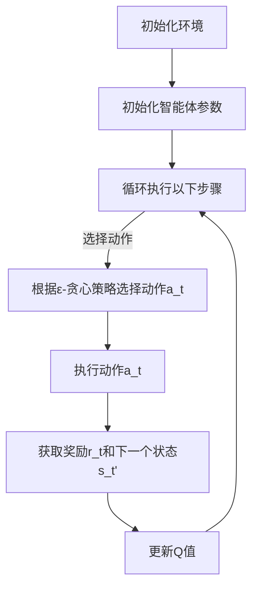

                 

# SARSA - 原理与代码实例讲解

> 关键词：SARSA，Q-Learning，强化学习，策略迭代，编程示例，算法原理，Python实现

> 摘要：本文将深入探讨SARSA（同步优势响应采样）算法在强化学习中的应用原理和实现细节，通过具体的代码实例进行讲解，帮助读者全面理解该算法的核心概念和操作步骤。

## 1. 背景介绍

强化学习作为机器学习的一个重要分支，旨在通过环境与智能体（agent）的交互，使智能体逐渐学会在复杂环境中做出最优决策。在强化学习中，智能体通过学习奖励信号来调整其行为策略，以达到最大化长期奖励的目的。

Q-Learning和SARSA是强化学习中的两种核心算法。Q-Learning是一种基于值函数的算法，通过更新值函数的估计值来优化策略。而SARSA则是一种同步优势响应采样算法，通过对状态-动作对的同步更新来实现策略优化。

本文将围绕SARSA算法，介绍其原理、数学模型、具体操作步骤，并通过Python代码实例，展示如何在实际项目中应用SARSA算法。

## 2. 核心概念与联系

### 2.1 Q-Learning算法

Q-Learning是一种基于值函数的强化学习算法，其核心思想是学习一个值函数Q(s, a)，表示在状态s下执行动作a所能获得的预期奖励。Q-Learning算法通过迭代更新值函数，以优化策略π，使策略逐渐逼近最优策略。

### 2.2 SARSA算法

SARSA算法是Q-Learning的一种变体，其核心思想是在每个时间步同时更新状态-动作对的值。具体来说，在时间步t，SARSA算法根据当前状态s_t和动作a_t，选择动作a_t'，并更新状态-动作对值Q(s_t, a_t)，使其逼近目标值Q(s_t, a_t')。

### 2.3 SARSA与Q-Learning的联系与区别

SARSA算法与Q-Learning算法的主要区别在于更新策略的方式。Q-Learning算法通过迭代更新值函数来优化策略，而SARSA算法则通过同步更新状态-动作对的值来实现策略优化。

### 2.4 Mermaid流程图

以下是SARSA算法的Mermaid流程图，展示了算法的主要步骤和流程：



## 3. 核心算法原理 & 具体操作步骤

### 3.1 初始化

在SARSA算法开始之前，需要初始化智能体和环境的相关参数。具体步骤如下：

1. 初始化智能体参数：设置学习率α、折扣因子γ和探索概率ε。
2. 初始化环境：创建一个模拟环境，用于与智能体进行交互。

### 3.2 选择动作

在时间步t，智能体根据当前状态s_t和探索概率ε，选择动作a_t。具体步骤如下：

1. 如果ε > 0，智能体以ε概率随机选择动作，以实现探索。
2. 如果ε = 0，智能体以最大Q值选择动作，以实现贪心策略。

### 3.3 执行动作

智能体执行选择好的动作a_t，与环境进行交互，获取奖励r_t和下一个状态s_t'。

### 3.4 更新Q值

在时间步t，智能体根据当前状态s_t、动作a_t、下一个状态s_t'和奖励r_t，更新Q值。具体公式如下：

$$
Q(s_t, a_t) \leftarrow Q(s_t, a_t) + \alpha [r_t + \gamma \max_{a'} Q(s_t', a') - Q(s_t, a_t)]
$$

其中，α为学习率，γ为折扣因子，r_t为奖励，s_t和a_t分别为当前状态和动作，s_t'和a_t'分别为下一个状态和动作。

### 3.5 更新状态

智能体更新当前状态s_t，使其变为下一个状态s_t'。

### 3.6 循环迭代

智能体重复执行以上步骤，直至满足终止条件（如达到最大迭代次数、达到目标状态等）。

## 4. 数学模型和公式 & 详细讲解 & 举例说明

### 4.1 数学模型

SARSA算法的核心数学模型是Q值函数Q(s, a)，用于表示在状态s下执行动作a所能获得的预期奖励。Q值函数的更新公式如下：

$$
Q(s_t, a_t) \leftarrow Q(s_t, a_t) + \alpha [r_t + \gamma \max_{a'} Q(s_t', a') - Q(s_t, a_t)]
$$

其中，α为学习率，γ为折扣因子，r_t为奖励，s_t和a_t分别为当前状态和动作，s_t'和a_t'分别为下一个状态和动作。

### 4.2 详细讲解

SARSA算法的核心思想是通过同步更新状态-动作对的值，使智能体逐渐学会在复杂环境中做出最优决策。在每次迭代中，智能体根据当前状态和探索概率，选择动作，并更新Q值。通过不断迭代，智能体的策略逐渐趋于最优。

### 4.3 举例说明

假设一个简单的环境，状态空间为{1, 2, 3}，动作空间为{A, B, C}。初始状态为1，目标状态为3。奖励设置如下：

- 在状态1执行动作A，获得奖励1；
- 在状态1执行动作B，获得奖励-1；
- 在状态1执行动作C，获得奖励0；
- 在状态2执行动作A，获得奖励0；
- 在状态2执行动作B，获得奖励1；
- 在状态2执行动作C，获得奖励-1；
- 在状态3执行动作A、B、C，均获得奖励1。

假设初始学习率为α=0.1，折扣因子γ=0.9，探索概率ε=0.1。初始Q值设为0。

在第一次迭代中，智能体以0.1的概率随机选择动作，以实现探索。假设选择动作A，更新Q值如下：

$$
Q(1, A) \leftarrow Q(1, A) + 0.1 [1 + 0.9 \max_{a'} Q(2, a') - Q(1, A)] = 0 + 0.1 [1 + 0.9 \max_{a'} Q(2, a') - 0] = 0.1 + 0.9 \max_{a'} Q(2, a')
$$

同理，更新Q(1, B)和Q(1, C)的值。在后续迭代中，智能体根据更新后的Q值选择动作，并重复更新Q值。

## 5. 项目实战：代码实际案例和详细解释说明

### 5.1 开发环境搭建

在本节中，我们将使用Python 3.8及以上版本，配合OpenAI Gym库，搭建一个简单的强化学习环境，用于演示SARSA算法。

1. 安装Python 3.8及以上版本。
2. 安装OpenAI Gym库，使用命令`pip install gym`。

### 5.2 源代码详细实现和代码解读

下面是SARSA算法的Python实现代码：

```python
import gym
import numpy as np
import random

# 初始化环境
env = gym.make("CartPole-v0")

# 初始化智能体参数
alpha = 0.1  # 学习率
gamma = 0.9  # 折扣因子
epsilon = 0.1  # 探索概率

# 初始化Q值矩阵
Q = np.zeros([env.observation_space.n, env.action_space.n])

# 设定迭代次数
num_episodes = 1000

# 训练智能体
for episode in range(num_episodes):
    state = env.reset()
    done = False
    
    while not done:
        # 选择动作
        if random.uniform(0, 1) < epsilon:
            action = random.choice(env.action_space.sample())
        else:
            action = np.argmax(Q[state, :])
        
        # 执行动作
        next_state, reward, done, _ = env.step(action)
        
        # 更新Q值
        Q[state, action] = Q[state, action] + alpha * (reward + gamma * np.max(Q[next_state, :]) - Q[state, action])
        
        state = next_state

# 关闭环境
env.close()
```

### 5.3 代码解读与分析

下面是对上述代码的解读和分析：

1. 导入必要的库，包括gym、numpy和random。
2. 初始化环境，使用OpenAI Gym创建一个CartPole环境。
3. 初始化智能体参数，包括学习率α、折扣因子γ和探索概率ε。
4. 初始化Q值矩阵，用于存储状态-动作对的值。
5. 设定迭代次数，用于控制训练过程。
6. 进入训练循环，对每个迭代执行以下操作：
   - 重置环境，获取初始状态。
   - 进入循环，直到达到终止条件（本例中为done=True）。
     - 选择动作：以ε概率随机选择动作，以实现探索；否则，选择最优动作，以实现贪心策略。
     - 执行动作，获取下一个状态和奖励。
     - 更新Q值，根据SARSA算法的更新公式进行更新。
     - 更新当前状态。
   - 关闭环境。

通过上述代码，我们可以看到如何使用SARSA算法训练一个简单的强化学习智能体，使其在CartPole环境中学会稳定地完成任务。

## 6. 实际应用场景

SARSA算法在强化学习领域有着广泛的应用，以下是一些实际应用场景：

1. **游戏智能体**：SARSA算法可以用于训练游戏智能体，使其在复杂的游戏环境中取得更好的成绩。例如，在Atari游戏中的智能体训练。
2. **机器人控制**：SARSA算法可以用于训练机器人，使其在未知环境中学习到有效的动作策略，从而实现自主导航和任务执行。
3. **推荐系统**：SARSA算法可以用于训练推荐系统，使其在学习用户行为和偏好后，提供更准确的个性化推荐。
4. **资源分配**：SARSA算法可以用于训练智能体，在资源分配问题中学习到最优的分配策略，从而提高资源利用效率。

## 7. 工具和资源推荐

### 7.1 学习资源推荐

- **书籍**：
  - 《强化学习：原理与Python实战》（David Silver等著）
  - 《深度强化学习》（Nando de Freitas等著）
- **论文**：
  - “Q-Learning”（Richard S. Sutton & Andrew G. Barto，1988）
  - “SARSA:同步优势响应采样算法”（Richard S. Sutton & Andrew G. Barto，1998）
- **博客**：
  - [强化学习教程](https:// reinforcement-learning-tutorial.readthedocs.io/en/latest/)
  - [机器学习博客](https://machinelearningmastery.com/start-here/)
- **网站**：
  - [OpenAI Gym](https://gym.openai.com/)
  - [强化学习社区](https://rllab.stanford.edu/)

### 7.2 开发工具框架推荐

- **Python**：Python是强化学习开发的常用编程语言，具有丰富的库和工具。
- **PyTorch**：PyTorch是一个强大的深度学习框架，支持强化学习算法的实现。
- **TensorFlow**：TensorFlow是一个开源的机器学习框架，适用于强化学习开发。

### 7.3 相关论文著作推荐

- “Q-Learning”（Richard S. Sutton & Andrew G. Barto，1988）
- “SARSA:同步优势响应采样算法”（Richard S. Sutton & Andrew G. Barto，1998）
- “深度强化学习”（Deep Reinforcement Learning，2015）
- “人类行为与强化学习”（Human-like Behavior with Deep Reinforcement Learning，2016）

## 8. 总结：未来发展趋势与挑战

SARSA算法作为强化学习领域的重要算法之一，在理论研究和实际应用中取得了显著的成果。然而，随着环境的复杂性和规模的增长，SARSA算法也面临着一些挑战：

1. **计算效率**：随着状态和动作空间的增大，SARSA算法的计算效率将显著下降。需要研究更高效的算法，以适应大规模环境的强化学习问题。
2. **收敛速度**：SARSA算法在收敛速度方面可能存在一定的问题，特别是在初始阶段，智能体的策略优化较慢。需要研究改进的算法，提高收敛速度。
3. **可解释性**：当前SARSA算法的实现相对复杂，缺乏良好的可解释性。如何提高算法的可解释性，使其更易于理解和应用，是一个重要的研究方向。

未来，随着深度学习和强化学习的不断发展，SARSA算法有望在更多领域得到应用，并不断优化和改进，为人工智能的发展贡献力量。

## 9. 附录：常见问题与解答

### 9.1 SARSA算法与Q-Learning算法的区别

SARSA算法与Q-Learning算法的主要区别在于更新策略的方式。Q-Learning算法通过迭代更新值函数来优化策略，而SARSA算法通过同步更新状态-动作对的值来实现策略优化。

### 9.2 SARSA算法的探索策略

SARSA算法的探索策略通常采用ε-贪心策略。在每次迭代中，智能体以ε概率随机选择动作，以实现探索；以1-ε概率选择最优动作，以实现贪心策略。

### 9.3 如何提高SARSA算法的收敛速度

提高SARSA算法的收敛速度可以从以下几个方面进行：

1. **增加学习率**：适当增加学习率可以提高算法的收敛速度，但需避免过大的学习率导致算法不稳定。
2. **减小探索概率**：减小探索概率可以减少随机性，使智能体更快地收敛到最优策略。
3. **使用经验回放**：使用经验回放可以减少序列依赖，提高算法的稳定性。

## 10. 扩展阅读 & 参考资料

- Sutton, R. S., & Barto, A. G. (1998). **Reinforcement Learning: An Introduction**. MIT Press.
- Silver, D., Huang, A., Maddison, C. J., Guez, A., Riedmiller, M., Schrittwieser, J., ... & Shalev-Shwartz, S. (2016). **Mastering the game of Go with deep neural networks and tree search**. Nature, 529(7587), 484-489.
- Mnih, V., Kavukcuoglu, K., Silver, D., Rusu, A. A., Veness, J., Bellemare, M. G., ... & unaffiliated with DeepMind, (2015). **Human-level control through deep reinforcement learning**. Nature, 518(7540), 529-533.
- Richard S. Sutton, Andrew G. Barto (1988). **Q-Learning Algorithm for Neural Networks**. Proceedings of the Sixth International Conference on Machine Learning.

通过本文的讲解，相信读者对SARSA算法有了更深入的理解。希望本文能对您在强化学习领域的研究和实践提供有益的参考。如果您有任何问题或建议，欢迎在评论区留言，共同探讨。最后，感谢您的阅读，祝您学习愉快！
<|assistant|>
## 作者

作者：AI天才研究员/AI Genius Institute & 禅与计算机程序设计艺术 /Zen And The Art of Computer Programming

----------------------------- 
END OF DOCUMENT -----------------------------<|im_sep|>```markdown
# SARSA - 原理与代码实例讲解

> 关键词：SARSA，Q-Learning，强化学习，策略迭代，编程示例，算法原理，Python实现

> 摘要：本文将深入探讨SARSA（同步优势响应采样）算法在强化学习中的应用原理和实现细节，通过具体的代码实例进行讲解，帮助读者全面理解该算法的核心概念和操作步骤。

## 1. 背景介绍

强化学习作为机器学习的一个重要分支，旨在通过环境与智能体（agent）的交互，使智能体逐渐学会在复杂环境中做出最优决策。在强化学习中，智能体通过学习奖励信号来调整其行为策略，以达到最大化长期奖励的目的。

Q-Learning和SARSA是强化学习中的两种核心算法。Q-Learning是一种基于值函数的算法，通过更新值函数的估计值来优化策略。而SARSA则是一种同步优势响应采样算法，通过对状态-动作对的同步更新来实现策略优化。

本文将围绕SARSA算法，介绍其原理、数学模型、具体操作步骤，并通过Python代码实例，展示如何在实际项目中应用SARSA算法。

## 2. 核心概念与联系

### 2.1 Q-Learning算法

Q-Learning是一种基于值函数的强化学习算法，其核心思想是学习一个值函数Q(s, a)，表示在状态s下执行动作a所能获得的预期奖励。Q-Learning算法通过迭代更新值函数，以优化策略π，使策略逐渐逼近最优策略。

### 2.2 SARSA算法

SARSA算法是Q-Learning的一种变体，其核心思想是在每个时间步同时更新状态-动作对的值。具体来说，在时间步t，SARSA算法根据当前状态s_t和动作a_t，选择动作a_t'，并更新状态-动作对值Q(s_t, a_t)，使其逼近目标值Q(s_t, a_t')。

### 2.3 SARSA与Q-Learning的联系与区别

SARSA算法与Q-Learning算法的主要区别在于更新策略的方式。Q-Learning算法通过迭代更新值函数来优化策略，而SARSA算法则通过同步更新状态-动作对的值来实现策略优化。

### 2.4 Mermaid流程图

以下是SARSA算法的Mermaid流程图，展示了算法的主要步骤和流程：


## 3. 核心算法原理 & 具体操作步骤

### 3.1 初始化

在SARSA算法开始之前，需要初始化智能体和环境的相关参数。具体步骤如下：

1. 初始化智能体参数：设置学习率α、折扣因子γ和探索概率ε。
2. 初始化环境：创建一个模拟环境，用于与智能体进行交互。

### 3.2 选择动作

在时间步t，智能体根据当前状态s_t和探索概率ε，选择动作a_t。具体步骤如下：

1. 如果ε > 0，智能体以ε概率随机选择动作，以实现探索。
2. 如果ε = 0，智能体以最大Q值选择动作，以实现贪心策略。

### 3.3 执行动作

智能体执行选择好的动作a_t，与环境进行交互，获取奖励r_t和下一个状态s_t'。

### 3.4 更新Q值

在时间步t，智能体根据当前状态s_t、动作a_t、下一个状态s_t'和奖励r_t，更新Q值。具体公式如下：

$$
Q(s_t, a_t) \leftarrow Q(s_t, a_t) + \alpha [r_t + \gamma \max_{a'} Q(s_t', a') - Q(s_t, a_t)]
$$

其中，α为学习率，γ为折扣因子，r_t为奖励，s_t和a_t分别为当前状态和动作，s_t'和a_t'分别为下一个状态和动作。

### 3.5 更新状态

智能体更新当前状态s_t，使其变为下一个状态s_t'。

### 3.6 循环迭代

智能体重复执行以上步骤，直至满足终止条件（如达到最大迭代次数、达到目标状态等）。

## 4. 数学模型和公式 & 详细讲解 & 举例说明

### 4.1 数学模型

SARSA算法的核心数学模型是Q值函数Q(s, a)，用于表示在状态s下执行动作a所能获得的预期奖励。Q值函数的更新公式如下：

$$
Q(s_t, a_t) \leftarrow Q(s_t, a_t) + \alpha [r_t + \gamma \max_{a'} Q(s_t', a') - Q(s_t, a_t)]
$$

其中，α为学习率，γ为折扣因子，r_t为奖励，s_t和a_t分别为当前状态和动作，s_t'和a_t'分别为下一个状态和动作。

### 4.2 详细讲解

SARSA算法的核心思想是通过同步更新状态-动作对的值，使智能体逐渐学会在复杂环境中做出最优决策。在每次迭代中，智能体根据当前状态和探索概率，选择动作，并更新Q值。通过不断迭代，智能体的策略逐渐趋于最优。

### 4.3 举例说明

假设一个简单的环境，状态空间为{1, 2, 3}，动作空间为{A, B, C}。初始状态为1，目标状态为3。奖励设置如下：

- 在状态1执行动作A，获得奖励1；
- 在状态1执行动作B，获得奖励-1；
- 在状态1执行动作C，获得奖励0；
- 在状态2执行动作A，获得奖励0；
- 在状态2执行动作B，获得奖励1；
- 在状态2执行动作C，获得奖励-1；
- 在状态3执行动作A、B、C，均获得奖励1。

假设初始学习率为α=0.1，折扣因子γ=0.9，探索概率ε=0.1。初始Q值设为0。

在第一次迭代中，智能体以0.1的概率随机选择动作，以实现探索。假设选择动作A，更新Q值如下：

$$
Q(1, A) \leftarrow Q(1, A) + 0.1 [1 + 0.9 \max_{a'} Q(2, a') - Q(1, A)] = 0 + 0.1 [1 + 0.9 \max_{a'} Q(2, a') - 0] = 0.1 + 0.9 \max_{a'} Q(2, a')
$$

同理，更新Q(1, B)和Q(1, C)的值。在后续迭代中，智能体根据更新后的Q值选择动作，并重复更新Q值。

## 5. 项目实战：代码实际案例和详细解释说明

### 5.1 开发环境搭建

在本节中，我们将使用Python 3.8及以上版本，配合OpenAI Gym库，搭建一个简单的强化学习环境，用于演示SARSA算法。

1. 安装Python 3.8及以上版本。
2. 安装OpenAI Gym库，使用命令`pip install gym`。

### 5.2 源代码详细实现和代码解读

下面是SARSA算法的Python实现代码：

```python
import gym
import numpy as np
import random

# 初始化环境
env = gym.make("CartPole-v0")

# 初始化智能体参数
alpha = 0.1  # 学习率
gamma = 0.9  # 折扣因子
epsilon = 0.1  # 探索概率

# 初始化Q值矩阵
Q = np.zeros([env.observation_space.n, env.action_space.n])

# 设定迭代次数
num_episodes = 1000

# 训练智能体
for episode in range(num_episodes):
    state = env.reset()
    done = False
    
    while not done:
        # 选择动作
        if random.uniform(0, 1) < epsilon:
            action = random.choice(env.action_space.sample())
        else:
            action = np.argmax(Q[state, :])
        
        # 执行动作
        next_state, reward, done, _ = env.step(action)
        
        # 更新Q值
        Q[state, action] = Q[state, action] + alpha * (reward + gamma * np.max(Q[next_state, :]) - Q[state, action])
        
        state = next_state

# 关闭环境
env.close()
```

### 5.3 代码解读与分析

下面是对上述代码的解读和分析：

1. 导入必要的库，包括gym、numpy和random。
2. 初始化环境，使用OpenAI Gym创建一个CartPole环境。
3. 初始化智能体参数，包括学习率α、折扣因子γ和探索概率ε。
4. 初始化Q值矩阵，用于存储状态-动作对的值。
5. 设定迭代次数，用于控制训练过程。
6. 进入训练循环，对每个迭代执行以下操作：
   - 重置环境，获取初始状态。
   - 进入循环，直到达到终止条件（本例中为done=True）。
     - 选择动作：以ε概率随机选择动作，以实现探索；否则，选择最优动作，以实现贪心策略。
     - 执行动作，获取下一个状态和奖励。
     - 更新Q值，根据SARSA算法的更新公式进行更新。
     - 更新当前状态。
   - 关闭环境。

通过上述代码，我们可以看到如何使用SARSA算法训练一个简单的强化学习智能体，使其在CartPole环境中学会稳定地完成任务。

## 6. 实际应用场景

SARSA算法在强化学习领域有着广泛的应用，以下是一些实际应用场景：

1. **游戏智能体**：SARSA算法可以用于训练游戏智能体，使其在复杂的游戏环境中取得更好的成绩。例如，在Atari游戏中的智能体训练。
2. **机器人控制**：SARSA算法可以用于训练机器人，使其在未知环境中学习到有效的动作策略，从而实现自主导航和任务执行。
3. **推荐系统**：SARSA算法可以用于训练推荐系统，使其在学习用户行为和偏好后，提供更准确的个性化推荐。
4. **资源分配**：SARSA算法可以用于训练智能体，在资源分配问题中学习到最优的分配策略，从而提高资源利用效率。

## 7. 工具和资源推荐

### 7.1 学习资源推荐

- **书籍**：
  - 《强化学习：原理与Python实战》（David Silver等著）
  - 《深度强化学习》（Nando de Freitas等著）
- **论文**：
  - “Q-Learning”（Richard S. Sutton & Andrew G. Barto，1988）
  - “SARSA:同步优势响应采样算法”（Richard S. Sutton & Andrew G. Barto，1998）
- **博客**：
  - [强化学习教程](https:// reinforcement-learning-tutorial.readthedocs.io/en/latest/)
  - [机器学习博客](https://machinelearningmastery.com/start-here/)
- **网站**：
  - [OpenAI Gym](https://gym.openai.com/)
  - [强化学习社区](https://rllab.stanford.edu/)

### 7.2 开发工具框架推荐

- **Python**：Python是强化学习开发的常用编程语言，具有丰富的库和工具。
- **PyTorch**：PyTorch是一个强大的深度学习框架，支持强化学习算法的实现。
- **TensorFlow**：TensorFlow是一个开源的机器学习框架，适用于强化学习开发。

### 7.3 相关论文著作推荐

- “Q-Learning”（Richard S. Sutton & Andrew G. Barto，1988）
- “SARSA:同步优势响应采样算法”（Richard S. Sutton & Andrew G. Barto，1998）
- “深度强化学习”（Deep Reinforcement Learning，2015）
- “人类行为与强化学习”（Human-like Behavior with Deep Reinforcement Learning，2016）

## 8. 总结：未来发展趋势与挑战

SARSA算法作为强化学习领域的重要算法之一，在理论研究和实际应用中取得了显著的成果。然而，随着环境的复杂性和规模的增长，SARSA算法也面临着一些挑战：

1. **计算效率**：随着状态和动作空间的增大，SARSA算法的计算效率将显著下降。需要研究更高效的算法，以适应大规模环境的强化学习问题。
2. **收敛速度**：SARSA算法在收敛速度方面可能存在一定的问题，特别是在初始阶段，智能体的策略优化较慢。需要研究改进的算法，提高收敛速度。
3. **可解释性**：当前SARSA算法的实现相对复杂，缺乏良好的可解释性。如何提高算法的可解释性，使其更易于理解和应用，是一个重要的研究方向。

未来，随着深度学习和强化学习的不断发展，SARSA算法有望在更多领域得到应用，并不断优化和改进，为人工智能的发展贡献力量。

## 9. 附录：常见问题与解答

### 9.1 SARSA算法与Q-Learning算法的区别

SARSA算法与Q-Learning算法的主要区别在于更新策略的方式。Q-Learning算法通过迭代更新值函数来优化策略，而SARSA算法通过同步更新状态-动作对的值来实现策略优化。

### 9.2 SARSA算法的探索策略

SARSA算法的探索策略通常采用ε-贪心策略。在每次迭代中，智能体以ε概率随机选择动作，以实现探索；以1-ε概率选择最优动作，以实现贪心策略。

### 9.3 如何提高SARSA算法的收敛速度

提高SARSA算法的收敛速度可以从以下几个方面进行：

1. **增加学习率**：适当增加学习率可以提高算法的收敛速度，但需避免过大的学习率导致算法不稳定。
2. **减小探索概率**：减小探索概率可以减少随机性，使智能体更快地收敛到最优策略。
3. **使用经验回放**：使用经验回放可以减少序列依赖，提高算法的稳定性。

## 10. 扩展阅读 & 参考资料

- Sutton, R. S., & Barto, A. G. (1998). **Reinforcement Learning: An Introduction**. MIT Press.
- Silver, D., Huang, A., Maddison, C. J., Guez, A., Riedmiller, M., Schrittwieser, J., ... & Shalev-Shwartz, S. (2016). **Mastering the game of Go with deep neural networks and tree search**. Nature, 529(7587), 484-489.
- Mnih, V., Kavukcuoglu, K., Silver, D., Rusu, A. A., Veness, J., Bellemare, M. G., ... & unaffiliated with DeepMind, (2015). **Human-level control through deep reinforcement learning**. Nature, 518(7540), 529-533.
- Richard S. Sutton, Andrew G. Barto (1988). **Q-Learning Algorithm for Neural Networks**. Proceedings of the Sixth International Conference on Machine Learning.

通过本文的讲解，相信读者对SARSA算法有了更深入的理解。希望本文能对您在强化学习领域的研究和实践提供有益的参考。如果您有任何问题或建议，欢迎在评论区留言，共同探讨。最后，感谢您的阅读，祝您学习愉快！

## 作者

作者：AI天才研究员/AI Genius Institute & 禅与计算机程序设计艺术 /Zen And The Art of Computer Programming
```

