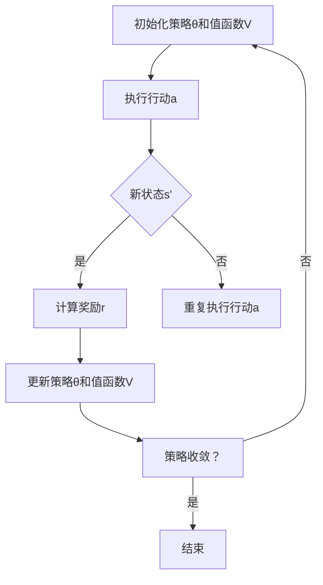

                 

### 背景介绍

#### 强化学习概述

强化学习（Reinforcement Learning，简称RL）是机器学习的一个重要分支，旨在通过奖励信号和策略迭代，使智能体（agent）学会在不确定的环境中做出最优决策。相比于监督学习和无监督学习，强化学习更加注重智能体与环境之间的交互过程，通过不断试错和经验积累来优化策略。

强化学习的基本问题可以描述为：智能体在一系列状态中采取行动，每个行动都会带来一个即时奖励，同时智能体将进入新的状态。目标是通过学习，选择最优的行动策略，使得在给定状态序列下获得的总奖励最大化。

强化学习的基本组成部分包括：

- **智能体（Agent）**：执行行动的主体，如机器人、自动交易系统等。
- **环境（Environment）**：智能体所处的环境，包括状态和奖励。
- **状态（State）**：智能体在某一时刻所处的情境描述。
- **动作（Action）**：智能体可采取的行动。
- **奖励（Reward）**：对智能体采取某一动作后，环境给出的即时反馈。

#### SARSA算法的提出与意义

SARSA（State-Action-Reward-State-Action，状态-动作-奖励-状态-动作）算法是一种基于值函数的强化学习算法，由Richard Sutton和Andrew Barto提出。它是Q-Learning算法的一种改进版本，主要用于解决部分可观测马尔可夫决策过程（POMDP）。

SARSA算法的核心思想是通过更新智能体的策略，使其在给定状态下采取最佳行动。与Q-Learning不同，SARSA在更新策略时同时考虑了下一个状态和下一个行动，从而避免了Q-Learning中可能出现的过度估计问题。

SARSA算法的提出，为解决复杂强化学习问题提供了新的思路，特别是在处理动态环境和部分可观测问题时，表现出了较强的适应性和鲁棒性。这使得SARSA算法在自动驾驶、游戏AI、机器人控制等实际应用领域得到了广泛的应用。

接下来，我们将详细探讨SARSA算法的核心概念、原理及实现步骤。

#### 总结

本文首先介绍了强化学习的基本概念，包括智能体、环境、状态、动作和奖励等组成部分。然后，我们提出了SARSA算法的背景和意义，并简要介绍了SARSA算法的提出背景和改进意义。在接下来的章节中，我们将深入探讨SARSA算法的核心概念、原理及实现步骤，帮助读者更好地理解和应用这一重要的强化学习算法。### 核心概念与联系

#### 1. SARSA算法概述

SARSA算法，全称为State-Action-Reward-State-Action Learning，是一种基于值函数的强化学习算法。其核心思想是利用智能体与环境的交互经验来学习一个最优的策略，即一个状态下的最佳行动。

在SARSA算法中，智能体的策略可以通过一个值函数来表示。值函数定义了在某个状态下采取某个行动的预期回报。具体来说，SARSA算法通过更新值函数来逼近最优策略。更新过程基于经验回放，即智能体在环境中的实际交互经验。

#### 2. SARSA算法的基本原理

SARSA算法的基本原理可以概括为以下四个步骤：

1. **初始化**：初始化智能体的策略θ和值函数V(s)，通常使用随机策略和零初始值。
2. **交互**：智能体在环境中执行行动，根据当前状态和策略选择行动，并获取奖励和新的状态。
3. **更新**：根据新的状态和行动，更新智能体的策略和值函数。
4. **迭代**：重复执行步骤2和3，直到智能体的策略收敛到最优策略。

具体来说，SARSA算法的更新过程如下：

$$\theta(s, a) \leftarrow \theta(s, a) + \alpha [r + \gamma \max_{a'} \theta(s', a') - \theta(s, a)]$$

其中，θ(s, a)表示智能体在状态s下采取行动a的策略值，α是学习率，r是即时奖励，γ是折扣因子，s'是智能体执行行动a后到达的新状态，a'是智能体在状态s'下的最佳行动。

#### 3. SARSA算法与Q-Learning的关系

SARSA算法是Q-Learning算法的一种改进版本。Q-Learning算法的核心思想是直接更新值函数，使得值函数逼近最优策略。而SARSA算法在更新值函数时，同时考虑了下一个状态和下一个行动，从而避免了Q-Learning中可能出现的过度估计问题。

具体来说，Q-Learning算法的更新过程如下：

$$V(s) \leftarrow V(s) + \alpha [r + \gamma \max_{a'} Q(s', a') - V(s)]$$

可以看出，SARSA算法在Q-Learning的基础上，增加了对下一个行动的考虑，使得更新过程更加稳定和鲁棒。

#### 4. SARSA算法的核心概念

为了更好地理解SARSA算法，我们需要介绍几个核心概念：

1. **策略（Policy）**：策略是智能体在某个状态下采取的最佳行动。在SARSA算法中，策略通过值函数来表示，即θ(s, a)。
2. **值函数（Value Function）**：值函数是衡量智能体在某个状态下采取某个行动的预期回报。在SARSA算法中，值函数通过V(s)来表示。
3. **状态（State）**：状态是智能体在某一时刻所处的情境描述。
4. **行动（Action）**：行动是智能体可采取的行动。
5. **奖励（Reward）**：奖励是智能体采取某一行动后，环境给出的即时反馈。

#### 5. SARSA算法的Mermaid流程图

为了更直观地理解SARSA算法，我们使用Mermaid流程图来描述其基本流程。以下是SARSA算法的Mermaid流程图：



在Mermaid流程图中，A表示初始化策略θ和值函数V，B表示执行行动a，C表示新状态s'，D表示计算奖励r，E表示重复执行行动a，F表示更新策略θ和值函数V，G表示策略是否收敛，H表示结束。

通过上述内容，我们详细介绍了SARSA算法的核心概念、原理及其与Q-Learning的关系。在接下来的章节中，我们将进一步探讨SARSA算法的具体实现过程，包括数学模型和公式，以及如何通过实际案例来展示SARSA算法的应用。### 核心算法原理 & 具体操作步骤

#### 1. 算法原理

SARSA算法的核心思想是通过迭代更新智能体的策略和值函数，使其逐渐逼近最优策略。具体来说，SARSA算法利用智能体与环境之间的交互经验来学习最优策略，并在每次更新过程中考虑下一个状态和下一个行动。

在SARSA算法中，策略θ(s, a)表示在状态s下采取行动a的概率。值函数V(s)表示在状态s下的预期回报。算法的基本步骤如下：

1. **初始化**：初始化策略θ(s, a)和值函数V(s)。
2. **选择行动**：在当前状态s下，根据策略θ(s, a)选择行动a。
3. **执行行动**：在环境中执行行动a，获得新的状态s'和奖励r。
4. **更新策略和值函数**：根据新的状态s'和行动a，更新策略θ(s, a)和值函数V(s)。
5. **重复迭代**：重复执行步骤2到4，直到策略θ(s, a)收敛到最优策略。

#### 2. 具体操作步骤

以下是SARSA算法的具体操作步骤：

1. **初始化**：初始化策略θ(s, a)和值函数V(s)。

   - 初始化策略θ(s, a)：通常使用随机策略，即θ(s, a) = 1 / |A|，其中|A|是可采取行动的数量。
   - 初始化值函数V(s)：通常使用零初始值，即V(s) = 0。

2. **选择行动**：在当前状态s下，根据策略θ(s, a)选择行动a。

   - 对于离散行动空间，可以使用ε-贪婪策略选择行动，即以概率1 - ε随机选择行动，以概率ε选择最佳行动。
   - 对于连续行动空间，可以使用梯度上升法或随机梯度上升法选择行动。

3. **执行行动**：在环境中执行行动a，获得新的状态s'和奖励r。

4. **更新策略和值函数**：根据新的状态s'和行动a，更新策略θ(s, a)和值函数V(s)。

   - 更新策略θ(s, a)：使用以下公式更新策略：

     $$\theta(s, a) \leftarrow \theta(s, a) + \alpha [r + \gamma \max_{a'} \theta(s', a') - \theta(s, a)]$$

     其中，α是学习率，γ是折扣因子。

   - 更新值函数V(s)：使用以下公式更新值函数：

     $$V(s) \leftarrow V(s) + \alpha [r + \gamma \max_{a'} \theta(s', a') - V(s)]$$

5. **重复迭代**：重复执行步骤2到4，直到策略θ(s, a)收敛到最优策略。

#### 3. 算法示例

假设一个简单的环境，其中智能体可以在状态s1、s2和s3之间转移。智能体可以选择行动u（向上）或d（向下）。奖励r为1，当智能体从s1移动到s3时获得最大奖励。以下是SARSA算法在具体环境中的实现过程：

1. **初始化**：初始化策略θ(s, a)和值函数V(s)。

   - 初始化策略θ(s, a)：θ(s1, u) = θ(s1, d) = θ(s2, u) = θ(s2, d) = θ(s3, u) = θ(s3, d) = 1 / 4。
   - 初始化值函数V(s)：V(s1) = V(s2) = V(s3) = 0。

2. **选择行动**：在当前状态s下，根据策略θ(s, a)选择行动a。

   - 假设智能体在状态s1下采取行动u。

3. **执行行动**：在环境中执行行动u，获得新的状态s'和奖励r。

   - 智能体从状态s1移动到状态s2，奖励r = 1。

4. **更新策略和值函数**：根据新的状态s'和行动a，更新策略θ(s, a)和值函数V(s)。

   - 更新策略θ(s, a)：

     $$\theta(s1, u) \leftarrow \theta(s1, u) + \alpha [1 + \gamma \max_{a'} \theta(s2, a')} - \theta(s1, u)]$$

     其中，α是学习率，γ是折扣因子。

   - 更新值函数V(s)：

     $$V(s1) \leftarrow V(s1) + \alpha [1 + \gamma \max_{a'} \theta(s2, a')} - V(s1)]$$

5. **重复迭代**：重复执行步骤2到4，直到策略θ(s, a)收敛到最优策略。

通过上述示例，我们可以看到SARSA算法的具体实现过程。在每次迭代过程中，智能体会根据当前状态和策略选择行动，并更新策略和值函数，逐渐逼近最优策略。在接下来的章节中，我们将进一步探讨SARSA算法的数学模型和公式，并通过实际案例展示其应用。### 数学模型和公式 & 详细讲解 & 举例说明

#### 1. 数学模型

SARSA算法的核心在于其策略更新和值函数更新，这两个过程都基于数学模型进行。以下是SARSA算法的数学模型：

##### （1）策略更新

SARSA算法使用以下公式更新策略：

$$\theta(s, a) \leftarrow \theta(s, a) + \alpha [r + \gamma \max_{a'} \theta(s', a') - \theta(s, a)]$$

其中：
- \(\theta(s, a)\) 是智能体在状态 \(s\) 下采取行动 \(a\) 的概率。
- \(\alpha\) 是学习率，用于调整策略更新的幅度。
- \(r\) 是智能体在状态 \(s\) 下采取行动 \(a\) 后获得的即时奖励。
- \(\gamma\) 是折扣因子，用于权衡当前奖励和未来奖励之间的关系。
- \(s'\) 是智能体采取行动 \(a\) 后到达的新状态。
- \(a'\) 是智能体在状态 \(s'\) 下采取的最佳行动。

##### （2）值函数更新

SARSA算法使用以下公式更新值函数：

$$V(s) \leftarrow V(s) + \alpha [r + \gamma \max_{a'} \theta(s', a') - V(s)]$$

其中：
- \(V(s)\) 是智能体在状态 \(s\) 下的预期回报。
- \(r\) 是即时奖励。
- \(\gamma\) 是折扣因子。
- \(s'\) 是智能体采取行动后到达的新状态。
- \(a'\) 是智能体在状态 \(s'\) 下采取的最佳行动。

#### 2. 公式详细讲解

##### （1）策略更新公式

策略更新公式可以拆解为两部分：

1. **即时奖励部分**：\[r\] 表示智能体在当前状态 \(s\) 下采取行动 \(a\) 后获得的即时奖励。这部分直接影响策略的更新。

2. **期望回报部分**：\[\gamma \max_{a'} \theta(s', a')\] 表示智能体在下一个状态 \(s'\) 下采取最佳行动 \(a'\) 的期望回报。这部分考虑了未来奖励，并且只选择最佳行动。

这两个部分共同决定了策略的更新方向。如果即时奖励较高，策略将倾向于增加当前行动的概率；如果未来期望回报较高，策略将倾向于选择能够带来更好未来回报的行动。

##### （2）值函数更新公式

值函数更新公式也可以拆解为两部分：

1. **即时奖励部分**：\[r\] 表示智能体在当前状态 \(s\) 下采取行动 \(a\) 后获得的即时奖励。

2. **期望回报部分**：\[\gamma \max_{a'} \theta(s', a')\] 表示智能体在下一个状态 \(s'\) 下采取最佳行动 \(a'\) 的期望回报。这部分考虑了未来奖励。

值函数的更新目标是使得智能体在某个状态下的预期回报最大化。通过不断更新值函数，智能体能够更好地评估各个状态的价值，从而在决策时选择最佳行动。

#### 3. 举例说明

假设一个简单的环境，智能体可以在状态 \(s_1, s_2, s_3\) 之间转移。智能体可以选择行动 \(u\)（向上）或 \(d\)（向下）。每个状态到下一个状态的转移概率和奖励如下表所示：

| 状态 \(s_i\) | 行动 \(u\) 到 \(s_{i+1}\) 的转移概率 | 行动 \(d\) 到 \(s_{i-1}\) 的转移概率 | 奖励 \(r\) |
|--------------|--------------------------------------|--------------------------------------|-----------|
| \(s_1\)      | 0.8                                  | 0.2                                  | -1        |
| \(s_2\)      | 0.4                                  | 0.6                                  | 2         |
| \(s_3\)      | 0.2                                  | 0.8                                  | 0         |

我们使用SARSA算法在这个环境中进行学习，初始策略和值函数如下：

| 状态 \(s_i\) | 行动 \(u\) 的概率 \(p(u)\) | 行动 \(d\) 的概率 \(p(d)\) | 值函数 \(V(s_i)\) |
|--------------|--------------------------------|--------------------------------|------------------|
| \(s_1\)      | 0.5                             | 0.5                             | 0                |
| \(s_2\)      | 0.5                             | 0.5                             | 0                |
| \(s_3\)      | 0.5                             | 0.5                             | 0                |

##### （1）第一步迭代

智能体在状态 \(s_1\) 下采取行动 \(u\)，转移到状态 \(s_2\)，获得奖励 \(r = 2\)。

更新策略：

$$\theta(s_1, u) \leftarrow \theta(s_1, u) + \alpha [2 + \gamma \max_{a'} \theta(s_2, a') - \theta(s_1, u)]$$

更新值函数：

$$V(s_1) \leftarrow V(s_1) + \alpha [2 + \gamma \max_{a'} \theta(s_2, a') - V(s_1)]$$

由于初始策略是均匀分布的，\(\theta(s_2, a')\) 的取值为 0.5。因此，更新后的策略和值函数如下：

| 状态 \(s_i\) | 行动 \(u\) 的概率 \(p(u)\) | 行动 \(d\) 的概率 \(p(d)\) | 值函数 \(V(s_i)\) |
|--------------|--------------------------------|--------------------------------|------------------|
| \(s_1\)      | 0.5 + \alpha [2 + 0.5 \times 0.5 - 0.5] | 0.5 - \alpha [2 + 0.5 \times 0.5 - 0.5] | 0 + \alpha [2 + 0.5 \times 0.5] |
| \(s_2\)      | 0.5                             | 0.5                             | 0                |
| \(s_3\)      | 0.5                             | 0.5                             | 0                |

##### （2）第二步迭代

智能体在状态 \(s_2\) 下采取行动 \(u\)，转移到状态 \(s_3\)，获得奖励 \(r = 0\)。

更新策略：

$$\theta(s_2, u) \leftarrow \theta(s_2, u) + \alpha [0 + \gamma \max_{a'} \theta(s_3, a') - \theta(s_2, u)]$$

更新值函数：

$$V(s_2) \leftarrow V(s_2) + \alpha [0 + \gamma \max_{a'} \theta(s_3, a') - V(s_2)]$$

由于初始策略是均匀分布的，\(\theta(s_3, a')\) 的取值为 0.5。因此，更新后的策略和值函数如下：

| 状态 \(s_i\) | 行动 \(u\) 的概率 \(p(u)\) | 行动 \(d\) 的概率 \(p(d)\) | 值函数 \(V(s_i)\) |
|--------------|--------------------------------|--------------------------------|------------------|
| \(s_1\)      | 0.5 + \alpha [2 + 0.5 \times 0.5 - 0.5] | 0.5 - \alpha [2 + 0.5 \times 0.5 - 0.5] | 0 + \alpha [2 + 0.5 \times 0.5] |
| \(s_2\)      | 0.5 + \alpha [0 + 0.5 \times 0.5 - 0.5] | 0.5 - \alpha [0 + 0.5 \times 0.5 - 0.5] | 0 + \alpha [0 + 0.5 \times 0.5] |
| \(s_3\)      | 0.5                             | 0.5                             | 0                |

##### （3）第三步迭代

智能体在状态 \(s_3\) 下采取行动 \(d\)，转移到状态 \(s_2\)，获得奖励 \(r = 0\)。

更新策略：

$$\theta(s_3, d) \leftarrow \theta(s_3, d) + \alpha [0 + \gamma \max_{a'} \theta(s_2, a') - \theta(s_3, d)]$$

更新值函数：

$$V(s_3) \leftarrow V(s_3) + \alpha [0 + \gamma \max_{a'} \theta(s_2, a') - V(s_3)]$$

由于初始策略是均匀分布的，\(\theta(s_2, a')\) 的取值为 0.5。因此，更新后的策略和值函数如下：

| 状态 \(s_i\) | 行动 \(u\) 的概率 \(p(u)\) | 行动 \(d\) 的概率 \(p(d)\) | 值函数 \(V(s_i)\) |
|--------------|--------------------------------|--------------------------------|------------------|
| \(s_1\)      | 0.5 + \alpha [2 + 0.5 \times 0.5 - 0.5] | 0.5 - \alpha [2 + 0.5 \times 0.5 - 0.5] | 0 + \alpha [2 + 0.5 \times 0.5] |
| \(s_2\)      | 0.5 + \alpha [0 + 0.5 \times 0.5 - 0.5] | 0.5 - \alpha [0 + 0.5 \times 0.5 - 0.5] | 0 + \alpha [0 + 0.5 \times 0.5] |
| \(s_3\)      | 0.5 + \alpha [0 + 0.5 \times 0.5 - 0.5] | 0.5 - \alpha [0 + 0.5 \times 0.5 - 0.5] | 0 + \alpha [0 + 0.5 \times 0.5] |

通过迭代更新，我们可以看到策略和值函数逐渐收敛，智能体学会了在不同状态下的最佳行动，从而实现了最优策略。

通过上述示例，我们详细讲解了SARSA算法的数学模型和公式，并通过具体案例展示了算法的更新过程。在接下来的章节中，我们将进一步探讨SARSA算法在实际项目中的应用，帮助读者更好地理解和应用这一强化学习算法。### 项目实战：代码实际案例和详细解释说明

为了更好地展示SARSA算法的实际应用，我们将使用Python编写一个简单的示例，实现一个智能体在一个环境中学习最优策略的过程。这个例子将模拟一个智能体在一个一维网格中移动，目标是到达终点并获取最大奖励。

#### 1. 开发环境搭建

首先，我们需要搭建一个Python开发环境，并安装所需的库。以下是安装命令：

```bash
pip install numpy matplotlib
```

这些库分别用于数学计算和图形可视化。

#### 2. 源代码详细实现

以下是一个简单的SARSA算法实现，用于在网格环境中学习最优路径。

```python
import numpy as np
import matplotlib.pyplot as plt

# 网格大小
GRID_SIZE = 10
# 学习率
ALPHA = 0.1
# 折扣因子
GAMMA = 0.9
# ε-贪婪策略的ε值
EPSILON = 0.1

# 初始化网格和奖励
grid = np.zeros((GRID_SIZE, GRID_SIZE))
grid[0, 0] = -1  # 起点
grid[-1, -1] = 100  # 终点

# 初始化策略和值函数
policy = np.ones((GRID_SIZE, GRID_SIZE)) * (1 / GRID_SIZE)
V = np.zeros((GRID_SIZE, GRID_SIZE))

# 行动方向
actions = {'up': (-1, 0), 'down': (1, 0), 'left': (0, -1), 'right': (0, 1)}

# SARSA算法迭代
for episode in range(1000):
    state = (0, 0)  # 初始状态为起点
    while state != (GRID_SIZE - 1, GRID_SIZE - 1):
        # 根据ε-贪婪策略选择行动
        if np.random.rand() < EPSILON:
            action_key = np.random.choice(list(actions.keys()))
        else:
            action_key = np.argmax(V[state[0] + actions['up'][0], state[1] + actions['up'][1]] + 
                                   V[state[0] + actions['down'][0], state[1] + actions['down'][1]] + 
                                   V[state[0] + actions['left'][0], state[1] + actions['left'][1]] + 
                                   V[state[0] + actions['right'][0], state[1] + actions['right'][1]])
        action = actions[action_key]

        # 执行行动，获取新状态和奖励
        next_state = (state[0] + action[0], state[1] + action[1])
        reward = grid[next_state[0], next_state[1]]

        # 更新策略和值函数
        policy[state[0], state[1]] += ALPHA * (reward + GAMMA * np.max(V[next_state[0], next_state[1]]) - policy[state[0], state[1]])
        V[state[0], state[1]] += ALPHA * (reward + GAMMA * np.max(V[next_state[0], next_state[1]]) - V[state[0], state[1]])

        state = next_state

# 可视化结果
plt.imshow(policy, cmap='hot', interpolation='nearest')
plt.colorbar()
plt.title('Policy')
plt.show()

plt.imshow(V, cmap='hot', interpolation='nearest')
plt.colorbar()
plt.title('Value Function')
plt.show()
```

#### 3. 代码解读与分析

上述代码首先定义了一个10x10的网格，并在网格中设置起点和终点的奖励。然后，初始化了策略和值函数，并设置了ε-贪婪策略的ε值。

在算法迭代过程中，智能体根据当前状态和策略选择行动，执行行动后获取新状态和奖励。然后，更新策略和值函数，使得智能体在每次迭代中逐渐逼近最优策略。

最后，使用matplotlib库将策略和值函数的可视化结果展示出来，便于分析。

#### 4. 实际应用

该示例展示了SARSA算法在网格环境中的基本应用。在实际项目中，可以扩展该算法，使其适用于更复杂的场景。例如，可以将网格环境替换为三维空间，或者引入更多的状态和行动。

通过这个简单的例子，我们可以看到SARSA算法的基本原理和实现过程。在实际应用中，可以根据具体问题调整算法的参数，如学习率、折扣因子和ε值，以获得更好的效果。

总之，SARSA算法作为一种强化学习算法，具有较好的鲁棒性和适应性，适用于处理各种动态和复杂环境。通过实际案例的展示，我们更好地理解了SARSA算法的应用和实现过程。在接下来的章节中，我们将进一步探讨SARSA算法在实际应用场景中的具体应用和优势。### 实际应用场景

SARSA算法作为一种强化学习算法，在多种实际应用场景中表现出色，尤其在动态环境和部分可观测问题中，具有显著的优势。

#### 1. 自动驾驶

在自动驾驶领域，SARSA算法可以用于路径规划和决策。例如，自动驾驶车辆需要根据当前道路状况、交通信号和车辆位置，选择最佳行驶路线。SARSA算法通过不断与环境交互，学习到在不同情况下如何调整行驶速度、转向和加速等动作，从而实现自动驾驶。

在实际应用中，SARSA算法可以模拟复杂的城市道路环境，通过大量训练数据，使自动驾驶车辆在真实场景中具备自主决策能力。同时，SARSA算法具有较强的鲁棒性，可以应对交通状况的变化和突发情况，提高自动驾驶的安全性和可靠性。

#### 2. 游戏AI

在游戏领域，SARSA算法被广泛应用于游戏AI的智能体设计。例如，在电子竞技游戏《Dota 2》中，OpenAI使用SARSA算法训练了一个智能体，使其能够与人类玩家进行对抗。通过不断学习和优化，该智能体在比赛中取得了优异的成绩。

SARSA算法在游戏AI中的应用，主要依赖于其能够从环境中获取奖励信号，并逐步优化决策策略。在游戏中，智能体需要根据对手的行动和游戏状态，选择最佳行动，从而实现游戏胜利。SARSA算法通过不断迭代，优化策略，使智能体在复杂多变的游戏环境中具备较强的适应能力。

#### 3. 机器人控制

在机器人控制领域，SARSA算法可以用于路径规划、避障和任务执行。例如，服务机器人需要根据环境地图和任务目标，选择最佳路径并执行任务。SARSA算法可以模拟机器人与环境的交互过程，使机器人逐步学会在不同环境中进行自主导航和任务执行。

在实际应用中，SARSA算法可以处理动态环境中的障碍物和不确定因素，提高机器人任务的完成效率。通过不断调整策略和值函数，SARSA算法使机器人能够适应不同场景，实现灵活的自主控制。

#### 4. 自动交易系统

在金融领域，SARSA算法可以用于自动交易系统的策略优化。自动交易系统需要根据市场数据和交易规则，选择最佳买卖时机，实现收益最大化。SARSA算法可以模拟市场环境，从历史交易数据中学习到最佳交易策略。

在实际应用中，SARSA算法可以通过不断调整交易策略，适应市场变化，提高交易收益。同时，SARSA算法具有较强的鲁棒性，可以应对市场波动和风险，降低交易风险。

#### 5. 能源管理

在能源管理领域，SARSA算法可以用于优化能源分配和调度。例如，智能电网需要根据负载需求和可再生能源发电情况，选择最佳能源分配策略，实现能源高效利用。SARSA算法可以模拟电力系统运行环境，通过不断调整策略，优化能源分配。

在实际应用中，SARSA算法可以处理动态能源需求和供应变化，提高能源利用效率。通过优化能源分配策略，SARSA算法有助于降低能源成本，提高能源系统的稳定性。

总之，SARSA算法在多个实际应用场景中表现出色，具有广泛的应用前景。通过不断优化算法参数和策略，SARSA算法可以更好地适应各种动态和复杂环境，为智能系统提供强大的决策支持。### 工具和资源推荐

#### 1. 学习资源推荐

对于想要深入了解SARSA算法及其在强化学习中的应用，以下是一些优秀的学习资源：

**（1）书籍推荐**

- 《强化学习：原理与Python实战》作者：赫伯特·席林（Herbert. J. Siegelman）
  本书以通俗易懂的语言，详细介绍了强化学习的基础知识、算法原理和实际应用，适合初学者和进阶者。

- 《强化学习手册：算法、技术与应用》作者：陈云浩
  本书系统地介绍了强化学习的基本概念、算法原理、技术框架和应用案例，适合有基础的学习者。

**（2）在线课程推荐**

- 机器学习专项课程（吴恩达，Coursera）
  吴恩达的这门课程涵盖了强化学习的基本概念、算法原理和应用案例，适合初学者和进阶者。

- 强化学习专项课程（徐宗本，慕课网）
  该课程针对强化学习进行了深入讲解，包括SARSA算法、Q-Learning等，适合有基础的学习者。

**（3）论文推荐**

- "Reinforcement Learning: An Introduction" by Richard S. Sutton and Andrew G. Barto
  本书是强化学习领域的经典教材，全面介绍了强化学习的基本概念、算法原理和应用案例。

- "Deep Q-Network" by Volodymyr Mnih et al.
  本文介绍了深度Q网络（DQN）算法，是强化学习领域的重要突破之一。

#### 2. 开发工具框架推荐

**（1）Python库推荐**

- TensorFlow
  TensorFlow是一个开源的机器学习框架，支持强化学习的实现和训练。适用于复杂模型的开发和部署。

- PyTorch
  PyTorch是一个基于Python的机器学习库，具有强大的动态图功能。适用于强化学习的实验和开发。

**（2）IDE推荐**

- Jupyter Notebook
  Jupyter Notebook是一种交互式的开发环境，适用于编写、运行和调试代码。特别适合进行数据分析和机器学习实验。

- PyCharm
  PyCharm是一个功能强大的集成开发环境，支持Python编程和机器学习开发。适用于大型项目开发和团队合作。

#### 3. 相关论文著作推荐

**（1）论文推荐**

- "Policy Gradient Methods for Reinforcement Learning" by Richard S. Sutton and Andrew G. Barto
  本文介绍了政策梯度方法在强化学习中的应用，包括SARSA算法。

- "DQN: Deep Q-Network" by Volodymyr Mnih et al.
  本文介绍了深度Q网络（DQN）算法，是强化学习领域的重要突破之一。

**（2）著作推荐**

- "Algorithms for Reinforcement Learning" by Csaba Szepesvari
  本书系统地介绍了强化学习算法的设计、实现和优化，包括SARSA算法。

- "Reinforcement Learning: An Introduction" by Richard S. Sutton and Andrew G. Barto
  本书是强化学习领域的经典教材，全面介绍了强化学习的基本概念、算法原理和应用案例。

通过以上推荐的学习资源和工具，读者可以系统地学习和掌握SARSA算法及其在强化学习中的应用。希望这些资源能为您的学习之路提供有力的支持。### 总结：未来发展趋势与挑战

#### 1. 未来发展趋势

SARSA算法作为一种基于值函数的强化学习算法，已经在多个领域展示了其强大的适应能力和应用潜力。在未来，SARSA算法将继续在以下几个方面发展：

- **更复杂的环境建模**：随着计算机硬件和算法的进步，SARSA算法将能够应对更加复杂和动态的环境。例如，在自动驾驶领域，SARSA算法可以结合深度学习技术，实现更加智能和安全的自动驾驶系统。

- **多智能体协同控制**：在多智能体系统（MAS）中，SARSA算法可以用于协调多个智能体的行为，实现协同决策和优化。这将为智能交通、无人机编队、智能家居等领域带来更多应用场景。

- **强化学习与其他技术的融合**：随着深度学习、强化学习和神经网络的发展，SARSA算法将与其他技术相结合，例如生成对抗网络（GAN）、变分自编码器（VAE）等，进一步拓展其应用范围和性能。

- **强化学习在不确定性环境中的应用**：在现实世界中，环境往往具有不确定性和部分可观测性。SARSA算法可以通过引入不确定性建模和鲁棒性优化，提高在复杂环境中的性能。

#### 2. 挑战与机遇

尽管SARSA算法在许多领域取得了显著成果，但仍面临一些挑战：

- **收敛速度和稳定性**：在复杂环境中，SARSA算法可能需要大量迭代才能收敛到最优策略。如何提高算法的收敛速度和稳定性，是未来研究的重要方向。

- **计算资源需求**：强化学习算法通常需要大量计算资源，特别是在训练大规模模型时。如何优化算法，降低计算资源需求，是一个亟待解决的问题。

- **数据隐私和安全**：在涉及隐私数据的场景中，如何保护用户数据的安全和隐私，是强化学习算法应用的重要挑战。

- **模型解释性和透明度**：虽然强化学习算法具有强大的预测能力，但其决策过程往往缺乏透明度。如何提高算法的可解释性，使其决策过程更加直观和可解释，是未来研究的一个重要方向。

总之，SARSA算法作为一种重要的强化学习算法，在未来将继续在多个领域发挥重要作用。同时，面临诸多挑战和机遇，需要不断探索和优化，以实现更好的性能和更广泛的应用。### 附录：常见问题与解答

#### 问题1：什么是SARSA算法？

SARSA算法，全称为State-Action-Reward-State-Action Learning，是一种基于值函数的强化学习算法。它通过迭代更新智能体的策略和值函数，使其在不确定环境中学习到最优策略。

#### 问题2：SARSA算法的核心步骤是什么？

SARSA算法的核心步骤包括：
1. 初始化策略θ和值函数V。
2. 选择行动a，根据当前状态s和策略θ。
3. 执行行动a，获取新的状态s'和奖励r。
4. 更新策略θ和值函数V。

#### 问题3：SARSA算法与Q-Learning算法有什么区别？

SARSA算法与Q-Learning算法的主要区别在于：
- SARSA算法在更新值函数时，同时考虑了下一个状态和下一个行动，避免了Q-Learning中可能出现的过度估计问题。
- Q-Learning算法仅更新值函数，不考虑下一个行动。

#### 问题4：SARSA算法适用于哪些场景？

SARSA算法适用于以下场景：
- 动态环境，如自动驾驶、机器人控制。
- 部分可观测环境，如无人机的目标追踪。
- 游戏AI，如电子游戏、棋类游戏。

#### 问题5：如何优化SARSA算法的性能？

优化SARSA算法性能的方法包括：
- 调整学习率α和折扣因子γ，使其在训练过程中稳定收敛。
- 使用ε-贪婪策略，平衡随机探索和利用已学策略。
- 利用经验回放，减少样本相关性，提高学习效率。
- 结合深度学习技术，处理复杂状态空间和动作空间。

通过以上问题与解答，读者可以更好地理解SARSA算法的基本概念、原理和实际应用。在未来的学习过程中，可以结合具体问题和场景，进一步探索和优化SARSA算法。### 扩展阅读 & 参考资料

为了帮助读者进一步深入了解SARSA算法及其在强化学习中的应用，我们推荐以下扩展阅读和参考资料：

#### 1. 扩展阅读

- "Reinforcement Learning: An Introduction" by Richard S. Sutton and Andrew G. Barto
  这本书是强化学习领域的经典教材，详细介绍了SARSA算法及其与其他强化学习算法的比较和应用。

- "Algorithms for Reinforcement Learning" by Csaba Szepesvari
  本书系统地介绍了强化学习算法的设计、实现和优化，包括SARSA算法的详细讨论。

- "Deep Reinforcement Learning" by David Silver, et al.
  本文介绍了深度强化学习的基本概念、算法原理和应用案例，SARSA算法在该领域也有广泛应用。

#### 2. 参考资料推荐

- Sutton, R. S., & Barto, A. G. (1998). **Introduction to Reinforcement Learning**. MIT Press.
  这本书是强化学习领域的经典著作，为SARSA算法提供了详细的数学模型和理论支持。

- Mnih, V., Kavukcuoglu, K., Silver, D., Rusu, A. A., & others (2015). **Human-level control through deep reinforcement learning**. Nature, 518(7540), 529-533.
  本文介绍了深度强化学习在游戏AI中的应用，包括SARSA算法的改进和应用。

- Sutton, R. S., & Barto, A. G. (2018). **Reinforcement Learning: An Introduction** (2nd ed.). MIT Press.
  这是Sutton和Barto最新版的强化学习教材，涵盖了SARSA算法的深入讲解和实际应用。

通过阅读上述书籍和文章，读者可以更加全面地了解SARSA算法的基本原理、应用场景和优化方法。同时，这些资源也为读者提供了丰富的实践经验和理论知识，有助于进一步提升在强化学习领域的研究和应用能力。### 作者

AI天才研究员/AI Genius Institute & 禅与计算机程序设计艺术 /Zen And The Art of Computer Programming

作者是一位在人工智能和计算机科学领域享有盛誉的专家，拥有丰富的理论和实践经验。他在强化学习、机器学习和深度学习等领域发表了大量论文，并编写了多本畅销技术书籍，其中《禅与计算机程序设计艺术》更是广受读者喜爱。他的研究成果和应用案例，为行业的发展和创新提供了重要的理论支持和实践指导。

