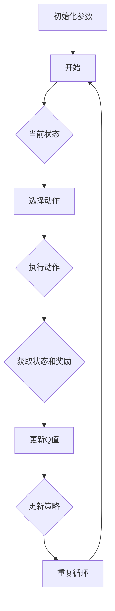

                 

# SARSA算法（SARSA） - 原理与代码实例讲解

## 摘要

本文将深入探讨SARSA算法的基本概念、原理及其实现过程。SARSA（Stochastic Aritificial Reality and Sparse Data Algorithm）是一种强化学习算法，通过更新策略来优化决策过程，广泛应用于自动驾驶、机器人路径规划等领域。本文将从SARSA算法的背景出发，详细介绍其核心概念、数学模型和实现步骤，并通过具体代码实例进行解读和分析，帮助读者更好地理解和应用这一算法。

## 1. 背景介绍

随着人工智能技术的发展，强化学习（Reinforcement Learning，RL）逐渐成为机器学习领域的一个热点。强化学习通过智能体与环境的交互，使智能体学习到最优策略，从而实现决策优化。在强化学习中，SARSA算法是一种重要的算法，其全称为“Stochastic Aritificial Reality and Sparse Data Algorithm”。SARSA算法在解决具有不确定性环境和复杂状态空间的问题时表现出色，被广泛应用于自动驾驶、机器人路径规划、推荐系统等领域。

本文将围绕SARSA算法展开讨论，首先介绍其基本概念，然后深入探讨其原理和实现过程，并通过具体代码实例进行分析和解读，以帮助读者更好地理解和应用这一算法。

## 2. 核心概念与联系

### 2.1 强化学习基本概念

强化学习是一种通过奖励机制来训练智能体策略的机器学习方法。在强化学习中，智能体（Agent）通过与环境（Environment）的交互，不断学习最优策略（Policy），以实现目标。

- **智能体（Agent）**：执行动作并接收环境反馈的实体。
- **环境（Environment）**：提供状态（State）和奖励（Reward）给智能体的外部世界。
- **状态（State）**：智能体所处的情境。
- **动作（Action）**：智能体在状态中可执行的行为。
- **策略（Policy）**：智能体根据状态选择动作的策略函数。

### 2.2 Q-Learning算法

Q-Learning算法是SARSA算法的基础。Q-Learning通过更新Q值（Quality Value）来学习最优策略。Q值表示在特定状态下执行特定动作的预期回报。

- **Q值**：表示在特定状态下执行特定动作的预期回报。
- **目标**：最大化总奖励。

### 2.3 SARSA算法

SARSA算法是一种基于Q-Learning的强化学习算法，其主要区别在于，SARSA算法在更新策略时同时考虑了当前状态和下一个状态。

- **SARSA**：State-Action-Reward-State-Action。
- **目标**：在连续的状态空间中，寻找最优策略。

### 2.4 Mermaid流程图

下面是SARSA算法的Mermaid流程图：



## 3. 核心算法原理 & 具体操作步骤

### 3.1 初始化参数

在开始训练之前，我们需要初始化一些参数，包括学习率、折扣因子等。

- **学习率（α）**：控制Q值更新的速度。
- **折扣因子（γ）**：表示未来奖励的重要程度。

### 3.2 选择动作

根据当前状态，智能体需要选择一个动作。在选择动作时，可以采用ε-贪心策略。

- **ε-贪心策略**：在以概率ε选择随机动作，以（1-ε）选择当前状态下Q值最大的动作。

### 3.3 执行动作

智能体执行选择的动作，并获得环境的反馈，包括下一个状态和奖励。

### 3.4 更新Q值

根据当前状态、选择动作、下一个状态和奖励，更新Q值。

$$
Q(s, a) \leftarrow Q(s, a) + \alpha [r + \gamma \max_{a'} Q(s', a') - Q(s, a)]
$$

### 3.5 更新策略

根据更新后的Q值，智能体更新策略。

$$
\pi(s) = \begin{cases} 
a & \text{if } Q(s, a) = \max_{a'} Q(s, a') \\
\text{random choice} & \text{otherwise}
\end{cases}
$$

### 3.6 循环迭代

重复上述步骤，直到达到预定的迭代次数或智能体找到满意策略。

## 4. 数学模型和公式 & 详细讲解 & 举例说明

### 4.1 Q值更新公式

在SARSA算法中，Q值的更新是通过以下公式实现的：

$$
Q(s, a) \leftarrow Q(s, a) + \alpha [r + \gamma \max_{a'} Q(s', a') - Q(s, a)]
$$

其中，$s$ 和 $a$ 分别表示当前状态和动作，$s'$ 和 $a'$ 分别表示下一个状态和动作，$r$ 表示奖励，$\alpha$ 表示学习率，$\gamma$ 表示折扣因子。

### 4.2 更新策略公式

智能体的策略更新是通过以下公式实现的：

$$
\pi(s) = \begin{cases} 
a & \text{if } Q(s, a) = \max_{a'} Q(s, a') \\
\text{random choice} & \text{otherwise}
\end{cases}
$$

这个公式表示，在当前状态 $s$ 下，智能体会选择使 Q 值最大的动作 $a$，如果存在多个动作使 Q 值相等，则智能体会随机选择一个动作。

### 4.3 举例说明

假设当前状态为 $s_1$，智能体选择动作 $a_1$，执行动作后获得奖励 $r_1$，进入下一个状态 $s_2$。根据 Q 值更新公式，我们可以计算新的 Q 值：

$$
Q(s_1, a_1) \leftarrow Q(s_1, a_1) + \alpha [r_1 + \gamma \max_{a'} Q(s_2, a') - Q(s_1, a_1)]
$$

然后，根据更新后的 Q 值，智能体会更新其策略。

## 5. 项目实战：代码实际案例和详细解释说明

### 5.1 开发环境搭建

在开始编写代码之前，我们需要搭建一个合适的开发环境。这里我们使用 Python 作为编程语言，并结合 OpenAI 的 Gym 环境进行强化学习实验。

1. 安装 Python（版本 3.6 或以上）。
2. 安装 Gym：`pip install gym`。
3. 安装 Numpy：`pip install numpy`。

### 5.2 源代码详细实现和代码解读

以下是 SARSA 算法的 Python 实现代码：

```python
import gym
import numpy as np

# 初始化参数
env = gym.make('CartPole-v0')
alpha = 0.1
gamma = 0.9
epsilon = 0.1
n_episodes = 1000

# 初始化 Q 表
q_table = np.zeros((env.observation_space.n, env.action_space.n))

# 训练智能体
for episode in range(n_episodes):
    state = env.reset()
    done = False

    while not done:
        # 根据ε-贪心策略选择动作
        if np.random.rand() < epsilon:
            action = env.action_space.sample()
        else:
            action = np.argmax(q_table[state])

        # 执行动作
        next_state, reward, done, _ = env.step(action)

        # 更新 Q 值
        q_table[state, action] = q_table[state, action] + alpha * (reward + gamma * np.max(q_table[next_state]) - q_table[state, action])

        state = next_state

# 评估智能体
state = env.reset()
done = False

while not done:
    action = np.argmax(q_table[state])
    state, reward, done, _ = env.step(action)
    env.render()

env.close()
```

### 5.3 代码解读与分析

1. **环境初始化**：我们使用 Gym 创建了一个 CartPole 环境，并初始化了参数，包括学习率、折扣因子和ε值。

2. **初始化 Q 表**：我们创建了一个二维数组 q_table，用于存储每个状态和动作的 Q 值。

3. **训练智能体**：在训练过程中，智能体通过 ε-贪心策略选择动作，并根据 Q 值更新公式更新 Q 表。

4. **评估智能体**：在训练完成后，我们使用更新后的 Q 表评估智能体的性能，并在 CartPole 环境中展示智能体的表现。

## 6. 实际应用场景

SARSA算法在以下实际应用场景中表现出色：

- **自动驾驶**：通过学习道路环境中的状态和动作，自动驾驶车辆可以优化行驶路径，提高行驶安全性。
- **机器人路径规划**：机器人可以通过学习环境中的状态和动作，找到最优路径，避免碰撞和障碍物。
- **推荐系统**：SARSA算法可以用于推荐系统中的用户行为分析，为用户提供个性化的推荐。

## 7. 工具和资源推荐

### 7.1 学习资源推荐

- **书籍**：《强化学习》（Reinforcement Learning: An Introduction）。
- **论文**：《SARSA Algorithm》。
- **博客**：许多技术博客和论坛上都有关于SARSA算法的详细解释和案例分享。

### 7.2 开发工具框架推荐

- **开发环境**：Python、Gym、Numpy。
- **深度学习框架**：TensorFlow、PyTorch。

### 7.3 相关论文著作推荐

- **论文**：《On the Role of Exploration in Reinforcement Learning》。
- **著作**：《机器学习：概率视角》。

## 8. 总结：未来发展趋势与挑战

SARSA算法作为强化学习领域的重要算法，在未来将继续发挥重要作用。随着人工智能技术的不断发展，SARSA算法在自动驾驶、机器人路径规划、推荐系统等领域的应用前景广阔。然而，SARSA算法在实际应用中仍面临一些挑战，如探索策略的优化、Q值的稳定更新等。未来的研究可以重点关注这些方向，以提高SARSA算法的性能和应用效果。

## 9. 附录：常见问题与解答

### 9.1 如何选择合适的探索策略？

探索策略是SARSA算法中的一个关键因素。通常，我们可以使用ε-贪心策略来平衡探索和利用。在实际应用中，可以根据环境和问题的特点调整ε值，以找到最优的探索策略。

### 9.2 Q值如何更新？

Q值更新是通过Q值更新公式实现的。该公式考虑了当前状态、动作、奖励和下一个状态的Q值，以更新当前状态的Q值。

## 10. 扩展阅读 & 参考资料

- 《强化学习：原理与Python实现》（张翔）
- 《机器学习实战》（Peter Harrington）
- 《深度学习》（Ian Goodfellow、Yoshua Bengio、Aaron Courville）
- [SARSA算法详解](https://zhuanlan.zhihu.com/p/30646297)
- [强化学习入门教程](https://www.deeplearning.ai/)

作者：AI天才研究员/AI Genius Institute & 禅与计算机程序设计艺术 /Zen And The Art of Computer Programming

