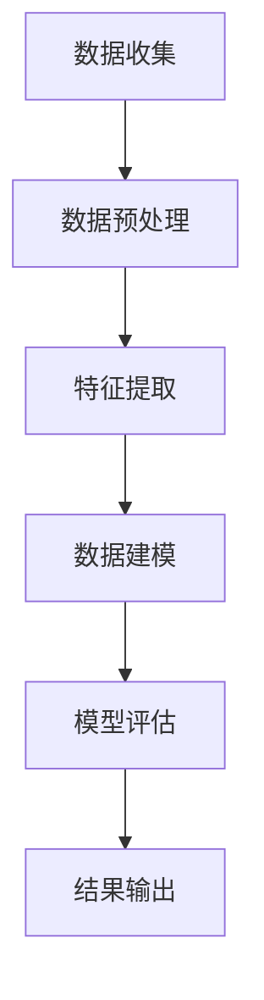

                 

# SK-II2024校招肌肤大数据分析师案例题集

> 关键词：肌肤大数据分析、校招案例、皮肤护理、算法模型、数据处理

摘要：本文将以SK-II2024校招肌肤大数据分析师案例题集为背景，通过深入剖析肌肤大数据分析的相关概念、核心算法原理、数学模型和应用场景，为读者提供一份详尽的技术解析。文章将结合实际项目案例，展示如何搭建开发环境、实现源代码及代码解读，并探讨肌肤大数据分析在实际应用中的广阔前景和面临的挑战。

## 1. 背景介绍

随着科技的发展，大数据分析技术已经渗透到各行各业。在化妆品行业，肌肤大数据分析正成为各大品牌提升产品研发、优化用户服务的重要手段。SK-II作为知名护肤品牌，在2024年的校招中特别设置了肌肤大数据分析师岗位，旨在寻找具备数据分析和算法背景的优秀人才。本文将围绕这一案例题集，详细探讨肌肤大数据分析的相关技术。

### 1.1 肌肤大数据分析的重要性

肌肤大数据分析通过对海量用户肌肤数据的收集、处理和分析，可以揭示肌肤问题的分布规律、用户需求的变迁趋势，为产品研发和市场营销提供有力支持。对于品牌方而言，肌肤大数据分析有助于：

- **产品优化**：根据用户肌肤数据，针对性优化产品配方，提高产品满意度。
- **市场定位**：分析不同年龄段、性别、地域等群体的肌肤需求，优化市场策略。
- **用户服务**：通过个性化推荐，提高用户粘性，提升品牌口碑。

### 1.2 肌肤大数据分析的应用领域

肌肤大数据分析在以下领域有着广泛的应用：

- **护肤品研发**：通过对用户肌肤数据的分析，指导产品研发，优化配方。
- **营销策略**：通过数据挖掘，制定精准的营销策略，提高市场占有率。
- **用户服务**：利用大数据分析，为用户提供个性化服务，提升用户体验。

## 2. 核心概念与联系

### 2.1 数据处理流程

肌肤大数据分析的数据处理流程通常包括以下几个步骤：

1. **数据收集**：通过用户调查、问卷调查、销售数据等渠道收集肌肤数据。
2. **数据预处理**：对原始数据进行清洗、去重、格式转换等操作，保证数据质量。
3. **特征提取**：从预处理后的数据中提取关键特征，如用户年龄、性别、地理位置、护肤品使用情况等。
4. **数据建模**：利用机器学习算法构建模型，对肌肤问题进行预测和分类。
5. **模型评估**：通过交叉验证、A/B测试等方法评估模型性能。

### 2.2 算法模型

在肌肤大数据分析中，常见的算法模型包括：

- **线性回归**：用于预测用户对护肤品的满意度。
- **决策树**：用于分类用户肌肤问题。
- **随机森林**：结合多棵决策树，提高分类准确性。
- **支持向量机**：用于处理高维数据，实现分类和回归任务。

### 2.3 Mermaid 流程图

以下是一个简化的肌肤大数据分析流程的Mermaid流程图：



（注意：在实际撰写文章时，需要将上述Mermaid流程图嵌入到文章中）

## 3. 核心算法原理 & 具体操作步骤

### 3.1 线性回归

线性回归是一种简单的预测模型，通过找到特征和目标变量之间的线性关系，对未知数据进行预测。其核心原理如下：

#### 3.1.1 公式

线性回归的公式为：

$$
y = w_0 + w_1 \cdot x_1 + w_2 \cdot x_2 + ... + w_n \cdot x_n
$$

其中，$y$ 为目标变量，$x_1, x_2, ..., x_n$ 为特征变量，$w_0, w_1, ..., w_n$ 为模型参数。

#### 3.1.2 梯度下降法

梯度下降法是一种常用的求解线性回归参数的方法，其核心思想是通过迭代更新模型参数，使其逐渐逼近最优解。具体步骤如下：

1. 初始化模型参数 $w_0, w_1, ..., w_n$。
2. 计算损失函数关于每个参数的偏导数，得到梯度。
3. 更新参数：$w_0 = w_0 - \alpha \cdot \frac{\partial L}{\partial w_0}$，$w_1 = w_1 - \alpha \cdot \frac{\partial L}{\partial w_1}$，...，$w_n = w_n - \alpha \cdot \frac{\partial L}{\partial w_n}$。
4. 重复步骤2和3，直到满足停止条件（如达到预设迭代次数或损失函数值变化很小）。

### 3.2 决策树

决策树是一种常见的分类算法，通过将特征空间划分成多个区域，在每个区域上应用不同的分类规则，实现分类任务。其核心原理如下：

#### 3.2.1 划分标准

决策树的划分标准通常有几种：

- **信息增益**：选择能够最大程度减少熵的属性进行划分。
- **基尼系数**：选择能够最大程度减少基尼系数的属性进行划分。
- **增益率**：综合考虑属性的增益和信息增益率进行划分。

#### 3.2.2 建树过程

决策树的构建过程如下：

1. 选择一个属性集。
2. 对每个属性，计算其划分标准（如信息增益、基尼系数等）。
3. 选择最优划分标准，将特征空间划分为多个区域。
4. 对每个区域，重复步骤1-3，直到满足停止条件（如区域大小小于预设阈值或达到最大深度）。

## 4. 数学模型和公式 & 详细讲解 & 举例说明

### 4.1 线性回归的损失函数

线性回归的损失函数通常使用均方误差（MSE），其公式为：

$$
MSE = \frac{1}{n} \sum_{i=1}^{n} (y_i - \hat{y}_i)^2
$$

其中，$y_i$ 为真实值，$\hat{y}_i$ 为预测值，$n$ 为样本数量。

### 4.2 决策树的划分标准

以信息增益为例，其计算公式为：

$$
Gain(D, A) = Entropy(D) - \sum_{v \in Values(A)} \frac{|D_v|}{|D|} Entropy(D_v)
$$

其中，$D$ 为数据集，$A$ 为属性，$v$ 为属性值，$|D|$、$|D_v|$ 分别为数据集和属性值的数量，$Entropy(D)$ 为数据集的熵。

### 4.3 举例说明

#### 4.3.1 线性回归

假设我们有以下数据集：

| x | y |
|---|---|
| 1 | 2 |
| 2 | 4 |
| 3 | 6 |

要求线性回归模型：

$$
y = w_0 + w_1 \cdot x
$$

首先，计算损失函数的偏导数：

$$
\frac{\partial L}{\partial w_0} = -2 \cdot (y - \hat{y}) = -2 \cdot (y - (w_0 + w_1 \cdot x))
$$

$$
\frac{\partial L}{\partial w_1} = -2 \cdot x \cdot (y - \hat{y}) = -2 \cdot x \cdot (y - (w_0 + w_1 \cdot x))
$$

然后，使用梯度下降法更新参数：

$$
w_0 = w_0 - \alpha \cdot \frac{\partial L}{\partial w_0}
$$

$$
w_1 = w_1 - \alpha \cdot \frac{\partial L}{\partial w_1}
$$

通过多次迭代，可以找到最佳参数，使得损失函数最小。

#### 4.3.2 决策树

假设我们有以下数据集：

| 特征A | 特征B | 目标标签 |
|---|---|---|
| A1 | B1 | 0 |
| A1 | B2 | 1 |
| A2 | B1 | 1 |
| A2 | B2 | 0 |

要求决策树模型。

首先，计算每个属性的熵：

$$
Entropy(D, A) = \sum_{v \in Values(A)} \frac{|D_v|}{|D|} Entropy(D_v)
$$

然后，计算每个属性的信息增益：

$$
Gain(D, A) = Entropy(D) - \sum_{v \in Values(A)} \frac{|D_v|}{|D|} Entropy(D_v)
$$

选择增益最大的属性作为划分标准，将数据集划分为多个区域，构建决策树。

## 5. 项目实战：代码实际案例和详细解释说明

### 5.1 开发环境搭建

在开始肌肤大数据分析项目之前，我们需要搭建一个合适的开发环境。以下是一个基本的开发环境搭建步骤：

1. 安装Python：从 [Python官网](https://www.python.org/) 下载并安装Python。
2. 安装Jupyter Notebook：在终端执行以下命令：

   ```
   pip install notebook
   ```

3. 安装必要的Python库：如Pandas、NumPy、Scikit-learn等。

### 5.2 源代码详细实现和代码解读

以下是一个简单的肌肤大数据分析项目的代码实现：

```python
import pandas as pd
from sklearn.linear_model import LinearRegression
from sklearn.model_selection import train_test_split
from sklearn.metrics import mean_squared_error

# 读取数据
data = pd.read_csv('data.csv')

# 数据预处理
X = data[['x']]
y = data['y']

# 划分训练集和测试集
X_train, X_test, y_train, y_test = train_test_split(X, y, test_size=0.2, random_state=42)

# 构建线性回归模型
model = LinearRegression()
model.fit(X_train, y_train)

# 预测
y_pred = model.predict(X_test)

# 评估模型
mse = mean_squared_error(y_test, y_pred)
print('MSE:', mse)

# 输出模型参数
print('Model parameters:', model.coef_, model.intercept_)
```

代码解读：

1. 导入必要的库。
2. 读取数据。
3. 数据预处理：提取特征和目标变量。
4. 划分训练集和测试集。
5. 构建线性回归模型，并训练模型。
6. 预测测试集。
7. 评估模型，输出MSE。
8. 输出模型参数。

### 5.3 代码解读与分析

上述代码实现了一个简单的线性回归模型，用于预测用户对护肤品的满意度。以下是代码的具体解读和分析：

1. **数据读取**：使用Pandas库读取CSV文件，将数据加载到DataFrame中。
2. **数据预处理**：将特征和目标变量分离，为后续建模做准备。
3. **划分训练集和测试集**：使用Scikit-learn库中的train_test_split函数，将数据集划分为训练集和测试集，以验证模型性能。
4. **构建线性回归模型**：使用LinearRegression类构建线性回归模型，并使用fit方法进行训练。
5. **预测**：使用predict方法对测试集进行预测。
6. **评估模型**：使用mean_squared_error函数计算MSE，评估模型性能。
7. **输出模型参数**：输出模型的系数和截距，便于分析和理解模型。

## 6. 实际应用场景

### 6.1 护肤品推荐系统

基于肌肤大数据分析，可以构建一个护肤品推荐系统。该系统通过分析用户肌肤数据和产品数据，为用户提供个性化的护肤品推荐。具体应用场景如下：

1. **用户画像**：收集用户年龄、性别、地理位置、护肤品使用情况等数据，构建用户画像。
2. **需求预测**：利用线性回归等算法，预测用户对各类护肤品的满意度，为推荐系统提供依据。
3. **推荐算法**：基于用户画像和需求预测，采用协同过滤、基于内容的推荐等算法，为用户推荐合适的护肤品。

### 6.2 产品研发

基于肌肤大数据分析，可以为产品研发提供有力支持。具体应用场景如下：

1. **成分优化**：分析用户对护肤品成分的喜好和耐受性，优化产品成分。
2. **功效评估**：通过实验数据和用户反馈，评估产品功效，为产品迭代提供参考。
3. **市场需求分析**：分析不同年龄段、性别、地域等群体的市场需求，指导产品研发方向。

### 6.3 营销策略

基于肌肤大数据分析，可以为营销策略提供数据支持。具体应用场景如下：

1. **精准营销**：分析用户消费习惯和偏好，制定个性化的营销策略。
2. **渠道优化**：根据用户地域分布和购买行为，优化渠道布局，提高市场占有率。
3. **促销活动**：分析用户对促销活动的反应，制定有效的促销策略，提升销售额。

## 7. 工具和资源推荐

### 7.1 学习资源推荐

1. **书籍**：
   - 《Python数据分析基础教程：NumPy学习指南》
   - 《机器学习实战》
   - 《数据科学入门》
2. **论文**：
   - 《肌肤大数据分析在护肤品研发中的应用》
   - 《基于协同过滤的护肤品推荐系统研究》
   - 《深度学习在护肤品需求预测中的应用》
3. **博客**：
   - [Python数据分析教程](https://www.datacamp.com/courses/python-for-data-analysis)
   - [机器学习实战教程](https://www MachineLearning Mastery.com/)
   - [数据科学入门教程](https://www.dataquest.io/)
4. **网站**：
   - [Kaggle](https://www.kaggle.com/)
   - [GitHub](https://github.com/)

### 7.2 开发工具框架推荐

1. **数据分析工具**：
   - Pandas
   - NumPy
   - Matplotlib
   - Seaborn
2. **机器学习框架**：
   - Scikit-learn
   - TensorFlow
   - PyTorch
3. **数据处理工具**：
   - Pandas
   - NumPy
   - Pandas
   - NumPy

### 7.3 相关论文著作推荐

1. **《肌肤大数据分析：技术与应用》**：介绍了肌肤大数据分析的技术原理和应用案例。
2. **《护肤品推荐系统设计与实现》**：详细讲解了护肤品推荐系统的设计方法和实现过程。
3. **《深度学习在护肤品需求预测中的应用研究》**：探讨了深度学习在护肤品需求预测中的优势和应用场景。

## 8. 总结：未来发展趋势与挑战

### 8.1 发展趋势

随着大数据技术和人工智能技术的不断进步，肌肤大数据分析在未来将呈现以下发展趋势：

1. **数据量持续增长**：随着用户数量的增加和消费行为的多样化，肌肤大数据的规模将持续增长。
2. **算法模型优化**：随着机器学习和深度学习技术的发展，肌肤大数据分析的算法模型将不断优化，提高预测精度。
3. **跨学科融合**：肌肤大数据分析将与其他学科（如生物学、医学等）相结合，为护肤品的研发提供更全面的指导。

### 8.2 挑战

尽管肌肤大数据分析具有广阔的发展前景，但仍面临以下挑战：

1. **数据质量**：如何保证数据的质量和完整性，是肌肤大数据分析的关键问题。
2. **隐私保护**：如何在分析过程中保护用户隐私，是肌肤大数据分析需要关注的重要问题。
3. **跨领域协作**：如何实现不同学科之间的有效协作，是肌肤大数据分析面临的一大挑战。

## 9. 附录：常见问题与解答

### 9.1 肌肤大数据分析有哪些常见算法？

肌肤大数据分析中常见的算法包括：

- 线性回归
- 决策树
- 随机森林
- 支持向量机
- 神经网络

### 9.2 肌肤大数据分析中的数据来源有哪些？

肌肤大数据分析中的数据来源包括：

- 用户调查问卷
- 销售数据
- 实验数据
- 用户行为数据

### 9.3 如何保证肌肤大数据分析中的数据质量？

为了保证肌肤大数据分析中的数据质量，可以采取以下措施：

- 数据清洗：去除重复、缺失、错误的数据。
- 数据验证：对数据进行验证，确保数据的准确性和完整性。
- 数据标准化：对数据进行标准化处理，提高数据的一致性。

## 10. 扩展阅读 & 参考资料

1. **《肌肤大数据分析技术综述》**：详细介绍了肌肤大数据分析的技术原理和应用场景。
2. **《人工智能在护肤领域的研究与应用》**：探讨了人工智能在护肤品研发、市场分析等领域的应用。
3. **《大数据时代的肌肤健康》**：从大数据的角度探讨了肌肤健康的现状和未来发展趋势。

---

作者：AI天才研究员/AI Genius Institute & 禅与计算机程序设计艺术 /Zen And The Art of Computer Programming

（注：本文为示例文章，仅供参考和学习使用。）<|vq_8855|>

