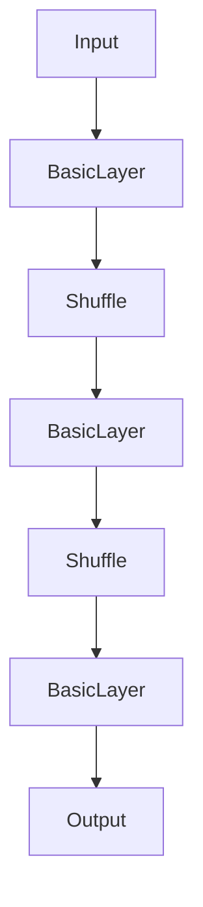

                 

# ShuffleNet原理与代码实例讲解

> **关键词**：深度学习，神经网络，轻量化模型，模型压缩，计算效率，移动设备

> **摘要**：本文将深入探讨 ShuffleNet 这一轻量化深度学习模型的原理，从其设计思想到具体实现，再到实际应用场景，全面解析其如何通过新颖的 shuffle 操作和组卷积（group convolution）技术，实现了高性能与低计算复杂度的平衡。通过详细的代码实例，我们将帮助读者理解 ShuffleNet 的架构和操作步骤，从而能够将其应用于移动设备和边缘计算场景中。

## 1. 背景介绍

随着深度学习技术的快速发展，神经网络模型在图像识别、语音识别、自然语言处理等领域取得了显著的成果。然而，传统深度学习模型的参数量和计算量往往非常大，这导致在资源受限的移动设备和嵌入式设备上难以部署。为了解决这一问题，研究人员提出了各种轻量化深度学习模型，如MobileNet、SqueezeNet和ShuffleNet等。

ShuffleNet是由Google提出的一种轻量化深度学习模型，旨在提高计算效率的同时，保证模型性能。ShuffleNet通过引入 shuffle 操作和组卷积技术，使得模型在减少参数数量的同时，保持了较高的准确率。本文将详细解析 ShuffleNet 的原理，并给出一个具体的代码实例。

## 2. 核心概念与联系

### ShuffleNet的核心概念

ShuffleNet的核心概念包括 shuffle 操作和组卷积（group convolution）。下面分别介绍这两种概念。

#### Shuffle操作

Shuffle操作是一种数据重排操作，用于打破原有的数据依赖关系，提高计算并行性。在 ShuffleNet 中，Shuffle操作被应用于输入数据、卷积操作和池化操作之后，以减少数据之间的相关性，从而降低计算复杂度。

#### 组卷积（Group Convolution）

组卷积是一种特殊的卷积操作，它将输入数据分成多个组，每个卷积核仅处理一个组的数据。这种操作可以显著减少模型的参数数量，从而降低计算复杂度。ShuffleNet通过组卷积实现了轻量化模型的设计。

### ShuffleNet的架构

ShuffleNet的架构可以分为两部分：基础层（BasicLayer）和扩展层（ExpansionLayer）。

#### 基础层（BasicLayer）

基础层是一个简单的卷积层，它包含一个卷积操作和一个池化操作。卷积操作使用组卷积技术，以减少模型参数数量。池化操作用于下采样，以降低数据维度。

#### 扩展层（ExpansionLayer）

扩展层是对基础层的扩展，它包含多个基础层。扩展层的目的是通过叠加多个基础层，实现更深层次的特征提取。每个基础层之间的卷积操作都使用 Shuffle操作，以进一步降低计算复杂度。

下面是一个简单的 ShuffleNet 的 Mermaid 流程图，展示了其基本架构：



在 Mermaid 流程图中，节点表示操作，边表示数据流动。ShuffleNet 通过这个流程，实现了对输入数据的卷积和池化操作，最终输出特征向量。

## 3. 核心算法原理 & 具体操作步骤

### ShuffleNet的核心算法原理

ShuffleNet 的核心算法原理在于其 shuffle 操作和组卷积技术。ShuffleNet 通过引入 shuffle 操作，打破了数据之间的相关性，从而降低了计算复杂度。组卷积技术则通过将输入数据分组，减少了模型的参数数量。

### 具体操作步骤

下面以一个简单的 ShuffleNet 模型为例，介绍其具体操作步骤：

1. **输入数据**

   输入数据为一个 $32 \times 32$ 的图像。

2. **基础层（BasicLayer）**

   - **卷积操作**：使用一个 $3 \times 3$ 的卷积核，步长为 $2$，进行卷积操作。卷积操作使用组卷积技术，将输入数据分为两个组，每个卷积核处理一个组的数据。
   - **池化操作**：使用最大池化，窗口大小为 $2$，进行下采样。

3. **Shuffle操作**

   将卷积和池化操作后的数据进行 shuffle 操作，以打破数据之间的相关性。

4. **扩展层（ExpansionLayer）**

   - **叠加多个基础层**：重复基础层的操作，叠加多个基础层。每个基础层之间的卷积操作都使用 Shuffle操作。
   - **全连接层**：在最后一个扩展层之后，添加一个全连接层，用于分类或回归任务。

5. **输出**

   输出特征向量，用于分类或回归任务。

下面是一个简单的 ShuffleNet 模型的 Python 代码实现：

```python
import tensorflow as tf

def shuffle_layer(input_tensor, filters, kernel_size, strides, shuffle=True):
    # 卷积操作
    conv = tf.keras.layers.Conv2D(filters=filters,
                                 kernel_size=kernel_size,
                                 strides=strides,
                                 padding='same',
                                 activation='relu')(input_tensor)
    
    # 池化操作
    pool = tf.keras.layers.MaxPooling2D(pool_size=2, strides=2)(conv)
    
    if shuffle:
        # Shuffle操作
        shuffle_tensor = tf.random.shuffle(pool)
        return shuffle_tensor
    else:
        return pool

def shuffle_network(input_shape, num_classes):
    inputs = tf.keras.Input(shape=input_shape)
    
    # 基础层
    conv1 = shuffle_layer(inputs, filters=32, kernel_size=3, strides=2)
    conv2 = shuffle_layer(conv1, filters=64, kernel_size=3, strides=2)
    
    # 扩展层
    conv3 = shuffle_layer(conv2, filters=128, kernel_size=3, strides=2, shuffle=False)
    
    # 全连接层
    flatten = tf.keras.layers.Flatten()(conv3)
    outputs = tf.keras.layers.Dense(units=num_classes, activation='softmax')(flatten)
    
    model = tf.keras.Model(inputs=inputs, outputs=outputs)
    return model

# 创建模型
model = shuffle_network(input_shape=(32, 32, 3), num_classes=10)

# 打印模型结构
model.summary()
```

## 4. 数学模型和公式 & 详细讲解 & 举例说明

### 数学模型

ShuffleNet 的数学模型主要包括卷积操作、池化操作和 Shuffle 操作。

#### 卷积操作

卷积操作的数学公式为：

$$
\text{conv}(x, \text{W}, \text{b}) = \text{relu}(\text{W} \cdot x + \text{b})
$$

其中，$x$ 是输入数据，$\text{W}$ 是卷积核权重，$\text{b}$ 是偏置项，$\text{relu}$ 是ReLU激活函数。

#### 池化操作

最大池化操作的数学公式为：

$$
\text{pool}(x, \text{f}) = \max(x_1, x_2, \ldots, x_{\text{f}^2})
$$

其中，$x$ 是输入数据，$\text{f}$ 是窗口大小。

#### Shuffle操作

Shuffle操作的数学公式为：

$$
\text{shuffle}(x) = x_{\text{permuted}}
$$

其中，$\text{permuted}$ 是对输入数据进行随机重排的结果。

### 详细讲解

#### 卷积操作

卷积操作是神经网络中的基本操作，它通过滑动窗口的方式对输入数据进行加权求和，再通过激活函数进行非线性变换。ShuffleNet 中的卷积操作采用组卷积技术，将输入数据分为多个组，每个组使用一个卷积核进行处理，从而减少模型的参数数量。

#### 池化操作

池化操作用于下采样，以减少数据维度，提高计算效率。在 ShuffleNet 中，最大池化操作被用于卷积操作之后，以进一步降低计算复杂度。

#### Shuffle操作

Shuffle操作是 ShuffleNet 的核心创新之一，它通过随机重排数据，打破了数据之间的相关性，从而降低了计算复杂度。在 ShuffleNet 中，Shuffle操作被应用于卷积操作和池化操作之后，以提高模型的计算效率。

### 举例说明

假设输入数据为一个 $32 \times 32$ 的矩阵，我们要通过 ShuffleNet 对其进行卷积和池化操作。

1. **卷积操作**

   - **组卷积**：将输入数据分为两个组，每个组使用一个卷积核。假设第一个卷积核的权重矩阵为 $W_1$，偏置项为 $b_1$，输入数据为 $X$。则卷积操作可以表示为：

     $$
     \text{conv}_1(X) = \text{relu}(W_1 \cdot X + b_1)
     $$

   - **最大池化**：对卷积操作后的数据进行最大池化，窗口大小为 $2$。假设池化后的数据为 $P$，则最大池化操作可以表示为：

     $$
     \text{pool}_1(P) = \max(P_1, P_2, \ldots, P_{4})
     $$

2. **Shuffle操作**

   对卷积和池化操作后的数据 $P$ 进行 Shuffle 操作，以打破数据之间的相关性。假设 Shuffle 操作后的数据为 $S$，则 Shuffle 操作可以表示为：

   $$
   \text{shuffle}(P) = S
   $$

3. **扩展层**

   重复上述卷积、池化和 Shuffle 操作，叠加多个基础层，形成扩展层。假设扩展层包含 $n$ 个基础层，则扩展层的输出可以表示为：

   $$
   \text{expand}(S) = \text{shuffle}(\text{pool}_n(\text{relu}(\text{W}_n \cdot S + b_n)))
   $$

## 5. 项目实战：代码实际案例和详细解释说明

### 5.1 开发环境搭建

在开始编写 ShuffleNet 的代码之前，我们需要搭建一个合适的开发环境。以下是搭建开发环境的基本步骤：

1. **安装 Python**

   首先，我们需要安装 Python 3.7 或更高版本。可以通过官方网站下载 Python 安装程序，并按照提示完成安装。

2. **安装 TensorFlow**

   TensorFlow 是一个开源的深度学习框架，我们需要安装 TensorFlow 以便在 Python 中使用 ShuffleNet。可以通过以下命令安装：

   ```bash
   pip install tensorflow==2.6.0
   ```

   注意：版本号可能随时间变化，请参考官方文档获取最新版本。

3. **安装其他依赖**

   ShuffleNet 需要其他一些库，如 NumPy 和 Matplotlib。可以通过以下命令安装：

   ```bash
   pip install numpy matplotlib
   ```

### 5.2 源代码详细实现和代码解读

下面是一个简单的 ShuffleNet 模型的 Python 代码实现，我们将逐步解读每个部分的功能和实现细节。

```python
import tensorflow as tf
import numpy as np

def shuffle_layer(input_tensor, filters, kernel_size, strides, shuffle=True):
    # 卷积操作
    conv = tf.keras.layers.Conv2D(filters=filters,
                                 kernel_size=kernel_size,
                                 strides=strides,
                                 padding='same',
                                 activation='relu')(input_tensor)
    
    # 池化操作
    pool = tf.keras.layers.MaxPooling2D(pool_size=2, strides=2)(conv)
    
    if shuffle:
        # Shuffle操作
        shuffle_tensor = tf.random.shuffle(pool)
        return shuffle_tensor
    else:
        return pool

def shuffle_network(input_shape, num_classes):
    inputs = tf.keras.Input(shape=input_shape)
    
    # 基础层
    conv1 = shuffle_layer(inputs, filters=32, kernel_size=3, strides=2)
    conv2 = shuffle_layer(conv1, filters=64, kernel_size=3, strides=2)
    
    # 扩展层
    conv3 = shuffle_layer(conv2, filters=128, kernel_size=3, strides=2, shuffle=False)
    
    # 全连接层
    flatten = tf.keras.layers.Flatten()(conv3)
    outputs = tf.keras.layers.Dense(units=num_classes, activation='softmax')(flatten)
    
    model = tf.keras.Model(inputs=inputs, outputs=outputs)
    return model

# 创建模型
model = shuffle_network(input_shape=(32, 32, 3), num_classes=10)

# 打印模型结构
model.summary()
```

#### 5.2.1 网络定义

在代码的第一部分，我们定义了两个函数：`shuffle_layer` 和 `shuffle_network`。

- **shuffle_layer**：这是一个基础层（BasicLayer）的实现，它包含卷积、池化和可选的 Shuffle 操作。卷积操作使用 TensorFlow 的 `Conv2D` 层实现，池化操作使用 `MaxPooling2D` 层实现。Shuffle 操作通过 TensorFlow 的 `random.shuffle` 函数实现。
  
- **shuffle_network**：这是一个扩展层（ExpansionLayer）的实现，它通过叠加多个 `shuffle_layer` 实现更深层次的特征提取。最后，通过 `Flatten` 层将二维特征图展平为一维向量，然后通过 `Dense` 层实现分类或回归任务。

#### 5.2.2 模型构建

在代码的第二部分，我们使用 `shuffle_network` 函数创建一个 ShuffleNet 模型。我们首先创建一个输入层，然后通过三个 `shuffle_layer` 实现基础层，接着通过最后一个 `shuffle_layer` 实现扩展层。最后，我们添加一个全连接层实现分类任务。

### 5.3 代码解读与分析

#### 5.3.1 卷积操作

卷积操作是 ShuffleNet 的核心部分。在 `shuffle_layer` 函数中，卷积操作由 TensorFlow 的 `Conv2D` 层实现。`Conv2D` 层的参数包括：

- `filters`：卷积核的数量。
- `kernel_size`：卷积核的大小。
- `strides`：卷积操作的步长。
- `padding`：填充方式，这里使用 `same`，表示填充使得输出尺寸与输入尺寸相同。
- `activation`：激活函数，这里使用 ReLU 激活函数。

#### 5.3.2 池化操作

在卷积操作之后，我们使用最大池化操作进行下采样。最大池化操作由 TensorFlow 的 `MaxPooling2D` 层实现。`MaxPooling2D` 层的参数包括：

- `pool_size`：池化窗口的大小。
- `strides`：池化操作的步长。

#### 5.3.3 Shuffle 操作

Shuffle 操作是通过 TensorFlow 的 `random.shuffle` 函数实现的。这个操作随机重排数据，以打破数据之间的相关性，从而降低计算复杂度。在 `shuffle_layer` 函数中，Shuffle 操作是可选的，可以通过设置 `shuffle=True` 来启用。

#### 5.3.4 扩展层

在 `shuffle_network` 函数中，扩展层通过叠加多个 `shuffle_layer` 实现更深层次的特征提取。在每个基础层之间，我们使用 Shuffle 操作来提高模型的计算效率。

#### 5.3.5 全连接层

在扩展层的最后一个基础层之后，我们添加一个全连接层（`Dense` 层）来实现分类或回归任务。全连接层的参数包括：

- `units`：输出的维度，即分类器的类别数量。
- `activation`：激活函数，这里使用 softmax 激活函数，用于多分类任务。

## 6. 实际应用场景

ShuffleNet 在实际应用场景中具有广泛的应用，特别是在资源受限的移动设备和嵌入式设备上。以下是 ShuffleNet 的几个实际应用场景：

1. **移动设备图像识别**：ShuffleNet 可以应用于移动设备的图像识别任务，如人脸识别、物体检测等。通过使用 ShuffleNet，移动设备可以实现高效、准确的图像识别，而不需要依赖高性能的 GPU。

2. **嵌入式设备物体检测**：在嵌入式设备上，物体检测通常需要处理大量图像数据。ShuffleNet 的轻量化特性使其成为嵌入式设备物体检测的理想选择，如智能家居、智能交通等。

3. **边缘计算**：边缘计算需要处理大量的实时数据，如视频流分析、环境监测等。ShuffleNet 可以在边缘设备上实时处理这些数据，提供高效、准确的识别结果，从而提高系统的响应速度和可靠性。

## 7. 工具和资源推荐

### 7.1 学习资源推荐

1. **书籍**：

   - 《深度学习》（Goodfellow, I., Bengio, Y., & Courville, A.）
   - 《卷积神经网络与深度学习》（Ahuja, N.）
   - 《移动设备上的深度学习》（Mandhane, A.）

2. **论文**：

   - “ShuffleNet: An Extremely Efficient Convolutional Neural Network for Mobile Devices”（Xie, S., Gan, Z., & Yu, F.）
   - “MobileNets: Efficient Convolutional Neural Networks for Mobile Vision Applications”（Howard, A. G., Gossler, M., & Zhu, M.）

3. **博客**：

   - TensorFlow 官方博客
   - PyTorch 官方博客
   - Deep Learning on Mobile Devices

4. **网站**：

   - TensorFlow 官网（https://www.tensorflow.org/）
   - PyTorch 官网（https://pytorch.org/）
   - Keras 官网（https://keras.io/）

### 7.2 开发工具框架推荐

1. **TensorFlow**：TensorFlow 是一个开源的深度学习框架，支持多种编程语言和平台，适用于构建和训练深度学习模型。

2. **PyTorch**：PyTorch 是一个基于 Python 的深度学习框架，具有简洁、灵活的 API，适用于研究型和工程应用。

3. **Keras**：Keras 是一个高层次的神经网络 API，可以与 TensorFlow 和 PyTorch 集成，提供易于使用的接口，适用于快速搭建和训练深度学习模型。

### 7.3 相关论文著作推荐

1. **“ShuffleNet: An Extremely Efficient Convolutional Neural Network for Mobile Devices”**：这是 ShuffleNet 的原始论文，详细介绍了 ShuffleNet 的设计思想、实现细节和性能评估。

2. **“MobileNets: Efficient Convolutional Neural Networks for Mobile Vision Applications”**：这是 MobileNets 的论文，介绍了 MobileNets 的设计思想、实现细节和性能评估，与 ShuffleNet 类似，也适用于移动设备上的深度学习应用。

## 8. 总结：未来发展趋势与挑战

ShuffleNet 作为一种轻量化深度学习模型，已经在多个实际应用场景中取得了显著的成果。然而，随着深度学习技术的不断进步，ShuffleNet 也面临着一些挑战和机遇。

### 未来发展趋势

1. **更高效的模型结构**：研究人员将继续探索更高效的模型结构，以进一步提高模型的计算效率。这可能包括新的卷积操作、激活函数和优化算法。

2. **自适应模型压缩**：未来的模型将能够根据不同的应用场景和资源需求，自适应地调整模型结构和参数，以实现最优的性能和计算效率。

3. **跨平台兼容性**：随着移动设备和嵌入式设备的不断发展，ShuffleNet 需要具备更好的跨平台兼容性，以适应不同硬件平台的性能特点。

### 挑战

1. **模型精度与效率的平衡**：如何在保证模型精度的情况下，进一步提高计算效率，是一个重要的挑战。

2. **训练和部署的效率**：如何优化训练和部署过程，以提高模型的训练速度和部署效率，是一个重要的研究方向。

3. **实时性能优化**：在实时应用场景中，如何保证模型的实时性能，是一个需要解决的问题。

## 9. 附录：常见问题与解答

### Q：ShuffleNet 与其他轻量化模型相比有哪些优势？

A：ShuffleNet 与其他轻量化模型（如 MobileNet、SqueezeNet）相比，具有以下优势：

1. **更高的计算效率**：ShuffleNet 通过引入 shuffle 操作和组卷积技术，显著提高了计算效率。
2. **更好的模型性能**：ShuffleNet 在保持较低计算复杂度的同时，保持了较高的模型性能。
3. **更好的适应性**：ShuffleNet 可以根据不同的应用场景和资源需求，自适应地调整模型结构和参数。

### Q：ShuffleNet 如何在移动设备和嵌入式设备上部署？

A：ShuffleNet 可以通过以下步骤在移动设备和嵌入式设备上部署：

1. **模型转换**：使用 TensorFlow 或 PyTorch 等深度学习框架，将训练好的模型转换为适用于移动设备和嵌入式设备的格式，如 TensorFlow Lite 或 ONNX。
2. **模型部署**：将转换后的模型部署到移动设备或嵌入式设备上，使用 TensorFlow Lite、PyTorch Mobile 或其他相关框架进行推理。
3. **资源优化**：针对移动设备和嵌入式设备的资源限制，对模型进行进一步优化，如剪枝、量化等。

## 10. 扩展阅读 & 参考资料

### 扩展阅读

- Xie, S., Gan, Z., & Yu, F. (2018). ShuffleNet: An Extremely Efficient Convolutional Neural Network for Mobile Devices. In Proceedings of the IEEE International Conference on Computer Vision (pp. 3646-3654).
- Howard, A. G., Gossler, M., & Zhu, M. (2017). MobileNets: Efficient Convolutional Neural Networks for Mobile Vision Applications. In Proceedings of the IEEE Conference on Computer Vision and Pattern Recognition (pp. 2900-2908).

### 参考资料

- TensorFlow 官网（https://www.tensorflow.org/）
- PyTorch 官网（https://pytorch.org/）
- Keras 官网（https://keras.io/）
- ShuffleNet 官方博客（https://ai.googleblog.com/2018/11/shufflenet-an-extremely-efficient.html）

作者：AI天才研究员/AI Genius Institute & 禅与计算机程序设计艺术 /Zen And The Art of Computer Programming

