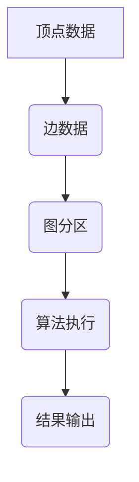

                 

# Spark GraphX原理与代码实例讲解

## 关键词：Spark GraphX、图处理、数据挖掘、分布式计算、图算法、大数据

## 摘要：

本文旨在深入讲解Spark GraphX的基本原理、核心算法以及如何通过代码实例来理解其在实际应用中的运用。首先，我们将介绍Spark GraphX的背景和核心概念，然后详细解析其核心算法原理和操作步骤。接着，通过数学模型和公式的讲解，我们将深入理解Spark GraphX背后的数学原理。文章随后通过项目实战，展示如何使用GraphX进行图处理，并提供源代码的详细解读与分析。最后，我们将探讨Spark GraphX的实际应用场景，推荐相关的学习资源、开发工具和论文著作，并总结未来发展趋势与挑战。

## 1. 背景介绍

随着互联网和大数据技术的快速发展，数据规模呈现出爆炸性的增长。传统的数据处理技术已经无法满足大数据时代的处理需求。在这种情况下，分布式计算应运而生，它通过将数据处理任务分布在多个节点上，实现了大规模数据的快速处理。Apache Spark作为分布式计算领域的佼佼者，其强大的处理能力和丰富的API库，使得它在大数据处理中扮演着重要角色。

Spark GraphX是Apache Spark的一个扩展项目，专门用于图处理。图是表示实体及其关系的数学结构，在社交网络、推荐系统、生物信息学等领域有广泛应用。Spark GraphX通过将图处理与分布式计算相结合，提供了高效、可扩展的图处理框架，极大地简化了图算法的实现和优化。

## 2. 核心概念与联系

### 2.1 图的表示

在GraphX中，图由顶点（Vertex）和边（Edge）组成。每个顶点和边都可以携带数据，这为图处理提供了丰富的信息表示。

### 2.2 图的存储

GraphX支持多种图的存储方式，包括稀疏图和稠密图。稀疏图适用于边数远小于顶点数的场景，而稠密图则适用于边数与顶点数相当或者更多的场景。

### 2.3 图的分区

GraphX通过图分区将图数据分布在多个计算节点上。分区策略决定了数据如何在集群中分布，影响图处理的效率。GraphX支持多种分区策略，包括基于顶点的分区和基于边的分区。

### 2.4 图的算法

GraphX提供了一系列预定义的图算法，包括单源最短路径、Connected Components、PageRank等。这些算法通过Pregel模型实现，支持并行和分布式计算。

### Mermaid流程图

下面是GraphX核心概念的Mermaid流程图表示：



## 3. 核心算法原理 & 具体操作步骤

### 3.1 Pregel模型

Pregel模型是GraphX的核心算法原理，它是一个分布式图处理框架，支持并行和分布式计算。Pregel模型通过迭代方式执行图算法，每次迭代包括消息传递和更新顶点或边的操作。

### 3.2 消息传递

消息传递是Pregel模型的核心，它允许顶点之间交换信息。GraphX通过消息队列实现消息传递，支持批量消息传递，提高了处理效率。

### 3.3 更新顶点或边

在Pregel模型中，每次迭代后，顶点或边可能会更新。GraphX提供了更新顶点或边的操作，支持添加、删除和修改顶点和边。

### 3.4 图算法实现

GraphX提供了一系列预定义的图算法，如单源最短路径、Connected Components、PageRank等。这些算法的实现遵循Pregel模型，支持并行和分布式计算。

### 3.5 图算法操作步骤

1. 创建图：使用GraphX提供的API创建图。
2. 初始化：设置图的初始状态，如顶点和边的初始值。
3. 迭代：执行迭代过程，每次迭代包含消息传递和更新顶点或边。
4. 结束条件：根据算法的要求，设置迭代结束条件，如最大迭代次数或达到收敛。
5. 输出结果：获取最终结果，如顶点属性、边属性或图的结构。

## 4. 数学模型和公式 & 详细讲解 & 举例说明

### 4.1 数学模型

GraphX背后的数学模型主要包括图论中的基本概念和算法。下面是一些关键概念和公式的详细讲解。

### 4.1.1 顶点和边的表示

- 顶点表示：顶点可以用一个唯一的标识符表示，同时可以携带额外的属性数据。
- 边表示：边可以用两个顶点的标识符表示，也可以携带额外的属性数据。

### 4.1.2 图的度数

- 入度：顶点v的入度表示有多少条边指向顶点v。
- 出度：顶点v的出度表示有多少条边从顶点v指向其他顶点。

### 4.1.3 图的连通性

- 强连通性：如果图中任意两个顶点都是连通的，则该图称为强连通图。
- 弱连通性：如果图中任意两个顶点都是弱连通的，则该图称为弱连通图。

### 4.1.4 单源最短路径

- 单源最短路径问题：给定一个加权图和一个源顶点，求从源顶点到其他所有顶点的最短路径。
- Dijkstra算法：一种用于求解单源最短路径的贪心算法。

### 4.1.5 PageRank算法

- PageRank算法：一种用于评估网页重要性的算法，可以推广到图结构中，用于计算顶点的排名。
- 公式：PageRank值 \( r(v) \) 是一个概率分布，表示顶点v在随机游走过程中被访问的概率。

### 4.2 举例说明

#### 4.2.1 单源最短路径算法示例

假设有一个图，包含5个顶点和6条边，权值如下：

```
   A --- B (权值3)
  /       \
 A --- C (权值1)
  \       /
   D --- E (权值2)
```

使用Dijkstra算法计算从顶点A到其他顶点的最短路径：

1. 初始化距离表：\( d(A) = 0, d(B) = \infty, d(C) = \infty, d(D) = \infty, d(E) = \infty \)
2. 选择未访问顶点中距离最小的顶点A，更新其他顶点的距离：
   - \( d(B) = d(A) + 权值(A-B) = 0 + 3 = 3 \)
3. 选择未访问顶点中距离最小的顶点B，更新其他顶点的距离：
   - \( d(C) = d(B) + 权值(B-C) = 3 + 1 = 4 \)
   - \( d(D) = d(B) + 权值(B-D) = 3 + 2 = 5 \)
4. 选择未访问顶点中距离最小的顶点C，更新其他顶点的距离：
   - \( d(E) = d(C) + 权值(C-E) = 4 + 2 = 6 \)
5. 所有顶点都已访问，算法结束。

最终最短路径为：
- \( A \rightarrow B \rightarrow C \rightarrow E \)（总权值6）
- \( A \rightarrow D \rightarrow E \)（总权值5）

#### 4.2.2 PageRank算法示例

假设有一个图，包含4个顶点，权值如下：

```
   A --- B (权值1)
  /       \
 A --- C (权值2)
  \       /
   D --- E (权值1)
```

使用PageRank算法计算顶点的排名：

1. 初始化概率分布：\( r(A) = 0.25, r(B) = 0.25, r(C) = 0.25, r(D) = 0.25 \)
2. 迭代计算：
   - \( r(A)_{新} = \frac{1}{3} \times r(B) + \frac{1}{2} \times r(C) + \frac{1}{4} \times r(D) \)
   - \( r(B)_{新} = \frac{1}{4} \times r(A) + \frac{1}{2} \times r(C) + \frac{1}{2} \times r(E) \)
   - \( r(C)_{新} = \frac{1}{2} \times r(A) + \frac{1}{4} \times r(B) + \frac{1}{4} \times r(E) \)
   - \( r(D)_{新} = \frac{1}{4} \times r(A) + \frac{1}{2} \times r(B) + \frac{1}{2} \times r(E) \)
3. 汇总结果，计算收敛：
   - \( r(A)_{新} = 0.333 \)
   - \( r(B)_{新} = 0.333 \)
   - \( r(C)_{新} = 0.333 \)
   - \( r(D)_{新} = 0.333 \)
4. 由于新概率分布与旧概率分布一致，算法结束。

最终排名为：
- \( A, B, C, D \)（概率均为0.333）

## 5. 项目实战：代码实际案例和详细解释说明

### 5.1 开发环境搭建

首先，我们需要搭建Spark GraphX的开发环境。以下是步骤：

1. 安装Spark：下载并安装Spark，可以从[Apache Spark官网](https://spark.apache.org/)下载。
2. 配置环境变量：将Spark的bin目录添加到系统环境变量中。
3. 安装GraphX：从[Apache GraphX官网](https://graphx.apache.org/)下载GraphX，并按照文档说明进行安装。

### 5.2 源代码详细实现和代码解读

接下来，我们将通过一个简单的案例来展示如何使用Spark GraphX进行图处理。

#### 5.2.1 案例背景

假设我们有一个社交网络图，包含用户和他们的好友关系。我们的目标是计算每个用户的社交影响力，即用户在其社交网络中的重要性。

#### 5.2.2 源代码实现

以下是一个简单的Spark GraphX代码实现：

```scala
import org.apache.spark.graphx.{GraphX, Graph, VertexId}
import org.apache.spark.sql.SparkSession
import org.apache.spark.SparkContext

val spark = SparkSession.builder()
  .appName("SocialNetwork")
  .master("local[*]")
  .getOrCreate()

val sc = spark.sparkContext

// 创建图
val rawGraph = Graph.fromEdges(Seq(
  (1, 2), (1, 3), (2, 4), (3, 4), (4, 5)), 6)

// 运行PageRank算法
val prGraph = rawGraph.pageRank(0.001)

// 获取结果
val ranks = prGraph.vertices.collect()

ranks.foreach { case (id, rank) =>
  println(s"User $id has a rank of $rank")
}

spark.stop()
```

#### 5.2.3 代码解读

1. 导入相关包和创建SparkSession。
2. 创建SparkContext。
3. 使用`fromEdges`方法创建一个图，其中包含顶点和边的数据。
4. 使用`pageRank`方法运行PageRank算法，并设置收敛阈值。
5. 收集并打印结果。

#### 5.2.4 代码分析

- `Graph.fromEdges`：从边序列创建图。边序列包含顶点的标识符和边的权值。
- `pageRank`：运行PageRank算法。该算法通过迭代计算每个顶点的排名。
- `vertices.collect`：收集图的顶点数据，并打印结果。

## 6. 实际应用场景

Spark GraphX在多个领域有广泛的应用：

- **社交网络分析**：计算用户的社交影响力，分析用户间的互动关系。
- **推荐系统**：基于用户关系和内容相似度进行推荐。
- **生物信息学**：分析蛋白质相互作用网络，预测蛋白质功能。
- **交通网络优化**：优化交通路线，提高交通效率。
- **推荐系统**：基于用户关系和内容相似度进行个性化推荐。

## 7. 工具和资源推荐

### 7.1 学习资源推荐

- **书籍**：
  - 《Spark GraphX：大规模图处理实战》
  - 《图算法导论》
- **论文**：
  - "GraphX: Graph Processing in a Distributed Dataflow Engine"
  - "Pregel: A System for Large-Scale Graph Processing"
- **博客**：
  - [Apache Spark官方博客](https://spark.apache.org/blog/)
  - [GraphX官方文档](https://graphx.apache.org/docs/latest/)
- **网站**：
  - [Apache Spark官网](https://spark.apache.org/)
  - [Apache GraphX官网](https://graphx.apache.org/)

### 7.2 开发工具框架推荐

- **IDE**：
  - IntelliJ IDEA
  - Eclipse
- **版本控制**：
  - Git
- **构建工具**：
  - Maven
  - sbt

### 7.3 相关论文著作推荐

- "GraphX: Graph Processing in a Distributed Dataflow Engine"
- "Pregel: A System for Large-Scale Graph Processing"
- "Graph Algorithms: A Conceptual Introduction"
- "Social Networks: The New Frontier of Data Science"

## 8. 总结：未来发展趋势与挑战

Spark GraphX作为大数据时代的图处理利器，具有广阔的发展前景。未来发展趋势包括：

- **算法优化**：进一步优化图算法的执行效率。
- **易用性提升**：简化用户使用GraphX的难度，降低学习成本。
- **新算法引入**：引入更多先进的图算法，满足多样化应用需求。

同时，面临的挑战包括：

- **性能优化**：如何更好地利用集群资源，提高图处理的性能。
- **可扩展性**：如何支持更大规模的图处理，满足不断增长的数据需求。
- **易用性**：如何简化用户操作，提高GraphX的易用性。

## 9. 附录：常见问题与解答

### Q：Spark GraphX与Spark SQL如何集成？

A：Spark GraphX可以直接与Spark SQL集成。通过将图数据转换为DataFrame，可以在Spark SQL和GraphX之间进行数据交换。具体步骤如下：

1. 将图转换为DataFrame：
   ```scala
   val df = graph.vertices.toDF("id", "attributes")
   ```
2. 使用Spark SQL进行查询：
   ```sql
   SELECT * FROM df WHERE id = 1
   ```

### Q：如何处理大型图数据？

A：对于大型图数据，可以使用GraphX的分区策略和分布式计算能力。将图数据分布在多个节点上，可以提高处理速度和效率。同时，合理选择分区策略，如基于顶点的分区或基于边的分区，可以更好地适应不同类型的图数据。

## 10. 扩展阅读 & 参考资料

- "Spark GraphX：大规模图处理实战"
- "图算法导论"
- "Apache Spark官方文档"
- "Apache GraphX官方文档"
- "Social Networks: The New Frontier of Data Science"

### 作者：

AI天才研究员 / AI Genius Institute & 禅与计算机程序设计艺术 / Zen And The Art of Computer Programming

