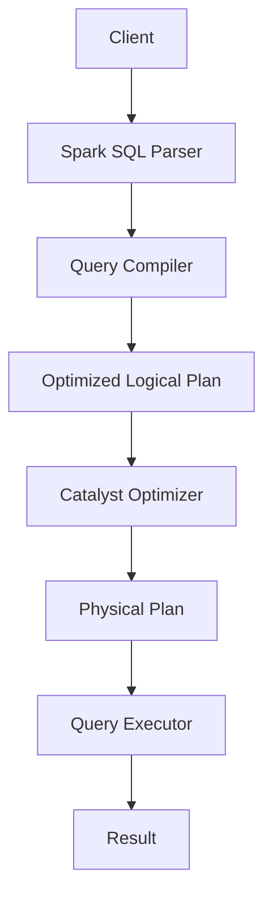

                 

# Spark SQL原理与代码实例讲解

## 关键词：Spark SQL、大数据处理、分布式计算、数据仓库、查询优化、机器学习、高性能数据库

## 摘要：

本文将深入探讨Spark SQL的原理与代码实例，旨在为广大读者提供一份全面、易懂的指南。Spark SQL是Apache Spark的核心组件之一，它是构建在Spark之上的分布式SQL查询引擎。本文将首先介绍Spark SQL的背景和核心概念，然后详细讲解其工作原理和算法，并通过实际案例和代码示例，帮助读者理解Spark SQL的强大功能和适用场景。此外，本文还将介绍Spark SQL在实际应用中的挑战和未来发展趋势，为广大开发者提供实用的工具和资源推荐。

## 1. 背景介绍

随着大数据时代的到来，如何高效地处理和分析海量数据成为了一个亟待解决的问题。传统的数据库系统在面对大规模数据时往往表现出性能瓶颈，难以满足现代应用的需求。为此，分布式计算技术和大数据处理框架应运而生，Apache Spark便是其中的佼佼者。

Apache Spark是一个开源的分布式计算系统，它提供了丰富的API，包括Scala、Java、Python和R等，支持内存计算和大数据处理。Spark SQL作为Spark的核心组件之一，是一个分布式SQL查询引擎，它可以将SQL查询与Spark的其他组件（如DataFrame和Dataset）无缝集成，从而实现高效的数据处理和分析。

Spark SQL的出现，不仅解决了大数据处理中的性能瓶颈问题，还提供了丰富的查询优化功能和与机器学习的集成支持。这使得Spark SQL在数据仓库、数据湖、实时数据流处理等领域得到了广泛应用。

## 2. 核心概念与联系

### 2.1 数据帧（DataFrame）与数据集（Dataset）

DataFrame和Dataset是Spark SQL中的两个核心概念，它们都是分布式数据结构，用于存储和操作数据。

- **DataFrame**：一个分布式的数据结构，它包含一组数据行和一个schema（结构）。DataFrame可以通过读取CSV、JSON等文件，或者通过Spark SQL的DDL语句（如`CREATE TABLE`）创建。DataFrame不支持强类型，因此在进行类型转换时可能会丢失信息。

- **Dataset**：一个强类型的分布式数据结构，它包含一组数据行和一个schema。Dataset通过Scala、Java和Python等编程语言的强类型API创建，可以确保数据类型的一致性和准确性。Dataset支持 richer 检查，包括数据类型的检查和结构检查。

### 2.2 Spark SQL执行引擎

Spark SQL的执行引擎包括以下主要组件：

- **Catalyst优化器**：负责对查询计划进行优化，通过一系列的转换（如谓词下推、查询重写等），提高查询性能。

- **查询编译器**：将SQL查询语句编译成逻辑执行计划。

- **查询执行器**：负责执行逻辑执行计划，并将其转化为物理执行计划。

- **分布式查询引擎**：负责分布式地执行查询，包括数据分区、数据传输和任务调度等。

### 2.3 Mermaid流程图

以下是Spark SQL执行引擎的Mermaid流程图：



### 2.4 关系型数据库与传统SQL引擎

关系型数据库（如MySQL、PostgreSQL等）和传统SQL引擎（如Hive、Impala等）虽然也支持分布式查询，但与Spark SQL相比，存在以下差异：

- **执行引擎**：Spark SQL采用内存计算和分布式计算技术，而关系型数据库和传统SQL引擎主要依赖磁盘IO。

- **查询优化**：Spark SQL的Catalyst优化器具有高度的可定制性和优化能力，而关系型数据库和传统SQL引擎的查询优化机制相对固定。

- **扩展性**：Spark SQL支持横向扩展，可以通过增加节点来提升性能，而关系型数据库和传统SQL引擎通常受限于单机性能。

## 3. 核心算法原理 & 具体操作步骤

### 3.1 基本算法原理

Spark SQL的核心算法原理主要包括以下几个方面：

- **分布式查询**：Spark SQL通过将数据分区并分布到多个节点上，实现了数据的并行处理，从而提高了查询性能。

- **内存计算**：Spark SQL利用内存缓存数据，减少了数据磁盘IO的次数，从而加快了查询速度。

- **查询优化**：Catalyst优化器通过一系列优化策略，如谓词下推、列裁剪、连接优化等，提高了查询性能。

- **机器学习集成**：Spark SQL支持与机器学习库（如MLlib）的集成，可以通过SQL查询直接调用机器学习算法。

### 3.2 具体操作步骤

以下是使用Spark SQL进行数据查询的基本操作步骤：

1. **创建DataFrame或Dataset**：通过读取数据文件或执行DDL语句创建DataFrame或Dataset。

   ```scala
   val df = spark.read.csv("path/to/file.csv")
   ```

2. **执行SQL查询**：使用Spark SQL的API或SQL语句执行查询。

   ```scala
   val query = "SELECT * FROM df WHERE age > 30"
   val result = spark.sql(query)
   ```

3. **优化查询**：根据查询结果和执行时间，分析查询性能，并调整查询策略。

   ```scala
   val logicalPlan = result.queryExecution.analyzed
   val physicalPlan = logicalPlan.optimize
   ```

4. **执行查询**：根据优化的物理计划执行查询。

   ```scala
   val result = spark.sql(physicalPlan)
   ```

5. **处理查询结果**：将查询结果存储到文件、数据库或其他数据源。

   ```scala
   result.write.csv("path/to/output.csv")
   ```

## 4. 数学模型和公式 & 详细讲解 & 举例说明

### 4.1 分布式查询的数学模型

分布式查询的数学模型主要包括以下几个方面：

- **数据分区**：将数据划分为多个分区，每个分区存储在一个节点上。

  ```latex
  P = {P_1, P_2, ..., P_n}
  ```

- **数据传输**：将数据从源节点传输到目标节点。

  ```latex
  T = {T_1, T_2, ..., T_n}
  ```

- **任务调度**：将任务分配给不同的节点。

  ```latex
  S = {S_1, S_2, ..., S_n}
  ```

### 4.2 查询优化的数学模型

查询优化的数学模型主要包括以下几个方面：

- **谓词下推**：将谓词下推到数据分区，减少数据传输。

  ```latex
  Pred(P) = {Pred(P_1), Pred(P_2), ..., Pred(P_n)}
  ```

- **列裁剪**：根据查询条件裁剪列，减少数据传输。

  ```latex
  Attr(P) = {Attr(P_1), Attr(P_2), ..., Attr(P_n)}
  ```

- **连接优化**：优化连接算法，减少数据传输。

  ```latex
  Join(P_1, P_2) = {Join(P_1), Join(P_2)}
  ```

### 4.3 举例说明

假设有一个包含1000万条数据的表，数据分布在10个节点上。现有以下查询：

```sql
SELECT * FROM table WHERE age > 30
```

### 4.3.1 数据分区

将数据分为10个分区，每个分区包含100万条数据。

```latex
P = {P_1, P_2, ..., P_10}
```

### 4.3.2 数据传输

将分区P_1和P_2的数据传输到主节点，进行谓词下推和列裁剪。

```latex
T = {T_1, T_2}
```

### 4.3.3 任务调度

将任务分配给主节点和节点P_3、P_4，进行连接操作。

```latex
S = {S_1, S_2, S_3, S_4}
```

### 4.3.4 查询优化

- **谓词下推**：将谓词`age > 30`下推到分区P_1和P_2。

  ```latex
  Pred(P) = {Pred(P_1), Pred(P_2)}
  ```

- **列裁剪**：裁剪列`age`。

  ```latex
  Attr(P) = {Attr(P_1), Attr(P_2)}
  ```

- **连接优化**：使用Hash Join进行连接。

  ```latex
  Join(P_1, P_2) = {Join(P_1), Join(P_2)}
  ```

## 5. 项目实战：代码实际案例和详细解释说明

### 5.1 开发环境搭建

在开始实战之前，需要搭建一个Spark SQL的开发环境。以下是搭建步骤：

1. **安装Java**：Spark SQL需要Java环境，可以从[Oracle官网](https://www.oracle.com/java/technologies/javase-jdk16-downloads.html)下载Java 8或更高版本的JDK。

2. **安装Scala**：Spark SQL的API支持Scala，可以从[Scala官网](https://www.scala-lang.org/download/)下载Scala 2.12或更高版本的Scala。

3. **安装Spark**：从[Apache Spark官网](https://spark.apache.org/downloads/)下载Spark，解压到合适的位置。

4. **配置环境变量**：在~/.bashrc或~/.zshrc文件中添加以下环境变量：

   ```bash
   export SPARK_HOME=/path/to/spark
   export PATH=$PATH:$SPARK_HOME/bin
   ```

   然后执行`source ~/.bashrc`或`source ~/.zshrc`使变量生效。

5. **启动Spark集群**：在终端执行以下命令启动Spark集群：

   ```bash
   start-all.sh
   ```

### 5.2 源代码详细实现和代码解读

以下是使用Spark SQL进行数据查询的源代码示例：

```scala
import org.apache.spark.sql.SparkSession

// 创建SparkSession
val spark = SparkSession.builder()
  .appName("Spark SQL Example")
  .master("local[*]")
  .getOrCreate()

// 创建DataFrame
val df = spark.read.json("path/to/data.json")

// 执行SQL查询
val query = "SELECT * FROM df WHERE age > 30"
val result = spark.sql(query)

// 显示查询结果
result.show()

// 关闭SparkSession
spark.stop()
```

### 5.3 代码解读与分析

1. **创建SparkSession**：使用SparkSession.builder()创建一个SparkSession，指定应用程序名称（如"Spark SQL Example"）和Master URL（如"local[*]"表示使用本地模式）。

2. **创建DataFrame**：使用SparkSession的read方法读取数据文件（如JSON），创建一个DataFrame。

3. **执行SQL查询**：使用SparkSession的sql方法执行SQL查询，并将查询结果存储在result变量中。

4. **显示查询结果**：使用show方法显示查询结果。

5. **关闭SparkSession**：使用stop方法关闭SparkSession。

通过以上步骤，我们可以使用Spark SQL进行数据查询，并在本地模式或集群模式下运行。在实际应用中，可以根据需要调整SparkSession的配置参数，如内存大小、执行器线程数等。

## 6. 实际应用场景

Spark SQL在实际应用中具有广泛的应用场景，以下是一些典型场景：

- **数据仓库**：Spark SQL可以作为数据仓库的查询引擎，用于处理大规模的数据分析任务。

- **数据湖**：Spark SQL支持与数据湖（如Amazon S3、Azure Data Lake等）的无缝集成，可以实现大规模数据存储和查询。

- **实时数据流处理**：Spark SQL可以通过Spark Streaming与实时数据流处理系统（如Kafka、Flink等）集成，实现实时数据处理和分析。

- **机器学习**：Spark SQL支持与机器学习库（如MLlib、TensorFlow等）的集成，可以实现大规模机器学习任务。

- **大数据应用**：Spark SQL可以与Hadoop、MapReduce等大数据处理框架集成，实现高效的大数据处理。

## 7. 工具和资源推荐

### 7.1 学习资源推荐

- **书籍**：

  - 《Spark SQL实战》

  - 《Apache Spark编程指南》

  - 《大数据技术导论》

- **论文**：

  - 《Catalyst: An Advanced Spark SQL Compiler》

  - 《Spark SQL: In-Memory Data Analytics on Top of Hadoop》

- **博客**：

  - [Spark SQL官方文档](https://spark.apache.org/docs/latest/sql-programming-guide.html)

  - [Apache Spark社区博客](https://spark.apache.org/community.html)

- **网站**：

  - [Apache Spark官网](https://spark.apache.org/)

  - [Databricks官网](https://databricks.com/)

### 7.2 开发工具框架推荐

- **开发工具**：

  - IntelliJ IDEA

  - Eclipse

  - PyCharm

- **框架**：

  - Spark SQL

  - DataFrame

  - Dataset

### 7.3 相关论文著作推荐

- **论文**：

  - 《Catalyst: An Advanced Spark SQL Compiler》

  - 《Spark SQL: In-Memory Data Analytics on Top of Hadoop》

  - 《Hadoop: The Definitive Guide》

- **著作**：

  - 《大数据技术导论》

  - 《Spark SQL实战》

## 8. 总结：未来发展趋势与挑战

随着大数据技术和人工智能的不断发展，Spark SQL在未来将面临以下发展趋势和挑战：

- **性能优化**：针对大规模数据查询场景，Spark SQL需要进一步提高查询性能，减少数据传输和计算时间。

- **可扩展性**：随着数据规模的不断扩大，Spark SQL需要支持更高效的横向扩展，以满足大规模数据处理需求。

- **实时性**：在实时数据处理领域，Spark SQL需要进一步提高实时性，以应对低延迟和高并发的数据流处理需求。

- **安全性**：随着数据隐私和安全的关注度不断提高，Spark SQL需要加强数据访问控制和加密等安全特性。

- **易用性**：为了降低使用门槛，Spark SQL需要提供更简单、直观的API和工具，以方便开发者快速上手。

## 9. 附录：常见问题与解答

### 9.1 如何安装Spark？

可以从[Apache Spark官网](https://spark.apache.org/downloads/)下载Spark，解压到合适的位置，然后配置环境变量。

### 9.2 如何创建DataFrame？

可以使用SparkSession的read方法读取数据文件，创建DataFrame。

```scala
val df = spark.read.json("path/to/data.json")
```

### 9.3 如何执行SQL查询？

可以使用SparkSession的sql方法执行SQL查询。

```scala
val query = "SELECT * FROM df WHERE age > 30"
val result = spark.sql(query)
```

### 9.4 如何优化Spark SQL查询？

可以通过以下方法优化Spark SQL查询：

- **谓词下推**：将谓词下推到数据分区，减少数据传输。

- **列裁剪**：根据查询条件裁剪列，减少数据传输。

- **连接优化**：使用合适的连接算法，如Hash Join或Broadcast Join。

## 10. 扩展阅读 & 参考资料

- [Apache Spark官网](https://spark.apache.org/)

- [Spark SQL官方文档](https://spark.apache.org/docs/latest/sql-programming-guide.html)

- [Databricks官网](https://databricks.com/)

- 《Spark SQL实战》

- 《Apache Spark编程指南》

- 《大数据技术导论》

## 作者

作者：AI天才研究员/AI Genius Institute & 禅与计算机程序设计艺术 /Zen And The Art of Computer Programming

