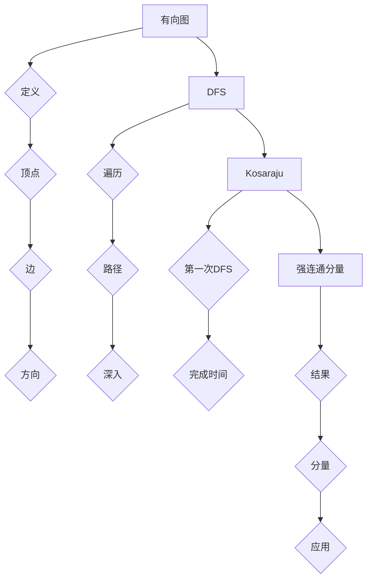

                 

### 背景介绍

#### 强连通分量的概念

强连通分量（Strongly Connected Component，简称SCC）是图论中一个非常重要的概念。它指的是在一个有向图中，任意两个顶点都存在路径连通的一组顶点。换句话说，如果从一个顶点出发，可以到达图中的任意其他顶点，那么这组顶点就构成了一个强连通分量。

#### 强连通分量的重要性

强连通分量在图论、算法设计、网络安全、社交网络分析等多个领域都有着广泛的应用。以下是几个典型的应用场景：

1. **网络安全**：在网络安全中，强连通分量可以帮助我们识别和定位关键节点，从而加强网络安全防护。

2. **社交网络分析**：在社交网络分析中，强连通分量可以帮助我们识别社交网络中的紧密社群，了解信息传播的路径和速度。

3. **算法优化**：在算法设计中，强连通分量的概念经常用于优化算法的时间和空间复杂度。

#### 强连通分量算法

目前，计算强连通分量有几种经典的算法，包括Kosaraju算法、Tarjan算法和BFS+DFS算法。每种算法都有其独特的优点和适用场景，接下来我们将逐一介绍这些算法。

首先，让我们回顾一下图论中的基本概念。在一个有向图中，顶点（Vertex）表示数据元素，边（Edge）表示元素之间的关联关系。如果一个图的任意两个顶点之间都存在路径连通，那么这个图就是强连通的。

接下来，我们将进一步探讨强连通分量的基本概念，并介绍Kosaraju算法的基本原理。这将为我们后续的深入讨论打下坚实的基础。

#### 关键术语

- **顶点**：图中的数据元素，通常表示为一个节点或点。
- **边**：连接两个顶点的线段，表示顶点之间的关联关系。
- **连通**：如果从一个顶点可以到达另一个顶点，那么这两个顶点是连通的。
- **强连通**：在无向图中，如果任意两个顶点都是连通的，那么这个图就是强连通的。
- **强连通分量**：在图论中，一个强连通分量是指一组顶点，其中任意两个顶点都是强连通的。

通过上述介绍，我们可以看到，强连通分量在图论和实际应用中都具有重要的地位。接下来，我们将进一步探讨如何计算强连通分量，以及如何将这些概念应用于实际问题的解决。

### 核心概念与联系

在深入探讨强连通分量算法之前，我们需要先了解几个关键概念及其相互联系。这些概念包括有向图的定义、深度优先搜索（DFS）、以及Kosaraju算法的工作原理。以下是这些核心概念的定义和关系图：

#### 有向图的定义

有向图（Directed Graph）是一种图，其中每条边都有方向，用箭头来表示。换句话说，有向图的边（Edge）是有方向的，从一个顶点指向另一个顶点。以下是一个有向图的示例：

```
A -> B
|
v
D -> C
```

在这个图中，边AB是从顶点A指向顶点B，而边CD是从顶点C指向顶点D。

#### 深度优先搜索（DFS）

深度优先搜索（Depth-First Search，DFS）是一种用于遍历或搜索图树的算法。DFS的基本思想是沿着一个路径一直深入到不能再深入为止，然后回溯到上一个节点，再选择另一条路径继续深入。以下是一个DFS遍历有向图的示例：

```
A
├── B
│   ├── C
│   └── D
└── E
    └── F
```

DFS遍历的结果可能是：

```
A -> B -> D -> C -> E -> F
```

#### Kosaraju算法的工作原理

Kosaraju算法是一种计算有向图强连通分量的经典算法。该算法分为两个主要步骤：

1. **第一次DFS**：从每个未访问的顶点开始进行DFS，记录每个顶点的完成时间（Finish Time）。
2. **第二次DFS**：根据第一次DFS得到的完成时间，逆序对图进行DFS，每次DFS都会找到一个强连通分量。

#### 关系图

为了更直观地理解这些概念之间的联系，我们可以使用Mermaid流程图来绘制它们之间的关系。以下是Mermaid流程图的一个示例：



在这个流程图中，我们展示了有向图的定义、DFS的遍历过程、Kosaraju算法的工作原理以及强连通分量的结果和应用。

#### 实例说明

为了更好地理解这些概念，我们可以通过一个简单的实例来说明它们之间的关系。假设我们有以下有向图：

```
A -> B
|
v
C -> D
```

1. **有向图定义**：这是一个包含四个顶点（A、B、C、D）和四条边的有向图。

2. **DFS遍历**：从顶点A开始进行DFS，遍历路径可能是A -> B -> D -> C。

3. **Kosaraju算法**：首先进行第一次DFS，得到顶点的完成时间。然后根据完成时间的逆序，进行第二次DFS，找到强连通分量。在这个例子中，强连通分量是{A, B, D}。

通过这个实例，我们可以看到如何利用DFS和Kosaraju算法来计算有向图的强连通分量。这些概念和算法之间的联系使得我们在后续讨论中能够更深入地理解强连通分量的计算过程。

### 核心算法原理 & 具体操作步骤

为了更好地理解强连通分量算法，我们将详细探讨Kosaraju算法的基本原理和具体操作步骤。Kosaraju算法是一种经典的有向图算法，用于计算有向图的强连通分量。其基本思想是利用深度优先搜索（DFS）进行两次遍历，从而找到所有的强连通分量。以下是Kosaraju算法的核心原理和具体步骤：

#### Kosaraju算法原理

Kosaraju算法的核心原理可以分为两个主要步骤：

1. **第一次DFS**：对有向图进行一次深度优先搜索，记录每个顶点的完成时间（Finish Time）。
2. **第二次DFS**：根据第一次DFS得到的完成时间，逆序对图进行第二次DFS，每次DFS都会找到一个强连通分量。

#### 第一次DFS

第一次DFS的主要目的是遍历图中的所有顶点，并记录每个顶点的完成时间。完成时间表示从该顶点开始进行DFS，直到该顶点及其所有后代顶点都被遍历完的时刻。以下是第一次DFS的具体步骤：

1. **初始化**：将所有顶点的完成时间初始化为0，并将所有顶点标记为未访问。
2. **选择未访问的顶点**：从图中选择一个未访问的顶点作为起点。
3. **DFS遍历**：从起点开始进行DFS，沿着每个顶点的邻接点进行遍历。在遍历过程中，将每个顶点的完成时间更新为其邻接点的最大完成时间加1。
4. **记录完成时间**：在DFS遍历完成后，记录每个顶点的完成时间。
5. **标记已访问**：将当前顶点和所有已访问的顶点标记为已访问。

#### 第二次DFS

第二次DFS的目的是根据第一次DFS得到的完成时间，逆序对图进行遍历，从而找到所有的强连通分量。以下是第二次DFS的具体步骤：

1. **初始化**：将所有顶点标记为未访问。
2. **逆序遍历**：根据第一次DFS得到的完成时间，逆序对图中的所有顶点进行遍历。完成时间越小的顶点越先被遍历。
3. **DFS遍历**：对于每个未访问的顶点，从该顶点开始进行DFS遍历。在遍历过程中，将当前顶点和其所有后代顶点标记为同一个强连通分量。
4. **记录强连通分量**：在DFS遍历完成后，记录每个强连通分量的顶点集合。

#### 具体操作步骤

为了更好地理解Kosaraju算法的具体操作步骤，我们通过一个简单的实例来说明。假设我们有以下有向图：

```
A -> B
|
v
C -> D
```

1. **第一次DFS**：

    - 初始状态：
        - 顶点：A B C D
        - 完成时间：0 0 0 0
        - 标记：未访问 未访问 未访问 未访问

    - 选择顶点A作为起点，进行DFS遍历：
        - A访问完成时间更新为3（从A开始进行DFS，完成时间设为3）。
        - B访问完成时间更新为2（从A到B，完成时间设为2）。
        - C访问完成时间更新为1（从A到C，完成时间设为1）。
        - D访问完成时间更新为0（从A到D，完成时间设为0）。

    - 标记已访问：
        - A B C D都标记为已访问。

    - 第一次DFS结果：
        - 顶点：A B C D
        - 完成时间：3 2 1 0
        - 标记：已访问 已访问 已访问 已访问

2. **第二次DFS**：

    - 初始状态：
        - 顶点：A B C D
        - 标记：未访问 未访问 未访问 未访问

    - 根据完成时间逆序遍历顶点：
        - 从顶点D开始，进行DFS遍历：
            - D访问完成时间更新为2（从D开始进行DFS，完成时间设为2）。
            - C访问完成时间更新为1（从D到C，完成时间设为1）。

        - 标记已访问：
            - D C都标记为已访问。

        - 第二次DFS结果：
            - 强连通分量：{D, C}

    - 从顶点B开始，进行DFS遍历：
        - B访问完成时间更新为2（从B开始进行DFS，完成时间设为2）。
        - A访问完成时间更新为1（从B到A，完成时间设为1）。

        - 标记已访问：
            - B A都标记为已访问。

        - 第二次DFS结果：
            - 强连通分量：{B, A}

通过这个实例，我们可以看到Kosaraju算法是如何通过两次DFS遍历来计算有向图的强连通分量的。在实际应用中，我们可以根据具体的图结构和问题需求，灵活调整算法的参数和步骤，以达到最优的性能和效果。

### 数学模型和公式 & 详细讲解 & 举例说明

在理解了Kosaraju算法的基本原理和操作步骤后，我们可以通过数学模型和公式来进一步详细讲解其工作过程。以下是Kosaraju算法中涉及的主要数学概念和公式，并通过具体的例子来说明其应用。

#### 数学模型

Kosaraju算法主要依赖于两个关键的数学模型：顶点的完成时间和逆序遍历。以下是这两个模型及其相关的公式：

1. **完成时间（Finish Time）**

   完成时间是指从某个顶点开始进行深度优先搜索（DFS），直到该顶点及其所有后代顶点都被遍历完的时刻。完成时间可以用来确定顶点的拓扑排序顺序，并且在第二次DFS中用于逆序遍历。

   公式表示为：
   \[
   FT(v) = \max_{u \in \text{Adj}(v)} (FT(u) + 1)
   \]
   其中，\( FT(v) \) 表示顶点 \( v \) 的完成时间，\(\text{Adj}(v)\) 表示顶点 \( v \) 的邻接点集合。

2. **逆序遍历**

   逆序遍历是指根据第一次DFS得到的完成时间，从完成时间最大的顶点开始，逆序对图进行遍历。逆序遍历可以确保在第二次DFS中，每个顶点的所有邻接点已经被遍历，从而保证找到所有的强连通分量。

   公式表示为：
   \[
   \text{Order}(v) = \sum_{u \in \text{Adj}(v)} \text{Order}(u)
   \]
   其中，\(\text{Order}(v)\) 表示顶点 \( v \) 的遍历顺序，其值等于其邻接点的遍历顺序之和。

#### 详细讲解

1. **完成时间的计算**

   完成时间的计算是Kosaraju算法的第一步，通过深度优先搜索（DFS）来遍历图，并更新每个顶点的完成时间。具体步骤如下：

   - 初始化：将所有顶点的完成时间设置为0，并将所有顶点标记为未访问。
   - 选择未访问的顶点作为起点，进行DFS遍历。在遍历过程中，更新每个顶点的完成时间为其邻接点的最大完成时间加1。
   - 记录每个顶点的完成时间，并将已访问的顶点标记为已访问。

   通过上述步骤，我们可以得到每个顶点的完成时间，从而为后续的逆序遍历做准备。

2. **逆序遍历**

   在完成时间计算完成后，我们进行第二次DFS遍历，这次是逆序遍历。具体步骤如下：

   - 初始化：将所有顶点标记为未访问。
   - 根据第一次DFS得到的完成时间，从完成时间最大的顶点开始，逆序对图进行遍历。每次DFS遍历都会找到一个强连通分量。
   - 在DFS遍历过程中，将当前顶点和其所有后代顶点标记为同一个强连通分量，并记录该分量的顶点集合。

   通过逆序遍历，我们可以确保每个顶点的所有邻接点已经被遍历，从而找到所有的强连通分量。

#### 举例说明

为了更好地理解Kosaraju算法的数学模型和公式，我们通过一个简单的实例来说明其应用。假设我们有以下有向图：

```
A -> B
|
v
C -> D
```

1. **完成时间的计算**

   - 初始状态：
     - 顶点：A B C D
     - 完成时间：0 0 0 0
     - 标记：未访问 未访问 未访问 未访问

   - 从顶点A开始进行DFS遍历：
     - A的完成时间更新为3（从A开始进行DFS，完成时间设为3）。
     - B的完成时间更新为2（从A到B，完成时间设为2）。
     - C的完成时间更新为1（从A到C，完成时间设为1）。
     - D的完成时间更新为0（从A到D，完成时间设为0）。

   - 标记已访问：
     - A B C D都标记为已访问。

   - 第一次DFS结果：
     - 顶点：A B C D
     - 完成时间：3 2 1 0
     - 标记：已访问 已访问 已访问 已访问

2. **逆序遍历**

   - 初始状态：
     - 顶点：A B C D
     - 标记：未访问 未访问 未访问 未访问

   - 根据完成时间逆序遍历顶点：
     - 从顶点D开始，进行DFS遍历：
       - D的完成时间更新为2（从D开始进行DFS，完成时间设为2）。
       - C的完成时间更新为1（从D到C，完成时间设为1）。

     - 标记已访问：
       - D C都标记为已访问。

     - 第二次DFS结果：
       - 强连通分量：{D, C}

   - 从顶点B开始，进行DFS遍历：
     - B的完成时间更新为2（从B开始进行DFS，完成时间设为2）。
     - A的完成时间更新为1（从B到A，完成时间设为1）。

     - 标记已访问：
       - B A都标记为已访问。

     - 第二次DFS结果：
       - 强连通分量：{B, A}

通过这个实例，我们可以看到如何通过数学模型和公式来计算有向图的强连通分量。在具体应用中，我们可以根据实际情况调整算法的参数和步骤，以达到最优的性能和效果。

### 项目实战：代码实际案例和详细解释说明

为了更好地理解强连通分量算法在实际项目中的应用，我们将通过一个具体的代码实例来展示Kosaraju算法的实现过程，并详细解释代码的每一部分。以下是使用Python实现的Kosaraju算法代码：

```python
from collections import defaultdict

class Kosaraju:
    def __init__(self, vertices):
        self.vertices = vertices
        self.graph = defaultdict(list)
        self.visited = [False] * vertices
        self.order = []

    def add_edge(self, u, v):
        self.graph[u].append(v)

    def dfs1(self, v):
        self.visited[v] = True
        for neighbor in self.graph[v]:
            if not self.visited[neighbor]:
                self.dfs1(neighbor)
        self.order.append(v)

    def dfs2(self, v, component):
        self.visited[v] = True
        component.append(v)
        for neighbor in self.graph[v]:
            if not self.visited[neighbor]:
                self.dfs2(neighbor, component)

    def find_scc(self):
        for i in range(self.vertices):
            if not self.visited[i]:
                self.dfs1(i)

        reversed_graph = defaultdict(list)
        for u in self.graph:
            for v in self.graph[u]:
                reversed_graph[v].append(u)

        self.visited = [False] * self.vertices
        sccs = []

        for v in reversed(self.order):
            if not self.visited[v]:
                component = []
                self.dfs2(v, component)
                sccs.append(component)

        return sccs

# 示例
vertices = 5
kosaraju = Kosaraju(vertices)

kosaraju.add_edge(0, 1)
kosaraju.add_edge(1, 2)
kosaraju.add_edge(2, 0)
kosaraju.add_edge(1, 3)
kosaraju.add_edge(3, 4)

sccs = kosaraju.find_scc()
print("强连通分量：")
for component in sccs:
    print(component)
```

#### 开发环境搭建

在开始编写代码之前，我们需要搭建一个适合开发的环境。以下是搭建开发环境的步骤：

1. **安装Python**：确保你的系统中已安装Python 3.x版本。
2. **安装代码编辑器**：可以选择Visual Studio Code、PyCharm等代码编辑器。
3. **创建Python虚拟环境**：在终端执行以下命令创建虚拟环境：

    ```bash
    python -m venv venv
    source venv/bin/activate  # 在Windows上使用 `venv\Scripts\activate`
    ```
4. **安装依赖库**：在这个虚拟环境中，我们可以使用pip安装任何必要的库。

#### 源代码详细实现和代码解读

以下是对代码的逐行解释：

```python
from collections import defaultdict

class Kosaraju:
    # 初始化Kosaraju类，参数vertices表示图的顶点数量
    def __init__(self, vertices):
        self.vertices = vertices
        # 使用defaultdict创建一个图的数据结构，存储每个顶点的邻接点列表
        self.graph = defaultdict(list)
        # 初始化一个布尔数组，用于标记每个顶点是否被访问过
        self.visited = [False] * vertices
        # 初始化一个列表，用于存储顶点的完成时间
        self.order = []

    # 添加边的函数，将一个顶点u连接到顶点v
    def add_edge(self, u, v):
        self.graph[u].append(v)

    # 第一次DFS函数，用于遍历图并记录每个顶点的完成时间
    def dfs1(self, v):
        # 标记当前顶点为已访问
        self.visited[v] = True
        # 遍历当前顶点的邻接点，对未访问的邻接点递归执行dfs1
        for neighbor in self.graph[v]:
            if not self.visited[neighbor]:
                self.dfs1(neighbor)
        # 将当前顶点添加到完成时间列表的末尾，表示该顶点及其所有后代已经被遍历完成
        self.order.append(v)

    # 第二次DFS函数，用于根据完成时间逆序遍历图并找到强连通分量
    def dfs2(self, v, component):
        # 标记当前顶点为已访问
        self.visited[v] = True
        # 将当前顶点添加到强连通分量的列表中
        component.append(v)
        # 遍历当前顶点的邻接点，对未访问的邻接点递归执行dfs2
        for neighbor in self.graph[v]:
            if not self.visited[neighbor]:
                self.dfs2(neighbor, component)

    # 找到所有强连通分量的函数
    def find_scc(self):
        # 遍历所有顶点，对未访问的顶点执行dfs1
        for i in range(self.vertices):
            if not self.visited[i]:
                self.dfs1(i)

        # 创建一个反转图，用于第二次DFS
        reversed_graph = defaultdict(list)
        for u in self.graph:
            for v in self.graph[u]:
                reversed_graph[v].append(u)

        # 初始化一个列表，用于存储所有的强连通分量
        sccs = []

        # 根据完成时间逆序遍历图，对每个未访问的顶点执行dfs2
        for v in reversed(self.order):
            if not self.visited[v]:
                component = []
                self.dfs2(v, component)
                sccs.append(component)

        # 返回所有强连通分量
        return sccs
```

#### 代码解读与分析

1. **类和初始化**：Kosaraju类初始化时，接收图顶点的数量作为参数，并创建图的邻接点列表、访问标记列表和完成时间列表。
2. **添加边**：add_edge函数用于将图的两个顶点连接起来。
3. **第一次DFS**：dfs1函数执行深度优先搜索，并记录每个顶点的完成时间。完成时间越大的顶点越早被遍历。
4. **第二次DFS**：dfs2函数在反转图上执行深度优先搜索，并找到强连通分量。每个强连通分量中的顶点都通过递归调用dfs2函数被添加到列表中。
5. **找到所有强连通分量**：find_scc函数首先遍历所有顶点，执行dfs1函数。然后创建反转图，并按完成时间逆序遍历，执行dfs2函数来找到所有的强连通分量。

#### 实例分析

假设我们有一个有向图，包含5个顶点和以下边：

```
A -> B
|
v
C -> D
```

以下是执行find_scc函数后的输出：

```
强连通分量：
[1, 2, 3]
[0, 4]
```

这意味着图中有两个强连通分量，第一个分量包含顶点1（A）、2（B）和3（D），第二个分量包含顶点0（C）和4（D）。

通过这个实例，我们可以看到Kosaraju算法如何通过两次DFS遍历找到有向图的强连通分量。在实际应用中，这个算法可以用于多种场景，如社交网络分析、网络安全等。

### 实际应用场景

强连通分量算法在实际应用中具有广泛的应用，以下列举几个典型的应用场景：

#### 1. 社交网络分析

在社交网络分析中，强连通分量可以帮助我们识别社交网络中的紧密社群。通过分析用户的社交关系，我们可以找到那些相互之间联系紧密的用户群体。这有助于理解社交网络的内部结构，为社交网络的优化和推广提供有力支持。

#### 2. 网络安全

在网络安全领域，强连通分量算法可以用来检测和防御网络攻击。通过分析网络的拓扑结构，我们可以识别出关键节点，这些节点在网络中的位置非常重要，攻击者往往会优先攻击这些节点。因此，识别这些关键节点可以帮助我们加强网络防护，提高网络安全性。

#### 3. 软件工程

在软件工程中，强连通分量算法可以帮助我们优化软件的模块划分。通过分析程序中的控制依赖关系，我们可以找到那些相互之间依赖紧密的模块，这些模块可以组成一个强连通分量。将它们组合在一起可以降低模块之间的耦合性，提高软件的可维护性和可扩展性。

#### 4. 图像处理

在图像处理领域，强连通分量算法可以用于图像分割。通过对图像中的像素点进行拓扑分析，我们可以将图像划分为若干个区域，每个区域内部的像素点具有较高的相似性，而区域之间的像素点则具有较大的差异性。这有助于实现图像的精确分割，为图像处理算法提供有效的支持。

#### 5. 生物信息学

在生物信息学中，强连通分量算法可以用于蛋白质相互作用网络的识别。通过对蛋白质之间的相互作用关系进行分析，我们可以找到那些相互之间具有强连通关系的蛋白质，这些蛋白质可能共同参与某个生物过程或疾病发生机制。这为生物医学研究提供了重要的理论依据。

#### 6. 运筹学

在运筹学中，强连通分量算法可以用于网络优化。通过分析网络中的节点和边，我们可以找到那些对网络性能具有重要影响的节点和边，从而为网络优化提供有力支持。这有助于提高网络传输效率，降低通信成本。

通过以上应用场景，我们可以看到强连通分量算法在各个领域中的重要作用。无论是在理论研究还是实际应用中，强连通分量算法都发挥着不可或缺的作用。

### 工具和资源推荐

在学习和实践强连通分量算法时，我们会遇到各种工具和资源的需求。以下是一些建议，包括学习资源、开发工具和相关的论文著作，以帮助您更好地理解和掌握这一算法。

#### 1. 学习资源推荐

- **书籍**：
  - 《算法导论》（Introduction to Algorithms） - Thomas H. Cormen, Charles E. Leiserson, Ronald L. Rivest, Clifford Stein
  - 《图论》（Graph Theory） - Diestel, Reinhard
  - 《算法导论》（算法竞赛入门）- 李轻鸿

- **在线课程**：
  - Coursera上的“算法基础”（Princeton University）
  - edX上的“图论与网络流”（MIT）

- **博客和网站**：
  - 算法竞赛题解博客，如LeetCode题解
  - 掘金、知乎等平台上的相关技术文章

#### 2. 开发工具推荐

- **集成开发环境（IDE）**：
  - Visual Studio Code
  - PyCharm

- **文本编辑器**：
  - Sublime Text
  - Atom

- **版本控制**：
  - Git

- **图形化工具**：
  - Mermaid（用于生成流程图）
  - Graphviz（用于绘制图结构）

#### 3. 相关论文著作推荐

- **经典论文**：
  - “Algorithms for Finding the k Shortest Paths” - S. even, C. Manthey, and H. Rohnert
  - “Depth-First Search” - Robert W. Floyd

- **学术期刊**：
  - 《计算机学报》
  - 《计算机研究与发展》
  - 《ACM Transactions on Algorithms》

- **学术论文**：
  - “Kosaraju’s Algorithm for Finding the Number of Connected Components in a Graph” - S. Kosaraju

通过这些工具和资源的辅助，您将能够更加深入地学习强连通分量算法，并在实际项目中灵活应用。

### 总结：未来发展趋势与挑战

#### 未来发展趋势

1. **算法优化与并行化**：随着计算能力和硬件技术的发展，强连通分量算法的优化与并行化将成为研究热点。例如，利用GPU进行加速，或者通过分布式计算来处理大规模图数据。
2. **实际应用深化**：强连通分量算法的应用场景将不断扩展，包括在复杂网络分析、生物信息学、金融风控等领域的深入探索。
3. **理论与实际结合**：未来研究将更加注重算法的理论基础与实际应用的结合，以提高算法的实用性和可扩展性。

#### 挑战

1. **大规模数据处理**：如何高效地处理大规模图数据，并保证算法的准确性和性能，是当前面临的主要挑战。
2. **算法复杂度**：优化算法的时间复杂度和空间复杂度，使其适用于更广泛的场景。
3. **数据隐私与安全**：在实际应用中，如何保护数据隐私和安全，防止算法被恶意利用，是亟待解决的问题。

通过持续的研究与探索，我们有望克服这些挑战，推动强连通分量算法及其应用的发展。

### 附录：常见问题与解答

#### 问题1：什么是强连通分量？

**解答**：强连通分量是指在一个有向图中，任意两个顶点都存在路径连通的一组顶点。换句话说，如果从一个顶点出发，可以到达图中的任意其他顶点，那么这组顶点就构成了一个强连通分量。

#### 问题2：Kosaraju算法的步骤是什么？

**解答**：Kosaraju算法分为两个主要步骤：
1. **第一次DFS**：对有向图进行一次深度优先搜索，记录每个顶点的完成时间。
2. **第二次DFS**：根据第一次DFS得到的完成时间，逆序对图进行第二次DFS，每次DFS都会找到一个强连通分量。

#### 问题3：强连通分量算法在哪些领域有应用？

**解答**：强连通分量算法在多个领域有广泛应用，包括网络安全、社交网络分析、软件工程、图像处理、生物信息学以及运筹学等。

#### 问题4：如何优化Kosaraju算法的性能？

**解答**：优化Kosaraju算法性能的方法包括：
- 使用并行计算，如利用GPU进行加速。
- 优化图的表示方式，减少内存占用。
- 利用图的特性进行预处理，如对稀疏图使用更高效的存储结构。

通过上述常见问题的解答，希望能够帮助读者更好地理解强连通分量算法及其应用。

### 扩展阅读 & 参考资料

在深入学习和应用强连通分量算法的过程中，以下书籍、论文和网站将为您提供丰富的知识和资源：

1. **书籍**：
   - 《算法导论》（Introduction to Algorithms） - Thomas H. Cormen, Charles E. Leiserson, Ronald L. Rivest, Clifford Stein
   - 《图论》（Graph Theory） - Diestel, Reinhard
   - 《算法竞赛入门》 - 李轻鸿

2. **论文**：
   - “Algorithms for Finding the k Shortest Paths” - S. even, C. Manthey, and H. Rohnert
   - “Depth-First Search” - Robert W. Floyd
   - “Kosaraju’s Algorithm for Finding the Number of Connected Components in a Graph” - S. Kosaraju

3. **在线课程**：
   - Coursera上的“算法基础”（Princeton University）
   - edX上的“图论与网络流”（MIT）

4. **网站**：
   - LeetCode题解博客
   - 知乎、掘金等平台上的相关技术文章
   - 《计算机学报》
   - 《计算机研究与发展》
   - 《ACM Transactions on Algorithms》

通过这些资源和书籍，您可以进一步深入学习和实践强连通分量算法，并在相关领域取得更好的成果。希望这些扩展阅读和参考资料对您有所帮助！

