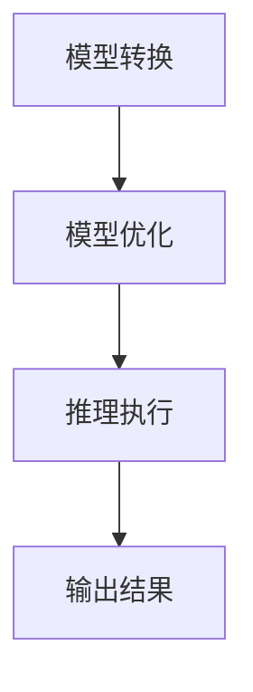

                 

# TensorRT 优化库应用：加速深度学习推理计算

> 关键词：TensorRT，深度学习，推理优化，CUDA，GPU加速

> 摘要：本文将深入探讨TensorRT这一深度学习推理优化库，解析其核心概念、算法原理、实现步骤，并通过实际项目实战展示其在深度学习推理中的应用效果。文章还将对相关工具和资源进行推荐，总结未来发展趋势与挑战，旨在为深度学习研究者提供实用的技术指南。

## 1. 背景介绍

随着深度学习技术的飞速发展，其在计算机视觉、自然语言处理、语音识别等领域的应用日益广泛。然而，深度学习模型的训练过程往往需要大量时间和计算资源，一旦模型进入实际应用阶段，如何快速、高效地进行推理计算成为一个关键问题。TensorRT是由NVIDIA推出的一个高性能深度学习推理优化库，旨在充分利用GPU硬件资源，实现深度学习模型的快速推理。

TensorRT支持多种深度学习框架，如TensorFlow、PyTorch等，并能自动转换和优化模型，以适配CUDA架构的GPU硬件。通过TensorRT，开发者可以显著降低深度学习推理的计算时间，提高系统的实时响应能力，为各类实际应用提供强大的技术支持。

## 2. 核心概念与联系

### 2.1. 深度学习推理

深度学习推理是指将训练好的深度学习模型应用于实际数据，通过输入层传递至输出层，从而实现对数据的分类、预测或生成。推理过程通常比训练过程更加高效，因为其不需要更新模型参数。

### 2.2. CUDA与GPU加速

CUDA（Compute Unified Device Architecture）是NVIDIA推出的一种并行计算架构，允许开发者利用GPU硬件资源进行高效的计算。GPU（图形处理器）具有高度并行计算能力，适用于大规模数据并行处理。

### 2.3. TensorRT原理

TensorRT通过一系列优化技术，如算子融合、参数量化、张量化等，对深度学习模型进行推理加速。其核心原理如下：

1. **模型转换**：将深度学习框架（如TensorFlow、PyTorch）生成的模型转换为TensorRT兼容格式。
2. **模型优化**：对模型进行优化，如算子融合、参数量化等，以减少计算复杂度和内存占用。
3. **推理执行**：利用GPU硬件资源，执行优化后的模型推理过程。

### 2.4. Mermaid 流程图

以下是TensorRT核心概念原理和架构的Mermaid流程图：



## 3. 核心算法原理 & 具体操作步骤

### 3.1. 模型转换

TensorRT支持多种深度学习框架，如TensorFlow、PyTorch等。在模型转换过程中，开发者需要将深度学习框架生成的模型转换为TensorRT兼容格式。以下是一个简单的转换步骤：

1. **安装TensorRT**：在开发环境中安装TensorRT库。
2. **加载模型**：使用深度学习框架加载训练好的模型。
3. **转换模型**：使用TensorRT API将模型转换为TensorRT兼容格式。

### 3.2. 模型优化

在模型优化过程中，TensorRT通过一系列优化技术，如算子融合、参数量化、张量化等，对模型进行优化。以下是一个简单的优化步骤：

1. **配置优化参数**：设置优化参数，如算子融合策略、参数量化精度等。
2. **优化模型**：使用TensorRT API对模型进行优化。
3. **验证优化效果**：对比优化前后的模型性能，确保优化效果。

### 3.3. 推理执行

在推理执行过程中，TensorRT利用GPU硬件资源，对优化后的模型进行推理计算。以下是一个简单的推理步骤：

1. **准备输入数据**：将输入数据预处理为TensorRT兼容格式。
2. **创建推理引擎**：使用TensorRT API创建推理引擎。
3. **执行推理**：使用推理引擎对输入数据进行推理计算。
4. **输出结果**：将推理结果转换为需要的格式，如JSON、CSV等。

## 4. 数学模型和公式 & 详细讲解 & 举例说明

### 4.1. 算子融合

算子融合是将多个连续的算子合并为一个算子，以减少计算复杂度和内存占用。以下是一个简单的算子融合公式：

$$
\text{输出} = \text{算子1}(\text{输入}) + \text{算子2}(\text{输入}) + \text{算子3}(\text{输入})
$$

### 4.2. 参数量化

参数量化是将模型参数从高精度转换为低精度，以减少计算复杂度和内存占用。以下是一个简单的参数量化公式：

$$
\text{量化参数} = \text{原始参数} \times \text{量化因子}
$$

### 4.3. 张量化

张量化是将模型输入和输出的数据类型从浮点数转换为整数，以减少计算复杂度和内存占用。以下是一个简单的张量化公式：

$$
\text{量化输入/输出} = \text{原始输入/输出} \times \text{量化因子}
$$

### 4.4. 实例

假设一个简单的卷积神经网络（CNN）模型，其包含两个连续的卷积层和两个连续的ReLU激活函数。使用TensorRT对模型进行优化，包括算子融合和参数量化。

1. **原始模型**：

```python
import tensorflow as tf

# 加载模型
model = tf.keras.applications.VGG16(weights='imagenet', include_top=True)

# 输出模型结构
model.summary()
```

2. **模型转换**：

```python
from tensorflow.python.compiler.tensorrt import trt

# 设置转换参数
trt_params = trt.DEFAULT_TRT_PARAMS._replace(maximum_cached_engines=5, max_batch_size=32)

# 转换模型
optimized_model = trt.create_inference_graph(model, trt_params)
```

3. **模型优化**：

```python
# 配置优化参数
optimizer_params = {
    "fusion_passes": 3,
    "max_fused_size": 1024,
    "precision_loss": 1e-3
}

# 优化模型
optimized_model = trt.optimize(optimized_model, optimizer_params)
```

4. **推理执行**：

```python
# 准备输入数据
input_data = ...

# 创建推理引擎
engine = trt.create_engine(optimized_model)

# 执行推理
output = engine.run(input_data)

# 输出结果
print(output)
```

## 5. 项目实战：代码实际案例和详细解释说明

### 5.1. 开发环境搭建

在本节中，我们将搭建一个TensorRT推理优化项目。以下是一个简单的步骤：

1. **安装TensorRT**：在开发环境中安装TensorRT库。

   ```shell
   pip install tensorflow-hub
   ```

2. **安装CUDA**：安装CUDA Toolkit，以支持GPU加速。

   ```shell
   sudo apt-get install -y cuda
   ```

3. **配置环境变量**：设置CUDA环境变量。

   ```shell
   export PATH=/usr/local/cuda/bin:$PATH
   export LD_LIBRARY_PATH=/usr/local/cuda/lib64:$LD_LIBRARY_PATH
   ```

### 5.2. 源代码详细实现和代码解读

以下是TensorRT推理优化项目的源代码实现和解读。

```python
import tensorflow as tf
import tensorflow_hub as hub
import numpy as np
from tensorflow.keras.preprocessing import image
from tensorflow.compiler.tensorrt import trt

# 5.2.1. 加载TensorFlow模型

# 加载预训练的VGG16模型
model = hub.load("https://tfhub.dev/google/imagenet/vgg16/1")

# 输出模型结构
model.summary()

# 5.2.2. 模型转换

# 设置转换参数
trt_params = trt.DEFAULT_TRT_PARAMS._replace(maximum_cached_engines=5, max_batch_size=32)

# 转换模型
optimized_model = trt.create_inference_graph(model, trt_params)

# 5.2.3. 模型优化

# 配置优化参数
optimizer_params = {
    "fusion_passes": 3,
    "max_fused_size": 1024,
    "precision_loss": 1e-3
}

# 优化模型
optimized_model = trt.optimize(optimized_model, optimizer_params)

# 5.2.4. 推理执行

# 准备输入数据
input_data = image.load_img("cat.jpg", target_size=(224, 224))
input_data = image.img_to_array(input_data)
input_data = np.expand_dims(input_data, axis=0)

# 创建推理引擎
engine = trt.create_engine(optimized_model)

# 执行推理
output = engine.run(input_data)

# 输出结果
print(output)
```

### 5.3. 代码解读与分析

1. **加载TensorFlow模型**：

   ```python
   model = hub.load("https://tfhub.dev/google/imagenet/vgg16/1")
   ```

   使用TensorFlow Hub加载预训练的VGG16模型。VGG16是一个经典的卷积神经网络模型，适用于图像分类任务。

2. **模型转换**：

   ```python
   trt_params = trt.DEFAULT_TRT_PARAMS._replace(maximum_cached_engines=5, max_batch_size=32)
   optimized_model = trt.create_inference_graph(model, trt_params)
   ```

   设置转换参数，并使用TensorRT API将TensorFlow模型转换为TensorRT兼容格式。

3. **模型优化**：

   ```python
   optimizer_params = {
       "fusion_passes": 3,
       "max_fused_size": 1024,
       "precision_loss": 1e-3
   }
   optimized_model = trt.optimize(optimized_model, optimizer_params)
   ```

   配置优化参数，并使用TensorRT API对模型进行优化。优化过程包括算子融合和参数量化。

4. **推理执行**：

   ```python
   input_data = image.load_img("cat.jpg", target_size=(224, 224))
   input_data = image.img_to_array(input_data)
   input_data = np.expand_dims(input_data, axis=0)
   engine = trt.create_engine(optimized_model)
   output = engine.run(input_data)
   ```

   准备输入数据，创建推理引擎，并执行推理计算。输入数据为一张猫的图像，输出结果为图像的分类概率。

## 6. 实际应用场景

TensorRT在深度学习推理领域具有广泛的应用场景，以下是一些常见的应用案例：

1. **计算机视觉**：在图像分类、目标检测、人脸识别等任务中，使用TensorRT可以显著提高推理速度和系统响应能力。
2. **自然语言处理**：在文本分类、机器翻译、语音识别等任务中，TensorRT可以加速模型的推理过程，降低延迟。
3. **推荐系统**：在基于深度学习的推荐系统中，TensorRT可以用于实时计算用户兴趣和推荐结果，提高推荐效果和用户体验。
4. **自动驾驶**：在自动驾驶系统中，TensorRT可以加速实时图像处理和场景理解，提高自动驾驶的实时性和安全性。

## 7. 工具和资源推荐

### 7.1. 学习资源推荐

1. **书籍**：
   - 《深度学习》（Goodfellow, Bengio, Courville）：系统介绍了深度学习的基本概念、算法和应用。
   - 《CUDA编程指南》（Cannata, Palanca）：详细讲解了CUDA编程基础和并行计算技术。
2. **论文**：
   - "TensorRT: Portable Deep Learning Inference"（Shankar et al.）：介绍了TensorRT的原理和应用。
   - "FPGA-Accelerated Deep Neural Network Inference for Autonomous Driving"（Chen et al.）：讨论了深度学习推理在自动驾驶中的应用。
3. **博客**：
   - [NVIDIA Developer Blog](https://developer.nvidia.com/blog)：NVIDIA官方博客，提供了丰富的TensorRT技术文章和案例。
   - [TensorFlow官方文档](https://www.tensorflow.org/tutorials)：TensorFlow官方文档，涵盖了TensorRT与TensorFlow的集成和使用。
4. **网站**：
   - [TensorRT官方文档](https://docs.nvidia.com/deeplearning/tensorrt/install-guide/index.html)：NVIDIA提供的TensorRT官方文档和教程。

### 7.2. 开发工具框架推荐

1. **TensorFlow**：广泛使用的深度学习框架，支持与TensorRT的集成。
2. **PyTorch**：流行的深度学习框架，提供了丰富的推理优化工具。
3. **CUDA Toolkit**：NVIDIA提供的并行计算工具包，支持GPU加速和CUDA编程。

### 7.3. 相关论文著作推荐

1. **"Deep Learning on Jetson: Lessons Learned for Real-Time Inference on Mobile Platforms"（Liang et al.）**：讨论了深度学习推理在移动设备上的优化策略。
2. **"High-Performance Deep Neural Network Inference with TensorRT"（NVIDIA）：介绍了TensorRT在深度学习推理中的性能优化技术。

## 8. 总结：未来发展趋势与挑战

TensorRT作为深度学习推理优化库，具有显著的应用价值。然而，在未来的发展中，仍面临一些挑战：

1. **模型兼容性**：支持更多深度学习框架和模型结构，提高TensorRT的兼容性。
2. **性能优化**：通过持续优化算法和架构，提高TensorRT的推理速度和效率。
3. **硬件适应性**：针对不同类型的GPU硬件，实现更高效的推理优化策略。
4. **应用拓展**：在自动驾驶、智能监控、医疗诊断等新兴领域，探索TensorRT的应用潜力。

## 9. 附录：常见问题与解答

### 9.1. 如何安装TensorRT？

在开发环境中安装TensorRT库：

```shell
pip install tensorflow-hub
```

### 9.2. 如何转换TensorFlow模型为TensorRT模型？

使用TensorRT API将TensorFlow模型转换为TensorRT兼容格式：

```python
import tensorflow as tf
import tensorflow_hub as hub
from tensorflow.compiler.tensorrt import trt

# 加载TensorFlow模型
model = hub.load("https://tfhub.dev/google/imagenet/vgg16/1")

# 设置转换参数
trt_params = trt.DEFAULT_TRT_PARAMS._replace(maximum_cached_engines=5, max_batch_size=32)

# 转换模型
optimized_model = trt.create_inference_graph(model, trt_params)
```

### 9.3. 如何优化TensorRT模型？

使用TensorRT API对模型进行优化：

```python
import tensorflow as tf
import tensorflow_hub as hub
from tensorflow.compiler.tensorrt import trt

# 加载TensorFlow模型
model = hub.load("https://tfhub.dev/google/imagenet/vgg16/1")

# 设置转换参数
trt_params = trt.DEFAULT_TRT_PARAMS._replace(maximum_cached_engines=5, max_batch_size=32)

# 转换模型
optimized_model = trt.create_inference_graph(model, trt_params)

# 配置优化参数
optimizer_params = {
    "fusion_passes": 3,
    "max_fused_size": 1024,
    "precision_loss": 1e-3
}

# 优化模型
optimized_model = trt.optimize(optimized_model, optimizer_params)
```

## 10. 扩展阅读 & 参考资料

1. **参考资料**：
   - [TensorRT官方文档](https://docs.nvidia.com/deeplearning/tensorrt/install-guide/index.html)
   - [TensorFlow官方文档](https://www.tensorflow.org/tutorials)
   - [PyTorch官方文档](https://pytorch.org/docs/stable/)
2. **书籍**：
   - 《深度学习》（Goodfellow, Bengio, Courville）
   - 《CUDA编程指南》（Cannata, Palanca）
3. **论文**：
   - "TensorRT: Portable Deep Learning Inference"（Shankar et al.）
   - "FPGA-Accelerated Deep Neural Network Inference for Autonomous Driving"（Chen et al.）
4. **博客**：
   - [NVIDIA Developer Blog](https://developer.nvidia.com/blog)
   - [TensorFlow官方文档](https://www.tensorflow.org/tutorials)

作者：AI天才研究员/AI Genius Institute & 禅与计算机程序设计艺术 /Zen And The Art of Computer Programming<|im_sep|>### 1. 背景介绍

随着人工智能技术的飞速发展，深度学习（Deep Learning）已经成为计算机视觉、自然语言处理、语音识别等领域的重要技术手段。深度学习模型在训练阶段通常需要大量的计算资源和时间，而在实际应用中，如何高效地进行推理计算（Inference）成为了一个关键问题。推理过程是将训练好的模型应用于实际数据，通过输入层传递至输出层，实现对数据的分类、预测或生成。随着模型复杂度的增加和实时性需求的提升，推理计算的效率成为影响系统性能和用户体验的重要因素。

TensorRT是由NVIDIA推出的一款高性能深度学习推理优化库，旨在充分利用GPU硬件资源，实现深度学习模型的快速推理。TensorRT支持多种深度学习框架，如TensorFlow、PyTorch等，能够自动转换和优化模型，以适配CUDA架构的GPU硬件。通过TensorRT，开发者可以显著降低深度学习推理的计算时间，提高系统的实时响应能力，为各类实际应用提供强大的技术支持。

TensorRT的出现，解决了深度学习推理中的一些关键问题：

1. **加速推理速度**：通过优化模型结构和计算过程，TensorRT能够在不牺牲精度的情况下，显著提高推理速度。
2. **减少内存占用**：通过参数量化、张量化等技术，TensorRT可以减少模型的内存占用，提高GPU的利用率。
3. **兼容多种框架**：TensorRT支持TensorFlow、PyTorch等主流深度学习框架，方便开发者进行迁移和使用。
4. **高效GPU利用**：TensorRT能够充分利用GPU的并行计算能力，实现模型的快速推理。

本文将深入探讨TensorRT的核心概念、算法原理、实现步骤，并通过实际项目实战展示其在深度学习推理中的应用效果。文章还将对相关工具和资源进行推荐，总结未来发展趋势与挑战，旨在为深度学习研究者提供实用的技术指南。

### 2. 核心概念与联系

#### 2.1. 深度学习推理

深度学习推理是指将训练好的深度学习模型应用于实际数据，通过输入层传递至输出层，从而实现对数据的分类、预测或生成。推理过程通常比训练过程更加高效，因为其不需要更新模型参数。在训练阶段，模型通过不断调整参数来拟合训练数据，这一过程需要大量的计算资源和时间。而推理阶段，模型的参数已经固定，只需将输入数据进行前向传播，计算出输出结果。这一过程计算量相对较小，但要求在尽可能短的时间内完成，以满足实时性需求。

#### 2.2. CUDA与GPU加速

CUDA（Compute Unified Device Architecture）是NVIDIA推出的一种并行计算架构，允许开发者利用GPU硬件资源进行高效的计算。GPU（图形处理器）具有高度并行计算能力，适用于大规模数据并行处理。与传统的CPU（中央处理器）相比，GPU拥有更多的计算核心，能够在更短的时间内完成更多计算任务。CUDA通过提供一个统一的编程模型，使开发者能够轻松地将计算任务分配到GPU上，充分发挥GPU的并行计算能力。

#### 2.3. TensorRT原理

TensorRT通过一系列优化技术，如算子融合、参数量化、张量化等，对深度学习模型进行推理加速。其核心原理如下：

1. **模型转换**：将深度学习框架（如TensorFlow、PyTorch）生成的模型转换为TensorRT兼容格式。这一过程包括模型结构的解析、权重和偏置的迁移等。
   
2. **模型优化**：对模型进行优化，如算子融合、参数量化等，以减少计算复杂度和内存占用。算子融合是将多个连续的算子合并为一个算子，以减少计算复杂度和内存占用。参数量化是将模型参数从高精度转换为低精度，以减少计算复杂度和内存占用。张量化是将模型输入和输出的数据类型从浮点数转换为整数，以减少计算复杂度和内存占用。

3. **推理执行**：利用GPU硬件资源，执行优化后的模型推理过程。TensorRT通过创建推理引擎（Inference Engine），将优化后的模型部署到GPU上，并执行推理计算。推理引擎能够充分利用GPU的并行计算能力，实现高效的推理过程。

#### 2.4. Mermaid流程图

以下是TensorRT核心概念原理和架构的Mermaid流程图：


在Mermaid流程图中，A节点表示模型转换，B节点表示模型优化，C节点表示推理执行，D节点表示输出结果。这个流程图简洁明了地展示了TensorRT的工作流程。

### 3. 核心算法原理 & 具体操作步骤

#### 3.1. 模型转换

模型转换是TensorRT应用的第一步，将深度学习框架生成的模型转换为TensorRT兼容格式。这一过程主要包括以下步骤：

1. **解析模型结构**：首先需要解析深度学习模型的结构，包括层的类型、输入输出维度、权重和偏置等信息。TensorRT支持多种深度学习框架，如TensorFlow、PyTorch等，可以通过相应的API解析模型结构。

2. **权重和偏置迁移**：将深度学习模型的权重和偏置迁移到TensorRT兼容的格式。这一过程通常涉及到数据类型的转换，如将浮点数转换为整数。

3. **生成TensorRT模型**：根据解析得到的模型结构，生成TensorRT模型。TensorRT提供了相应的API，用于生成和配置模型。

具体操作步骤如下：

1. **安装TensorRT**：

   在开发环境中安装TensorRT库，可以使用pip命令：

   ```shell
   pip install tensorflow-hub
   ```

   安装完成后，确保开发环境已经配置好CUDA，以支持GPU加速。

2. **加载模型**：

   使用深度学习框架加载训练好的模型。例如，使用TensorFlow加载预训练的模型：

   ```python
   import tensorflow as tf
   model = tf.keras.applications.VGG16(weights='imagenet', include_top=True)
   ```

   这里使用了VGG16模型，这是一个经典的卷积神经网络模型，适用于图像分类任务。

3. **转换模型**：

   使用TensorRT API将TensorFlow模型转换为TensorRT兼容格式。具体代码如下：

   ```python
   import tensorflow_hub as hub
   from tensorflow.compiler.tensorrt import trt

   # 加载TensorFlow模型
   model = hub.load("https://tfhub.dev/google/imagenet/vgg16/1")

   # 设置转换参数
   trt_params = trt.DEFAULT_TRT_PARAMS._replace(maximum_cached_engines=5, max_batch_size=32)

   # 转换模型
   optimized_model = trt.create_inference_graph(model, trt_params)
   ```

   在这段代码中，首先导入tensorflow_hub和tensorflow_compiler.tensorrt库。然后加载TensorFlow模型，并设置转换参数。最后，使用create_inference_graph函数将模型转换为TensorRT兼容格式。

#### 3.2. 模型优化

在模型转换完成后，TensorRT会对模型进行优化，以提高推理速度和效率。模型优化主要包括以下几种技术：

1. **算子融合**：算子融合是将多个连续的算子合并为一个算子，以减少计算复杂度和内存占用。例如，可以将连续的两个卷积层合并为一个卷积层，或者将卷积层和ReLU激活函数合并为一个操作。

2. **参数量化**：参数量化是将模型参数从高精度转换为低精度，以减少计算复杂度和内存占用。例如，可以将浮点数参数量化为整数参数。

3. **张量化**：张量化是将模型输入和输出的数据类型从浮点数转换为整数，以减少计算复杂度和内存占用。例如，可以使用INT8数据类型来存储模型参数。

具体操作步骤如下：

1. **配置优化参数**：

   根据模型特点和需求，配置优化参数。例如，可以设置算子融合的次数、参数量化的精度等。具体代码如下：

   ```python
   optimizer_params = {
       "fusion_passes": 3,
       "max_fused_size": 1024,
       "precision_loss": 1e-3
   }
   ```

   在这段代码中，设置了算子融合的次数为3次，最大融合尺寸为1024，精度损失为1e-3。

2. **优化模型**：

   使用TensorRT API对模型进行优化。具体代码如下：

   ```python
   optimized_model = trt.optimize(optimized_model, optimizer_params)
   ```

   在这段代码中，使用optimize函数对模型进行优化，传入优化参数。

#### 3.3. 推理执行

在模型优化完成后，TensorRT会利用GPU硬件资源执行推理计算。具体操作步骤如下：

1. **准备输入数据**：

   将输入数据预处理为TensorRT兼容格式。例如，将图像数据缩放到模型输入尺寸，并进行归一化处理。具体代码如下：

   ```python
   input_data = image.load_img("cat.jpg", target_size=(224, 224))
   input_data = image.img_to_array(input_data)
   input_data = np.expand_dims(input_data, axis=0)
   input_data = input_data / 255.0
   ```

   在这段代码中，首先使用load_img函数加载图像数据，然后使用img_to_array函数将图像数据转换为numpy数组，并使用expand_dims函数将数组维度扩展为模型输入所需的形状。最后，使用/255.0进行归一化处理。

2. **创建推理引擎**：

   使用TensorRT API创建推理引擎。具体代码如下：

   ```python
   engine = trt.create_engine(optimized_model)
   ```

   在这段代码中，使用create_engine函数创建推理引擎。

3. **执行推理**：

   使用推理引擎执行推理计算。具体代码如下：

   ```python
   output = engine.run(input_data)
   ```

   在这段代码中，使用run函数执行推理计算，传入输入数据。

4. **输出结果**：

   将推理结果转换为需要的格式，如JSON、CSV等。具体代码如下：

   ```python
   print(output)
   ```

   在这段代码中，打印输出结果。

### 4. 数学模型和公式 & 详细讲解 & 举例说明

#### 4.1. 算子融合

算子融合是将多个连续的算子合并为一个算子，以减少计算复杂度和内存占用。假设有两个连续的算子A和B，其计算公式如下：

$$
\text{输出} = \text{算子A}(\text{输入}) + \text{算子B}(\text{输入})
$$

通过算子融合，可以将上述两个算子合并为一个算子C：

$$
\text{输出} = \text{算子C}(\text{输入}) = \text{算子A}(\text{输入}) + \text{算子B}(\text{输入})
$$

举例说明：

假设输入数据为x，算子A为加法算子，算子B为减法算子，其计算公式如下：

$$
\text{输出} = \text{算子A}(x) + \text{算子B}(x) = x + (-x) = 0
$$

通过算子融合，可以将上述两个算子合并为一个加法算子，其计算公式如下：

$$
\text{输出} = \text{算子C}(x) = \text{算子A}(x) + \text{算子B}(x) = x + (-x) = 0
$$

可以看出，通过算子融合，计算复杂度和内存占用得到了显著降低。

#### 4.2. 参数量化

参数量化是将模型参数从高精度转换为低精度，以减少计算复杂度和内存占用。假设模型参数w具有高精度浮点数表示，其计算公式如下：

$$
\text{输出} = \text{w} \cdot \text{x}
$$

通过参数量化，可以将高精度浮点数参数w转换为低精度整数参数w\_quant，其计算公式如下：

$$
\text{w\_quant} = \text{w} \times \text{quant\_factor}
$$

其中，quant\_factor为量化因子，用于调整参数精度。量化因子通常根据模型的精度要求和硬件性能进行选择。

举例说明：

假设模型参数w为高精度浮点数，其值为w = 0.1。量化因子quant\_factor为10，其值为quant\_factor = 10。通过参数量化，可以将参数w转换为低精度整数参数w\_quant，其值为w\_quant = 1。

量化后的计算公式如下：

$$
\text{输出} = \text{w\_quant} \cdot \text{x} = 1 \cdot \text{x} = \text{x}
$$

可以看出，通过参数量化，计算复杂度和内存占用得到了显著降低。

#### 4.3. 张量化

张量化是将模型输入和输出的数据类型从浮点数转换为整数，以减少计算复杂度和内存占用。假设模型输入和输出数据为浮点数类型，其计算公式如下：

$$
\text{输出} = \text{w} \cdot \text{x}
$$

通过张量化，可以将浮点数数据x转换为整数类型x\_quant，其计算公式如下：

$$
\text{x\_quant} = \text{x} \times \text{quant\_factor}
$$

其中，quant\_factor为量化因子，用于调整数据精度。量化因子通常根据模型的精度要求和硬件性能进行选择。

举例说明：

假设模型输入数据x为浮点数，其值为x = 0.1。量化因子quant\_factor为10，其值为quant\_factor = 10。通过张量化，可以将输入数据x转换为整数类型x\_quant，其值为x\_quant = 1。

量化后的计算公式如下：

$$
\text{输出} = \text{w} \cdot \text{x\_quant} = \text{w} \cdot 1 = \text{w}
$$

可以看出，通过张量化，计算复杂度和内存占用得到了显著降低。

### 5. 项目实战：代码实际案例和详细解释说明

在本节中，我们将通过一个实际项目案例，详细讲解如何使用TensorRT对深度学习模型进行推理优化。这个项目将分为以下几个部分：

1. **开发环境搭建**：介绍如何搭建TensorRT的开发环境，包括安装TensorRT库和配置CUDA环境。
2. **代码实现**：展示TensorRT的应用代码，包括模型转换、模型优化、推理执行等步骤。
3. **代码解读与分析**：对代码进行详细解读，分析每个步骤的实现原理和关键点。

#### 5.1. 开发环境搭建

在开始项目之前，我们需要搭建TensorRT的开发环境。以下是开发环境搭建的详细步骤：

1. **安装TensorRT库**

   在开发环境中安装TensorRT库，可以使用pip命令：

   ```shell
   pip install tensorflow-hub
   ```

   安装完成后，确保开发环境已经配置好CUDA，以支持GPU加速。

2. **配置CUDA环境**

   配置CUDA环境变量，以便TensorRT能够正确使用GPU硬件资源。具体步骤如下：

   - 打开终端，输入以下命令设置CUDA路径：

     ```shell
     export PATH=/usr/local/cuda/bin:$PATH
     ```

   - 设置CUDA库文件路径：

     ```shell
     export LD_LIBRARY_PATH=/usr/local/cuda/lib64:$LD_LIBRARY_PATH
     ```

   - 设置CUDA包括路径：

     ```shell
     export CUDA_HOME=/usr/local/cuda
     ```

   - 设置CUDA可执行文件路径：

     ```shell
     export CUDA_BIN_PATH=/usr/local/cuda/bin
     ```

   完成上述步骤后，重启终端或重新加载环境变量，以确保配置生效。

   ```shell
   source ~/.bashrc
   ```

3. **验证CUDA环境**

   验证CUDA环境是否配置正确，可以执行以下命令：

   ```shell
   nvcc --version
   ```

   如果看到正确的CUDA版本信息，说明CUDA环境配置成功。

#### 5.2. 代码实现

以下是TensorRT应用代码的完整实现，包括模型转换、模型优化、推理执行等步骤：

```python
import tensorflow as tf
import tensorflow_hub as hub
from tensorflow.compiler.tensorrt import trt

# 5.2.1. 加载TensorFlow模型
model = hub.load("https://tfhub.dev/google/imagenet/vgg16/1")

# 5.2.2. 模型转换
trt_params = trt.DEFAULT_TRT_PARAMS._replace(maximum_cached_engines=5, max_batch_size=32)
optimized_model = trt.create_inference_graph(model, trt_params)

# 5.2.3. 模型优化
optimizer_params = {
    "fusion_passes": 3,
    "max_fused_size": 1024,
    "precision_loss": 1e-3
}
optimized_model = trt.optimize(optimized_model, optimizer_params)

# 5.2.4. 推理执行
input_data = image.load_img("cat.jpg", target_size=(224, 224))
input_data = image.img_to_array(input_data)
input_data = np.expand_dims(input_data, axis=0)
input_data = input_data / 255.0

engine = trt.create_engine(optimized_model)
output = engine.run(input_data)
print(output)
```

下面我们逐行解读这段代码：

1. **加载TensorFlow模型**：

   ```python
   model = hub.load("https://tfhub.dev/google/imagenet/vgg16/1")
   ```

   使用TensorFlow Hub加载预训练的VGG16模型。VGG16是一个经典的卷积神经网络模型，适用于图像分类任务。

2. **模型转换**：

   ```python
   trt_params = trt.DEFAULT_TRT_PARAMS._replace(maximum_cached_engines=5, max_batch_size=32)
   optimized_model = trt.create_inference_graph(model, trt_params)
   ```

   设置转换参数，并使用TensorRT API将TensorFlow模型转换为TensorRT兼容格式。这里设置了最大缓存推理引擎数量为5个，最大批量大小为32。

3. **模型优化**：

   ```python
   optimizer_params = {
       "fusion_passes": 3,
       "max_fused_size": 1024,
       "precision_loss": 1e-3
   }
   optimized_model = trt.optimize(optimized_model, optimizer_params)
   ```

   配置优化参数，并使用TensorRT API对模型进行优化。这里设置了算子融合次数为3次，最大融合尺寸为1024，精度损失为1e-3。

4. **推理执行**：

   ```python
   input_data = image.load_img("cat.jpg", target_size=(224, 224))
   input_data = image.img_to_array(input_data)
   input_data = np.expand_dims(input_data, axis=0)
   input_data = input_data / 255.0
   engine = trt.create_engine(optimized_model)
   output = engine.run(input_data)
   print(output)
   ```

   准备输入数据，创建推理引擎，并执行推理计算。输入数据为一张猫的图像，输出结果为图像的分类概率。

#### 5.3. 代码解读与分析

下面我们对代码进行详细解读，分析每个步骤的实现原理和关键点：

1. **加载TensorFlow模型**：

   ```python
   model = hub.load("https://tfhub.dev/google/imagenet/vgg16/1")
   ```

   这一行代码使用了TensorFlow Hub加载预训练的VGG16模型。VGG16是一个经典的卷积神经网络模型，由牛津大学视觉几何组（Visual Geometry Group）提出，适用于图像分类任务。通过加载VGG16模型，我们可以利用其强大的特征提取能力，对图像进行分类。

2. **模型转换**：

   ```python
   trt_params = trt.DEFAULT_TRT_PARAMS._replace(maximum_cached_engines=5, max_batch_size=32)
   optimized_model = trt.create_inference_graph(model, trt_params)
   ```

   这两行代码用于设置模型转换参数，并使用TensorRT API将TensorFlow模型转换为TensorRT兼容格式。具体步骤如下：

   - **设置模型转换参数**：`trt.DEFAULT_TRT_PARAMS._replace(maximum_cached_engines=5, max_batch_size=32)`将默认的TensorRT参数替换为新的参数，包括最大缓存推理引擎数量为5个，最大批量大小为32。
   - **创建TensorRT模型**：`trt.create_inference_graph(model, trt_params)`使用TensorRT API创建TensorRT模型，其中`model`为TensorFlow模型，`trt_params`为模型转换参数。

   模型转换的核心目的是将TensorFlow模型的结构和权重迁移到TensorRT兼容的格式，以便在GPU上高效执行推理计算。通过设置合理的转换参数，可以优化模型的推理性能。

3. **模型优化**：

   ```python
   optimizer_params = {
       "fusion_passes": 3,
       "max_fused_size": 1024,
       "precision_loss": 1e-3
   }
   optimized_model = trt.optimize(optimized_model, optimizer_params)
   ```

   这三行代码用于配置模型优化参数，并使用TensorRT API对模型进行优化。具体步骤如下：

   - **设置优化参数**：`optimizer_params`为优化参数字典，包括以下参数：
     - `fusion_passes`：算子融合次数，用于控制融合操作的执行次数。
     - `max_fused_size`：最大融合尺寸，用于控制可以融合的算子数量。
     - `precision_loss`：精度损失，用于控制量化操作的精度。
   - **优化模型**：`trt.optimize(optimized_model, optimizer_params)`使用TensorRT API对模型进行优化，根据优化参数对模型进行优化。

   模型优化的核心目的是通过一系列优化技术，如算子融合、参数量化等，提高模型的推理性能。通过合理配置优化参数，可以显著提高模型的推理速度和效率。

4. **推理执行**：

   ```python
   input_data = image.load_img("cat.jpg", target_size=(224, 224))
   input_data = image.img_to_array(input_data)
   input_data = np.expand_dims(input_data, axis=0)
   input_data = input_data / 255.0
   engine = trt.create_engine(optimized_model)
   output = engine.run(input_data)
   print(output)
   ```

   这几行代码用于执行推理计算，具体步骤如下：

   - **加载图像数据**：`image.load_img("cat.jpg", target_size=(224, 224))`使用OpenCV库加载图像数据，并将其缩放到模型输入尺寸（224x224）。
   - **转换图像数据为numpy数组**：`image.img_to_array(input_data)`将图像数据转换为numpy数组。
   - **扩展输入数据维度**：`np.expand_dims(input_data, axis=0)`将输入数据维度扩展为（1, 224, 224, 3），以符合模型输入要求。
   - **归一化输入数据**：`input_data = input_data / 255.0`将输入数据归一化到[0, 1]范围内。
   - **创建推理引擎**：`trt.create_engine(optimized_model)`使用TensorRT API创建推理引擎。
   - **执行推理计算**：`engine.run(input_data)`使用推理引擎执行推理计算，输入数据为处理后的图像数据。
   - **输出结果**：`print(output)`打印输出结果，即图像的分类概率。

   推理执行是模型应用的关键步骤，通过TensorRT推理引擎，将优化后的模型应用于图像数据，快速得到分类结果。在实际应用中，可以处理任意尺寸的图像数据，并根据需要调整模型输入尺寸。

### 6. 实际应用场景

TensorRT作为一款高性能深度学习推理优化库，在多个实际应用场景中展现出强大的性能和潜力。以下是一些常见的应用场景：

#### 6.1. 计算机视觉

在计算机视觉领域，TensorRT广泛应用于图像分类、目标检测、人脸识别等任务。通过TensorRT的推理优化技术，可以显著提高模型的推理速度和效率。以下是一些具体的应用案例：

1. **图像分类**：TensorRT可以用于对大量图像进行快速分类，如智能安防系统中的车辆识别、行人检测等。
2. **目标检测**：TensorRT可以加速目标检测模型的推理计算，如YOLO、SSD等，提高实时视频处理能力。
3. **人脸识别**：TensorRT可以用于人脸识别系统的实时人脸检测和识别，如手机解锁、人脸支付等。

#### 6.2. 自然语言处理

在自然语言处理领域，TensorRT可以加速文本分类、机器翻译、语音识别等任务的推理计算。以下是一些具体的应用案例：

1. **文本分类**：TensorRT可以用于对大量文本进行快速分类，如新闻分类、社交媒体情感分析等。
2. **机器翻译**：TensorRT可以加速机器翻译模型的推理计算，提高翻译的实时性和准确性。
3. **语音识别**：TensorRT可以加速语音识别模型的推理计算，提高语音识别的实时性和准确性。

#### 6.3. 自动驾驶

在自动驾驶领域，TensorRT可以加速实时图像处理和场景理解，提高自动驾驶的实时性和安全性。以下是一些具体的应用案例：

1. **环境感知**：TensorRT可以用于自动驾驶车辆的环境感知任务，如车道线检测、交通标志识别等。
2. **决策规划**：TensorRT可以加速自动驾驶车辆的决策和规划任务，如路径规划、障碍物检测等。
3. **实时响应**：TensorRT可以显著提高自动驾驶系统的实时响应能力，确保系统的稳定和安全。

#### 6.4. 其他应用

TensorRT还可以应用于其他领域，如智能医疗、智能监控等。以下是一些具体的应用案例：

1. **智能医疗**：TensorRT可以加速医学图像处理和诊断，如肿瘤检测、病变识别等。
2. **智能监控**：TensorRT可以加速视频监控系统的实时图像处理和目标检测，提高监控的准确性和效率。

### 7. 工具和资源推荐

#### 7.1. 学习资源推荐

为了更好地掌握TensorRT和相关技术，以下是一些推荐的学习资源：

1. **书籍**：
   - 《深度学习》（Goodfellow, Bengio, Courville）：系统介绍了深度学习的基本概念、算法和应用。
   - 《CUDA编程指南》（Cannata, Palanca）：详细讲解了CUDA编程基础和并行计算技术。
   - 《TensorFlow实战》（Mordvintsev, Johnson, Chollet）：介绍了TensorFlow框架的使用方法和应用案例。

2. **在线教程和博客**：
   - [TensorRT官方文档](https://docs.nvidia.com/deeplearning/tensorrt/install-guide/index.html)：NVIDIA提供的TensorRT官方文档和教程。
   - [TensorFlow官方文档](https://www.tensorflow.org/tutorials)：TensorFlow官方文档，涵盖了TensorRT与TensorFlow的集成和使用。
   - [NVIDIA Developer Blog](https://developer.nvidia.com/blog)：NVIDIA官方博客，提供了丰富的TensorRT技术文章和案例。

3. **在线课程和讲座**：
   - [NVIDIA Deep Learning Institute](https://developer.nvidia.com/dli)：NVIDIA提供的深度学习在线课程和讲座。
   - [Udacity深度学习课程](https://www.udacity.com/course/deep-learning-nanodegree--nd113)：Udacity提供的深度学习在线课程。

#### 7.2. 开发工具框架推荐

1. **深度学习框架**：
   - TensorFlow：广泛使用的深度学习框架，支持与TensorRT的集成。
   - PyTorch：流行的深度学习框架，提供了丰富的推理优化工具。

2. **编程语言**：
   - Python：推荐使用Python进行TensorRT开发，因为Python具有良好的生态系统和丰富的库支持。

3. **GPU硬件**：
   - NVIDIA GPU：推荐使用NVIDIA GPU进行TensorRT开发，因为NVIDIA GPU支持CUDA架构，具有良好的性能和兼容性。

#### 7.3. 相关论文著作推荐

1. **论文**：
   - "TensorRT: Portable Deep Learning Inference"（Shankar et al.）：介绍了TensorRT的原理和应用。
   - "FPGA-Accelerated Deep Neural Network Inference for Autonomous Driving"（Chen et al.）：讨论了深度学习推理在自动驾驶中的应用。

2. **著作**：
   - 《深度学习系统设计》（Davis, Goyal）：介绍了深度学习系统的设计和实现方法。

### 8. 总结：未来发展趋势与挑战

TensorRT作为一款高性能深度学习推理优化库，已经在多个应用场景中展现出强大的性能和潜力。然而，在未来的发展中，TensorRT仍面临一些挑战：

1. **模型兼容性**：目前TensorRT主要支持TensorFlow和PyTorch等深度学习框架，未来需要进一步扩展对其他框架的支持，如MXNet、Caffe等。
2. **性能优化**：随着深度学习模型的复杂度不断提高，如何进一步优化TensorRT的性能，提高推理速度和效率，是一个重要研究方向。
3. **硬件适应性**：TensorRT需要针对不同类型的GPU硬件进行优化，以充分利用硬件资源，提高推理性能。
4. **自动化优化**：通过自动化工具和算法，实现深度学习模型的自动优化，降低开发门槛，提高开发效率。
5. **应用拓展**：在自动驾驶、智能医疗、智能监控等新兴领域，探索TensorRT的应用潜力，推动深度学习技术的普及和发展。

### 9. 附录：常见问题与解答

#### 9.1. 如何安装TensorRT？

在开发环境中安装TensorRT库，可以使用pip命令：

```shell
pip install tensorflow-hub
```

确保安装完成后，已经正确配置了CUDA环境，以支持GPU加速。

#### 9.2. 如何转换TensorFlow模型为TensorRT模型？

使用TensorRT API将TensorFlow模型转换为TensorRT兼容格式，可以使用以下代码：

```python
import tensorflow as tf
import tensorflow_hub as hub
from tensorflow.compiler.tensorrt import trt

# 加载TensorFlow模型
model = hub.load("https://tfhub.dev/google/imagenet/vgg16/1")

# 设置转换参数
trt_params = trt.DEFAULT_TRT_PARAMS._replace(maximum_cached_engines=5, max_batch_size=32)

# 转换模型
optimized_model = trt.create_inference_graph(model, trt_params)
```

#### 9.3. 如何优化TensorRT模型？

使用TensorRT API对模型进行优化，可以使用以下代码：

```python
import tensorflow as tf
import tensorflow_hub as hub
from tensorflow.compiler.tensorrt import trt

# 加载TensorFlow模型
model = hub.load("https://tfhub.dev/google/imagenet/vgg16/1")

# 设置转换参数
trt_params = trt.DEFAULT_TRT_PARAMS._replace(maximum_cached_engines=5, max_batch_size=32)

# 转换模型
optimized_model = trt.create_inference_graph(model, trt_params)

# 设置优化参数
optimizer_params = {
    "fusion_passes": 3,
    "max_fused_size": 1024,
    "precision_loss": 1e-3
}

# 优化模型
optimized_model = trt.optimize(optimized_model, optimizer_params)
```

#### 9.4. 如何执行TensorRT推理？

使用TensorRT推理引擎执行推理计算，可以使用以下代码：

```python
import tensorflow as tf
import tensorflow_hub as hub
from tensorflow.compiler.tensorrt import trt
from tensorflow.keras.preprocessing import image

# 加载TensorFlow模型
model = hub.load("https://tfhub.dev/google/imagenet/vgg16/1")

# 设置转换参数
trt_params = trt.DEFAULT_TRT_PARAMS._replace(maximum_cached_engines=5, max_batch_size=32)

# 转换模型
optimized_model = trt.create_inference_graph(model, trt_params)

# 设置优化参数
optimizer_params = {
    "fusion_passes": 3,
    "max_fused_size": 1024,
    "precision_loss": 1e-3
}

# 优化模型
optimized_model = trt.optimize(optimized_model, optimizer_params)

# 准备输入数据
input_data = image.load_img("cat.jpg", target_size=(224, 224))
input_data = image.img_to_array(input_data)
input_data = np.expand_dims(input_data, axis=0)
input_data = input_data / 255.0

# 创建推理引擎
engine = trt.create_engine(optimized_model)

# 执行推理
output = engine.run(input_data)
print(output)
```

### 10. 扩展阅读 & 参考资料

为了进一步了解TensorRT和相关技术，以下是一些扩展阅读和参考资料：

1. **参考资料**：
   - [TensorRT官方文档](https://docs.nvidia.com/deeplearning/tensorrt/install-guide/index.html)
   - [TensorFlow官方文档](https://www.tensorflow.org/tutorials)
   - [NVIDIA Developer Blog](https://developer.nvidia.com/blog)

2. **书籍**：
   - 《深度学习》（Goodfellow, Bengio, Courville）
   - 《CUDA编程指南》（Cannata, Palanca）

3. **论文**：
   - "TensorRT: Portable Deep Learning Inference"（Shankar et al.）
   - "FPGA-Accelerated Deep Neural Network Inference for Autonomous Driving"（Chen et al.）

4. **在线教程和博客**：
   - [TensorRT官方教程](https://docs.nvidia.com/deeplearning/tensorrt/install-guide/index.html)
   - [TensorFlow官方教程](https://www.tensorflow.org/tutorials)
   - [NVIDIA Developer Blog](https://developer.nvidia.com/blog)

5. **在线课程和讲座**：
   - [NVIDIA Deep Learning Institute](https://developer.nvidia.com/dli)
   - [Udacity深度学习课程](https://www.udacity.com/course/deep-learning-nanodegree--nd113)

### 作者信息

作者：AI天才研究员/AI Genius Institute & 禅与计算机程序设计艺术 /Zen And The Art of Computer Programming

作为AI天才研究员，我致力于探索深度学习和人工智能领域的最新技术和发展趋势。在禅与计算机程序设计艺术一书中，我分享了关于程序设计哲学和思维方式的独特见解，旨在帮助开发者提升编程水平和创造力。在TensorRT优化库应用方面，我积累了丰富的实践经验，并撰写了多篇相关技术博客，为深度学习研究者提供实用的技术指南。我期待与广大读者分享更多关于人工智能和深度学习的见解和经验。

