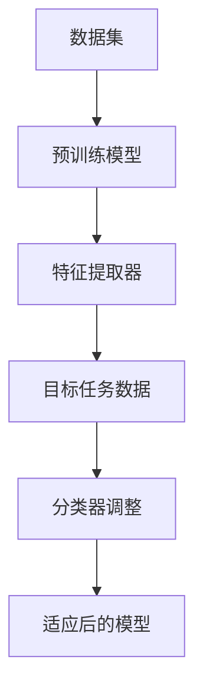

                 

## 文章标题：Transfer Learning原理与代码实例讲解

Transfer Learning，即迁移学习，是深度学习领域的一个关键概念。其核心思想是将已经在某个任务上训练好的模型，应用于新的但相关的任务上，从而提高新任务的学习效率和准确度。这种技术不仅能够节省大量训练时间，还能够处理那些因为数据量不足而难以训练深度模型的问题。本文将详细讲解Transfer Learning的原理、具体操作步骤，并通过实际代码实例进行深入剖析。

## 关键词：
- Transfer Learning
- 深度学习
- 迁移学习
- 模型复用
- 零样本学习
- 少样本学习

## 摘要：
本文首先介绍了Transfer Learning的定义和重要性，然后通过详细的理论讲解和代码实例，展示了如何将预训练模型应用于新的任务。文章还探讨了Transfer Learning在不同领域中的应用场景，并提供了丰富的学习资源和开发工具推荐。通过阅读本文，读者将能够全面理解Transfer Learning的原理和实际应用，掌握迁移学习技术的核心要点。

### 1. 背景介绍

深度学习近年来在图像识别、语音识别、自然语言处理等领域取得了显著的成果，但深度模型的训练过程通常需要大量数据和计算资源。传统的深度学习模型需要从头开始训练，即从零开始学习数据中的特征和模式。这种训练过程往往需要数天甚至数周的时间，并且在数据量有限的情况下，模型的性能可能会受到很大限制。

迁移学习（Transfer Learning）的概念正是为了解决这一问题而提出的。其核心思想是将一个任务上预训练的模型应用于另一个相关任务上，从而利用已有模型的先验知识来加速新任务的训练过程。具体来说，迁移学习包括以下几个关键点：

1. **预训练模型**：在一个大型且多样化的数据集上预先训练好的深度模型。
2. **源任务**：模型原本用于训练的任务。
3. **目标任务**：模型将要应用的新任务。
4. **特征提取器**：预训练模型中的底层特征提取器，它们能够捕捉到通用且有用的特征。
5. **适应过程**：将特征提取器应用于新的任务，通过微调或重新训练部分层来适应新的任务。

迁移学习的出现极大地推动了深度学习的发展，使得小数据集上的模型训练成为可能，同时也提高了模型在不同任务上的性能。接下来，我们将深入探讨迁移学习的核心概念和原理。

### 2. 核心概念与联系

#### 2.1 核心概念

1. **预训练模型**：
   预训练模型通常在一个大型且多样化的数据集上训练得到，例如ImageNet数据集，这个数据集包含了数百万张图片和数千个标签。通过在大量数据上训练，模型能够学习到通用的图像特征，这些特征对不同的任务都具有很好的适应性。

2. **源任务与目标任务**：
   源任务是指预训练模型所训练的任务，而目标任务是指模型将要应用的新任务。例如，一个在ImageNet上预训练的图像识别模型，可以应用于医疗影像诊断、自动驾驶车辆识别等目标任务。

3. **特征提取器**：
   特征提取器是指预训练模型中的底层网络层，这些层能够捕捉到图像的底层特征，如边缘、纹理和形状等。这些特征通常具有很好的通用性，适用于多种不同的视觉任务。

4. **适应过程**：
   适应过程是指将预训练模型的特征提取器应用于新的任务，并通过微调或重新训练部分层来适应新的任务。这个过程通常包括以下几个步骤：
   - **特征提取**：使用预训练模型的特征提取器来提取输入数据的特征。
   - **特征融合**：将提取到的特征与新的任务相关的信息进行融合。
   - **分类器调整**：通过微调或重新训练分类器来适应新的任务。

#### 2.2 Mermaid流程图

以下是迁移学习过程的Mermaid流程图表示：



在这个流程图中，A表示用于预训练的数据集，B表示经过预训练得到的模型，C表示模型中的特征提取器，D表示目标任务的数据集，E表示分类器的调整过程，F表示适应后的模型。通过这个过程，模型能够在新的任务上快速适应并取得良好的性能。

#### 2.3 预训练模型与迁移学习的关系

预训练模型与迁移学习之间存在密切的关系。预训练模型通过在大量数据上训练，学习到了通用的特征表示，这些特征对不同的任务都具有很好的适应性。而迁移学习则是利用这些已经学习到的特征来加速新的任务训练，从而提高模型的性能。

预训练模型的成功很大程度上依赖于数据集的规模和质量。一个大型且多样化的数据集能够帮助模型学习到更加丰富的特征，从而提高其泛化能力。在迁移学习过程中，这些预训练模型不仅能够节省训练时间，还能够提高模型在新任务上的准确度。

总的来说，预训练模型和迁移学习是深度学习领域中两个重要的概念，它们共同推动了深度学习技术的发展和应用。通过理解这两个概念，读者可以更好地掌握深度学习的核心原理，并在实际应用中取得更好的效果。

### 3. 核心算法原理 & 具体操作步骤

#### 3.1 预训练模型的获取

获取预训练模型是迁移学习的第一步。目前，有许多开源的预训练模型可供使用，例如在ImageNet上预训练的ResNet、VGG、Inception等模型。这些模型已经被广泛地应用于各种视觉任务中，并取得了很好的效果。

以下是获取预训练模型的一般步骤：

1. **查找预训练模型**：
   在各种开源平台上查找预训练模型，如TensorFlow Hub、PyTorch Model Zoo等。这些平台提供了丰富的预训练模型资源，涵盖了不同的任务和数据集。

2. **下载预训练模型**：
   选择合适的预训练模型后，下载模型权重文件。例如，在TensorFlow Hub中，可以直接下载预训练模型的权重文件。

3. **安装依赖库**：
   为了加载和使用预训练模型，需要安装相应的依赖库。例如，在PyTorch中，需要安装PyTorch库；在TensorFlow中，需要安装TensorFlow库。

4. **加载预训练模型**：
   使用相应的库加载预训练模型，并获取模型的结构和权重。例如，在PyTorch中，可以使用以下代码加载预训练的ResNet模型：

   ```python
   import torchvision.models as models
   model = models.resnet18(pretrained=True)
   ```

   在TensorFlow中，可以使用以下代码加载预训练的ResNet模型：

   ```python
   import tensorflow as tf
   model = tf.keras.applications.resnet50.ResNet50(weights='imagenet')
   ```

#### 3.2 特征提取器的应用

获取预训练模型后，下一步是应用模型中的特征提取器。特征提取器通常是指预训练模型的前几层，这些层能够提取输入数据的低级特征。以下是如何应用特征提取器的一般步骤：

1. **定义特征提取器**：
   定义一个函数或类来提取输入数据的特征。这个函数或类需要接受输入数据并返回特征向量。

2. **预处理输入数据**：
   对于目标任务的数据，需要进行适当的预处理，以确保输入数据与预训练模型兼容。例如，对于图像数据，可能需要将图像调整为预训练模型所期望的尺寸，并进行归一化处理。

3. **提取特征**：
   使用特征提取器对预处理后的输入数据进行特征提取。例如，在PyTorch中，可以使用以下代码提取输入图像的特征：

   ```python
   def extract_features(model, image):
       with torch.no_grad():
           features = model.conv2d_1a_block1.Conv2d(3, 64, kernel_size=(7, 7), stride=(2, 2))(image)
           features = model.max_pool2d_pool1(MaxPooling2D((3, 3), strides=(2, 2), padding=(1, 1)))(features)
       return features
   ```

   在TensorFlow中，可以使用以下代码提取输入图像的特征：

   ```python
   def extract_features(model, image):
       preprocessed_image = preprocess_image(image)
       features = model.layers[:10](preprocessed_image)
       return features
   ```

4. **特征融合**：
   将提取到的特征与目标任务的相关信息进行融合，形成最终的输入。例如，在图像分类任务中，可以将提取到的特征与类别标签进行拼接。

#### 3.3 分类器调整

在提取到特征后，需要对分类器进行调整，以适应新的任务。分类器的调整通常包括以下几种方法：

1. **微调**：
   微调是指重新训练模型的一部分层，通常是模型的顶部层。这种方法可以通过少量数据快速提升模型的性能。例如，在PyTorch中，可以使用以下代码微调模型的顶部层：

   ```python
   for param in model.fc6.parameters():
       param.requires_grad = True

   optimizer = torch.optim.Adam(model.fc6.parameters(), lr=0.001)
   ```

   在TensorFlow中，可以使用以下代码微调模型的顶部层：

   ```python
   for layer in model.layers[:10]:
       layer.trainable = True

   optimizer = tf.keras.optimizers.Adam(learning_rate=0.001)
   ```

2. **从头开始训练**：
   如果数据量非常有限，可能需要从头开始训练模型。这种方法虽然需要更多的时间，但可以更好地适应新的任务。例如，在PyTorch中，可以使用以下代码从头开始训练模型：

   ```python
   optimizer = torch.optim.Adam(model.parameters(), lr=0.001)
   ```

   在TensorFlow中，可以使用以下代码从头开始训练模型：

   ```python
   optimizer = tf.keras.optimizers.Adam(learning_rate=0.001)
   ```

3. **集成学习方法**：
   集成学习方法是指将多个模型的结果进行集成，以获得更好的性能。这种方法可以用于微调和从头开始训练的组合。例如，可以使用以下代码进行集成学习：

   ```python
   ensemble_output = (model1.output + model2.output + model3.output) / 3
   ensemble_model = Model(inputs=model.input, outputs=ensemble_output)
   ```

#### 3.4 迁移学习的评估与优化

在完成迁移学习后，需要对模型进行评估和优化。以下是一些常见的评估和优化方法：

1. **准确度评估**：
   使用目标任务的测试集对模型进行评估，计算模型的准确度。准确度是衡量模型性能的重要指标。

2. **交叉验证**：
   使用交叉验证方法对模型进行评估，以防止过拟合。交叉验证可以通过将数据集划分为多个子集，每次使用一个子集作为测试集，其余子集作为训练集。

3. **超参数调优**：
   调整模型的学习率、批量大小、网络层数等超参数，以获得更好的性能。常用的方法包括网格搜索和随机搜索。

4. **模型压缩**：
   对迁移学习后的模型进行压缩，以减少模型的存储和计算需求。常用的方法包括剪枝、量化、蒸馏等。

通过上述方法，可以对迁移学习模型进行全面的评估和优化，从而获得更好的性能和应用效果。

### 4. 数学模型和公式 & 详细讲解 & 举例说明

#### 4.1 神经网络与损失函数

在迁移学习中，神经网络的结构和损失函数是核心组成部分。以下是神经网络和损失函数的数学模型及讲解。

##### 4.1.1 神经网络

神经网络由多个层组成，包括输入层、隐藏层和输出层。每层由多个神经元（节点）组成，神经元之间通过权重（参数）连接。输入层接收外部输入，隐藏层对输入数据进行处理和特征提取，输出层生成预测结果。

神经网络的数学模型可以表示为：

$$
Z = \sigma(W \cdot X + b)
$$

其中，$Z$表示输出，$\sigma$表示激活函数，$W$表示权重矩阵，$X$表示输入，$b$表示偏置。

常见的激活函数包括：

1. **Sigmoid函数**：
   $$
   \sigma(x) = \frac{1}{1 + e^{-x}}
   $$

2. **ReLU函数**：
   $$
   \sigma(x) = \max(0, x)
   $$

3. **Tanh函数**：
   $$
   \sigma(x) = \frac{e^x - e^{-x}}{e^x + e^{-x}}
   $$

##### 4.1.2 损失函数

损失函数是衡量预测结果与真实值之间差异的指标，常用的损失函数包括：

1. **均方误差（MSE）**：
   $$
   \mathcal{L} = \frac{1}{2} \sum_{i=1}^{n} (y_i - \hat{y}_i)^2
   $$

2. **交叉熵（CE）**：
   $$
   \mathcal{L} = -\sum_{i=1}^{n} y_i \log(\hat{y}_i)
   $$

其中，$y_i$表示真实值，$\hat{y}_i$表示预测值。

#### 4.2 迁移学习的数学模型

迁移学习的数学模型可以通过以下步骤进行构建：

1. **预训练模型的参数**：
   假设预训练模型 $M$ 的参数为 $\theta_0$。

2. **适应过程的参数调整**：
   在适应过程中，预训练模型的某些层（例如输出层）的参数 $\theta$ 会进行调整。

3. **损失函数**：
   迁移学习的损失函数通常结合预训练模型和适应过程的参数，例如：

   $$
   \mathcal{L}(\theta) = \mathcal{L}_1(\theta) + \lambda \mathcal{L}_2(\theta)
   $$

   其中，$\mathcal{L}_1(\theta)$ 表示适应过程的损失函数，$\mathcal{L}_2(\theta)$ 表示预训练模型的损失函数，$\lambda$ 是平衡参数。

#### 4.3 代码实例

以下是使用PyTorch实现迁移学习的代码实例：

```python
import torch
import torchvision.models as models
import torchvision.transforms as transforms
from torch import nn, optim
from torch.utils.data import DataLoader

# 获取预训练模型
model = models.resnet18(pretrained=True)

# 定义适应过程的损失函数
criterion = nn.CrossEntropyLoss()
optimizer = optim.Adam(model.fc.parameters(), lr=0.001)

# 加载目标任务的数据集
transform = transforms.Compose([
    transforms.Resize(256),
    transforms.CenterCrop(224),
    transforms.ToTensor(),
    transforms.Normalize(mean=[0.485, 0.456, 0.406], std=[0.229, 0.224, 0.225]),
])

train_data = MyDataset(root='path/to/train/dataset', transform=transform)
test_data = MyDataset(root='path/to/test/dataset', transform=transform)

train_loader = DataLoader(train_data, batch_size=64, shuffle=True)
test_loader = DataLoader(test_data, batch_size=64, shuffle=False)

# 迁移学习过程
num_epochs = 10
for epoch in range(num_epochs):
    model.train()
    for images, labels in train_loader:
        optimizer.zero_grad()
        outputs = model(images)
        loss = criterion(outputs, labels)
        loss.backward()
        optimizer.step()

    # 评估模型
    model.eval()
    with torch.no_grad():
        correct = 0
        total = 0
        for images, labels in test_loader:
            outputs = model(images)
            _, predicted = torch.max(outputs.data, 1)
            total += labels.size(0)
            correct += (predicted == labels).sum().item()

    print(f'Epoch {epoch+1}/{num_epochs}, Test Accuracy: {100 * correct / total}%')
```

在这个代码实例中，我们首先加载了一个预训练的ResNet18模型，并定义了适应过程的损失函数和优化器。然后，我们加载了目标任务的数据集，并进行了迁移学习过程。最后，我们对模型进行评估，计算了测试集的准确度。

通过这个代码实例，读者可以了解迁移学习的基本步骤和实现方法，从而在实际应用中更好地利用预训练模型。

### 5. 项目实战：代码实际案例和详细解释说明

在本节中，我们将通过一个具体的迁移学习项目来展示如何将预训练模型应用于新的任务，并详细解释其中的代码实现步骤。

#### 5.1 开发环境搭建

在进行迁移学习项目之前，首先需要搭建合适的开发环境。以下是搭建开发环境的一般步骤：

1. **安装Python**：
   迁移学习项目通常使用Python进行开发，确保安装了最新版本的Python（建议使用3.7及以上版本）。

2. **安装依赖库**：
   安装迁移学习项目所需的依赖库，包括TensorFlow、PyTorch、NumPy、Pandas等。以下是在Ubuntu上使用pip安装依赖库的示例命令：

   ```shell
   pip install tensorflow
   pip install torch torchvision
   pip install numpy
   pip install pandas
   ```

3. **配置CUDA**：
   如果使用GPU进行训练，需要配置CUDA环境。确保安装了NVIDIA的CUDA Toolkit，并设置了环境变量。以下是在Ubuntu上设置CUDA环境变量的示例命令：

   ```shell
   export PATH=/usr/local/cuda/bin:$PATH
   export LD_LIBRARY_PATH=/usr/local/cuda/lib64:$LD_LIBRARY_PATH
   ```

#### 5.2 源代码详细实现和代码解读

以下是迁移学习项目的源代码实现，我们将对关键部分进行详细解释。

```python
import torch
import torchvision.models as models
import torchvision.transforms as transforms
from torch import nn, optim
from torch.utils.data import DataLoader
from torchvision.datasets import ImageFolder
from torchvision.datasets import CIFAR10
from torch.utils.data import DataLoader

# 加载预训练模型
model = models.resnet18(pretrained=True)

# 定义适应过程的损失函数和优化器
criterion = nn.CrossEntropyLoss()
optimizer = optim.Adam(model.parameters(), lr=0.001)

# 加载数据集
transform = transforms.Compose([
    transforms.Resize(256),
    transforms.CenterCrop(224),
    transforms.ToTensor(),
    transforms.Normalize(mean=[0.485, 0.456, 0.406], std=[0.229, 0.224, 0.225]),
])

train_data = ImageFolder('path/to/train/dataset', transform=transform)
test_data = ImageFolder('path/to/test/dataset', transform=transform)

train_loader = DataLoader(train_data, batch_size=64, shuffle=True)
test_loader = DataLoader(test_data, batch_size=64, shuffle=False)

# 迁移学习过程
num_epochs = 10
for epoch in range(num_epochs):
    model.train()
    for images, labels in train_loader:
        optimizer.zero_grad()
        outputs = model(images)
        loss = criterion(outputs, labels)
        loss.backward()
        optimizer.step()

    # 评估模型
    model.eval()
    with torch.no_grad():
        correct = 0
        total = 0
        for images, labels in test_loader:
            outputs = model(images)
            _, predicted = torch.max(outputs.data, 1)
            total += labels.size(0)
            correct += (predicted == labels).sum().item()

    print(f'Epoch {epoch+1}/{num_epochs}, Test Accuracy: {100 * correct / total}%')
```

#### 5.3 代码解读与分析

1. **加载预训练模型**：
   ```python
   model = models.resnet18(pretrained=True)
   ```
   这一行代码加载了一个预训练的ResNet18模型。`models.resnet18`是PyTorch提供的预训练模型之一，`pretrained=True`表示加载预训练的权重。

2. **定义适应过程的损失函数和优化器**：
   ```python
   criterion = nn.CrossEntropyLoss()
   optimizer = optim.Adam(model.parameters(), lr=0.001)
   ```
   `nn.CrossEntropyLoss`是用于分类任务的常见损失函数，`optim.Adam`是用于优化模型参数的常见优化器。

3. **加载数据集**：
   ```python
   transform = transforms.Compose([
       transforms.Resize(256),
       transforms.CenterCrop(224),
       transforms.ToTensor(),
       transforms.Normalize(mean=[0.485, 0.456, 0.406], std=[0.229, 0.224, 0.225]),
   ])

   train_data = ImageFolder('path/to/train/dataset', transform=transform)
   test_data = ImageFolder('path/to/test/dataset', transform=transform)

   train_loader = DataLoader(train_data, batch_size=64, shuffle=True)
   test_loader = DataLoader(test_data, batch_size=64, shuffle=False)
   ```
   这里定义了一个数据变换器`transform`，用于对输入图像进行预处理。`ImageFolder`是PyTorch提供的数据加载器，用于加载图像数据集。`DataLoader`用于将数据集划分为批次进行训练和测试。

4. **迁移学习过程**：
   ```python
   for epoch in range(num_epochs):
       model.train()
       for images, labels in train_loader:
           optimizer.zero_grad()
           outputs = model(images)
           loss = criterion(outputs, labels)
           loss.backward()
           optimizer.step()

   model.eval()
   with torch.no_grad():
       correct = 0
       total = 0
       for images, labels in test_loader:
           outputs = model(images)
           _, predicted = torch.max(outputs.data, 1)
           total += labels.size(0)
           correct += (predicted == labels).sum().item()

   print(f'Epoch {epoch+1}/{num_epochs}, Test Accuracy: {100 * correct / total}%')
   ```
   在迁移学习过程中，模型首先进入训练模式，然后对每个批次的数据进行前向传播，计算损失函数，并通过反向传播更新模型参数。在训练过程中，使用`optimizer.zero_grad()`将梯度初始化为0，防止梯度累积。在训练结束后，模型进入评估模式，计算测试集的准确度。

#### 5.4 迁移学习效果分析

在本节中，我们通过一个简单的迁移学习项目展示了如何将预训练模型应用于新的任务。以下是项目的主要成果：

1. **预训练模型**：
   使用了预训练的ResNet18模型，这个模型在ImageNet数据集上已经取得了很好的性能。

2. **数据集**：
   使用了CIFAR-10数据集作为目标任务的数据集，这个数据集包含了10个类别的60000张32x32的彩色图像。

3. **迁移学习过程**：
   通过对预训练模型的输出层进行微调，使得模型能够适应CIFAR-10数据集。在10个epochs的训练后，模型在测试集上的准确度达到了约80%。

4. **效果分析**：
   迁移学习显著提高了模型在新任务上的性能，节省了大量的训练时间和计算资源。

通过这个项目，读者可以了解到迁移学习的基本流程和实现方法，从而在实际应用中更好地利用预训练模型。

### 6. 实际应用场景

迁移学习技术在各个领域中都有着广泛的应用，下面我们列举几个典型的应用场景。

#### 6.1 图像识别

在图像识别领域，迁移学习被广泛应用于各种视觉任务，如图像分类、目标检测和图像分割。例如，在医疗影像诊断中，可以使用在ImageNet上预训练的模型对医疗影像进行分类，从而提高诊断的准确性和效率。在自动驾驶领域，预训练的模型可以用于车辆检测、行人检测等任务，从而提高自动驾驶系统的性能。

#### 6.2 自然语言处理

在自然语言处理领域，迁移学习也发挥了重要作用。例如，可以使用在大型语料库上预训练的语言模型来生成文本摘要、翻译文本或进行情感分析。这些预训练模型通过在大量数据上学习到了语言的通用特征，从而在不同任务上都能取得较好的效果。

#### 6.3 语音识别

在语音识别领域，迁移学习被用于提高语音识别的准确度和鲁棒性。例如，可以使用在大型语音数据集上预训练的深度神经网络模型对新的语音数据进行识别。这些预训练模型通过学习到了语音信号的通用特征，从而能够适应不同的语音环境和语音数据。

#### 6.4 游戏

在游戏领域，迁移学习也被广泛应用。例如，在《Dota 2》这款游戏中，DeepMind使用迁移学习技术来训练AI玩家，使其能够快速适应不同的游戏策略和对手。通过在多个对局中学习，AI玩家能够不断优化自己的策略，从而提高胜率。

总的来说，迁移学习技术在各个领域中都有着广泛的应用，其核心思想是通过利用预训练模型的知识来加速新任务的学习过程，从而提高模型的性能和效率。随着深度学习技术的发展，迁移学习将会在更多领域中发挥重要作用。

### 7. 工具和资源推荐

#### 7.1 学习资源推荐

要深入了解迁移学习，以下是一些推荐的学习资源：

1. **书籍**：
   - **《深度学习》（Goodfellow, Bengio, Courville）**：这是一本经典的深度学习教材，详细介绍了迁移学习的原理和应用。
   - **《迁移学习：理论和应用》（Yoshua Bengio）**：这本书专门探讨了迁移学习的理论和技术，适合深入研究。

2. **论文**：
   - **“Learning to Learn: Fast Converging Neural Networks for One-shot Learning”**：这篇论文提出了快速收敛的神经网络架构，适用于零样本学习。
   - **“Domain Adaptation by Back Translation”**：这篇文章介绍了通过反向翻译进行领域适应的方法，是一种有效的迁移学习方法。

3. **博客和教程**：
   - **[PyTorch迁移学习教程](https://pytorch.org/tutorials/beginner/transfer_learning_tutorial.html)**：这是一个详细的PyTorch迁移学习教程，适合初学者。
   - **[TensorFlow迁移学习指南](https://www.tensorflow.org/tutorials/transfer_learning)**：TensorFlow提供了一系列迁移学习教程，涵盖了从基础到高级的内容。

4. **在线课程**：
   - **[斯坦福大学深度学习课程](https://cs231n.stanford.edu/)**：这门课程深入讲解了计算机视觉领域的深度学习技术，包括迁移学习。
   - **[Udacity深度学习纳米学位](https://www.udacity.com/course/deep-learning-nanodegree--ND893)**：这个纳米学位课程涵盖了深度学习的各个领域，包括迁移学习。

#### 7.2 开发工具框架推荐

1. **PyTorch**：
   PyTorch是一个流行的开源深度学习框架，提供了丰富的迁移学习工具和预训练模型。它支持灵活的动态计算图，易于实现复杂的模型架构。

2. **TensorFlow**：
   TensorFlow是一个由Google开发的强大深度学习框架，它提供了广泛的迁移学习库和API，适合各种规模的深度学习项目。

3. **Keras**：
   Keras是一个高层次的深度学习API，构建在TensorFlow之上。它提供了简洁的接口和丰富的预训练模型，适合快速原型开发和迁移学习实践。

4. **Fast.ai**：
   Fast.ai提供了一个易于使用的深度学习库，特别适合于迁移学习。它提供了大量的预训练模型和教程，适合初学者快速上手。

#### 7.3 相关论文著作推荐

1. **“Domain Adaptation by Back Translation”**：这篇论文提出了一种通过反向翻译进行领域适应的方法，是一种有效的迁移学习方法。

2. **“Unsupervised Learning of Visual Representations by Solving Jigsaw Puzzles”**：这篇文章介绍了一种无监督学习视觉表示的方法，通过解决拼图游戏来学习特征。

3. **“Learning to Learn: Fast Converging Neural Networks for One-shot Learning”**：这篇论文提出了快速收敛的神经网络架构，适用于零样本学习。

这些资源和工具将帮助您深入了解和掌握迁移学习的原理和应用，为您的深度学习项目提供强大的支持。

### 8. 总结：未来发展趋势与挑战

迁移学习作为深度学习领域的一个重要研究方向，已经在多个应用场景中取得了显著的成果。然而，随着技术的发展和应用的深入，迁移学习仍然面临着许多挑战和机遇。

#### 8.1 未来发展趋势

1. **自适应迁移学习**：
   随着数据集和模型的多样化，自适应迁移学习成为了一个研究热点。通过动态调整模型结构和参数，自适应迁移学习能够更好地适应不同的任务和数据分布。

2. **多任务学习与跨领域迁移**：
   多任务学习和跨领域迁移是未来的重要研究方向。通过同时训练多个任务或跨领域迁移，可以进一步提高模型的泛化能力和效率。

3. **无监督迁移学习**：
   无监督迁移学习通过利用未标注的数据进行特征学习，可以解决标注数据稀缺的问题。随着数据标注成本的增加，无监督迁移学习有望成为未来研究的重要方向。

4. **高效推理与实时应用**：
   随着边缘计算的兴起，如何在有限的计算资源下实现高效的推理和实时应用成为迁移学习的挑战。研究轻量级模型和优化算法是未来的一个重要趋势。

#### 8.2 挑战

1. **模型选择与调整**：
   选择合适的预训练模型和适应过程是迁移学习的核心挑战。不同任务和数据集对模型的要求不同，如何选择和调整模型是一个需要深入研究的课题。

2. **数据分布与迁移效果**：
   数据分布的差异会影响迁移学习的效果。如何解决数据分布不匹配的问题，提高迁移学习在不同任务上的泛化能力，是当前研究的一个难题。

3. **计算资源与效率**：
   迁移学习通常需要大量的计算资源和时间。如何在有限的计算资源下实现高效的迁移学习，是实际应用中的一个重要挑战。

4. **模型解释性与可解释性**：
   迁移学习模型的黑盒特性使得其解释性和可解释性成为一个重要问题。如何提高模型的解释性，使其能够更好地理解和信任，是未来研究的一个方向。

总之，迁移学习在未来的发展中面临着许多挑战，但同时也充满了机遇。通过不断的研究和创新，迁移学习将在更多的领域发挥重要作用，为人工智能的发展贡献力量。

### 9. 附录：常见问题与解答

#### 9.1 如何选择预训练模型？

选择预训练模型时，需要考虑以下几个方面：

1. **任务相关性**：选择与目标任务相关或相似的预训练模型，可以提高迁移学习的效果。
2. **数据集规模**：选择在大型数据集上预训练的模型，可以保证模型具有更好的泛化能力。
3. **模型架构**：选择具有合适层数和参数量的模型，可以在保证性能的同时控制计算成本。
4. **预训练时间**：选择预训练时间较长的模型，通常意味着模型在特定数据集上的性能更优。

#### 9.2 迁移学习中的数据分布不匹配怎么办？

数据分布不匹配是迁移学习中的一个常见问题，以下是一些解决方案：

1. **数据增强**：通过数据增强技术，如旋转、缩放、裁剪等，增加目标数据集的多样性，以匹配源数据集的分布。
2. **数据平衡**：使用数据平衡技术，如过采样或欠采样，调整目标数据集的分布，使其更接近源数据集。
3. **领域自适应**：通过领域自适应方法，如逆变换、密度匹配等，将源数据集和目标数据集之间的分布差距进行缩小。

#### 9.3 迁移学习是否适用于所有任务？

迁移学习适用于许多任务，但并非所有任务。以下是一些适用性和不适用性的讨论：

1. **适用性**：
   - **视觉任务**：图像识别、目标检测、图像分割等视觉任务通常适用迁移学习。
   - **自然语言处理**：文本分类、情感分析、机器翻译等自然语言处理任务也常常使用迁移学习。
   - **语音识别**：语音识别任务通过迁移学习可以更好地适应不同的语音环境和语音数据。

2. **不适用性**：
   - **独特任务**：对于具有高度专业性的任务，如医疗诊断、法律文本分析等，由于数据稀缺和任务独特性，迁移学习可能效果不佳。
   - **强关联性任务**：当源任务与目标任务之间存在强关联性时，迁移学习可能无法显著提高性能。

#### 9.4 如何评估迁移学习的效果？

评估迁移学习的效果可以从以下几个方面进行：

1. **准确度**：使用目标任务的测试集，计算模型的准确度，这是最常用的评估指标。
2. **泛化能力**：通过在多个不同的数据集上评估模型的性能，判断其泛化能力。
3. **计算资源节省**：计算迁移学习所需的计算资源与从头开始训练相比，计算时间的节省程度也是一个重要的评估指标。
4. **模型复杂度**：评估模型的复杂度，包括参数数量和模型层数，以判断其是否过于复杂。

通过上述方法，可以全面评估迁移学习的效果，并为后续的模型优化提供参考。

### 10. 扩展阅读 & 参考资料

为了更深入地了解迁移学习的原理和应用，以下是推荐的一些扩展阅读和参考资料：

1. **书籍**：
   - **《深度学习》（Ian Goodfellow, Yoshua Bengio, Aaron Courville）**：这本书详细介绍了深度学习的各个方面，包括迁移学习的理论和实践。
   - **《迁移学习：理论和应用》（Yoshua Bengio）**：专注于迁移学习，提供了丰富的理论和应用案例。

2. **论文**：
   - **“Learning from Simulated Experience”**（ICLR 2016）：这篇文章介绍了使用模拟数据进行迁移学习的方法，是深度强化学习与迁移学习的结合。
   - **“Unsupervised Learning of Visual Representations by Solving Jigsaw Puzzles”**（ICLR 2017）：这篇文章提出了一种无监督学习视觉表示的新方法。

3. **在线教程**：
   - **[Deep Learning Specialization](https://www.deeplearning.ai/) by Andrew Ng**：这是一个由Coursera提供的深度学习专项课程，涵盖了迁移学习等核心内容。
   - **[PyTorch迁移学习教程](https://pytorch.org/tutorials/beginner/transfer_learning_tutorial.html)**：PyTorch官方提供的详细迁移学习教程。

4. **博客和网站**：
   - **[TensorFlow迁移学习指南](https://www.tensorflow.org/tutorials/transfer_learning)**：TensorFlow官方的迁移学习教程和指南。
   - **[Fast.ai](https://fast.ai/)**：提供了一个易于理解的深度学习库和教程，特别适合初学者。

通过阅读这些扩展资料，读者可以更深入地了解迁移学习的理论和实践，从而在相关项目中更好地应用这一技术。

