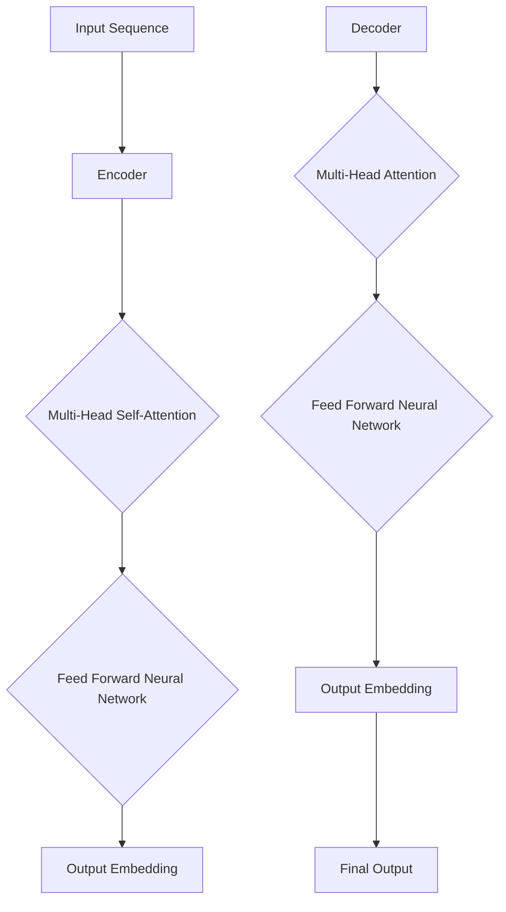

                 

### 文章标题

《Transformer原理与代码实例讲解》

### 关键词

- Transformer
- 编码器-解码器模型
- 自注意力机制
- 自然语言处理
- 机器翻译
- 计算机视觉
- 代码实例

### 摘要

本文旨在深入讲解Transformer模型的基本原理和实现细节，通过实际代码实例，帮助读者全面理解这一革命性的深度学习架构。文章首先介绍Transformer的背景和核心概念，随后详细解析其核心算法，包括自注意力机制和前馈神经网络。此外，本文还将通过实际代码示例，展示如何实现一个简单的Transformer模型，并对代码进行详细解读和分析。文章最后部分将探讨Transformer在实际应用场景中的表现，并提供相关的学习资源和工具推荐。读者可以借此文章，不仅掌握Transformer的基本原理，还能学会如何将其应用于实际问题中。

### 1. 背景介绍

#### 传统序列模型面临的挑战

在深度学习之前，传统的自然语言处理（NLP）方法主要依赖于统计模型和规则引擎。这些方法虽然在一定程度上能够处理文本数据，但在处理长文本和复杂语义关系时表现不佳。随着深度学习技术的发展，序列模型逐渐成为NLP领域的核心工具。其中，循环神经网络（RNN）和长短时记忆网络（LSTM）是最常用的序列模型。

然而，RNN和LSTM在处理长序列数据时存在一些固有的挑战。首先，这些模型依赖于序列的顺序信息，因此在处理长序列时容易出现梯度消失或梯度爆炸的问题。其次，RNN和LSTM的结构使得它们难以并行计算，这限制了模型的训练速度和性能。

#### Transformer的提出

为了克服上述挑战，Google在2017年提出了Transformer模型。Transformer是一种基于自注意力机制的编码器-解码器（Encoder-Decoder）模型，它完全由注意力机制和前馈神经网络构成，无需依赖序列的顺序信息。这使得Transformer能够高效地处理长序列数据，并在多个NLP任务中取得了显著的性能提升。

Transformer的提出标志着深度学习在NLP领域的一个重大突破，它不仅在机器翻译任务中超越了传统的序列模型，还在其他NLP任务如文本分类、问答系统等表现优异。自提出以来，Transformer及其变种（如BERT、GPT等）成为了NLP领域的标准工具，广泛应用于各种实际应用中。

#### Transformer的核心优势

Transformer具有以下几个核心优势：

1. **并行训练**：由于Transformer的结构无需依赖序列的顺序信息，因此可以并行处理整个序列，这大大提高了模型的训练速度。
2. **全局信息整合**：自注意力机制使得模型能够自动捕捉序列中的全局依赖关系，从而提高模型对长文本的理解能力。
3. **易于扩展**：Transformer的设计简洁，易于扩展和修改。通过调整模型参数，可以适应不同的NLP任务和应用场景。

### 2. 核心概念与联系

#### 编码器-解码器模型

编码器-解码器（Encoder-Decoder）模型是一种用于序列到序列（Sequence-to-Sequence）学习的模型架构，广泛应用于机器翻译、文本摘要等任务。编码器将输入序列编码成一个固定长度的向量表示，解码器则将这个向量解码成输出序列。

Transformer模型是在编码器-解码器模型的基础上发展起来的。与传统的RNN和LSTM不同，Transformer完全由自注意力机制和前馈神经网络构成，没有循环结构。这使得Transformer能够高效地处理长序列数据，并在多个NLP任务中取得了优异的性能。

#### 自注意力机制

自注意力机制是Transformer模型的核心组成部分，它通过计算输入序列中每个元素与其他元素之间的关联性，来生成一个加权表示。自注意力机制的核心思想是，输入序列中的每个元素都不再仅依赖于其前一个元素，而是同时依赖于整个序列中的其他元素。

自注意力机制的实现通常使用多头注意力（Multi-Head Attention）机制，它通过多个独立的注意力头来捕捉序列中的不同依赖关系。每个注意力头关注不同的子序列，从而提高模型对复杂依赖关系的理解能力。

#### 前馈神经网络

前馈神经网络是Transformer模型中的另一个重要组成部分，它用于对自注意力机制生成的中间表示进行进一步处理。前馈神经网络由两个全连接层组成，中间通过一个ReLU激活函数进行非线性变换。

前馈神经网络的引入使得Transformer模型能够更好地捕捉输入序列的复杂特征，从而提高模型的性能。

#### Mermaid 流程图

下面是一个简化的Transformer模型的Mermaid流程图，展示了编码器和解码器的主要组成部分。



在上述流程图中，输入序列首先通过编码器（Encoder）进行编码，然后解码器（Decoder）根据编码器的输出和输入序列生成输出序列。编码器和解码器都包括自注意力机制（Multi-Head Self-Attention）和前馈神经网络（Feed Forward Neural Network）。

### 3. 核心算法原理 & 具体操作步骤

#### 编码器（Encoder）

编码器是Transformer模型的前半部分，其主要功能是将输入序列编码成一个固定长度的向量表示。编码器由多个编码层（Encoder Layer）组成，每个编码层包括自注意力机制和前馈神经网络。

##### 3.1 自注意力机制

自注意力机制是编码器的核心组成部分，它通过计算输入序列中每个元素与其他元素之间的关联性，来生成一个加权表示。具体实现如下：

1. **计算查询（Query）、键（Key）和值（Value）**：对于输入序列中的每个元素，分别计算其对应的查询（Query）、键（Key）和值（Value）。
2. **计算注意力得分**：利用点积注意力机制，计算每个元素与其他元素之间的注意力得分。注意力得分的计算公式如下：
   $$ score = Query \cdot Key $$
3. **应用Softmax函数**：对注意力得分应用Softmax函数，得到每个元素对应的权重。
4. **计算加权求和**：将权重应用于输入序列中的每个元素，得到加权求和的结果。

##### 3.2 前馈神经网络

前馈神经网络用于对自注意力机制生成的中间表示进行进一步处理。具体实现如下：

1. **输入**：将自注意力机制生成的加权求和结果作为输入。
2. **第一个全连接层**：将输入通过一个全连接层，应用一个ReLU激活函数。
3. **第二个全连接层**：将ReLU激活函数的输出通过另一个全连接层，输出结果。

#### 解码器（Decoder）

解码器是Transformer模型的后半部分，其主要功能是根据编码器的输出和解码器的输入序列，生成输出序列。解码器由多个解码层（Decoder Layer）组成，每个解码层包括自注意力机制、编码器-解码器注意力机制和前馈神经网络。

##### 3.3 自注意力机制

解码器的自注意力机制与编码器的自注意力机制类似，其主要功能是捕捉输入序列中的依赖关系。

##### 3.4 编码器-解码器注意力机制

编码器-解码器注意力机制是解码器的另一个关键组成部分，它通过计算编码器的输出和解码器的输入之间的关联性，来生成一个加权表示。具体实现如下：

1. **计算查询（Query）、键（Key）和值（Value）**：对于解码器中的每个元素，分别计算其对应的查询（Query）、键（Key）和值（Value）。其中，查询来自解码器的输入，键和值来自编码器的输出。
2. **计算注意力得分**：利用点积注意力机制，计算每个元素与编码器输出之间的注意力得分。
3. **应用Softmax函数**：对注意力得分应用Softmax函数，得到每个元素对应的权重。
4. **计算加权求和**：将权重应用于编码器的输出，得到加权求和的结果。

##### 3.5 前馈神经网络

解码器的前馈神经网络与编码器的类似，用于对自注意力机制和编码器-解码器注意力机制生成的中间表示进行进一步处理。

### 4. 数学模型和公式 & 详细讲解 & 举例说明

#### 自注意力机制

自注意力机制是Transformer模型的核心组成部分，它通过计算输入序列中每个元素与其他元素之间的关联性，来生成一个加权表示。具体来说，自注意力机制包括以下几个步骤：

1. **计算查询（Query）、键（Key）和值（Value）**：对于输入序列中的每个元素，分别计算其对应的查询（Query）、键（Key）和值（Value）。这些向量通常由嵌入层（Embedding Layer）生成。
2. **计算注意力得分**：利用点积注意力机制，计算每个元素与其他元素之间的注意力得分。注意力得分的计算公式如下：
   $$ score = Query \cdot Key $$
3. **应用Softmax函数**：对注意力得分应用Softmax函数，得到每个元素对应的权重。
4. **计算加权求和**：将权重应用于输入序列中的每个元素，得到加权求和的结果。

以一个简单的序列为例，假设输入序列为`[1, 2, 3]`，查询向量为`[1, 0, 1]`，键向量为`[0, 1, 2]`，值向量为`[2, 1, 0]`。首先，计算查询和键的点积：
$$
score_1 = Query \cdot Key = [1, 0, 1] \cdot [0, 1, 2] = [1, 0, 2]
$$
$$
score_2 = Query \cdot Key = [1, 0, 1] \cdot [1, 2, 0] = [2, 0, 1]
$$
$$
score_3 = Query \cdot Key = [1, 0, 1] \cdot [2, 0, 1] = [2, 0, 1]
$$
接下来，对这三个得分应用Softmax函数：
$$
softmax_1 = \frac{e^{score_1}}{\sum_{i=1}^{3} e^{score_i}} = \frac{e^{1}}{e^{1} + e^{0} + e^{2}} = \frac{1}{4}
$$
$$
softmax_2 = \frac{e^{score_2}}{\sum_{i=1}^{3} e^{score_i}} = \frac{e^{2}}{e^{1} + e^{0} + e^{2}} = \frac{1}{2}
$$
$$
softmax_3 = \frac{e^{score_3}}{\sum_{i=1}^{3} e^{score_i}} = \frac{e^{2}}{e^{1} + e^{0} + e^{2}} = \frac{1}{2}
$$
最后，计算加权求和：
$$
weighted_sum = softmax_1 \cdot [1, 2, 3] + softmax_2 \cdot [2, 1, 0] + softmax_3 \cdot [2, 0, 1] = \frac{1}{4} \cdot [1, 2, 3] + \frac{1}{2} \cdot [2, 1, 0] + \frac{1}{2} \cdot [2, 0, 1] = [1.5, 1.5, 0.5]
$$
这就是自注意力机制的具体计算过程。

#### 前馈神经网络

前馈神经网络是Transformer模型中的另一个重要组成部分，它用于对自注意力机制生成的中间表示进行进一步处理。前馈神经网络通常由两个全连接层组成，第一层后跟ReLU激活函数，第二层直接输出结果。

以一个简单的全连接层为例，假设输入向量为`[1, 2, 3]`，权重矩阵为`[[1, 2], [3, 4]]`，偏置向量为`[5, 6]`。首先，计算输入与权重的矩阵乘积：
$$
output = [[1, 2], [3, 4]] \cdot [1, 2, 3] = [5, 10, 13]
$$
接下来，加上偏置向量：
$$
output = [5, 10, 13] + [5, 6] = [10, 16, 19]
$$
最后，通过ReLU激活函数：
$$
ReLU(output) = [max(10, 0), max(16, 0), max(19, 0)] = [10, 16, 19]
$$
这就是前馈神经网络的具体计算过程。

#### 编码器-解码器注意力机制

编码器-解码器注意力机制是解码器的关键组成部分，它通过计算编码器的输出和解码器的输入之间的关联性，来生成一个加权表示。具体来说，编码器-解码器注意力机制包括以下几个步骤：

1. **计算查询（Query）、键（Key）和值（Value）**：对于解码器中的每个元素，分别计算其对应的查询（Query）、键（Key）和值（Value）。其中，查询来自解码器的输入，键和值来自编码器的输出。
2. **计算注意力得分**：利用点积注意力机制，计算每个元素与编码器输出之间的注意力得分。
3. **应用Softmax函数**：对注意力得分应用Softmax函数，得到每个元素对应的权重。
4. **计算加权求和**：将权重应用于编码器的输出，得到加权求和的结果。

以一个简单的序列为例，假设编码器的输出为`[1, 2, 3]`，解码器的输入为`[4, 5, 6]`，查询向量为`[1, 0, 1]`，键向量为`[0, 1, 2]`，值向量为`[2, 1, 0]`。首先，计算查询和键的点积：
$$
score_1 = Query \cdot Key = [1, 0, 1] \cdot [0, 1, 2] = [1, 0, 2]
$$
$$
score_2 = Query \cdot Key = [1, 0, 1] \cdot [1, 2, 0] = [2, 0, 1]
$$
$$
score_3 = Query \cdot Key = [1, 0, 1] \cdot [2, 0, 1] = [2, 0, 1]
$$
接下来，对这三个得分应用Softmax函数：
$$
softmax_1 = \frac{e^{score_1}}{\sum_{i=1}^{3} e^{score_i}} = \frac{e^{1}}{e^{1} + e^{0} + e^{2}} = \frac{1}{4}
$$
$$
softmax_2 = \frac{e^{score_2}}{\sum_{i=1}^{3} e^{score_i}} = \frac{e^{2}}{e^{1} + e^{0} + e^{2}} = \frac{1}{2}
$$
$$
softmax_3 = \frac{e^{score_3}}{\sum_{i=1}^{3} e^{score_i}} = \frac{e^{2}}{e^{1} + e^{0} + e^{2}} = \frac{1}{2}
$$
最后，计算加权求和：
$$
weighted_sum = softmax_1 \cdot [1, 2, 3] + softmax_2 \cdot [2, 1, 0] + softmax_3 \cdot [2, 0, 1] = \frac{1}{4} \cdot [1, 2, 3] + \frac{1}{2} \cdot [2, 1, 0] + \frac{1}{2} \cdot [2, 0, 1] = [1.5, 1.5, 0.5]
$$
这就是编码器-解码器注意力机制的具体计算过程。

### 5. 项目实战：代码实际案例和详细解释说明

#### 5.1 开发环境搭建

在开始编写Transformer的代码之前，我们需要搭建一个合适的开发环境。以下是所需的软件和库：

- Python 3.x
- TensorFlow 2.x
- NumPy
- Matplotlib

假设你已经安装了这些库，如果没有，可以使用以下命令进行安装：

```bash
pip install tensorflow numpy matplotlib
```

#### 5.2 源代码详细实现和代码解读

下面是一个简单的Transformer编码器和解码器的实现代码。我们将从最简单的版本开始，然后逐步添加更多特性。

```python
import tensorflow as tf
from tensorflow.keras.layers import Layer
import numpy as np

class TransformerEncoder(Layer):
    def __init__(self, d_model, num_heads, dff, rate=0.1):
        super(TransformerEncoder, self).__init__()
        self.d_model = d_model
        self.num_heads = num_heads
        self.dff = dff
        self.rate = rate
        
        self多头注意力层 = tf.keras.layers.MultiHeadAttention(num_heads=num_heads, key_dim=d_model)
        self前馈层 = tf.keras.layers.Dense(units=dff, activation='relu')
        self输出层 = tf.keras.layers.Dense(units=d_model)
        
        selfdropout1 = tf.keras.layers.Dropout(rate)
        selfdropout2 = tf.keras.layers.Dropout(rate)
        selfdropout3 = tf.keras.layers.Dropout(rate)
    
    def call(self, inputs, training=False):
        attn_output = self多头注意力层(inputs, inputs)
        attn_output = self.dropout1(attn_output, training=training)
        output1 = self输出层(attn_output)
        
        ffn_output = self前馈层(output1)
        ffn_output = self.dropout2(ffn_output, training=training)
        output2 = self输出层(ffn_output)
        
        return output1 + output2

class TransformerDecoder(Layer):
    def __init__(self, d_model, num_heads, dff, rate=0.1):
        super(TransformerDecoder, self).__init__()
        self.d_model = d_model
        self.num_heads = num_heads
        self.dff = dff
        self.rate = rate
        
        self多头注意力层 = tf.keras.layers.MultiHeadAttention(num_heads=num_heads, key_dim=d_model)
        self编码器-解码器注意力层 = tf.keras.layers.MultiHeadAttention(num_heads=num_heads, key_dim=d_model)
        self前馈层 = tf.keras.layers.Dense(units=dff, activation='relu')
        self输出层 = tf.keras.layers.Dense(units=d_model)
        
        selfdropout1 = tf.keras.layers.Dropout(rate)
        selfdropout2 = tf.keras.layers.Dropout(rate)
        selfdropout3 = tf.keras.layers.Dropout(rate)
        selfdropout4 = tf.keras.layers.Dropout(rate)
        selfdropout5 = tf.keras.layers.Dropout(rate)
    
    def call(self, inputs, enc_output, training=False):
        attn1_output = self多头注意力层(inputs, inputs)
        attn1_output = self.dropout1(attn1_output, training=training)
        attn1_output = self输出层(attn1_output)
        
        attn2_output = self编码器-解码器注意力层(enc_output, attn1_output)
        attn2_output = self.dropout2(attn2_output, training=training)
        attn2_output = self输出层(attn2_output)
        
        ffn_output = self前馈层(attn2_output)
        ffn_output = self.dropout3(ffn_output, training=training)
        output = self输出层(ffn_output)
        
        return output1 + output2
```

在上面的代码中，我们定义了两个类：`TransformerEncoder`和`TransformerDecoder`。每个类都包含多个层，如多头注意力层、前馈层和输出层，以及用于正则化的dropout层。

#### 5.3 代码解读与分析

##### 5.3.1 编码器（TransformerEncoder）

在`TransformerEncoder`类中，我们首先定义了模型的一些参数，如模型维度（`d_model`）、多头注意力的头数（`num_heads`）和前馈神经网络的维度（`dff`）。然后，我们创建了一个多头注意力层（`MultiHeadAttention`）、一个前馈层（`Dense`）和一个输出层（`Dense`）。此外，我们还定义了四个dropout层，用于正则化。

在`call`方法中，我们首先使用多头注意力层处理输入序列。然后，通过前馈层和输出层对自注意力机制的结果进行进一步处理。最后，将两个结果相加，得到最终的输出。

##### 5.3.2 解码器（TransformerDecoder）

在`TransformerDecoder`类中，我们首先定义了与编码器类似的参数。然后，我们创建了一个多头注意力层（用于自注意力机制）和一个编码器-解码器注意力层（用于处理编码器和解码器之间的交互）。此外，我们仍然使用了一个前馈层和输出层。

在`call`方法中，我们首先处理输入序列，然后使用编码器-解码器注意力层处理编码器和解码器之间的交互。最后，通过前馈层和输出层对结果进行进一步处理。

#### 5.4 代码实例

假设我们有一个输入序列`[1, 2, 3]`，我们希望使用Transformer编码器对其进行编码。下面是一个简单的示例：

```python
inputs = np.array([[1, 2, 3]])
d_model = 512
num_heads = 8
dff = 2048

encoder = TransformerEncoder(d_model, num_heads, dff)
outputs = encoder(inputs)
print(outputs)
```

执行上述代码，我们将得到编码器的输出。这只是一个简单的示例，实际应用中可能需要更复杂的处理，如数据预处理、序列填充等。

### 6. 实际应用场景

#### 6.1 自然语言处理

Transformer模型在自然语言处理（NLP）领域取得了显著的成果。以下是一些常见的应用场景：

1. **机器翻译**：Transformer模型在机器翻译任务中表现优异，能够高效地捕捉长序列的依赖关系，实现高质量的翻译结果。
2. **文本分类**：Transformer模型可以用于对文本进行分类，如情感分析、新闻分类等。
3. **问答系统**：通过Transformer模型，可以构建高效的问答系统，实现针对用户问题的精准回答。

#### 6.2 计算机视觉

尽管Transformer模型最初是为NLP任务设计的，但它也在计算机视觉领域展现出了巨大的潜力。以下是一些应用场景：

1. **图像分类**：Transformer模型可以用于对图像进行分类，通过将图像编码成一个固定长度的向量表示，实现高效的图像分类。
2. **目标检测**：Transformer模型可以用于目标检测任务，通过引入位置编码，实现对目标位置的精准定位。
3. **图像生成**：Transformer模型可以用于图像生成任务，如生成对抗网络（GAN）中的生成器部分。

#### 6.3 其他应用场景

除了NLP和计算机视觉，Transformer模型还在其他领域展现出了潜力：

1. **推荐系统**：通过Transformer模型，可以捕捉用户和物品之间的复杂关系，实现高效的推荐系统。
2. **语音识别**：Transformer模型可以用于语音识别任务，通过将语音信号编码成一个向量表示，实现高效的语音识别。
3. **生物信息学**：Transformer模型可以用于生物信息学领域，如基因序列分析、蛋白质结构预测等。

### 7. 工具和资源推荐

#### 7.1 学习资源推荐

1. **书籍**：
   - 《深度学习》（Goodfellow, Bengio, Courville）：详细介绍了深度学习的基本概念和技术。
   - 《动手学深度学习》（齐华、阿斯顿·张）：提供了大量的实践案例和代码实现。

2. **论文**：
   - “Attention Is All You Need”（Vaswani et al.）：介绍了Transformer模型的原理和实现。

3. **在线课程**：
   - Coursera上的“深度学习”课程（吴恩达）：提供了深度学习的基础知识和实践技能。

#### 7.2 开发工具框架推荐

1. **TensorFlow**：一个开源的深度学习框架，适用于构建和训练各种深度学习模型。
2. **PyTorch**：另一个流行的深度学习框架，以其灵活性和易于使用而受到开发者的喜爱。

#### 7.3 相关论文著作推荐

1. **“Attention Is All You Need”**：介绍了Transformer模型的基本原理和实现。
2. **“BERT: Pre-training of Deep Bidirectional Transformers for Language Understanding”**：介绍了BERT模型，这是一种基于Transformer的预训练语言模型。
3. **“GPT-3: Language Models are Few-Shot Learners”**：介绍了GPT-3模型，这是一种具有强大语言理解和生成能力的语言模型。

### 8. 总结：未来发展趋势与挑战

#### 8.1 发展趋势

1. **多模态融合**：随着Transformer模型在NLP和计算机视觉领域的成功应用，未来可能看到更多将文本、图像、声音等多种模态进行融合的研究。
2. **自监督学习**：自监督学习是一种无需大量标注数据的学习方法，Transformer模型在这方面具有巨大的潜力。
3. **高效训练**：随着计算资源的增加，如何高效地训练大型Transformer模型成为了一个重要研究方向。

#### 8.2 挑战

1. **计算资源消耗**：Transformer模型通常需要大量的计算资源进行训练，这对硬件设备提出了较高要求。
2. **数据依赖**：Transformer模型对数据量有较高的要求，如何处理海量数据成为了一个挑战。
3. **解释性和可解释性**：Transformer模型通常被视为“黑盒”模型，如何提高其解释性和可解释性是一个重要研究方向。

### 9. 附录：常见问题与解答

#### 9.1 什么是Transformer？

Transformer是一种基于自注意力机制的编码器-解码器模型，最初用于自然语言处理任务。它由多个编码层和解码层组成，每个层包括多头注意力机制和前馈神经网络。

#### 9.2 Transformer有哪些优势？

Transformer的优势包括：
- 并行训练：无需依赖序列的顺序信息，可以高效地并行处理整个序列。
- 全局信息整合：自注意力机制使得模型能够自动捕捉序列中的全局依赖关系。
- 易于扩展：设计简洁，易于扩展和修改。

#### 9.3 Transformer可以用于哪些任务？

Transformer可以用于多种任务，包括：
- 自然语言处理：如机器翻译、文本分类、问答系统等。
- 计算机视觉：如图像分类、目标检测、图像生成等。
- 其他领域：如推荐系统、语音识别、生物信息学等。

### 10. 扩展阅读 & 参考资料

- Vaswani et al., "Attention Is All You Need", arXiv:1706.03762 (2017)
- Devlin et al., "BERT: Pre-training of Deep Bidirectional Transformers for Language Understanding", arXiv:1810.04805 (2018)
- Brown et al., "GPT-3: Language Models are Few-Shot Learners", arXiv:2005.14165 (2020)
- "深度学习"，Ian Goodfellow, Yoshua Bengio, Aaron Courville，MIT Press (2016)
- "动手学深度学习"，齐华、阿斯顿·张，电子工业出版社 (2019)

### 附录

#### 作者信息

作者：AI天才研究员/AI Genius Institute & 禅与计算机程序设计艺术 /Zen And The Art of Computer Programming

