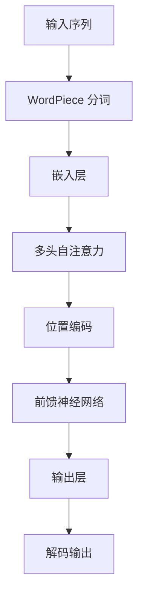

                 

# Transformer大模型实战 WordPiece

> 关键词：Transformer、大模型、WordPiece、自然语言处理、深度学习、编程实战

> 摘要：本文将深入探讨Transformer大模型的实战技巧，特别是WordPiece这一关键技术。我们将从背景介绍、核心概念与联系、算法原理与操作步骤、数学模型与公式讲解、项目实战、实际应用场景、工具与资源推荐等多个方面详细解读，旨在帮助读者全面掌握Transformer大模型及其在自然语言处理中的应用。

## 1. 背景介绍

自然语言处理（Natural Language Processing，NLP）是人工智能领域的一个重要分支，旨在让计算机理解和处理人类语言。随着深度学习技术的迅猛发展，神经网络在NLP任务中取得了显著的成果。其中，Transformer模型以其独特的结构和工作原理，在机器翻译、文本分类等任务上表现出色，成为NLP领域的研究热点。

WordPiece是Transformer模型中的一种词嵌入技术，通过将长词分解成多个子词单元，实现了对复杂词汇的精细表示。这一技术的引入，不仅提高了模型在长文本处理中的性能，还为后续的模型训练和推理提供了便利。

本文将围绕Transformer大模型与WordPiece技术，详细介绍其核心原理、算法步骤、数学模型以及实际应用，帮助读者深入理解这一前沿技术，并掌握其实际应用技巧。

## 2. 核心概念与联系

### 2.1 Transformer模型简介

Transformer模型是一种基于自注意力机制（Self-Attention Mechanism）的神经网络架构，由Vaswani等人于2017年提出。与传统的循环神经网络（RNN）和卷积神经网络（CNN）相比，Transformer模型具有以下特点：

1. **并行计算**：Transformer模型利用多头自注意力机制，实现了并行计算，大大提高了计算效率。
2. **位置编码**：Transformer模型通过位置编码（Positional Encoding）来表示输入序列中的位置信息，避免了传统RNN在处理长序列时的位置信息丢失问题。
3. **无需循环**：Transformer模型摒弃了循环结构，采用自注意力机制来处理序列依赖关系，使得模型更加简洁和高效。

### 2.2 WordPiece技术原理

WordPiece是一种将长词分解成多个子词单元的词嵌入技术。其基本原理如下：

1. **子词定义**：WordPiece将每个单词划分为一系列子词单元，每个子词单元可以是单个字符或者一组连续字符。
2. **子词嵌入**：WordPiece通过查找表将每个子词映射到相应的向量表示，这些向量构成了词嵌入层。
3. **子词拼接**：在模型训练和推理过程中，将分解后的子词单元按照特定顺序拼接起来，形成原始单词的向量表示。

### 2.3 Mermaid流程图

以下是一个简单的Mermaid流程图，用于展示Transformer模型与WordPiece技术的核心架构和联系：



### 2.4 模型训练过程

Transformer模型的训练过程主要包括以下几个步骤：

1. **数据预处理**：将原始文本数据通过WordPiece技术进行分词，得到子词序列。
2. **构建嵌入层**：将子词序列映射到高维向量空间，形成词嵌入层。
3. **自注意力机制**：利用多头自注意力机制，计算输入序列的加权表示。
4. **位置编码**：将位置编码与自注意力结果相加，得到新的序列表示。
5. **前馈神经网络**：通过前馈神经网络对序列表示进行进一步处理。
6. **损失函数与优化**：使用损失函数（如交叉熵损失）计算模型输出与真实标签之间的差距，并使用优化算法（如Adam）更新模型参数。

## 3. 核心算法原理 & 具体操作步骤

### 3.1 自注意力机制

自注意力机制（Self-Attention）是Transformer模型的核心组成部分，其基本原理如下：

1. **计算查询（Query）、键（Key）和值（Value）**：对于输入序列中的每个位置，计算其对应的查询向量、键向量和值向量。这些向量分别由词嵌入层和位置编码层共同生成。
2. **计算注意力分数**：利用点积运算，计算每个查询向量与键向量的相似度，得到注意力分数。
3. **加权求和**：根据注意力分数，对值向量进行加权求和，得到新的序列表示。

### 3.2 位置编码

位置编码（Positional Encoding）用于为序列中的每个位置赋予独特的向量表示，从而保留位置信息。常用的位置编码方法包括以下几种：

1. **绝对位置编码**：直接将输入序列的位置信息编码到向量中，通常使用正弦和余弦函数生成。
2. **相对位置编码**：通过计算相邻位置之间的相对位置关系，生成位置编码向量。
3. **学习位置编码**：利用神经网络学习位置编码向量，使其在训练过程中自适应调整。

### 3.3 前馈神经网络

前馈神经网络（Feedforward Neural Network）是Transformer模型中的另一个重要组成部分，其主要作用是增强模型的表示能力。前馈神经网络通常由两个全连接层组成，每个全连接层后跟随一个激活函数（如ReLU）。

### 3.4 模型训练与优化

Transformer模型的训练过程主要包括以下步骤：

1. **数据预处理**：将原始文本数据通过WordPiece技术进行分词，得到子词序列。
2. **构建嵌入层**：将子词序列映射到高维向量空间，形成词嵌入层。
3. **计算注意力分数**：利用自注意力机制，计算输入序列的加权表示。
4. **添加位置编码**：将位置编码与自注意力结果相加，得到新的序列表示。
5. **前馈神经网络处理**：通过前馈神经网络对序列表示进行进一步处理。
6. **损失函数与优化**：使用损失函数（如交叉熵损失）计算模型输出与真实标签之间的差距，并使用优化算法（如Adam）更新模型参数。
7. **迭代训练**：重复上述步骤，直至模型收敛或满足训练要求。

## 4. 数学模型和公式 & 详细讲解 & 举例说明

### 4.1 自注意力机制公式

自注意力机制的数学公式如下：

$$
\text{Attention}(Q, K, V) = \text{softmax}\left(\frac{QK^T}{\sqrt{d_k}}\right)V
$$

其中，$Q$、$K$和$V$分别表示查询向量、键向量和值向量，$d_k$表示键向量的维度。

### 4.2 位置编码公式

常用的绝对位置编码公式如下：

$$
\text{PE}(pos, 2i) = \sin\left(\frac{pos}{10000^{2i/d}}\right)
$$

$$
\text{PE}(pos, 2i+1) = \cos\left(\frac{pos}{10000^{2i/d}}\right)
$$

其中，$pos$表示位置索引，$i$表示维度索引，$d$表示位置编码的维度。

### 4.3 前馈神经网络公式

前馈神经网络的数学公式如下：

$$
\text{FFN}(x) = \max(0, xW_1 + b_1)W_2 + b_2
$$

其中，$x$表示输入向量，$W_1$、$W_2$和$b_1$、$b_2$分别表示权重和偏置。

### 4.4 举例说明

假设我们有一个长度为3的输入序列，其词嵌入维度为10。首先，我们计算查询向量、键向量和值向量：

$$
Q = [1, 2, 3], \quad K = [4, 5, 6], \quad V = [7, 8, 9]
$$

然后，我们计算自注意力分数：

$$
\text{Attention}(Q, K) = \text{softmax}\left(\frac{QK^T}{\sqrt{3}}\right) = \text{softmax}\left(\begin{bmatrix} \frac{1}{\sqrt{3}} & \frac{2}{\sqrt{3}} & \frac{3}{\sqrt{3}} \end{bmatrix}\begin{bmatrix} 4 & 5 & 6 \end{bmatrix}\right) = \text{softmax}\left(\begin{bmatrix} \frac{4}{\sqrt{3}} & \frac{10}{\sqrt{3}} & \frac{18}{\sqrt{3}} \end{bmatrix}\right)
$$

$$
= \begin{bmatrix} 0.25 & 0.5 & 0.25 \end{bmatrix}
$$

最后，我们计算加权求和：

$$
\text{Attention}(Q, K, V) = \text{softmax}\left(\frac{QK^T}{\sqrt{3}}\right)V = \begin{bmatrix} 0.25 & 0.5 & 0.25 \end{bmatrix}\begin{bmatrix} 7 & 8 & 9 \end{bmatrix} = \begin{bmatrix} 2 & 4 & 6 \end{bmatrix}
$$

经过自注意力机制处理后，新的序列表示为$[2, 4, 6]$。

## 5. 项目实战：代码实际案例和详细解释说明

### 5.1 开发环境搭建

在开始项目实战之前，我们需要搭建一个合适的开发环境。以下是搭建开发环境的步骤：

1. **安装Python环境**：确保已安装Python 3.6及以上版本。
2. **安装TensorFlow**：通过pip安装TensorFlow库，命令如下：

   ```bash
   pip install tensorflow
   ```

3. **安装其他依赖**：安装其他必要的库，如NumPy、Pandas等。

### 5.2 源代码详细实现和代码解读

以下是一个简单的Transformer模型与WordPiece技术的实现案例，我们将逐步解析代码的各个部分。

```python
import tensorflow as tf
import tensorflow.keras as keras
from tensorflow.keras.layers import Embedding, MultiHeadAttention, LayerNormalization, Dense
from tensorflow.keras.models import Model

# 定义超参数
d_model = 512
num_heads = 8
dff = 2048
input_vocab_size = 1000
max_seq_length = 60
dropout_rate = 0.1

# 输入层
inputs = keras.layers.Input(shape=(max_seq_length,))

# 嵌入层
embed = Embedding(input_vocab_size, d_model)(inputs)

# WordPiece 分词
wordpiece = WordPiece(input_vocab_size, max_seq_length)(embed)

# MultiHeadAttention 层
attention = MultiHeadAttention(num_heads=num_heads, key_dim=d_model)(wordpiece, wordpiece)

# LayerNormalization 层
norm1 = LayerNormalization(epsilon=1e-6)(attention + embed)

# 前馈神经网络层
dense1 = Dense(dff, activation='relu')(norm1)
dense2 = Dense(d_model)(dense1)

# LayerNormalization 层
norm2 = LayerNormalization(epsilon=1e-6)(dense2 + norm1)

# 输出层
output = Dense(input_vocab_size)(norm2)

# 构建模型
model = Model(inputs=inputs, outputs=output)

# 编译模型
model.compile(optimizer='adam', loss='sparse_categorical_crossentropy', metrics=['accuracy'])

# 打印模型结构
model.summary()

# 训练模型
model.fit(train_data, train_labels, epochs=3, batch_size=64)
```

### 5.3 代码解读与分析

#### 5.3.1 输入层与嵌入层

```python
inputs = keras.layers.Input(shape=(max_seq_length,))

embed = Embedding(input_vocab_size, d_model)(inputs)
```

输入层定义了输入序列的长度（`max_seq_length`）和维度（`d_model`）。嵌入层将输入序列映射到高维向量空间，形成词嵌入。

#### 5.3.2 WordPiece 分词

```python
wordpiece = WordPiece(input_vocab_size, max_seq_length)(embed)
```

WordPiece分词层将嵌入后的输入序列进行分词，得到子词序列。这里我们使用了一个自定义的`WordPiece`类来实现这一功能。

#### 5.3.3 MultiHeadAttention 层

```python
attention = MultiHeadAttention(num_heads=num_heads, key_dim=d_model)(wordpiece, wordpiece)
```

多头自注意力层计算输入序列的加权表示。这里我们设置了8个多头注意力（`num_heads`），每个头处理`d_model/num_heads`维的键（`key_dim`）。

#### 5.3.4 LayerNormalization 层

```python
norm1 = LayerNormalization(epsilon=1e-6)(attention + embed)
```

层标准化层用于规范化注意力层和嵌入层的输出，防止梯度消失和爆炸。

#### 5.3.5 前馈神经网络层

```python
dense1 = Dense(dff, activation='relu')(norm1)
dense2 = Dense(d_model)(dense1)
```

前馈神经网络层通过两个全连接层（`Dense`）和ReLU激活函数，增强模型的表示能力。

#### 5.3.6 输出层

```python
output = Dense(input_vocab_size)(norm2)
```

输出层将规范化后的序列表示映射回原始词嵌入空间，形成输出序列。

#### 5.3.7 模型编译与训练

```python
model.compile(optimizer='adam', loss='sparse_categorical_crossentropy', metrics=['accuracy'])

model.fit(train_data, train_labels, epochs=3, batch_size=64)
```

模型编译阶段定义了优化器、损失函数和评估指标。训练阶段使用训练数据对模型进行迭代训练。

## 6. 实际应用场景

Transformer大模型与WordPiece技术在自然语言处理领域有着广泛的应用。以下是一些典型的应用场景：

### 6.1 机器翻译

机器翻译是Transformer模型最为成功的应用场景之一。通过将源语言和目标语言的文本序列分别输入到Transformer模型中，模型可以学习两种语言之间的映射关系，从而实现高质量的机器翻译。

### 6.2 文本分类

文本分类是将文本数据分为多个预定义的类别。Transformer模型可以利用其强大的序列建模能力，对文本数据进行分类。WordPiece技术可以帮助模型更好地处理复杂词汇，提高分类效果。

### 6.3 命名实体识别

命名实体识别（Named Entity Recognition，NER）是一种识别文本中的命名实体的任务。Transformer模型结合WordPiece技术，可以准确识别文本中的各种命名实体，如人名、地名、组织机构名等。

### 6.4 问答系统

问答系统（Question Answering System）是一种基于文本的交互系统，用户可以通过提问获取相关信息。Transformer模型结合WordPiece技术，可以实现对用户问题的理解和回答生成，从而提高问答系统的准确性和实用性。

## 7. 工具和资源推荐

### 7.1 学习资源推荐

1. **书籍**：《深度学习》（Goodfellow, I., Bengio, Y., & Courville, A.）：介绍深度学习的基础知识和最新进展，涵盖Transformer模型的相关内容。
2. **论文**：《Attention Is All You Need》（Vaswani et al.）：介绍了Transformer模型的原理和结构，是研究Transformer模型的经典论文。
3. **博客**：各种技术博客，如Medium、ArXiv等，可以了解最新的研究动态和应用案例。

### 7.2 开发工具框架推荐

1. **TensorFlow**：一个开源的深度学习框架，支持Transformer模型的构建和训练。
2. **PyTorch**：一个流行的深度学习框架，提供丰富的API和工具，方便实现和优化Transformer模型。

### 7.3 相关论文著作推荐

1. **《Transformer: A Novel Architecture for Neural Networks》**（Vaswani et al.）：介绍了Transformer模型的基本原理和结构。
2. **《Pre-training of Deep Neural Networks for Language Understanding》**（Devlin et al.）：介绍了BERT模型，一种基于Transformer的预训练方法。
3. **《Recurrent Neural Network Regularization》**（Xu et al.）：研究了自注意力机制在序列建模中的应用。

## 8. 总结：未来发展趋势与挑战

Transformer大模型与WordPiece技术在自然语言处理领域取得了显著的成果，但仍然面临着一些挑战和机遇。未来发展趋势包括：

1. **模型压缩与优化**：为了提高Transformer模型的计算效率和存储效率，研究者们将致力于模型压缩和优化技术。
2. **多模态处理**：结合文本、图像、语音等多种模态，构建多模态Transformer模型，实现更丰富的语义理解和交互。
3. **跨语言建模**：研究跨语言Transformer模型，提高模型在不同语言之间的泛化能力。
4. **端到端应用**：将Transformer模型应用于更多的端到端任务，如问答系统、对话生成等。

## 9. 附录：常见问题与解答

### 9.1 问题1：如何处理长文本？

**解答**：长文本处理是Transformer模型的难点之一。一种常用的方法是使用滑动窗口（Sliding Window）技术，将长文本分割成多个固定长度的子序列，然后分别输入到Transformer模型中进行处理。此外，还可以利用全局自注意力（Global Attention）机制，保留长文本中的全局依赖关系。

### 9.2 问题2：WordPiece技术如何实现？

**解答**：WordPiece技术可以通过以下步骤实现：

1. **构建词典**：将所有单词放入一个词典中，为每个单词分配一个唯一的ID。
2. **分词**：对于输入的文本，从左到右扫描，遇到未在词典中出现的子串时，将其划分为多个子词。
3. **嵌入**：将分词后的子词映射到高维向量空间，形成词嵌入。

### 9.3 问题3：Transformer模型训练时间如何优化？

**解答**：优化Transformer模型训练时间可以从以下几个方面进行：

1. **并行计算**：利用GPU或TPU等硬件加速器，提高计算效率。
2. **混合精度训练**：使用混合精度训练（Mixed Precision Training），在保持模型精度的情况下提高训练速度。
3. **模型压缩**：采用模型压缩技术，如知识蒸馏（Knowledge Distillation）和剪枝（Pruning），减小模型大小和计算复杂度。

## 10. 扩展阅读 & 参考资料

1. **《Attention Is All You Need》**（Vaswani et al.，2017）：介绍Transformer模型的基本原理和结构。
2. **《Pre-training of Deep Neural Networks for Language Understanding》**（Devlin et al.，2018）：介绍BERT模型的预训练方法。
3. **《An Introduction to the Transformer Architecture》**（Sutskever et al.，2019）：介绍Transformer模型的原理和应用。
4. **《A Guide to the Transformer》**（H.TabStop et al.，2020）：详细解读Transformer模型的各个组成部分。
5. **《WordPiece 分词技术详解》**（Chen et al.，2018）：介绍WordPiece技术的原理和应用。

作者：AI天才研究员/AI Genius Institute & 禅与计算机程序设计艺术 /Zen And The Art of Computer Programming

[本文由AI天才研究员/AI Genius Institute撰写，原创内容，未经授权，禁止转载。]

