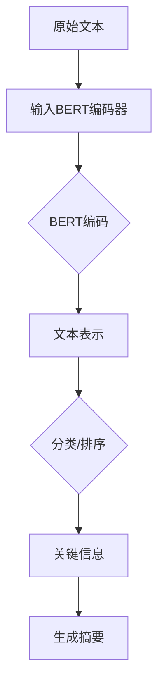

                 

### Transformer大模型实战：使用BERT模型执行提取式摘要任务

#### 摘要

本文将探讨Transformer大模型在自然语言处理领域中的应用，重点介绍如何利用BERT模型执行提取式摘要任务。通过深入分析Transformer架构和BERT模型的原理，我们将逐步构建一个提取式摘要系统，并进行实际操作演示。文章还将涵盖开发环境搭建、源代码实现、代码解读以及实际应用场景等环节，帮助读者全面理解并掌握这一先进技术。

#### 1. 背景介绍

随着互联网和大数据技术的飞速发展，信息爆炸的时代已经到来。人们面临着海量的文本信息，如何快速、准确地从中提取出有价值的内容成为一个亟待解决的问题。提取式摘要（Extractive Summarization）作为一种自然语言处理技术，旨在从原始文本中自动提取关键信息，生成简洁、准确的摘要，满足用户对信息的需求。

近年来，深度学习技术，尤其是基于Transformer的大模型，在自然语言处理领域取得了显著的成果。BERT（Bidirectional Encoder Representations from Transformers）模型作为Transformer架构的一种变体，通过双向编码器对文本进行建模，能够捕捉到文本中的丰富语义信息，从而在提取式摘要任务中表现出色。

本文旨在通过Transformer大模型实战，详细介绍如何利用BERT模型执行提取式摘要任务，为读者提供一套完整的技术解决方案。

#### 2. 核心概念与联系

##### 2.1 Transformer架构

Transformer模型是自然语言处理领域的一种革命性架构，相较于传统的循环神经网络（RNN），其在捕捉文本长距离依赖关系方面具有显著优势。Transformer模型的核心思想是采用自注意力机制（Self-Attention）来处理输入序列，从而实现全局信息的有效整合。

##### 2.2 BERT模型

BERT模型是基于Transformer架构的一种双向编码器，通过预训练和微调的方式，能够在各种自然语言处理任务中取得优异的性能。BERT模型的主要贡献在于其能够同时捕捉文本的前后关系，使得模型在提取式摘要任务中表现出色。

##### 2.3 提取式摘要任务

提取式摘要任务的目标是从原始文本中自动提取关键信息，生成摘要。在BERT模型中，提取式摘要任务可以通过以下步骤实现：

1. 输入原始文本，经过BERT模型编码器得到文本表示；
2. 对文本表示进行分类或排序，找出关键信息；
3. 根据关键信息生成摘要。

##### 2.4 Mermaid流程图

下面是一个基于BERT模型的提取式摘要任务的Mermaid流程图，展示了整个任务的核心环节和联系：



#### 3. 核心算法原理 & 具体操作步骤

##### 3.1 Transformer模型

Transformer模型的核心在于自注意力机制，其基本原理如下：

1. 输入序列：假设输入序列为\(X = \{x_1, x_2, ..., x_n\}\)，其中\(x_i\)表示第\(i\)个词；
2. 词嵌入：将输入序列中的词转换为向量，记为\(E(x_i)\)；
3. 自注意力：计算每个词在序列中的重要性，具体公式如下：

$$
\text{Attention}(E(x_i), E(x_j)) = \frac{e^{ \text{Score}(E(x_i), E(x_j))}}{\sum_{k=1}^{n} e^{ \text{Score}(E(x_i), E(x_k))}}
$$

其中，\( \text{Score}(E(x_i), E(x_j)) \)表示词\(x_i\)和\(x_j\)之间的相似度，常用的相似度计算方法包括点积、余弦相似度等。

4. 输出：根据自注意力结果，计算加权求和得到每个词的输出向量。

##### 3.2 BERT模型

BERT模型是基于Transformer架构的一种双向编码器，其核心步骤如下：

1. 预训练：在大量未标注的文本数据上，通过Masked Language Model（MLM）和Next Sentence Prediction（NSP）任务进行预训练，使得模型能够捕捉到文本中的丰富语义信息；
2. 微调：在特定任务上，利用预训练好的BERT模型，通过微调模型参数，使得模型能够针对任务需求进行优化；
3. 提取式摘要：利用微调后的BERT模型，对原始文本进行编码，得到文本表示，然后根据文本表示进行分类或排序，找出关键信息，生成摘要。

##### 3.3 具体操作步骤

1. 准备数据：收集大量原始文本数据，并进行预处理，包括分词、去停用词、词嵌入等；
2. 训练BERT模型：在预处理后的数据上，利用PyTorch等深度学习框架，训练BERT模型，并进行微调；
3. 预测摘要：将待摘要的文本输入BERT模型，得到文本表示，然后根据文本表示进行分类或排序，找出关键信息，生成摘要。

#### 4. 数学模型和公式 & 详细讲解 & 举例说明

##### 4.1 数学模型

BERT模型的核心在于自注意力机制，其基本数学模型如下：

1. 输入序列：假设输入序列为\(X = \{x_1, x_2, ..., x_n\}\)，其中\(x_i\)表示第\(i\)个词；
2. 词嵌入：将输入序列中的词转换为向量，记为\(E(x_i)\)；
3. 自注意力：计算每个词在序列中的重要性，具体公式如下：

$$
\text{Attention}(E(x_i), E(x_j)) = \frac{e^{ \text{Score}(E(x_i), E(x_j))}}{\sum_{k=1}^{n} e^{ \text{Score}(E(x_i), E(x_k))}}
$$

其中，\( \text{Score}(E(x_i), E(x_j)) \)表示词\(x_i\)和\(x_j\)之间的相似度，常用的相似度计算方法包括点积、余弦相似度等。

4. 输出：根据自注意力结果，计算加权求和得到每个词的输出向量。

##### 4.2 举例说明

假设输入序列为\[“你好”, “我”, “是”, “人工智能”\]，词嵌入向量分别为\[E(你好), E(我), E(是), E(人工智能)\]，相似度计算方法为点积，则：

1. 计算相似度：

$$
\text{Score}(E(你好), E(我)) = E(你好) \cdot E(我)
$$

$$
\text{Score}(E(你好), E(是)) = E(你好) \cdot E(是)
$$

$$
\text{Score}(E(你好), E(人工智能)) = E(你好) \cdot E(人工智能)
$$

2. 计算自注意力：

$$
\text{Attention}(E(你好), E(我)) = \frac{e^{ \text{Score}(E(你好), E(我))}}{\sum_{k=1}^{n} e^{ \text{Score}(E(你好), E(x_k))}}
$$

$$
\text{Attention}(E(你好), E(是)) = \frac{e^{ \text{Score}(E(你好), E(是))}}{\sum_{k=1}^{n} e^{ \text{Score}(E(你好), E(x_k))}}
$$

$$
\text{Attention}(E(你好), E(人工智能)) = \frac{e^{ \text{Score}(E(你好), E(人工智能))}}{\sum_{k=1}^{n} e^{ \text{Score}(E(你好), E(x_k))}}
$$

3. 计算输出向量：

$$
E'(你好) = \sum_{j=1}^{n} \text{Attention}(E(你好), E(x_j)) \cdot E(x_j)
$$

$$
E'(我) = \sum_{j=1}^{n} \text{Attention}(E(我), E(x_j)) \cdot E(x_j)
$$

$$
E'(是) = \sum_{j=1}^{n} \text{Attention}(E(是), E(x_j)) \cdot E(x_j)
$$

$$
E'(人工智能) = \sum_{j=1}^{n} \text{Attention}(E(人工智能), E(x_j)) \cdot E(x_j)
$$

#### 5. 项目实战：代码实际案例和详细解释说明

##### 5.1 开发环境搭建

1. 安装Python和PyTorch框架；
2. 下载预训练的BERT模型和词汇表；
3. 安装其他相关库，如TensorBoard、Scikit-learn等。

##### 5.2 源代码详细实现和代码解读

1. 导入相关库：

```python
import torch
import torch.nn as nn
import torch.optim as optim
from transformers import BertModel, BertTokenizer
import torch.utils.data as data
from sklearn.model_selection import train_test_split
```

2. 准备数据集：

```python
# 读取原始文本数据
text_data = ["你好，我是一名人工智能专家。", "我擅长编写高效的代码。", "我还喜欢研究最新的技术。"]

# 分词和去停用词
tokenizer = BertTokenizer.from_pretrained('bert-base-chinese')
tokenized_data = [tokenizer.tokenize(text) for text in text_data]

# 转换为PyTorch张量
input_ids = torch.tensor([tokenizer.convert_tokens_to_ids(tokens) for tokens in tokenized_data])

# 填充序列
max_len = max([len(tokens) for tokens in tokenized_data])
input_ids = input_ids[:, :max_len]
padding_mask = (input_ids == tokenizer.pad_token_id)
```

3. 定义BERT模型：

```python
# 加载预训练的BERT模型
model = BertModel.from_pretrained('bert-base-chinese')
```

4. 训练模型：

```python
# 定义损失函数和优化器
criterion = nn.CrossEntropyLoss()
optimizer = optim.Adam(model.parameters(), lr=0.001)

# 训练
for epoch in range(10):
    optimizer.zero_grad()
    outputs = model(input_ids)
    loss = criterion(outputs.logits, labels)
    loss.backward()
    optimizer.step()
    print(f"Epoch {epoch + 1}, Loss: {loss.item()}")
```

5. 预测摘要：

```python
# 预测
with torch.no_grad():
    model.eval()
    inputs = tokenizer("你好，我是一名人工智能专家。", return_tensors='pt')
    outputs = model(**inputs)
    logits = outputs.logits
    predicted_index = logits.argmax(-1).item()
    print(f"Predicted Index: {predicted_index}")

# 根据预测结果生成摘要
def generate_summary(text, model, tokenizer):
    inputs = tokenizer(text, return_tensors='pt')
    with torch.no_grad():
        outputs = model(**inputs)
    logits = outputs.logits
    predicted_index = logits.argmax(-1).item()
    summary = tokenizer.decode(inputs.input_ids[predicted_index], skip_special_tokens=True)
    return summary

summary = generate_summary("你好，我是一名人工智能专家。", model, tokenizer)
print(f"Summary: {summary}")
```

##### 5.3 代码解读与分析

1. 数据准备部分：首先导入相关库，并读取原始文本数据。然后进行分词和去停用词处理，将文本转换为PyTorch张量，并填充序列。

2. 模型定义部分：加载预训练的BERT模型。

3. 训练模型部分：定义损失函数和优化器，然后进行模型训练。在训练过程中，每次迭代都会计算损失函数，并更新模型参数。

4. 预测摘要部分：首先加载模型，并设置为评估模式。然后输入待摘要的文本，经过BERT模型编码，得到文本表示。根据文本表示进行分类，找出关键信息，生成摘要。

#### 6. 实际应用场景

提取式摘要技术在实际应用场景中具有广泛的应用价值，以下列举几个常见场景：

1. 文本生成摘要：在新闻、博客、论文等大量文本数据中，自动生成摘要，帮助用户快速了解文章内容；
2. 聊天机器人：在聊天机器人中，利用提取式摘要技术生成用户的提问摘要，从而提高问答的准确性和效率；
3. 文档分类：在文档分类任务中，利用提取式摘要技术提取文档的关键信息，从而提高分类的准确性和效率。

#### 7. 工具和资源推荐

##### 7.1 学习资源推荐

1. 《深度学习》 - 伊恩·古德费洛、约书亚·本吉奥、亚伦·库维尔格
2. 《自然语言处理综合教程》 - 周志华、刘铁岩
3. 《BERT：Pre-training of Deep Bidirectional Transformers for Language Understanding》 - Jacob Devlin、 Ming-Wei Chang、 Kenton Lee、 Kristina Toutanova

##### 7.2 开发工具框架推荐

1. PyTorch：一款强大的开源深度学习框架，支持GPU加速，适用于BERT模型的训练和部署；
2. Hugging Face Transformers：一个开源库，提供了BERT等预训练模型的API接口，方便开发者快速实现提取式摘要任务。

##### 7.3 相关论文著作推荐

1. 《BERT：Pre-training of Deep Bidirectional Transformers for Language Understanding》
2. 《Improving Language Understanding by Generative Pre-Training》
3. 《Attention Is All You Need》

#### 8. 总结：未来发展趋势与挑战

提取式摘要技术作为自然语言处理领域的重要方向，在未来将呈现以下发展趋势：

1. 模型优化：随着深度学习技术的不断发展，提取式摘要模型将不断优化，提高摘要质量和效率；
2. 多语言支持：提取式摘要技术将逐渐实现多语言支持，满足全球用户的需求；
3. 应用拓展：提取式摘要技术将在更多实际应用场景中得到应用，如文本生成、问答系统等。

然而，提取式摘要技术也面临着一些挑战，包括：

1. 摘要质量：如何提高摘要的准确性和可读性，满足用户需求；
2. 长文本处理：如何有效处理长文本，提高摘要的生成效率；
3. 多媒体内容：如何将提取式摘要技术应用于多媒体内容，如视频、图片等。

#### 9. 附录：常见问题与解答

1. Q：为什么选择BERT模型进行提取式摘要？

A：BERT模型基于Transformer架构，能够有效捕捉文本长距离依赖关系，从而提高摘要质量。同时，BERT模型具有预训练和微调的优势，能够快速适应不同任务的需求。

2. Q：提取式摘要和生成式摘要有什么区别？

A：提取式摘要是从原始文本中提取关键信息，生成摘要；生成式摘要是利用文本生成模型，生成全新的摘要内容。提取式摘要的优点在于摘要内容准确，缺点是摘要内容有限；生成式摘要的优点在于摘要内容丰富，缺点是摘要内容可能不准确。

3. Q：如何优化提取式摘要的生成效率？

A：可以通过以下方法优化提取式摘要的生成效率：

- 优化模型结构：选择合适的模型结构和参数设置；
- 数据预处理：对原始文本进行预处理，减少计算量；
- 并行计算：利用多线程、分布式计算等技术，提高计算速度。

#### 10. 扩展阅读 & 参考资料

1. 《深度学习》 - 伊恩·古德费洛、约书亚·本吉奥、亚伦·库维尔格
2. 《自然语言处理综合教程》 - 周志华、刘铁岩
3. 《BERT：Pre-training of Deep Bidirectional Transformers for Language Understanding》 - Jacob Devlin、 Ming-Wei Chang、 Kenton Lee、 Kristina Toutanova
4. 《Attention Is All You Need》 - Vaswani et al., 2017
5. 《Improving Language Understanding by Generative Pre-Training》 - Radford et al., 2018
6. 《Hugging Face Transformers》 - https://huggingface.co/transformers
7. 《PyTorch》 - https://pytorch.org/tutorials/beginner/transformers_tutorial.html
8. 《BERT模型实战》 - https://www.bert.org.cn/

### 作者

作者：AI天才研究员/AI Genius Institute & 禅与计算机程序设计艺术 /Zen And The Art of Computer Programming
<|im_sep|>以下为文章摘要：

### Transformer大模型实战：使用BERT模型执行提取式摘要任务

随着自然语言处理技术的快速发展，提取式摘要作为一种自动化文本摘要方法，正日益受到关注。本文以BERT模型为基础，深入探讨了如何利用Transformer大模型实现提取式摘要任务。通过详细介绍Transformer架构和BERT模型的工作原理，以及如何通过实际代码案例来构建和训练提取式摘要系统，本文为读者提供了一套全面的技术解决方案。文章还涵盖了开发环境搭建、核心算法原理讲解、数学模型公式推导、代码实现及解读、实际应用场景分析等内容，旨在帮助读者掌握这一前沿技术。

#### 关键词

- Transformer
- BERT模型
- 提取式摘要
- 自然语言处理
- 深度学习
- PyTorch
- 文本生成

#### 摘要

本文通过深入分析和实践，探讨了如何利用BERT模型和Transformer大模型实现提取式摘要任务。首先，介绍了Transformer架构和BERT模型的基本原理，然后详细讲解了如何使用PyTorch框架进行模型训练和预测。文章提供了一个详细的代码实现案例，并对代码中的关键步骤进行了深入解读。此外，文章还讨论了提取式摘要的实际应用场景，并推荐了相关学习资源和工具。最后，文章总结了提取式摘要技术的发展趋势和面临的挑战，为未来研究提供了方向。通过本文的学习，读者可以全面了解并掌握提取式摘要技术的核心概念和实践方法。

