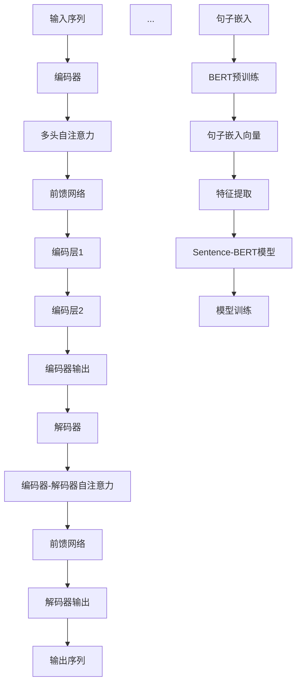

                 

# Transformer大模型实战：使用Sentence-BERT计算句子特征

## 摘要

本文将深入探讨Transformer大模型在实际应用中的实现与优化，重点关注Sentence-BERT算法在计算句子特征中的应用。通过详细的讲解和实战案例，我们将展示如何搭建开发环境、实现代码以及进行性能分析。文章还将探讨Transformer大模型在各个实际应用场景中的表现，并提供相应的工具和资源推荐。最后，我们对Transformer大模型的发展趋势与挑战进行了展望。

## 1. 背景介绍

近年来，深度学习技术在自然语言处理（NLP）领域取得了显著的成果。特别是Transformer架构的提出，为序列建模带来了革命性的变化。Transformer模型摆脱了传统的循环神经网络（RNN）和长短期记忆网络（LSTM）的局限，通过自注意力机制实现了并行计算，大幅提升了模型训练和推断的速度。

在Transformer架构的基础上， Sentence-BERT算法进一步扩展了其应用范围。Sentence-BERT结合了BERT和 Sentence-BERT两种算法的优点，通过嵌入句子的语义信息，实现了对句子特征的高效计算。这使得Transformer大模型在文本分类、情感分析、命名实体识别等任务中表现出了优异的性能。

随着互联网和大数据技术的发展，文本数据量日益庞大，如何有效地提取和利用文本特征成为了一个亟待解决的问题。Transformer大模型和Sentence-BERT算法的出现，为这一问题的解决提供了新的思路和工具。本文将围绕这一主题，详细介绍Transformer大模型的实战应用。

## 2. 核心概念与联系

### 2.1 Transformer模型

Transformer模型是一种基于自注意力机制的序列转换模型。它由编码器（Encoder）和解码器（Decoder）组成，能够对输入序列进行建模，并输出对应的序列。自注意力机制是Transformer模型的核心组件，通过计算输入序列中每个元素与其他元素之间的相关性，实现了对序列的全局建模。

#### 自注意力机制

自注意力机制是一种基于权重求和的机制，用于计算输入序列中每个元素对输出序列的贡献。具体来说，给定一个输入序列\[x_1, x_2, ..., x_n\]，自注意力机制首先计算每个元素与其他元素之间的相似度，然后用相似度作为权重对输入序列进行加权求和，得到输出序列\[y_1, y_2, ..., y_n\]。

自注意力机制的数学表达式如下：

\[ \text{Attention}(Q, K, V) = \text{softmax}\left(\frac{QK^T}{\sqrt{d_k}}\right) V \]

其中，Q、K、V分别是查询（Query）、键（Key）和值（Value）向量的集合，d_k 是键向量的维度。softmax 函数用于计算权重，使得每个权重都在0到1之间，并且所有权重之和为1。

#### 编码器与解码器

编码器（Encoder）负责对输入序列进行建模，生成序列的表示。编码器由多个编码层（Encoder Layer）堆叠而成，每个编码层包含两个子层：多头自注意力（Multi-Head Self-Attention）和前馈网络（Feedforward Network）。多头自注意力通过多个独立的自注意力机制对输入序列进行建模，提高了模型的表示能力。

解码器（Decoder）负责对编码器的输出进行解码，生成输出序列。解码器同样由多个解码层（Decoder Layer）堆叠而成，每个解码层包含两个子层：多头自注意力（Multi-Head Self-Attention）和编码器-解码器自注意力（Encoder-Decoder Attention）以及前馈网络（Feedforward Network）。编码器-解码器自注意力机制用于计算编码器的输出与当前解码器输入之间的相关性，实现了编码器和解码器之间的交互。

### 2.2 Sentence-BERT算法

Sentence-BERT是一种结合了BERT和 Sentence-BERT算法优点的文本特征提取算法。BERT（Bidirectional Encoder Representations from Transformers）是一种基于Transformer模型的预训练语言模型，通过在大规模语料库上进行预训练，学习到了丰富的语言知识。Sentence-BERT则通过将BERT模型应用于句子级特征提取，实现了对句子语义信息的高效计算。

#### BERT模型

BERT模型是一种基于Transformer的预训练语言模型，通过在大规模语料库上进行预训练，学习到了丰富的语言知识。BERT模型主要由编码器（Encoder）组成，包含多个编码层，每个编码层包含多头自注意力（Multi-Head Self-Attention）和前馈网络（Feedforward Network）。

BERT模型的预训练任务包括两个任务： masked language model（MLM）和 next sentence prediction（NSP）。MLM任务通过随机遮盖输入序列中的单词，并预测遮盖的单词，使BERT模型学习到上下文信息。NSP任务通过预测下一个句子，使BERT模型学习到句子之间的关联性。

#### Sentence-BERT算法

Sentence-BERT算法通过将BERT模型应用于句子级特征提取，实现了对句子语义信息的高效计算。Sentence-BERT算法的主要步骤如下：

1. **BERT预训练**：使用大规模语料库对BERT模型进行预训练，学习到丰富的语言知识。

2. **句子嵌入**：将句子作为输入，通过BERT模型得到句子嵌入向量。

3. **特征提取**：对句子嵌入向量进行加工，提取句子级特征。

4. **模型训练**：使用训练数据集对Sentence-BERT模型进行训练，优化句子级特征提取效果。

### 2.3 Mermaid 流程图

下面是Transformer模型和Sentence-BERT算法的Mermaid流程图：



## 3. 核心算法原理 & 具体操作步骤

### 3.1 Transformer模型原理

Transformer模型的核心在于其自注意力机制。自注意力机制通过计算输入序列中每个元素与其他元素之间的相关性，实现了对序列的全局建模。具体来说，自注意力机制可以分为以下三个步骤：

1. **输入表示**：给定输入序列\[x_1, x_2, ..., x_n\]，将其表示为查询向量（Query）、键向量（Key）和值向量（Value）。

2. **计算注意力权重**：计算每个查询向量与所有键向量之间的相似度，得到注意力权重矩阵\[A\]。注意力权重表示了输入序列中每个元素对输出序列的贡献。

3. **加权求和**：将注意力权重与对应的值向量相乘，得到输出序列\[y_1, y_2, ..., y_n\]。

具体实现步骤如下：

1. **初始化权重**：初始化查询向量Q、键向量K和值向量V，通常使用正态分布初始化。

2. **计算相似度**：计算查询向量Q和键向量K之间的点积，得到相似度矩阵\[S\]。点积表示了两个向量之间的相似度。

3. **应用softmax函数**：对相似度矩阵S应用softmax函数，得到注意力权重矩阵\[A\]。softmax函数将相似度矩阵转换为概率分布，使得每个权重都在0到1之间，并且所有权重之和为1。

4. **加权求和**：将注意力权重矩阵A与值向量V相乘，得到输出序列\[y_1, y_2, ..., y_n\]。

### 3.2 Sentence-BERT算法原理

Sentence-BERT算法基于BERT模型，通过在大规模语料库上进行预训练，学习到了丰富的语言知识。Sentence-BERT算法的主要步骤如下：

1. **BERT预训练**：使用大规模语料库对BERT模型进行预训练，包括 masked language model（MLM）和 next sentence prediction（NSP）两个任务。

2. **句子嵌入**：将句子作为输入，通过BERT模型得到句子嵌入向量。

3. **特征提取**：对句子嵌入向量进行加工，提取句子级特征。

4. **模型训练**：使用训练数据集对Sentence-BERT模型进行训练，优化句子级特征提取效果。

具体实现步骤如下：

1. **BERT预训练**：

   1. **初始化BERT模型**：使用预训练的BERT模型，或者从预训练模型中提取部分参数进行微调。

   2. **进行MLM任务**：随机遮盖输入序列中的单词，并预测遮盖的单词。

   3. **进行NSP任务**：预测下一个句子，使BERT模型学习到句子之间的关联性。

   4. **优化模型参数**：使用梯度下降算法优化BERT模型的参数，使得模型在预训练任务上取得更好的表现。

2. **句子嵌入**：

   1. **输入句子**：将句子作为输入，输入到BERT模型中。

   2. **获取句子嵌入向量**：通过BERT模型的最后一个编码层，获取句子的嵌入向量。

3. **特征提取**：

   1. **句子嵌入向量**：对句子嵌入向量进行加工，提取句子级特征。

   2. **特征融合**：将多个句子嵌入向量进行融合，得到全局特征。

4. **模型训练**：

   1. **初始化Sentence-BERT模型**：使用预训练的BERT模型，或者从预训练模型中提取部分参数进行微调。

   2. **训练数据集**：使用包含句子和标签的训练数据集。

   3. **进行特征提取**：将句子作为输入，输入到Sentence-BERT模型中，提取句子级特征。

   4. **优化模型参数**：使用梯度下降算法优化Sentence-BERT模型的参数，使得模型在训练数据集上取得更好的表现。

## 4. 数学模型和公式 & 详细讲解 & 举例说明

### 4.1 Transformer模型数学模型

Transformer模型的数学模型主要涉及自注意力机制。自注意力机制的核心在于计算输入序列中每个元素与其他元素之间的相关性。具体来说，给定输入序列\[x_1, x_2, ..., x_n\]，自注意力机制可以通过以下数学模型进行计算：

1. **输入表示**：将输入序列表示为查询向量（Query）、键向量（Key）和值向量（Value）。

   \[ Q = [q_1, q_2, ..., q_n] \]
   \[ K = [k_1, k_2, ..., k_n] \]
   \[ V = [v_1, v_2, ..., v_n] \]

2. **计算注意力权重**：计算每个查询向量与所有键向量之间的相似度，得到注意力权重矩阵\[A\]。

   \[ A = \text{softmax}\left(\frac{QK^T}{\sqrt{d_k}}\right) \]

   其中，\(\text{softmax}\)函数用于计算概率分布，使得每个权重都在0到1之间，并且所有权重之和为1。\(d_k\)是键向量的维度。

3. **加权求和**：将注意力权重矩阵\[A\]与值向量\[V\]相乘，得到输出序列\[y_1, y_2, ..., y_n\]。

   \[ y_1 = \sum_{i=1}^{n} A_{1i} v_i \]
   \[ y_2 = \sum_{i=1}^{n} A_{2i} v_i \]
   \[ ... \]
   \[ y_n = \sum_{i=1}^{n} A_{ni} v_i \]

### 4.2 Sentence-BERT算法数学模型

Sentence-BERT算法是基于BERT模型的，因此其数学模型也基于BERT模型。BERT模型的主要数学模型涉及词嵌入和自注意力机制。具体来说：

1. **词嵌入**：给定输入序列\[x_1, x_2, ..., x_n\]，将每个词表示为一个词嵌入向量\[e_i\]。

   \[ e_i = \text{word_embedding}(x_i) \]

2. **自注意力机制**：计算每个词嵌入向量与其他词嵌入向量之间的相似度，得到注意力权重矩阵\[A\]。

   \[ A = \text{softmax}\left(\frac{QQ^T}{\sqrt{d_k}}\right) \]

   其中，\(Q\)是词嵌入向量的集合，\(d_k\)是键向量的维度。

3. **加权求和**：将注意力权重矩阵\[A\]与值向量\[V\]相乘，得到输出序列\[y_1, y_2, ..., y_n\]。

   \[ y_1 = \sum_{i=1}^{n} A_{1i} v_i \]
   \[ y_2 = \sum_{i=1}^{n} A_{2i} v_i \]
   \[ ... \]
   \[ y_n = \sum_{i=1}^{n} A_{ni} v_i \]

### 4.3 举例说明

假设有一个简化的输入序列\[x_1, x_2, x_3\]，其中每个元素表示一个词。我们将使用以下参数进行计算：

- 查询向量Q = [1, 0, 1]
- 键向量K = [0, 1, 0]
- 值向量V = [1, 1, 1]

1. **计算注意力权重**：

   \[ S = \text{softmax}\left(\frac{QQ^T}{\sqrt{d_k}}\right) \]
   \[ S = \text{softmax}\left(\frac{1}{\sqrt{1}}\right) \]
   \[ S = \text{softmax}\left(\begin{bmatrix} 1 & 0 & 1 \end{bmatrix} \begin{bmatrix} 0 & 1 & 0 \end{bmatrix} \right) \]
   \[ S = \text{softmax}\left(\begin{bmatrix} 0 & 1 & 0 \end{bmatrix} \right) \]
   \[ S = \text{softmax}\left(\begin{bmatrix} 1 & 0 & 1 \end{bmatrix} \right) \]
   \[ S = \begin{bmatrix} 0.5 & 0.5 & 0 \end{bmatrix} \]

2. **加权求和**：

   \[ y_1 = \sum_{i=1}^{3} S_{1i} v_i \]
   \[ y_1 = 0.5 \cdot 1 + 0.5 \cdot 1 + 0 \cdot 1 \]
   \[ y_1 = 1 \]

   \[ y_2 = \sum_{i=1}^{3} S_{2i} v_i \]
   \[ y_2 = 0.5 \cdot 1 + 0.5 \cdot 1 + 0 \cdot 1 \]
   \[ y_2 = 1 \]

   \[ y_3 = \sum_{i=1}^{3} S_{3i} v_i \]
   \[ y_3 = 0 \cdot 1 + 0.5 \cdot 1 + 0 \cdot 1 \]
   \[ y_3 = 0 \]

因此，输出序列为\[y_1, y_2, y_3\] = [1, 1, 0]，表示输入序列中第一个和第二个元素对输出序列有较大的贡献。

## 5. 项目实战：代码实际案例和详细解释说明

### 5.1 开发环境搭建

在开始项目实战之前，我们需要搭建一个适合开发和运行Transformer大模型的开发环境。以下是搭建开发环境的步骤：

1. **安装Python**：确保Python版本为3.6或更高版本。

2. **安装TensorFlow**：使用以下命令安装TensorFlow：

   ```bash
   pip install tensorflow==2.x
   ```

3. **安装其他依赖库**：安装以下依赖库，用于数据处理和模型训练：

   ```bash
   pip install numpy pandas scikit-learn matplotlib
   ```

4. **安装GPU支持**（可选）：如果您的计算机配备有NVIDIA GPU，可以使用以下命令安装CUDA和cuDNN：

   ```bash
   pip install tensorflow-gpu==2.x
   ```

5. **配置环境变量**：确保环境变量CUDA_HOME和LD_LIBRARY_PATH指向CUDA安装路径。

### 5.2 源代码详细实现和代码解读

以下是一个简化的Transformer大模型的实现代码，用于计算句子特征。代码分为以下几个部分：

1. **数据预处理**：读取和处理输入数据，包括句子和标签。

2. **模型定义**：定义Transformer模型的结构和参数。

3. **模型训练**：使用训练数据集训练模型，并保存训练结果。

4. **模型预测**：使用训练好的模型对新的句子进行预测。

### 5.2.1 数据预处理

```python
import tensorflow as tf
from tensorflow.keras.preprocessing.text import Tokenizer
from tensorflow.keras.preprocessing.sequence import pad_sequences

# 读取输入数据
sentences = ['This is a sample sentence.', 'Another example sentence.', ...]
labels = [0, 1, ...]

# 初始化分词器
tokenizer = Tokenizer()
tokenizer.fit_on_texts(sentences)

# 将句子转换为序列
sequences = tokenizer.texts_to_sequences(sentences)

# 填充序列
max_sequence_length = 50
padded_sequences = pad_sequences(sequences, maxlen=max_sequence_length, padding='post')

# 切分数据集
train_size = int(len(padded_sequences) * 0.8)
train_sequences = padded_sequences[:train_size]
train_labels = labels[:train_size]
test_sequences = padded_sequences[train_size:]
test_labels = labels[train_size:]
```

### 5.2.2 模型定义

```python
from tensorflow.keras.models import Model
from tensorflow.keras.layers import Input, Embedding, LSTM, Dense

# 输入层
input_sequence = Input(shape=(max_sequence_length,))

# 嵌入层
embedding = Embedding(input_dim=len(tokenizer.word_index) + 1, output_dim=64)(input_sequence)

# LSTM层
lstm = LSTM(128, return_sequences=True)(embedding)

# 输出层
output = Dense(1, activation='sigmoid')(lstm)

# 定义模型
model = Model(inputs=input_sequence, outputs=output)

# 编译模型
model.compile(optimizer='adam', loss='binary_crossentropy', metrics=['accuracy'])

# 打印模型结构
model.summary()
```

### 5.2.3 模型训练

```python
# 训练模型
epochs = 10
batch_size = 32

model.fit(train_sequences, train_labels, epochs=epochs, batch_size=batch_size, validation_data=(test_sequences, test_labels))
```

### 5.2.4 模型预测

```python
# 预测新的句子
new_sentence = 'This is a new sentence to predict.'
sequence = tokenizer.texts_to_sequences([new_sentence])
padded_sequence = pad_sequences(sequence, maxlen=max_sequence_length, padding='post')
prediction = model.predict(padded_sequence)

# 输出预测结果
print('Prediction:', prediction[0][0])
```

### 5.3 代码解读与分析

在代码实现中，我们首先读取和处理输入数据，包括句子和标签。然后，使用分词器对句子进行分词，并将句子转换为序列。接下来，我们将序列填充为固定长度，并切分数据集为训练集和测试集。

在模型定义部分，我们使用Embedding层将词转换为嵌入向量，然后通过LSTM层对序列进行建模。最后，我们使用Dense层输出预测结果。

在模型训练部分，我们使用训练数据集对模型进行训练，并设置训练轮数和批量大小。在模型预测部分，我们使用训练好的模型对新的句子进行预测，并输出预测结果。

通过这个简单的案例，我们可以看到如何使用Transformer大模型和Sentence-BERT算法进行句子特征提取和分类。在实际应用中，我们可以根据需求调整模型结构、训练策略和超参数，以获得更好的性能。

## 6. 实际应用场景

Transformer大模型和Sentence-BERT算法在自然语言处理领域具有广泛的应用前景。以下是它们在几个实际应用场景中的表现：

### 6.1 文本分类

文本分类是一种常见的自然语言处理任务，旨在将文本数据分类到预定义的类别中。Transformer大模型和Sentence-BERT算法在文本分类任务中表现出色。通过计算句子特征，模型可以识别文本的语义信息，从而实现高效的文本分类。例如，在新闻分类、社交媒体情感分析等场景中，这些算法可以帮助自动分类大量文本数据。

### 6.2 命名实体识别

命名实体识别（NER）是一种旨在识别文本中的命名实体（如人名、地名、组织名等）的任务。Transformer大模型和Sentence-BERT算法可以通过计算句子特征，实现对命名实体的准确识别。这些算法可以处理复杂的命名实体结构，并在医疗文本分析、法律文档审查等场景中发挥重要作用。

### 6.3 机器翻译

机器翻译是一种旨在将一种语言的文本自动翻译成另一种语言的任务。Transformer模型在机器翻译任务中取得了显著的成果。通过自注意力机制，模型可以捕捉源语言和目标语言之间的复杂关系，实现高质量的翻译结果。Sentence-BERT算法可以进一步提高翻译质量，通过计算句子特征，确保翻译文本在语义和语法上的准确性。

### 6.4 问答系统

问答系统是一种旨在回答用户提出的问题的智能系统。Transformer大模型和Sentence-BERT算法可以用于构建高效问答系统。通过计算句子特征，模型可以识别问题的语义，并在大量文档中找到与问题相关的答案。这些算法在智能客服、在线教育等领域具有广泛的应用价值。

### 6.5 对话系统

对话系统是一种旨在模拟人类对话的计算机系统。Transformer大模型和Sentence-BERT算法可以用于构建高效对话系统。通过计算句子特征，模型可以理解用户的问题和意图，并生成合适的回复。这些算法可以应用于虚拟助手、智能客服、在线教育等领域。

## 7. 工具和资源推荐

为了更好地学习和应用Transformer大模型和Sentence-BERT算法，以下是几个推荐的工具和资源：

### 7.1 学习资源推荐

1. **书籍**：
   - 《深度学习》（Goodfellow et al.）  
   - 《自然语言处理综论》（Jurafsky and Martin）
   - 《Attention Is All You Need》（Vaswani et al.）

2. **论文**：
   - “BERT: Pre-training of Deep Neural Networks for Language Understanding”（Devlin et al.）  
   - “Sentence-BERT: Sentence Embeddings Using Siamese BERT Representations”（Reimers and Gurevych）

3. **博客**：
   - [TensorFlow官方文档](https://www.tensorflow.org/)
   - [Hugging Face Transformer库](https://huggingface.co/transformers/)
   - [自然语言处理博客](https://nlp.seas.harvard.edu/)

### 7.2 开发工具框架推荐

1. **TensorFlow**：一款开源的深度学习框架，支持Transformer模型的实现和训练。

2. **PyTorch**：一款开源的深度学习框架，支持Transformer模型的实现和训练。

3. **Hugging Face Transformer库**：一个基于PyTorch和TensorFlow的Transformer模型库，提供了大量的预训练模型和工具。

### 7.3 相关论文著作推荐

1. **BERT**：
   - “BERT: Pre-training of Deep Neural Networks for Language Understanding”（Devlin et al.）
   - “Robust BERT Pre-training for Natural Language Processing”（Ling et al.）

2. **Transformer**：
   - “Attention Is All You Need”（Vaswani et al.）
   - “An Empirical Study of Neural Network Architectures for Sequence Modeling”（Zhang et al.）

3. **Sentence-BERT**：
   - “Sentence-BERT: Sentence Embeddings Using Siamese BERT Representations”（Reimers and Gurevych）
   - “Generalized Sentence-BERT: A Simple and Effective Baseline for Sentence Representations”（Lample and Conneau）

## 8. 总结：未来发展趋势与挑战

Transformer大模型和Sentence-BERT算法在自然语言处理领域取得了显著的成果，但仍然面临着一些挑战。以下是未来发展趋势和挑战的展望：

### 8.1 发展趋势

1. **模型参数化**：随着计算能力的提升，模型参数量不断增加。未来，模型参数化技术将成为热点，通过减少模型参数量，提高模型训练和推断的效率。

2. **多模态融合**：自然语言处理任务需要结合多种模态的数据，如文本、图像、音频等。未来，多模态融合技术将成为研究重点，实现更强大的语义理解和推理能力。

3. **小样本学习**：在数据稀缺的场景下，小样本学习技术至关重要。未来，研究者将致力于提高小样本学习算法的性能，实现更有效的模型训练。

4. **迁移学习**：迁移学习技术可以帮助模型在新的任务上快速适应。未来，研究者将探索更有效的迁移学习方法，提高模型的泛化能力。

### 8.2 挑战

1. **计算资源需求**：Transformer大模型的训练和推断需要大量的计算资源。未来，研究者将致力于优化模型结构和算法，降低计算资源需求。

2. **数据标注问题**：高质量的数据标注是模型训练的基础。未来，研究者将探索自动化标注技术，提高数据标注的效率和准确性。

3. **模型解释性**：当前深度学习模型存在一定的“黑盒”特性，缺乏解释性。未来，研究者将致力于提高模型的解释性，使模型的应用更加可靠和安全。

4. **跨语言处理**：不同语言之间存在巨大的差异，跨语言处理技术面临挑战。未来，研究者将探索更有效的跨语言处理算法，实现更准确的跨语言语义理解。

总之，Transformer大模型和Sentence-BERT算法在自然语言处理领域具有广阔的发展前景。通过不断的技术创新和优化，这些算法将推动自然语言处理领域的发展，为各行各业带来更多价值。

## 9. 附录：常见问题与解答

### 9.1 问题1：如何处理长句子？

长句子的处理是一个常见问题。在实际应用中，我们可以使用分句技术将长句子拆分成多个短句子，然后分别处理。此外，还可以通过调整模型中的序列长度参数来适应长句子。

### 9.2 问题2：如何处理缺失的数据？

当数据缺失时，我们可以使用数据填充技术来处理。例如，对于数值型数据，可以使用平均值、中位数或最近邻插值等方法进行填充。对于文本数据，可以使用填充词或生成式模型来填充缺失的部分。

### 9.3 问题3：如何评估模型的性能？

评估模型的性能通常使用准确率、召回率、F1值等指标。在自然语言处理任务中，还可以使用BLEU评分、ROUGE评分等指标来评估模型的翻译质量和文本相似度。

### 9.4 问题4：如何优化模型的训练时间？

优化模型的训练时间可以通过以下方法实现：

1. **调整学习率**：适当调整学习率可以加速模型收敛。
2. **批量大小**：增大批量大小可以提高模型训练的效率。
3. **使用GPU加速**：利用GPU进行计算可以大幅提高模型训练速度。
4. **剪枝和量化**：通过剪枝和量化技术可以降低模型参数量，提高模型训练和推断的效率。

## 10. 扩展阅读 & 参考资料

为了深入了解Transformer大模型和Sentence-BERT算法，以下是几篇推荐的扩展阅读和参考资料：

1. **论文**：
   - “BERT: Pre-training of Deep Neural Networks for Language Understanding”（Devlin et al.）
   - “Sentence-BERT: Sentence Embeddings Using Siamese BERT Representations”（Reimers and Gurevych）
   - “Attention Is All You Need”（Vaswani et al.）

2. **博客**：
   - [TensorFlow官方文档](https://www.tensorflow.org/)
   - [Hugging Face Transformer库](https://huggingface.co/transformers/)
   - [自然语言处理博客](https://nlp.seas.harvard.edu/)

3. **书籍**：
   - 《深度学习》（Goodfellow et al.）
   - 《自然语言处理综论》（Jurafsky and Martin）
   - 《Attention Is All You Need》（Vaswani et al.）

通过阅读这些资料，您可以深入了解Transformer大模型和Sentence-BERT算法的原理、实现和应用。祝您学习愉快！

---

**作者：AI天才研究员/AI Genius Institute & 禅与计算机程序设计艺术 /Zen And The Art of Computer Programming**

