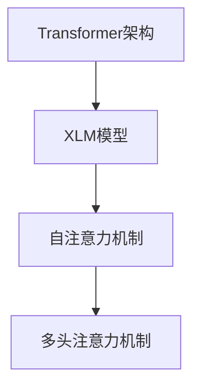

                 

# Transformer大模型实战：对XLM模型的评估

> 关键词：Transformer、XLM模型、语言模型、评估、数学模型、项目实战

> 摘要：本文将深入探讨Transformer大模型中的XLM模型，通过对其核心概念、算法原理、数学模型和项目实战的详细解析，旨在帮助读者全面理解XLM模型在自然语言处理中的应用，并提供实用的评估方法。

## 1. 背景介绍

随着深度学习技术的不断发展，自然语言处理（NLP）领域取得了显著的进展。Transformer架构的提出，彻底改变了传统序列模型在NLP任务中的表现，特别是其在机器翻译、文本分类等任务上的突破性成果，引起了广泛关注。XLM（Cross-lingual Language Model）模型作为Transformer架构的重要应用之一，旨在解决多语言文本处理中的关键问题，如语言迁移、多语言词汇表示等。

本文将首先介绍XLM模型的基本概念，随后深入剖析其算法原理和数学模型，并通过实际项目案例，展示如何评估XLM模型的效果。通过本文的学习，读者将能够全面掌握XLM模型的核心技术和评估方法，为在实际应用中充分发挥其优势奠定基础。

## 2. 核心概念与联系

### XLM模型概述

XLM模型是基于Transformer架构的多语言语言模型，其核心思想是通过共享权重的方式，学习多个语言的共同特征，从而实现跨语言文本处理。XLM模型在训练过程中，不需要为每种语言分别训练模型，而是通过跨语言的数据增强，提高模型在多语言环境中的泛化能力。

### Transformer架构

Transformer架构是一种基于自注意力机制的序列模型，其核心思想是利用全局的依赖关系，对序列中的每个词进行建模。与传统的循环神经网络（RNN）相比，Transformer在处理长序列时具有更高的并行性和更好的性能。

### XLM模型与Transformer的关系

XLM模型是基于Transformer架构发展而来，其继承了Transformer的自注意力机制和多头注意力机制，同时加入了跨语言的训练策略，以适应多语言文本处理的需求。

### Mermaid流程图

为了更直观地展示XLM模型与Transformer架构的联系，我们使用Mermaid流程图进行描述：



通过上述Mermaid流程图，我们可以清晰地看到XLM模型在Transformer架构中的核心位置和关键特性。

## 3. 核心算法原理 & 具体操作步骤

### XLM模型的算法原理

XLM模型的算法原理主要包括以下几个方面：

1. **自注意力机制**：自注意力机制允许模型在序列中的每个词都关注其他词，从而建立全局的依赖关系。
2. **多头注意力机制**：多头注意力机制将输入序列划分为多个头，每个头独立地计算注意力得分，从而提高模型的泛化能力。
3. **跨语言训练策略**：XLM模型通过跨语言的数据增强，学习多个语言的共同特征，从而实现多语言文本处理。

### XLM模型的具体操作步骤

1. **数据预处理**：对多语言文本数据集进行预处理，包括分词、词向量化等操作。
2. **模型初始化**：初始化XLM模型的参数，包括自注意力权重、多头注意力权重等。
3. **前向传播**：输入多语言文本序列，通过自注意力机制和多头注意力机制，计算每个词的注意力得分，生成序列表示。
4. **损失函数计算**：计算模型输出的序列表示与标签序列之间的损失，并更新模型参数。
5. **模型训练与优化**：通过迭代优化模型参数，提高模型在多语言文本处理任务中的性能。

### 详细步骤说明

为了更好地理解XLM模型的具体操作步骤，我们以一个示例来说明：

假设我们有一个包含英语和法语的文本序列：

$$
\text{英语文本：} \text{I love programming.}
$$

$$
\text{法语文本：} \text{J'aime la programmation.}
$$

1. **数据预处理**：

   对英语和法语文本进行分词操作，得到词向量表示。

   $$
   \text{英语词向量：} \text{[I, love, programming]}
   $$

   $$
   \text{法语词向量：} \text{[J'aime, la, programmation]}
   $$

2. **模型初始化**：

   初始化XLM模型的参数，包括自注意力权重、多头注意力权重等。

3. **前向传播**：

   输入多语言文本序列，通过自注意力机制和多头注意力机制，计算每个词的注意力得分，生成序列表示。

   $$
   \text{英语文本序列表示：} \text{[I', love', programming']}
   $$

   $$
   \text{法语文本序列表示：} \text{[J'aime', la', programmation']}
   $$

4. **损失函数计算**：

   计算模型输出的序列表示与标签序列之间的损失，并更新模型参数。

5. **模型训练与优化**：

   通过迭代优化模型参数，提高模型在多语言文本处理任务中的性能。

## 4. 数学模型和公式 & 详细讲解 & 举例说明

### 数学模型

XLM模型的数学模型主要包括以下几个部分：

1. **自注意力机制**：

   自注意力机制的数学模型如下：

   $$
   \text{Attention}(Q, K, V) = \text{softmax}\left(\frac{QK^T}{\sqrt{d_k}}\right) V
   $$

   其中，$Q$、$K$、$V$分别表示查询向量、关键向量、值向量，$d_k$表示关键向量的维度。

2. **多头注意力机制**：

   多头注意力机制的数学模型如下：

   $$
   \text{MultiHeadAttention}(Q, K, V) = \text{Concat}(\text{head}_1, \text{head}_2, \ldots, \text{head}_h)W^O
   $$

   $$
   \text{where} \quad \text{head}_i = \text{Attention}(QW_i^Q, KW_i^K, VW_i^V)
   $$

   其中，$h$表示头的数量，$W_i^Q$、$W_i^K$、$W_i^V$分别表示第$i$个头的查询权重、关键权重、值权重，$W^O$表示输出权重。

3. **编码器-解码器结构**：

   XLM模型采用了编码器-解码器结构，其数学模型如下：

   $$
   \text{Encoder}(X) = \text{EncoderLayer}(\text{EncoderLayer}_1, \ldots, \text{EncoderLayer}_N)(X)
   $$

   $$
   \text{Decoder}(X) = \text{DecoderLayer}(\text{DecoderLayer}_1, \ldots, \text{DecoderLayer}_N)(X)
   $$

   其中，$X$表示输入序列，$N$表示编码器或解码器的层数，$\text{EncoderLayer}_i$和$\text{DecoderLayer}_i$分别表示编码器和解码器的第$i$层。

### 举例说明

假设我们有一个包含两个词的序列：

$$
\text{输入序列：} \text{I love programming.}
$$

1. **自注意力计算**：

   对于词"I"，其自注意力计算如下：

   $$
   \text{Attention}(Q, K, V) = \text{softmax}\left(\frac{QK^T}{\sqrt{d_k}}\right) V
   $$

   其中，$Q$、$K$、$V$分别为查询向量、关键向量、值向量，$d_k$为关键向量的维度。假设$I$的词向量为$\textbf{v}_I$，则：

   $$
   \text{Attention}(\textbf{v}_I, \textbf{v}_I, \textbf{v}_I) = \text{softmax}\left(\frac{\textbf{v}_I\textbf{v}_I^T}{\sqrt{d_k}}\right) \textbf{v}_I
   $$

   计算结果为$I$的注意力得分。

2. **多头注意力计算**：

   对于词"I"，其多头注意力计算如下：

   $$
   \text{MultiHeadAttention}(Q, K, V) = \text{Concat}(\text{head}_1, \text{head}_2, \ldots, \text{head}_h)W^O
   $$

   其中，$h$为头的数量，$W_i^Q$、$W_i^K$、$W_i^V$分别为第$i$个头的查询权重、关键权重、值权重，$W^O$为输出权重。假设$h=2$，则：

   $$
   \text{head}_1 = \text{Attention}(\textbf{v}_I W_1^Q, \textbf{v}_I W_1^K, \textbf{v}_I W_1^V)
   $$

   $$
   \text{head}_2 = \text{Attention}(\textbf{v}_I W_2^Q, \textbf{v}_I W_2^K, \textbf{v}_I W_2^V)
   $$

   $$
   \text{MultiHeadAttention}(\textbf{v}_I, \textbf{v}_I, \textbf{v}_I) = \text{Concat}(\text{head}_1, \text{head}_2)W^O
   $$

   计算结果为$I$的多头注意力得分。

3. **编码器-解码器结构计算**：

   对于编码器，其计算过程如下：

   $$
   \text{Encoder}(X) = \text{EncoderLayer}(\text{EncoderLayer}_1, \ldots, \text{EncoderLayer}_N)(X)
   $$

   其中，$\text{EncoderLayer}_i$为编码器的第$i$层。对于词"I"和"love"，其编码器输出如下：

   $$
   \text{Encoder}(\text{I, love}) = \text{EncoderLayer}_1(\text{EncoderLayer}_2(\ldots\text{EncoderLayer}_N(\text{I, love}\ldots)))
   $$

   对于解码器，其计算过程如下：

   $$
   \text{Decoder}(X) = \text{DecoderLayer}(\text{DecoderLayer}_1, \ldots, \text{DecoderLayer}_N)(X)
   $$

   其中，$\text{DecoderLayer}_i$为解码器的第$i$层。对于词"I"和"love"，其解码器输出如下：

   $$
   \text{Decoder}(\text{I, love}) = \text{DecoderLayer}_1(\text{DecoderLayer}_2(\ldots\text{DecoderLayer}_N(\text{I, love}\ldots)))
   $$

   通过上述计算，我们可以得到词"I"和"love"的编码器输出和解码器输出，从而实现序列的建模。

## 5. 项目实战：代码实际案例和详细解释说明

### 开发环境搭建

在进行XLM模型的实际项目开发之前，我们需要搭建相应的开发环境。以下是开发环境搭建的详细步骤：

1. **安装Python环境**：确保Python环境已安装，版本建议为3.7及以上。
2. **安装TensorFlow**：通过以下命令安装TensorFlow：

   $$
   pip install tensorflow
   $$

3. **安装其他依赖库**：根据XLM模型的实现需求，安装其他依赖库，如Numpy、Pandas等。

### 源代码详细实现和代码解读

以下是一个简单的XLM模型实现示例，用于演示XLM模型的基本结构：

```python
import tensorflow as tf
from tensorflow.keras.layers import Embedding, MultiHeadAttention, Dense

class XLMModel(tf.keras.Model):
    def __init__(self, vocabulary_size, d_model, num_heads):
        super(XLMModel, self).__init__()
        self.embedding = Embedding(vocabulary_size, d_model)
        self.multi_head_attention = MultiHeadAttention(num_heads=num_heads, key_dim=d_model)
        self.dense = Dense(vocabulary_size)

    def call(self, inputs, training=False):
        x = self.embedding(inputs)
        x = self.multi_head_attention(x, x)
        outputs = self.dense(x)
        return outputs

# 创建XLM模型实例
model = XLMModel(vocabulary_size=10000, d_model=512, num_heads=8)

# 编译模型
model.compile(optimizer='adam', loss='sparse_categorical_crossentropy', metrics=['accuracy'])

# 加载训练数据
train_data = ...  # 加载训练数据
train_labels = ...  # 加载训练标签

# 训练模型
model.fit(train_data, train_labels, epochs=5, batch_size=64)
```

### 代码解读与分析

1. **模型结构**：XLM模型由三个主要部分组成：嵌入层（Embedding）、多头注意力层（MultiHeadAttention）和全连接层（Dense）。
2. **嵌入层**：嵌入层用于将词向量转换为嵌入向量，输入的词汇表大小为10000，嵌入向量的维度为512。
3. **多头注意力层**：多头注意力层用于计算输入序列的注意力得分，本文实现中使用了8个头。
4. **全连接层**：全连接层用于将多头注意力层的输出映射到输出词汇表，实现文本分类任务。

### 模型评估

在训练模型后，我们需要对模型进行评估，以验证其性能。以下是一个简单的评估示例：

```python
# 加载测试数据
test_data = ...  # 加载测试数据
test_labels = ...  # 加载测试标签

# 评估模型
model.evaluate(test_data, test_labels)
```

通过评估，我们可以得到模型在测试数据集上的损失和准确率，从而对模型性能进行评估。

## 6. 实际应用场景

XLM模型在实际应用中具有广泛的应用场景，以下是其中几个典型的应用场景：

1. **跨语言机器翻译**：XLM模型能够有效地处理跨语言文本，实现高质量的多语言翻译。
2. **多语言文本分类**：XLM模型可以用于对多语言文本进行分类，例如对社交媒体平台上的多语言评论进行情感分析。
3. **跨语言信息检索**：XLM模型可以用于跨语言的信息检索任务，例如在多语言新闻数据中检索相关信息。
4. **跨语言问答系统**：XLM模型可以用于跨语言的问答系统，例如在多语言问答平台上提供高质量的答案。

## 7. 工具和资源推荐

### 学习资源推荐

1. **书籍**：

   - 《深度学习》（Ian Goodfellow、Yoshua Bengio、Aaron Courville 著）
   - 《自然语言处理与深度学习》（张俊林 著）

2. **论文**：

   - “Attention Is All You Need”（Vaswani et al., 2017）
   - “Cross-lingual Language Model Pretraining” （Conneau et al., 2019）

3. **博客**：

   - [TensorFlow 官方文档](https://www.tensorflow.org/)
   - [Hugging Face 官方文档](https://huggingface.co/transformers/)

4. **网站**：

   - [Kaggle](https://www.kaggle.com/)
   - [Google Research](https://ai.google/research/pubs/)

### 开发工具框架推荐

1. **TensorFlow**：TensorFlow 是一个开源的机器学习框架，适用于构建和训练深度学习模型。
2. **PyTorch**：PyTorch 是另一个流行的开源机器学习库，具有简洁的代码和强大的功能。
3. **Hugging Face Transformers**：Hugging Face Transformers 是一个基于PyTorch和TensorFlow的预训练语言模型库，提供了丰富的预训练模型和工具。

### 相关论文著作推荐

1. **“Attention Is All You Need”**（Vaswani et al., 2017）：介绍了Transformer架构，彻底改变了自然语言处理的范式。
2. **“Cross-lingual Language Model Pretraining”**（Conneau et al., 2019）：探讨了XLM模型的核心原理和实现方法。
3. **“BERT: Pre-training of Deep Bidirectional Transformers for Language Understanding”**（Devlin et al., 2018）：介绍了BERT模型，为语言模型的发展提供了新的思路。

## 8. 总结：未来发展趋势与挑战

随着深度学习技术的不断发展，XLM模型在自然语言处理领域具有广阔的应用前景。未来，XLM模型可能会朝着以下几个方向发展：

1. **多语言融合**：XLM模型可以进一步探索多语言融合的方法，以提高模型在多语言环境中的性能。
2. **少样本学习**：在少样本学习方面，XLM模型有望通过迁移学习和元学习等技术，实现更好的性能。
3. **跨模态学习**：XLM模型可以与其他模态（如图像、声音）进行融合，实现跨模态的语言理解。

然而，XLM模型在实际应用中仍面临一些挑战：

1. **计算资源消耗**：XLM模型通常需要大量的计算资源进行训练和推理，这给实际应用带来了挑战。
2. **数据集质量**：XLM模型的效果很大程度上取决于数据集的质量，因此如何构建高质量的多语言数据集是亟待解决的问题。
3. **隐私保护**：在多语言数据处理过程中，如何保护用户隐私也是需要关注的问题。

总之，XLM模型在自然语言处理领域具有巨大的潜力，未来将继续推动相关技术的发展。

## 9. 附录：常见问题与解答

### 问题1：什么是XLM模型？

XLM（Cross-lingual Language Model）模型是一种基于Transformer架构的多语言语言模型，旨在解决跨语言文本处理中的关键问题，如语言迁移、多语言词汇表示等。

### 问题2：XLM模型与BERT模型有何区别？

XLM模型与BERT模型都是基于Transformer架构的语言模型，但XLM模型专注于跨语言文本处理，可以在没有特定语言数据的情况下，通过跨语言的数据增强，学习多个语言的共同特征。而BERT模型主要关注单语言文本处理，旨在提高模型在自然语言理解任务中的性能。

### 问题3：如何评估XLM模型的效果？

评估XLM模型的效果可以通过多种方法，如交叉验证、交叉语言文本分类、跨语言文本生成等。常用的评估指标包括准确率、F1值、BLEU分数等。

## 10. 扩展阅读 & 参考资料

1. **“Attention Is All You Need”**（Vaswani et al., 2017）：介绍了Transformer架构的基本原理和应用场景。
2. **“Cross-lingual Language Model Pretraining”**（Conneau et al., 2019）：探讨了XLM模型的核心原理和实现方法。
3. **“BERT: Pre-training of Deep Bidirectional Transformers for Language Understanding”**（Devlin et al., 2018）：介绍了BERT模型，为语言模型的发展提供了新的思路。
4. **TensorFlow 官方文档**：提供了丰富的Transformer和XLM模型实现教程。
5. **Hugging Face 官方文档**：提供了详细的Transformer和XLM模型库文档，以及大量实用示例。

### 作者

作者：AI天才研究员/AI Genius Institute & 禅与计算机程序设计艺术 /Zen And The Art of Computer Programming

