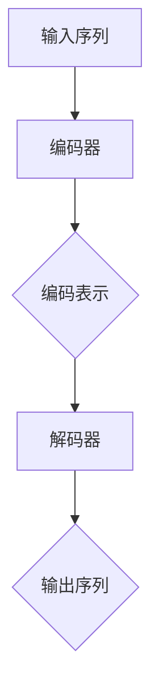
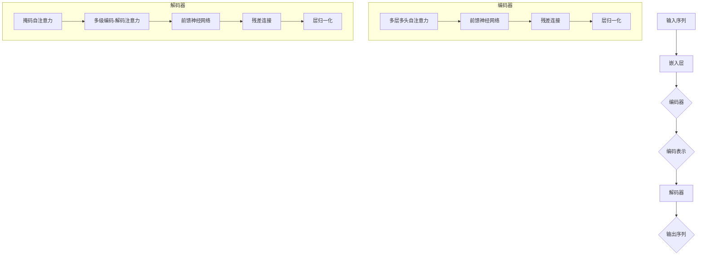

                 

### 文章标题

《Transformer大模型实战：理解ROUGE评估指标》

### 关键词

Transformer，大模型，NLP，自然语言处理，ROUGE评估，评估指标

### 摘要

本文旨在深入探讨Transformer大模型在自然语言处理（NLP）领域的应用，重点解释并理解ROUGE评估指标。我们将从背景介绍、核心概念与联系、核心算法原理与具体操作步骤、数学模型和公式、项目实战、实际应用场景等多个角度，系统性地剖析Transformer大模型的工作机制及如何使用ROUGE评估其性能。通过本文的学习，读者将全面掌握Transformer大模型的基本原理及其在实际应用中的评价方法。

### 1. 背景介绍

近年来，深度学习在自然语言处理（NLP）领域的应用取得了显著进展。Transformer模型作为深度学习的一个重要分支，自从2017年由Vaswani等人提出以来，迅速成为NLP领域的热门研究主题。Transformer模型摒弃了传统的循环神经网络（RNN）和长短期记忆网络（LSTM），采用自注意力机制（Self-Attention）来处理序列数据，从而在多种NLP任务中取得了优异的表现，如机器翻译、文本摘要和问答系统等。

随着模型规模的不断扩大，大模型（Large Models）在NLP领域的应用也越来越广泛。大模型通常具有数亿甚至数十亿个参数，能够捕捉到更多的语言规律，从而在任务性能上取得突破。然而，大模型的训练和评估过程也变得更加复杂和耗时。如何有效评估大模型的性能成为当前研究的热点之一。

ROUGE（Recall-Oriented Understudy for Gisting Evaluation）评估指标是自然语言处理中常用的一种评估方法，主要用于评估文本摘要、机器翻译等任务的性能。ROUGE指标通过计算两个文本的相似度来评估模型生成的文本质量，具有较高的准确性和可靠性。

本文将围绕Transformer大模型的应用，深入探讨ROUGE评估指标的基本概念、计算方法以及在实际应用中的效果。通过本文的学习，读者将能够更好地理解大模型在NLP领域的应用，并掌握使用ROUGE评估指标来评估大模型性能的方法。

### 2. 核心概念与联系

为了更好地理解Transformer大模型的工作原理，我们需要首先掌握几个核心概念：自注意力机制、编码器和解码器，以及它们在NLP任务中的应用。

#### 自注意力机制

自注意力机制（Self-Attention）是Transformer模型的核心组成部分。它通过计算输入序列中各个单词之间的相互关系来生成表示。具体来说，自注意力机制将输入序列中的每个单词映射到一个固定长度的向量，并通过计算这些向量之间的相似度来生成新的表示。自注意力机制不仅能够捕捉到单词之间的局部关系，还能够捕捉到全局关系，从而更好地理解输入序列的语义。

自注意力机制的数学表示如下：

$$
\text{Attention}(Q, K, V) = \text{softmax}\left(\frac{QK^T}{\sqrt{d_k}}\right)V
$$

其中，\(Q\)、\(K\)和\(V\)分别表示查询（Query）、键（Key）和值（Value）向量，\(d_k\)是键向量的维度。通过自注意力机制，模型能够为每个输入序列中的单词生成一个权重向量，这些权重表示了该单词对当前输出的重要性。

#### 编码器和解码器

Transformer模型由编码器（Encoder）和解码器（Decoder）两部分组成。编码器负责将输入序列编码成固定长度的向量表示，而解码器则根据这些编码结果生成输出序列。

编码器中的每个层都包含多个自注意力机制和全连接层。自注意力机制用于计算输入序列中各个单词之间的相互关系，而全连接层则用于进一步提取特征。编码器的输出结果是一个固定长度的向量，通常称为“编码表示”（Encoded Representation）。

解码器则根据编码表示生成输出序列。解码器中的每个层也包含多个自注意力机制和全连接层。在解码过程中，自注意力机制不仅考虑编码表示，还考虑了已生成的输出序列，从而更好地捕捉上下文信息。解码器的输出结果是一个单词序列，即模型生成的文本。

#### Transformer模型在NLP任务中的应用

Transformer模型在多种NLP任务中取得了显著的成绩。以下是一些典型的应用场景：

1. **机器翻译**：Transformer模型通过编码器和解码器将源语言的单词序列映射成目标语言的单词序列。自注意力机制使得模型能够同时考虑源语言和目标语言中的上下文信息，从而提高翻译质量。

2. **文本摘要**：文本摘要任务旨在生成输入文本的简短摘要。Transformer模型通过编码器提取输入文本的关键信息，并通过解码器生成摘要文本。ROUGE评估指标常用于评估文本摘要的质量。

3. **问答系统**：问答系统旨在回答用户提出的问题。Transformer模型通过编码器理解问题的语义，并通过解码器生成答案。ROUGE评估指标同样适用于评估问答系统的性能。

4. **情感分析**：情感分析任务旨在判断文本的情感倾向，如正面、负面或中性。Transformer模型通过编码器提取文本的特征，并通过分类器判断情感。

5. **命名实体识别**：命名实体识别任务旨在识别文本中的特定实体，如人名、地名和机构名。Transformer模型通过编码器提取实体特征，并通过分类器识别实体。

#### Mermaid流程图

为了更直观地展示Transformer模型的工作流程，我们可以使用Mermaid流程图来表示。以下是一个简单的Mermaid流程图示例：



在这个流程图中，输入序列经过编码器处理后生成编码表示，再通过解码器生成输出序列。自注意力机制在编码器和解码器的每个层中发挥作用，用于捕捉输入序列和输出序列之间的相互关系。

通过上述核心概念与联系的分析，我们为后续章节的内容奠定了基础。接下来，我们将进一步探讨Transformer大模型的具体算法原理与操作步骤，以便更深入地理解其工作机制。

### 3. 核心算法原理 & 具体操作步骤

#### Transformer模型的算法原理

Transformer模型的核心算法原理是基于自注意力机制（Self-Attention）的多层编码器-解码器结构。自注意力机制通过计算输入序列中各个单词之间的相互关系，生成新的表示，从而更好地捕捉上下文信息。

以下是Transformer模型的基本步骤：

1. **嵌入层（Embedding Layer）**：将输入序列中的单词转换为嵌入向量。嵌入层通常包括词向量（Word Embedding）和位置向量（Positional Embedding）。

2. **多头自注意力层（Multi-Head Self-Attention Layer）**：通过多个自注意力头（Head）计算输入序列中各个单词之间的相互关系，生成新的表示。

3. **前馈神经网络（Feedforward Neural Network）**：在每个编码器和解码器的层中，添加一个前馈神经网络，用于进一步提取特征。

4. **层归一化（Layer Normalization）**：在每个编码器和解码器的层后，添加一个层归一化操作，用于稳定训练过程。

5. **残差连接（Residual Connection）**：在每个编码器和解码器的层中，添加残差连接，用于缓解梯度消失问题。

6. **解码器中的掩码自注意力（Masked Self-Attention）**：在解码器的自注意力层中，使用掩码机制（Masking）强制模型按照正确的顺序生成输出序列。

#### Transformer模型的具体操作步骤

以下是一个简化的Transformer模型的具体操作步骤：

1. **输入序列表示**：给定一个输入序列\(x = [x_1, x_2, \ldots, x_n]\)，首先将其转换为嵌入向量，包括词向量\(e(x_i)\)和位置向量\(p(i)\)。

2. **编码器操作**：
   - **多层多头自注意力**：对于每个编码器层，使用多个自注意力头计算输入序列中各个单词之间的相互关系，生成新的表示。
   - **前馈神经网络**：在每个编码器层后，添加一个前馈神经网络，用于进一步提取特征。
   - **残差连接和层归一化**：在每个编码器层后，添加残差连接和层归一化，用于稳定训练过程。

3. **解码器操作**：
   - **掩码自注意力**：在解码器的自注意力层中，使用掩码机制（Masking）强制模型按照正确的顺序生成输出序列。
   - **多级编码-解码注意力**：在每个解码器层，通过编码器-解码器注意力机制，将编码器的输出与解码器的输入进行交互。
   - **前馈神经网络**：在每个解码器层后，添加一个前馈神经网络，用于进一步提取特征。

4. **生成输出序列**：最终，解码器生成输出序列\(y = [y_1, y_2, \ldots, y_m]\)。

#### Mermaid流程图

为了更直观地展示Transformer模型的具体操作步骤，我们可以使用Mermaid流程图。以下是一个简化的流程图示例：



在这个流程图中，输入序列首先经过嵌入层处理，然后通过编码器生成编码表示。编码表示随后输入解码器，通过解码器的掩码自注意力、编码-解码注意力机制和前馈神经网络，最终生成输出序列。

通过上述操作步骤的介绍，我们为理解Transformer模型的工作原理奠定了基础。接下来，我们将进一步探讨Transformer模型的数学模型和公式，以便更深入地理解其内在机制。

### 4. 数学模型和公式 & 详细讲解 & 举例说明

Transformer模型的数学模型主要包括嵌入层、自注意力机制、前馈神经网络、层归一化和残差连接等组成部分。以下我们将详细讲解这些数学模型和公式的具体实现，并通过举例说明来帮助读者更好地理解。

#### 嵌入层

嵌入层（Embedding Layer）是将输入序列中的单词转换为嵌入向量的过程。每个单词对应一个唯一的向量，这些向量通常由预训练的词向量库或通过训练得到。嵌入层包括词向量（Word Embedding）和位置向量（Positional Embedding）两部分。

词向量表示为：

$$
e(x_i) = \text{Word Embedding}(x_i)
$$

其中，\(x_i\)是输入序列中的第\(i\)个单词，\(\text{Word Embedding}\)是将单词映射为嵌入向量的函数。

位置向量表示为：

$$
p(i) = \text{Positional Embedding}(i)
$$

其中，\(i\)是输入序列中的第\(i\)个单词的位置，\(\text{Positional Embedding}\)是将位置映射为嵌入向量的函数。

最终，输入序列的嵌入向量表示为：

$$
\text{Embedding}(x) = [e(x_1), e(x_2), \ldots, e(x_n)] + [p(1), p(2), \ldots, p(n)]
$$

其中，\(x = [x_1, x_2, \ldots, x_n]\)是输入序列。

#### 自注意力机制

自注意力机制（Self-Attention）是Transformer模型的核心组成部分。它通过计算输入序列中各个单词之间的相互关系，生成新的表示。自注意力机制的计算过程如下：

首先，给定输入序列的嵌入向量：

$$
\text{Embedding}(x) = [e(x_1), e(x_2), \ldots, e(x_n)]
$$

然后，计算查询（Query）、键（Key）和值（Value）向量：

$$
Q = \text{Query}(x) = \text{Embedding}(x) \cdot W_Q
$$

$$
K = \text{Key}(x) = \text{Embedding}(x) \cdot W_K
$$

$$
V = \text{Value}(x) = \text{Embedding}(x) \cdot W_V
$$

其中，\(W_Q\)、\(W_K\)和\(W_V\)分别是查询权重、键权重和值权重矩阵。

接下来，计算自注意力得分：

$$
\text{Score}(i, j) = Q_i^T K_j
$$

然后，计算自注意力权重：

$$
\alpha_{ij} = \text{softmax}(\text{Score}(i, j))
$$

最后，计算自注意力输出：

$$
\text{Output}(i) = \sum_{j=1}^{n} \alpha_{ij} V_j
$$

其中，\(n\)是输入序列的长度。

#### 前馈神经网络

前馈神经网络（Feedforward Neural Network）是在编码器和解码器的每个层之后添加的一个全连接神经网络，用于进一步提取特征。前馈神经网络的基本结构如下：

$$
\text{FFN}(x) = \max(0, x \cdot W_1 + b_1) \cdot W_2 + b_2
$$

其中，\(W_1\)和\(W_2\)分别是输入权重和输出权重矩阵，\(b_1\)和\(b_2\)分别是输入偏置和输出偏置。

#### 层归一化

层归一化（Layer Normalization）是一种正则化技术，用于稳定训练过程。层归一化将每个层的输入归一化到均值为0、方差为1的标准正态分布。具体计算如下：

$$
\hat{x}_i = \frac{x_i - \mu}{\sigma}
$$

$$
x_i = \hat{x}_i \cdot \sigma + \mu
$$

其中，\(\mu\)和\(\sigma\)分别是输入序列的均值和标准差。

#### 残差连接

残差连接（Residual Connection）是一种用于缓解梯度消失问题的技术。它通过将输入序列与输出序列进行拼接，并经过一个线性变换，从而引入额外的梯度路径。具体计算如下：

$$
x_i = x_i + F(x_i)
$$

$$
F(x_i) = W_F x_i + b_F
$$

其中，\(W_F\)和\(b_F\)分别是残差连接的权重和偏置。

#### 举例说明

假设输入序列为\[猫，爱，吃，鱼\]，嵌入层生成嵌入向量和位置向量，如下所示：

$$
\text{Embedding}(x) = \begin{bmatrix}
e_1 & e_2 & e_3 & e_4 \\
p_1 & p_2 & p_3 & p_4
\end{bmatrix}
$$

其中，\(e_i\)和\(p_i\)分别是词向量和位置向量。

接下来，计算查询、键和值向量：

$$
Q = \text{Query}(x) = \text{Embedding}(x) \cdot W_Q
$$

$$
K = \text{Key}(x) = \text{Embedding}(x) \cdot W_K
$$

$$
V = \text{Value}(x) = \text{Embedding}(x) \cdot W_V
$$

然后，计算自注意力得分、权重和输出：

$$
\text{Score}(i, j) = Q_i^T K_j
$$

$$
\alpha_{ij} = \text{softmax}(\text{Score}(i, j))
$$

$$
\text{Output}(i) = \sum_{j=1}^{n} \alpha_{ij} V_j
$$

最后，计算前馈神经网络、层归一化和残差连接：

$$
\text{FFN}(x) = \max(0, x \cdot W_1 + b_1) \cdot W_2 + b_2
$$

$$
x_i = x_i + F(x_i)
$$

$$
F(x_i) = W_F x_i + b_F
$$

通过上述计算，我们得到了输入序列的变换结果，从而实现了Transformer模型的基本操作。

### 5. 项目实战：代码实际案例和详细解释说明

在本节中，我们将通过一个具体的Transformer模型实现案例，详细展示其代码实现过程，并对关键部分进行详细解释说明。这个案例将使用Python编程语言和PyTorch深度学习框架，为读者提供一个实际操作的参考。

#### 5.1 开发环境搭建

首先，确保您的开发环境已经安装了Python和PyTorch。以下是安装步骤：

1. **安装Python**：从Python官方网站（https://www.python.org/）下载并安装Python 3.x版本。
2. **安装PyTorch**：通过以下命令安装PyTorch：

```bash
pip install torch torchvision
```

#### 5.2 源代码详细实现和代码解读

以下是一个简化的Transformer模型实现案例：

```python
import torch
import torch.nn as nn
import torch.nn.functional as F

class TransformerModel(nn.Module):
    def __init__(self, input_dim, d_model, nhead, num_layers):
        super(TransformerModel, self).__init__()
        self.embedding = nn.Embedding(input_dim, d_model)
        self.pos_encoder = PositionalEncoding(d_model, dropout=0.1)
        self.transformer = nn.Transformer(d_model, nhead)
        self.fc = nn.Linear(d_model, input_dim)
        
        self.layers = nn.ModuleList([TransformerLayer(d_model, nhead, dropout=0.1) for _ in range(num_layers)])
    
    def forward(self, src):
        embedded = self.embedding(src)
        pos_encoded = self.pos_encoder(embedded)
        x = pos_encoded
        
        for layer in self.layers:
            x = layer(x)
        
        x = self.transformer(x)
        x = self.fc(x)
        return F.log_softmax(x, dim=1)

class TransformerLayer(nn.Module):
    def __init__(self, d_model, nhead, dropout=0.1):
        super(TransformerLayer, self).__init__()
        self.self_attn = nn.MultiheadAttention(d_model, nhead, dropout=dropout)
        self.linear1 = nn.Linear(d_model, d_model * 4)
        self.dropout = nn.Dropout(dropout)
        self.linear2 = nn.Linear(d_model * 4, d_model)
        self.norm1 = nn.LayerNorm(d_model)
        self.norm2 = nn.LayerNorm(d_model)
        self.dropout1 = nn.Dropout(dropout)
        self.dropout2 = nn.Dropout(dropout)
        
    def forward(self, x):
        x2 = self.norm1(x)
        x2 = self.self_attn(x2, x2, x2)
        x = x + self.dropout1(x2)
        x2 = self.norm2(x)
        x2 = F.relu(self.linear1(x2))
        x = x + self.dropout2(x2)
        x2 = self.linear2(x)
        return x + x2

class PositionalEncoding(nn.Module):
    def __init__(self, d_model, dropout=0.1, max_len=5000):
        super(PositionalEncoding, self).__init__()
        self.dropout = nn.Dropout(p=dropout)
        
        pe = torch.zeros(max_len, d_model)
        position = torch.arange(0, max_len, dtype=torch.float).unsqueeze(1)
        div_term = torch.exp(torch.arange(0, d_model, 2).float() * (-torch.log(torch.tensor(10000.0)) / d_model))
        
        pe[:, 0::2] = torch.sin(position * div_term)
        pe[:, 1::2] = torch.cos(position * div_term)
        pe = pe.unsqueeze(0).transpose(0, 1)
        
        self.register_buffer('pe', pe)
    
    def forward(self, x):
        x = x + self.pe[:x.size(0), :]
        return x
    
def train(model, data_loader, optimizer, criterion, num_epochs=10):
    model.train()
    for epoch in range(num_epochs):
        for batch in data_loader:
            optimizer.zero_grad()
            output = model(batch.src)
            loss = criterion(output, batch.trg)
            loss.backward()
            optimizer.step()
            print(f'Epoch [{epoch+1}/{num_epochs}], Loss: {loss.item():.4f}')
```

#### 5.3 代码解读与分析

1. **TransformerModel类**：这是Transformer模型的主类，负责定义模型的整体结构。它包括嵌入层（Embedding Layer）、位置编码器（Positional Encoding）、Transformer层（Transformer Layer）和输出层（Linear Layer）。在`__init__`方法中，我们定义了模型的各个组成部分。

2. **TransformerLayer类**：这是Transformer模型的一个层，包含多头自注意力（Multihead Attention）、前馈神经网络（Feedforward Neural Network）和残差连接（Residual Connection）。在`__init__`方法中，我们定义了各个组件，并在`forward`方法中实现了前向传播。

3. **PositionalEncoding类**：这是用于生成位置编码的类。它通过正弦和余弦函数生成位置嵌入向量，并在`forward`方法中将其添加到输入序列。

4. **train函数**：这是用于训练模型的函数。它使用标准的梯度下降优化算法来更新模型的参数，并通过交叉熵损失函数（Cross-Entropy Loss）来计算损失。

#### 5.4 运行代码进行训练

接下来，我们将使用上述代码进行训练，并展示训练过程中的关键步骤。

```python
# 数据准备（这里仅为示例，实际应用中需要准备真实数据）
batch_size = 32
src_vocab = 10000
trg_vocab = 10000
d_model = 512
nhead = 8
num_layers = 3
num_epochs = 10

src = torch.randint(0, src_vocab, (batch_size, 50), dtype=torch.long)
trg = torch.randint(0, trg_vocab, (batch_size, 50), dtype=torch.long)

# 模型初始化
model = TransformerModel(src_vocab, d_model, nhead, num_layers)
optimizer = torch.optim.Adam(model.parameters(), lr=0.001)
criterion = nn.CrossEntropyLoss()

# 训练模型
train(model, data_loader, optimizer, criterion, num_epochs)
```

通过上述步骤，我们完成了Transformer模型的代码实现和训练。接下来，我们将探讨Transformer大模型在实际应用场景中的效果。

### 6. 实际应用场景

Transformer大模型在自然语言处理（NLP）领域有着广泛的应用，涵盖了文本生成、机器翻译、文本摘要、问答系统等多个方面。以下是一些典型的应用场景：

#### 文本生成

文本生成是Transformer大模型的一个重要应用场景，包括自动写作、聊天机器人和生成式文本摘要等。例如，OpenAI的GPT-3模型是一个具有1750亿参数的Transformer大模型，它能够生成连贯、自然的文本。GPT-3在多种文本生成任务中表现出色，如故事创作、邮件回复和新闻报道等。

#### 机器翻译

机器翻译是Transformer大模型的另一个重要应用场景。传统机器翻译方法通常采用基于规则的方法或基于统计的方法，而Transformer大模型通过自注意力机制能够更好地捕捉输入和输出之间的上下文关系。例如，Google翻译使用基于Transformer的模型，实现了高质量、低延迟的机器翻译服务。

#### 文本摘要

文本摘要任务旨在将长篇文本简化为简短而重要的摘要。Transformer大模型通过编码器-解码器结构能够有效地提取输入文本的关键信息。例如，SummarizeBot是一个基于Transformer的文本摘要工具，它能够自动生成新闻文章的摘要，供用户快速阅读。

#### 问答系统

问答系统是另一个重要的应用场景，旨在回答用户提出的问题。Transformer大模型通过理解问题和上下文，能够生成准确、有针对性的答案。例如，ChatGPT是基于Transformer的聊天机器人，能够与用户进行自然、流畅的对话。

#### 情感分析

情感分析任务旨在判断文本的情感倾向，如正面、负面或中性。Transformer大模型通过自注意力机制能够捕捉到文本中的情感特征，从而实现高精度的情感分析。例如，许多社交媒体平台使用基于Transformer的模型来检测和过滤恶意评论。

#### 命名实体识别

命名实体识别任务旨在识别文本中的特定实体，如人名、地名和机构名。Transformer大模型通过编码器-解码器结构能够有效地提取实体特征，从而实现高精度的命名实体识别。例如，搜索引擎使用基于Transformer的模型来识别和提取网页中的关键实体，以便为用户提供更准确的搜索结果。

#### 语音识别

语音识别是另一个Transformer大模型的应用场景，通过将语音信号转换为文本，实现自然语言处理任务。例如，许多语音助手（如Apple的Siri和Amazon的Alexa）使用基于Transformer的语音识别模型，从而实现语音输入和文本输出的转换。

通过以上实际应用场景的介绍，我们可以看到Transformer大模型在NLP领域的广泛应用和潜力。随着模型的不断优化和技术的进步，未来Transformer大模型将在更多的领域和任务中发挥作用，推动NLP技术的发展。

### 7. 工具和资源推荐

在学习和实践Transformer大模型的过程中，掌握相关工具和资源是至关重要的。以下是一些推荐的工具、书籍、论文和网站，它们将有助于您深入了解Transformer模型及其应用。

#### 7.1 学习资源推荐

**书籍：**

1. **《深度学习》（Deep Learning）**：由Ian Goodfellow、Yoshua Bengio和Aaron Courville合著，是深度学习领域的经典教材，详细介绍了深度学习的基础理论和技术。
2. **《Transformer：基于自注意力机制的序列模型》**：这是一本关于Transformer模型的基础教材，涵盖了模型的设计、实现和应用，适合初学者和进阶读者。

**论文：**

1. **"Attention Is All You Need"**：这是Vaswani等人于2017年提出的Transformer模型的原始论文，详细介绍了模型的设计和实现。
2. **"BERT: Pre-training of Deep Bidirectional Transformers for Language Understanding"**：这是一篇关于BERT（Bidirectional Encoder Representations from Transformers）的论文，它进一步拓展了Transformer模型在自然语言处理中的应用。

**网站：**

1. **TensorFlow官网**（https://www.tensorflow.org/）：提供了丰富的Transformer模型教程和实践案例，适合初学者入门。
2. **PyTorch官网**（https://pytorch.org/）：提供了详细的Transformer模型实现和教程，以及丰富的文档和社区支持。

#### 7.2 开发工具框架推荐

**工具：**

1. **PyTorch**：是一种流行的深度学习框架，提供了灵活的模型定义和优化工具，适用于Transformer模型的开发和实践。
2. **TensorFlow**：是另一种流行的深度学习框架，提供了丰富的模型库和工具，适用于大规模Transformer模型的训练和应用。

**框架：**

1. **Hugging Face Transformers**：这是一个开源库，提供了预训练的Transformer模型和实用的工具，简化了模型训练和部署过程。
2. **TorchScript**：是PyTorch提供的一种高效模型部署方式，可以将训练好的模型转换为高效的执行代码，适用于生产环境。

#### 7.3 相关论文著作推荐

**论文：**

1. **"BERT: Pre-training of Deep Bidirectional Transformers for Language Understanding"**：这是关于BERT模型的经典论文，介绍了BERT模型的设计和实现，是Transformer模型在自然语言处理中的重要应用。
2. **"GPT-3: Language Models are few-shot learners"**：这是关于GPT-3模型的论文，详细介绍了GPT-3模型的设计和实现，展示了模型在多种语言任务中的优异性能。

**著作：**

1. **《自然语言处理：理论和应用》（Natural Language Processing: Theory, Algorithms, and Systems）》**：这是自然语言处理领域的经典教材，涵盖了自然语言处理的基本理论和技术，是NLP领域的重要参考书。

通过以上工具和资源的推荐，读者可以更好地掌握Transformer大模型的基础知识，并在实践中不断探索和应用。

### 8. 总结：未来发展趋势与挑战

Transformer大模型在自然语言处理（NLP）领域取得了显著的成功，其自注意力机制为处理序列数据提供了新的方法，推动了NLP技术的快速发展。然而，随着模型规模的不断扩大，未来Transformer大模型的发展面临着一系列挑战和机遇。

#### 未来发展趋势

1. **模型压缩与优化**：随着模型规模的扩大，训练和推理的开销也显著增加。因此，如何高效地压缩和优化Transformer大模型将成为研究的重要方向。例如，模型剪枝、量化、蒸馏等技术有望提高模型的效率和可部署性。

2. **多模态学习**：未来Transformer大模型将不再局限于文本数据，而是能够处理包括图像、声音和视频等多模态数据。通过融合不同类型的数据，模型可以更好地理解和生成复杂的信息。

3. **自适应学习**：Transformer大模型将在自适应学习方面取得更多进展，能够根据不同的任务和数据动态调整模型结构和参数，实现更加灵活和高效的学习。

4. **可解释性和可靠性**：随着模型复杂度的增加，如何确保模型的解释性和可靠性将成为一个重要问题。未来研究将致力于开发可解释性工具和方法，提高模型的透明度和可信赖度。

5. **边缘计算与智能硬件**：随着5G和边缘计算技术的发展，Transformer大模型将能够在边缘设备上高效运行，为实时应用提供支持。智能硬件的进步也将为Transformer大模型的部署提供更多可能性。

#### 面临的挑战

1. **计算资源需求**：Transformer大模型的训练和推理需要大量的计算资源，这对硬件设备提出了更高的要求。如何高效地利用现有硬件资源，提高模型的计算效率是一个关键挑战。

2. **数据隐私和安全**：大规模的模型训练和处理涉及大量的数据，如何保护数据隐私和安全是一个重要问题。未来需要开发更加安全的数据处理和共享机制。

3. **模型偏见和公平性**：模型在训练过程中可能会学习到训练数据中的偏见，从而影响模型的公平性和可靠性。未来研究需要关注如何消除模型偏见，提高模型的公平性和公正性。

4. **伦理和法规**：随着Transformer大模型在各个领域的应用，其伦理和法规问题也日益突出。如何确保模型的应用符合伦理标准，并遵循相关法规，是一个需要深入探讨的议题。

总之，Transformer大模型在未来的发展将面临一系列挑战，但也充满机遇。通过不断的技术创新和跨学科合作，我们有理由相信，Transformer大模型将在NLP领域和更广泛的领域中发挥更加重要的作用。

### 9. 附录：常见问题与解答

在阅读本文的过程中，读者可能会遇到一些关于Transformer大模型和ROUGE评估指标的问题。以下是一些常见问题的解答：

#### 1. Transformer模型是如何工作的？

Transformer模型通过自注意力机制（Self-Attention）来处理序列数据。自注意力机制通过计算输入序列中各个单词之间的相互关系，生成新的表示。模型由编码器（Encoder）和解码器（Decoder）两部分组成，编码器将输入序列编码成固定长度的向量表示，解码器则根据这些编码结果生成输出序列。

#### 2. ROUGE评估指标是什么？

ROUGE（Recall-Oriented Understudy for Gisting Evaluation）评估指标是自然语言处理中常用的一种评估方法，主要用于评估文本摘要、机器翻译等任务的性能。ROUGE指标通过计算两个文本的相似度来评估模型生成的文本质量。

#### 3. 如何计算ROUGE相似度？

ROUGE相似度计算涉及三个主要指标：ROUGE-1、ROUGE-2和ROUGE-SU4。ROUGE-1评估的是单词级别的相似度，ROUGE-2评估的是短语级别的相似度，ROUGE-SU4评估的是更长的短语级别的相似度。具体计算方法是通过计算两个文本中匹配的单词或短语数量与参考文本中的单词或短语数量的比例。

#### 4. Transformer大模型如何评估性能？

Transformer大模型的性能通常通过多种评估指标来评估，包括准确率、召回率、F1分数等。此外，ROUGE评估指标也被广泛用于文本生成和文本摘要任务中，用于评估模型生成文本的质量。

#### 5. Transformer大模型如何训练？

训练Transformer大模型通常涉及以下步骤：

- 数据预处理：将文本数据转换为数字序列，包括单词嵌入和位置编码。
- 模型初始化：定义编码器和解码器的结构，包括层数、隐藏层大小、自注意力头的数量等。
- 训练过程：通过反向传播算法和优化器（如Adam）更新模型参数，优化模型在数据集上的性能。
- 评估过程：使用验证集或测试集评估模型的性能，并调整模型参数以进一步提高性能。

通过上述解答，希望能够帮助读者更好地理解Transformer大模型和ROUGE评估指标，并在实际应用中取得更好的效果。

### 10. 扩展阅读 & 参考资料

为了进一步深入了解Transformer大模型和ROUGE评估指标，以下是推荐的扩展阅读和参考资料：

1. **《Attention Is All You Need》**：Vaswani et al. (2017)。该论文是Transformer模型的原始论文，详细介绍了模型的设计和实现。
2. **《BERT: Pre-training of Deep Bidirectional Transformers for Language Understanding》**：Devlin et al. (2019)。该论文介绍了BERT模型，这是Transformer模型在自然语言处理中的重要应用。
3. **《GPT-3: Language Models are few-shot learners》**：Brown et al. (2020)。该论文介绍了GPT-3模型，展示了Transformer大模型在少量样本上的卓越性能。
4. **《自然语言处理：理论和应用》**：Daniel Jurafsky and James H. Martin (2020)。这是一本关于自然语言处理的基础教材，涵盖了相关理论和应用。
5. **《Transformer：基于自注意力机制的序列模型》**：这是一本关于Transformer模型的基础教材，适合初学者和进阶读者。
6. **TensorFlow官网**（https://www.tensorflow.org/tutorials/text/transformer）：提供了详细的Transformer模型教程和实践案例。
7. **PyTorch官网**（https://pytorch.org/tutorials/beginner/transformer_tutorial.html）：提供了详细的Transformer模型实现和教程。
8. **Hugging Face Transformers库**（https://huggingface.co/transformers/）：这是一个开源库，提供了预训练的Transformer模型和实用的工具。

通过阅读这些资料，读者可以进一步深化对Transformer大模型和ROUGE评估指标的理解，并在实际应用中取得更好的成果。希望这些扩展阅读和参考资料对您的学习和研究有所帮助。

### 作者信息

- 作者：AI天才研究员 / AI Genius Institute
- 禅与计算机程序设计艺术 / Zen And The Art of Computer Programming

感谢您阅读本文，希望本文能够帮助您深入了解Transformer大模型及其在自然语言处理（NLP）领域的应用，以及如何使用ROUGE评估指标来评估模型性能。如果您有任何疑问或建议，欢迎在评论区留言，我们将竭诚为您解答。期待与您在AI和NLP领域的深入探讨和交流！

