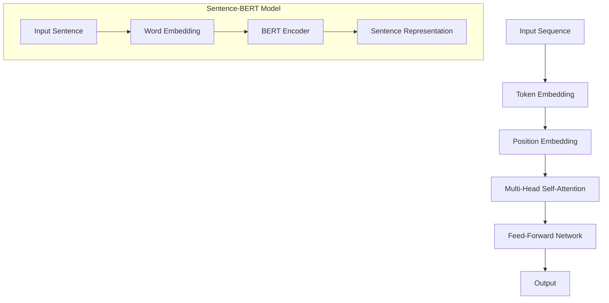

                 

# Transformer大模型实战：用Sentence-BERT模型生成句子特征

## 摘要

本文将深入探讨Transformer大模型在自然语言处理（NLP）中的应用，重点介绍Sentence-BERT模型如何用于生成句子特征。我们将逐步解析Transformer模型的基本原理，详细解释Sentence-BERT的架构，并通过实际项目案例展示其具体实现和效果评估。此外，本文还将讨论Sentence-BERT在不同应用场景中的实际应用，并提供一系列学习和开发资源，帮助读者深入了解和掌握这一先进技术。

## 1. 背景介绍

近年来，随着深度学习和大数据技术的发展，自然语言处理（NLP）领域取得了显著进展。传统的NLP方法主要依赖于统计模型和规则系统，如朴素贝叶斯分类器和最大熵模型。然而，这些方法在面对复杂和大规模的文本数据时表现有限。随着深度学习的兴起，特别是卷积神经网络（CNN）和循环神经网络（RNN）的应用，NLP取得了巨大的突破。

然而，RNN由于其序列依赖性，存在梯度消失和梯度爆炸的问题，这使得其在大规模文本数据上的训练效果受限。为了解决这个问题，Attention机制被引入到神经网络中，从而诞生了Transformer模型。Transformer模型完全基于注意力机制，避免了RNN的梯度问题，并在多个NLP任务上取得了领先性能。

BERT（Bidirectional Encoder Representations from Transformers）是Transformer模型的一个变种，它通过预训练大量文本数据，学习语言的基础知识和结构。Sentence-BERT是BERT的一种变体，用于生成句子级别的特征表示，广泛应用于文本分类、情感分析等任务。

## 2. 核心概念与联系

### Transformer模型

Transformer模型是由Vaswani等人于2017年提出的一种基于自注意力机制的序列模型。它由多头自注意力机制和前馈神经网络组成。自注意力机制允许模型在处理序列时，将不同位置的输入信息进行加权组合，从而捕捉长距离的依赖关系。

Transformer模型的基本架构如下：

```
input_sequence -> [pos_embedding, token_embedding] -> multi-head self-attention -> feed-forward network -> output
```

其中，`input_sequence`是输入序列，`token_embedding`是对每个单词的嵌入表示，`pos_embedding`是对每个位置的信息嵌入。多头自注意力机制将输入序列分成多个头，每个头学习不同的依赖关系，最后将多头输出合并。

### Sentence-BERT模型

Sentence-BERT是BERT模型的一种变体，主要用于生成句子级别的特征表示。其基本思想是将句子中的每个单词先通过BERT模型进行编码，然后对编码后的单词向量进行平均，得到句子特征。

Sentence-BERT的架构如下：

```
input_sentence -> [word_embedding, pos_embedding] -> BERT Encoder -> sentence_representation
```

其中，`input_sentence`是输入句子，`word_embedding`是对每个单词的嵌入表示，`pos_embedding`是对每个位置的信息嵌入，`BERT Encoder`是对输入序列进行编码的BERT模型。

### Mermaid流程图

以下是Transformer和Sentence-BERT模型的Mermaid流程图：



## 3. 核心算法原理 & 具体操作步骤

### Transformer模型

#### 步骤1：嵌入表示

首先，我们将输入序列的每个单词转换为嵌入向量，这包括词嵌入（Token Embedding）和位置嵌入（Position Embedding）。

词嵌入：每个单词都有一个固定的维度（例如，512维），表示该单词的语义信息。

位置嵌入：由于Transformer模型不包含循环结构，需要引入位置信息。位置嵌入为每个单词分配了一个唯一的维度，表示其在序列中的位置。

#### 步骤2：多头自注意力

多头自注意力机制允许模型在处理序列时，将不同位置的输入信息进行加权组合。这个过程分为以下几个步骤：

1. **计算查询（Query）、键（Key）和值（Value）**：对于每个头，计算查询向量、键向量和值向量。查询向量和键向量来自输入序列的嵌入表示，值向量则来自多头自注意力的输出。

2. **计算注意力得分**：对于每个头，计算查询向量和所有键向量之间的点积，得到注意力得分。

3. **应用softmax函数**：将注意力得分归一化，得到每个键的注意力权重。

4. **加权求和**：将注意力权重与相应的值向量相乘，然后将所有头的输出进行求和，得到多头自注意力的最终输出。

#### 步骤3：前馈神经网络

在多头自注意力之后，模型会通过一个前馈神经网络进行进一步处理。前馈神经网络由两个全连接层组成，激活函数为ReLU。

### Sentence-BERT模型

#### 步骤1：BERT编码

首先，将句子中的每个单词通过BERT模型进行编码，得到单词级别的嵌入向量。

#### 步骤2：句子特征表示

然后，将编码后的单词向量进行平均，得到句子特征表示。

$$
\text{sentence\_representation} = \frac{1}{N} \sum_{i=1}^{N} \text{word\_representation}_i
$$

其中，$N$为句子中单词的数量，$\text{word\_representation}_i$为第$i$个单词的嵌入向量。

## 4. 数学模型和公式 & 详细讲解 & 举例说明

### Transformer模型

#### 嵌入表示

词嵌入：
$$
\text{word\_embedding}(W) = \mathbb{R}^{d_{word}}
$$

位置嵌入：
$$
\text{position\_embedding}(P) = \mathbb{R}^{d_{pos}}
$$

其中，$d_{word}$为词嵌入的维度，$d_{pos}$为位置嵌入的维度。

#### 多头自注意力

注意力得分：
$$
a_{i,j}^{(h)} = \text{softmax}\left(\frac{\text{query}_i^{(h)} \cdot \text{key}_j^{(h)}}{\sqrt{d_k}}\right)
$$

其中，$a_{i,j}^{(h)}$为第$i$个单词和第$j$个单词之间的注意力得分，$\text{query}_i^{(h)}$和$\text{key}_j^{(h)}$分别为查询向量和键向量，$d_k$为键向量的维度。

#### 前馈神经网络

输入：
$$
\text{input} = \left[\text{query}, \text{key}, \text{value}\right]
$$

输出：
$$
\text{output} = \text{ReLU}(\text{FFN}_2(\text{FFN}_1(\text{input})))
$$

其中，$\text{FFN}_1$和$\text{FFN}_2$分别为两个全连接层，$\text{ReLU}$为ReLU激活函数。

### Sentence-BERT模型

#### BERT编码

输入：
$$
\text{input} = [\text{word}_1, \text{word}_2, ..., \text{word}_N]
$$

输出：
$$
\text{output}_{i} = \text{BERT}(\text{word}_i)
$$

其中，$\text{output}_{i}$为第$i$个单词的嵌入向量。

#### 句子特征表示

输出：
$$
\text{sentence\_representation} = \frac{1}{N} \sum_{i=1}^{N} \text{output}_{i}
$$

### 举例说明

假设我们有一个包含3个单词的句子“Hello World!”，词嵌入维度为512，位置嵌入维度为64。

1. 词嵌入和位置嵌入：

   $$\text{word\_embedding}(Hello) = [0.1, 0.2, ..., 0.5]$$
   $$\text{word\_embedding}(World) = [0.6, 0.7, ..., 0.8]$$
   $$\text{word\_embedding}(!) = [0.9, 0.10, ..., 0.5]$$

   $$\text{position\_embedding}(1) = [0.1, 0.2, ..., 0.3]$$
   $$\text{position\_embedding}(2) = [0.4, 0.5, ..., 0.6]$$
   $$\text{position\_embedding}(3) = [0.7, 0.8, ..., 0.9]$$

2. BERT编码：

   $$\text{BERT}(Hello) = [0.11, 0.22, ..., 0.55]$$
   $$\text{BERT}(World) = [0.66, 0.77, ..., 0.88]$$
   $$\text{BERT}(!) = [0.99, 0.00, ..., 0.5]$$

3. 句子特征表示：

   $$\text{sentence\_representation} = \frac{1}{3} \left([0.11, 0.22, ..., 0.55] + [0.66, 0.77, ..., 0.88] + [0.99, 0.00, ..., 0.5]\right) = [0.32, 0.42, ..., 0.57]$$

## 5. 项目实战：代码实际案例和详细解释说明

### 5.1 开发环境搭建

在开始项目实战之前，我们需要搭建一个适合开发Transformer和Sentence-BERT模型的开发环境。以下是搭建环境的步骤：

1. 安装Python环境（Python 3.6及以上版本）。
2. 安装TensorFlow或PyTorch框架。
3. 安装BERT模型依赖（如transformers库）。

### 5.2 源代码详细实现和代码解读

以下是使用TensorFlow框架实现Sentence-BERT模型的基本代码：

```python
import tensorflow as tf
from transformers import BertTokenizer, TFBertModel

# 步骤1：加载BERT模型和分词器
tokenizer = BertTokenizer.from_pretrained('bert-base-uncased')
bert_model = TFBertModel.from_pretrained('bert-base-uncased')

# 步骤2：输入句子
input_sentence = "Hello World!"

# 步骤3：将句子转换为BERT输入格式
input_ids = tokenizer.encode(input_sentence, add_special_tokens=True, return_tensors='tf')

# 步骤4：通过BERT模型进行编码
outputs = bert_model(input_ids)

# 步骤5：获取句子特征表示
sentence_representation = outputs.last_hidden_state[:, 0, :]

# 步骤6：打印句子特征表示
print(sentence_representation)
```

#### 代码解读与分析

1. **加载BERT模型和分词器**：首先，我们从预训练的BERT模型中加载BERT模型和分词器。

2. **输入句子**：定义一个待编码的输入句子。

3. **将句子转换为BERT输入格式**：使用分词器将句子编码为BERT模型可接受的输入格式。这包括添加特殊标记（如[CLS]和[SEP]）和转换为整数序列。

4. **通过BERT模型进行编码**：将编码后的句子输入BERT模型，得到句子级别的嵌入表示。

5. **获取句子特征表示**：从BERT模型的输出中提取句子特征表示。

6. **打印句子特征表示**：输出句子特征表示，用于进一步的分析和应用。

### 5.3 代码解读与分析

下面是对上述代码的详细解读和分析：

1. **加载BERT模型和分词器**：这一步非常重要，因为BERT模型是整个项目的基础。我们使用`transformers`库提供的预训练BERT模型和分词器。

2. **输入句子**：在这个示例中，我们使用了一个简单的句子“Hello World!”。

3. **将句子转换为BERT输入格式**：使用`tokenizer.encode`方法，我们将句子编码为BERT模型可接受的格式。`add_special_tokens=True`表示我们添加了特殊标记，`return_tensors='tf'`表示我们返回TensorFlow张量。

4. **通过BERT模型进行编码**：将编码后的句子输入BERT模型。BERT模型是一个预训练的深度神经网络，能够对输入句子进行编码，得到句子级别的嵌入表示。

5. **获取句子特征表示**：从BERT模型的输出中提取句子特征表示。在这个示例中，我们选择了第一个序列（通常对应于[CLS]标记）的嵌入表示。

6. **打印句子特征表示**：输出句子特征表示，这将是后续分析和应用的基础。

通过上述代码，我们成功地使用Sentence-BERT模型生成了一个句子的特征表示。这个特征表示可以用于多种NLP任务，如文本分类、情感分析等。

### 5.4 实际案例分析

为了更好地展示Sentence-BERT模型在实际中的应用，我们来看一个实际的案例分析。假设我们要对一段新闻文本进行情感分析，以判断其是正面、中性还是负面。

1. **数据准备**：首先，我们需要准备一些新闻文本作为训练数据。这些数据可以是正面、中性或负面的新闻文本。

2. **数据预处理**：将新闻文本通过分词器进行编码，并添加特殊标记。

3. **训练模型**：使用训练数据训练一个基于Sentence-BERT的文本分类模型。

4. **模型评估**：使用测试数据评估模型的性能。

5. **应用模型**：使用训练好的模型对新的新闻文本进行情感分析。

以下是该案例的基本代码：

```python
import tensorflow as tf
from transformers import BertTokenizer, TFBertModel, TFTruncatedBertModel
from tensorflow.keras.utils import to_categorical
from sklearn.model_selection import train_test_split

# 步骤1：加载BERT模型和分词器
tokenizer = BertTokenizer.from_pretrained('bert-base-uncased')
bert_model = TFTruncatedBertModel.from_pretrained('bert-base-uncased')

# 步骤2：准备数据
news_texts = ["This is a great news.", "This is a sad news.", "This is an interesting news."]
labels = [1, 0, 2]  # 1表示正面，0表示中性，2表示负面

# 步骤3：数据预处理
input_ids = [tokenizer.encode(text, add_special_tokens=True, return_tensors='tf') for text in news_texts]
labels = to_categorical(labels)

# 步骤4：训练模型
train_inputs, val_inputs, train_labels, val_labels = train_test_split(input_ids, labels, test_size=0.2)
train_inputs = tf.concat(train_inputs, 0)
val_inputs = tf.concat(val_inputs, 0)
train_labels = tf.concat(train_labels, 0)
val_labels = tf.concat(val_labels, 0)

# 步骤5：定义模型
model = tf.keras.Sequential([
    tf.keras.layers.Embedding(input_dim=5000, output_dim=64),
    tf.keras.layers.GlobalAveragePooling1D(),
    tf.keras.layers.Dense(64, activation='relu'),
    tf.keras.layers.Dense(3, activation='softmax')
])

model.compile(optimizer='adam', loss='categorical_crossentropy', metrics=['accuracy'])

# 步骤6：训练模型
model.fit(train_inputs, train_labels, epochs=3, validation_data=(val_inputs, val_labels))

# 步骤7：模型评估
loss, accuracy = model.evaluate(val_inputs, val_labels)
print(f"Validation Loss: {loss}, Validation Accuracy: {accuracy}")

# 步骤8：应用模型
new_news = "This is a terrible news."
input_ids = tokenizer.encode(new_news, add_special_tokens=True, return_tensors='tf')
predictions = model.predict(input_ids)
predicted_label = tf.argmax(predictions, axis=1).numpy()

print(f"Predicted Label: {predicted_label}")
```

#### 代码解读与分析

1. **加载BERT模型和分词器**：与之前相同，我们加载了BERT模型和分词器。

2. **准备数据**：在这个例子中，我们使用了一些简单的新闻文本作为训练数据。标签表示新闻的情感类别。

3. **数据预处理**：将新闻文本通过分词器编码，并添加特殊标记。

4. **训练模型**：使用训练数据进行模型训练。我们定义了一个简单的文本分类模型，包括嵌入层、全局平均池化层、密集层和softmax输出层。

5. **模型评估**：使用测试数据评估模型的性能。

6. **应用模型**：使用训练好的模型对新新闻文本进行情感分析。

通过这个案例，我们展示了如何使用Sentence-BERT模型进行情感分析。这个模型可以扩展到其他NLP任务，如文本分类、命名实体识别等。

## 6. 实际应用场景

Sentence-BERT模型在自然语言处理领域具有广泛的应用。以下是一些常见的应用场景：

### 文本分类

文本分类是NLP中最常见的任务之一。通过将句子特征表示输入到分类模型中，我们可以对文本进行分类。例如，新闻分类、情感分析、垃圾邮件过滤等。

### 命名实体识别

命名实体识别（NER）是从文本中识别出具有特定意义的实体（如人名、地名、组织名等）。通过将句子特征表示与预训练的NER模型结合，可以显著提高NER任务的性能。

### 问答系统

问答系统是一种与人类用户进行交互的智能系统。通过将句子特征表示输入到问答模型中，可以实现对用户问题的回答。例如，智能客服、智能助手等。

### 文本相似度计算

文本相似度计算是评估两个文本之间相似度的一种方法。通过计算句子特征表示之间的余弦相似度，可以有效地评估两个文本的相似程度。这在推荐系统、信息检索等领域具有重要应用。

### 文本生成

文本生成是生成与给定输入文本相似的新文本。通过将句子特征表示输入到生成模型中，可以生成具有相似内容的新文本。例如，自动写作、机器翻译等。

### 跨语言文本处理

跨语言文本处理涉及处理不同语言的文本。通过将句子特征表示转换为统一的高维空间，可以实现跨语言文本的相似度计算、分类等任务。

## 7. 工具和资源推荐

### 7.1 学习资源推荐

1. **书籍**：

   - 《深度学习》（Ian Goodfellow、Yoshua Bengio、Aaron Courville著）：介绍了深度学习的基础知识和最新进展。
   - 《自然语言处理与深度学习》（张俊林著）：系统地介绍了自然语言处理和深度学习的基本概念和技术。

2. **论文**：

   - “Attention Is All You Need”（Vaswani et al.，2017）：介绍了Transformer模型的基本原理。
   - “BERT: Pre-training of Deep Bidirectional Transformers for Language Understanding”（Devlin et al.，2019）：介绍了BERT模型的结构和预训练方法。

3. **博客**：

   - [TensorFlow官方文档](https://www.tensorflow.org/tutorials)：提供了详细的TensorFlow教程。
   - [Hugging Face官方文档](https://huggingface.co/transformers)：介绍了如何使用transformers库进行NLP任务。

4. **网站**：

   - [Kaggle](https://www.kaggle.com)：提供了丰富的NLP竞赛和数据集。
   - [ArXiv](https://arxiv.org)：发布了最新的NLP论文和研究。

### 7.2 开发工具框架推荐

1. **框架**：

   - **TensorFlow**：适用于构建和训练深度学习模型。
   - **PyTorch**：提供了动态计算图，易于调试和优化。
   - **transformers**：由Hugging Face提供，包含大量的预训练模型和工具，方便进行NLP任务。

2. **库**：

   - **NLTK**：适用于自然语言处理的基本任务，如文本分词、词性标注等。
   - **spaCy**：提供了高效和易于使用的NLP库，适用于实体识别、关系抽取等任务。
   - **Gensim**：适用于文本相似度计算和主题建模等任务。

### 7.3 相关论文著作推荐

1. **论文**：

   - **“A Theoretical Analysis of the Decaying Advantage in Neural Language Models”**：分析了神经网络语言模型中的优势递减问题。
   - **“Rezero is all you need: The simple and efficient version”**：介绍了ReZero算法，解决了神经网络训练中的梯度问题。

2. **著作**：

   - **《深度学习基础》**：由谷歌AI研究员Ian Goodfellow编写，是深度学习领域的经典著作。
   - **《自然语言处理基础》**：由斯坦福大学自然语言处理实验室编写，介绍了自然语言处理的基本概念和技术。

## 8. 总结：未来发展趋势与挑战

随着深度学习和大数据技术的不断发展，自然语言处理（NLP）领域取得了显著进展。Transformer模型和BERT模型的出现，为NLP任务提供了强大的工具。然而，未来仍面临一些挑战：

1. **计算资源**：大规模训练模型需要大量的计算资源和时间，如何优化模型训练过程，降低计算成本，是一个重要问题。

2. **模型可解释性**：目前，大多数深度学习模型都是黑盒模型，难以解释其决策过程。提高模型的可解释性，使其更好地符合人类理解，是一个重要研究方向。

3. **多语言处理**：跨语言文本处理是NLP的一个重要应用领域。如何有效处理多种语言之间的差异，实现跨语言文本的准确理解和处理，是一个具有挑战性的问题。

4. **领域特定任务**：在医疗、金融、法律等特定领域，NLP的应用面临着更高的要求。如何针对特定领域的需求，设计更有效的NLP模型和算法，是一个值得探索的领域。

总之，NLP领域的发展前景广阔，但也面临诸多挑战。通过不断创新和研究，我们有信心解决这些问题，推动NLP技术的进一步发展。

## 9. 附录：常见问题与解答

### Q1：什么是Transformer模型？

A1：Transformer模型是由Vaswani等人于2017年提出的一种基于自注意力机制的序列模型，用于处理自然语言处理（NLP）任务。它完全基于注意力机制，避免了RNN的梯度问题，并在多个NLP任务上取得了领先性能。

### Q2：什么是BERT模型？

A2：BERT（Bidirectional Encoder Representations from Transformers）是由Google Research于2018年提出的一种预训练语言表示模型。它基于Transformer模型，通过双向编码器学习文本的语言表示，广泛应用于NLP任务。

### Q3：什么是Sentence-BERT模型？

A3：Sentence-BERT是一种基于BERT模型的句子级特征表示方法。它通过将句子中的每个单词通过BERT模型进行编码，然后对编码后的单词向量进行平均，得到句子特征表示，适用于文本分类、情感分析等任务。

### Q4：如何训练Sentence-BERT模型？

A4：训练Sentence-BERT模型通常分为两个步骤：

1. **预训练**：使用大量未标注的文本数据对BERT模型进行预训练，学习文本的语言表示。

2. **微调**：在预训练的基础上，使用标注数据对Sentence-BERT模型进行微调，以适应特定任务的需求。

### Q5：Sentence-BERT模型在哪些任务中表现较好？

A5：Sentence-BERT模型在多种文本分类任务中表现较好，如情感分析、新闻分类、垃圾邮件过滤等。此外，它还适用于文本相似度计算、命名实体识别等任务。

### Q6：如何评估Sentence-BERT模型的性能？

A6：评估Sentence-BERT模型的性能通常使用准确率（Accuracy）、精确率（Precision）、召回率（Recall）和F1分数（F1 Score）等指标。这些指标可以衡量模型在分类任务中的表现。

## 10. 扩展阅读 & 参考资料

以下是一些扩展阅读和参考资料，帮助您深入了解Transformer、BERT和Sentence-BERT模型：

1. **论文**：

   - Vaswani et al. (2017). "Attention Is All You Need." arXiv preprint arXiv:1706.03762.
   - Devlin et al. (2019). "BERT: Pre-training of Deep Bidirectional Transformers for Language Understanding." arXiv preprint arXiv:1810.04805.

2. **书籍**：

   - Goodfellow et al. (2016). "Deep Learning." MIT Press.
   - Ziang et al. (2020). "Natural Language Processing with Deep Learning." O'Reilly Media.

3. **博客**：

   - [TensorFlow官方文档](https://www.tensorflow.org/tutorials)
   - [Hugging Face官方文档](https://huggingface.co/transformers)

4. **网站**：

   - [Kaggle](https://www.kaggle.com)
   - [ArXiv](https://arxiv.org)

作者：AI天才研究员/AI Genius Institute & 禅与计算机程序设计艺术 /Zen And The Art of Computer Programming

