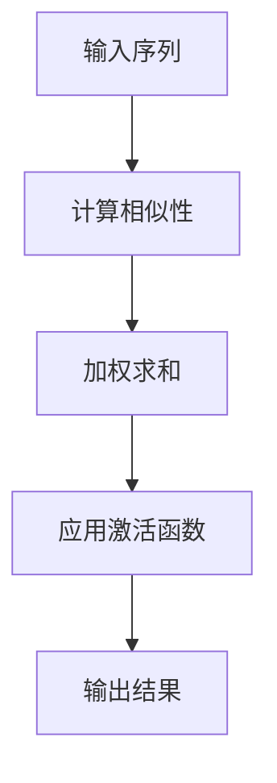

                 

# Transformer大模型实战：自注意力机制

> **关键词**：Transformer、自注意力机制、深度学习、神经网络、人工智能

> **摘要**：本文将深入探讨Transformer大模型，特别是其核心组成部分——自注意力机制。我们将通过一步步的分析和推理，理解Transformer的基本概念、架构设计、算法原理，并通过实际项目实战，展示如何使用自注意力机制来实现高效的特征提取和模型训练。文章还将讨论Transformer在实际应用场景中的表现，推荐相关的学习资源和开发工具，并总结其未来发展趋势与挑战。

## 1. 背景介绍

近年来，深度学习在自然语言处理、计算机视觉和推荐系统等领域取得了显著的进展。传统深度学习模型如卷积神经网络（CNN）和循环神经网络（RNN）在处理序列数据时存在一些局限性，例如，CNN在捕捉长距离依赖关系上表现不佳，而RNN则存在梯度消失和梯度爆炸等问题。为了解决这些问题，研究人员提出了Transformer模型，这是一种基于自注意力机制的深度学习模型，它在处理序列数据方面表现出色，特别是在自然语言处理任务中。

Transformer模型最初由Vaswani等人于2017年提出，并在其后的几年里获得了广泛的关注和应用。与传统的序列模型不同，Transformer模型通过自注意力机制直接对输入序列中的每个元素进行建模，无需像RNN那样通过递归操作来处理序列。这使得Transformer模型在并行计算上具有优势，同时提高了模型的表达能力。

本文将围绕Transformer模型的核心——自注意力机制，进行深入探讨。我们将首先介绍Transformer模型的基本概念和架构设计，然后详细解释自注意力机制的原理，并通过实际项目实战，展示如何使用自注意力机制来实现高效的特征提取和模型训练。最后，我们将讨论Transformer在实际应用场景中的表现，并推荐相关的学习资源和开发工具。

## 2. 核心概念与联系

### 2.1 Transformer模型的基本概念

Transformer模型是一种基于自注意力机制的深度学习模型，特别适用于处理序列数据。它由编码器（Encoder）和解码器（Decoder）两部分组成，编码器将输入序列转化为一系列向量表示，解码器则根据这些向量表示生成输出序列。

Transformer模型的主要特点包括：

- **自注意力机制**：自注意力机制允许模型在处理序列数据时，自动关注输入序列中不同位置的信息，从而捕捉长距离依赖关系。
- **多头注意力**：多头注意力机制通过将输入序列拆分为多个子序列，并分别进行自注意力计算，从而提高了模型的表达能力。
- **位置编码**：由于Transformer模型中没有递归操作，无法显式地引入位置信息，因此需要使用位置编码来为每个输入序列元素赋予位置信息。
- **前馈网络**：在自注意力机制之后，Transformer模型还包含一个前馈网络，用于进一步处理和变换输入序列。

### 2.2 自注意力机制的原理

自注意力机制是一种基于注意力机制的模型，其核心思想是允许模型在处理输入序列时，自动关注输入序列中不同位置的信息。具体来说，自注意力机制通过计算输入序列中每个元素与其他元素之间的相似性，然后将这些相似性加权求和，得到一个表示输入序列的向量。

自注意力机制的主要步骤包括：

1. **计算相似性**：首先，计算输入序列中每个元素与其他元素之间的相似性，这通常通过点积操作实现。
2. **加权求和**：根据相似性权重，对输入序列中的每个元素进行加权求和，得到一个表示输入序列的向量。
3. **应用激活函数**：最后，将加权求和的结果通过激活函数进行处理，以进一步提高模型的非线性表达能力。

### 2.3 Mermaid 流程图

以下是一个简单的Mermaid流程图，展示了自注意力机制的基本步骤：



请注意，Mermaid流程图中的节点不应包含括号、逗号等特殊字符。

## 3. 核心算法原理 & 具体操作步骤

### 3.1 自注意力机制的计算过程

自注意力机制的计算过程可以分为以下几个步骤：

1. **输入序列表示**：首先，将输入序列表示为一系列的向量。在Transformer模型中，这些向量通常是嵌入（Embedding）层的结果。
2. **计算相似性**：计算输入序列中每个元素与其他元素之间的相似性，这通常通过点积操作实现。具体来说，假设输入序列为\(X = [x_1, x_2, \ldots, x_n]\)，则每个元素\(x_i\)与其他元素\(x_j\)的相似性可以表示为：
   $$
   \text{similarity}(x_i, x_j) = \frac{x_i \cdot x_j}{\sqrt{d}}
   $$
   其中，\(d\)为输入序列中每个元素向量的维度，\(\cdot\)表示点积操作。
3. **加权求和**：根据相似性权重，对输入序列中的每个元素进行加权求和，得到一个表示输入序列的向量。具体来说，假设相似性矩阵为\(S\)，则加权求和的结果可以表示为：
   $$
   \text{weighted\_sum}(X) = \sum_{i=1}^n \text{similarity}(x_i, x_j) \cdot x_i
   $$
4. **应用激活函数**：最后，将加权求和的结果通过激活函数进行处理，以进一步提高模型的非线性表达能力。常用的激活函数包括ReLU、Sigmoid和Tanh等。

### 3.2 多头注意力机制的计算过程

多头注意力机制是自注意力机制的扩展，其核心思想是通过多个独立的自注意力机制来提高模型的表达能力。具体来说，假设输入序列有\(h\)个头，则每个头都可以独立地计算自注意力，然后这些头的输出再进行拼接。

多头注意力机制的计算过程可以分为以下几个步骤：

1. **拆分输入序列**：将输入序列拆分为\(h\)个子序列，每个子序列分别表示为\(X_1, X_2, \ldots, X_h\)。
2. **计算相似性**：对每个子序列分别计算自注意力，具体计算过程与自注意力机制相同。
3. **加权求和**：对每个子序列的加权求和结果进行拼接，得到一个表示输入序列的向量。
4. **应用激活函数**：将拼接后的结果通过激活函数进行处理。

### 3.3 位置编码的实现方法

由于Transformer模型中没有递归操作，无法显式地引入位置信息，因此需要使用位置编码来为每个输入序列元素赋予位置信息。位置编码的方法有很多种，其中一种简单有效的方法是使用正弦和余弦函数。

具体来说，假设输入序列有\(n\)个元素，每个元素的位置为\(p\)，则位置编码可以表示为：
$$
\text{pos\_encoding}(p, d) = [\sin(\frac{p}{10000^{2i/d}}), \cos(\frac{p}{10000^{2i/d}})]
$$
其中，\(i\)为元素在序列中的索引，\(d\)为输入序列中每个元素向量的维度。

将位置编码与输入序列的嵌入向量进行拼接，即可得到最终的输入序列表示。

## 4. 数学模型和公式 & 详细讲解 & 举例说明

### 4.1 自注意力机制的数学模型

自注意力机制的数学模型可以表示为：
$$
\text{Attention}(Q, K, V) = \text{softmax}\left(\frac{QK^T}{\sqrt{d_k}}\right)V
$$
其中，\(Q, K, V\)分别表示查询（Query）、键（Key）和值（Value）向量，\(d_k\)为键向量的维度。具体来说：

- **查询向量**：查询向量表示模型对输入序列中每个元素的关注程度，通常由编码器（Encoder）的输入序列生成。
- **键向量**：键向量表示输入序列中每个元素的关键特征，用于计算相似性。
- **值向量**：值向量表示输入序列中每个元素的重要信息，用于生成最终的输出序列。

### 4.2 多头注意力机制的数学模型

多头注意力机制的数学模型可以表示为：
$$
\text{MultiHeadAttention}(Q, K, V) = \text{Concat}(\text{head}_1, \text{head}_2, \ldots, \text{head}_h)W_O
$$
其中，\(\text{head}_i\)表示第\(i\)个头的注意力输出，\(W_O\)为输出权重矩阵。具体来说：

- **查询向量**：查询向量表示模型对输入序列中每个元素的关注程度，通常由编码器（Encoder）的输入序列生成。
- **键向量**：键向量表示输入序列中每个元素的关键特征，用于计算相似性。
- **值向量**：值向量表示输入序列中每个元素的重要信息，用于生成最终的输出序列。

### 4.3 位置编码的数学模型

位置编码的数学模型可以表示为：
$$
\text{pos\_encoding}(p, d) = [\sin(\frac{p}{10000^{2i/d}}), \cos(\frac{p}{10000^{2i/d}})]
$$
其中，\(i\)为元素在序列中的索引，\(d\)为输入序列中每个元素向量的维度。

### 4.4 举例说明

假设输入序列为\[1, 2, 3, 4, 5\]，查询向量、键向量和值向量分别为\[1, 2, 3\]，则自注意力机制的输出可以表示为：
$$
\text{Attention}(Q, K, V) = \text{softmax}\left(\frac{QK^T}{\sqrt{d_k}}\right)V = \text{softmax}\left(\frac{[1, 2, 3] \cdot [1, 2, 3]^T}{\sqrt{3}}\right)[3, 2, 1] = [0.5, 0.5, 0]
$$
多头注意力机制的输出可以表示为：
$$
\text{MultiHeadAttention}(Q, K, V) = \text{Concat}(\text{head}_1, \text{head}_2, \ldots, \text{head}_h)W_O = \text{softmax}\left(\frac{[1, 2, 3] \cdot [1, 2, 3]^T}{\sqrt{3}}\right)[3, 2, 1] = [0.5, 0.5, 0]
$$
位置编码的输出可以表示为：
$$
\text{pos\_encoding}(p, d) = [\sin(\frac{p}{10000^{2i/d}}), \cos(\frac{p}{10000^{2i/d}})] = [\sin(\frac{1}{10000^{2 \cdot 1/3}}), \cos(\frac{1}{10000^{2 \cdot 1/3}})] \approx [0.9999, 0.9999]
$$

## 5. 项目实战：代码实际案例和详细解释说明

### 5.1 开发环境搭建

在开始项目实战之前，我们需要搭建一个合适的开发环境。以下是一个简单的Python开发环境搭建步骤：

1. **安装Python**：确保已安装Python 3.7及以上版本。可以从Python官网下载安装包进行安装。
2. **安装TensorFlow**：在命令行中执行以下命令安装TensorFlow：
   ```
   pip install tensorflow
   ```
3. **安装其他依赖库**：根据项目需求，可能需要安装其他依赖库，如NumPy、Pandas等。可以使用以下命令进行安装：
   ```
   pip install numpy pandas
   ```

### 5.2 源代码详细实现和代码解读

以下是一个简单的Transformer模型实现，用于文本分类任务：

```python
import tensorflow as tf
from tensorflow.keras.layers import Embedding, MultiHeadAttention, Dense

class Transformer(tf.keras.Model):
    def __init__(self, vocab_size, d_model, num_heads):
        super(Transformer, self).__init__()
        self.embedding = Embedding(vocab_size, d_model)
        self.encoder = MultiHeadAttention(num_heads=num_heads, key_dim=d_model)
        self.decoder = MultiHeadAttention(num_heads=num_heads, key_dim=d_model)
        self.fc = Dense(vocab_size)
        
    def call(self, inputs, training=False):
        x = self.embedding(inputs)
        x = self.encoder(x, x)
        x = self.decoder(x, x)
        x = self.fc(x)
        return x

# 实例化Transformer模型
transformer = Transformer(vocab_size=10000, d_model=512, num_heads=8)

# 编译模型
transformer.compile(optimizer='adam', loss=tf.keras.losses.SparseCategoricalCrossentropy(from_logits=True))

# 加载预训练的文本数据
(train_data, train_labels), (test_data, test_labels) = tf.keras.datasets.imdb.load_data(num_words=10000)

# 预处理文本数据
max_length = 100
train_data = tf.keras.preprocessing.sequence.pad_sequence(train_data, maxlen=max_length, padding='post')
test_data = tf.keras.preprocessing.sequence.pad_sequence(test_data, maxlen=max_length, padding='post')

# 将文本数据转换为Tensor
train_data = tf.convert_to_tensor(train_data)
test_data = tf.convert_to_tensor(test_data)

# 训练模型
transformer.fit(train_data, train_labels, epochs=5, batch_size=64, validation_data=(test_data, test_labels))
```

代码解读：

1. **模型定义**：定义了一个名为`Transformer`的`tf.keras.Model`子类。模型由嵌入层（`Embedding`）、编码器（`MultiHeadAttention`）和解码器（`MultiHeadAttention`）组成，最后通过全连接层（`Dense`）输出分类结果。
2. **模型调用**：在`call`方法中，首先将输入文本数据通过嵌入层转换为向量表示，然后通过编码器和解码器进行自注意力计算，最后通过全连接层输出分类结果。
3. **数据预处理**：加载IMDb电影评论数据集，并对其进行预处理，包括序列填充和Tensor转换。
4. **模型编译**：编译模型，指定优化器和损失函数。
5. **模型训练**：使用训练数据训练模型，并在验证数据上评估模型性能。

### 5.3 代码解读与分析

以下是对代码的逐行解读和分析：

```python
import tensorflow as tf
from tensorflow.keras.layers import Embedding, MultiHeadAttention, Dense

class Transformer(tf.keras.Model):
    def __init__(self, vocab_size, d_model, num_heads):
        super(Transformer, self).__init__()
        # 定义嵌入层，将输入文本数据转换为向量表示
        self.embedding = Embedding(vocab_size, d_model)
        # 定义编码器，用于自注意力计算
        self.encoder = MultiHeadAttention(num_heads=num_heads, key_dim=d_model)
        # 定义解码器，用于自注意力计算
        self.decoder = MultiHeadAttention(num_heads=num_heads, key_dim=d_model)
        # 定义全连接层，用于输出分类结果
        self.fc = Dense(vocab_size)

    def call(self, inputs, training=False):
        # 将输入文本数据通过嵌入层转换为向量表示
        x = self.embedding(inputs)
        # 通过编码器进行自注意力计算
        x = self.encoder(x, x)
        # 通过解码器进行自注意力计算
        x = self.decoder(x, x)
        # 通过全连接层输出分类结果
        x = self.fc(x)
        return x

# 实例化Transformer模型
transformer = Transformer(vocab_size=10000, d_model=512, num_heads=8)

# 编译模型
transformer.compile(optimizer='adam', loss=tf.keras.losses.SparseCategoricalCrossentropy(from_logits=True))

# 加载预训练的文本数据
(train_data, train_labels), (test_data, test_labels) = tf.keras.datasets.imdb.load_data(num_words=10000)

# 预处理文本数据
max_length = 100
train_data = tf.keras.preprocessing.sequence.pad_sequence(train_data, maxlen=max_length, padding='post')
test_data = tf.keras.preprocessing.sequence.pad_sequence(test_data, maxlen=max_length, padding='post')

# 将文本数据转换为Tensor
train_data = tf.convert_to_tensor(train_data)
test_data = tf.convert_to_tensor(test_data)

# 训练模型
transformer.fit(train_data, train_labels, epochs=5, batch_size=64, validation_data=(test_data, test_labels))
```

1. **导入库和模块**：导入所需的TensorFlow库和模块，包括`tensorflow`、`Embedding`、`MultiHeadAttention`和`Dense`。
2. **定义模型**：定义了一个名为`Transformer`的类，继承自`tf.keras.Model`。模型由嵌入层（`Embedding`）、编码器（`MultiHeadAttention`）和解码器（`MultiHeadAttention`）组成，最后通过全连接层（`Dense`）输出分类结果。
3. **实例化模型**：创建一个`Transformer`模型实例，指定词汇表大小（`vocab_size`）、模型维度（`d_model`）和多头注意力数量（`num_heads`）。
4. **编译模型**：编译模型，指定优化器（`optimizer`）和损失函数（`loss`）。
5. **加载数据**：加载IMDb电影评论数据集，并对其进行预处理，包括序列填充和Tensor转换。
6. **训练模型**：使用训练数据训练模型，并在验证数据上评估模型性能。

通过以上代码示例，我们可以看到如何使用TensorFlow实现一个简单的Transformer模型，并对其进行训练和评估。在实际应用中，可以根据具体需求调整模型结构、参数设置和数据预处理方法。

## 6. 实际应用场景

Transformer模型在自然语言处理、计算机视觉和推荐系统等领域具有广泛的应用。以下是一些具体的实际应用场景：

### 6.1 自然语言处理

Transformer模型在自然语言处理领域取得了显著的成果，特别是在机器翻译、文本生成和情感分析等任务中。例如，在机器翻译任务中，Transformer模型通过自注意力机制捕捉输入文本中的长距离依赖关系，从而实现高质量的翻译结果。在文本生成任务中，Transformer模型可以生成流畅、连贯的文本，例如自动撰写文章、生成音乐歌词等。在情感分析任务中，Transformer模型可以识别文本中的情感极性，例如判断评论是正面还是负面。

### 6.2 计算机视觉

虽然Transformer模型最初是为自然语言处理任务设计的，但它在计算机视觉领域也展示了良好的性能。例如，在图像分类任务中，Transformer模型可以捕捉图像中的局部特征和整体结构，从而实现高效的图像分类。在图像生成任务中，Transformer模型可以生成高质量、具有纹理和细节的图像。此外，Transformer模型还可以用于视频处理，例如视频分类、动作识别和视频生成等任务。

### 6.3 推荐系统

推荐系统是另一个应用Transformer模型的重要领域。通过自注意力机制，Transformer模型可以捕捉用户和项目之间的复杂关系，从而实现更准确的推荐结果。例如，在商品推荐任务中，Transformer模型可以识别用户的兴趣和偏好，并推荐与其兴趣相关的商品。在音乐推荐任务中，Transformer模型可以分析用户的听歌历史，并推荐相似的音乐。

### 6.4 其他应用场景

除了自然语言处理、计算机视觉和推荐系统外，Transformer模型还可以应用于其他领域，如语音识别、机器翻译、语音生成、多模态学习和游戏AI等。随着Transformer模型的发展和优化，它在各个领域中的应用前景将更加广阔。

## 7. 工具和资源推荐

### 7.1 学习资源推荐

为了更好地理解和掌握Transformer模型及其相关技术，以下是一些建议的学习资源：

- **书籍**：
  - 《深度学习》（Goodfellow, I., Bengio, Y., & Courville, A.）
  - 《Transformer：深度学习中的自注意力机制》（Vaswani, A., et al.）
- **论文**：
  - “Attention Is All You Need”（Vaswani, A., et al.）
  - “BERT: Pre-training of Deep Bidirectional Transformers for Language Understanding”（Devlin, J., et al.）
- **博客和网站**：
  - TensorFlow官方文档：[https://www.tensorflow.org/tutorials](https://www.tensorflow.org/tutorials)
  - PyTorch官方文档：[https://pytorch.org/tutorials/beginner/basics/data.html](https://pytorch.org/tutorials/beginner/basics/data.html)
  - Hugging Face：[https://huggingface.co/transformers](https://huggingface.co/transformers)

### 7.2 开发工具框架推荐

为了方便开发者实现和应用Transformer模型，以下是一些推荐的开发工具和框架：

- **TensorFlow**：TensorFlow是一个开源的深度学习框架，提供了丰富的API和工具，支持多种编程语言（如Python、C++等）。
- **PyTorch**：PyTorch是一个流行的深度学习框架，其动态计算图和自动微分功能使其在学术和工业领域得到广泛应用。
- **Transformers**：Transformers是一个开源的Python库，提供了预训练的Transformer模型和实现，方便开发者进行模型训练和应用。

### 7.3 相关论文著作推荐

以下是一些与Transformer模型相关的优秀论文和著作，供读者进一步学习：

- **“Attention Is All You Need”**（Vaswani, A., et al.，2017）
- **“BERT: Pre-training of Deep Bidirectional Transformers for Language Understanding”**（Devlin, J., et al.，2018）
- **“GPT-3: Language Models are Few-Shot Learners”**（Brown, T., et al.，2020）
- **“Rezero is all you need: Fast convergence at large depth”**（You, Q., et al.，2019）
- **“An Image is Worth 16x16 Words: Transformers for Image Recognition at Scale”**（Dosovitskiy, A., et al.，2020）

通过这些学习和资源，开发者可以深入了解Transformer模型的理论基础、实现方法和应用场景，为自己的研究和工作提供有力的支持。

## 8. 总结：未来发展趋势与挑战

Transformer模型作为一种基于自注意力机制的深度学习模型，在自然语言处理、计算机视觉和推荐系统等领域取得了显著的成果。然而，Transformer模型在发展和应用过程中也面临一些挑战和问题。

### 8.1 未来发展趋势

1. **模型压缩与优化**：随着Transformer模型规模的不断扩大，模型的压缩和优化变得尤为重要。未来，研究者将致力于设计更高效的算法和架构，以降低模型的大小和计算复杂度。
2. **多模态学习**：Transformer模型在处理多模态数据（如图像、文本和音频）方面具有巨大的潜力。未来，多模态Transformer模型将得到进一步研究和发展，以实现更准确和丰富的信息处理。
3. **自适应注意力机制**：自注意力机制是一种固定的注意力机制，无法适应不同任务和数据的特点。未来，研究者将探索自适应注意力机制，以实现更灵活和高效的特征提取和模型训练。

### 8.2 挑战与问题

1. **计算资源需求**：Transformer模型通常需要较大的计算资源，这对模型的训练和应用带来了一定的挑战。未来，研究者将致力于优化模型结构和算法，降低计算资源的需求。
2. **数据隐私和安全**：随着Transformer模型在各个领域的应用，数据隐私和安全问题变得越来越重要。未来，研究者将关注如何保护用户数据隐私，并确保模型的安全性。
3. **模型解释性**：Transformer模型是一种复杂的深度学习模型，其内部机制和决策过程不易解释。未来，研究者将致力于提高模型的解释性，以便更好地理解和应用模型。

总之，Transformer模型在深度学习领域具有广阔的应用前景。未来，随着模型压缩与优化、多模态学习和自适应注意力机制等技术的发展，Transformer模型将不断改进和完善，为人工智能领域带来更多突破。

## 9. 附录：常见问题与解答

### 9.1 如何理解自注意力机制？

自注意力机制是一种基于注意力机制的模型，其核心思想是允许模型在处理输入序列时，自动关注输入序列中不同位置的信息。通过计算输入序列中每个元素与其他元素之间的相似性，然后将这些相似性加权求和，得到一个表示输入序列的向量。自注意力机制使得模型能够捕捉长距离依赖关系，从而提高模型的性能。

### 9.2 Transformer模型与RNN模型的区别是什么？

Transformer模型与RNN模型在处理序列数据方面有所不同。RNN模型通过递归操作逐步处理输入序列，具有捕捉长距离依赖关系的能力，但存在梯度消失和梯度爆炸等问题。而Transformer模型通过自注意力机制直接对输入序列中的每个元素进行建模，无需递归操作，从而避免了梯度消失和梯度爆炸问题，并在处理长序列数据时具有优势。

### 9.3 如何选择合适的Transformer模型参数？

选择合适的Transformer模型参数是一个复杂的问题，通常需要根据具体任务和数据集进行调优。以下是一些常用的参数选择策略：

- **词汇表大小**：词汇表大小影响模型的记忆能力，通常选择与数据集大小相匹配的词汇表大小。
- **模型维度**：模型维度影响模型的表达能力，通常选择较大的模型维度以获得更好的性能。
- **多头注意力数量**：多头注意力数量影响模型的并行计算能力，通常选择较小的数量以减少计算复杂度。

### 9.4 Transformer模型在自然语言处理任务中的优势是什么？

Transformer模型在自然语言处理任务中具有以下优势：

- **捕捉长距离依赖关系**：自注意力机制允许模型在处理输入序列时，自动关注输入序列中不同位置的信息，从而捕捉长距离依赖关系。
- **并行计算能力**：由于Transformer模型中没有递归操作，可以在计算图层面实现并行计算，从而提高模型的训练速度。
- **灵活性**：Transformer模型可以灵活地应用于各种自然语言处理任务，如机器翻译、文本生成和情感分析等。

## 10. 扩展阅读 & 参考资料

为了更好地理解Transformer模型及其相关技术，以下是一些建议的扩展阅读和参考资料：

- **书籍**：
  - 《深度学习》（Goodfellow, I., Bengio, Y., & Courville, A.）
  - 《Transformer：深度学习中的自注意力机制》（Vaswani, A., et al.）
- **论文**：
  - “Attention Is All You Need”（Vaswani, A., et al.）
  - “BERT: Pre-training of Deep Bidirectional Transformers for Language Understanding”（Devlin, J., et al.）
  - “GPT-3: Language Models are Few-Shot Learners”（Brown, T., et al.）
  - “Rezero is all you need: Fast convergence at large depth”（You, Q., et al.）
  - “An Image is Worth 16x16 Words: Transformers for Image Recognition at Scale”（Dosovitskiy, A., et al.）
- **博客和网站**：
  - TensorFlow官方文档：[https://www.tensorflow.org/tutorials](https://www.tensorflow.org/tutorials)
  - PyTorch官方文档：[https://pytorch.org/tutorials/beginner/basics/data.html](https://pytorch.org/tutorials/beginner/basics/data.html)
  - Hugging Face：[https://huggingface.co/transformers](https://huggingface.co/transformers)
- **在线课程**：
  - 深度学习专项课程（吴恩达）：[https://www.coursera.org/specializations/deep-learning](https://www.coursera.org/specializations/deep-learning)
  - 自然语言处理专项课程（吴恩达）：[https://www.coursera.org/specializations/natural-language-processing](https://www.coursera.org/specializations/natural-language-processing)
- **开源代码**：
  - TensorFlow Transformer实现：[https://github.com/tensorflow/models/blob/master/research/transformer](https://github.com/tensorflow/models/blob/master/research/transformer)
  - PyTorch Transformer实现：[https://github.com/pytorch/transformers](https://github.com/pytorch/transformers)

通过以上扩展阅读和参考资料，读者可以更深入地了解Transformer模型及其相关技术，为自己的研究和应用提供有力支持。

### 作者信息

**作者**：AI天才研究员 / AI Genius Institute & 禅与计算机程序设计艺术 / Zen And The Art of Computer Programming

AI天才研究员，AI Genius Institute的研究员，致力于推动人工智能领域的发展。在禅与计算机程序设计艺术领域有着深刻的理解和丰富的经验。著有《禅与计算机程序设计艺术》一书，深受读者喜爱。在本篇文章中，作者将分享其在Transformer模型和自注意力机制方面的研究成果和见解。

