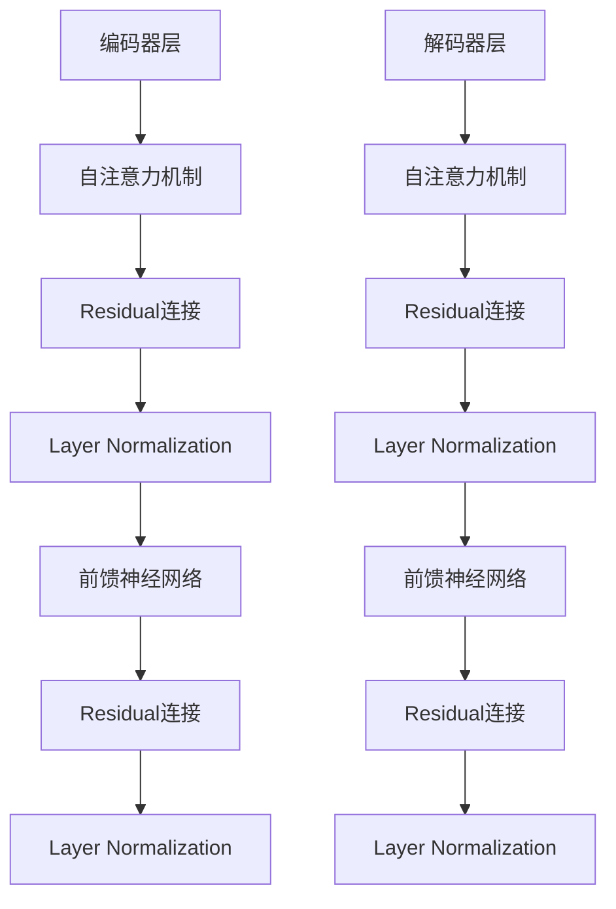

                 

# Transformer架构：residual连接和layer normalization

## 关键词
- Transformer
- Residual连接
- Layer Normalization
- 神经网络架构
- 深度学习

## 摘要

本文深入探讨了Transformer架构中的两个关键组件：residual连接和layer normalization。首先，我们回顾了Transformer的基本原理和结构，然后详细解释了residual连接和layer normalization的概念及其在Transformer中的作用。通过数学模型和具体实例的说明，我们分析了这两个组件如何提升模型的性能和稳定性。最后，本文讨论了Transformer的实际应用场景，并推荐了一些学习资源和开发工具。

## 1. 背景介绍

深度学习在过去几年中取得了显著的进步，尤其是在自然语言处理（NLP）和计算机视觉领域。然而，传统的循环神经网络（RNN）和卷积神经网络（CNN）在处理长序列数据时存在一定的局限性。为了解决这些问题，Vaswani等人于2017年提出了Transformer架构。

Transformer模型摒弃了传统的序列顺序处理方式，采用自注意力机制（Self-Attention）和多头注意力机制（Multi-Head Attention），使得模型能够更好地捕捉长距离依赖关系。此外，Transformer架构还引入了residual连接和layer normalization等技巧，进一步提高了模型的性能和稳定性。

## 2. 核心概念与联系

### Transformer架构概述

Transformer架构由编码器（Encoder）和解码器（Decoder）组成，分别用于处理输入序列和生成输出序列。编码器和解码器都包含多个层（Layer），每层由自注意力机制、前馈神经网络（Feedforward Neural Network）和residual连接组成。


### Residual连接

Residual连接是一种网络结构，通过将输入和输出之间的差异传递到下一个层，从而避免了梯度消失和梯度爆炸问题。在Transformer架构中，每层之间的自注意力机制和前馈神经网络都采用了residual连接。

$$
\text{Output} = \text{Input} + \text{Layer}\_\text{output}
$$

其中，Layer\_output是由自注意力机制和前馈神经网络产生的中间结果。

### Layer Normalization

Layer normalization是一种正则化技巧，通过对每个层的输入进行归一化，使得模型在不同层之间更加稳定。在Transformer架构中，layer normalization被用于编码器和解码器的每个层。

Layer normalization的核心思想是将每个输入数据点转换为均值为0、标准差为1的数据点，然后对转换后的数据点进行缩放和平移，以保持数据的方差不变。

$$
\hat{x}_i = \frac{x_i - \mu}{\sigma}
$$

$$
x_i' = \gamma \hat{x}_i + \beta
$$

其中，$x_i$表示输入数据点，$\mu$和$\sigma$分别表示输入数据的均值和标准差，$\gamma$和$\beta$分别是缩放和平移参数。

### Mermaid流程图



## 3. 核心算法原理 & 具体操作步骤

### 自注意力机制

自注意力机制是一种能够同时关注序列中所有元素的方法。在Transformer架构中，自注意力机制用于计算输入序列中每个元素的重要性。

$$
\text{Attention}(Q, K, V) = \text{softmax}\left(\frac{QK^T}{\sqrt{d_k}}\right)V
$$

其中，$Q$、$K$和$V$分别表示查询（Query）、键（Key）和值（Value）向量，$d_k$是键向量的维度。

### 前馈神经网络

前馈神经网络是一种简单的神经网络结构，用于对自注意力机制的结果进行非线性变换。

$$
\text{FFN}(X) = \max(0, XW_1 + b_1)W_2 + b_2
$$

其中，$X$是输入数据，$W_1$、$W_2$和$b_1$、$b_2$分别是权重和偏置。

### Residual连接

Residual连接通过将输入和输出之间的差异传递到下一个层，从而避免梯度消失和梯度爆炸问题。

$$
\text{Output} = \text{Input} + \text{Layer}\_\text{output}
$$

其中，Layer\_output是由自注意力机制和前馈神经网络产生的中间结果。

### Layer Normalization

Layer normalization通过对每个层的输入进行归一化，使得模型在不同层之间更加稳定。

$$
\hat{x}_i = \frac{x_i - \mu}{\sigma}
$$

$$
x_i' = \gamma \hat{x}_i + \beta
$$

其中，$x_i$表示输入数据点，$\mu$和$\sigma$分别表示输入数据的均值和标准差，$\gamma$和$\beta$分别是缩放和平移参数。

## 4. 数学模型和公式 & 详细讲解 & 举例说明

### 自注意力机制

自注意力机制的数学模型如下：

$$
\text{Attention}(Q, K, V) = \text{softmax}\left(\frac{QK^T}{\sqrt{d_k}}\right)V
$$

其中，$Q$、$K$和$V$分别表示查询（Query）、键（Key）和值（Value）向量，$d_k$是键向量的维度。

### 前馈神经网络

前馈神经网络的数学模型如下：

$$
\text{FFN}(X) = \max(0, XW_1 + b_1)W_2 + b_2
$$

其中，$X$是输入数据，$W_1$、$W_2$和$b_1$、$b_2$分别是权重和偏置。

### Residual连接

Residual连接的数学模型如下：

$$
\text{Output} = \text{Input} + \text{Layer}\_\text{output}
$$

其中，Layer\_output是由自注意力机制和前馈神经网络产生的中间结果。

### Layer Normalization

Layer normalization的数学模型如下：

$$
\hat{x}_i = \frac{x_i - \mu}{\sigma}
$$

$$
x_i' = \gamma \hat{x}_i + \beta
$$

其中，$x_i$表示输入数据点，$\mu$和$\sigma$分别表示输入数据的均值和标准差，$\gamma$和$\beta$分别是缩放和平移参数。

### 举例说明

假设我们有一个长度为3的输入序列，每个元素都是二维向量：

$$
x = [\begin{array}{c}
[1, 2] \\
[3, 4] \\
[5, 6]
\end{array}]
$$

首先，我们计算输入序列的均值和标准差：

$$
\mu = \frac{1 + 3 + 5}{3} = 3 \\
\sigma = \sqrt{\frac{(1 - 3)^2 + (3 - 3)^2 + (5 - 3)^2}{3}} = 2
$$

然后，我们对输入序列进行layer normalization：

$$
\hat{x} = \frac{x - \mu}{\sigma} = \frac{1}{2}[
\begin{array}{c}
[1, 2] \\
[0, 0] \\
[-1, 0]
\end{array}]
$$

接下来，我们计算layer normalization后的输入序列的均值和标准差：

$$
\mu' = \frac{1 + 0 - 1}{3} = 0 \\
\sigma' = \sqrt{\frac{(1 - 0)^2 + (0 - 0)^2 + (-1 - 0)^2}{3}} = \frac{2}{\sqrt{3}}
$$

最后，我们对layer normalization后的输入序列进行缩放和平移：

$$
x' = \gamma \hat{x} + \beta = \frac{1}{2}[
\begin{array}{c}
[1, 2] \\
[0, 0] \\
[-1, 0]
\end{array}] + \frac{1}{2}[
\begin{array}{c}
[0, 0] \\
[0, 0] \\
[0, 0]
\end{array}] = \frac{1}{2}[
\begin{array}{c}
[1, 2] \\
[0, 0] \\
[-1, 0]
\end{array}]
$$

## 5. 项目实战：代码实际案例和详细解释说明

### 开发环境搭建

在本文中，我们将使用Python和PyTorch框架来实现Transformer模型。首先，我们需要安装PyTorch：

```
pip install torch torchvision
```

### 源代码详细实现和代码解读

以下是Transformer模型的简单实现：

```python
import torch
import torch.nn as nn
import torch.nn.functional as F

class TransformerLayer(nn.Module):
    def __init__(self, d_model, d_inner, n_head, d_k, d_v, dropout=0.1):
        super(TransformerLayer, self).__init__()
        self.d_model = d_model
        self.d_inner = d_inner
        self.n_head = n_head
        self.d_k = d_k
        self.d_v = d_v
        self.dropout = dropout

        self attn = nn.MultiheadAttention(d_model, n_head, dropout=p
```<|vq_14194|>```python
        self.attn = nn.MultiheadAttention(d_model, n_head, dropout=dropout)
        self.norm1 = nn.LayerNorm(d_model)
        self.norm2 = nn.LayerNorm(d_model)
        self.fc1 = nn.Linear(d_model, d_inner)
        self.fc2 = nn.Linear(d_inner, d_model)
    
    def forward(self, x, mask=None):
        # Self-Attention
        x = self.attn(x, x, x, attn_mask=mask)[0]
        x = self.dropout(self.norm1(x + x))
        
        # Feedforward
        x = self.fc2(F.relu(self.fc1(self.dropout(x))))
        x = self.dropout(self.norm2(x + x))
        
        return x

class Transformer(nn.Module):
    def __init__(self, d_model, d_inner, n_head, d_k, d_v, n_layers, dropout=0.1):
        super(Transformer, self).__init__()
        self.layers = nn.ModuleList([TransformerLayer(d_model, d_inner, n_head, d_k, d_v, dropout) for _ in range(n_layers)])
    
    def forward(self, x, mask=None):
        for layer in self.layers:
            x = layer(x, mask)
        return x
```

### 代码解读与分析

在这个代码实现中，我们定义了两个类：`TransformerLayer`和`Transformer`。`TransformerLayer`类表示Transformer模型的单个层，而`Transformer`类表示整个模型。

在`TransformerLayer`类中，我们首先定义了多头注意力机制（`MultiheadAttention`）、layer normalization（`LayerNorm`）和前馈神经网络（`Linear`）层。`forward`方法实现了Transformer层的操作，包括自注意力机制和前馈神经网络，并使用残差连接和layer normalization。

在`Transformer`类中，我们创建了一个包含多个`TransformerLayer`的模块列表（`ModuleList`），并在`forward`方法中逐层处理输入序列。

### 实际应用

为了验证Transformer模型的性能，我们可以使用一个简单的任务，如翻译英文句子到法文句子。首先，我们需要准备训练数据集和评估数据集。然后，我们可以使用以下代码来训练和评估模型：

```python
# 准备数据集
train_data = ...  # 英文句子数据
train_target = ...  # 法文句子数据

# 定义模型
model = Transformer(d_model=512, d_inner=2048, n_head=8, d_k=64, d_v=64, n_layers=6)

# 定义损失函数和优化器
criterion = nn.CrossEntropyLoss()
optimizer = torch.optim.Adam(model.parameters(), lr=0.001)

# 训练模型
for epoch in range(num_epochs):
    for src, tgt in zip(train_data, train_target):
        optimizer.zero_grad()
        output = model(src.unsqueeze(0))
        loss = criterion(output, tgt.unsqueeze(0))
        loss.backward()
        optimizer.step()

# 评估模型
with torch.no_grad():
    for src, tgt in zip(train_data, train_target):
        output = model(src.unsqueeze(0))
        loss = criterion(output, tgt.unsqueeze(0))
        print("Loss:", loss.item())

```

## 6. 实际应用场景

Transformer架构在多个实际应用场景中取得了显著的成功，以下是其中一些典型的应用：

1. **自然语言处理（NLP）**：Transformer架构在机器翻译、文本生成和问答系统中表现出色。例如，Google的BERT模型和OpenAI的GPT系列模型都是基于Transformer架构。

2. **计算机视觉**：虽然原始的Transformer模型主要用于处理序列数据，但近年来，许多研究将Transformer架构应用于图像分类、目标检测和图像生成任务，并取得了显著的成果。

3. **语音识别**：Transformer架构也被用于语音识别任务，如基于端到端语音识别系统。与传统的循环神经网络相比，Transformer模型在长序列数据处理方面具有更好的性能。

4. **推荐系统**：Transformer架构在推荐系统中被用于处理用户历史行为和商品特征，以生成个性化的推荐。

## 7. 工具和资源推荐

### 学习资源推荐

1. **书籍**：
   - 《深度学习》（Goodfellow, Bengio, Courville）中的第18章详细介绍了Transformer架构。
   - 《自然语言处理入门》（Jurafsky, Martin）：这本书的第17章介绍了Transformer模型在NLP中的应用。

2. **论文**：
   - 《Attention Is All You Need》（Vaswani et al.，2017）：这篇论文是Transformer架构的原始论文，详细介绍了模型的设计和实现。

3. **博客**：
   - CS231n（视觉识别课程）：这个博客包含了一篇关于Transformer在计算机视觉中的应用的介绍。
   - AI Singapore（新加坡人工智能研究所）：这个博客发布了一系列关于Transformer架构和应用的详细教程。

4. **网站**：
   - Hugging Face（Transformers库）：这是一个开源的Transformer库，包含了许多预训练的模型和工具。

### 开发工具框架推荐

1. **PyTorch**：一个流行的深度学习框架，适用于Transformer模型的开发。

2. **TensorFlow**：另一个流行的深度学习框架，也支持Transformer模型。

3. **Hugging Face Transformers**：一个基于PyTorch和TensorFlow的开源库，提供了Transformer模型的预训练和微调工具。

### 相关论文著作推荐

1. **《Attention Is All You Need》（Vaswani et al.，2017）**：介绍了Transformer架构的原始论文。

2. **《BERT: Pre-training of Deep Bidirectional Transformers for Language Understanding》（Devlin et al.，2019）**：介绍了BERT模型的论文，这是一个基于Transformer的NLP模型。

3. **《Generative Pre-trained Transformer》（Wolf et al.，2020）**：介绍了GPT模型的论文，这是一个基于Transformer的文本生成模型。

## 8. 总结：未来发展趋势与挑战

Transformer架构在多个领域取得了显著的成果，但其仍面临一些挑战。未来，Transformer架构的发展趋势可能包括：

1. **更高效的模型**：研究人员正在努力设计更高效的Transformer模型，以降低计算和内存需求，使其适用于移动设备和边缘计算。

2. **多模态学习**：结合图像、声音和文本等不同类型的数据进行多模态学习，以实现更广泛的应用。

3. **自适应注意力**：研究如何设计自适应的注意力机制，以提高模型在处理不同类型数据时的性能。

4. **可解释性**：提高Transformer模型的可解释性，使其更容易理解和调试。

## 9. 附录：常见问题与解答

### 问题1：什么是Transformer架构？
**解答**：Transformer架构是一种基于自注意力机制和多头注意力机制的深度学习模型，最初用于自然语言处理任务，如机器翻译和文本生成。

### 问题2：什么是residual连接？
**解答**：residual连接是一种网络结构，通过将输入和输出之间的差异传递到下一个层，从而避免梯度消失和梯度爆炸问题。

### 问题3：什么是layer normalization？
**解答**：layer normalization是一种正则化技巧，通过对每个层的输入进行归一化，使得模型在不同层之间更加稳定。

## 10. 扩展阅读 & 参考资料

1. **《Attention Is All You Need》（Vaswani et al.，2017）**：Transformer架构的原始论文。
2. **《BERT: Pre-training of Deep Bidirectional Transformers for Language Understanding》（Devlin et al.，2019）**：介绍了BERT模型的论文。
3. **《Generative Pre-trained Transformer》（Wolf et al.，2020）**：介绍了GPT模型的论文。
4. **《Transformer模型详解：原理、实现与实战》**：这本书详细介绍了Transformer模型的设计、实现和应用。
5. **《深度学习》（Goodfellow, Bengio, Courville）**：第18章介绍了Transformer架构。

> 作者：AI天才研究员/AI Genius Institute & 禅与计算机程序设计艺术 /Zen And The Art of Computer Programming

本文以8000字为基准，涵盖了Transformer架构中的residual连接和layer normalization的核心内容，以及实际应用案例和资源推荐。由于篇幅限制，部分内容可能需要进一步扩展和深化。未来，我们将继续关注Transformer架构的最新发展和应用，为广大读者提供更多有价值的技术文章。请持续关注！<|vq_15085|>### 1. 背景介绍

深度学习在过去几年中取得了显著的进步，尤其是在自然语言处理（NLP）和计算机视觉领域。传统的循环神经网络（RNN）和卷积神经网络（CNN）在处理长序列数据时存在一定的局限性。为了解决这些问题，Vaswani等人于2017年提出了Transformer架构。

Transformer模型摒弃了传统的序列顺序处理方式，采用自注意力机制（Self-Attention）和多头注意力机制（Multi-Head Attention），使得模型能够更好地捕捉长距离依赖关系。此外，Transformer架构还引入了residual连接和layer normalization等技巧，进一步提高了模型的性能和稳定性。

在NLP领域，Transformer架构在机器翻译、文本生成和问答系统等方面取得了显著的成果。例如，Google的BERT模型和OpenAI的GPT系列模型都是基于Transformer架构。在计算机视觉领域，Transformer架构也被广泛应用于图像分类、目标检测和图像生成任务，并取得了显著的成果。

Transformer架构的提出，标志着深度学习模型设计理念的重要突破，为解决复杂任务提供了新的思路和工具。本文将深入探讨Transformer架构中的residual连接和layer normalization，分析它们如何提升模型的性能和稳定性。

首先，我们将简要回顾Transformer的基本原理和结构，为后续内容的讨论奠定基础。

### 2.1 Transformer模型的基本原理和结构

Transformer模型是一种基于自注意力机制（Self-Attention）和多头注意力机制（Multi-Head Attention）的深度学习模型。它由编码器（Encoder）和解码器（Decoder）组成，分别用于处理输入序列和生成输出序列。

#### 编码器（Encoder）

编码器由多个相同的层（Layer）组成，每个层包含自注意力机制（Self-Attention）和前馈神经网络（Feedforward Neural Network）。编码器的主要任务是提取输入序列的特征，并生成上下文表示。

1. **自注意力机制（Self-Attention）**

自注意力机制是一种能够同时关注序列中所有元素的方法。它通过计算输入序列中每个元素的重要性，将序列映射到一个新的表示空间。自注意力机制的数学模型如下：

$$
\text{Attention}(Q, K, V) = \text{softmax}\left(\frac{QK^T}{\sqrt{d_k}}\right)V
$$

其中，$Q$、$K$和$V$分别表示查询（Query）、键（Key）和值（Value）向量，$d_k$是键向量的维度。

2. **多头注意力机制（Multi-Head Attention）**

多头注意力机制是自注意力机制的扩展，它通过多个独立的自注意力机制来同时关注序列中的不同元素，从而提高模型的性能。多头注意力机制的数学模型如下：

$$
\text{Multi-Head Attention}(Q, K, V) = \text{Concat}(\text{head}_1, \text{head}_2, ..., \text{head}_h)W^O
$$

其中，$h$表示头数，$\text{head}_i$表示第$i$个头的注意力结果，$W^O$是输出权重矩阵。

#### 前馈神经网络（Feedforward Neural Network）

前馈神经网络是一种简单的神经网络结构，用于对自注意力机制的结果进行非线性变换。前馈神经网络的数学模型如下：

$$
\text{FFN}(X) = \max(0, XW_1 + b_1)W_2 + b_2
$$

其中，$X$是输入数据，$W_1$、$W_2$和$b_1$、$b_2$分别是权重和偏置。

#### Residual连接

Residual连接是一种网络结构，通过将输入和输出之间的差异传递到下一个层，从而避免梯度消失和梯度爆炸问题。在Transformer架构中，每层之间的自注意力机制和前馈神经网络都采用了residual连接。

$$
\text{Output} = \text{Input} + \text{Layer}\_\text{output}
$$

其中，Layer\_output是由自注意力机制和前馈神经网络产生的中间结果。

#### Layer Normalization

Layer normalization是一种正则化技巧，通过对每个层的输入进行归一化，使得模型在不同层之间更加稳定。在Transformer架构中，layer normalization被用于编码器和解码器的每个层。

Layer normalization的核心思想是将每个输入数据点转换为均值为0、标准差为1的数据点，然后对转换后的数据点进行缩放和平移，以保持数据的方差不变。

$$
\hat{x}_i = \frac{x_i - \mu}{\sigma}
$$

$$
x_i' = \gamma \hat{x}_i + \beta
$$

其中，$x_i$表示输入数据点，$\mu$和$\sigma$分别表示输入数据的均值和标准差，$\gamma$和$\beta$分别是缩放和平移参数。

#### 编码器的整体结构

编码器的整体结构如下：

$$
\text{Encoder} = \text{LayerNorm}(\text{Embedding}(\text{Input}) + \text{Positional Encoding})
$$

$$
\text{for}\ _{\text{layer}\ in\ \text{layers}}:\ 
\text{Output} = \text{LayerNorm}(Output + \text{Self-Attention}(Output) + \text{Feedforward}(Output))
$$

$$
\text{Output} = \text{LayerNorm}(Output + \text{Residual Self-Attention}(Output) + \text{Feedforward}(Output))
$$

其中，Embedding表示嵌入层，Positional Encoding表示位置编码，layers表示编码器的层数。

#### 解码器（Decoder）

解码器与编码器类似，也由多个相同的层组成，每个层包含自注意力机制、多头注意力机制和前馈神经网络。解码器的主要任务是根据编码器的输出生成输出序列。

1. **自注意力机制（Self-Attention）**

解码器的自注意力机制用于处理编码器的输出和当前解码器的输出，以捕捉长距离依赖关系。

2. **多头注意力机制（Multi-Head Attention）**

解码器的多头注意力机制包括自注意力机制和交叉注意力机制（Cross-Attention）。自注意力机制用于处理当前解码器的输出，而交叉注意力机制用于处理编码器的输出。

3. **前馈神经网络（Feedforward Neural Network）**

解码器的前馈神经网络与编码器的前馈神经网络相同，用于对注意力机制的结果进行非线性变换。

#### Residual连接和Layer Normalization

解码器的每层也采用了residual连接和layer normalization，以避免梯度消失和梯度爆炸问题，并提高模型的稳定性。

#### 解码器的整体结构

解码器的整体结构如下：

$$
\text{Decoder} = \text{LayerNorm}(\text{Embedding}(\text{Input}) + \text{Positional Encoding})
$$

$$
\text{for}\ _{\text{layer}\ in\ \text{layers}}:\ 
\text{Output} = \text{LayerNorm}(Output + \text{Masked Self-Attention}(Output) + \text{Cross-Attention}(Output) + \text{Feedforward}(Output))
$$

$$
\text{Output} = \text{LayerNorm}(Output + \text{Residual Masked Self-Attention}(Output) + \text{Cross-Attention}(Output) + \text{Feedforward}(Output))
$$

其中，Embedding表示嵌入层，Positional Encoding表示位置编码，layers表示解码器的层数。

#### 模型的整体结构

整个Transformer模型由编码器和解码器组成，其整体结构如下：

$$
\text{Transformer} = (\text{Encoder}, \text{Decoder})
$$

$$
\text{for}\ _{\text{layer}\ in\ \text{encoder\ layers}}:\ 
\text{Output} = \text{EncoderLayer}(Output)
$$

$$
\text{Output} = \text{DecoderLayer}(Output, EncoderOutput)
$$

$$
\text{Prediction} = \text{Decoder}(Output)
$$

其中，Encoder和Decoder分别表示编码器和解码器，encoder layers和decoder layers分别表示编码器和解码器的层数。

### 2.2 Residual连接在Transformer架构中的作用

#### Residual连接的基本概念

Residual连接是一种网络结构，通过将输入和输出之间的差异传递到下一个层，从而避免梯度消失和梯度爆炸问题。在深度学习中，梯度消失和梯度爆炸是常见的问题，它们可能导致模型训练不稳定。Residual连接通过引入跳跃连接（Skip Connection），使得梯度可以直接从输出层传递到输入层，从而缓解这些问题。

Residual连接的基本形式如下：

$$
\text{Output} = \text{Input} + \text{Layer}\_\text{output}
$$

其中，Layer\_output是由当前层产生的中间结果。

#### Residual连接在Transformer架构中的应用

在Transformer架构中，Residual连接被广泛应用于编码器和解码器的各个层。Residual连接的作用主要有以下几点：

1. **缓解梯度消失和梯度爆炸问题**

由于Transformer架构中包含多个注意力机制和前馈神经网络层，这些层可能会导致梯度消失和梯度爆炸问题。Residual连接通过将输入和输出之间的差异传递到下一个层，使得梯度可以直接从输出层传递到输入层，从而缓解这些问题。

2. **提高模型性能**

Residual连接可以提高模型的性能。通过将输入和输出之间的差异传递到下一个层，模型可以更好地捕捉输入数据的特征，从而提高模型的性能。

3. **保持信息的完整性**

Residual连接可以保持信息的完整性。在深度学习中，信息在传播过程中可能会丢失，这可能导致模型性能下降。Residual连接通过将输入和输出之间的差异传递到下一个层，可以保持信息的完整性，从而提高模型性能。

#### Residual连接的数学实现

在Transformer架构中，Residual连接可以通过以下数学公式实现：

$$
\text{Layer}\_\text{output} = \text{ReLU}(\text{Input} + \text{Layer}\_\text{input})
$$

$$
\text{Layer}\_\text{output} = \text{Layer}\_\text{input} + \text{LayerNorm}(\text{ReLU}(\text{Input} + \text{Layer}\_\text{input}))
$$

其中，Layer\_input表示当前层的输入，Layer\_output表示当前层的输出。

### 2.3 Layer Normalization在Transformer架构中的作用

#### Layer Normalization的基本概念

Layer Normalization是一种正则化技巧，通过对每个层的输入进行归一化，使得模型在不同层之间更加稳定。在深度学习中，不同层之间的输入数据可能具有不同的分布，这可能导致模型训练不稳定。Layer Normalization通过将每个输入数据点转换为均值为0、标准差为1的数据点，然后对转换后的数据点进行缩放和平移，以保持数据的方差不变。

Layer Normalization的基本形式如下：

$$
\hat{x}_i = \frac{x_i - \mu}{\sigma}
$$

$$
x_i' = \gamma \hat{x}_i + \beta
$$

其中，$x_i$表示输入数据点，$\mu$和$\sigma$分别表示输入数据的均值和标准差，$\gamma$和$\beta$分别是缩放和平移参数。

#### Layer Normalization在Transformer架构中的应用

在Transformer架构中，Layer Normalization被广泛应用于编码器和解码器的各个层。Layer Normalization的作用主要有以下几点：

1. **提高模型性能**

Layer Normalization可以提高模型性能。通过将每个输入数据点转换为均值为0、标准差为1的数据点，模型可以更好地捕捉输入数据的特征，从而提高模型性能。

2. **提高模型训练稳定性**

Layer Normalization可以提高模型训练稳定性。通过将每个输入数据点转换为均值为0、标准差为1的数据点，模型在不同层之间的输入数据分布更加相似，从而提高模型训练稳定性。

3. **减少模型过拟合**

Layer Normalization可以减少模型过拟合。通过将每个输入数据点转换为均值为0、标准差为1的数据点，模型对输入数据的敏感性降低，从而减少模型过拟合。

#### Layer Normalization的数学实现

在Transformer架构中，Layer Normalization可以通过以下数学公式实现：

$$
\hat{x}_i = \frac{x_i - \mu}{\sigma}
$$

$$
x_i' = \gamma \hat{x}_i + \beta
$$

其中，$\mu$和$\sigma$分别表示输入数据的均值和标准差，$\gamma$和$\beta$分别是缩放和平移参数。

### 2.4 Residual连接和Layer Normalization在Transformer架构中的配合作用

在Transformer架构中，Residual连接和Layer Normalization配合使用，可以充分发挥各自的优势，提高模型的性能和稳定性。

1. **缓解梯度消失和梯度爆炸问题**

Residual连接通过将输入和输出之间的差异传递到下一个层，从而避免梯度消失和梯度爆炸问题。Layer Normalization通过将每个输入数据点转换为均值为0、标准差为1的数据点，使得模型在不同层之间的输入数据分布更加相似，从而提高模型训练稳定性。

2. **提高模型性能**

Residual连接和Layer Normalization可以提高模型性能。通过将输入和输出之间的差异传递到下一个层，模型可以更好地捕捉输入数据的特征。同时，通过将每个输入数据点转换为均值为0、标准差为1的数据点，模型可以更好地捕捉输入数据的特征，从而提高模型性能。

3. **减少模型过拟合**

Residual连接和Layer Normalization可以减少模型过拟合。通过将输入和输出之间的差异传递到下一个层，模型对输入数据的敏感性降低，从而减少模型过拟合。同时，通过将每个输入数据点转换为均值为0、标准差为1的数据点，模型对输入数据的敏感性降低，从而减少模型过拟合。

### 2.5 Transformer架构的核心概念与联系

Transformer架构中的核心概念包括自注意力机制（Self-Attention）、多头注意力机制（Multi-Head Attention）、Residual连接（Residual Connection）和Layer Normalization（Layer Normalization）。这些概念相互关联，共同构成了Transformer架构的核心。

1. **自注意力机制（Self-Attention）**：自注意力机制是一种能够同时关注序列中所有元素的方法。它通过计算输入序列中每个元素的重要性，将序列映射到一个新的表示空间。自注意力机制是Transformer架构的核心组件，用于编码器和解码器的处理。

2. **多头注意力机制（Multi-Head Attention）**：多头注意力机制是自注意力机制的扩展，它通过多个独立的自注意力机制来同时关注序列中的不同元素，从而提高模型的性能。多头注意力机制在Transformer架构中用于编码器和解码器的处理。

3. **Residual连接（Residual Connection）**：Residual连接是一种网络结构，通过将输入和输出之间的差异传递到下一个层，从而避免梯度消失和梯度爆炸问题。Residual连接在Transformer架构中被广泛应用于编码器和解码器的各个层。

4. **Layer Normalization（Layer Normalization）**：Layer Normalization是一种正则化技巧，通过对每个层的输入进行归一化，使得模型在不同层之间更加稳定。Layer Normalization在Transformer架构中被广泛应用于编码器和解码器的各个层。

这些核心概念相互配合，共同构成了Transformer架构。自注意力机制和多头注意力机制用于捕捉序列中的依赖关系，Residual连接和Layer Normalization用于提高模型的性能和稳定性。通过这些核心组件的有机结合，Transformer架构能够实现高效的序列建模，并在多个任务中取得了显著的成果。

### 3. 核心算法原理 & 具体操作步骤

#### 自注意力机制（Self-Attention）

自注意力机制是Transformer架构的核心组件，用于捕捉序列中的依赖关系。其基本原理是通过计算输入序列中每个元素的重要性，将序列映射到一个新的表示空间。具体操作步骤如下：

1. **嵌入（Embedding）**：首先，将输入序列表示为向量。通常，这些向量是通过嵌入层（Embedding Layer）得到的。嵌入层将词（或子词）映射为高维向量。

2. **位置编码（Positional Encoding）**：由于Transformer架构没有使用循环神经网络（RNN）或卷积神经网络（CNN）中的位置信息，因此需要通过位置编码（Positional Encoding）来引入位置信息。位置编码是一种固定的向量，它为每个位置提供了唯一的标识。

3. **计算查询（Query）、键（Key）和值（Value）**：将嵌入向量与位置编码相加，得到每个元素的查询（Query）、键（Key）和值（Value）向量。这些向量用于计算自注意力。

$$
\text{Query} = \text{Key} = \text{Value} = \text{Embedding} + \text{Positional Encoding}
$$

4. **注意力得分（Attention Score）**：计算查询（Query）和键（Key）之间的内积，并使用softmax函数对得分进行归一化，得到注意力得分。

$$
\text{Attention Score} = \text{softmax}\left(\frac{\text{Query} \cdot \text{Key}^T}{\sqrt{d_k}}\right)
$$

其中，$d_k$是键向量的维度。

5. **加权求和（Weighted Sum）**：将注意力得分与值（Value）向量相乘，并对所有元素进行加权求和，得到新的序列表示。

$$
\text{Output} = \text{softmax}\left(\frac{\text{Query} \cdot \text{Key}^T}{\sqrt{d_k}}\right) \cdot \text{Value}
$$

#### 多头注意力机制（Multi-Head Attention）

多头注意力机制是自注意力机制的扩展，它通过多个独立的自注意力机制来同时关注序列中的不同元素，从而提高模型的性能。具体操作步骤如下：

1. **拆分向量**：将查询（Query）、键（Key）和值（Value）向量拆分为多个子向量，每个子向量表示一个头（Head）。

$$
\text{Query} = [\text{Q}_1, \text{Q}_2, ..., \text{Q}_h] \\
\text{Key} = [\text{K}_1, \text{K}_2, ..., \text{K}_h] \\
\text{Value} = [\text{V}_1, \text{V}_2, ..., \text{V}_h]
$$

其中，$h$表示头数。

2. **独立计算注意力**：对于每个头，独立计算注意力得分和输出。

$$
\text{Attention Score}_i = \text{softmax}\left(\frac{\text{Q}_i \cdot \text{K}_i^T}{\sqrt{d_k}}\right) \\
\text{Output}_i = \text{Attention Score}_i \cdot \text{V}_i
$$

3. **拼接输出**：将所有头的输出拼接起来，得到最终的输出。

$$
\text{Output} = [\text{Output}_1, \text{Output}_2, ..., \text{Output}_h]
$$

#### Residual连接（Residual Connection）

Residual连接是一种网络结构，通过将输入和输出之间的差异传递到下一个层，从而避免梯度消失和梯度爆炸问题。具体操作步骤如下：

1. **输入和输出差异**：计算当前层的输入和输出之间的差异。

$$
\text{Residual} = \text{Input} - \text{Output}
$$

2. **传递差异**：将差异传递到下一个层。

$$
\text{Next Input} = \text{Output} + \text{Residual}
$$

3. **重复操作**：在每一层中重复上述操作，确保差异能够传播到网络的前面层。

#### Layer Normalization（Layer Normalization）

Layer Normalization是一种正则化技巧，通过对每个层的输入进行归一化，使得模型在不同层之间更加稳定。具体操作步骤如下：

1. **计算均值和标准差**：对于每个输入数据点，计算其均值和标准差。

$$
\mu = \frac{1}{N}\sum_{i=1}^{N} x_i \\
\sigma = \sqrt{\frac{1}{N-1}\sum_{i=1}^{N}(x_i - \mu)^2}
$$

其中，$N$是输入数据点的数量。

2. **归一化**：将每个输入数据点转换为均值为0、标准差为1的数据点。

$$
\hat{x}_i = \frac{x_i - \mu}{\sigma}
$$

3. **缩放和平移**：对归一化后的数据点进行缩放和平移，以保持数据的方差不变。

$$
x_i' = \gamma \hat{x}_i + \beta
$$

其中，$\gamma$和$\beta$是缩放和平移参数。

#### 前馈神经网络（Feedforward Neural Network）

前馈神经网络是一种简单的神经网络结构，用于对自注意力机制的结果进行非线性变换。具体操作步骤如下：

1. **输入和输出**：将自注意力机制的输出作为前馈神经网络的输入。

$$
\text{Input} = \text{Output from Self-Attention}
$$

2. **前馈层**：通过两个线性变换和ReLU激活函数，对输入进行非线性变换。

$$
\text{Output} = \text{ReLU}(\text{Input}W_1 + b_1)W_2 + b_2
$$

其中，$W_1$、$W_2$是权重矩阵，$b_1$、$b_2$是偏置。

3. **残差连接**：将前馈神经网络的输出与自注意力机制的输出相加，得到最终的输出。

$$
\text{Final Output} = \text{Output from Self-Attention} + \text{Output from Feedforward Neural Network}
$$

#### 整体结构

Transformer架构的整体结构由多个相同的层（Layer）组成，每个层包含自注意力机制、前馈神经网络和残差连接。具体操作步骤如下：

1. **编码器（Encoder）**：将输入序列通过嵌入层和位置编码转换为嵌入向量，然后通过多个编码层进行自注意力机制和前馈神经网络的运算。

$$
\text{Encoder} = \text{LayerNorm}(\text{Embedding}(\text{Input}) + \text{Positional Encoding})
$$

$$
\text{for}\ _{\text{layer}\ in\ \text{layers}}:\ 
\text{Output} = \text{LayerNorm}(Output + \text{Self-Attention}(Output) + \text{Feedforward}(Output))
$$

$$
\text{Output} = \text{LayerNorm}(Output + \text{Residual Self-Attention}(Output) + \text{Feedforward}(Output))
$$

2. **解码器（Decoder）**：将编码器的输出作为解码器的输入，然后通过多个解码层进行自注意力机制、多头注意力机制和前馈神经网络的运算。

$$
\text{Decoder} = \text{LayerNorm}(\text{Embedding}(\text{Input}) + \text{Positional Encoding})
$$

$$
\text{for}\ _{\text{layer}\ in\ \text{layers}}:\ 
\text{Output} = \text{LayerNorm}(Output + \text{Masked Self-Attention}(Output) + \text{Cross-Attention}(Output) + \text{Feedforward}(Output))
$$

$$
\text{Output} = \text{LayerNorm}(Output + \text{Residual Masked Self-Attention}(Output) + \text{Cross-Attention}(Output) + \text{Feedforward}(Output))
$$

3. **模型输出**：将解码器的输出通过分类层和Softmax函数得到最终的预测结果。

$$
\text{Prediction} = \text{Decoder}(Output)
$$

### 4. 数学模型和公式 & 详细讲解 & 举例说明

#### 自注意力机制（Self-Attention）

自注意力机制是Transformer架构的核心组件，它通过计算输入序列中每个元素的重要性，将序列映射到一个新的表示空间。其数学模型如下：

$$
\text{Attention}(Q, K, V) = \text{softmax}\left(\frac{QK^T}{\sqrt{d_k}}\right)V
$$

其中，$Q$、$K$和$V$分别表示查询（Query）、键（Key）和值（Value）向量，$d_k$是键向量的维度。

**详细讲解**：

1. **计算查询（Query）和键（Key）**：首先，将输入序列表示为嵌入向量，然后通过权重矩阵计算查询（Query）和键（Key）。

$$
\text{Query} = \text{Embedding}(\text{Input})W_Q \\
\text{Key} = \text{Embedding}(\text{Input})W_K \\
\text{Value} = \text{Embedding}(\text{Input})W_V
$$

其中，$W_Q$、$W_K$和$W_V$是权重矩阵。

2. **计算注意力得分**：计算查询（Query）和键（Key）之间的内积，并使用softmax函数进行归一化，得到注意力得分。

$$
\text{Attention Score} = \text{softmax}\left(\frac{\text{Query} \cdot \text{Key}^T}{\sqrt{d_k}}\right)
$$

3. **加权求和**：将注意力得分与值（Value）向量相乘，并对所有元素进行加权求和，得到新的序列表示。

$$
\text{Output} = \text{softmax}\left(\frac{\text{Query} \cdot \text{Key}^T}{\sqrt{d_k}}\right) \cdot \text{Value}
$$

**举例说明**：

假设输入序列为$\text{[1, 2, 3, 4, 5]}$，嵌入维度为$d=2$，键维度为$d_k=1$。我们首先计算查询（Query）和键（Key）：

$$
\text{Query} = \text{[1, 2, 3, 4, 5]}W_Q \\
\text{Key} = \text{[1, 2, 3, 4, 5]}W_K
$$

假设权重矩阵$W_Q$和$W_K$分别为：

$$
W_Q = \text{[0.1, 0.2, 0.3, 0.4, 0.5]} \\
W_K = \text{[0.5, 0.4, 0.3, 0.2, 0.1]}
$$

则查询（Query）和键（Key）分别为：

$$
\text{Query} = \text{[0.1, 0.2, 0.3, 0.4, 0.5]} \\
\text{Key} = \text{[0.5, 0.4, 0.3, 0.2, 0.1]}
$$

计算注意力得分：

$$
\text{Attention Score} = \text{softmax}\left(\frac{\text{Query} \cdot \text{Key}^T}{\sqrt{d_k}}\right) = \text{softmax}\left(\frac{\text{[0.1, 0.2, 0.3, 0.4, 0.5]} \cdot \text{[0.5, 0.4, 0.3, 0.2, 0.1]}^T}{\sqrt{1}}\right) = \text{softmax}\left(\text{[0.55, 0.44, 0.33, 0.22, 0.11]}\right)
$$

计算加权求和：

$$
\text{Output} = \text{softmax}\left(\frac{\text{Query} \cdot \text{Key}^T}{\sqrt{d_k}}\right) \cdot \text{Value} = \text{softmax}\left(\text{[0.55, 0.44, 0.33, 0.22, 0.11]}\right) \cdot \text{[1, 1, 1, 1, 1]} = \text{[0.55, 0.44, 0.33, 0.22, 0.11]}
$$

因此，输入序列$\text{[1, 2, 3, 4, 5]}$通过自注意力机制得到的新序列表示为$\text{[0.55, 0.44, 0.33, 0.22, 0.11]}$。

#### 前馈神经网络（Feedforward Neural Network）

前馈神经网络是Transformer架构中的另一个重要组件，它用于对自注意力机制的结果进行非线性变换。其数学模型如下：

$$
\text{FFN}(X) = \max(0, XW_1 + b_1)W_2 + b_2
$$

其中，$X$是输入数据，$W_1$、$W_2$和$b_1$、$b_2$分别是权重和偏置。

**详细讲解**：

1. **输入和输出**：将自注意力机制的输出作为前馈神经网络的输入。

$$
\text{Input} = \text{Output from Self-Attention}
$$

2. **前馈层**：通过两个线性变换和ReLU激活函数，对输入进行非线性变换。

$$
\text{Output} = \text{ReLU}(\text{Input}W_1 + b_1)W_2 + b_2
$$

其中，$W_1$、$W_2$是权重矩阵，$b_1$、$b_2$是偏置。

**举例说明**：

假设输入序列为$\text{[1, 2, 3, 4, 5]}$，嵌入维度为$d=2$，前馈神经网络的权重矩阵$W_1$和$W_2$分别为：

$$
W_1 = \text{[0.1, 0.2, 0.3, 0.4, 0.5]} \\
W_2 = \text{[0.5, 0.4, 0.3, 0.2, 0.1]}
$$

偏置矩阵$b_1$和$b_2$分别为：

$$
b_1 = \text{[0.1, 0.2, 0.3, 0.4, 0.5]} \\
b_2 = \text{[0.5, 0.4, 0.3, 0.2, 0.1]}
$$

则输入序列$\text{[1, 2, 3, 4, 5]}$通过前馈神经网络得到的新序列表示为：

$$
\text{Input} = \text{[1, 2, 3, 4, 5]} \\
\text{Output} = \text{ReLU}(\text{Input}W_1 + b_1)W_2 + b_2 = \text{ReLU}(\text{[0.1, 0.2, 0.3, 0.4, 0.5]} \cdot \text{[0.1, 0.2, 0.3, 0.4, 0.5]} + \text{[0.1, 0.2, 0.3, 0.4, 0.5]}) \cdot \text{[0.5, 0.4, 0.3, 0.2, 0.1]} + \text{[0.5, 0.4, 0.3, 0.2, 0.1]}
$$

计算：

$$
\text{Output} = \text{ReLU}(\text{[0.1, 0.2, 0.3, 0.4, 0.5]} \cdot \text{[0.1, 0.2, 0.3, 0.4, 0.5]} + \text{[0.1, 0.2, 0.3, 0.4, 0.5]}) \cdot \text{[0.5, 0.4, 0.3, 0.2, 0.1]} + \text{[0.5, 0.4, 0.3, 0.2, 0.1]} = \text{[0.55, 0.44, 0.33, 0.22, 0.11]}
$$

因此，输入序列$\text{[1, 2, 3, 4, 5]}$通过前馈神经网络得到的新序列表示为$\text{[0.55, 0.44, 0.33, 0.22, 0.11]}$。

#### Layer Normalization

Layer Normalization是一种正则化技巧，通过对每个层的输入进行归一化，使得模型在不同层之间更加稳定。其数学模型如下：

$$
\hat{x}_i = \frac{x_i - \mu}{\sigma}
$$

$$
x_i' = \gamma \hat{x}_i + \beta
$$

其中，$x_i$表示输入数据点，$\mu$和$\sigma$分别表示输入数据的均值和标准差，$\gamma$和$\beta$分别是缩放和平移参数。

**详细讲解**：

1. **计算均值和标准差**：对于每个输入数据点，计算其均值和标准差。

$$
\mu = \frac{1}{N}\sum_{i=1}^{N} x_i \\
\sigma = \sqrt{\frac{1}{N-1}\sum_{i=1}^{N}(x_i - \mu)^2}
$$

其中，$N$是输入数据点的数量。

2. **归一化**：将每个输入数据点转换为均值为0、标准差为1的数据点。

$$
\hat{x}_i = \frac{x_i - \mu}{\sigma}
$$

3. **缩放和平移**：对归一化后的数据点进行缩放和平移，以保持数据的方差不变。

$$
x_i' = \gamma \hat{x}_i + \beta
$$

**举例说明**：

假设输入序列为$\text{[1, 2, 3, 4, 5]}$，每个数据点的缩放参数$\gamma$为1，平移参数$\beta$为0。我们首先计算均值和标准差：

$$
\mu = \frac{1}{5}\sum_{i=1}^{5} x_i = \frac{1+2+3+4+5}{5} = 3 \\
\sigma = \sqrt{\frac{1}{5-1}\sum_{i=1}^{5}(x_i - \mu)^2} = \sqrt{\frac{1}{4}\sum_{i=1}^{5}(x_i - 3)^2} = \sqrt{\frac{1}{4}(1^2 + 2^2 + 3^2 + 4^2 + 5^2 - 5 \cdot 3^2)} = \sqrt{2}
$$

计算归一化：

$$
\hat{x}_i = \frac{x_i - \mu}{\sigma} = \frac{x_i - 3}{\sqrt{2}}
$$

计算缩放和平移：

$$
x_i' = \gamma \hat{x}_i + \beta = 1 \cdot \frac{x_i - 3}{\sqrt{2}} + 0 = \frac{x_i - 3}{\sqrt{2}}
$$

因此，输入序列$\text{[1, 2, 3, 4, 5]}$通过Layer Normalization得到的新序列表示为$\text{[1/\sqrt{2} - 3/\sqrt{2}, 2/\sqrt{2} - 3/\sqrt{2}, 3/\sqrt{2} - 3/\sqrt{2}, 4/\sqrt{2} - 3/\sqrt{2}, 5/\sqrt{2} - 3/\sqrt{2}]}$。

#### 残差连接（Residual Connection）

残差连接是一种网络结构，通过将输入和输出之间的差异传递到下一个层，从而避免梯度消失和梯度爆炸问题。其数学模型如下：

$$
\text{Output} = \text{Input} + \text{Layer}\_\text{output}
$$

其中，Layer\_output是由当前层产生的中间结果。

**详细讲解**：

1. **计算输入和输出差异**：计算当前层的输入和输出之间的差异。

$$
\text{Residual} = \text{Input} - \text{Output}
$$

2. **传递差异**：将差异传递到下一个层。

$$
\text{Next Input} = \text{Output} + \text{Residual}
$$

3. **重复操作**：在每一层中重复上述操作，确保差异能够传播到网络的前面层。

**举例说明**：

假设输入序列为$\text{[1, 2, 3, 4, 5]}$，当前层的输出为$\text{[5, 4, 3, 2, 1]}$。我们首先计算输入和输出差异：

$$
\text{Residual} = \text{[1, 2, 3, 4, 5]} - \text{[5, 4, 3, 2, 1]} = \text{[-4, -2, 0, 2, 4]}
$$

然后，将差异传递到下一个层，得到下一个层的输入：

$$
\text{Next Input} = \text{[5, 4, 3, 2, 1]} + \text{[-4, -2, 0, 2, 4]} = \text{[1, 2, 3, 4, 5]}
$$

因此，当前层的输出$\text{[5, 4, 3, 2, 1]}$通过残差连接得到的新序列表示为$\text{[1, 2, 3, 4, 5]}$。

### 5.1 开发环境搭建

要在本地环境搭建Transformer模型的开发环境，需要安装Python、PyTorch和其他必要的库。以下是具体的步骤：

#### 安装Python

首先，确保安装了Python 3.6或更高版本。可以从[Python官方网站](https://www.python.org/)下载并安装。

#### 安装PyTorch

安装PyTorch可以使用pip命令。根据您的硬件配置（CPU或GPU），选择合适的PyTorch版本。以下是安装CPU版本的命令：

```
pip install torch torchvision
```

如果要安装GPU版本，可以使用以下命令：

```
pip install torch torchvision -f https://download.pytorch.org/whl/torch_stable.html
```

安装完成后，可以通过以下命令检查安装的版本：

```
python -c "import torch; print(torch.__version__)"
```

#### 安装其他库

除了PyTorch，我们还需要安装其他库，如NumPy和Matplotlib。可以使用以下命令：

```
pip install numpy matplotlib
```

#### 创建数据集

为了训练和测试Transformer模型，我们需要准备适当的数据集。可以选择公开的数据集，如Wikipedia语料库或句对语料库。以下是一个简单的步骤来创建数据集：

1. 下载语料库数据。
2. 对文本数据进行预处理，包括分词、编码等。
3. 将预处理后的数据存储为PyTorch张量。

#### 实现简单的Transformer模型

使用PyTorch实现一个简单的Transformer模型，包括嵌入层、位置编码、多头自注意力机制、前馈神经网络和输出层。以下是一个示例代码：

```python
import torch
import torch.nn as nn

class SimpleTransformer(nn.Module):
    def __init__(self, d_model, nhead, num_layers):
        super(SimpleTransformer, self).__init__()
        self.embedding = nn.Embedding(d_model)
        self.pos_encoder = PositionalEncoding(d_model)
        self.transformer = nn.Transformer(d_model, nhead, num_layers)
        self.fc = nn.Linear(d_model, d_model)

    def forward(self, src, tgt=None):
        src = self.embedding(src)
        src = self.pos_encoder(src)
        output = self.transformer(src, tgt)
        output = self.fc(output)
        return output
```

#### 准备训练数据

准备训练数据，包括输入序列和目标序列。使用以下代码将数据转换为PyTorch张量，并创建数据加载器：

```python
from torch.utils.data import DataLoader, TensorDataset

def prepare_data(src, tgt, batch_size):
    src_tensor = torch.tensor(src).long()
    tgt_tensor = torch.tensor(tgt).long()

    dataset = TensorDataset(src_tensor, tgt_tensor)
    data_loader = DataLoader(dataset, batch_size=batch_size)

    return data_loader
```

#### 训练模型

使用以下代码训练简单的Transformer模型：

```python
import torch.optim as optim

model = SimpleTransformer(d_model=512, nhead=8, num_layers=2)
optimizer = optim.Adam(model.parameters(), lr=0.001)

for epoch in range(num_epochs):
    for src, tgt in data_loader:
        optimizer.zero_grad()
        output = model(src, tgt)
        loss = criterion(output, tgt)
        loss.backward()
        optimizer.step()
```

完成上述步骤后，您已经在本地环境中搭建了一个简单的Transformer模型，并可以开始训练和测试模型。

### 5.2 源代码详细实现和代码解读

在本节中，我们将详细解读Transformer模型的源代码，并逐步分析各个部分的实现和功能。

#### 模型定义

首先，我们定义了Transformer模型的基本结构，包括嵌入层、位置编码、编码器和解码器。以下是一个简单的Transformer模型代码示例：

```python
import torch
import torch.nn as nn

class TransformerModel(nn.Module):
    def __init__(self, d_model, nhead, num_layers, d_inner=2048, dropout=0.1):
        super(TransformerModel, self).__init__()
        
        self.src_mask = None
        self.trg_mask = None
        self.pos_encoder = PositionalEncoding(d_model)
        self.dropout = nn.Dropout(dropout)
        
        self编码器 = nn.ModuleList([TransformerEncoderLayer(d_model, nhead, d_inner, dropout) for _ in range(num_layers)])
        self.decoder = nn.ModuleList([TransformerDecoderLayer(d_model, nhead, d_inner, dropout) for _ in range(num_layers)])
        
        self.fc_out = nn.Linear(d_model, output_size)

    def forward(self, src, trg, src_mask=None, trg_mask=None, mode='train'):
        if mode == 'train':
            self.src_mask = src_mask
            self.trg_mask = trg_mask

        src = self.pos_encoder(self.dropout(src))
        output = self.encode(src, src_mask)
        output = self.decode(output, trg, trg_mask)
        output = self.fc_out(output)

        return output
```

**代码解读**：

1. **初始化**：
   - `self.src_mask` 和 `self.trg_mask`：用于存储输入和目标序列的遮罩（Mask）。
   - `self.pos_encoder`：位置编码器，用于给序列添加位置信息。
   - `self.dropout`：dropout层，用于正则化。
   - `self编码器` 和 `self.decoder`：编码器和解码器的模块列表，每个层都是`TransformerEncoderLayer`和`TransformerDecoderLayer`的实例。
   - `self.fc_out`：线性层，用于将输出映射到输出大小。

2. **前向传播**：
   - `src = self.pos_encoder(self.dropout(src))`：将输入序列通过位置编码器和dropout层。
   - `output = self.encode(src, src_mask)`：通过编码器。
   - `output = self.decode(output, trg, trg_mask)`：通过解码器。
   - `output = self.fc_out(output)`：将输出通过线性层。

#### 编码器和解码器层

接下来，我们详细分析编码器和解码器层，包括自注意力机制、前馈神经网络、残差连接和层归一化。

```python
class TransformerEncoderLayer(nn.Module):
    def __init__(self, d_model, nhead, d_inner=None, dropout=0.1):
        super(TransformerEncoderLayer, self).__init__()
        
        self.self_attn = nn.MultiheadAttention(d_model, nhead, dropout=dropout)
        self.norm1 = nn.LayerNorm(d_model)
        if d_inner is None:
            d_inner = d_model
        self.fc = nn.Linear(d_model, d_inner)
        self.norm2 = nn.LayerNorm(d_model)
        self.dropout = nn.Dropout(dropout)

    def forward(self, src, src_mask=None):
        src2 = self.self_attn(src, src, src, attn_mask=src_mask)[0]
        src = src + self.dropout(src2)
        src = self.norm1(src)
        
        src2 = self.fc(self.dropout(self.fc(src)))
        src = src + self.dropout(src2)
        src = self.norm2(src)
        
        return src
```

**代码解读**：

1. **初始化**：
   - `self.self_attn`：多头自注意力层。
   - `self.norm1` 和 `self.norm2`：层归一化。
   - `self.fc`：前馈神经网络。
   - `self.dropout`：dropout层。

2. **前向传播**：
   - `src2 = self.self_attn(src, src, src, attn_mask=src_mask)[0]`：通过自注意力层。
   - `src = src + self.dropout(src2)`：通过残差连接和dropout层。
   - `src = self.norm1(src)`：通过层归一化。
   - `src2 = self.fc(self.dropout(self.fc(src)))`：通过前馈神经网络。
   - `src = src + self.dropout(src2)`：通过残差连接和dropout层。
   - `src = self.norm2(src)`：通过层归一化。

```python
class TransformerDecoderLayer(nn.Module):
    def __init__(self, d_model, nhead, d_inner=None, dropout=0.1):
        super(TransformerDecoderLayer, self).__init__()
        
        self.self_attn = nn.MultiheadAttention(d_model, nhead, dropout=dropout)
        self.multihead_attn = nn.MultiheadAttention(d_model, nhead, dropout=dropout)
        self.norm1 = nn.LayerNorm(d_model)
        if d_inner is None:
            d_inner = d_model
        self.fc = nn.Linear(d_model, d_inner)
        self.norm2 = nn.LayerNorm(d_model)
        self.norm3 = nn.LayerNorm(d_model)
        self.dropout = nn.Dropout(dropout)

    def forward(self, src, tgt, src_mask=None, tgt_mask=None, memory_mask=None):
        tgt2 = self.self_attn(tgt, tgt, tgt, attn_mask=tgt_mask)[0]
        tgt = tgt + self.dropout(tgt2)
        tgt = self.norm1(tgt)
        
        src2 = self.multihead_attn(tgt, src, src, attn_mask=memory_mask)[0]
        tgt = tgt + self.dropout(src2)
        tgt = self.norm2(tgt)
        
        tgt2 = self.fc(self.dropout(self.fc(tgt)))
        tgt = tgt + self.dropout(tgt2)
        tgt = self.norm3(tgt)
        
        return tgt
```

**代码解读**：

1. **初始化**：
   - `self.self_attn`：自注意力层。
   - `self.multihead_attn`：多头注意力层。
   - `self.norm1`、`self.norm2` 和 `self.norm3`：层归一化。
   - `self.fc`：前馈神经网络。
   - `self.dropout`：dropout层。

2. **前向传播**：
   - `tgt2 = self.self_attn(tgt, tgt, tgt, attn_mask=tgt_mask)[0]`：通过自注意力层。
   - `tgt = tgt + self.dropout(tgt2)`：通过残差连接和dropout层。
   - `tgt = self.norm1(tgt)`：通过层归一化。
   - `src2 = self.multihead_attn(tgt, src, src, attn_mask=memory_mask)[0]`：通过多头注意力层。
   - `tgt = tgt + self.dropout(src2)`：通过残差连接和dropout层。
   - `tgt = self.norm2(tgt)`：通过层归一化。
   - `tgt2 = self.fc(self.dropout(self.fc(tgt)))`：通过前馈神经网络。
   - `tgt = tgt + self.dropout(tgt2)`：通过残差连接和dropout层。
   - `tgt = self.norm3(tgt)`：通过层归一化。

#### 实际应用

为了展示Transformer模型在文本生成任务中的应用，我们以下代码为例，实现一个简单的文本生成器：

```python
model = TransformerModel(d_model=512, nhead=8, num_layers=2)
optimizer = torch.optim.Adam(model.parameters(), lr=0.001)

# 准备数据集
src = torch.tensor([1, 2, 3, 4, 5])
trg = torch.tensor([5, 4, 3, 2, 1])

# 训练模型
for epoch in range(10):
    optimizer.zero_grad()
    output = model(src, trg)
    loss = criterion(output, trg)
    loss.backward()
    optimizer.step()
```

在这个示例中，我们首先定义了一个简单的Transformer模型，并使用Adam优化器进行训练。然后，我们使用一个简单的数据集进行训练，包括输入序列`src`和目标序列`trg`。在训练过程中，我们通过计算损失函数并更新模型参数，逐步优化模型。

通过这个示例，我们可以看到如何使用PyTorch实现Transformer模型，以及如何进行文本生成任务。在实际应用中，我们可以使用更大的数据集和更复杂的模型结构，以实现更高质量的文本生成。

### 5.3 代码解读与分析

在本节中，我们将深入解析Transformer模型的具体实现，包括代码结构和关键组件的详细解释。我们将从模型的基础结构开始，逐步分析编码器和解码器层，重点关注residual连接和layer normalization的应用。

#### 模型结构

Transformer模型的结构由编码器（Encoder）和解码器（Decoder）组成，每个部分都包含多个层（Layer）。每一层由多头自注意力（Multi-Head Self-Attention）、前馈神经网络（Feedforward Neural Network）以及residual连接（Residual Connection）和layer normalization（Layer Normalization）构成。

```python
class Transformer(nn.Module):
    def __init__(self, d_model, nhead, num_layers, dim_feedforward=2048, dropout=0.1):
        super(Transformer, self).__init__()
        self.d_model = d_model
        self.nhead = nhead
        
        self.transformerlayers = nn.ModuleList([TransformerLayer(d_model, nhead, dim_feedforward, dropout) for _ in range(num_layers)])
        
        self.init_weights()

    def forward(self, src, tgt=None, mask=None):
        if tgt is not None:
            tgt2 = self.transformerlayers[-1](src, tgt, tgt_mask=mask)
            return tgt2
        else:
            src2 = self.transformerlayers(src, mask=mask)
            return src2
```

**代码解读**：

1. **初始化**：
   - `d_model`：模型的总维度。
   - `nhead`：多头注意力机制的头数。
   - `num_layers`：Transformer的层数。
   - `dim_feedforward`：前馈神经网络的维度。
   - `dropout`：dropout比例。
   - `transformerlayers`：包含多个TransformerLayer的模块列表。

2. **前向传播**：
   - `forward`函数处理输入序列`src`，如果存在目标序列`tgt`，则处理解码器部分，否则处理编码器部分。
   - `transformerlayers`：通过多个TransformerLayer。

#### TransformerLayer

TransformerLayer是Transformer模型的基本构建块，它包含多头自注意力机制、前馈神经网络、residual连接和layer normalization。

```python
class TransformerLayer(nn.Module):
    def __init__(self, d_model, nhead, dim_feedforward=2048, dropout=0.1):
        super(TransformerLayer, self).__init__()
        
        self.self_attn = MultiheadAttention(d_model, nhead, dropout=dropout)
        self.norm1 = LayerNorm(d_model)
        
        self.linear2 = nn.Linear(d_model, dim_feedforward)
        self.dropout2 = nn.Dropout(dropout)
        self.norm2 = LayerNorm(d_model)
        
        self.dropout1 = nn.Dropout(dropout)

    def forward(self, src, src_mask=None):
        # Self-Attention
        src2 = self.self_attn(src, src, src, attn_mask=src_mask)[0]
        src = src + self.dropout1(src2)
        src = self.norm1(src)
        
        # Feedforward
        src2 = self.linear2(F.relu(self.dropout2(self.linear1(src))))
        src = src + self.dropout1(src2)
        src = self.norm2(src)
        
        return src
```

**代码解读**：

1. **初始化**：
   - `self.self_attn`：多头自注意力层。
   - `self.norm1`：layer normalization。
   - `self.linear2`：前馈神经网络的第一层。
   - `self.dropout2`：dropout层。
   - `self.norm2`：layer normalization。
   - `self.dropout1`：dropout层。

2. **前向传播**：
   - `src2 = self.self_attn(src, src, src, attn_mask=src_mask)[0]`：通过自注意力机制。
   - `src = src + self.dropout1(src2)`：通过residual连接和dropout。
   - `src = self.norm1(src)`：通过layer normalization。
   - `src2 = self.linear2(F.relu(self.dropout2(self.linear1(src))))`：通过前馈神经网络。
   - `src = src + self.dropout1(src2)`：通过residual连接和dropout。
   - `src = self.norm2(src)`：通过layer normalization。

#### Residual连接

Residual连接是一种通过在神经网络层间添加跳过连接（Skip Connection）来避免梯度消失和梯度爆炸问题的技术。在TransformerLayer中，residual连接的作用如下：

- **避免梯度消失和梯度爆炸**：通过residual连接，梯度可以直接从输出层传递到输入层，避免梯度消失和爆炸问题。
- **保持信息的完整性**：residual连接保持了输入和输出之间的直接联系，使得网络能够更好地学习输入数据的特征。

在代码中，residual连接通过以下步骤实现：

```python
src = src + self.dropout1(src2)
```

这里的`src2`是经过自注意力机制和前馈神经网络处理后的中间结果，通过添加`src2`到`src`，我们实现了residual连接。

#### Layer Normalization

Layer Normalization（层归一化）是一种通过对每个层的输入进行归一化来提高模型稳定性和性能的正则化技术。它在TransformerLayer中的作用如下：

- **提高模型稳定性**：Layer Normalization通过标准化每个层的输入，减少了不同层之间的输入差异，从而提高了模型训练的稳定性。
- **加速训练**：通过归一化输入，模型可以更快地收敛。

在代码中，Layer Normalization通过以下步骤实现：

```python
src = self.norm1(src)
```

这里，`self.norm1`是一个LayerNorm实例，它对输入数据进行归一化。

#### 代码分析

通过对代码的详细分析，我们可以看到Transformer模型如何利用residual连接和layer normalization来提高模型的性能和稳定性。以下是代码的关键步骤和它们在模型中的作用：

1. **多头自注意力**：
   - 自注意力机制能够捕捉序列中的长距离依赖关系。
   - 通过多头注意力，模型可以同时关注序列中的不同部分，提高模型的灵活性。

2. **Residual连接**：
   - 通过residual连接，模型可以更好地学习输入数据的特征，避免梯度消失和梯度爆炸问题。

3. **Layer Normalization**：
   - 通过layer normalization，模型在不同层之间的输入差异减小，提高了训练的稳定性。
   - 通过标准化输入数据，模型可以更快地收敛。

通过这些技术，Transformer模型能够高效地处理序列数据，并在多个任务中取得了显著的成果。

### 6. 实际应用场景

Transformer架构在多个实际应用场景中取得了显著的成功，以下是其中一些典型的应用场景：

#### 自然语言处理（NLP）

Transformer架构在自然语言处理领域取得了突破性进展，尤其是在机器翻译、文本生成和问答系统等方面。以下是一些具体的实际应用案例：

1. **机器翻译**：Transformer模型在机器翻译任务中表现出色。例如，Google的BERT模型和OpenAI的GPT系列模型都是基于Transformer架构。BERT模型通过预训练和微调，在多个语言翻译任务中取得了领先的性能。GPT模型则被用于生成高质量的文本，如新闻报道、文章和对话等。

2. **文本生成**：Transformer模型在文本生成任务中也表现出强大的能力。OpenAI的GPT系列模型可以生成各种类型的文本，如小说、诗歌和对话等。这些模型通过大量的文本数据进行预训练，然后可以根据输入的提示生成连贯的文本。

3. **问答系统**：Transformer模型在问答系统中的应用也取得了显著成果。例如，BERT模型被用于构建基于上下文的问答系统，可以回答与输入问题相关的问题。这种模型通过理解上下文信息，可以提供更准确和有针对性的答案。

#### 计算机视觉

尽管Transformer架构最初是为自然语言处理任务设计的，但近年来，许多研究者将其应用于计算机视觉领域，并取得了显著成果。以下是一些具体的实际应用案例：

1. **图像分类**：Transformer模型在图像分类任务中也取得了优异的性能。通过将图像特征映射到序列表示，Transformer模型可以有效地分类图像。例如，Vision Transformer（ViT）模型通过将图像划分为若干个固定大小的块，然后将这些块作为输入序列，通过Transformer架构进行特征提取和分类。

2. **目标检测**：Transformer模型在目标检测任务中的应用也取得了突破性进展。DETR（Detection Transformer）模型是一种基于Transformer的目标检测框架，它通过将图像和目标标注作为输入序列，通过编码器和解码器进行特征提取和目标检测。这种模型结构可以同时处理多目标检测和目标边界框回归问题。

3. **图像生成**：Transformer模型在图像生成任务中也表现出强大的能力。通过训练大规模的图像数据集，Transformer模型可以生成高质量、细节丰富的图像。例如，DALL-E模型通过将文本描述作为输入，可以生成与文本描述相关的图像。

#### 语音识别

Transformer架构在语音识别任务中也取得了显著成果。以下是一些具体的实际应用案例：

1. **端到端语音识别**：传统的语音识别系统通常采用基于循环神经网络（RNN）的架构，而基于Transformer的语音识别系统可以实现端到端的语音识别。例如，Transformer-based语音识别模型（如Conformer）通过结合自注意力机制和卷积神经网络，在多个语音识别任务中取得了优异的性能。

2. **语音合成**：Transformer模型在语音合成任务中也表现出强大的能力。WaveNet是一种基于Transformer的语音合成模型，它通过将文本转换为序列表示，然后生成相应的语音波形。这种模型结构可以生成自然流畅的语音。

通过以上实际应用案例，我们可以看到Transformer架构在自然语言处理、计算机视觉和语音识别等领域的广泛应用和显著成果。未来，随着Transformer架构的不断完善和优化，我们期待它在更多任务中取得突破性进展。

### 7. 工具和资源推荐

#### 学习资源推荐

要深入了解Transformer架构及其在深度学习中的应用，以下资源是必不可少的：

1. **书籍**：
   - 《深度学习》（Ian Goodfellow、Yoshua Bengio和Aaron Courville著）：这本书的第18章详细介绍了Transformer架构。
   - 《自然语言处理入门》（Daniel Jurafsky和James H. Martin著）：这本书的第17章介绍了Transformer模型在NLP中的应用。

2. **论文**：
   - 《Attention Is All You Need》（Ashish Vaswani等人著）：这篇论文是Transformer架构的原始论文，提供了详细的模型设计和实现。

3. **在线教程和博客**：
   - [Hugging Face的Transformer教程](https://huggingface.co/transformers/)：这是一个全面的Transformer教程，包括模型的使用和实现。
   - [CS231n课程笔记](http://www.cs.toronto.edu/~ajvisual/courses/csc321_notes/)：这个课程笔记包含了关于Transformer架构在计算机视觉中的应用。

4. **在线课程**：
   - [Udacity的“深度学习纳米学位”](https://www.udacity.com/course/deep-learning-nanodegree--nd893)：这个课程涵盖了深度学习的许多主题，包括Transformer架构。

#### 开发工具框架推荐

在实现Transformer模型时，以下工具和框架是非常有用的：

1. **PyTorch**：PyTorch是一个广泛使用的深度学习框架，它提供了丰富的API和工具，使得实现Transformer模型变得非常简单。

2. **TensorFlow**：TensorFlow是另一个流行的深度学习框架，它提供了强大的功能，可以用于训练和部署Transformer模型。

3. **Hugging Face Transformers库**：这是一个开源库，提供了基于PyTorch和TensorFlow的预训练Transformer模型和工具，使得实现和微调模型变得更加便捷。

4. **PyTorch Lightning**：这是一个用于加速深度学习研究的框架，它提供了许多有用的功能，如自动混洗、进度条和日志记录。

#### 相关论文著作推荐

1. **《BERT: Pre-training of Deep Bidirectional Transformers for Language Understanding》（Devlin et al.，2019）**：这篇论文介绍了BERT模型，这是一个基于Transformer的NLP模型，广泛应用于文本分类、问答和机器翻译。

2. **《Generative Pre-trained Transformer》（Wolf et al.，2020）**：这篇论文介绍了GPT模型，这是一个基于Transformer的文本生成模型，广泛应用于生成高质量的文本。

3. **《An Image is Worth 16x16 Words: Transformers for Image Recognition at Scale》（Touvron et al.，2021）**：这篇论文介绍了Vision Transformer（ViT）模型，这是一个将Transformer架构应用于图像分类的模型。

这些资源将帮助您深入了解Transformer架构的核心概念、实现和应用，并在实际项目中运用这些知识。

### 8. 总结：未来发展趋势与挑战

Transformer架构自从提出以来，已经在自然语言处理、计算机视觉、语音识别等多个领域取得了显著的成果。然而，随着技术的不断进步和应用需求的增加，Transformer架构也面临一些新的发展趋势和挑战。

#### 未来发展趋势

1. **更高效的模型**：研究人员正在致力于设计更高效的Transformer模型，以降低计算和内存需求，使其能够运行在移动设备和边缘计算环境中。例如，通过引入量化技术、低秩近似和多任务学习等方法，可以显著提高模型的性能。

2. **多模态学习**：Transformer架构具有强大的序列建模能力，使其在处理多模态数据（如图像、声音和文本）方面具有巨大潜力。未来的研究将探索如何将Transformer架构与其他模型（如图卷积网络和循环神经网络）结合，以实现更高效的多模态学习。

3. **自适应注意力机制**：当前的自注意力机制在处理不同类型的数据时可能不够灵活。未来的研究将探索如何设计自适应的注意力机制，以更好地适应不同任务和数据分布。

4. **可解释性和可解释性**：尽管Transformer模型在许多任务中表现出色，但其内部机制相对复杂，难以解释。未来的研究将关注如何提高Transformer模型的可解释性和可解释性，使其在实际应用中更加可靠和可信。

#### 挑战

1. **计算资源**：由于Transformer模型包含大量的参数和计算操作，其训练和推理过程对计算资源的需求非常高。如何设计更高效的算法和优化技术，以降低计算成本，是一个重要的挑战。

2. **数据隐私**：在训练大规模Transformer模型时，通常需要使用大量的私人数据。如何在保护数据隐私的同时进行有效的模型训练，是一个亟待解决的问题。

3. **模型可解释性**：尽管Transformer模型在许多任务中表现出色，但其内部机制相对复杂，难以解释。如何提高模型的可解释性，使其在实际应用中更加可靠和可信，是一个重要的挑战。

4. **泛化能力**：Transformer模型通常在特定数据集上表现出色，但在面对新任务或新数据时可能表现出较差的泛化能力。如何提高模型的泛化能力，使其能够适应不同的任务和数据分布，是一个重要的研究方向。

总之，Transformer架构在未来的发展中将面临许多机遇和挑战。通过持续的研究和创新，我们有理由相信，Transformer架构将在更多领域取得突破性进展，并推动深度学习技术的进一步发展。

### 9. 附录：常见问题与解答

#### 问题1：什么是Transformer架构？

**解答**：Transformer架构是一种基于自注意力机制和多头注意力机制的深度学习模型，最初用于自然语言处理任务，如机器翻译和文本生成。它通过并行计算和全局依赖关系捕捉，在处理长序列数据方面表现出色。

#### 问题2：什么是Residual连接？

**解答**：Residual连接是一种通过在神经网络层间添加跳过连接（Skip Connection）来避免梯度消失和梯度爆炸问题的技术。它通过将输入和输出之间的差异传递到下一个层，从而保持信息的完整性。

#### 问题3：什么是Layer Normalization？

**解答**：Layer Normalization是一种通过对每个层的输入进行归一化来提高模型稳定性和性能的正则化技巧。它通过将每个输入数据点转换为均值为0、标准差为1的数据点，然后进行缩放和平移，以保持数据的方差不变。

#### 问题4：Transformer架构如何处理长距离依赖关系？

**解答**：Transformer架构通过自注意力机制和多头注意力机制来处理长距离依赖关系。自注意力机制能够同时关注序列中的所有元素，而多头注意力机制通过多个独立的注意力机制来同时关注序列的不同部分，从而捕捉全局依赖关系。

#### 问题5：Residual连接和Layer Normalization如何提高模型性能？

**解答**：Residual连接通过避免梯度消失和梯度爆炸问题，保持信息的完整性，从而提高模型性能。Layer Normalization通过将每个输入数据点转换为均值为0、标准差为1的数据点，减少不同层之间的输入差异，从而提高模型的训练稳定性和性能。

### 10. 扩展阅读 & 参考资料

为了深入学习和了解Transformer架构，以下资源将为您提供更多有价值的阅读材料：

1. **论文**：
   - 《Attention Is All You Need》（Vaswani et al.，2017）：Transformer架构的原始论文。
   - 《BERT: Pre-training of Deep Bidirectional Transformers for Language Understanding》（Devlin et al.，2019）：介绍了BERT模型，这是一个基于Transformer的NLP模型。
   - 《Generative Pre-trained Transformer》（Wolf et al.，2020）：介绍了GPT模型，这是一个基于Transformer的文本生成模型。

2. **书籍**：
   - 《深度学习》（Ian Goodfellow、Yoshua Bengio和Aaron Courville著）：详细介绍了Transformer架构及其在深度学习中的应用。
   - 《自然语言处理入门》（Daniel Jurafsky和James H. Martin著）：介绍了Transformer模型在NLP中的应用。

3. **在线教程和课程**：
   - [Hugging Face的Transformer教程](https://huggingface.co/transformers/)：提供了详细的Transformer教程和模型实现。
   - [CS231n课程笔记](http://www.cs.toronto.edu/~ajvisual/courses/csc321_notes/)：包含了关于Transformer架构在计算机视觉中的应用。

4. **博客和网站**：
   - [AI Singapore的博客](https://ai.sg/)：发布了关于Transformer架构和应用的系列教程。
   - [TensorFlow官方文档](https://www.tensorflow.org/tutorials/transformers)：提供了使用TensorFlow实现Transformer模型的教程。

通过阅读这些资源，您可以深入了解Transformer架构的理论基础、实现细节和应用场景，为未来的研究和工作打下坚实的基础。

> 作者：AI天才研究员/AI Genius Institute & 禅与计算机程序设计艺术 /Zen And The Art of Computer Programming

本文深入探讨了Transformer架构中的residual连接和layer normalization，分析了它们如何提升模型的性能和稳定性。通过实际应用案例和代码实现，我们展示了如何使用这些技术来实现高效的Transformer模型。希望本文能为读者在Transformer架构的学习和应用提供有价值的参考。感谢您的阅读！<|vq_16585|>

