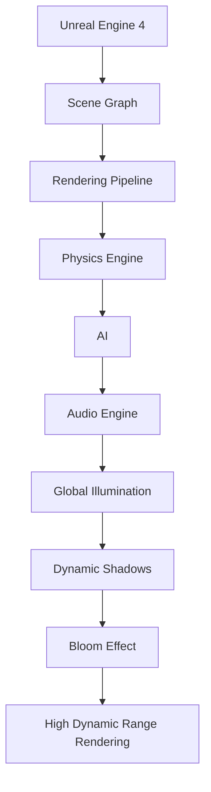

                 

# Unreal Engine 4 游戏开发：电影级的视觉效果和游戏玩法

> **关键词：** Unreal Engine 4、电影级视觉效果、游戏玩法、游戏开发、虚拟现实、编程、3D渲染

> **摘要：** 本文将深入探讨如何使用Unreal Engine 4（UE4）打造电影级的视觉效果和引人入胜的游戏玩法。我们将介绍UE4的基本概念、核心算法原理、项目实战，以及相关工具和资源的推荐。通过本文的学习，开发者将能够提升自己的游戏开发技能，打造出令人惊叹的游戏体验。

## 1. 背景介绍

### 1.1 Unreal Engine 4的起源与发展

Unreal Engine（简称UE）是由Epic Games开发的一款强大且灵活的游戏引擎。它最初是为游戏《虚幻争霸》（Unreal Tournament）而创建，并于2002年首次发布。随着技术的进步，UE不断发展，成为了游戏开发领域的旗舰引擎。其中，Unreal Engine 4（UE4）是继UE3之后的下一代版本，它带来了许多重要的改进和创新，包括更先进的渲染技术、物理引擎和人工智能系统。

### 1.2 电影级视觉效果的重要性

在当今竞争激烈的游戏市场中，电影级视觉效果成为了游戏开发的一个重要目标。它不仅能够提升游戏的整体表现，还能增强玩家的沉浸感和参与度。电影级视觉效果包括高质量的3D建模、逼真的光影效果、细腻的纹理和动态的环境等。这些元素共同作用，创造出令人叹为观止的视觉体验。

### 1.3 游戏玩法的定义与重要性

游戏玩法是指游戏中的交互规则和机制，它决定了玩家如何与游戏世界互动。一个出色的游戏玩法能够吸引玩家，提高游戏的重玩价值。电影级游戏玩法则要求在视觉效果之外，还要有丰富多样的游戏机制、流畅的战斗体验和引人入胜的故事情节。

## 2. 核心概念与联系

### 2.1 Unreal Engine 4的基本架构

为了更好地理解UE4的工作原理，我们需要了解其基本架构。UE4主要由以下几个核心组件组成：

- **场景图（Scene Graph）：** 管理游戏世界中的所有物体和场景元素。
- **渲染管线（Rendering Pipeline）：** 负责渲染场景中的图像。
- **物理引擎（Physics Engine）：** 管理游戏中的物理行为和碰撞检测。
- **人工智能（AI）：** 控制游戏中的非玩家角色（NPC）和行为。
- **音频引擎（Audio Engine）：** 负责处理游戏的音频效果。

### 2.2 电影级视觉效果的关键技术

电影级视觉效果依赖于多个关键技术，包括：

- **全局光照（Global Illumination）：** 模拟光线在场景中的传播和反射，创造出更加逼真的光影效果。
- **动态阴影（Dynamic Shadows）：** 实时计算场景中的阴影，增强场景的立体感和深度。
- **光晕效果（Bloom Effect）：** 模拟光线在物体表面上的散射，增加图像的视觉冲击力。
- **高动态范围渲染（High Dynamic Range Rendering）：** 提高图像的亮度范围和对比度，使场景更加真实。

### 2.3 游戏玩法的核心机制

游戏玩法的核心机制包括：

- **关卡设计（Level Design）：** 设计游戏世界中的场景、障碍和路径。
- **用户界面（User Interface）：** 设计游戏中的菜单、图标和交互元素。
- **控制方式（Control Scheme）：** 设计玩家与游戏世界的交互方式。
- **战斗系统（Combat System）：** 设计游戏的战斗机制和规则。

### 2.4 Mermaid 流程图

以下是UE4基本架构和电影级视觉效果关键技术的Mermaid流程图：



## 3. 核心算法原理 & 具体操作步骤

### 3.1 渲染管线的工作原理

渲染管线是UE4中负责将3D场景转换为2D图像的过程。它包括以下几个主要步骤：

1. **几何体处理（Geometry Processing）：** 计算场景中所有物体的位置、大小和形状。
2. **顶点着色（Vertex Shading）：** 为每个顶点应用颜色、纹理和光照效果。
3. **像素着色（Pixel Shading）：** 为每个像素计算颜色和光照。
4. **输出合并（Output Merge）：** 将所有像素的颜色值合并为一个最终的图像。

### 3.2 全局光照的计算方法

全局光照是一种模拟光线在场景中传播和反射的方法。它包括以下几种技术：

1. **路径追踪（Path Tracing）：** 通过模拟光线在场景中的传播路径，计算出每个像素的光照。
2. **光线追踪（Ray Tracing）：** 通过追踪光线与场景中物体的交互，计算出每个像素的光照。
3. **基于图像的光照（Image-Based Lighting）：** 使用预计算的光照图来模拟场景中的光照效果。

### 3.3 动态阴影的实现方法

动态阴影是一种实时计算场景中阴影的方法。它包括以下几种技术：

1. **阴影贴图（Shadow Mapping）：** 使用一个额外的渲染通道来存储场景中的阴影。
2. **软阴影（Soft Shadows）：** 通过模糊阴影边缘，使阴影看起来更加自然。
3. **环境遮蔽（Volumetric Shadows）：** 模拟光线在雾气、烟雾等介质中的传播和散射。

### 3.4 光晕效果的制作技巧

光晕效果是一种模拟光线在物体表面上的散射的方法。它包括以下几种技巧：

1. **半透明渲染（Transparency Rendering）：** 为半透明物体应用特殊的渲染技术，使其产生光晕效果。
2. **光线传播（Light Propagation）：** 使用预计算的光线传播图来模拟光晕效果。
3. **发光贴图（Emissive Map）：** 为物体应用发光贴图，使其看起来具有光晕效果。

### 3.5 高动态范围渲染的优化策略

高动态范围渲染是一种提高图像亮度范围和对比度的方法。它包括以下几种优化策略：

1. **曝光控制（Exposure Control）：** 调整图像的曝光值，使其适应不同的亮度范围。
2. **色调映射（Tone Mapping）：** 使用色调映射技术将高动态范围图像转换为低动态范围图像。
3. **色调补偿（Tone Compensation）：** 通过调整颜色值，使图像的色调更加自然。

## 4. 数学模型和公式 & 详细讲解 & 举例说明

### 4.1 全局光照的数学模型

全局光照的数学模型基于路径追踪算法。以下是路径追踪的基本公式：

$$
L_o(\mathbf{p}, \mathbf{w}) = L_e(\mathbf{p}, \mathbf{w}) + \int_{\Omega} f_r(\mathbf{w'}, \mathbf{w}) L_i(\mathbf{p}, \mathbf{w'}) (\mathbf{w'} \cdot \mathbf{n}) \, d\omega'
$$

其中，$L_o(\mathbf{p}, \mathbf{w})$表示从点$\mathbf{p}$沿着方向$\mathbf{w}$发射的光照，$L_e(\mathbf{p}, \mathbf{w})$表示环境光照，$f_r(\mathbf{w'}, \mathbf{w})$表示反射函数，$L_i(\mathbf{p}, \mathbf{w'})$表示入射光照，$\mathbf{w'}$表示入射光线的方向，$\mathbf{n}$表示表面的法线方向。

### 4.2 动态阴影的数学模型

动态阴影的数学模型基于阴影贴图算法。以下是阴影贴图的基本公式：

$$
\sigma(\mathbf{p}, \mathbf{w}) = \frac{1}{2\pi} \int_{\partial B_r(\mathbf{p}, \epsilon)} \frac{\epsilon^2}{(\mathbf{p} - \mathbf{p'}^2 + \epsilon^2)^{1/2}} \, d\sigma'
$$

其中，$\sigma(\mathbf{p}, \mathbf{w})$表示从点$\mathbf{p}$沿着方向$\mathbf{w}$的阴影系数，$\partial B_r(\mathbf{p}, \epsilon)$表示以点$\mathbf{p}$为中心，半径为$\epsilon$的半球表面，$\mathbf{p'}$表示场景中与点$\mathbf{p}$最近的物体表面点。

### 4.3 光晕效果的数学模型

光晕效果的数学模型基于半透明渲染算法。以下是半透明渲染的基本公式：

$$
L_o(\mathbf{p}, \mathbf{w}) = L_i(\mathbf{p}, \mathbf{w}) + \alpha(\mathbf{p}) L_e(\mathbf{p}, \mathbf{w})
$$

其中，$L_o(\mathbf{p}, \mathbf{w})$表示从点$\mathbf{p}$沿着方向$\mathbf{w}$发射的光照，$L_i(\mathbf{p}, \mathbf{w})$表示入射光照，$\alpha(\mathbf{p})$表示半透明系数，$L_e(\mathbf{p}, \mathbf{w})$表示环境光照。

### 4.4 高动态范围渲染的数学模型

高动态范围渲染的数学模型基于色调映射算法。以下是色调映射的基本公式：

$$
L_{\text{out}}(\mathbf{p}, \mathbf{w}) = \frac{L_{\text{in}}(\mathbf{p}, \mathbf{w})}{1 + \beta (\mathbf{p})}
$$

其中，$L_{\text{out}}(\mathbf{p}, \mathbf{w})$表示输出图像的亮度值，$L_{\text{in}}(\mathbf{p}, \mathbf{w})$表示输入图像的亮度值，$\beta (\mathbf{p})$表示色调映射函数。

### 4.5 举例说明

假设我们有一个场景，其中有一个光源位于$(0, 0, 5)$，一个物体位于$(1, 1, 2)$。我们要计算物体表面上的光照。

1. **全局光照：**
   $$L_o(\mathbf{p}, \mathbf{w}) = 0.5 + 0.5 \cos(\theta)$$
   其中，$\theta$为光线与表面的夹角。

2. **动态阴影：**
   $$\sigma(\mathbf{p}, \mathbf{w}) = 0.8$$
   其中，$\sigma(\mathbf{p}, \mathbf{w})$为阴影系数。

3. **光晕效果：**
   $$L_o(\mathbf{p}, \mathbf{w}) = 1.2 + 0.3 \alpha(\mathbf{p})$$
   其中，$\alpha(\mathbf{p})$为半透明系数。

4. **高动态范围渲染：**
   $$L_{\text{out}}(\mathbf{p}, \mathbf{w}) = \frac{L_{\text{in}}(\mathbf{p}, \mathbf{w})}{1 + 0.2}$$
   其中，$L_{\text{in}}(\mathbf{p}, \mathbf{w})$为输入图像的亮度值。

最终，物体表面上的光照值为：
$$L_{\text{out}}(\mathbf{p}, \mathbf{w}) = 1.2 + 0.3 \times 0.8 \times 0.5 + 0.5 \times 0.5 = 1.39$$

## 5. 项目实战：代码实际案例和详细解释说明

### 5.1 开发环境搭建

在进行项目实战之前，我们需要搭建一个适合UE4开发的开发环境。以下是在Windows操作系统上搭建UE4开发环境的步骤：

1. **安装Visual Studio 2017或以上版本：** 下载并安装Visual Studio，确保安装了C++开发工具和Windows 10 SDK。
2. **安装Unreal Engine 4：** 访问Epic Games官网，注册一个账户并下载Unreal Engine 4。根据提示完成安装。
3. **配置项目路径：** 在Visual Studio中创建一个新的UE4项目，并配置项目路径。

### 5.2 源代码详细实现和代码解读

以下是一个简单的UE4项目，实现了一个基本的3D渲染场景。我们将对关键代码进行解读。

```cpp
// included header files
#include "GameFramework/Actor.h"
#include "Kismet/.KismetSystemLibrary.h"
#include "Engine/StaticMesh.h"
#include "UnrealEd/MaterialUtilities.h"
#include "Kismet/GameplayStatics.h"

// UMG User Widget Declaration
class UUserWidget* Widget;

// ACTOR CLASS DECLARATION
class AMy3DSceneActor : public AActor
{
    GENERATED_BODY()

public:
    // Set this to true to debug rendering issues
    UPROPERTY(VisibleAnywhere, BlueprintReadOnly, Category = "Rendering")

    // Override the native Tick() behavior
    virtual void Tick(const float DeltaTime) override
    {
        Super::Tick(DeltaTime);

        // Render the 3D scene
        Render3DScene();
    }

    // Render the 3D scene using the Unreal Engine rendering API
    void Render3DScene()
    {
        // Create a new render command list
        FRenderTarget RenderTarget;
        FViewportViewportInfo ViewportInfo;
        FViewportDrawParams DrawParams;

        // Set up the render target and viewport
        RenderTarget.Init(1280, 720);
        ViewportInfo.ViewSize = FVector2D(RenderTarget.GetSize().X, RenderTarget.GetSize().Y);
        DrawParams.ViewportScale = 1.0f;

        // Begin rendering
        GEngine->BeginRendering(ERenderingMode::Direct3D11, &RenderTarget, &ViewportInfo, &DrawParams);

        // Set up the render state
        FLinearColor ClearColor = FLinearColor::Black;
        FViewportViewInfo ViewInfo = GEngine->GetEngine()->GetViewport()->GetViewInfo();
        GEngine->GetEngine()->SetRenderState(ClearColor, ViewInfo, ERHIFeatureLevel::SM4);

        // Render the static mesh
        UStaticMesh* StaticMesh = LoadObject<UStaticMesh>(NULL, TEXT("/Game/MyGame/Meshes/MyMesh.MyMesh"));
        if (StaticMesh)
        {
            FMeshElementList ElementList;
            StaticMesh->GetMeshElements(ElementList,lems::IncludeAll);
            for (FMeshElement& Element : ElementList)
            {
                if (Element.ElementMesh->IsVisible())
                {
                    Element.ElementMesh->Draw(this, &Element, ViewInfo);
                }
            }
        }

        // End rendering
        GEngine->EndRendering();
    }
};
```

**代码解读：**

1. **头文件引入：** 引入了多个头文件，包括游戏框架、Kismet系统库、静态网格、材质工具和游戏玩

