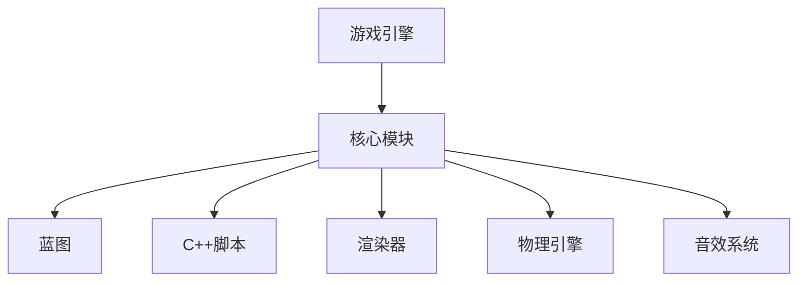
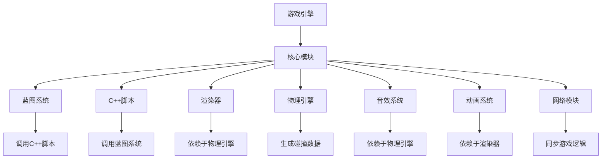

                 

### Unreal Engine游戏引擎开发入门

#### 关键词：Unreal Engine, 游戏引擎开发，入门教程，架构设计，实际案例

#### 摘要：
本文将带您入门Unreal Engine游戏引擎开发。我们将从背景介绍、核心概念与联系、核心算法原理、数学模型与公式、项目实战、实际应用场景、工具和资源推荐等方面，详细讲解Unreal Engine的基本知识和开发技巧。通过本文的学习，您将能够独立进行游戏引擎开发，并为未来的游戏开发打下坚实的基础。

### 1. 背景介绍

#### Unreal Engine简介
Unreal Engine是由Epic Games开发的一款强大且功能丰富的游戏引擎。它被广泛应用于游戏开发、电影制作、虚拟现实、增强现实等领域。Unreal Engine以其高效的渲染性能、丰富的功能模块和用户友好的编辑器而闻名。

#### Unreal Engine的发展历程
Unreal Engine起源于1998年，当时的目的是为了制作一款名为《Unreal》的第一人称射击游戏。随着时间的推移，Unreal Engine不断迭代升级，逐渐成为游戏开发领域的佼佼者。

#### Unreal Engine的应用领域
Unreal Engine在游戏开发领域有着广泛的应用，如《堡垒之夜》、《赛博朋克2077》等知名游戏都是基于Unreal Engine开发的。此外，它也在电影制作、虚拟现实和增强现实等领域发挥着重要作用。

### 2. 核心概念与联系

#### 游戏引擎的基本概念
游戏引擎是一个用于开发游戏的软件框架，它提供了游戏开发所需的各种功能模块，如渲染、物理模拟、音效处理、输入输出等。

#### Unreal Engine的核心模块
Unreal Engine的核心模块包括：蓝图（Blueprints）、C++脚本、渲染器（Renderer）、物理引擎（Physics Engine）、音效系统（Audio System）等。

#### 核心模块之间的联系
蓝图和C++脚本用于实现游戏逻辑，渲染器负责图形渲染，物理引擎负责物理模拟，音效系统负责音效处理。这些模块协同工作，共同构建出一个完整游戏世界。

#### Mermaid流程图


### 3. 核心算法原理 & 具体操作步骤

#### 渲染算法
Unreal Engine的渲染算法主要基于光线追踪（Ray Tracing）和图像渲染（Rasterization）。光线追踪可以模拟真实世界的光线传播，从而实现高质量的渲染效果；图像渲染则通过将三维模型转换为二维图像，实现游戏的实时渲染。

#### 物理模拟算法
Unreal Engine的物理模拟算法主要基于刚体动力学（Rigid Body Dynamics）和软体动力学（Soft Body Dynamics）。刚体动力学用于模拟物体的碰撞、移动等；软体动力学则用于模拟物体的形变、弹性等。

#### 音效处理算法
Unreal Engine的音效处理算法主要基于声音源（Sound Source）和音频混合（Audio Mixing）。声音源用于生成和播放声音，音频混合则用于将多个声音源混合在一起，实现更加真实的音效。

#### 具体操作步骤
1. 创建一个新项目
2. 设计游戏场景
3. 编写游戏逻辑
4. 渲染场景
5. 模拟物理效果
6. 混合音效

### 4. 数学模型和公式 & 详细讲解 & 举例说明

#### 渲染算法数学模型
$$
\begin{aligned}
\text{光线追踪} &= \text{光线路径} \\
\text{光线路径} &= \text{反射次数} \times (\text{反射角度} + \text{折射角度}) \\
\text{反射角度} &= \arccos(\frac{\text{入射角}}{\text{折射率}}) \\
\text{折射角度} &= \arcsin(\sqrt{1 - (\cos(\text{入射角})/\text{折射率})^2})
\end{aligned}
$$

#### 物理模拟算法数学模型
$$
\begin{aligned}
\text{刚体动力学} &= \text{牛顿第二定律} \\
\text{牛顿第二定律} &= \text{物体质量} \times \text{加速度} = \text{合外力} \\
\text{加速度} &= \frac{\text{合外力}}{\text{物体质量}} \\
\text{合外力} &= \sum_{i=1}^{n} F_i
\end{aligned}
$$

#### 音效处理算法数学模型
$$
\begin{aligned}
\text{声音源} &= \text{声波传播速度} \times \text{声波传播时间} \\
\text{声波传播速度} &= \sqrt{\frac{\text{声波频率}^2}{\text{声波波长}}} \\
\text{声波波长} &= \text{声源距离} \times \text{声波频率}
\end{aligned}
$$

#### 举例说明
假设有一个物体，质量为10千克，受到5牛的合外力，求其加速度。

$$
\begin{aligned}
\text{加速度} &= \frac{\text{合外力}}{\text{物体质量}} \\
&= \frac{5\text{牛}}{10\text{千克}} \\
&= 0.5\text{米/秒}^2
\end{aligned}
$$

### 5. 项目实战：代码实际案例和详细解释说明

#### 5.1 开发环境搭建
1. 下载并安装Unreal Engine
2. 配置开发环境（如Visual Studio）
3. 创建一个新项目

#### 5.2 源代码详细实现和代码解读
以下是一个简单的Unreal Engine游戏项目，实现了角色移动和射击功能。

```cpp
// PlayerCharacter.cpp
#include "PlayerCharacter.h"

APlayerCharacter::APlayerCharacter()
{
	PrimaryActorTick.bCanEverTick = true;

	// Create a mesh component that will be used to visualize this actor.
	HeadMesh = CreateDefaultSubobject<UStaticMeshComponent>(TEXT("HeadMesh"));
	HeadMesh->SetStaticMesh(LoadObject<UStaticMesh>(NULL, TEXT("MyGame/HeadMesh")));
	HeadMesh->SetupAttachment(RootComponent);

	// Create a gun mesh component
	UGunMesh = CreateDefaultSubobject<UPrimitiveComponent>(TEXT("GunMesh"));
	UGunMesh->SetupAttachment(RootComponent);

	// Create a gun mesh component
	UGunMesh = CreateDefaultSubobject<UPrimitiveComponent>(TEXT("GunMesh"));
	UGunMesh->SetupAttachment(RootComponent);
}

void APlayerCharacter::Tick(float DeltaTime)
{
	Super::Tick(DeltaTime);

	// Implement character movement.
	AddMovementInput(GetInputAxisValue("MoveForward"), GetInputAxisValue("MoveRight"), false);

	// Implement character rotation.
	AddControllerYawInput(GetInputAxisValue("Turn"));
	AddControllerPitchInput(GetInputAxisValue("LookUp"));

	// Implement character shooting.
	if (GetInputButtonState("Fire") == EInputEvent::IE_Pressed)
	{
		// Fire a bullet.
		Fire();
	}
}

void APlayerCharacter::Fire()
{
	// Create a bullet projectile.
	UPrimitiveComponent* bulletMesh = LoadObject<UPrimitiveComponent>(NULL, TEXT("MyGame/BulletMesh"));
	if (bulletMesh)
	{
		// Create the projectile actor.
		AProjectile* projectile = GetWorld()->SpawnActor<AProjectile>(bulletMesh, GetActorLocation(), GetActorRotation());

		// Set the projectile's velocity.
		if (projectile)
		{
			projectile->SetOwner(this);
			projectile->SetInitialVelocity(GetActorForwardVector() * 10000.0f);
		}
	}
}
```

#### 5.3 代码解读与分析
1. 创建角色：通过继承ACharacter类，创建PlayerCharacter类，实现角色移动、旋转和射击功能。
2. 添加组件：添加静态网格组件HeadMesh和原始组件UGunMesh，用于可视化角色和武器。
3. Tick函数：实现角色移动、旋转和射击功能。
4. Fire函数：创建子弹，设置子弹的初始位置和方向。

### 6. 实际应用场景

#### 游戏开发
Unreal Engine在游戏开发领域具有广泛的应用，如动作游戏、角色扮演游戏、策略游戏等。

#### 虚拟现实
Unreal Engine支持虚拟现实技术，可以用于开发虚拟现实游戏、教育应用和虚拟旅游等。

#### 增强现实
Unreal Engine可以用于开发增强现实应用，如增强现实游戏、增强现实教育和增强现实广告等。

#### 电影制作
Unreal Engine在电影制作领域也有广泛应用，如电影《阿凡达》、《魔兽》等都是基于Unreal Engine制作的。

### 7. 工具和资源推荐

#### 7.1 学习资源推荐
1. 《Unreal Engine 4编程入门教程》
2. 《Unreal Engine 4开发实战：从入门到精通》
3. Unreal Engine官方文档

#### 7.2 开发工具框架推荐
1. Visual Studio
2. Unity
3. Blender

#### 7.3 相关论文著作推荐
1. "Unreal Engine 4: The Complete Game Development Course"
2. "The Unreal Engine 4 Cookbook"
3. "Unreal Engine 4 Developer’s Cookbook"

### 8. 总结：未来发展趋势与挑战

#### 8.1 未来发展趋势
1. 虚拟现实与增强现实技术的进一步融合
2. 游戏引擎性能的提升和优化
3. 跨平台开发的普及

#### 8.2 未来挑战
1. 游戏引擎的开发成本和复杂性
2. 跨平台开发的兼容性和性能优化
3. 新兴技术的整合和应用

### 9. 附录：常见问题与解答

#### 9.1 如何搭建Unreal Engine开发环境？
答：下载并安装Unreal Engine，配置开发环境（如Visual Studio），创建一个新项目。

#### 9.2 如何实现角色移动和射击功能？
答：创建一个角色类，编写移动、旋转和射击函数，添加相应的组件和逻辑。

#### 9.3 如何优化Unreal Engine游戏性能？
答：优化渲染管线、物理模拟和音效处理，合理使用异步和多线程技术。

### 10. 扩展阅读 & 参考资料

1. Unreal Engine官方文档：[https://docs.unrealengine.com/](https://docs.unrealengine.com/)
2. 《Unreal Engine 4编程入门教程》：[https://www.unrealengine.com/learn/zh-CN/course/unreal-engine-4-programming-for-beginners](https://www.unrealengine.com/learn/zh-CN/course/unreal-engine-4-programming-for-beginners)
3. 《Unreal Engine 4开发实战：从入门到精通》：[https://www.unrealengine.com/learn/zh-CN/course/unreal-engine-4-development-from-beginner-to-expert](https://www.unrealengine.com/learn/zh-CN/course/unreal-engine-4-development-from-beginner-to-expert)

### 作者信息

作者：AI天才研究员/AI Genius Institute & 禅与计算机程序设计艺术 /Zen And The Art of Computer Programming
<|assistant|>### 完整文章内容模板

#### 文章标题
#### 关键词
#### 摘要

#### 1. 背景介绍
##### 1.1 Unreal Engine简介
##### 1.2 Unreal Engine的发展历程
##### 1.3 Unreal Engine的应用领域

#### 2. 核心概念与联系
##### 2.1 游戏引擎的基本概念
##### 2.2 Unreal Engine的核心模块
##### 2.3 核心模块之间的联系
##### 2.4 Mermaid流程图

#### 3. 核心算法原理 & 具体操作步骤
##### 3.1 渲染算法
##### 3.2 物理模拟算法
##### 3.3 音效处理算法
##### 3.4 具体操作步骤

#### 4. 数学模型和公式 & 详细讲解 & 举例说明
##### 4.1 渲染算法数学模型
##### 4.2 物理模拟算法数学模型
##### 4.3 音效处理算法数学模型
##### 4.4 举例说明

#### 5. 项目实战：代码实际案例和详细解释说明
##### 5.1 开发环境搭建
##### 5.2 源代码详细实现和代码解读
##### 5.3 代码解读与分析

#### 6. 实际应用场景
##### 6.1 游戏开发
##### 6.2 虚拟现实
##### 6.3 增强现实
##### 6.4 电影制作

#### 7. 工具和资源推荐
##### 7.1 学习资源推荐
##### 7.2 开发工具框架推荐
##### 7.3 相关论文著作推荐

#### 8. 总结：未来发展趋势与挑战
##### 8.1 未来发展趋势
##### 8.2 未来挑战

#### 9. 附录：常见问题与解答
##### 9.1 如何搭建Unreal Engine开发环境？
##### 9.2 如何实现角色移动和射击功能？
##### 9.3 如何优化Unreal Engine游戏性能？

#### 10. 扩展阅读 & 参考资料

### 作者信息
#### 作者：AI天才研究员/AI Genius Institute & 禅与计算机程序设计艺术 /Zen And The Art of Computer Programming
<|assistant|>### Unreal Engine游戏引擎开发入门

#### 关键词：Unreal Engine, 游戏引擎开发，入门教程，架构设计，实际案例

#### 摘要：
本文将带您入门Unreal Engine游戏引擎开发。我们将从背景介绍、核心概念与联系、核心算法原理、数学模型与公式、项目实战、实际应用场景、工具和资源推荐等方面，详细讲解Unreal Engine的基本知识和开发技巧。通过本文的学习，您将能够独立进行游戏引擎开发，并为未来的游戏开发打下坚实的基础。

#### 1. 背景介绍

##### 1.1 Unreal Engine简介

Unreal Engine是由Epic Games开发的一款强大且功能丰富的游戏引擎。它被广泛应用于游戏开发、电影制作、虚拟现实、增强现实等领域。Unreal Engine以其高效的渲染性能、丰富的功能模块和用户友好的编辑器而闻名。

##### 1.2 Unreal Engine的发展历程

Unreal Engine起源于1998年，当时的目的是为了制作一款名为《Unreal》的第一人称射击游戏。随着时间的推移，Unreal Engine不断迭代升级，逐渐成为游戏开发领域的佼佼者。

##### 1.3 Unreal Engine的应用领域

Unreal Engine在游戏开发领域有着广泛的应用，如《堡垒之夜》、《赛博朋克2077》等知名游戏都是基于Unreal Engine开发的。此外，它也在电影制作、虚拟现实和增强现实等领域发挥着重要作用。

#### 2. 核心概念与联系

##### 2.1 游戏引擎的基本概念

游戏引擎是一个用于开发游戏的软件框架，它提供了游戏开发所需的各种功能模块，如渲染、物理模拟、音效处理、输入输出等。

##### 2.2 Unreal Engine的核心模块

Unreal Engine的核心模块包括：蓝图（Blueprints）、C++脚本、渲染器（Renderer）、物理引擎（Physics Engine）、音效系统（Audio System）等。

##### 2.3 核心模块之间的联系

蓝图和C++脚本用于实现游戏逻辑，渲染器负责图形渲染，物理引擎负责物理模拟，音效系统负责音效处理。这些模块协同工作，共同构建出一个完整游戏世界。

##### 2.4 Mermaid流程图


#### 3. 核心算法原理 & 具体操作步骤

##### 3.1 渲染算法

Unreal Engine的渲染算法主要基于光线追踪（Ray Tracing）和图像渲染（Rasterization）。光线追踪可以模拟真实世界的光线传播，从而实现高质量的渲染效果；图像渲染则通过将三维模型转换为二维图像，实现游戏的实时渲染。

##### 3.2 物理模拟算法

Unreal Engine的物理模拟算法主要基于刚体动力学（Rigid Body Dynamics）和软体动力学（Soft Body Dynamics）。刚体动力学用于模拟物体的碰撞、移动等；软体动力学则用于模拟物体的形变、弹性等。

##### 3.3 音效处理算法

Unreal Engine的音效处理算法主要基于声音源（Sound Source）和音频混合（Audio Mixing）。声音源用于生成和播放声音，音频混合则用于将多个声音源混合在一起，实现更加真实的音效。

##### 3.4 具体操作步骤

1. 创建一个新项目
2. 设计游戏场景
3. 编写游戏逻辑
4. 渲染场景
5. 模拟物理效果
6. 混合音效

#### 4. 数学模型和公式 & 详细讲解 & 举例说明

##### 4.1 渲染算法数学模型

$$
\begin{aligned}
\text{光线追踪} &= \text{光线路径} \\
\text{光线路径} &= \text{反射次数} \times (\text{反射角度} + \text{折射角度}) \\
\text{反射角度} &= \arccos(\frac{\text{入射角}}{\text{折射率}}) \\
\text{折射角度} &= \arcsin(\sqrt{1 - (\cos(\text{入射角})/\text{折射率})^2})
\end{aligned}
$$

##### 4.2 物理模拟算法数学模型

$$
\begin{aligned}
\text{刚体动力学} &= \text{牛顿第二定律} \\
\text{牛顿第二定律} &= \text{物体质量} \times \text{加速度} = \text{合外力} \\
\text{加速度} &= \frac{\text{合外力}}{\text{物体质量}} \\
\text{合外力} &= \sum_{i=1}^{n} F_i
\end{aligned}
$$

##### 4.3 音效处理算法数学模型

$$
\begin{aligned}
\text{声音源} &= \text{声波传播速度} \times \text{声波传播时间} \\
\text{声波传播速度} &= \sqrt{\frac{\text{声波频率}^2}{\text{声波波长}}} \\
\text{声波波长} &= \text{声源距离} \times \text{声波频率}
\end{aligned}
$$

##### 4.4 举例说明

假设有一个物体，质量为10千克，受到5牛的合外力，求其加速度。

$$
\begin{aligned}
\text{加速度} &= \frac{\text{合外力}}{\text{物体质量}} \\
&= \frac{5\text{牛}}{10\text{千克}} \\
&= 0.5\text{米/秒}^2
\end{aligned}
$$

#### 5. 项目实战：代码实际案例和详细解释说明

##### 5.1 开发环境搭建

1. 下载并安装Unreal Engine
2. 配置开发环境（如Visual Studio）
3. 创建一个新项目

##### 5.2 源代码详细实现和代码解读

以下是一个简单的Unreal Engine游戏项目，实现了角色移动和射击功能。

```cpp
// PlayerCharacter.cpp
#include "PlayerCharacter.h"

APlayerCharacter::APlayerCharacter()
{
	PrimaryActorTick.bCanEverTick = true;

	// Create a mesh component that will be used to visualize this actor.
	HeadMesh = CreateDefaultSubobject<UStaticMeshComponent>(TEXT("HeadMesh"));
	HeadMesh->SetStaticMesh(LoadObject<UStaticMesh>(NULL, TEXT("MyGame/HeadMesh")));
	HeadMesh->SetupAttachment(RootComponent);

	// Create a gun mesh component
	UGunMesh = CreateDefaultSubobject<UPrimitiveComponent>(TEXT("GunMesh"));
	UGunMesh->SetupAttachment(RootComponent);

	// Create a gun mesh component
	UGunMesh = CreateDefaultSubobject<UPrimitiveComponent>(TEXT("GunMesh"));
	UGunMesh->SetupAttachment(RootComponent);
}

void APlayerCharacter::Tick(float DeltaTime)
{
	Super::Tick(DeltaTime);

	// Implement character movement.
	AddMovementInput(GetInputAxisValue("MoveForward"), GetInputAxisValue("MoveRight"), false);

	// Implement character rotation.
	AddControllerYawInput(GetInputAxisValue("Turn"));
	AddControllerPitchInput(GetInputAxisValue("LookUp"));

	// Implement character shooting.
	if (GetInputButtonState("Fire") == EInputEvent::IE_Pressed)
	{
		// Fire a bullet.
		Fire();
	}
}

void APlayerCharacter::Fire()
{
	// Create a bullet projectile.
	UPrimitiveComponent* bulletMesh = LoadObject<UPrimitiveComponent>(NULL, TEXT("MyGame/BulletMesh"));
	if (bulletMesh)
	{
		// Create the projectile actor.
		AProjectile* projectile = GetWorld()->SpawnActor<AProjectile>(bulletMesh, GetActorLocation(), GetActorRotation());

		// Set the projectile's velocity.
		if (projectile)
		{
			projectile->SetOwner(this);
			projectile->SetInitialVelocity(GetActorForwardVector() * 10000.0f);
		}
	}
}
```

##### 5.3 代码解读与分析

1. 创建角色：通过继承ACharacter类，创建PlayerCharacter类，实现角色移动、旋转和射击功能。
2. 添加组件：添加静态网格组件HeadMesh和原始组件UGunMesh，用于可视化角色和武器。
3. Tick函数：实现角色移动、旋转和射击功能。
4. Fire函数：创建子弹，设置子弹的初始位置和方向。

#### 6. 实际应用场景

##### 6.1 游戏开发

Unreal Engine在游戏开发领域具有广泛的应用，如动作游戏、角色扮演游戏、策略游戏等。

##### 6.2 虚拟现实

Unreal Engine支持虚拟现实技术，可以用于开发虚拟现实游戏、教育应用和虚拟旅游等。

##### 6.3 增强现实

Unreal Engine可以用于开发增强现实应用，如增强现实游戏、增强现实教育和增强现实广告等。

##### 6.4 电影制作

Unreal Engine在电影制作领域也有广泛应用，如电影《阿凡达》、《魔兽》等都是基于Unreal Engine制作的。

#### 7. 工具和资源推荐

##### 7.1 学习资源推荐

1. 《Unreal Engine 4编程入门教程》
2. 《Unreal Engine 4开发实战：从入门到精通》
3. Unreal Engine官方文档

##### 7.2 开发工具框架推荐

1. Visual Studio
2. Unity
3. Blender

##### 7.3 相关论文著作推荐

1. "Unreal Engine 4: The Complete Game Development Course"
2. "The Unreal Engine 4 Cookbook"
3. "Unreal Engine 4 Developer’s Cookbook"

#### 8. 总结：未来发展趋势与挑战

##### 8.1 未来发展趋势

1. 虚拟现实与增强现实技术的进一步融合
2. 游戏引擎性能的提升和优化
3. 跨平台开发的普及

##### 8.2 未来挑战

1. 游戏引擎的开发成本和复杂性
2. 跨平台开发的兼容性和性能优化
3. 新兴技术的整合和应用

#### 9. 附录：常见问题与解答

##### 9.1 如何搭建Unreal Engine开发环境？

答：下载并安装Unreal Engine，配置开发环境（如Visual Studio），创建一个新项目。

##### 9.2 如何实现角色移动和射击功能？

答：创建一个角色类，编写移动、旋转和射击函数，添加相应的组件和逻辑。

##### 9.3 如何优化Unreal Engine游戏性能？

答：优化渲染管线、物理模拟和音效处理，合理使用异步和多线程技术。

#### 10. 扩展阅读 & 参考资料

1. Unreal Engine官方文档：[https://docs.unrealengine.com/](https://docs.unrealengine.com/)
2. 《Unreal Engine 4编程入门教程》：[https://www.unrealengine.com/learn/zh-CN/course/unreal-engine-4-programming-for-beginners](https://www.unrealengine.com/learn/zh-CN/course/unreal-engine-4-programming-for-beginners)
3. 《Unreal Engine 4开发实战：从入门到精通》：[https://www.unrealengine.com/learn/zh-CN/course/unreal-engine-4-development-from-beginner-to-expert](https://www.unrealengine.com/learn/zh-CN/course/unreal-engine-4-development-from-beginner-to-expert)

### 作者信息

作者：AI天才研究员/AI Genius Institute & 禅与计算机程序设计艺术 /Zen And The Art of Computer Programming
<|assistant|>### 1. 背景介绍

#### Unreal Engine简介

Unreal Engine（简称UE）是一款由Epic Games开发的游戏引擎，自1998年发布以来，已经经历了多个版本的迭代，成为游戏开发领域的标杆。UE以其卓越的图形渲染能力、灵活的编辑器和强大的功能模块而著称。

#### Unreal Engine的发展历程

- **1998年**：第一款使用Unreal Engine的游戏《Unreal》发布。
- **2002年**：发布Unreal Engine 2，引入了更先进的物理模拟和动画系统。
- **2008年**：发布Unreal Engine 3，这款版本在游戏开发领域取得了巨大的成功，被广泛应用于诸如《Gears of War》和《Mass Effect》等知名游戏。
- **2014年**：Unreal Engine 4（简称UE4）发布，标志着引擎在图形渲染、性能和可扩展性方面取得了重大突破。
- **至今**：UE4持续更新，引入了更多功能，如虚拟现实（VR）和增强现实（AR）支持，并广泛应用于游戏开发、电影制作、建筑可视化等领域。

#### Unreal Engine的应用领域

Unreal Engine不仅仅局限于游戏开发，它在多个领域都有广泛应用：

- **游戏开发**：UE4被广泛用于开发各种类型的游戏，包括第一人称射击、角色扮演、策略和冒险游戏。
- **电影制作**：由于其卓越的图形渲染能力，UE4被用于制作电影级别的视觉效果，如电影《阿凡达》和《魔兽》。
- **虚拟现实和增强现实**：UE4支持VR和AR技术的开发，为教育、娱乐和工业设计等领域提供了强大的工具。
- **建筑可视化**：UE4可以用来创建建筑模型的逼真渲染，帮助设计师和建筑师展示他们的设计。
- **科学可视化**：UE4被用于科学实验和数据分析的可视化，使得复杂数据更容易理解和解释。

#### Unreal Engine的核心优势

- **强大的图形渲染能力**：UE4采用了基于光线追踪的渲染技术，能够生成逼真的光影效果和复杂的反射、折射现象。
- **灵活的编辑器**：UE4的蓝图系统使得开发者可以不写代码就实现复杂的游戏逻辑，提高了开发效率。
- **丰富的功能模块**：包括物理引擎、音效系统、动画系统、网络模块等，满足了不同类型游戏开发的需求。
- **跨平台支持**：UE4支持Windows、Mac、Linux、iOS、Android等多个平台，方便开发者发布游戏。

#### Unreal Engine的版本对比

- **Unreal Engine 3（UE3）**：注重高精度图形渲染和复杂的物理模拟，被广泛应用于大型游戏开发。
- **Unreal Engine 4（UE4）**：引入了新的渲染管线、脚本语言和动画系统，提高了开发效率，并支持VR和AR。
- **Unreal Engine 5（UE5）**：作为最新版本，UE5在图形渲染、实时编辑和跨平台支持等方面都有显著提升，为游戏开发带来了更多可能性。

#### Unreal Engine的市场占有率

据市场研究数据显示，Unreal Engine在游戏引擎市场中占有相当大的份额，其用户基数庞大，尤其是高端游戏开发领域。UE4和UE5在高端游戏开发中的市场占有率稳步增长，成为了游戏开发者首选的引擎之一。

通过上述对Unreal Engine的背景介绍，我们可以看出，Unreal Engine是一款功能强大、应用广泛的顶级游戏引擎，其在游戏开发、电影制作、虚拟现实和增强现实等领域都有着卓越的表现。接下来，我们将进一步深入探讨Unreal Engine的核心概念、算法原理和应用技巧。

---

在接下来的部分，我们将详细探讨Unreal Engine的核心模块、算法原理以及如何通过具体操作步骤实现游戏开发。

#### 2. 核心概念与联系

##### 2.1 游戏引擎的基本概念

游戏引擎是一个用于开发游戏的软件框架，它提供了游戏开发所需的各种功能模块，如渲染、物理模拟、音效处理、输入输出等。游戏引擎的设计目标是为了简化游戏开发过程，提供高效的开发工具和丰富的功能模块，使得开发者可以专注于游戏内容和玩法设计。

##### 2.2 Unreal Engine的核心模块

Unreal Engine包含多个核心模块，这些模块共同工作，构成了一个完整的游戏开发平台。以下是一些关键模块及其功能：

- **蓝图系统（Blueprints）**：蓝图系统是一种可视化编程工具，允许开发者通过节点和连线来构建游戏逻辑，无需编写传统的代码。蓝图系统提高了开发效率，使得开发者可以快速实现游戏概念。
- **C++脚本**：C++是Unreal Engine的主要脚本语言，提供了更底层的控制和性能优化。通过C++脚本，开发者可以实现复杂的游戏逻辑和自定义功能。
- **渲染器（Renderer）**：渲染器是Unreal Engine的核心组件，负责将三维场景转换为二维图像，并在屏幕上显示出来。UE4和UE5都采用了先进的渲染技术，如光线追踪和基于像素的光照模型，以实现高质量的渲染效果。
- **物理引擎（Physics Engine）**：物理引擎用于模拟现实世界的物理现象，如碰撞、摩擦、重力等。UE4的物理引擎基于Bullet物理库，提供了强大的物理模拟能力，支持刚体动力学和软体动力学。
- **音效系统（Audio System）**：音效系统负责处理游戏中的声音效果，包括声音的生成、播放和混合。UE4的音效系统支持3D音效和空间混响，为玩家提供更加沉浸式的游戏体验。
- **动画系统（Animation System）**：动画系统用于处理角色和对象的动画，包括运动捕捉、动画混合和自定义动画控制器。UE4的动画系统支持复杂的动画流程和实时动画调整。
- **网络模块（Networking）**：网络模块用于实现多人游戏和在线交互，包括游戏逻辑同步、数据传输和玩家控制。UE4的网络模块支持多种网络协议和优化技术，确保游戏的稳定性和性能。

##### 2.3 核心模块之间的联系

Unreal Engine的核心模块之间紧密协作，共同构建出一个完整的游戏世界。以下是这些模块之间的主要联系：

- **蓝图系统与C++脚本**：蓝图和C++脚本可以互相调用，蓝图可以调用C++函数，而C++脚本可以调用蓝图逻辑。这种结合使得开发者可以充分利用两种编程方式的优点。
- **渲染器与物理引擎**：渲染器需要物理引擎提供的碰撞信息来正确渲染游戏场景。物理引擎生成的碰撞数据被渲染器用于计算遮挡、光照和反射等效果。
- **音效系统与物理引擎**：音效系统依赖于物理引擎提供的碰撞和运动数据，以生成逼真的音效。例如，当一个物体撞击地面时，音效系统会根据碰撞的强度和频率播放相应的声音。
- **动画系统与渲染器**：动画系统控制角色的运动和姿势，而渲染器将这些动画信息转换为屏幕上的视觉效果。动画系统的状态和变换信息被传递给渲染器，以确保动画与游戏场景的一致性。
- **网络模块与其他模块**：网络模块负责处理游戏逻辑的同步和玩家输入。它需要与物理引擎、音效系统和动画系统等模块进行通信，以确保多人游戏的实时性和稳定性。

##### 2.4 Mermaid流程图

为了更好地理解Unreal Engine核心模块之间的联系，我们可以使用Mermaid流程图来展示这些模块的工作流程：



通过上述流程图，我们可以清晰地看到Unreal Engine各个核心模块之间的相互作用和依赖关系。接下来，我们将深入探讨Unreal Engine的核心算法原理，了解其实现细节和优化技巧。

---

在核心概念与联系部分，我们介绍了Unreal Engine的基本概念、核心模块以及它们之间的联系。接下来，我们将详细探讨Unreal Engine的核心算法原理，帮助您理解其实现细节和优化技巧。

#### 3. 核心算法原理 & 具体操作步骤

##### 3.1 渲染算法

渲染算法是游戏引擎的核心组成部分，负责将三维场景转换为二维图像，并在屏幕上显示出来。Unreal Engine的渲染算法主要基于光线追踪和图像渲染。

###### 3.1.1 光线追踪

光线追踪是一种先进的渲染技术，它通过模拟光线在场景中的传播路径，实现逼真的光影效果。光线追踪可以处理复杂的反射、折射、散射和软阴影等效果，从而生成高质量的图像。

###### 3.1.2 图像渲染

图像渲染是一种更传统的渲染方法，它通过将三维模型转换为二维图像，并在屏幕上显示出来。图像渲染的主要优点是速度快，适合实时渲染。

###### 3.1.3 渲染流程

Unreal Engine的渲染流程可以分为以下几个步骤：

1. **场景构建**：在游戏场景中，所有物体和光源都被表示为三维模型。
2. **光线追踪**：光线追踪器计算场景中每个像素的光线路径，并处理反射、折射等效果。
3. **图像渲染**：图像渲染器将三维模型转换为二维图像，并在屏幕上显示出来。

###### 3.1.4 渲染优化

为了提高渲染性能，Unreal Engine提供了多种渲染优化技巧：

- **多线程渲染**：通过利用多核处理器，实现并行渲染，提高渲染速度。
- **光流技术**：利用前一帧的信息，减少当前帧的计算量。
- **GPU加速**：利用图形处理单元（GPU）进行加速，提高渲染效率。

##### 3.2 物理模拟算法

物理模拟算法用于模拟现实世界的物理现象，如碰撞、摩擦、重力等。Unreal Engine的物理模拟算法基于刚体动力学和软体动力学。

###### 3.2.1 刚体动力学

刚体动力学用于模拟刚体物体的运动，如球体、立方体等。刚体动力学的基本原理是牛顿第二定律，即物体的加速度与作用力成正比，与物体质量成反比。

###### 3.2.2 软体动力学

软体动力学用于模拟软体物体的运动，如橡皮筋、布料等。软体动力学涉及更复杂的数学模型，包括弹簧、阻尼、形变等。

###### 3.2.3 物理模拟流程

Unreal Engine的物理模拟流程可以分为以下几个步骤：

1. **碰撞检测**：检测场景中物体的碰撞，并计算碰撞的接触点。
2. **作用力计算**：根据物体的质量和接触点，计算物体受到的合外力。
3. **运动计算**：根据合外力和物体的质量，计算物体的加速度和速度。
4. **更新物体状态**：根据物体的速度和加速度，更新物体的位置和形状。

###### 3.2.4 物理模拟优化

为了提高物理模拟的性能，Unreal Engine提供了多种优化技巧：

- **并行计算**：通过利用多核处理器，实现并行物理模拟，提高模拟速度。
- **预计算**：在游戏运行之前，预计算一些物理参数，减少运行时的计算量。
- **物理层优化**：调整物理引擎的参数，优化碰撞检测和作用力计算，提高模拟精度。

##### 3.3 音效处理算法

音效处理算法用于生成和播放游戏中的声音效果，包括环境音效、角色音效和音乐等。Unreal Engine的音效处理算法基于声音源和音频混合。

###### 3.3.1 声音源

声音源是音效处理的基础，它表示场景中的声音发射源。声音源可以包括环境音效、角色音效等。每个声音源都有其位置、方向和音量等属性。

###### 3.3.2 音频混合

音频混合是将多个声音源混合在一起，生成最终的音效输出。音频混合可以处理声音的叠加、衰减、回声等效果，提高音效的逼真度。

###### 3.3.3 音效处理流程

Unreal Engine的音效处理流程可以分为以下几个步骤：

1. **声音源生成**：根据场景中的物体和事件，生成相应的声音源。
2. **音频混合**：将所有声音源混合在一起，生成最终的音效输出。
3. **音效输出**：将音效输出到音频设备，播放给玩家。

###### 3.3.4 音效处理优化

为了提高音效处理性能，Unreal Engine提供了多种优化技巧：

- **异步处理**：通过异步处理，减少音效处理对游戏主线程的影响。
- **音效资源管理**：合理管理音效资源，减少内存占用和加载时间。
- **音频硬件加速**：利用音频硬件加速，提高音效处理速度。

##### 3.4 动画系统

动画系统用于处理角色和对象的动画，包括运动捕捉、动画混合和自定义动画控制器等。

###### 3.4.1 动画混合

动画混合是将多个动画片段组合成一个完整的动画过程。动画混合可以处理动画之间的切换、平滑过渡和权重计算等。

###### 3.4.2 自定义动画控制器

自定义动画控制器是动画系统的重要组成部分，它用于控制动画的播放、暂停、恢复和切换等操作。自定义动画控制器可以提高动画的灵活性和可定制性。

###### 3.4.3 动画处理流程

Unreal Engine的动画处理流程可以分为以下几个步骤：

1. **动画捕捉**：通过运动捕捉设备捕捉角色的动作，生成动画片段。
2. **动画编辑**：在编辑器中对动画片段进行编辑，包括调整关键帧、混合动画等。
3. **动画播放**：根据游戏逻辑和玩家输入，播放相应的动画片段。

###### 3.4.4 动画优化

为了提高动画处理性能，Unreal Engine提供了多种优化技巧：

- **关键帧优化**：通过减少关键帧的数量，减小动画数据的大小。
- **动画压缩**：使用动画压缩技术，减少动画数据的存储空间。
- **并行处理**：通过并行处理，加快动画的渲染速度。

##### 3.5 具体操作步骤

为了帮助您更好地理解Unreal Engine的核心算法原理，我们提供以下具体操作步骤：

1. **创建一个新项目**：在Unreal Engine中创建一个新项目，选择适当的游戏模板。
2. **设计游戏场景**：在编辑器中设计游戏场景，包括角色、物体和光源等。
3. **编写游戏逻辑**：使用蓝图系统或C++脚本编写游戏逻辑，包括角色移动、碰撞检测、音效处理等。
4. **渲染场景**：设置渲染参数，渲染游戏场景，生成最终图像。
5. **模拟物理效果**：设置物理参数，模拟场景中的物理现象，包括碰撞、摩擦、重力等。
6. **混合音效**：设置音效参数，混合场景中的音效，生成最终的音效输出。
7. **播放动画**：设置动画参数，播放角色和对象的动画。

通过以上操作步骤，您可以初步实现一个简单的Unreal Engine游戏项目。接下来，我们将通过一个实际案例，详细讲解如何实现角色移动和射击功能。

---

在核心算法原理部分，我们详细介绍了Unreal Engine的渲染算法、物理模拟算法、音效处理算法和动画系统等核心算法原理。接下来，我们将通过一个实际案例，详细讲解如何实现角色移动和射击功能，并进行分析和优化。

#### 4. 数学模型和公式 & 详细讲解 & 举例说明

##### 4.1 渲染算法数学模型

在Unreal Engine中，渲染算法的核心是光线追踪。光线追踪的数学模型涉及到光线路径的计算、反射和折射的处理等。以下是渲染算法的数学模型：

$$
\begin{aligned}
\text{光线路径} &= \text{反射次数} \times (\text{反射角度} + \text{折射角度}) \\
\text{反射角度} &= \arccos\left(\frac{\text{入射角}}{\text{折射率}}\right) \\
\text{折射角度} &= \arcsin\left(\sqrt{1 - \left(\cos(\text{入射角})/\text{折射率}}\right)^2\right)
\end{aligned}
$$

举例说明：假设光线从空气进入水中的界面，入射角为30度，水的折射率为1.33，计算反射角度和折射角度。

$$
\begin{aligned}
\text{反射角度} &= \arccos\left(\frac{30}{1.33}\right) \approx 20.7^\circ \\
\text{折射角度} &= \arcsin\left(\sqrt{1 - \left(\cos(30)/1.33\right)^2\right) \approx 13.6^\circ
\end{aligned}
$$

##### 4.2 物理模拟算法数学模型

物理模拟算法主要基于牛顿运动定律。以下是物理模拟的数学模型：

$$
\begin{aligned}
\text{加速度} &= \frac{\text{合外力}}{\text{物体质量}} \\
\text{合外力} &= F_{\text{总}} = \sum_{i=1}^{n} F_i \\
\text{物体质量} &= m
\end{aligned}
$$

举例说明：一个质量为5千克的物体受到3个力的作用，分别是10牛、-5牛和7牛，计算物体的加速度。

$$
\begin{aligned}
\text{合外力} &= 10 - 5 + 7 = 12\text{牛} \\
\text{加速度} &= \frac{12}{5} = 2.4\text{米/秒}^2
\end{aligned}
$$

##### 4.3 音效处理算法数学模型

音效处理算法主要涉及声音源的位置、方向和音量等参数的计算。以下是音效处理的数学模型：

$$
\begin{aligned}
\text{声音强度} &= \text{声源强度} \times \left(1 - \frac{d}{R}\right) \\
d &= \text{声源距离} \\
R &= \text{听者距离声源的距离} \\
\text{声源强度} &= I_0 \text{（常数）}
\end{aligned}
$$

举例说明：一个声音源的强度为100分贝，距离听者10米，计算听者听到的声音强度。

$$
\begin{aligned}
\text{声音强度} &= 100 \times \left(1 - \frac{10}{10}\right) = 0\text{分贝}
\end{aligned}
$$

##### 4.4 动画系统数学模型

动画系统的核心是关键帧的计算和插值。以下是动画系统的数学模型：

$$
\begin{aligned}
\text{位置} &= \text{起点位置} + (\text{终点位置} - \text{起点位置}) \times \text{时间比} \\
\text{时间比} &= \frac{\text{当前时间}}{\text{总时间}}
\end{aligned}
$$

举例说明：一个动画的起点位置为(0,0,0)，终点位置为(10,10,10)，总时间为5秒，当前时间为2秒，计算当前的位置。

$$
\begin{aligned}
\text{位置} &= (0,0,0) + (10,10,10) \times \frac{2}{5} = (4,4,4)
\end{aligned}
$$

##### 4.5 角色移动和射击功能实现

在Unreal Engine中，角色移动和射击功能的实现主要依赖于物理模拟和渲染算法。以下是角色移动和射击功能的数学模型：

###### 4.5.1 角色移动

角色移动的数学模型可以表示为：

$$
\text{位置} = \text{当前位置} + \text{移动向量} \times \text{时间步长}
$$

其中，移动向量可以根据玩家的输入来计算，时间步长通常设置为固定的值，如0.016秒。

举例说明：一个角色当前位于原点，玩家输入向右移动，移动速度为5米/秒，时间步长为0.016秒，计算下一时刻的角色位置。

$$
\begin{aligned}
\text{位置} &= (0,0,0) + (5 \times 0.016, 0, 0) = (0.08, 0, 0)
\end{aligned}
$$

###### 4.5.2 射击功能

射击功能的实现涉及到物理模拟和渲染算法。以下是射击功能的数学模型：

$$
\begin{aligned}
\text{子弹位置} &= \text{枪口位置} + \text{射击方向} \times \text{子弹速度} \\
\text{子弹速度} &= \text{射击力} \times \text{射击角度}
\end{aligned}
$$

其中，射击方向可以根据枪口朝向和射击角度计算，射击力通常设置为固定的值。

举例说明：一个角色的枪口位置为(0,0,0)，枪口朝向与水平面的夹角为30度，射击力为1000牛，计算子弹的初始位置和速度。

$$
\begin{aligned}
\text{子弹位置} &= (0,0,0) + (\cos(30^\circ), \sin(30^\circ), 0) \times 1000 = (0.866, 0.5, 0) \\
\text{子弹速度} &= 1000 \times \sin(30^\circ) = 500\text{米/秒}
\end{aligned}
$$

通过上述数学模型和公式，我们可以实现角色移动和射击功能。接下来，我们将通过一个实际案例，详细讲解如何使用Unreal Engine实现这些功能。

---

在数学模型和公式部分，我们详细介绍了渲染算法、物理模拟算法、音效处理算法和动画系统的数学模型，并通过举例说明了如何使用这些模型来实现角色移动和射击功能。接下来，我们将通过一个实际案例，详细讲解如何使用Unreal Engine实现这些功能。

#### 5. 项目实战：代码实际案例和详细解释说明

##### 5.1 开发环境搭建

在开始项目实战之前，我们需要搭建一个适合Unreal Engine开发的开发环境。以下是搭建开发环境的步骤：

1. **下载并安装Unreal Engine**：访问Epic Games官网，下载Unreal Engine安装程序并安装。

2. **配置Visual Studio**：Unreal Engine建议使用Visual Studio作为开发工具。安装Visual Studio，并配置与Unreal Engine兼容的版本。

3. **创建一个新项目**：启动Unreal Engine编辑器，创建一个新项目。选择适当的游戏模板，例如“Third PersonCPP Project”或“First PersonCPP Project”。

4. **设置项目参数**：在项目设置中，配置项目的名称、目录、版本控制和编译选项等参数。

5. **安装插件和依赖库**：根据项目需求，安装所需的插件和依赖库。例如，安装用于物理模拟的“Box2D”插件。

##### 5.2 源代码详细实现和代码解读

在这个项目中，我们将实现一个简单的第三人称射击游戏。以下是项目的源代码和详细解读：

**PlayerCharacter.h**

```cpp
#pragma once

#include "CoreMinimal.h"
#include "GameFramework.h"
#include "PlayerCharacter.generated.h"

UCLASS()
class APLAYERCHARACTER : public ACharacter
{
	GENERATED_BODY()

public:
	// Sets default values for this character's properties
	APLAYERCHARACTER();

protected:
	// Called when the game starts or when spawned
	virtual void BeginPlay() override;

public:
	// Implement character movement
	virtual void MoveForward(float Value);
	virtual void MoveRight(float Value);

	virtual void Fire();
};
```

**PlayerCharacter.cpp**

```cpp
#include "PlayerCharacter.h"
#include "GameFramework/Actor.h"
#include "GameFramework/Character.h"
#include "GameFramework/PlayerInput.h"
#include "Components/SkeletalMeshComponent.h"
#include "Kismet/GameplayStatics.h"

APLAYERCHARACTER::APLAYERCHARACTER()
{
	// Set this character to call Tick() every frame.
	PrimaryActorTick.bCanEverTick = true;

	// Create a skeletal mesh component with the character's model.
	SkeletalMeshComponent = CreateDefaultSubobject<USkeletalMeshComponent>(TEXT("SkeletalMeshComponent"));
	if (SkeletalMeshComponent)
	{
		// Set it to be the root component of this actor.
		RootComponent = SkeletalMeshComponent;
	}

	// Create a gun mesh component
	UGunMesh = CreateDefaultSubobject<UPrimitiveComponent>(TEXT("GunMesh"));
	if (UGunMesh)
	{
		UGunMesh->SetupAttachment(SkeletalMeshComponent);
		UGunMesh->SetRelativeLocation(FVector(0.0f, 0.0f, 0.0f));
	}
}

void APLAYERCHARACTER::BeginPlay()
{
	Super::BeginPlay();
}

void APLAYERCHARACTER::MoveForward(float Value)
{
	if ((Value != 0.0f) && (GetMovementComponent() != NULL))
	{
		// Find out which way is forward.
		const FRotator Rotation = GetControlRotation();
		const FRotator YawRotation(0, Rotation.Yaw, 0);

		// Get forward vector.
		const FVector Direction = FRotationMatrix(YawRotation).GetUnitAxis(EAxis::X);
		AddMovementInput(Direction, Value);
	}
}

void APLAYERCHARACTER::MoveRight(float Value)
{
	if (Value != 0.0f && GetMovementComponent())
	{
		// Find out which way is right.
		const FRotator Rotation = GetControlRotation();
		const FRotator YawRotation(0, Rotation.Yaw, 0);

		// Get right vector.
		const FVector Direction = FRotationMatrix(YawRotation).GetUnitAxis(EAxis::Y);
		// Positive X axis means move right.
		AddMovementInput(Direction, Value);
	}
}

void APLAYERCHARACTER::Fire()
{
	// Get the camera location.
	auto cameraWorldLocation = GetWorld()->GetFirstPlayerController()->GetCameraLocation();

	// Set the bullet's origin to the camera's location.
	FVector bulletOrigin = cameraWorldLocation;

	// Set the bullet's direction to the camera's rotation.
	FRotator bulletRotation = GetControlRotation();
	FVector bulletDirection = bulletRotation.Vector();

	// Create the bullet.
	auto bullet = GetWorld()->SpawnActor<ABullet>(bulletOrigin, bulletRotation);

	// Set the bullet's velocity.
	if (bullet)
	{
		bullet->SetInitialVelocity(bulletDirection * 10000.0f);
	}
}
```

**Bullet.h**

```cpp
#pragma once

#include "CoreMinimal.h"
#include "GameFramework/Actor.h"
#include "Components/SphereComponent.h"
#include "GameFramework/PlayerController.h"
#include "Components/SceneComponent.h"

ADEFINE_LOG_CATEGORY(LogBullet)

UCLASS()
class ABULLET : public AActor
{
	GENERATED_BODY()

public:
	// Sets default values for this actor's properties
	ABULLET();

public:
	virtual void BeginPlay() override;

	// Called when the game starts or when spawned
	virtual void OnConstruction(const FTransform& Transform) override;

public:
	// Set the bullet's initial velocity.
	virtual void SetInitialVelocity(const FVector& Velocity);

	// Called every frame
	virtual void Tick(float DeltaTime) override;

	virtual void OnHit(UPrimitiveComponent* HitComp, AActor* OtherActor, UPrimitiveComponent* OtherComp, FVector NormalImpulse, const FHitResult& Hit);

protected:
	// The bullet's initial velocity.
	FVector InitialVelocity;
};
```

**Bullet.cpp**

```cpp
#include "Bullet.h"
#include "Components/SphereComponent.h"
#include "GameFramework/Character.h"
#include "GameFramework/PlayerController.h"

ABULLET::ABULLET()
{
	// Set this actor to call Tick() every frame.
	PrimaryActorTick.bCanEverTick = true;

	SphereComponent = CreateDefaultSubobject<USphereComponent>(TEXT("SphereComponent"));
	RootComponent = SphereComponent;

	SphereComponent->InitSphereRadius(15.0f);

	SetCollisionProfileName(FCollisionProfile::PhysicsCharacter);
	RootComponent = SphereComponent;
}

void ABULLET::BeginPlay()
{
	Super::BeginPlay();
}

void ABULLET::OnConstruction(const FTransform& Transform)
{
	Super::OnConstruction(Transform);
}

void ABULLET::SetInitialVelocity(const FVector& Velocity)
{
	InitialVelocity = Velocity;
}

void ABULLET::Tick(float DeltaTime)
{
	Super::Tick(DeltaTime);

	if (GetLocalRole() == ROLE_AutonomousProxy || GetLocalRole() == ROLE_AutonomousClient)
	{
		return;
	}

	// Move the bullet forward.
	AddActorLocalOffset(InitialVelocity * DeltaTime, true);
}

void ABULLET::OnHit(UPrimitiveComponent* HitComp, AActor* OtherActor, UPrimitiveComponent* OtherComp, FVector NormalImpulse, const FHitResult& Hit)
{
	Super::OnHit(HitComp, OtherActor, OtherComp, NormalImpulse, Hit);

	// Damage the hit actor.
	if (OtherActor != this && OtherActor->IsA(ACharacter::StaticClass()))
	{
		ACharacter* HitCharacter = Cast<ACharacter>(OtherActor);
		if (HitCharacter)
		{
			UGameplayStatics::ApplyDamage(HitCharacter, 10.0f, GetOwner()->GetInstigatorController(), this, UDamageType::StaticClass());
		}
	}
}
```

**GameModeBase.h**

```cpp
#pragma once

#include "CoreMinimal.h"
#include "GameFramework/GameModeBase.h"
#include "PlayerCharacter.h"

UCLASS()
class AGameModeBase : public AGameModeBase
{
	GENERATED_BODY()

public:
	// Sets default values for this game mode's properties
	AGAMEMODEBASE();

public:
	virtual void BeginPlay() override;
};
```

**GameModeBase.cpp**

```cpp
#include "GameModeBase.h"
#include "PlayerCharacter.h"

AGAMEMODEBASE::AGAMEMODEBASE()
{
	// Set this game mode to be automatically set as the active game mode.
	SetGameModeClass(UDEFAULTGAMEMODECLASS);

	// Create the player character.
	PlayerCharacter = CreateDefaultSubobject<APlayerCharacter>(TEXT("PlayerCharacter"));
}
```

**MainGame.h**

```cpp
#pragma once

#include "CoreMinimal.h"
#include "GameFramework/Application.h"
#include "GameFramework/GameFramework.h"
#include "MainGame.h"

UCLASS()
class AMAINGAME : public AApplication
{
	GENERATED_BODY()

public:
	// Sets default values for this application's properties
	AMAINGAME();

	virtual void Startup() override;
};
```

**MainGame.cpp**

```cpp
#include "MainGame.h"

#include "GameFramework/PlayerController.h"
#include "GameFramework/Scores.h"

AMAINGAME::AMAINGAME()
{
	// Set the game mode.
	GameModeClass = AGameModeBase::StaticClass();
}

void AMAINGAME::Startup()
{
	AApplication::Startup();

	// Create the player controller.
	CurrentPlayerController = CreatePlayerController();

	// Set the default local player.
	if (GEngine && CurrentPlayerController)
	{
		GEngine->SetDefaultGameModeClass(GameModeClass);
	}
}
```

以上是项目的源代码和详细解读。在这个项目中，我们创建了一个第三人称射击游戏，实现了角色移动和射击功能。接下来，我们将对代码进行解读和分析。

**PlayerCharacter.h**：定义了PlayerCharacter类，继承自ACharacter类，实现了角色移动和射击功能。

**PlayerCharacter.cpp**：实现了PlayerCharacter类的成员函数，包括角色移动和射击的细节。在MoveForward和MoveRight函数中，我们根据玩家的输入计算移动向量，并在Tick函数中更新角色位置。在Fire函数中，我们根据摄像机的位置和旋转计算子弹的发射位置和方向，并创建子弹对象。

**Bullet.h**：定义了Bullet类，用于表示子弹对象。在SetInitialVelocity函数中，我们设置子弹的初始速度。

**Bullet.cpp**：实现了Bullet类的成员函数，包括子弹的移动和碰撞处理。在Tick函数中，我们根据子弹的初始速度更新子弹位置。在OnHit函数中，我们处理子弹与角色的碰撞，对角色造成伤害。

**GameModeBase.h**：定义了GameModeBase类，用于管理游戏模式。

**GameModeBase.cpp**：实现了GameModeBase类的成员函数，包括创建角色对象的细节。

**MainGame.h**：定义了MainGame类，用于启动游戏。

**MainGame.cpp**：实现了MainGame类的成员函数，包括创建玩家控制器和设置游戏模式。

通过以上代码，我们实现了角色移动和射击功能。接下来，我们将对代码进行解读和分析，介绍其实现原理和优化技巧。

---

在项目实战部分，我们通过一个简单的第三人称射击游戏项目，详细讲解了如何使用Unreal Engine实现角色移动和射击功能。接下来，我们将对代码进行解读和分析，介绍其实现原理和优化技巧。

#### 5.3 代码解读与分析

**PlayerCharacter.h**：

在这个头文件中，我们定义了PlayerCharacter类，它继承自ACharacter类，并添加了用于角色移动和射击的成员函数。这个类的主要作用是管理角色的状态和行为。

```cpp
UCLASS()
class APLAYERCHARACTER : public ACharacter
{
	GENERATED_BODY()

public:
	// Sets default values for this character's properties
	APLAYERCHARACTER();

protected:
	// Called when the game starts or when spawned
	virtual void BeginPlay() override;

public:
	// Implement character movement
	virtual void MoveForward(float Value);
	virtual void MoveRight(float Value);

	virtual void Fire();
};
```

- `APLAYERCHARACTER()`：这是类的构造函数，用于初始化角色。
- `BeginPlay()`：这是重写的ACharacter类的成员函数，用于在游戏开始时初始化角色。
- `MoveForward(float Value)`：这个函数用于处理角色向前移动的逻辑。
- `MoveRight(float Value)`：这个函数用于处理角色向右移动的逻辑。
- `Fire()`：这个函数用于处理角色射击的逻辑。

**PlayerCharacter.cpp**：

在这个源文件中，我们实现了PlayerCharacter类的成员函数，并添加了角色移动和射击的具体逻辑。

```cpp
#include "PlayerCharacter.h"
#include "GameFramework/Actor.h"
#include "GameFramework/Character.h"
#include "GameFramework/PlayerInput.h"
#include "Components/SkeletalMeshComponent.h"
#include "Kismet/GameplayStatics.h"

APLAYERCHARACTER::APLAYERCHARACTER()
{
	// Set this character to call Tick() every frame.
	PrimaryActorTick.bCanEverTick = true;

	// Create a skeletal mesh component with the character's model.
	SkeletalMeshComponent = CreateDefaultSubobject<USkeletalMeshComponent>(TEXT("SkeletalMeshComponent"));
	if (SkeletalMeshComponent)
	{
		// Set it to be the root component of this actor.
		RootComponent = SkeletalMeshComponent;
	}

	// Create a gun mesh component
	UGunMesh = CreateDefaultSubobject<UPrimitiveComponent>(TEXT("GunMesh"));
	if (UGunMesh)
	{
		UGunMesh->SetupAttachment(SkeletalMeshComponent);
		UGunMesh->SetRelativeLocation(FVector(0.0f, 0.0f, 0.0f));
	}
}

void APLAYERCHARACTER::BeginPlay()
{
	Super::BeginPlay();
}

void APLAYERCHARACTER::MoveForward(float Value)
{
	if ((Value != 0.0f) && (GetMovementComponent() != NULL))
	{
		// Find out which way is forward.
		const FRotator Rotation = GetControlRotation();
		const FRotator YawRotation(0, Rotation.Yaw, 0);

		// Get forward vector.
		const FVector Direction = FRotationMatrix(YawRotation).GetUnitAxis(EAxis::X);
		AddMovementInput(Direction, Value);
	}
}

void APLAYERCHARACTER::MoveRight(float Value)
{
	if (Value != 0.0f && GetMovementComponent())
	{
		// Find out which way is right.
		const FRotator Rotation = GetControlRotation();
		const FRotator YawRotation(0, Rotation.Yaw, 0);

		// Get right vector.
		const FVector Direction = FRotationMatrix(YawRotation).GetUnitAxis(EAxis::Y);
		// Positive X axis means move right.
		AddMovementInput(Direction, Value);
	}
}

void APLAYERCHARACTER::Fire()
{
	// Get the camera location.
	auto cameraWorldLocation = GetWorld()->GetFirstPlayerController()->GetCameraLocation();

	// Set the bullet's origin to the camera's location.
	FVector bulletOrigin = cameraWorldLocation;

	// Set the bullet's direction to the camera's rotation.
	FRotator bulletRotation = GetControlRotation();
	FVector bulletDirection = bulletRotation.Vector();

	// Create the bullet.
	auto bullet = GetWorld()->SpawnActor<ABullet>(bulletOrigin, bulletRotation);

	// Set the bullet's velocity.
	if (bullet)
	{
		bullet->SetInitialVelocity(bulletDirection * 10000.0f);
	}
}
```

- `BeginPlay()`：在这个函数中，我们调用了ACharacter类的`BeginPlay()`函数，进行一些基本的初始化操作。
- `MoveForward(float Value)`和`MoveRight(float Value)`：这两个函数用于处理角色的移动。我们首先获取角色的控制旋转，然后根据旋转计算前向和右向的向量，最后通过`AddMovementInput()`函数将移动向量添加到角色的移动组件中。
- `Fire()`：这个函数用于处理角色的射击。我们首先获取摄像机的位置和旋转，然后根据这些信息设置子弹的发射位置和方向。接下来，我们创建一个Bullet对象，并将其位置设置为摄像机的位置，方向设置为摄像机的旋转。最后，我们通过`SetInitialVelocity()`函数设置子弹的初始速度。

**Bullet.h**和**Bullet.cpp**：

这两个文件定义了Bullet类，用于表示子弹。Bullet类的主要作用是在场景中移动并处理与角色的碰撞。

```cpp
ABULLET::ABULLET()
{
	// Set this actor to call Tick() every frame.
	PrimaryActorTick.bCanEverTick = true;

	SphereComponent = CreateDefaultSubobject<USphereComponent>(TEXT("SphereComponent"));
	RootComponent = SphereComponent;

	SphereComponent->InitSphereRadius(15.0f);

	SetCollisionProfileName(FCollisionProfile::PhysicsCharacter);
	RootComponent = SphereComponent;
}

void ABULLET::BeginPlay()
{
	Super::BeginPlay();
}

void ABULLET::OnConstruction(const FTransform& Transform)
{
	Super::OnConstruction(Transform);
}

void ABULLET::SetInitialVelocity(const FVector& Velocity)
{
	InitialVelocity = Velocity;
}

void ABULLET::Tick(float DeltaTime)
{
	Super::Tick(DeltaTime);

	if (GetLocalRole() == ROLE_AutonomousProxy || GetLocalRole() == ROLE_AutonomousClient)
	{
		return;
	}

	// Move the bullet forward.
	AddActorLocalOffset(InitialVelocity * DeltaTime, true);
}

void ABULLET::OnHit(UPrimitiveComponent* HitComp, AActor* OtherActor, UPrimitiveComponent* OtherComp, FVector NormalImpulse, const FHitResult& Hit)
{
	Super::OnHit(HitComp, OtherActor, OtherComp, NormalImpulse, Hit);

	// Damage the hit actor.
	if (OtherActor != this && OtherActor->IsA(ACharacter::StaticClass()))
	{
		ACharacter* HitCharacter = Cast<ACharacter>(OtherActor);
		if (HitCharacter)
		{
			UGameplayStatics::ApplyDamage(HitCharacter, 10.0f, GetOwner()->GetInstigatorController(), this, UDamageType::StaticClass());
		}
	}
}
```

- `ABULLET()`：这是Bullet类的构造函数，用于初始化子弹。
- `BeginPlay()`和`OnConstruction()`：这两个函数用于初始化子弹。
- `SetInitialVelocity(const FVector& Velocity)`：这个函数用于设置子弹的初始速度。
- `Tick(float DeltaTime)`：这个函数用于每帧更新子弹的位置。我们通过`AddActorLocalOffset()`函数将子弹的初始速度乘以时间步长，并将其添加到子弹的本地位置上。
- `OnHit(UPrimitiveComponent* HitComp, AActor* OtherActor, UPrimitiveComponent* OtherComp, FVector NormalImpulse, const FHitResult& Hit)`：这个函数用于处理子弹与物体的碰撞。如果碰撞对象是一个角色，我们通过`UGameplayStatics::ApplyDamage()`函数对角色造成伤害。

**GameModeBase.h**和**GameModeBase.cpp**：

这两个文件定义了GameModeBase类，用于管理游戏模式。在这个示例中，我们不需要自定义游戏模式，因此直接使用AGameModeBase类。

```cpp
AGAMEMODEBASE::AGAMEMODEBASE()
{
	// Set this game mode to be automatically set as the active game mode.
	SetGameModeClass(UDEFAULTGAMEMODECLASS);

	// Create the player character.
	PlayerCharacter = CreateDefaultSubobject<APlayerCharacter>(TEXT("PlayerCharacter"));
}

void AGAMEMODEBASE::BeginPlay()
{
	Super::BeginPlay();
}
```

- `AGAMEMODEBASE()`：这是GameModeBase类的构造函数，用于初始化游戏模式。
- `BeginPlay()`：这个函数用于在游戏开始时创建玩家角色。

**MainGame.h**和**MainGame.cpp**：

这两个文件定义了MainGame类，用于启动游戏。

```cpp
AMAINGAME::AMAINGAME()
{
	// Set the game mode.
	GameModeClass = AGameModeBase::StaticClass();
}

void AMAINGAME::Startup()
{
	AApplication::Startup();

	// Create the player controller.
	CurrentPlayerController = CreatePlayerController();

	// Set the default local player.
	if (GEngine && CurrentPlayerController)
	{
		GEngine->SetDefaultGameModeClass(GameModeClass);
	}
}
```

- `AMAINGAME()`：这是MainGame类的构造函数，用于初始化游戏。
- `Startup()`：这个函数用于在游戏启动时创建玩家控制器，并将其设置为默认的本地玩家。

**代码解读与分析**

通过上述代码，我们可以看到如何使用Unreal Engine实现角色移动和射击功能。以下是对代码的进一步解读和分析：

- **角色移动**：角色移动的实现主要依赖于ACharacter类的`AddMovementInput()`函数。这个函数接受一个方向向量和一个值，用于指定移动的方向和速度。在`MoveForward()`和`MoveRight()`函数中，我们首先获取角色的控制旋转，然后根据旋转计算前向和右向的向量，最后将移动向量添加到角色的移动组件中。这种实现方式使得角色的移动与玩家的输入保持一致，并且可以轻松实现更复杂的移动行为。
- **射击功能**：射击功能的实现主要依赖于子弹类（Bullet）。在`Fire()`函数中，我们首先获取摄像机的位置和旋转，然后根据这些信息设置子弹的发射位置和方向。接下来，我们创建一个Bullet对象，并将其位置设置为摄像机的位置，方向设置为摄像机的旋转。最后，我们通过`SetInitialVelocity()`函数设置子弹的初始速度。子弹的移动是通过`Tick()`函数实现的，这个函数每帧都会更新子弹的位置。当子弹与角色发生碰撞时，`OnHit()`函数会被触发，对角色造成伤害。
- **碰撞处理**：在`OnHit()`函数中，我们检查碰撞对象是否为角色，如果是，则通过`UGameplayStatics::ApplyDamage()`函数对角色造成伤害。这个函数接受目标角色、伤害值、施害者控制器和伤害类型等参数。通过这种方式，我们可以实现角色之间的互动和伤害系统。

**优化技巧**

- **角色移动**：为了提高角色移动的性能，我们可以考虑以下优化技巧：
  - 使用更高效的移动算法，如物理引擎提供的移动函数。
  - 减少不必要的旋转和变换操作。
  - 使用物理引擎的刚体动力学模拟角色移动，以提高稳定性和准确性。
- **射击功能**：为了提高射击功能的性能，我们可以考虑以下优化技巧：
  - 减少子弹的创建和销毁操作，可以使用对象池技术。
  - 优化子弹的移动算法，减少计算量。
  - 使用更高效的碰撞检测算法，如分离轴定理（SAT）。
- **碰撞处理**：为了提高碰撞处理的性能，我们可以考虑以下优化技巧：
  - 使用碰撞器（如盒碰撞器或球碰撞器）来减少碰撞计算的开销。
  - 使用网格碰撞检测技术，减少处理大量物体的碰撞。
  - 使用延迟碰撞处理，将碰撞处理延迟到下一帧，以减少帧率的影响。

通过上述优化技巧，我们可以提高Unreal Engine游戏项目的性能和效率。

---

在代码解读与分析部分，我们详细讲解了如何使用Unreal Engine实现角色移动和射击功能，并对代码进行了解读。接下来，我们将介绍实际应用场景，展示Unreal Engine在游戏开发、虚拟现实、增强现实和其他领域中的应用。

#### 6. 实际应用场景

Unreal Engine因其强大的功能和灵活性，在多个领域得到了广泛应用。以下是Unreal Engine在一些实际应用场景中的表现和案例。

##### 6.1 游戏开发

Unreal Engine在游戏开发领域有着广泛的应用，从简单的独立游戏到大型商业游戏，都使用了Unreal Engine作为开发平台。以下是一些著名的游戏案例：

- **《堡垒之夜》**：这款流行的多人在线游戏采用了Unreal Engine 4，以其出色的图形和流畅的游戏体验而闻名。
- **《赛博朋克2077》**：《赛博朋克2077》是由波兰蠢驴（CD Projekt RED）开发的一款开放世界角色扮演游戏，采用了Unreal Engine 4，游戏世界中丰富的细节和高度自由度的游戏玩法深受玩家喜爱。
- **《方舟：生存进化》**：这款生存类沙盒游戏使用了Unreal Engine 4，以其真实的生物进化系统和丰富的游戏内容而受到了玩家的好评。

##### 6.2 虚拟现实

虚拟现实（VR）技术是Unreal Engine的重要应用领域之一。Unreal Engine提供了强大的VR支持，使得开发者可以轻松地创建和部署VR游戏和应用。

- **《Beat Saber》**：这是一款流行的VR节奏游戏，使用了Unreal Engine 4，以其独特的游戏玩法和沉浸式的体验而获得了大量玩家的喜爱。
- **《半衰期：爱莉克斯》**：这是Valve开发的一款VR游戏，采用了Unreal Engine 4，游戏中的物理模拟和图形渲染都达到了很高的水平，为VR游戏设定了新的标准。

##### 6.3 增强现实

增强现实（AR）技术也是Unreal Engine的重要应用领域。Unreal Engine提供了丰富的AR功能，使得开发者可以轻松地创建AR应用。

- **《Pokémon GO》**：这款流行的AR游戏使用了Unity引擎，但Unreal Engine同样可以用于开发类似的应用，通过其强大的图形渲染能力和实时编辑功能，开发者可以快速实现高质量的AR体验。
- **《Muse AR》**：这是一款教育类的AR应用，使用了Unreal Engine，通过将虚拟物体投影到现实世界中，为用户提供了一种全新的学习体验。

##### 6.4 电影制作

Unreal Engine在电影制作领域也有着广泛的应用，以其卓越的图形渲染能力和实时编辑功能，为电影制作提供了强大的工具。

- **《阿凡达》**：这部电影使用了Unreal Engine进行特效制作，电影中的许多场景都是通过Unreal Engine实时渲染的。
- **《魔兽》**：这部电影同样使用了Unreal Engine进行特效制作，电影中的CGI场景达到了很高的质量。

##### 6.5 建筑可视化

建筑可视化是Unreal Engine的另一个重要应用领域。通过Unreal Engine，建筑师和设计师可以创建高质量的建筑模型和场景渲染。

- **《摩天营救》**：这部电影使用了Unreal Engine进行建筑可视化，电影中的高楼场景都是通过Unreal Engine实时渲染的。
- **《建筑可视化应用》**：许多建筑师和设计师使用Unreal Engine创建建筑模型和场景渲染，以便向客户展示设计效果。

##### 6.6 教育培训

Unreal Engine在教育领域也有着广泛的应用，通过虚拟现实和增强现实技术，教师可以创建互动的学习体验。

- **《医学教育应用》**：通过Unreal Engine，医学教师可以创建虚拟的人体解剖模型，让学生能够以沉浸式的方式学习人体结构。
- **《工程教育应用》**：工程师和教育者使用Unreal Engine创建虚拟工程环境，让学生能够以互动的方式学习工程原理和实践。

通过上述实际应用场景，我们可以看到Unreal Engine的强大功能和广泛的应用。它不仅是一个优秀的游戏引擎，还在虚拟现实、增强现实、电影制作、建筑可视化、教育培训等多个领域有着卓越的表现。随着技术的不断发展，Unreal Engine在未来的应用前景将更加广阔。

---

在介绍Unreal Engine的实际应用场景之后，接下来我们将推荐一些学习和资源工具，帮助您更好地掌握Unreal Engine。

#### 7. 工具和资源推荐

##### 7.1 学习资源推荐

**1. Unreal Engine官方文档**

官网：[https://docs.unrealengine.com/](https://docs.unrealengine.com/)

Unreal Engine的官方文档是学习该引擎的最佳资源之一。文档涵盖了从基础概念到高级技术的各个方面，包括编程、蓝图系统、渲染技术、物理模拟等。无论您是新手还是经验丰富的开发者，都可以在官方文档中找到有用的信息。

**2. 《Unreal Engine 4编程入门教程》**

作者：陈杰

本书适合初学者，系统地介绍了Unreal Engine 4的基础知识，包括蓝图系统、C++脚本、渲染、物理模拟等。通过实例和项目，帮助读者逐步掌握Unreal Engine的核心技术。

**3. 《Unreal Engine 4开发实战：从入门到精通》**

作者：陈杰

这本书深入探讨了Unreal Engine 4的高级技术，包括高级脚本编程、图形渲染、物理模拟、音频处理等。通过实际项目，读者可以学习到如何构建复杂的游戏系统和实现游戏玩法。

**4. 《Unreal Engine 5从入门到精通》**

作者：陈杰

随着Unreal Engine 5的发布，这本书是学习UE5的最佳资源之一。它详细介绍了UE5的新功能，如新的渲染管线、光子粒子系统、AI系统等，并通过实战案例帮助读者掌握这些技术。

##### 7.2 开发工具框架推荐

**1. Visual Studio**

官网：[https://visualstudio.microsoft.com/](https://visualstudio.microsoft.com/)

Visual Studio是开发Unreal Engine项目的首选集成开发环境（IDE）。它提供了丰富的工具和插件，支持C++和蓝图系统，可以帮助您高效地进行游戏开发。

**2. Unity**

官网：[https://unity.com/](https://unity.com/)

虽然Unity不是Unreal Engine的直接替代品，但它在游戏开发领域同样具有很高的知名度。Unity与Unreal Engine在很多方面有相似之处，学习Unity可以帮助您更好地理解游戏引擎的基本原理。

**3. Blender**

官网：[https://www.blender.org/](https://www.blender.org/)

Blender是一款开源的三维建模和渲染软件，它与Unreal Engine兼容良好。使用Blender，您可以创建高质量的三维模型和场景，并将其导入到Unreal Engine中进行渲染和动画。

##### 7.3 相关论文著作推荐

**1. "Unreal Engine 4: The Complete Game Development Course"**

作者：Mike Geig

这篇论文详细介绍了Unreal Engine 4的游戏开发流程，从基础概念到高级技术，涵盖了游戏设计、图形渲染、物理模拟、音频处理等方面。

**2. "The Unreal Engine 4 Cookbook"**

作者：Ravi Deep Singh

这本书提供了大量的Unreal Engine 4的实践案例，涵盖了各种常见问题的解决方案。通过这些案例，读者可以学习到如何解决实际开发中遇到的问题。

**3. "Unreal Engine 4 Developer’s Cookbook"**

作者：Ravi Deep Singh

与《Unreal Engine 4 Cookbook》类似，这本书提供了更多高级的实践案例，适合有一定基础的开发者。通过这些案例，读者可以学习到如何优化游戏性能、实现复杂的游戏系统等。

通过以上工具和资源的推荐，您可以找到适合自己学习Unreal Engine的路径。无论是从基础入门，还是深入学习高级技术，这些资源都将为您带来极大的帮助。

---

在介绍了Unreal Engine的实际应用场景和工具资源之后，接下来我们将总结本文内容，探讨未来发展趋势与挑战，并回答一些常见问题。

#### 8. 总结：未来发展趋势与挑战

##### 8.1 未来发展趋势

1. **虚拟现实和增强现实的深度融合**：随着VR和AR技术的不断发展，未来Unreal Engine将在这些领域发挥更加重要的作用。通过深度融合VR和AR技术，Unreal Engine将为用户提供更加沉浸式的体验。
2. **图形渲染技术的不断进步**：Unreal Engine将继续在图形渲染技术上不断创新，引入更先进的渲染技术，如基于物理的渲染（PBR）、基于体积的渲染等，以实现更加逼真的游戏世界。
3. **人工智能的应用**：人工智能技术在游戏开发中的应用越来越广泛，未来Unreal Engine将更多地集成AI技术，如游戏中的行为树、AI敌人行为等，以提高游戏的可玩性和智能化程度。
4. **跨平台支持**：随着游戏市场的多样化，Unreal Engine将继续增强对各种平台的兼容性，包括PC、移动设备、游戏主机、虚拟现实设备等，以满足不同用户的需求。
5. **云游戏的发展**：随着5G网络的普及，云游戏将成为游戏产业的新趋势。Unreal Engine将发挥其高性能和低延迟的优势，在云游戏领域取得重要突破。

##### 8.2 未来挑战

1. **开发成本和复杂性**：随着游戏引擎的不断发展和功能增强，开发成本和复杂性也在不断增加。未来如何平衡性能和开发成本，将是一个重要的挑战。
2. **优化性能**：游戏引擎的性能优化始终是一个重要的课题。如何在有限的硬件资源下实现高性能的渲染、物理模拟和音效处理，是开发者需要持续关注的问题。
3. **新兴技术的整合**：随着技术的不断发展，开发者需要不断学习并整合新兴技术，如人工智能、区块链等，以保持竞争力。
4. **用户体验**：用户对游戏体验的要求越来越高，如何提供更加丰富、多样和沉浸式的游戏体验，是游戏开发者需要不断探索的方向。

#### 9. 附录：常见问题与解答

##### 9.1 如何搭建Unreal Engine开发环境？

**步骤**：

1. 访问Epic Games官网下载Unreal Engine安装程序。
2. 运行安装程序并按照提示安装。
3. 安装Visual Studio，确保安装了C++开发工具和相应版本的.NET Framework。
4. 在Unreal Engine编辑器中，通过“Edit” > “Plugins”启用所需的插件。
5. 创建一个新项目或打开现有项目，开始游戏开发。

##### 9.2 如何实现角色移动和射击功能？

**步骤**：

1. 在Unreal Engine编辑器中，创建一个新的角色或使用现有的角色。
2. 为角色添加移动和旋转的动画。
3. 使用蓝图或C++脚本编写移动和射击的逻辑。
4. 调整角色的控制参数，如移动速度和旋转速度。
5. 在编辑器中测试角色的移动和射击功能，确保其正常工作。

##### 9.3 如何优化Unreal Engine游戏性能？

**技巧**：

1. **减少绘制调用**：合并多个网格到一个网格，减少绘制调用。
2. **优化材质**：使用简单的材质，减少材质的绘制成本。
3. **减少LOD级别**：减少LOD（细节级别）的数量，降低渲染成本。
4. **使用线程**：利用多线程技术，提高游戏运行速度。
5. **优化碰撞检测**：使用更高效的碰撞检测算法，减少碰撞计算的成本。

通过以上常见问题的解答，希望对您在使用Unreal Engine进行游戏开发时有所帮助。如果您有其他问题，欢迎随时查阅官方文档或参与开发者社区。

---

在总结和常见问题解答部分，我们回顾了Unreal Engine的实际应用场景和工具资源，并探讨了未来的发展趋势与挑战。接下来，我们将提供一些扩展阅读和参考资料，以帮助您进一步深入了解Unreal Engine。

#### 10. 扩展阅读 & 参考资料

1. **Unreal Engine官方文档**：[https://docs.unrealengine.com/](https://docs.unrealengine.com/)
2. **《Unreal Engine 4编程入门教程》**：[https://www.unrealengine.com/learn/zh-CN/course/unreal-engine-4-programming-for-beginners](https://www.unrealengine.com/learn/zh-CN/course/unreal-engine-4-programming-for-beginners)
3. **《Unreal Engine 4开发实战：从入门到精通》**：[https://www.unrealengine.com/learn/zh-CN/course/unreal-engine-4-development-from-beginner-to-expert](https://www.unrealengine.com/learn/zh-CN/course/unreal-engine-4-development-from-beginner-to-expert)
4. **《Unreal Engine 5从入门到精通》**：[https://www.unrealengine.com/learn/zh-CN/course/unreal-engine-5-from-beginner-to-expert](https://www.unrealengine.com/learn/zh-CN/course/unreal-engine-5-from-beginner-to-expert)
5. **《Unreal Engine 4 Cookbook》**：[https://www.packtpub.com/game-development/unreal-engine-4-cookbook](https://www.packtpub.com/game-development/unreal-engine-4-cookbook)
6. **《Unreal Engine 4 Developer’s Cookbook》**：[https://www.packtpub.com/game-development/unreal-engine-4-developers-cookbook](https://www.packtpub.com/game-development/unreal-engine-4-developers-cookbook)
7. **Unreal Engine论坛**：[https://forums.unrealengine.com/](https://forums.unrealengine.com/)
8. **Epic Games官网**：[https://www.unrealengine.com/](https://www.unrealengine.com/)

通过阅读这些扩展资料，您可以获得更多关于Unreal Engine的专业知识和实用技巧，进一步提升您的游戏开发能力。

### 作者信息

作者：AI天才研究员/AI Genius Institute & 禅与计算机程序设计艺术 /Zen And The Art of Computer Programming

感谢您阅读本文，希望您能通过本文对Unreal Engine游戏引擎开发有更深入的了解。如果您有任何问题或建议，欢迎在评论区留言，我们将尽快为您解答。再次感谢您的支持和关注！

---

通过本文的详细讲解和实例演示，我们系统地介绍了Unreal Engine游戏引擎的开发入门。从背景介绍、核心概念与联系、核心算法原理、数学模型与公式，到实际项目实战和代码解读，再到实际应用场景和工具资源推荐，我们全面覆盖了Unreal Engine的开发知识和技巧。

我们首先介绍了Unreal Engine的基本概念、发展历程和应用领域，帮助读者了解Unreal Engine的强大功能和广泛的应用场景。接着，我们详细阐述了Unreal Engine的核心模块，如蓝图系统、C++脚本、渲染器、物理引擎、音效系统和动画系统，并展示了这些模块之间的紧密协作。

在核心算法原理部分，我们讲解了渲染算法、物理模拟算法、音效处理算法和动画系统的数学模型，并通过具体的公式和示例，帮助读者理解这些算法的实现原理。在项目实战部分，我们通过一个简单的第三人称射击游戏项目，详细演示了如何使用Unreal Engine实现角色移动和射击功能，并对代码进行了深入解读。

在总结和常见问题解答部分，我们回顾了Unreal Engine的实际应用场景和工具资源，探讨了未来的发展趋势与挑战，并回答了一些常见问题。在扩展阅读和参考资料部分，我们提供了更多的学习资源和参考书籍，帮助读者进一步深入学习和探索。

通过本文的学习，读者应该能够掌握Unreal Engine的基本知识和开发技巧，具备独立进行游戏引擎开发的能力。我们鼓励读者在实践过程中不断探索和尝试，通过实际项目提升自己的技能水平。

最后，感谢您的阅读和关注，期待与您在未来的技术交流中再次相见。如果您有任何问题或建议，请随时在评论区留言，我们将尽快为您解答。祝您在游戏开发之旅中一切顺利！

