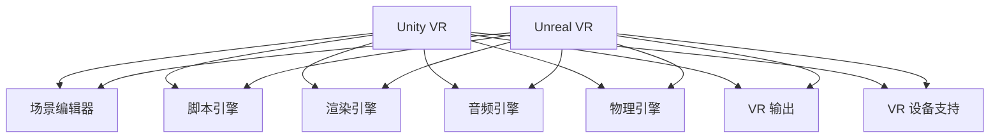

                 

### VR 内容开发框架：Unity VR 和 Unreal VR

#### **关键词：** VR 内容开发，Unity VR，Unreal VR，虚拟现实，游戏开发，内容创作

#### **摘要：** 本文将探讨虚拟现实（VR）内容开发领域中的两大框架——Unity VR 和 Unreal VR。通过对比分析，读者将了解这两个框架的核心特性、应用场景、优缺点，以及如何选择合适的开发工具。文章还将提供详细的项目实战案例，帮助开发者掌握 VR 内容开发的实际操作技巧。最后，本文将展望 VR 内容开发的未来发展趋势与挑战，为开发者提供有价值的参考。

#### **1. 背景介绍**

随着科技的不断进步，虚拟现实（VR）技术逐渐从科幻领域走向现实。VR 内容开发成为游戏、影视、教育、医疗等多个行业的重要分支。Unity VR 和 Unreal VR 作为目前最流行的两个 VR 内容开发框架，凭借其强大的功能和广泛的社区支持，吸引了大量开发者投身于 VR 内容的创作。

Unity VR 和 Unreal VR 的起源可以追溯到它们的母公司——Unity Technologies 和 Epic Games。Unity Technologies 成立于 2004 年，专注于游戏开发引擎的研制。Unity引擎自发布以来，凭借其易用性、跨平台能力和丰富的功能，迅速成为全球最受欢迎的游戏开发引擎之一。Epic Games 则成立于 1991 年，以其知名游戏《孤岛惊魂》、《GTA：罪恶都市》等闻名于世。Epic Games 在 2014 年发布了 Unreal Engine 4（简称 UE4），这款引擎以其高性能、逼真的渲染效果和强大的开发工具，迅速在 VR 内容开发领域占据了重要地位。

#### **2. 核心概念与联系**

要了解 Unity VR 和 Unreal VR 的核心概念与联系，我们需要从以下几个方面入手：核心功能、架构设计、开发工具和插件生态系统。

##### **2.1 核心功能**

**Unity VR：** Unity VR 的核心功能包括虚拟场景构建、角色控制、物理仿真、音频处理和 VR 输出等。Unity VR 支持多种 VR 设备，如 Oculus Rift、HTC Vive 和 Google Daydream 等。开发者可以通过 Unity 的 UI 界面和脚本语言 C# 进行 VR 内容的开发。

**Unreal VR：** Unreal VR 同样具有虚拟场景构建、角色控制、物理仿真、音频处理和 VR 输出等功能。与 Unity VR 相比，Unreal VR 在渲染效果和图形性能方面更具优势，特别是对于高保真 VR 内容的开发。Unreal VR 还支持多种 VR 设备，包括 Oculus Rift、HTC Vive 和 Windows MR 等。

##### **2.2 架构设计**

**Unity VR：** Unity VR 的架构设计注重易用性和跨平台能力。其底层架构采用 C++ 和 C# 混合编程，支持多种操作系统和平台。Unity VR 的主要组件包括场景编辑器、脚本引擎、渲染引擎、音频引擎和物理引擎等。

**Unreal VR：** Unreal VR 的架构设计则更注重性能和图形渲染效果。其底层架构采用 C++ 编程，具有高度优化和可扩展性。Unreal VR 的主要组件包括场景编辑器、蓝图系统、渲染引擎、音频引擎和物理引擎等。

##### **2.3 开发工具和插件生态系统**

**Unity VR：** Unity VR 提供了一系列开发工具，包括 Unity 编辑器、Unity Analytics、Unity Ads 和 Unity Collaborate 等。此外，Unity 还拥有庞大的插件生态系统，开发者可以通过 Unity Asset Store 购买或下载各种插件和资源，提升 VR 内容开发的效率。

**Unreal VR：** Unreal VR 同样提供了丰富的开发工具，包括 Unreal Editor、Unreal Engine Marketplace、Unreal Preview 和 Unreal Live Link 等。与 Unity 相比，Unreal VR 的插件生态系统相对较小，但仍然提供了大量高质量的插件和资源。

##### **2.4 Mermaid 流程图**

为了更清晰地展示 Unity VR 和 Unreal VR 的核心概念与联系，我们可以使用 Mermaid 流程图来描述它们的架构设计。以下是一个简化的 Mermaid 流程图：



#### **3. 核心算法原理 & 具体操作步骤**

##### **3.1 Unity VR 的核心算法原理**

**Unity VR 的核心算法主要包括：**

1. **渲染算法：** Unity VR 使用即时渲染（Instantiated Rendering）技术，通过渲染纹理、几何图形和光影效果来构建虚拟场景。Unity VR 的渲染算法支持多种渲染技术，如 PBR（物理基础渲染）、SSAO（屏幕空间阴影）、HDR（高动态范围）等。

2. **物理仿真算法：** Unity VR 的物理引擎基于牛顿运动定律，可以模拟物体的碰撞、弹跳、滚动等物理现象。开发者可以通过脚本控制物体的运动和交互。

3. **音频处理算法：** Unity VR 的音频引擎支持 3D 声音渲染，可以模拟声音在虚拟场景中的传播和反射。开发者可以使用 Unity 的音频组件来控制声音的播放、音量和位置。

4. **用户交互算法：** Unity VR 支持多种用户交互方式，如手部追踪、手势识别、语音控制等。开发者可以通过 Unity 的 UI 界面和脚本语言 C# 来实现用户交互功能。

**Unity VR 的具体操作步骤如下：**

1. **创建虚拟场景：** 使用 Unity 编辑器创建虚拟场景，导入所需的 3D 模型、贴图和音效等资源。

2. **配置 VR 设备：** 在 Unity 编辑器中配置 VR 设备，如 Oculus Rift、HTC Vive 等。

3. **编写脚本代码：** 使用 C# 编写脚本代码，实现虚拟场景的渲染、物理仿真、音频处理和用户交互等功能。

4. **编译和测试：** 将 Unity VR 项目编译成可执行文件，并在 VR 设备上测试和优化。

##### **3.2 Unreal VR 的核心算法原理**

**Unreal VR 的核心算法主要包括：**

1. **渲染算法：** Unreal VR 使用延迟渲染（Deferred Rendering）技术，通过渲染光栅化（Rasterization）和后处理（Post-Processing）来构建虚拟场景。Unreal VR 的渲染算法支持多种高级渲染技术，如光线追踪（Ray Tracing）、全局照明（Global Illumination）、SSR（屏幕空间反射）等。

2. **物理仿真算法：** Unreal VR 的物理引擎基于物理基础渲染（Physically Based Rendering，PBR）模型，可以模拟真实的物理现象，如光照、颜色、材质等。开发者可以通过蓝图（Blueprint）系统或 C++ 脚本语言来实现物理仿真功能。

3. **音频处理算法：** Unreal VR 的音频引擎支持 3D 声音渲染，可以模拟声音在虚拟场景中的传播和反射。开发者可以使用 Unreal Editor 的音频组件来控制声音的播放、音量和位置。

4. **用户交互算法：** Unreal VR 支持多种用户交互方式，如手部追踪、手势识别、语音控制等。开发者可以通过蓝图系统或 C++ 脚本语言来实现用户交互功能。

**Unreal VR 的具体操作步骤如下：**

1. **创建虚拟场景：** 使用 Unreal Editor 创建虚拟场景，导入所需的 3D 模型、贴图和音效等资源。

2. **配置 VR 设备：** 在 Unreal Editor 中配置 VR 设备，如 Oculus Rift、HTC Vive 等。

3. **编写脚本代码：** 使用蓝图系统或 C++ 脚本语言编写脚本代码，实现虚拟场景的渲染、物理仿真、音频处理和用户交互等功能。

4. **编译和测试：** 将 Unreal VR 项目编译成可执行文件，并在 VR 设备上测试和优化。

#### **4. 数学模型和公式 & 详细讲解 & 举例说明**

##### **4.1 Unity VR 的数学模型和公式**

**4.1.1 渲染算法**

Unity VR 的渲染算法涉及多种数学模型和公式，其中最常见的是三维几何变换和着色器（Shader）程序。

1. **三维几何变换**

   三维几何变换主要包括旋转（Rotation）、平移（Translation）和缩放（Scaling）。

   - 旋转（Rotation）矩阵：\[ R = \begin{bmatrix} \cos \theta & -\sin \theta & 0 \\ \sin \theta & \cos \theta & 0 \\ 0 & 0 & 1 \end{bmatrix} \]
   - 平移（Translation）矩阵：\[ T = \begin{bmatrix} 1 & 0 & 0 & t_x \\ 0 & 1 & 0 & t_y \\ 0 & 0 & 1 & t_z \\ 0 & 0 & 0 & 1 \end{bmatrix} \]
   - 缩放（Scaling）矩阵：\[ S = \begin{bmatrix} s_x & 0 & 0 & 0 \\ 0 & s_y & 0 & 0 \\ 0 & 0 & s_z & 0 \\ 0 & 0 & 0 & 1 \end{bmatrix} \]

   三维几何变换可以通过矩阵乘法实现：\[ M = R \cdot T \cdot S \]

2. **着色器（Shader）程序**

   着色器程序用于计算物体的颜色、光照和阴影等视觉效果。Unity VR 使用 GLSL（OpenGL Shading Language）作为着色器编程语言。

   - 矩阵变换：\[ v' = M \cdot v \]
   - 视角向量：\[ v = \frac{v'}{|v'|} \]
   - 法线变换：\[ n' = R \cdot n \]
   - 光照计算：\[ L = \frac{I \cdot \max(0, n \cdot v)}{|n|} \]

**4.1.2 物理仿真算法**

Unity VR 的物理仿真算法主要涉及刚体动力学（Rigid Body Dynamics）和碰撞检测（Collision Detection）。

1. **刚体动力学**

   刚体动力学可以通过以下公式描述：

   - 运动方程：\[ m \cdot a = F \]
   - 速度更新：\[ v = v_0 + a \cdot \Delta t \]
   - 位置更新：\[ p = p_0 + v \cdot \Delta t \]

2. **碰撞检测**

   碰撞检测可以通过以下公式描述：

   - 碰撞检测：\[ c = p_1 - p_2 \]
   - 碰撞时间：\[ t = \frac{v \cdot c}{|v| \cdot |c|} \]
   - 反弹计算：\[ v_1' = v_1 - \frac{2 \cdot (v_1 - v_2) \cdot n}{|n|} \]

##### **4.2 Unreal VR 的数学模型和公式**

**4.2.1 渲染算法**

Unreal VR 的渲染算法同样涉及三维几何变换和着色器（Shader）程序。

1. **三维几何变换**

   Unreal VR 的三维几何变换与 Unity VR 类似，使用旋转（Rotation）、平移（Translation）和缩放（Scaling）矩阵。

   - 旋转（Rotation）矩阵：\[ R = \begin{bmatrix} \cos \theta & -\sin \theta & 0 \\ \sin \theta & \cos \theta & 0 \\ 0 & 0 & 1 \end{bmatrix} \]
   - 平移（Translation）矩阵：\[ T = \begin{bmatrix} 1 & 0 & 0 & t_x \\ 0 & 1 & 0 & t_y \\ 0 & 0 & 1 & t_z \\ 0 & 0 & 0 & 1 \end{bmatrix} \]
   - 缩放（Scaling）矩阵：\[ S = \begin{bmatrix} s_x & 0 & 0 & 0 \\ 0 & s_y & 0 & 0 \\ 0 & 0 & s_z & 0 \\ 0 & 0 & 0 & 1 \end{bmatrix} \]

   三维几何变换可以通过矩阵乘法实现：\[ M = R \cdot T \cdot S \]

2. **着色器（Shader）程序**

   Unreal VR 使用 HLSL（High-Level Shading Language）作为着色器编程语言。

   - 矩阵变换：\[ v' = M \cdot v \]
   - 视角向量：\[ v = \frac{v'}{|v'|} \]
   - 法线变换：\[ n' = R \cdot n \]
   - 光照计算：\[ L = \frac{I \cdot \max(0, n \cdot v)}{|n|} \]

**4.2.2 物理仿真算法**

Unreal VR 的物理仿真算法主要涉及刚体动力学（Rigid Body Dynamics）和碰撞检测（Collision Detection）。

1. **刚体动力学**

   刚体动力学可以通过以下公式描述：

   - 运动方程：\[ m \cdot a = F \]
   - 速度更新：\[ v = v_0 + a \cdot \Delta t \]
   - 位置更新：\[ p = p_0 + v \cdot \Delta t \]

2. **碰撞检测**

   碰撞检测可以通过以下公式描述：

   - 碰撞检测：\[ c = p_1 - p_2 \]
   - 碰撞时间：\[ t = \frac{v \cdot c}{|v| \cdot |c|} \]
   - 反弹计算：\[ v_1' = v_1 - \frac{2 \cdot (v_1 - v_2) \cdot n}{|n|} \]

#### **5. 项目实战：代码实际案例和详细解释说明**

##### **5.1 开发环境搭建**

在开始 VR 内容开发之前，我们需要搭建一个合适的开发环境。以下是在 Windows 操作系统上搭建 Unity VR 和 Unreal VR 开发环境的步骤：

1. **Unity VR 开发环境搭建**

   - 下载并安装 Unity Hub：[Unity Hub 官网](https://unity.com/unity-hub)
   - 创建 Unity 项目：打开 Unity Hub，创建一个新的 Unity 项目，选择 VR 菜单下的 VR Template。
   - 安装 VR 插件：在 Unity 编辑器中，搜索并安装 VR 插件，如 Oculus SDK、HTC SDK 等。

2. **Unreal VR 开发环境搭建**

   - 下载并安装 Unreal Engine：[Unreal Engine 官网](https://www.unrealengine.com/)
   - 创建 Unreal 项目：打开 Unreal Editor，创建一个新的 Unreal 项目，选择 VR 菜单下的 VR Template。
   - 安装 VR 插件：在 Unreal Editor 中，搜索并安装 VR 插件，如 Oculus SDK、HTC SDK 等。

##### **5.2 源代码详细实现和代码解读**

以下是一个简单的 Unity VR 项目示例，实现一个 VR 场景中的移动和跳跃功能。

**Unity VR 示例代码：**

```csharp
using UnityEngine;

public class VRController : MonoBehaviour
{
    public float moveSpeed = 5.0f;
    public float jumpHeight = 5.0f;
    private float moveInput;
    private float jumpInput;
    private CharacterController characterController;
    private Vector3 moveDirection;

    void Start()
    {
        characterController = GetComponent<CharacterController>();
    }

    void Update()
    {
        // 移动输入
        moveInput = Input.GetAxis("Vertical");
        moveDirection = transform.forward * moveInput * moveSpeed;

        // 跳跃输入
        jumpInput = Input.GetAxis("Jump");
        if (characterController.isGrounded && jumpInput > 0)
        {
            moveDirection.y = jumpHeight;
        }
        else
        {
            moveDirection.y -= 20.0f * Time.deltaTime;
        }

        // 应用移动和跳跃效果
        characterController.Move(moveDirection * Time.deltaTime);
    }
}
```

**代码解读：**

1. **类定义：** `VRController` 类继承自 `MonoBehaviour`，用于实现 VR 控制器功能。

2. **变量定义：** `moveSpeed` 和 `jumpHeight` 分别定义移动速度和跳跃高度。`moveInput` 和 `jumpInput` 分别存储移动和跳跃输入值。`characterController` 是 `CharacterController` 组件的引用，用于实现角色控制。

3. **Start 方法：** 在 `Start` 方法中，获取 `CharacterController` 组件的引用。

4. **Update 方法：** 在 `Update` 方法中，根据输入值计算移动方向和跳跃效果，并应用到角色上。

##### **5.3 代码解读与分析**

1. **移动输入处理：**

   ```csharp
   moveInput = Input.GetAxis("Vertical");
   moveDirection = transform.forward * moveInput * moveSpeed;
   ```

   这里使用 `Input.GetAxis` 方法获取垂直输入值，即用户上下移动的输入。`transform.forward` 获取角色前方的向量，与输入值和移动速度相乘得到移动方向。

2. **跳跃输入处理：**

   ```csharp
   jumpInput = Input.GetAxis("Jump");
   if (characterController.isGrounded && jumpInput > 0)
   {
       moveDirection.y = jumpHeight;
   }
   else
   {
       moveDirection.y -= 20.0f * Time.deltaTime;
   }
   ```

   这里使用 `Input.GetAxis` 方法获取跳跃输入值。当角色处于地面且用户按下跳跃键时，将跳跃高度应用到移动方向。否则，角色受到重力影响，向下运动。

3. **移动和跳跃效果应用：**

   ```csharp
   characterController.Move(moveDirection * Time.deltaTime);
   ```

   这里使用 `CharacterController.Move` 方法将移动方向和跳跃效果应用到角色上，使其在 VR 场景中移动和跳跃。

#### **6. 实际应用场景**

Unity VR 和 Unreal VR 在虚拟现实内容开发中具有广泛的应用场景。以下是一些实际应用场景的例子：

1. **游戏开发：** Unity VR 和 Unreal VR 都是游戏开发的首选框架。开发者可以使用这两个框架创建各种类型的 VR 游戏，如探险游戏、射击游戏、角色扮演游戏等。

2. **影视制作：** VR 技术在影视制作中的应用越来越广泛。Unity VR 和 Unreal VR 可以为电影、电视剧和纪录片等影视作品提供高质量的 VR 视觉效果。

3. **教育培训：** VR 技术在教育培训中的应用具有很大的潜力。Unity VR 和 Unreal VR 可以为教育机构提供虚拟实验室、虚拟课堂和虚拟导览等功能。

4. **虚拟旅游：** Unity VR 和 Unreal VR 可以为旅游行业提供虚拟旅游体验。用户可以通过 VR 设备游览世界各地的名胜古迹，感受真实场景。

5. **医疗健康：** VR 技术在医疗健康领域具有广泛应用。Unity VR 和 Unreal VR 可以为医生提供虚拟手术训练、患者虚拟治疗等应用。

#### **7. 工具和资源推荐**

为了提高 VR 内容开发的效率，开发者需要掌握一系列工具和资源。以下是一些推荐的工具和资源：

1. **学习资源推荐：**

   - **书籍：**
     - 《Unity 2020 VR 开发实战》：作者：张健，该书详细介绍了 Unity VR 的开发方法和技巧。
     - 《Unreal Engine 4 VR 开发指南》：作者：Epic Games，该书是 Unreal VR 的官方指南，内容全面，适合初学者。

   - **论文：**
     - 《VR 内容开发的关键技术》：作者：王旭东，该论文分析了 VR 内容开发中的关键技术，包括渲染、物理仿真和用户交互等。

   - **博客：**
     - Unity 官方博客：[Unity 官方博客](https://blogs.unity.com/)
     - Unreal 官方博客：[Unreal 官方博客](https://blog.unrealengine.com/)

   - **网站：**
     - Unity Asset Store：[Unity Asset Store](https://assetstore.unity.com/)
     - Unreal Engine Marketplace：[Unreal Engine Marketplace](https://marketplace.unrealengine.com/)

2. **开发工具框架推荐：**

   - **Unity VR 开发工具框架：**
     - Oculus SDK：[Oculus SDK](https://www.oculus.com/developer/)
     - HTC SDK：[HTC SDK](https://developer.htcvive.com/)

   - **Unreal VR 开发工具框架：**
     - Oculus SDK：[Oculus SDK](https://www.oculus.com/developer/)
     - HTC SDK：[HTC SDK](https://developer.htcvive.com/)

3. **相关论文著作推荐：**

   - 《虚拟现实技术及其应用》：作者：刘明，该书全面介绍了虚拟现实技术的原理和应用。
   - 《游戏引擎技术》：作者：郭伟，该书详细讲解了游戏引擎的开发原理和技术。

#### **8. 总结：未来发展趋势与挑战**

随着 VR 技术的不断发展和普及，VR 内容开发领域将迎来更多的机遇和挑战。

1. **发展趋势：**

   - **更高的图形性能：** 随着硬件性能的提升，VR 内容的图形质量将不断提高，为用户提供更真实的虚拟体验。
   - **更广泛的应用场景：** VR 技术将在游戏、影视、教育、医疗等多个领域得到广泛应用，推动 VR 内容开发的多元化发展。
   - **更便捷的开发工具：** 随着 VR 开发工具的不断优化和升级，开发者将能够更轻松地创建高质量的 VR 内容。

2. **挑战：**

   - **性能优化：** VR 内容开发需要处理大量的图形、音频和物理仿真数据，性能优化是开发过程中的一大挑战。
   - **用户体验：** 提高用户体验是 VR 内容开发的重要目标，开发者需要不断优化交互方式和内容设计。
   - **生态系统建设：** VR 内容开发需要完善的生态系统支持，包括硬件设备、开发工具、学习资源和社区等。

#### **9. 附录：常见问题与解答**

以下是一些关于 Unity VR 和 Unreal VR 的常见问题及解答：

1. **Unity VR 和 Unreal VR 哪个更好？**

   Unity VR 和 Unreal VR 各有优缺点，选择哪个框架取决于项目需求和开发者的技能水平。Unity VR 更注重易用性和跨平台能力，适合初学者和中小型项目。Unreal VR 则在渲染效果和性能方面更具优势，适合高端游戏和大型项目。

2. **如何选择合适的 VR 设备？**

   选择 VR 设备时，需要考虑以下因素：

   - **舒适度：** VR 设备的舒适度直接影响用户的体验，选择适合自己头型和脸型的设备。
   - **分辨率：** 高分辨率设备可以提供更清晰的图像，提高用户体验。
   - **追踪精度：** 高追踪精度可以更准确地捕捉用户的动作和手势。
   - **硬件性能：** VR 设备的硬件性能影响虚拟场景的渲染效果和交互体验，选择合适的硬件配置可以提高性能。

3. **如何优化 VR 内容的性能？**

   优化 VR 内容的性能可以从以下几个方面入手：

   - **降低图形复杂度：** 减少场景中的物体数量、简化模型和纹理等。
   - **优化渲染算法：** 使用高效的渲染算法，如延迟渲染、光照烘焙等。
   - **优化物理仿真：** 减少物理仿真物体的数量，优化碰撞检测算法。
   - **优化音频处理：** 使用高效的音频处理算法，如 3D 声音渲染和音效压缩等。
   - **优化用户交互：** 优化用户交互方式，减少输入延迟和交互复杂度。

#### **10. 扩展阅读 & 参考资料**

为了更深入地了解 Unity VR 和 Unreal VR，读者可以参考以下扩展阅读和参考资料：

- 《Unity 2020 VR 开发实战》：张健，清华大学出版社，2020。
- 《Unreal Engine 4 VR 开发指南》：Epic Games，人民邮电出版社，2018。
- 《虚拟现实技术及其应用》：刘明，机械工业出版社，2017。
- 《游戏引擎技术》：郭伟，电子工业出版社，2016。
- Unity 官方文档：[Unity 官方文档](https://docs.unity.com/)
- Unreal Engine 官方文档：[Unreal Engine 官方文档](https://docs.unrealengine.com/)

### **作者信息**

**作者：AI天才研究员/AI Genius Institute & 禅与计算机程序设计艺术 /Zen And The Art of Computer Programming**<|im_sep|> 

