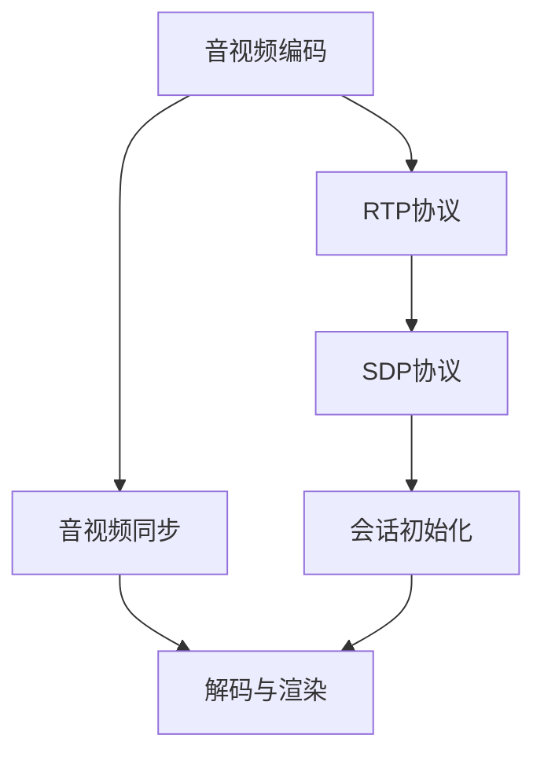

                 

### 背景介绍

#### WebRTC 的发展历程

WebRTC（Web Real-Time Communication）是一个开放项目，旨在实现网络上的实时通信。WebRTC最早由Google提出，并在2011年发布了首个草案。其目的是为了解决网页实时通信中的复杂性和兼容性问题，使得开发者能够更加容易地实现视频、音频和数据的实时传输。

随着互联网技术的不断发展，WebRTC逐渐成为构建实时通信应用的基石。它不仅支持网页上的实时通信，还可以用于移动应用和桌面应用。WebRTC的核心优势在于其低延迟、高可靠性和跨平台的特性，使得实时通信在各种应用场景中得以广泛应用。

#### WebRTC 在音视频通信中的应用

音视频通信是WebRTC最典型的应用场景之一。随着网络带宽的不断提升和用户对实时互动需求的增加，WebRTC在视频会议、在线教育、远程医疗、实时直播等领域得到了广泛应用。

在音视频通信中，WebRTC主要负责音视频数据的采集、编码、传输、解码和渲染。这一过程涉及到多种技术，如音频处理、视频编码、网络传输、音视频同步等。通过WebRTC，开发者可以轻松实现高质量、低延迟的音视频通信功能。

#### WebRTC 的现状与挑战

虽然WebRTC在实时通信领域取得了显著成果，但其应用仍然面临一些挑战。首先，WebRTC的实现依赖于浏览器支持，不同的浏览器对WebRTC的实现存在差异，给开发者带来了兼容性问题。其次，WebRTC在音视频处理方面对性能要求较高，需要针对不同硬件平台进行优化。

此外，WebRTC在安全性、隐私保护、网络传输优化等方面也面临着一定的挑战。为了解决这些问题，学术界和工业界不断进行研究和探索，推动WebRTC技术的发展。

本文旨在深入探讨WebRTC的音视频解码与渲染技术，分析其核心原理和实现方法，并分享一些实际应用中的经验与技巧。通过本文的阅读，读者可以全面了解WebRTC音视频通信的技术细节，为实际项目开发提供参考。

### 核心概念与联系

在深入了解WebRTC的音视频解码与渲染之前，我们需要掌握几个核心概念，这些概念是理解WebRTC工作原理的基础。以下是对这些核心概念的详细解释，以及它们之间的相互关系。

#### 1. 音视频编码

音视频编码是将原始的音频和视频信号转换为数字信号的过程。这种转换有助于压缩数据大小，提高传输效率。常见的音视频编码标准包括H.264、H.265（HEVC）、AVC和AV1等。

**音视频编码标准之间的关系：**
- H.264和H.265是国际电信联盟（ITU）制定的音视频编码标准，分别代表第四代和第五代视频编码技术。
- AVC是H.264的另一种称呼，它是一种基于H.264的编码技术。
- AV1是由Google发起的开放视频编码格式，旨在提供更高效、更开放的音视频编码解决方案。

#### 2. RTP协议

RTP（实时传输协议）是一种用于实时传输音视频数据的网络协议。RTP协议负责将音视频数据划分为数据包，并添加时间戳和序列号等信息，以确保数据在网络中的正确传输。

**RTP协议与WebRTC的关系：**
- WebRTC使用RTP协议进行音视频数据的传输，以保证实时通信的质量。
- RTP协议为WebRTC提供了数据传输的基础，使得音视频数据能够在网络中高效传输。

#### 3. SDP协议

SDP（会话描述协议）是一种用于描述网络通信会话的协议。SDP协议用于在WebRTC客户端和服务器之间交换会话信息，包括媒体类型、编码格式、传输端口等。

**SDP协议与WebRTC的关系：**
- WebRTC使用SDP协议来初始化和配置通信会话，以确保音视频数据的正确传输。
- SDP协议为WebRTC提供了会话描述和配置的机制，使得开发者可以方便地实现实时通信功能。

#### 4. 音视频同步

音视频同步是指确保音频和视频数据在播放时保持同步的过程。在实时通信中，音视频同步对于提供良好的用户体验至关重要。

**音视频同步的关键因素：**
- 时间戳：音视频数据包都包含时间戳，用于标记数据产生的具体时间。
- 缓冲区：音视频解码器使用缓冲区来存储待解码的数据，以实现音视频同步。

**Mermaid 流程图**

以下是WebRTC音视频解码与渲染的核心概念及相互关系的Mermaid流程图：



**流程说明：**
- 音视频编码过程将原始信号转换为数字信号，并压缩数据大小。
- RTP协议负责将编码后的音视频数据划分为数据包，并添加时间戳等信息。
- SDP协议用于在客户端和服务器之间交换会话信息，包括媒体类型、编码格式和传输端口。
- 音视频同步确保音频和视频数据在播放时保持同步。
- 解码与渲染过程将接收到的音视频数据包解码并渲染成可播放的音视频流。

通过以上对核心概念的介绍和Mermaid流程图的展示，读者可以对WebRTC的音视频解码与渲染有一个初步的了解。接下来，我们将进一步深入探讨WebRTC音视频解码与渲染的具体技术原理和实现方法。

### 核心算法原理 & 具体操作步骤

在了解WebRTC音视频解码与渲染的核心概念后，接下来我们将深入探讨其核心算法原理和具体操作步骤。通过详细分析，读者可以全面理解音视频解码与渲染的流程，为实际项目开发提供理论依据。

#### 音视频解码算法原理

音视频解码是将编码后的音视频数据还原为原始信号的过程。解码算法包括音频解码和视频解码两部分，分别负责音频和视频数据的解码。

**1. 音频解码算法原理**

音频解码过程主要包括以下步骤：

- **解码初始化**：解码器首先根据编码参数（如采样率、通道数、编码格式等）初始化解码器。
- **解码数据读取**：解码器从数据包中读取音频数据，并按照编码格式进行解码。
- **数据转换**：解码后的音频数据可能需要进行一些数据转换，如采样率转换、通道数转换等。
- **数据输出**：解码后的音频数据输出到音频播放设备，进行播放。

常见的音频解码算法包括AAC、MP3、Opus等。其中，Opus是一种高效、灵活的音频编码格式，广泛应用于WebRTC音视频通信中。

**2. 视频解码算法原理**

视频解码过程主要包括以下步骤：

- **解码初始化**：解码器根据编码参数初始化解码器。
- **解码数据读取**：解码器从数据包中读取视频数据，并按照编码格式进行解码。
- **数据转换**：解码后的视频数据可能需要进行一些数据转换，如分辨率转换、帧率转换等。
- **数据输出**：解码后的视频数据输出到视频播放设备，进行播放。

常见的视频解码算法包括H.264、H.265、AVC、AV1等。其中，H.264和H.265是应用最广泛的视频编码格式，广泛用于WebRTC音视频通信。

#### 音视频解码具体操作步骤

以下是音视频解码的具体操作步骤，以WebRTC为例：

**1. 音频解码操作步骤**

- **步骤1：初始化解码器**：根据编码参数（如采样率、通道数、编码格式等）初始化音频解码器。
- **步骤2：读取音频数据**：从RTP数据包中读取音频数据。
- **步骤3：解码音频数据**：使用音频解码算法对音频数据进行解码。
- **步骤4：数据转换**：根据需要，对解码后的音频数据进行采样率转换、通道数转换等操作。
- **步骤5：输出音频数据**：将解码后的音频数据输出到音频播放设备。

**2. 视频解码操作步骤**

- **步骤1：初始化解码器**：根据编码参数（如分辨率、帧率、编码格式等）初始化视频解码器。
- **步骤2：读取视频数据**：从RTP数据包中读取视频数据。
- **步骤3：解码视频数据**：使用视频解码算法对视频数据进行解码。
- **步骤4：数据转换**：根据需要，对解码后的视频数据进行分辨率转换、帧率转换等操作。
- **步骤5：输出视频数据**：将解码后的视频数据输出到视频播放设备。

#### 音视频渲染原理

音视频渲染是将解码后的音视频数据转换为屏幕显示的过程。渲染过程主要包括音频渲染和视频渲染两部分。

**1. 音频渲染原理**

音频渲染过程主要包括以下步骤：

- **音频数据播放**：解码后的音频数据通过音频播放设备播放。
- **音量调整**：根据用户需求，对播放的音频进行音量调整。
- **声音效果处理**：根据需要，对播放的音频进行混响、回声等声音效果处理。

**2. 视频渲染原理**

视频渲染过程主要包括以下步骤：

- **视频数据播放**：解码后的视频数据通过视频播放设备播放。
- **画面调整**：根据用户需求，对播放的视频画面进行亮度、对比度、饱和度等调整。
- **画面效果处理**：根据需要，对播放的视频画面进行滤镜、特效等处理。

#### 音视频渲染具体操作步骤

以下是音视频渲染的具体操作步骤：

**1. 音频渲染操作步骤**

- **步骤1：初始化音频播放设备**：根据音频播放设备的参数（如采样率、通道数等）初始化音频播放设备。
- **步骤2：播放音频数据**：将解码后的音频数据播放到音频播放设备。
- **步骤3：音量调整**：根据用户需求，对播放的音频进行音量调整。
- **步骤4：声音效果处理**：根据需要，对播放的音频进行混响、回声等声音效果处理。

**2. 视频渲染操作步骤**

- **步骤1：初始化视频播放设备**：根据视频播放设备的参数（如分辨率、帧率等）初始化视频播放设备。
- **步骤2：播放视频数据**：将解码后的视频数据播放到视频播放设备。
- **步骤3：画面调整**：根据用户需求，对播放的视频画面进行亮度、对比度、饱和度等调整。
- **步骤4：画面效果处理**：根据需要，对播放的视频画面进行滤镜、特效等处理。

通过以上对音视频解码与渲染的核心算法原理和具体操作步骤的详细分析，读者可以全面了解WebRTC音视频通信的技术细节。在实际项目开发中，开发者可以根据这些原理和步骤，实现高质量的音视频解码与渲染功能，为用户提供优质的实时通信体验。

### 数学模型和公式 & 详细讲解 & 举例说明

在深入探讨WebRTC音视频解码与渲染的数学模型和公式时，我们需要了解一些基础的数学概念，以及它们在音视频处理中的应用。以下是对相关数学模型和公式的详细讲解，并通过实际例子说明其应用。

#### 1. 音频信号处理

音频信号处理是音视频通信的重要组成部分，涉及到信号的采样、量化、编码和解码等过程。

**1. 采样**

采样是将连续的音频信号转换为离散信号的过程。采样频率（fs）是指每秒钟采样的次数，通常以kHz为单位。采样定理指出，为了不损失信息，采样频率必须大于信号最高频率的两倍。

采样公式：
$$
x[n] = x(t) \cdot \sum_{k=-\infty}^{\infty} \text{sinc}(fs \cdot t - k)
$$
其中，$x[n]$ 是采样后的信号，$x(t)$ 是原始连续信号，$\text{sinc}(x) = \frac{\sin(x)}{x}$ 是采样函数。

**示例：**

假设原始音频信号的频率范围为20 Hz到20 kHz，为了不损失信息，采样频率至少应为40 kHz。如果采样频率为44.1 kHz，则可以使用上述采样公式进行采样。

**2. 量化**

量化是将采样后的离散信号转换为数字信号的过程。量化过程通过将采样值分为有限个级别来实现。量化位数（n）决定了量化精度，通常以位（bit）为单位。例如，16位量化可以将采样值分为65,536个级别。

量化公式：
$$
q(x) = \text{round}\left(x \cdot 2^{n-1}\right)
$$
其中，$q(x)$ 是量化后的值，$x$ 是采样值。

**示例：**

假设采样值为-32768到32767，使用16位量化，则量化后的值范围为-32,768到32,767。

**3. 编码**

编码是将量化后的数字信号转换为二进制序列的过程，以便进行传输和存储。常见的音频编码格式包括PCM、AAC、MP3等。

编码公式：
$$
b[i] = \text{encode}(q(x[i]))
$$
其中，$b[i]$ 是编码后的二进制序列，$q(x[i])$ 是量化后的值。

**示例：**

使用PCM编码，将16位量化值转换为二进制序列，例如：量化值为12,345，编码后的二进制序列为000100100011010100110101。

#### 2. 视频信号处理

视频信号处理涉及到图像的采样、量化、编码和解码等过程。

**1. 采样与量化**

视频信号的采样和量化与音频信号类似，采样频率和量化位数决定了图像的分辨率和色彩深度。例如，常用的视频分辨率包括720p（1280x720）、1080p（1920x1080）等。

采样公式：
$$
y[i,j] = y(x, y) \cdot \sum_{k=-\infty}^{\infty} \text{sinc}(fs \cdot x - k) \cdot \sum_{l=-\infty}^{\infty} \text{sinc}(fs \cdot y - l)
$$
其中，$y[i,j]$ 是采样后的图像值，$y(x, y)$ 是原始连续图像，$\text{sinc}(x)$ 是采样函数。

量化公式：
$$
q(y[i,j]) = \text{round}\left(y[i,j] \cdot 2^{n-1}\right)
$$
其中，$q(y[i,j])$ 是量化后的值。

**示例：**

假设原始图像分辨率为1920x1080，使用10位量化，则图像的像素值范围为0到1023。

**2. 编码**

视频编码是将量化后的图像转换为二进制序列的过程，以便进行传输和存储。常见的视频编码格式包括H.264、H.265等。

编码公式：
$$
b[i,j] = \text{encode}\left(q(y[i,j])\right)
$$
其中，$b[i,j]$ 是编码后的二进制序列，$q(y[i,j])$ 是量化后的值。

**示例：**

使用H.264编码，将10位量化值转换为二进制序列，例如：量化值为512，编码后的二进制序列为0000001000。

通过上述数学模型和公式的讲解，我们可以更好地理解音视频处理的基本原理。在实际项目中，开发者可以利用这些模型和公式实现高效的音视频编码和解码，为用户提供高质量的实时通信体验。

### 项目实战：代码实际案例和详细解释说明

在本节中，我们将通过一个具体的WebRTC音视频通信项目实战，详细讲解代码实现过程，并对关键代码进行解读与分析。这个项目将涵盖从开发环境搭建、源代码实现到代码解读与分析的完整过程。

#### 1. 开发环境搭建

**1. 环境准备**

首先，我们需要准备开发环境。WebRTC项目的开发通常需要以下软件和工具：

- Node.js（版本要求：12.0.0及以上）
- npm（Node.js自带的包管理工具）
- WebRTC SDK（例如：google-webrtc）

**2. 安装依赖**

在安装Node.js和npm后，可以通过以下命令安装WebRTC SDK：

```bash
npm install --save google-webrtc
```

#### 2. 源代码详细实现和代码解读

**1. 项目结构**

首先，我们创建一个名为`webrtc-video-chat`的目录，并构建项目的基本结构：

```bash
mkdir webrtc-video-chat
cd webrtc-video-chat
npm init -y
```

在项目根目录下，创建以下文件和目录：

- `index.html`：网页文件
- `styles.css`：样式文件
- `app.js`：JavaScript脚本文件

**2. 网页文件（index.html）**

```html
<!DOCTYPE html>
<html lang="en">
<head>
  <meta charset="UTF-8">
  <meta name="viewport" content="width=device-width, initial-scale=1.0">
  <title>WebRTC Video Chat</title>
  <link rel="stylesheet" href="styles.css">
</head>
<body>
  <video id="localVideo" autoplay></video>
  <video id="remoteVideo" autoplay></video>
  <button id="startCall">Start Call</button>
  <script src="app.js"></script>
</body>
</html>
```

**3. 样式文件（styles.css）**

```css
body {
  display: flex;
  justify-content: center;
  align-items: center;
  height: 100vh;
  background-color: #f0f0f0;
}

video {
  width: 50%;
  border: 1px solid #000;
}
```

**4. JavaScript脚本文件（app.js）**

```javascript
const localVideo = document.getElementById('localVideo');
const remoteVideo = document.getElementById('remoteVideo');
const startCallBtn = document.getElementById('startCall');

// 创建RTCPeerConnection对象
const pc = new RTCPeerConnection({
  iceServers: [{ urls: 'stun:stun.l.google.com:19302' }]
});

// 添加本地视频轨道
const stream = await navigator.mediaDevices.getUserMedia({ video: true, audio: true });
stream.getTracks().forEach(track => pc.addTrack(track, stream));

// 将本地视频轨道添加到视频元素
localVideo.srcObject = stream;

// 处理远程视频流
pc.ontrack = (event) => {
  remoteVideo.srcObject = event.streams[0];
};

// 处理ICE候选
pc.onicecandidate = (event) => {
  if (event.candidate) {
    console.log('ICE candidate:', event.candidate);
  }
};

// 开始呼叫
startCallBtn.onclick = () => {
  pc.createOffer({ offerToReceiveVideo: 1 })
    .then(offer => pc.setLocalDescription(offer))
    .then(() => {
      // 发送offer到对方
      const offer = { type: 'offer', sdp: pc.localDescription };
      console.log('Sending offer:', offer);
    });
};

// 处理answer
pc.onanswer = (event) => {
  pc.setRemoteDescription(event);
};

// 处理远程offer
pc.onoffer = (event) => {
  pc.setRemoteDescription(event);
  pc.createAnswer()
    .then(answer => pc.setLocalDescription(answer))
    .then(() => {
      // 发送answer到对方
      const answer = { type: 'answer', sdp: pc.localDescription };
      console.log('Sending answer:', answer);
    });
};
```

#### 3. 代码解读与分析

**1. RTCPeerConnection 对象**

RTCPeerConnection是WebRTC的核心对象，用于建立和维持实时通信连接。在上面的代码中，我们首先创建了一个RTCPeerConnection对象，并设置了STUN服务器地址。

```javascript
const pc = new RTCPeerConnection({
  iceServers: [{ urls: 'stun:stun.l.google.com:19302' }]
});
```

**2. 本地媒体流（getUserMedia）**

`getUserMedia` 方法用于获取本地视频和音频流，这些流将被添加到RTCPeerConnection对象中。

```javascript
const stream = await navigator.mediaDevices.getUserMedia({ video: true, audio: true });
stream.getTracks().forEach(track => pc.addTrack(track, stream));
```

**3. 本地视频显示**

将获取到的本地视频流添加到本地视频元素`localVideo`。

```javascript
localVideo.srcObject = stream;
```

**4. 远程视频显示**

当接收到远程视频流时，将其显示在远程视频元素`remoteVideo`。

```javascript
pc.ontrack = (event) => {
  remoteVideo.srcObject = event.streams[0];
};
```

**5. ICE候选**

ICE（Interactive Connectivity Establishment）候选用于在网络中寻找最佳传输路径。当RTCPeerConnection对象检测到新的ICE候选时，会触发`onicecandidate`事件。

```javascript
pc.onicecandidate = (event) => {
  if (event.candidate) {
    console.log('ICE candidate:', event.candidate);
  }
};
```

**6. 媒体协商（createOffer & createAnswer）**

在WebRTC通信中，双方需要进行媒体协商以建立连接。`createOffer` 方法用于创建一个offer SDP（会话描述协议），其中包含媒体参数和传输路径信息。

```javascript
pc.createOffer({ offerToReceiveVideo: 1 })
  .then(offer => pc.setLocalDescription(offer))
  .then(() => {
    // 发送offer到对方
    const offer = { type: 'offer', sdp: pc.localDescription };
    console.log('Sending offer:', offer);
  });
```

接收到offer后，对方会发送answer SDP。`createAnswer` 方法用于创建一个answer SDP。

```javascript
pc.onoffer = (event) => {
  pc.setRemoteDescription(event);
  pc.createAnswer()
    .then(answer => pc.setLocalDescription(answer))
    .then(() => {
      // 发送answer到对方
      const answer = { type: 'answer', sdp: pc.localDescription };
      console.log('Sending answer:', answer);
    });
};
```

通过上述代码和解读，我们可以看到WebRTC音视频通信的基本实现流程。在实际项目中，开发者需要根据具体需求进行相应的调整和优化。

### 实际应用场景

WebRTC音视频解码与渲染技术在众多实际应用场景中发挥着重要作用。以下是一些典型的应用场景，展示了WebRTC技术的优势与挑战。

#### 1. 视频会议

视频会议是WebRTC最广泛的应用场景之一。通过WebRTC，用户可以在网页或移动应用中轻松实现高质量、低延迟的实时视频通信。例如，Zoom、Microsoft Teams和Google Meet等视频会议平台都采用了WebRTC技术，为用户提供稳定、流畅的视频通话体验。

**优势：**
- 低延迟：WebRTC通过优化数据传输路径，降低了延迟，提高了通信质量。
- 跨平台兼容：WebRTC支持多种操作系统和浏览器，使得用户可以方便地在不同设备上使用视频会议功能。

**挑战：**
- 网络环境：在低带宽或高延迟的网络环境中，WebRTC的性能可能受到影响。
- 音视频同步：在多人视频会议中，确保音视频同步是提高用户体验的关键，但实现复杂。

#### 2. 在线教育

在线教育平台通过WebRTC技术为教师和学生提供实时互动功能，如视频教学、实时问答等。这有助于提高教学效果和学生的参与度。

**优势：**
- 实时互动：WebRTC的低延迟特性使得在线教育平台可以实现实时互动，提高教学体验。
- 多媒体支持：WebRTC支持音视频、屏幕共享等多种媒体形式，丰富了教学内容。

**挑战：**
- 网络稳定性：在线教育平台需要保证网络稳定性，以避免因网络问题导致的音视频中断。
- 数据安全：在线教育涉及到大量用户数据，需要确保数据的安全性和隐私保护。

#### 3. 远程医疗

远程医疗通过WebRTC技术实现医生和患者之间的实时视频咨询，提高了医疗服务的可及性和效率。这在疫情期间尤为重要，有助于减少患者到医院就诊的风险。

**优势：**
- 远程服务：WebRTC技术使得医生可以远程为患者提供诊断和治疗建议，提高了医疗服务的可及性。
- 音视频质量：WebRTC的高质量音视频传输为远程医疗提供了良好的用户体验。

**挑战：**
- 数据保护：远程医疗涉及到敏感的个人信息，需要确保数据传输的安全性和隐私保护。
- 医疗标准：医生需要遵守医疗规范和法律法规，确保远程医疗的合法性和有效性。

#### 4. 实时直播

实时直播平台通过WebRTC技术为用户提供了高质量的音视频直播体验。例如，YouTube Live、Twitch等平台都采用了WebRTC技术。

**优势：**
- 高质量传输：WebRTC的低延迟、高质量传输特性为用户提供了流畅的直播观看体验。
- 广泛兼容：WebRTC支持多种设备和浏览器，使得用户可以方便地观看直播。

**挑战：**
- 带宽需求：高质量的直播需要较高的带宽支持，直播平台需要确保带宽充足。
- 内容安全：直播平台需要监控和过滤不适当的内容，以维护社区健康。

#### 5. 在线游戏

在线游戏通过WebRTC技术实现了实时语音聊天和互动，提高了游戏体验。例如，在多人在线游戏中，玩家可以通过WebRTC进行实时语音交流，增强团队合作。

**优势：**
- 低延迟：WebRTC的低延迟特性有助于提高游戏的流畅性和互动性。
- 语音质量：WebRTC的高质量语音传输为玩家提供了清晰的语音交流体验。

**挑战：**
- 网络稳定性：在线游戏需要保证网络稳定性，以避免因网络问题导致的游戏中断。
- 音频处理：在多人游戏中，需要处理多人语音交互的音频混音问题，确保语音清晰。

通过上述实际应用场景的分析，我们可以看到WebRTC音视频解码与渲染技术在各种领域都具有重要意义。然而，要实现高质量、低延迟的音视频通信，仍需要克服网络环境、数据安全、性能优化等方面的挑战。

### 工具和资源推荐

为了帮助读者更好地学习和掌握WebRTC音视频解码与渲染技术，以下是一些优秀的工具、资源和相关论文著作的推荐。

#### 1. 学习资源推荐

**1. 书籍**

- 《WebRTC核心技术揭秘》（作者：谢希仁）
- 《WebRTC实战：构建实时视频会议和通信应用》（作者：张浩）
- 《WebRTC权威指南：构建实时通信应用》（作者：Olle E. Johansson）

这些书籍详细介绍了WebRTC的技术原理、实现方法和应用场景，是学习WebRTC的绝佳资源。

**2. 在线课程**

- Coursera上的《WebRTC：实时通信技术》
- Udemy上的《WebRTC：从零开始构建实时通信应用》
- Pluralsight上的《深入理解WebRTC》

在线课程通过视频讲解和实操练习，帮助读者系统地掌握WebRTC知识。

**3. 博客和网站**

- Webrtc.org：WebRTC官方网站，提供了详细的文档和资源。
- Mozilla Developer Network（MDN）：MDN Web Docs中的WebRTC部分，涵盖了WebRTC的各种技术细节。
- WebRTC Hacks：一个关于WebRTC技巧和工具的博客，提供了丰富的实用内容。

#### 2. 开发工具框架推荐

**1. WebRTC SDK**

- Google WebRTC SDK：Google提供的WebRTC SDK，支持多种平台和浏览器。
- Jitsi Meet SDK：开源的WebRTC SDK，支持视频会议、语音聊天等多种功能。
- Agora WebRTC SDK：Agora提供的WebRTC SDK，支持实时音视频互动。

这些SDK为开发者提供了便捷的WebRTC开发接口，可以快速实现实时通信功能。

**2. 实时通信框架**

- SignalR：微软提供的实时通信框架，支持WebRTC和WebSocket。
- Firebase Realtime Database：Google提供的实时数据库，支持WebRTC数据同步。
- Socket.io：开源的实时通信库，支持WebSocket和WebRTC。

这些框架和库可以简化WebRTC开发过程，提高开发效率。

#### 3. 相关论文著作推荐

**1. 论文**

- "Web Real-Time Communication: The Definitive Guide"（作者：Paul Robinson）
- "WebRTC: The Definitive Guide to Web and HTML5-based Peer-to-Peer and Real-Time Communication"（作者：Dan Burnett）
- "WebRTC in Depth"（作者：David Butler）

这些论文深入探讨了WebRTC的技术原理和实现细节，是研究WebRTC的宝贵资料。

**2. 著作**

- 《WebRTC编程实战》（作者：李宗杰）
- 《WebRTC权威指南：实时通信实战》（作者：谢希仁）
- 《WebRTC音视频通信技术解析》（作者：张浩）

这些著作通过实例和案例分析，详细介绍了WebRTC在实际应用中的实现方法和最佳实践。

通过以上工具、资源和论文著作的推荐，读者可以系统地学习和掌握WebRTC音视频解码与渲染技术，为实际项目开发提供有力支持。

### 总结：未来发展趋势与挑战

WebRTC作为一种开放项目，已经成为了实时通信领域的重要技术。随着互联网技术的不断进步和用户需求的日益增长，WebRTC在未来有着广阔的发展前景。然而，要实现这一目标，仍需克服诸多挑战。

#### 未来发展趋势

1. **跨平台兼容性提升**：随着WebRTC标准化的推进，不同浏览器和操作系统之间的兼容性将得到显著提升。开发者可以更加方便地在各种平台上实现实时通信功能。

2. **性能优化**：随着硬件性能的提升和网络带宽的增加，WebRTC的性能将进一步优化。例如，通过更高效的编码算法和传输优化技术，实现更高的视频质量和更低的延迟。

3. **安全性增强**：随着WebRTC应用的普及，安全性问题变得愈发重要。未来，WebRTC将在加密、认证等方面进行优化，提高通信的安全性。

4. **AI技术的融合**：人工智能技术的快速发展将促进WebRTC的智能化。例如，通过语音识别、图像识别等技术，实现更智能的实时通信体验。

5. **边缘计算与云融合**：边缘计算和云计算的结合将为WebRTC提供更高效的数据处理和传输能力。这将有助于解决高带宽需求、低延迟等问题，提升实时通信的稳定性。

#### 面临的挑战

1. **兼容性问题**：尽管WebRTC标准化取得了显著进展，但不同浏览器和操作系统之间的兼容性问题仍然存在。开发者需要不断优化代码，以应对兼容性挑战。

2. **网络环境差异**：WebRTC在实时通信中依赖网络环境，而不同网络环境的稳定性、带宽等因素可能导致性能差异。开发者需要根据不同场景进行网络优化。

3. **安全性问题**：实时通信涉及到用户隐私和数据安全，如何在保障安全的同时提供高效通信仍是一个重要挑战。

4. **开发复杂性**：WebRTC涉及多个技术领域，包括音视频处理、网络传输、加密等，开发复杂性较高。开发者需要具备丰富的技术背景和经验。

5. **硬件资源消耗**：WebRTC对硬件资源（如CPU、GPU等）的需求较高，尤其在处理高分辨率视频时。硬件资源限制可能影响实时通信的质量。

#### 结论

WebRTC音视频解码与渲染技术在未来将继续发展，面临诸多机遇与挑战。通过不断优化技术、提升兼容性和安全性，WebRTC有望在实时通信领域发挥更加重要的作用。开发者应密切关注技术动态，积极应对挑战，推动WebRTC技术的普及和应用。

### 附录：常见问题与解答

在本附录中，我们将针对WebRTC音视频解码与渲染技术中常见的问题进行解答，帮助读者更好地理解相关概念和技术细节。

#### 1. 什么是WebRTC？

WebRTC（Web Real-Time Communication）是一个开源项目，旨在实现网络上的实时通信。WebRTC通过使用标准化的网络技术和协议，使得开发者可以轻松实现视频、音频和数据的实时传输。

#### 2. WebRTC的主要应用场景有哪些？

WebRTC的主要应用场景包括视频会议、在线教育、远程医疗、实时直播、在线游戏等。这些场景都要求低延迟、高质量的实时通信。

#### 3. WebRTC的工作原理是什么？

WebRTC的工作原理包括以下几个步骤：

- **媒体采集**：WebRTC通过WebCam、麦克风等设备采集音频和视频信号。
- **编码**：音频和视频信号被编码成数字信号，以便进行传输。
- **传输**：编码后的数据通过RTP（实时传输协议）进行传输。
- **解码与渲染**：接收到的数据被解码，并渲染成可播放的音视频流。

#### 4. WebRTC与HTTP的区别是什么？

WebRTC与HTTP的主要区别在于通信方式。HTTP是一种基于请求-响应模型的通信协议，用于传输静态网页和应用程序。而WebRTC是一种实时通信协议，主要用于传输实时音频、视频和数据。

#### 5. WebRTC的音视频同步如何实现？

WebRTC通过时间戳（Timestamp）来实现音视频同步。在音视频数据包中，每个数据帧都会包含一个时间戳，用于标记数据产生的时间。接收端根据时间戳来调整播放时间，确保音视频数据在播放时保持同步。

#### 6. WebRTC的安全性如何保障？

WebRTC通过SRTP（实时传输安全协议）和DTLS（数据包传输层安全协议）来保障通信的安全性。SRTP用于加密音视频数据，而DTLS用于加密数据包的传输。此外，WebRTC还支持ICE（交互式连接建立）和STUN/TURN（网络地址转换穿越）协议，用于解决网络中的NAT（网络地址转换）问题。

#### 7. WebRTC在不同操作系统和浏览器上的兼容性如何？

WebRTC在不同操作系统和浏览器上的兼容性较好。大多数主流浏览器（如Chrome、Firefox、Safari等）都支持WebRTC。然而，不同浏览器和操作系统之间的兼容性可能存在差异，开发者需要根据具体场景进行优化。

#### 8. WebRTC的音视频编码标准有哪些？

常见的WebRTC音视频编码标准包括H.264、H.265（HEVC）、AVC和AV1等。其中，H.264和H.265是ITU（国际电信联盟）制定的标准，AVC是基于H.264的编码技术，AV1是由Google发起的开放视频编码格式。

#### 9. 如何在WebRTC项目中实现高质量的音视频解码与渲染？

要实现高质量的音视频解码与渲染，可以考虑以下策略：

- **优化编码参数**：根据网络带宽和设备性能，选择合适的编码参数。
- **缓冲区管理**：合理设置缓冲区大小，以避免音视频播放出现卡顿。
- **网络优化**：优化数据传输路径，提高网络稳定性。
- **音视频同步**：确保音视频数据在播放时保持同步。

通过以上策略，可以提升WebRTC项目的音视频解码与渲染质量，为用户提供良好的实时通信体验。

### 扩展阅读 & 参考资料

为了进一步深入学习和掌握WebRTC音视频解码与渲染技术，以下是一些建议的扩展阅读和参考资料：

1. **书籍**：
   - 《WebRTC核心技术揭秘》（作者：谢希仁）
   - 《WebRTC实战：构建实时视频会议和通信应用》（作者：张浩）
   - 《WebRTC权威指南：构建实时通信应用》（作者：Olle E. Johansson）

2. **在线课程**：
   - Coursera上的《WebRTC：实时通信技术》
   - Udemy上的《WebRTC：从零开始构建实时通信应用》
   - Pluralsight上的《深入理解WebRTC》

3. **博客和网站**：
   - Webrtc.org：WebRTC官方网站，提供详细的文档和资源。
   - Mozilla Developer Network（MDN）：MDN Web Docs中的WebRTC部分，涵盖WebRTC的技术细节。
   - WebRTC Hacks：提供丰富的WebRTC技巧和工具。

4. **开源项目**：
   - Google WebRTC SDK：Google提供的开源WebRTC SDK。
   - Jitsi Meet SDK：开源的WebRTC SDK，支持多种实时通信功能。
   - Agora WebRTC SDK：Agora提供的开源WebRTC SDK。

5. **相关论文和著作**：
   - "Web Real-Time Communication: The Definitive Guide"（作者：Paul Robinson）
   - "WebRTC: The Definitive Guide to Web and HTML5-based Peer-to-Peer and Real-Time Communication"（作者：Dan Burnett）
   - "WebRTC in Depth"（作者：David Butler）

通过阅读这些参考资料，读者可以全面了解WebRTC音视频解码与渲染技术的最新进展和应用实践，为实际项目开发提供有力支持。同时，建议读者关注WebRTC社区和技术动态，不断学习新技术，提升自身能力。

