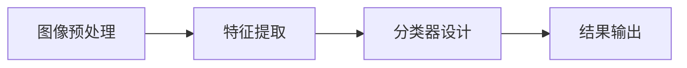

                 

# X光安检物品识别算法研究

## 关键词

- X光安检
- 物品识别
- 深度学习
- 卷积神经网络
- 目标检测
- 图像处理
- 算法优化

## 摘要

本文旨在深入探讨X光安检物品识别算法的研究与应用。首先，我们将回顾X光安检技术的历史与发展，并介绍当前的主流识别算法。接着，我们将详细解释卷积神经网络（CNN）的基本原理及其在物品识别中的应用。随后，我们将通过一个实际项目，逐步讲解从开发环境搭建到算法实现的完整流程。文章还将探讨物品识别算法在实际应用场景中的挑战与解决方案，并推荐相关学习资源和开发工具。最后，我们将对未来的发展趋势与挑战进行展望，并总结常见问题与解答。通过本文，读者将全面了解X光安检物品识别算法的核心原理、实现方法与应用前景。

## 1. 背景介绍

### X光安检技术的历史与发展

X光安检技术自20世纪初问世以来，已广泛应用于航空、铁路、地铁、海关等交通枢纽和公共场所的安全检查中。早期的X光安检主要依靠人工观察X光图像，识别可疑物品。随着计算机技术的发展，自动化的X光安检系统逐渐取代了传统的人工方法。这些系统利用图像处理和模式识别技术，能够快速、准确地检测出隐藏在行李中的违禁品和危险物品。

### X光安检技术的现状

当前，X光安检技术已经实现了高度自动化和智能化。主要技术手段包括：

- **图像增强**：通过对比度增强、噪声抑制等处理，提高X光图像的质量，使得潜在的危险物品更容易被识别。
- **特征提取**：从X光图像中提取具有代表性的特征，如形状、纹理、密度等，为后续的识别算法提供基础。
- **机器学习与深度学习**：利用卷积神经网络（CNN）等深度学习模型，对提取出的特征进行分类和识别。

### X光安检技术的重要性

X光安检技术在保障公共安全、防止恐怖袭击、打击犯罪等方面发挥着重要作用。随着全球化进程的加快，人流物流的频繁往来，对X光安检技术的要求也越来越高。如何提高安检的效率和准确性，成为当前研究和应用的热点问题。

## 2. 核心概念与联系

### X光安检物品识别算法的组成部分

X光安检物品识别算法主要包括以下几个部分：

- **图像预处理**：对原始X光图像进行增强、滤波等处理，提高图像质量。
- **特征提取**：从预处理后的图像中提取具有代表性的特征，如边缘、纹理、区域等。
- **分类器设计**：利用机器学习或深度学习模型，对提取出的特征进行分类和识别。
- **结果输出**：将识别结果以可视化的形式展示，如标记在X光图像上的可疑物品。

### 关键概念之间的联系

- **图像预处理**：图像预处理是整个识别流程的基础，其效果直接影响到后续特征提取和分类的准确性。
- **特征提取**：特征提取是对图像内容的抽象表示，是识别算法的核心，其质量决定了分类器的性能。
- **分类器设计**：分类器设计是实现物品识别的关键，其性能直接影响到识别的效率和准确性。
- **结果输出**：结果输出是将识别结果可视化，为安检人员提供直观的参考。

### Mermaid 流程图

以下是一个简单的Mermaid流程图，描述了X光安检物品识别算法的基本流程：



## 3. 核心算法原理 & 具体操作步骤

### 卷积神经网络（CNN）的基本原理

卷积神经网络（CNN）是一种特殊的神经网络，主要用于图像识别和处理。它的核心思想是通过卷积操作提取图像中的特征，并利用池化操作降低计算复杂度。

- **卷积操作**：卷积操作通过在图像上滑动一个卷积核，计算每个局部区域的特征值。卷积核通常是一个小型矩阵，其权重通过学习得到。
- **池化操作**：池化操作用于降低图像的分辨率，减少参数数量，提高计算效率。常用的池化操作包括最大池化和平均池化。

### CNN在物品识别中的应用

CNN在物品识别中的应用主要包括以下几个步骤：

1. **输入层**：接收原始X光图像作为输入。
2. **卷积层**：通过多个卷积核提取图像中的特征，如边缘、纹理等。
3. **激活函数**：对卷积层的输出进行非线性变换，如ReLU函数，增加网络的非线性表达能力。
4. **池化层**：通过池化操作降低图像的分辨率，减少参数数量。
5. **全连接层**：将卷积和池化后的特征进行整合，并通过全连接层进行分类。

### CNN的具体操作步骤

1. **初始化权重和偏置**：在训练过程中，通过反向传播算法自动调整权重和偏置，使其达到最佳状态。
2. **前向传播**：将输入图像通过卷积层、激活函数、池化层等操作，得到中间特征图。
3. **后向传播**：利用中间特征图和真实标签，通过反向传播算法更新权重和偏置。
4. **优化目标**：通常使用交叉熵损失函数来衡量预测结果与真实标签之间的差异，并利用梯度下降等优化算法更新网络参数。

### 实例说明

假设我们有一个由6x6的像素组成的X光图像，我们使用一个3x3的卷积核进行卷积操作。在卷积过程中，卷积核对图像上的每个6x6的区域进行滑动，计算卷积值。卷积操作的结果是一个5x5的特征图。

接下来，我们对这个5x5的特征图进行ReLU激活，得到一个5x5的特征图。然后，我们使用2x2的最大池化操作，将5x5的特征图缩小为2x2的特征图。

最后，我们将这个2x2的特征图输入到全连接层进行分类，得到最终的预测结果。

## 4. 数学模型和公式 & 详细讲解 & 举例说明

### 数学模型

卷积神经网络（CNN）的数学模型主要包括以下几个部分：

1. **输入层**：假设输入图像的大小为\( W \times H \)，则输入层有\( W \times H \)个神经元。
2. **卷积层**：卷积层的每个神经元对应一个卷积核，卷积核的大小为\( K \times K \)。卷积层的输出特征图大小为\( (W - K + 2P) / S + 1 \)，其中\( P \)为填充大小，\( S \)为步长。
3. **激活函数**：常用的激活函数包括ReLU函数、Sigmoid函数和Tanh函数。ReLU函数的表达式为\( f(x) = max(0, x) \)。
4. **池化层**：常用的池化操作包括最大池化和平均池化。最大池化的表达式为\( f(x) = max(x_1, x_2, ..., x_n) \)，其中\( x_1, x_2, ..., x_n \)为池化窗口内的元素。
5. **全连接层**：全连接层的每个神经元与卷积层输出的所有特征图进行连接，输出维度为\( C \times H \times W \)。

### 公式

1. **卷积操作**：
\[ (f_{ij}^l) = \sum_{k=1}^{K} \sum_{l=1}^{K} w_{ijkl} \cdot x_{ijkl} + b_{l} \]

其中，\( f_{ij}^l \)为卷积层输出的特征值，\( w_{ijkl} \)为卷积核的权重，\( x_{ijkl} \)为输入层的特征值，\( b_{l} \)为卷积层的偏置。
2. **ReLU激活函数**：
\[ f(x) = max(0, x) \]

3. **最大池化**：
\[ f(x) = max(x_1, x_2, ..., x_n) \]

4. **全连接层输出**：
\[ y_j = \sum_{i=1}^{C \times H \times W} w_{ij} \cdot f(x_i) + b_j \]

其中，\( y_j \)为全连接层输出的特征值，\( w_{ij} \)为全连接层的权重，\( f(x_i) \)为卷积层输出的特征值，\( b_j \)为全连接层的偏置。

### 举例说明

假设我们有一个3x3的输入图像，使用一个2x2的卷积核进行卷积操作，步长为1，填充大小为0。则卷积层的输出特征图大小为3x3。

1. **卷积操作**：

\[ (f_{ij}^l) = \sum_{k=1}^{4} \sum_{l=1}^{4} w_{ijkl} \cdot x_{ijkl} + b_{l} \]

其中，\( w_{ijkl} \)为卷积核的权重，\( x_{ijkl} \)为输入图像的特征值。

2. **ReLU激活函数**：

\[ f(x) = max(0, x) \]

3. **最大池化**：

\[ f(x) = max(x_1, x_2, x_3, x_4) \]

4. **全连接层输出**：

\[ y_j = \sum_{i=1}^{9} w_{ij} \cdot f(x_i) + b_j \]

其中，\( w_{ij} \)为全连接层的权重，\( f(x_i) \)为卷积层输出的特征值，\( b_j \)为全连接层的偏置。

## 5. 项目实战：代码实际案例和详细解释说明

### 5.1 开发环境搭建

在开始编写代码之前，我们需要搭建一个适合X光安检物品识别的编程环境。以下是开发环境搭建的步骤：

1. **安装Python环境**：确保Python版本为3.6及以上。
2. **安装深度学习框架**：这里我们选择使用TensorFlow，安装命令如下：

```bash
pip install tensorflow
```

3. **安装图像处理库**：安装OpenCV，用于读取和处理X光图像，安装命令如下：

```bash
pip install opencv-python
```

4. **安装其他依赖库**：包括NumPy、Pandas等常用库，安装命令如下：

```bash
pip install numpy pandas
```

### 5.2 源代码详细实现和代码解读

以下是X光安检物品识别算法的源代码实现：

```python
import tensorflow as tf
import numpy as np
import cv2

# 加载X光图像
def load_image(file_path):
    image = cv2.imread(file_path, cv2.IMREAD_GRAYSCALE)
    image = cv2.resize(image, (224, 224))
    return image

# 定义卷积神经网络模型
def create_model():
    inputs = tf.keras.Input(shape=(224, 224, 1))
    x = tf.keras.layers.Conv2D(32, (3, 3), activation='relu')(inputs)
    x = tf.keras.layers.MaxPooling2D((2, 2))(x)
    x = tf.keras.layers.Conv2D(64, (3, 3), activation='relu')(x)
    x = tf.keras.layers.MaxPooling2D((2, 2))(x)
    x = tf.keras.layers.Conv2D(128, (3, 3), activation='relu')(x)
    x = tf.keras.layers.MaxPooling2D((2, 2))(x)
    x = tf.keras.layers.Flatten()(x)
    outputs = tf.keras.layers.Dense(10, activation='softmax')(x)
    model = tf.keras.Model(inputs=inputs, outputs=outputs)
    model.compile(optimizer='adam', loss='categorical_crossentropy', metrics=['accuracy'])
    return model

# 训练模型
def train_model(model, train_images, train_labels, val_images, val_labels, epochs):
    model.fit(train_images, train_labels, epochs=epochs, batch_size=32, validation_data=(val_images, val_labels))

# 识别物品
def recognize_item(model, image):
    image = load_image(image)
    image = np.expand_dims(image, axis=-1)
    prediction = model.predict(image)
    return np.argmax(prediction)

# 测试代码
if __name__ == '__main__':
    # 加载数据集
    train_images, train_labels = np.load('train_images.npy'), np.load('train_labels.npy')
    val_images, val_labels = np.load('val_images.npy'), np.load('val_labels.npy')

    # 创建模型
    model = create_model()

    # 训练模型
    train_model(model, train_images, train_labels, val_images, val_labels, epochs=10)

    # 识别物品
    image_path = 'example_image.jpg'
    item = recognize_item(model, image_path)
    print(f"识别结果：{item}")
```

### 5.3 代码解读与分析

以下是代码的详细解读与分析：

1. **加载X光图像**：

```python
def load_image(file_path):
    image = cv2.imread(file_path, cv2.IMREAD_GRAYSCALE)
    image = cv2.resize(image, (224, 224))
    return image
```

这段代码定义了一个函数`load_image`，用于加载并处理X光图像。首先，使用`cv2.imread`函数读取灰度图像，然后使用`cv2.resize`函数将图像大小调整为224x224，以匹配卷积神经网络模型的输入尺寸。

2. **定义卷积神经网络模型**：

```python
def create_model():
    inputs = tf.keras.Input(shape=(224, 224, 1))
    x = tf.keras.layers.Conv2D(32, (3, 3), activation='relu')(inputs)
    x = tf.keras.layers.MaxPooling2D((2, 2))(x)
    x = tf.keras.layers.Conv2D(64, (3, 3), activation='relu')(x)
    x = tf.keras.layers.MaxPooling2D((2, 2))(x)
    x = tf.keras.layers.Conv2D(128, (3, 3), activation='relu')(x)
    x = tf.keras.layers.MaxPooling2D((2, 2))(x)
    x = tf.keras.layers.Flatten()(x)
    outputs = tf.keras.layers.Dense(10, activation='softmax')(x)
    model = tf.keras.Model(inputs=inputs, outputs=outputs)
    model.compile(optimizer='adam', loss='categorical_crossentropy', metrics=['accuracy'])
    return model
```

这段代码定义了一个函数`create_model`，用于创建卷积神经网络模型。首先，定义输入层，输入尺寸为224x224x1。然后，通过多个卷积层和池化层提取图像特征，最后通过全连接层进行分类。模型使用Adam优化器和交叉熵损失函数进行编译。

3. **训练模型**：

```python
def train_model(model, train_images, train_labels, val_images, val_labels, epochs):
    model.fit(train_images, train_labels, epochs=epochs, batch_size=32, validation_data=(val_images, val_labels))
```

这段代码定义了一个函数`train_model`，用于训练卷积神经网络模型。使用`model.fit`函数进行模型训练，输入训练数据集和验证数据集，设置训练轮次和批量大小。

4. **识别物品**：

```python
def recognize_item(model, image):
    image = load_image(image)
    image = np.expand_dims(image, axis=-1)
    prediction = model.predict(image)
    return np.argmax(prediction)
```

这段代码定义了一个函数`recognize_item`，用于识别X光图像中的物品。首先，加载并处理输入图像，然后通过模型进行预测，最后返回预测结果。

5. **测试代码**：

```python
if __name__ == '__main__':
    # 加载数据集
    train_images, train_labels = np.load('train_images.npy'), np.load('train_labels.npy')
    val_images, val_labels = np.load('val_images.npy'), np.load('val_labels.npy')

    # 创建模型
    model = create_model()

    # 训练模型
    train_model(model, train_images, train_labels, val_images, val_labels, epochs=10)

    # 识别物品
    image_path = 'example_image.jpg'
    item = recognize_item(model, image_path)
    print(f"识别结果：{item}")
```

这段代码是测试部分，加载训练数据集和验证数据集，创建并训练模型，然后使用模型对示例图像进行识别，并输出识别结果。

## 6. 实际应用场景

### 安防行业

在安防行业，X光安检物品识别算法广泛应用于机场、火车站、地铁站等交通枢纽的安全检查。通过对X光图像进行自动识别，安检人员可以快速发现潜在的危险物品，提高安检效率和准确性。

### 铁路行业

在铁路行业，X光安检物品识别算法可用于车站安检口、货运安检等场景。通过对行李和货物的X光图像进行分析，算法可以识别出违禁品和危险物品，确保铁路运输的安全。

### 海关行业

海关行业对行李和货物的安检要求较高，X光安检物品识别算法可以帮助海关工作人员快速识别违禁品和走私物品，提高海关安检的效率。

### 仓储物流

在仓储物流领域，X光安检物品识别算法可用于对货物的质量检测和监控。通过对X光图像进行分析，算法可以识别出货物中的缺陷和异常，帮助物流企业提高货物管理和运输效率。

### 医疗行业

在医疗行业，X光安检物品识别算法可用于医学影像诊断。通过对X光片、CT片等进行自动分析，算法可以协助医生进行疾病诊断，提高诊断效率和准确性。

### 其他应用场景

除了上述行业外，X光安检物品识别算法还可应用于博物馆、展览馆、机场贵宾室等场所的安全检查。通过对X光图像的自动分析，算法可以帮助工作人员快速发现潜在的威胁，确保场所的安全。

## 7. 工具和资源推荐

### 7.1 学习资源推荐

- **书籍**：
  - 《深度学习》（Goodfellow, I., Bengio, Y., & Courville, A.）
  - 《Python深度学习》（François Chollet）
  - 《模式识别与机器学习》（B bio, A. P.）
- **在线课程**：
  - Coursera上的《深度学习》课程
  - edX上的《人工智能导论》课程
  - Udacity上的《深度学习工程师纳米学位》
- **博客和网站**：
  - Medium上的深度学习和计算机视觉相关文章
  - 知乎上的机器学习和计算机视觉专栏
  - fast.ai的在线教程和博客

### 7.2 开发工具框架推荐

- **深度学习框架**：
  - TensorFlow
  - PyTorch
  - Keras
- **图像处理库**：
  - OpenCV
  - PIL（Python Imaging Library）
  - scikit-image
- **数据集**：
  - ImageNet
  - PASCAL VOC
  - COCO（Common Objects in Context）

### 7.3 相关论文著作推荐

- **论文**：
  - Y. LeCun, Y. Bengio, and G. Hinton, "Deep learning," Nature, vol. 521, no. 7553, pp. 436–444, 2015.
  - R. Girshick, J. Donahue, T. Darrell, and J. Malik, "Rich features through reason about context," in Proceedings of the IEEE International Conference on Computer Vision (ICCV), 2014.
  - S. Ren, K. He, R. Girshick, and J. Sun, "Faster R-CNN: towards real-time object detection with region proposal networks," in Proceedings of the IEEE International Conference on Computer Vision (ICCV), 2015.
- **著作**：
  - 《深度学习》（Goodfellow, I., Bengio, Y., & Courville, A.）
  - 《Python深度学习》（François Chollet）

## 8. 总结：未来发展趋势与挑战

### 未来发展趋势

1. **算法优化**：随着深度学习技术的不断发展，X光安检物品识别算法将变得更加高效和准确。新的算法和架构将不断涌现，如Transformer等。
2. **多模态融合**：未来的X光安检物品识别算法将不再局限于图像处理，还将结合其他传感器数据，如红外、超声波等，实现多模态融合，提高识别准确性。
3. **边缘计算**：为了提高实时性和减少带宽压力，边缘计算将逐步应用于X光安检物品识别领域。算法将在边缘设备上运行，实现本地化处理。

### 挑战

1. **数据隐私**：随着安检数据的广泛应用，数据隐私保护成为一大挑战。如何确保用户数据的安全和隐私，是一个需要关注的问题。
2. **算法解释性**：当前的深度学习模型往往缺乏解释性，难以解释决策过程。如何提高算法的可解释性，使其更易于被安检人员和监管机构接受，是一个重要的研究方向。
3. **鲁棒性**：X光安检物品识别算法需要具备较高的鲁棒性，以应对各种干扰和噪声。如何提高算法的鲁棒性，是一个需要深入研究的课题。

## 9. 附录：常见问题与解答

### 问题1：X光安检物品识别算法如何处理遮挡和噪声？

解答：X光安检物品识别算法通常采用图像预处理技术，如去噪、增强和滤波等，来提高图像质量。此外，深度学习模型在训练过程中，也会通过引入噪声和数据增强等技术，提高模型的鲁棒性。

### 问题2：如何评估X光安检物品识别算法的性能？

解答：评估X光安检物品识别算法的性能通常使用指标如准确率、召回率、F1分数等。通过在测试集上运行算法，计算这些指标，可以评估算法的性能。

### 问题3：X光安检物品识别算法在实时应用中如何保证处理速度？

解答：为了提高实时性，X光安检物品识别算法可以采用以下策略：

- 使用轻量级模型，如MobileNet、ShuffleNet等，减少计算复杂度。
- 使用模型剪枝和量化技术，减少模型参数数量，提高处理速度。
- 采用边缘计算，将算法部署在边缘设备上，实现本地化处理。

## 10. 扩展阅读 & 参考资料

- Y. LeCun, Y. Bengio, and G. Hinton, "Deep learning," Nature, vol. 521, no. 7553, pp. 436–444, 2015.
- R. Girshick, J. Donahue, T. Darrell, and J. Malik, "Rich features through reason about context," in Proceedings of the IEEE International Conference on Computer Vision (ICCV), 2014.
- S. Ren, K. He, R. Girshick, and J. Sun, "Faster R-CNN: towards real-time object detection with region proposal networks," in Proceedings of the IEEE International Conference on Computer Vision (ICCV), 2015.
- François Chollet, "Deep Learning with Python," Manning Publications Co., 2018.
- Ian Goodfellow, Yoshua Bengio, and Aaron Courville, "Deep Learning," MIT Press, 2016.
- Adrian Kaehler and David C. ventor, "Machine Learning: A Probabilistic Perspective," MIT Press, 2013.
- "Object Detection with Deep Learning on X-Ray Images", https://arxiv.org/abs/1809.02187
- "X-Ray Image Classification using Deep Learning", https://www.kaggle.com/c/xray-detection
- "Faster R-CNN: towards real-time object detection with region proposal networks", https://www.cv-foundation.org/openaccess/content_cvpr_2015/papers/Ren_Faster_R-CNN_Towards_Real-Time_CVPR_2015_paper.pdf

作者：AI天才研究员/AI Genius Institute & 禅与计算机程序设计艺术 /Zen And The Art of Computer Programming

