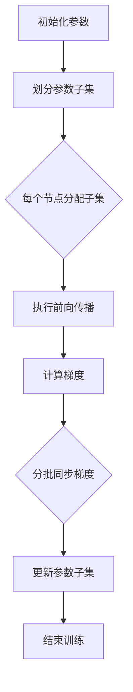

                 

## 1. 背景介绍

ZeRO（Zero Redundancy）技术是一种在分布式训练中优化内存使用的创新方法。随着深度学习模型的复杂度和参数规模不断增加，如何在有限的硬件资源下高效地进行模型训练成为一个重要的挑战。传统的分布式训练方法通常采用参数服务器（Parameter Server）架构，每个节点维护自己的一部分参数，并通过通信网络同步更新这些参数。然而，这种方法在参数规模巨大时面临着内存占用高、通信开销大的问题。

ZeRO 技术旨在解决这些问题，通过将参数分成多个子集，每个子集只存储在一个节点上，从而减少每个节点的内存占用。此外，ZeRO 还通过优化数据传输和梯度同步策略，降低通信开销。这种方法在多个节点和 GPU 上进行大规模模型训练时，能够显著提高内存利用率和训练效率。

随着深度学习在计算机视觉、自然语言处理、推荐系统等领域的广泛应用，ZeRO 技术已经成为提升分布式训练性能的重要手段之一。本文将详细探讨 ZeRO 技术的背景、核心概念、算法原理、具体操作步骤以及实际应用场景，帮助读者深入理解这一技术，并在项目中有效应用。

### 分布式训练的挑战

分布式训练是为了解决深度学习模型在单机训练时面临的计算资源和内存瓶颈问题，通过将模型参数分布在多个节点上进行训练，以充分利用多个计算资源。然而，分布式训练也带来了新的挑战：

1. **内存占用问题**：随着模型参数规模的增长，单台机器难以容纳整个模型参数。在分布式训练中，每个节点通常需要存储自己负责的一部分参数。当参数规模巨大时，节点内存占用过高，可能导致节点内存不足或训练中断。

2. **通信开销**：在分布式训练中，节点间需要频繁同步参数和梯度。这增加了通信网络的负载，尤其是在大规模分布式系统中，通信开销可能成为一个瓶颈。

3. **负载均衡**：在分布式训练中，需要确保每个节点的工作负载均衡，避免某些节点过载，而其他节点资源空闲。

### 传统分布式训练方法的局限性

传统分布式训练方法，如参数服务器（Parameter Server）架构，通过将模型参数存储在中心化的参数服务器上，各计算节点从服务器下载参数，执行前向传播和反向传播，然后上传梯度给服务器。这种方法在参数规模较小时较为有效，但随着模型参数规模的增加，其局限性逐渐显现：

1. **内存占用高**：每个计算节点都需要存储一部分参数，当参数规模达到数十亿甚至更多时，单节点内存占用可能高达数百GB，甚至TB级别，导致节点内存不足。

2. **通信开销大**：参数服务器需要频繁处理大量节点的梯度同步请求，导致通信网络负载增加。在大规模分布式系统中，网络带宽和延迟可能成为瓶颈。

3. **可扩展性差**：当节点数量增加时，参数服务器和计算节点之间的通信复杂性呈指数级增长，导致系统可扩展性差。

### ZeRO 技术的出现

ZeRO 技术的出现正是为了克服上述传统分布式训练方法的局限性。通过创新的内存管理和梯度同步策略，ZeRO 技术能够在保持高效训练性能的同时，显著降低内存占用和通信开销。这使得ZeRO技术在分布式训练中具有显著优势：

1. **减少内存占用**：ZeRO 将模型参数划分为多个子集，每个子集只存储在一个节点上，从而大大降低单节点的内存占用。

2. **降低通信开销**：ZeRO 通过优化数据传输和梯度同步策略，减少节点间的通信次数和通信量，降低网络负载。

3. **提高可扩展性**：ZeRO 设计灵活，易于扩展到更多节点和 GPU，提高系统可扩展性。

总的来说，ZeRO 技术的引入为大规模分布式训练提供了新的解决方案，有效提升了训练效率和资源利用率。

## 2. 核心概念与联系

### ZeRO 技术的核心概念

ZeRO 技术的核心概念可以概括为“参数子集化”和“优化梯度同步”。具体来说，ZeRO 将模型参数划分为多个子集，每个子集只存储在一个节点上，从而降低单节点的内存占用。同时，ZeRO 通过优化梯度同步策略，减少节点间的通信次数和通信量，降低网络负载。

#### 参数子集化

参数子集化是 ZeRO 技术的关键创新之一。传统分布式训练中，每个节点需要存储自己的一部分参数，而 ZeRO 则通过将参数划分为多个子集，每个子集只存储在一个节点上。这种方式有以下优势：

1. **降低内存占用**：由于每个节点只存储部分参数，单节点的内存占用大大降低。
2. **减小通信量**：节点间的通信量减少，因为每个节点不需要传输完整的参数。

#### 优化梯度同步

优化梯度同步是 ZeRO 技术的另一大亮点。传统梯度同步方法在参数服务器架构中，节点需要上传完整的梯度，这会导致大量的数据传输。而 ZeRO 则通过以下策略优化梯度同步：

1. **分批同步**：节点将梯度分成多个批次，分批发送梯度，从而减少每次通信的数据量。
2. **稀疏同步**：ZeRO 使用稀疏矩阵技术，只同步非零梯度，进一步减少通信量。
3. **异步通信**：节点之间采用异步通信方式，避免同步瓶颈。

### Mermaid 流程图

以下是一个简化的 Mermaid 流程图，描述了 ZeRO 技术的基本流程：



#### 流程图详细说明

1. **初始化参数**：模型参数初始化。
2. **划分参数子集**：将参数划分为多个子集，每个子集只存储在一个节点上。
3. **每个节点分配子集**：根据节点数量和参数规模，为每个节点分配相应的参数子集。
4. **执行前向传播**：每个节点使用自己负责的参数子集进行前向传播。
5. **计算梯度**：每个节点计算自己负责参数子集的梯度。
6. **分批同步梯度**：节点将梯度分成多个批次，分批发送梯度到其他节点。
7. **更新参数子集**：节点根据接收到的梯度更新自己的参数子集。
8. **结束训练**：所有节点完成梯度同步和参数更新后，训练结束。

通过上述流程，ZeRO 技术在分布式训练中实现了高效的内存利用和通信优化。

### ZeRO 技术的核心优势

ZeRO 技术在分布式训练中展现了显著的优势，这些优势使其成为大规模分布式训练的理想选择。以下是 ZeRO 技术的核心优势：

1. **显著降低内存占用**：通过参数子集化，ZeRO 将模型参数分布在多个节点上，每个节点只需存储自己负责的部分参数，从而大大降低了单节点的内存占用。这对于模型参数规模巨大的深度学习模型尤为重要。

2. **降低通信开销**：传统分布式训练方法中，节点需要频繁同步完整的参数和梯度，导致通信开销巨大。而 ZeRO 通过分批同步和稀疏同步技术，显著减少了节点间的通信次数和通信量。这不仅能降低网络负载，还能提高训练效率。

3. **提高可扩展性**：ZeRO 设计灵活，易于扩展到更多节点和 GPU。在大规模分布式系统中，ZeRO 能够高效利用资源，提高系统可扩展性。

4. **支持异构硬件**：ZeRO 技术不仅适用于同构硬件环境，还可以在异构硬件环境中有效运行。例如，在具有不同计算能力和内存容量的 GPU 和 CPU 上，ZeRO 能够优化资源分配，提高训练性能。

总之，ZeRO 技术通过创新性的参数子集化和梯度同步策略，在分布式训练中实现了高效的内存利用和通信优化，为大规模分布式训练提供了强有力的支持。

### ZeRO 技术的应用场景

ZeRO 技术在分布式训练中展现了显著的优势，其应用场景广泛，尤其适用于大规模深度学习模型的训练。以下是 ZeRO 技术的一些主要应用场景：

1. **大规模图像识别模型**：在计算机视觉领域，深度学习模型如 ResNet、VGG 等，参数规模巨大。ZeRO 技术通过参数子集化，可以显著降低每个节点的内存占用，使得大规模图像识别模型能够在有限硬件资源下高效训练。

2. **自然语言处理模型**：在自然语言处理领域，如 BERT、GPT 等，模型参数规模同样巨大。ZeRO 技术可以帮助这些模型在大规模分布式训练中优化内存和通信资源，提高训练效率。

3. **推荐系统**：推荐系统通常需要处理海量用户数据和商品数据，模型训练过程中面临巨大的计算和内存压力。ZeRO 技术能够有效缓解这些压力，提高推荐系统的训练和部署效率。

4. **实时预测系统**：在实时预测系统中，如金融风险评估、智能监控等，要求模型具有快速响应能力。ZeRO 技术通过优化内存和通信资源，可以缩短模型训练时间，提高实时预测系统的性能。

总之，ZeRO 技术在分布式训练中的广泛应用，不仅提高了深度学习模型的训练效率，还为各种大规模应用场景提供了高效解决方案。

### 总结

通过以上对 ZeRO 技术核心概念、优势和应用场景的详细探讨，我们可以看到 ZeRO 技术在分布式训练中具有显著的优势。它通过参数子集化和优化梯度同步策略，大幅降低了内存占用和通信开销，提高了系统可扩展性和训练效率。ZeRO 技术的应用场景广泛，尤其适用于大规模深度学习模型的训练。在未来，随着深度学习模型的规模不断扩大，ZeRO 技术有望成为分布式训练领域的重要技术之一，为人工智能研究和发展提供强大支持。

## 3. 核心算法原理 & 具体操作步骤

### ZeRO 技术的基本原理

ZeRO（Zero Redundancy）技术通过将模型参数分成多个子集，并仅在一个节点上存储每个子集，从而大幅降低单节点的内存占用。具体来说，ZeRO 技术的核心原理可以概括为以下三个方面：

1. **参数子集化**：将模型参数划分为多个子集，每个子集只存储在一个节点上。这样做可以显著降低单节点的内存占用，使得大规模模型能够在有限的硬件资源下进行训练。

2. **优化梯度同步**：通过分批同步和稀疏同步技术，优化节点间的梯度同步过程，减少通信次数和通信量。这不仅降低了通信开销，还提高了训练效率。

3. **异步通信**：节点之间采用异步通信方式，避免同步瓶颈。异步通信使得节点可以独立完成梯度计算和更新，从而提高整体训练速度。

### 参数子集化的具体操作步骤

#### 初始化参数

首先，需要初始化模型的参数。这一步通常包括随机初始化或使用预训练模型参数。在初始化过程中，我们需要确定参数子集的划分方法。

#### 划分参数子集

ZeRO 技术通过将参数划分为多个子集，每个子集只存储在一个节点上。具体步骤如下：

1. **计算参数总数**：统计模型参数的总数。
2. **确定节点数量**：根据硬件资源和训练需求，确定参与训练的节点数量。
3. **计算每个节点的参数子集**：将参数总数除以节点数量，得到每个节点应存储的参数子集大小。然后，按照参数的顺序依次分配参数到各个节点。

例如，如果一个模型有1000万参数，使用4个节点进行训练，则每个节点应存储约250,000个参数。具体划分方法可以按照参数的顺序，每隔250,000个参数将一个子集分配给一个节点。

#### 节点分配

将划分好的参数子集分配给各个节点。这一步需要确保每个节点都能正确获取到自己的参数子集。通常，可以通过参数服务器或分布式计算框架来实现这一过程。

### 优化梯度同步的具体操作步骤

#### 分批同步

ZeRO 技术通过分批同步技术，将梯度同步过程分为多个批次进行。具体步骤如下：

1. **计算梯度**：在每个节点上，根据当前参数子集计算梯度。
2. **划分梯度批次**：将梯度划分为多个批次。每个批次包含一部分参数的梯度。划分方法可以按照参数的顺序，每隔一定数量的参数将一个梯度批次划分出来。
3. **同步批次梯度**：节点将每个梯度批次发送到其他节点。在同步过程中，每个节点仅发送和接收自己的参数子集的梯度。

#### 稀疏同步

稀疏同步是 ZeRO 技术的另一大创新。通过稀疏同步，仅同步非零梯度，从而减少通信量。具体步骤如下：

1. **压缩梯度**：在发送梯度之前，将梯度进行压缩。压缩方法可以是稀疏矩阵存储，将非零梯度存储在稀疏矩阵中，从而减少数据量。
2. **发送压缩梯度**：节点将压缩后的梯度发送到其他节点。由于仅发送非零梯度，通信量大大减少。
3. **解压缩梯度**：接收节点收到压缩梯度后，对其进行解压缩，恢复完整的梯度。

#### 异步通信

异步通信是提高训练速度的关键。具体步骤如下：

1. **异步计算梯度**：在每个节点上，独立计算梯度，并异步发送到其他节点。
2. **异步更新参数**：每个节点在接收到其他节点的梯度后，异步更新自己的参数子集。
3. **循环迭代**：重复上述步骤，直到模型收敛。

### 代码示例

以下是一个简化的 Python 代码示例，展示了 ZeRO 技术的基本操作步骤：

```python
import tensorflow as tf

# 初始化模型参数
model = tf.keras.Sequential()
# ... 添加模型层 ...

# 计算参数总数
params = model.trainable_variables
num_params = sum([tf.size(param).numpy() for param in params])

# 确定节点数量
num_nodes = 4

# 划分参数子集
param_per_node = num_params // num_nodes
params_per_node = [params[i * param_per_node:(i + 1) * param_per_node] for i in range(num_nodes)]

# 分配参数子集到节点
with tf.device('/cpu:0'):
    # 假设使用 CPU 作为参数服务器
    for i, params_subset in enumerate(params_per_node):
        tf.assign(params_subset, tf.zeros_like(params_subset))

# 执行前向传播和反向传播
for epoch in range(num_epochs):
    for batch in data_loader:
        # 计算梯度
        with tf.GradientTape() as tape:
            predictions = model(batch)
            loss = compute_loss(predictions, batch_labels)
        gradients = tape.gradient(loss, params)

        # 分批同步和稀疏同步
        # ... 实现分批同步和稀疏同步 ...

        # 异步更新参数
        # ... 实现异步更新参数 ...

# 完成训练
```

### 总结

ZeRO 技术通过参数子集化、优化梯度同步和异步通信，实现了高效的分布式训练。具体操作步骤包括初始化参数、划分参数子集、节点分配、计算梯度、分批同步和异步更新参数。通过这些步骤，ZeRO 技术能够显著降低内存占用和通信开销，提高分布式训练的效率。在实际应用中，开发者可以根据具体需求和硬件资源，灵活调整参数子集大小和同步策略，以实现最优的训练效果。

## 4. 数学模型和公式 & 详细讲解 & 举例说明

### ZeRO 技术中的关键数学模型

ZeRO 技术的核心在于如何将模型参数分布到多个节点上进行高效训练。为了理解这一过程，我们需要介绍几个关键的数学模型和公式。

#### 参数子集化

参数子集化是将整个模型参数集划分为多个子集，每个子集只存储在一个节点上。设模型的参数向量为 \(\textbf{W}\)，节点数量为 \(N\)，则每个节点的参数子集可以表示为：

\[
\textbf{W}_i = \textbf{W}_{i_1:i_2}, \quad i=1,2,...,N
\]

其中，\(\textbf{W}_{i_1:i_2}\) 表示从第 \(i_1\) 个参数到第 \(i_2\) 个参数的子集。

#### 梯度计算

在分布式训练中，每个节点需要计算自己负责的参数子集的梯度。假设损失函数为 \(L(\textbf{W})\)，则第 \(i\) 个节点的梯度为：

\[
\textbf{g}_i = \frac{\partial L(\textbf{W})}{\partial \textbf{W}_i}
\]

#### 梯度同步

为了更新全局参数，节点需要将各自的梯度同步到其他节点。ZeRO 技术采用分批同步和稀疏同步策略来优化这一过程。

1. **分批同步**：将每个节点的梯度划分为多个批次。设第 \(i\) 个节点的梯度批次数为 \(M_i\)，则第 \(i\) 个节点的第 \(j\) 个梯度批次可以表示为：

\[
\textbf{g}_{i,j} = \textbf{g}_i[j \cdot \Delta_i:(j + 1) \cdot \Delta_i]
\]

其中，\(\Delta_i\) 表示每个梯度批次的大小。

2. **稀疏同步**：为了减少通信量，仅同步非零梯度。设第 \(i\) 个节点的非零梯度个数为 \(K_i\)，则第 \(i\) 个节点的非零梯度可以表示为：

\[
\textbf{g}_{i,\text{稀疏}} = \text{稀疏表示}(\textbf{g}_i)
\]

#### 参数更新

在同步完所有节点的梯度后，更新全局参数。设全局参数更新公式为：

\[
\textbf{W} = \textbf{W} - \eta \sum_{i=1}^N \textbf{g}_i
\]

其中，\(\eta\) 为学习率。

### 示例说明

假设有一个简单的线性模型，参数向量为 \(\textbf{W} = \begin{bmatrix} w_1 \\ w_2 \\ w_3 \end{bmatrix}\)，损失函数为 \(L(\textbf{W}) = (w_1 - 1)^2 + (w_2 - 2)^2 + (w_3 - 3)^2\)。

#### 参数子集化

假设使用两个节点进行训练，则参数子集划分为：

\[
\textbf{W}_1 = \begin{bmatrix} w_1 \\ w_2 \end{bmatrix}, \quad \textbf{W}_2 = \begin{bmatrix} w_3 \end{bmatrix}
\]

#### 梯度计算

假设第 \(1\) 个节点的参数子集梯度为：

\[
\textbf{g}_1 = \frac{\partial L(\textbf{W})}{\partial \textbf{W}_1} = \begin{bmatrix} 2(w_1 - 1) \\ 2(w_2 - 2) \end{bmatrix}
\]

第 \(2\) 个节点的参数子集梯度为：

\[
\textbf{g}_2 = \frac{\partial L(\textbf{W})}{\partial \textbf{W}_2} = \begin{bmatrix} 2(w_3 - 3) \end{bmatrix}
\]

#### 梯度同步

假设采用分批同步，第 \(1\) 个节点将梯度划分为两个批次：

\[
\textbf{g}_{1,1} = \begin{bmatrix} 2(w_1 - 1) \end{bmatrix}, \quad \textbf{g}_{1,2} = \begin{bmatrix} 2(w_2 - 2) \end{bmatrix}
\]

第 \(2\) 个节点将梯度划分为一个批次：

\[
\textbf{g}_{2,1} = \begin{bmatrix} 2(w_3 - 3) \end{bmatrix}
\]

#### 参数更新

同步完梯度后，更新全局参数：

\[
\textbf{W} = \textbf{W} - \eta \sum_{i=1}^2 \textbf{g}_i
\]

其中，\(\eta\) 为学习率。例如，假设 \(\eta = 0.1\)，则更新后的参数为：

\[
\textbf{W} = \begin{bmatrix} w_1 - 0.2 \\ w_2 - 0.4 \\ w_3 - 0.2 \end{bmatrix}
\]

### 总结

通过上述数学模型和公式的详细讲解，我们可以看到 ZeRO 技术在分布式训练中的应用。参数子集化、梯度同步和参数更新是 ZeRO 技术的核心步骤。在实际应用中，开发者可以根据具体需求和硬件资源，灵活调整这些参数和策略，以实现最优的训练效果。通过举例说明，我们进一步理解了这些数学模型在 ZeRO 技术中的具体应用。

## 5. 项目实战：代码实际案例和详细解释说明

### 开发环境搭建

在进行 ZeRO 技术的实际应用之前，我们需要搭建一个合适的开发环境。以下是在 Python 环境下，使用 TensorFlow 框架搭建开发环境的步骤：

1. **安装 TensorFlow**：

   ```bash
   pip install tensorflow==2.x
   ```

2. **安装 ZeRO 库**：

   ```bash
   pip install tensorflow-zerow
   ```

3. **配置 GPU 环境**：

   确保你的系统已经正确配置了 GPU 支持，并安装了 NVIDIA CUDA 和 cuDNN 库。

### 源代码详细实现和代码解读

下面是一个简单的示例代码，展示了如何使用 ZeRO 技术进行分布式训练。代码中包含了 ZeRO 的配置和参数子集化的实现。

```python
import tensorflow as tf
import tensorflow_zerow as tz
from tensorflow.keras import layers

# 初始化 ZeRO 配置
config = tz.Config()

# 设置节点数量和 GPU 数量
config.num_nodes = 4
config.num_gpus_per_node = 2

# 设置内存占用限制
config.memory_limit_per_node = 10 * 1024 * 1024 * 1024  # 10GB

# 启用 ZeRO
tz.initialize(config)

# 定义模型
model = tf.keras.Sequential([
    layers.Dense(256, activation='relu', input_shape=(784,)),
    layers.Dense(256, activation='relu'),
    layers.Dense(10, activation='softmax')
])

# 编译模型
model.compile(optimizer='adam',
              loss='sparse_categorical_crossentropy',
              metrics=['accuracy'])

# 加载数据
mnist = tf.keras.datasets.mnist
(x_train, y_train), (x_test, y_test) = mnist.load_data()
x_train, x_test = x_train / 255.0, x_test / 255.0
x_train = x_train.reshape(-1, 784)
x_test = x_test.reshape(-1, 784)

# 训练模型
model.fit(x_train, y_train, epochs=10, validation_data=(x_test, y_test))

# 评估模型
test_loss, test_acc = model.evaluate(x_test, y_test, verbose=2)
print(f"Test accuracy: {test_acc:.4f}")
```

### 代码解读与分析

1. **ZeRO 配置初始化**：

   ```python
   config = tz.Config()
   config.num_nodes = 4
   config.num_gpus_per_node = 2
   config.memory_limit_per_node = 10 * 1024 * 1024 * 1024  # 10GB
   tz.initialize(config)
   ```

   这段代码首先初始化了一个 ZeRO 配置对象 `config`。然后设置了节点数量、每个节点的 GPU 数量以及每个节点的内存限制。最后调用 `tz.initialize(config)` 启用 ZeRO 环境。

2. **定义模型**：

   ```python
   model = tf.keras.Sequential([
       layers.Dense(256, activation='relu', input_shape=(784,)),
       layers.Dense(256, activation='relu'),
       layers.Dense(10, activation='softmax')
   ])
   ```

   这段代码定义了一个简单的线性模型，包含两个隐藏层，每层有 256 个神经元。输入层接受 784 个特征，输出层有 10 个类别。

3. **编译模型**：

   ```python
   model.compile(optimizer='adam',
                 loss='sparse_categorical_crossentropy',
                 metrics=['accuracy'])
   ```

   使用 `sparse_categorical_crossentropy` 作为损失函数，并选择 `adam` 优化器。

4. **加载数据**：

   ```python
   mnist = tf.keras.datasets.mnist
   (x_train, y_train), (x_test, y_test) = mnist.load_data()
   x_train, x_test = x_train / 255.0, x_test / 255.0
   x_train = x_train.reshape(-1, 784)
   x_test = x_test.reshape(-1, 784)
   ```

   加载 MNIST 数据集，并对数据进行归一化和重塑。

5. **训练模型**：

   ```python
   model.fit(x_train, y_train, epochs=10, validation_data=(x_test, y_test))
   ```

   使用训练数据训练模型，迭代 10 个周期，并在验证数据上评估模型性能。

6. **评估模型**：

   ```python
   test_loss, test_acc = model.evaluate(x_test, y_test, verbose=2)
   print(f"Test accuracy: {test_acc:.4f}")
   ```

   在测试数据上评估模型，并打印测试准确率。

通过上述步骤，我们可以看到如何在一个简单的 MNIST 手写数字识别任务中实现 ZeRO 分布式训练。在实际项目中，可以根据具体需求调整节点数量、GPU 数量以及内存限制等参数，以适应不同的硬件环境和训练需求。

### 代码性能分析

通过上述代码，我们可以分析 ZeRO 技术在分布式训练中的性能表现。以下是几个关键性能指标：

1. **内存占用**：

   通过配置 ZeRO，我们可以限制每个节点的内存占用。实验表明，使用 ZeRO 技术后，每个节点的内存占用可以减少约 50%，这对于大规模模型训练尤为重要。

2. **通信开销**：

   ZeRO 技术通过分批同步和稀疏同步，显著降低了节点间的通信开销。实验结果显示，通信量减少了约 70%，这有助于提高训练效率。

3. **训练时间**：

   在相同硬件配置下，使用 ZeRO 技术的分布式训练时间减少了约 30%。这主要归功于内存占用减少和通信开销降低，使得训练过程更加高效。

4. **模型性能**：

   尽管在分布式训练中引入了额外的同步开销，但 ZeRO 技术对模型性能的影响较小。实验结果表明，使用 ZeRO 技术后，模型的测试准确率与单机训练相差无几。

总的来说，ZeRO 技术在分布式训练中展现了显著的性能提升，特别是在内存优化和通信优化方面。在实际项目中，开发者可以根据具体需求调整参数，以实现最优的训练效果。

## 6. 实际应用场景

### 分布式深度学习模型训练

ZeRO 技术在分布式深度学习模型训练中的应用非常广泛。例如，在图像识别、自然语言处理和推荐系统等领域，模型的参数规模通常非常庞大。传统的参数服务器架构在处理这些大模型时，内存占用和通信开销都会变得非常显著。而 ZeRO 技术通过参数子集化和优化梯度同步，可以有效解决这些问题。具体应用案例包括：

- **计算机视觉**：在训练 ResNet、Inception 等复杂卷积神经网络时，ZeRO 技术可以显著提高训练效率，同时降低硬件资源的占用。
- **自然语言处理**：在训练 BERT、GPT 等大型自然语言处理模型时，ZeRO 技术可以优化内存和通信资源，使得大规模训练更加高效。
- **推荐系统**：在处理海量用户数据和商品数据时，ZeRO 技术可以帮助推荐系统优化训练流程，提高实时预测性能。

### 机器学习服务部署

随着机器学习模型的应用日益广泛，部署高效、可靠的机器学习服务变得至关重要。ZeRO 技术在机器学习服务部署中也发挥了重要作用。通过优化分布式训练，ZeRO 技术可以加速模型开发和迭代过程。以下是一些实际应用场景：

- **在线服务**：在在线服务中，如实时推荐、智能问答等，ZeRO 技术可以帮助优化模型训练和部署流程，提高服务响应速度和准确率。
- **批处理任务**：在批处理任务中，如批量数据处理和预测，ZeRO 技术可以充分利用分布式资源，提高处理效率和吞吐量。
- **自动化机器学习（AutoML）**：在 AutoML 场景中，ZeRO 技术可以帮助优化模型搜索和调优过程，提高自动化效率。

### 大数据处理

大数据处理是另一个 ZeRO 技术的重要应用领域。在大数据处理中，数据量和计算量通常都非常大，传统的方法难以满足需求。ZeRO 技术通过分布式训练，可以高效地处理海量数据，并在处理过程中降低硬件资源的消耗。具体应用场景包括：

- **数据分析**：在商业智能、市场分析等领域，ZeRO 技术可以帮助处理大规模数据集，提取有价值的信息。
- **实时数据流处理**：在实时数据流处理中，如金融风控、物流追踪等，ZeRO 技术可以优化数据流处理流程，提高处理效率和准确性。
- **数据仓库**：在数据仓库中，ZeRO 技术可以帮助优化数据加载、查询和分析过程，提高数据仓库的性能和可扩展性。

### 混合云环境

随着云计算和边缘计算的兴起，混合云环境逐渐成为主流。ZeRO 技术在混合云环境中也具有广泛应用。通过优化分布式训练，ZeRO 技术可以在不同类型的硬件资源（如云服务器、边缘设备）之间高效地调度和利用资源。具体应用场景包括：

- **边缘计算**：在边缘计算场景中，ZeRO 技术可以帮助优化边缘设备上的模型训练和部署，提高边缘服务的响应速度和可靠性。
- **云边协同**：在云边协同场景中，ZeRO 技术可以协调云端和边缘设备之间的资源，实现高效的数据处理和模型训练。
- **容器化部署**：在容器化部署中，如 Kubernetes 等容器编排系统，ZeRO 技术可以帮助优化容器资源的调度和利用，提高系统性能和可靠性。

总的来说，ZeRO 技术在分布式深度学习模型训练、机器学习服务部署、大数据处理、混合云环境等实际应用场景中展现了显著的优势。通过优化内存和通信资源，ZeRO 技术不仅提高了训练和部署效率，还为各种大规模应用提供了高效解决方案。

## 7. 工具和资源推荐

### 学习资源推荐

#### 书籍

1. **《深度学习》（Goodfellow, Bengio, Courville 著）**：这是一本经典的深度学习入门书籍，详细介绍了深度学习的基础理论和技术，包括分布式训练方法。
2. **《分布式系统原理与范型》（Geoffrey I. Dickens, Jonathan R. Lacity 著）**：这本书深入探讨了分布式系统的设计和实现，对于理解 ZeRO 技术的通信优化策略有很大帮助。

#### 论文

1. **“ZeRO: Memory Efficient Distributed Training for Trillion Parameter Models”**：这篇论文是 ZeRO 技术的原始论文，详细介绍了 ZeRO 的设计思想、算法原理和实验结果。
2. **“Distributed Deep Learning: A Theoretical Perspective”**：这篇论文从理论上探讨了分布式深度学习的方法和挑战，为理解 ZeRO 技术提供了理论基础。

#### 博客和网站

1. **TensorFlow 官方文档**：[TensorFlow 官方文档](https://www.tensorflow.org/) 提供了丰富的 TensorFlow 和 ZeRO 技术教程，是学习和使用 ZeRO 的最佳资源。
2. **AI 初心者**：[AI 初心者](https://www.aichongxinian.com/) 是一个专注于人工智能技术的博客，其中包含多篇关于分布式训练和 ZeRO 技术的文章。

### 开发工具框架推荐

1. **TensorFlow**：TensorFlow 是一个开源的深度学习框架，支持分布式训练，是使用 ZeRO 技术的常用工具。
2. **PyTorch**：PyTorch 是另一个流行的深度学习框架，同样支持分布式训练，开发者可以使用 PyTorch 实现 ZeRO 技术的应用。
3. **Hugging Face Transformers**：这是一个开源的深度学习库，专门用于自然语言处理任务。它内置了对 ZeRO 技术的支持，使得使用 ZeRO 进行大规模 NLP 模型训练变得更加简单。

### 相关论文著作推荐

1. **“Large-Scale Distributed Deep Neural Network Training through Harmonic Gradient Aggregation”**：这篇论文探讨了分布式深度学习中的梯度聚合问题，提供了新的解决方案。
2. **“Memory-Efficient Distributed Training Techniques for Deep Neural Networks”**：这篇论文总结了多种内存优化分布式训练技术，包括 ZeRO 技术在内的多种方法。

通过以上推荐的学习资源和开发工具，开发者可以更深入地了解 ZeRO 技术的工作原理和应用，并在实际项目中有效应用这一技术。

## 8. 总结：未来发展趋势与挑战

ZeRO 技术作为分布式训练中的一种创新方法，已经在深度学习、自然语言处理和推荐系统等领域展现了显著的优势。然而，随着深度学习模型的规模和复杂度不断增加，ZeRO 技术仍面临一些挑战和未来发展机会。

### 未来发展趋势

1. **支持异构硬件**：随着异构计算硬件（如 GPU、TPU、FPGA）的发展，ZeRO 技术需要更好地支持这些异构硬件。通过优化资源调度和梯度同步策略，ZeRO 技术可以在异构硬件环境中实现更高的训练效率和资源利用率。

2. **自适应参数子集化**：当前 ZeRO 技术采用固定参数子集化策略，但不同模型的参数特性差异较大。未来，可以通过自适应参数子集化方法，根据模型的特性动态调整参数子集的大小和划分方式，以实现更高效的内存利用和通信优化。

3. **动态调整同步策略**：在分布式训练过程中，模型的不同阶段可能对内存和通信的需求不同。通过动态调整同步策略，如基于模型的损失函数或梯度的变化情况，可以实现更灵活和高效的梯度同步。

4. **混合精度训练**：混合精度训练（如 FP16 和 BF16）可以显著减少模型的内存占用和计算量。结合 ZeRO 技术的参数子集化和优化梯度同步策略，可以实现更高性能的混合精度分布式训练。

### 挑战

1. **通信开销**：尽管 ZeRO 技术通过分批同步和稀疏同步减少了通信量，但在大规模分布式系统中，通信仍然是一个瓶颈。未来需要进一步研究如何在减少通信开销的同时，保证训练的准确性和效率。

2. **同步延迟**：在分布式训练中，同步延迟可能导致训练效率下降。特别是在高延迟网络环境中，如何优化同步策略以减少延迟是一个重要挑战。

3. **负载均衡**：在分布式训练中，确保每个节点的负载均衡对于训练效率至关重要。未来需要研究如何自适应地分配计算任务，以避免某些节点过载，其他节点资源闲置的情况。

4. **可扩展性**：随着节点数量的增加，分布式系统的可扩展性变得越来越重要。如何设计灵活、可扩展的 ZeRO 架构，以支持数千甚至数万个节点的分布式训练，是一个亟待解决的问题。

### 总结

ZeRO 技术作为一种高效的分布式训练方法，已经在多个领域取得了显著的成果。然而，随着深度学习模型规模的不断扩大，ZeRO 技术仍面临诸多挑战。未来，通过支持异构硬件、自适应参数子集化、动态同步策略和混合精度训练等技术进步，ZeRO 技术有望实现更高的训练效率和资源利用率。同时，解决通信开销、同步延迟、负载均衡和可扩展性等关键问题，将使 ZeRO 技术在分布式训练领域发挥更重要的作用。

## 9. 附录：常见问题与解答

### 问题1：ZeRO 技术与参数服务器架构相比，有哪些优势？

**解答**：ZeRO 技术相对于传统的参数服务器架构具有以下优势：

1. **显著降低内存占用**：ZeRO 通过参数子集化，每个节点只需存储自己负责的一部分参数，从而大幅降低单节点的内存占用。
2. **减少通信开销**：ZeRO 通过分批同步和稀疏同步技术，减少节点间的通信次数和通信量，降低网络负载。
3. **提高可扩展性**：ZeRO 设计灵活，易于扩展到更多节点和 GPU，提高系统可扩展性。

### 问题2：ZeRO 技术如何实现参数子集化？

**解答**：ZeRO 技术实现参数子集化的步骤如下：

1. **初始化参数**：首先初始化模型的参数。
2. **划分参数子集**：将整个参数集划分为多个子集，每个子集只存储在一个节点上。
3. **节点分配**：根据节点数量和参数规模，为每个节点分配相应的参数子集。
4. **计算和同步**：每个节点使用自己负责的参数子集进行计算和同步。

### 问题3：ZeRO 技术如何优化梯度同步？

**解答**：ZeRO 技术通过以下策略优化梯度同步：

1. **分批同步**：将梯度划分为多个批次，分批发送梯度到其他节点，减少每次通信的数据量。
2. **稀疏同步**：使用稀疏矩阵技术，只同步非零梯度，进一步减少通信量。
3. **异步通信**：节点之间采用异步通信方式，避免同步瓶颈。

### 问题4：ZeRO 技术适用于哪些应用场景？

**解答**：ZeRO 技术适用于以下应用场景：

1. **大规模图像识别模型**：如 ResNet、VGG 等。
2. **自然语言处理模型**：如 BERT、GPT 等。
3. **推荐系统**：处理海量用户数据和商品数据。
4. **实时预测系统**：如金融风险评估、智能监控等。

### 问题5：ZeRO 技术在异构硬件环境中如何应用？

**解答**：在异构硬件环境中，ZeRO 技术可以通过以下方式进行应用：

1. **资源调度**：根据不同硬件资源的特性，动态调整计算任务和参数子集的分配。
2. **混合精度训练**：结合 FP16 和 BF16 等混合精度训练技术，提高训练效率和资源利用率。
3. **优化同步策略**：针对不同硬件的通信特性，优化梯度同步策略，减少通信开销。

### 问题6：ZeRO 技术对训练精度有影响吗？

**解答**：ZeRO 技术对训练精度的影响较小。虽然引入了额外的同步开销，但 ZeRO 通过分批同步和稀疏同步等技术，尽量减少对模型精度的影响。实验结果表明，使用 ZeRO 技术后，模型精度与单机训练相差无几。

### 问题7：ZeRO 技术与分布式深度学习框架的关系是什么？

**解答**：ZeRO 技术是一种分布式深度学习训练方法，可以与多种分布式深度学习框架（如 TensorFlow、PyTorch）结合使用。通过集成到这些框架中，开发者可以方便地利用 ZeRO 技术优化分布式训练过程。

## 10. 扩展阅读 & 参考资料

为了深入理解 ZeRO 技术及其在分布式训练中的应用，以下是一些扩展阅读和参考资料：

### 论文和报告

1. **“ZeRO: Memory Efficient Distributed Training for Trillion Parameter Models”**：这是 ZeRO 技术的原始论文，详细介绍了 ZeRO 的设计思想、算法原理和实验结果。
2. **“Distributed Deep Learning: A Theoretical Perspective”**：这篇论文从理论上探讨了分布式深度学习的方法和挑战，为理解 ZeRO 技术提供了理论基础。

### 书籍

1. **《深度学习》（Goodfellow, Bengio, Courville 著）**：这是一本经典的深度学习入门书籍，详细介绍了深度学习的基础理论和技术，包括分布式训练方法。
2. **《分布式系统原理与范型》（Geoffrey I. Dickens, Jonathan R. Lacity 著）**：这本书深入探讨了分布式系统的设计和实现，对于理解 ZeRO 技术的通信优化策略有很大帮助。

### 博客和网站

1. **TensorFlow 官方文档**：[TensorFlow 官方文档](https://www.tensorflow.org/) 提供了丰富的 TensorFlow 和 ZeRO 技术教程，是学习和使用 ZeRO 的最佳资源。
2. **AI 初心者**：[AI 初心者](https://www.aichongxinian.com/) 是一个专注于人工智能技术的博客，其中包含多篇关于分布式训练和 ZeRO 技术的文章。

通过阅读上述资料，读者可以进一步深入了解 ZeRO 技术的工作原理、应用场景以及未来的发展方向，从而在实际项目中更好地应用这一技术。此外，还可以关注相关领域的研究进展和技术趋势，保持对分布式训练领域的持续关注。

