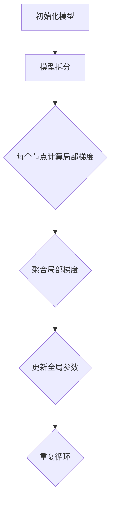

                 

### 背景介绍

在当今数据驱动的时代，人工智能（AI）的发展依赖于大规模数据的训练和模型的优化。然而，随着模型的规模不断扩大，训练时间也显著增加，这对计算资源的需求提出了巨大的挑战。尤其是在分布式系统中，如何在保证模型质量的前提下，提高训练效率，成为了一个亟待解决的问题。这就引出了ZeRO（Zero Redundancy Communication）优化技术，它旨在通过优化通信和计算资源的利用，实现大规模分布式训练的突破。

ZeRO优化最早由Facebook AI研究院提出，主要应用于深度学习模型的分布式训练中。它的核心思想是减少各个节点之间的通信开销，从而提升训练速度和降低延迟。在传统分布式训练中，每个节点都存储整个模型的副本，这导致大量的冗余通信和存储需求。而ZeRO通过将模型拆分成多个子模型，每个子模型只存储和更新一部分参数，从而显著降低了通信成本。

ZeRO优化的背景可以追溯到分布式系统中的通信瓶颈问题。随着模型的规模增加，各个节点之间的通信需求也急剧上升，导致整个训练过程变得缓慢。这不仅浪费了大量的计算资源，还限制了模型的训练速度。因此，优化分布式训练中的通信和计算资源利用率，成为了提高训练效率的关键。

除了ZeRO优化，还有一些其他的方法和技术也被提出，如AllReduce、Data Parallelism和Model Parallelism。这些方法各有优缺点，但ZeRO优化以其独特的架构和高效的通信减少策略，成为了大规模分布式训练中的一种重要的优化手段。

在本文中，我们将详细探讨ZeRO优化技术的原理、实现方法、数学模型以及实际应用场景。通过这篇文章，读者可以全面了解ZeRO优化的核心思想，掌握其在分布式训练中的应用技巧，并能够根据具体需求进行优化和调整。

让我们首先回顾一下分布式训练的基本概念，为后续的内容打下坚实的基础。

### 分布式训练的基本概念

分布式训练是一种将大规模深度学习模型训练任务分布在多个计算节点上，以提高训练速度和利用计算资源的技术。它通过将模型拆分成多个部分，每个部分在各自的节点上独立训练，然后通过特定的通信协议进行参数同步。分布式训练的核心在于如何高效地管理节点间的通信，以确保模型的训练效果和计算效率。

在分布式训练中，通常有几种常见的模型拆分策略，包括Data Parallelism、Model Parallelism和Task Parallelism。其中，Data Parallelism是最常见的一种策略，它将数据集分成多个子数据集，每个节点独立训练一部分数据，最后通过聚合各个节点的梯度来更新模型参数。这种方法的主要优点是可以显著提高训练速度，因为多个节点可以并行处理数据。然而，它的缺点是每个节点都需要存储整个模型，导致较大的内存占用和通信开销。

相比之下，Model Parallelism将模型拆分成多个子模型，每个子模型分布在不同的节点上。这种方法可以减少每个节点的内存占用，但需要解决子模型之间的通信问题。Task Parallelism则是将训练任务分解成多个子任务，每个节点独立完成一个子任务，这种方法在任务高度可并行的情况下效果较好。

分布式训练的关键在于通信协议的设计。常见的通信协议包括AllReduce、AllGather、Reduce和Gather等。AllReduce协议是将每个节点的梯度聚合到一个全局梯度，然后平均分配回每个节点。这种方法可以有效地减少通信开销，但需要解决数据的不平衡问题。AllGather协议则是将每个节点的梯度收集到一个全局列表中，适用于需要全局梯度的情况。Reduce和Gather协议是AllReduce和AllGather的变体，分别用于减少和收集部分节点的数据。

除了通信协议，分布式训练还需要考虑数据存储和计算资源的管理。通常，分布式训练系统需要支持动态资源分配和负载均衡，以确保每个节点的计算负载均衡，提高整体训练效率。此外，分布式训练还需要考虑容错性和可靠性，以确保训练过程的稳定性和连续性。

总的来说，分布式训练是一种高效利用计算资源、加速深度学习模型训练的技术。通过合理的设计和优化，它可以显著提高模型的训练速度和性能。然而，分布式训练也面临一些挑战，如通信开销、内存占用和容错性等，需要通过不断的研究和实践来克服。

### ZeRO优化的核心概念与联系

为了深入理解ZeRO优化的核心概念，我们需要首先明确几个关键术语，包括“冗余通信”、“参数子模型”和“梯度聚合”。接下来，我们将通过一个Mermaid流程图来展示ZeRO优化的架构，以便读者更直观地理解这一技术。

#### 关键术语

1. **冗余通信**：在分布式训练中，每个节点通常需要存储整个模型的参数，这意味着节点之间需要进行大量的通信以同步参数。这些通信操作通常是冗余的，因为每个节点的更新只是模型总更新的一部分。冗余通信不仅消耗大量的网络带宽，还会导致训练延迟。

2. **参数子模型**：ZeRO优化通过将整个模型拆分成多个子模型，每个子模型只包含模型的一部分参数。这样，每个节点只需要存储和更新其对应的子模型参数，从而大大减少了每个节点的存储需求和通信开销。

3. **梯度聚合**：在训练过程中，每个节点会计算其对应的子模型的梯度。ZeRO优化通过将各个节点的梯度聚合起来，得到全局梯度，然后更新整个模型。这一过程需要解决如何高效地聚合梯度和减少通信量的问题。

#### Mermaid流程图



在这个流程图中，我们首先初始化一个完整的模型，然后将其拆分成多个子模型，每个节点只负责其子模型的计算和更新。每个节点计算其子模型的梯度后，通过梯度聚合操作将局部梯度合并成全局梯度，最后使用全局梯度更新整个模型的参数。这个过程不断重复，直到模型收敛。

#### ZeRO优化的具体架构

ZeRO优化的核心架构包括以下几个关键步骤：

1. **模型拆分**：将原始模型拆分成多个子模型，每个子模型包含一部分参数。这个拆分过程可以根据具体的模型结构和训练需求进行优化，例如按照层、块或其他方式拆分。

2. **局部梯度计算**：每个节点独立计算其子模型的梯度。这一过程通常使用标准的梯度下降算法，但需要针对子模型进行相应的调整。

3. **梯度聚合**：通过特定的通信协议（如AllReduce）将各个节点的局部梯度聚合为全局梯度。这一过程需要解决数据的不平衡问题，以确保聚合过程的高效性和正确性。

4. **参数更新**：使用全局梯度更新整个模型的参数。这一过程同样需要确保更新操作的准确性和效率。

5. **循环迭代**：重复上述步骤，直到模型达到预定的训练目标。

#### 与传统方法的比较

与传统的分布式训练方法相比，ZeRO优化具有以下几个显著优势：

1. **减少冗余通信**：通过将模型拆分成多个子模型，每个节点只需要通信其子模型的梯度，从而显著减少了冗余通信。

2. **降低内存需求**：每个节点只需要存储其子模型的参数，而不是整个模型的副本，从而降低了内存占用。

3. **提高训练速度**：通过优化通信和计算资源的利用，ZeRO优化可以显著提高模型的训练速度。

4. **适应性**：ZeRO优化可以根据不同的模型结构和训练需求进行灵活调整，适用于各种类型的分布式训练场景。

总的来说，ZeRO优化通过减少冗余通信、降低内存需求和提高训练速度，为大规模分布式训练提供了一种高效的解决方案。接下来，我们将深入探讨ZeRO优化的算法原理，以便读者更好地理解其具体实现过程。

### 核心算法原理 & 具体操作步骤

为了深入探讨ZeRO优化的核心算法原理，我们首先需要了解ZeRO的具体操作步骤。以下是ZeRO优化算法的详细步骤：

#### 步骤1：模型拆分

1. **输入模型**：首先，我们将原始模型拆分成多个子模型。每个子模型包含一部分参数，这些参数可以根据模型的层次结构、模块结构或其他方式拆分。拆分的目的是为了使每个节点能够独立计算和更新其对应的子模型参数，从而减少冗余通信和内存需求。

2. **子模型分配**：根据分布式系统的节点数量和模型的结构，将子模型分配给不同的计算节点。每个节点只负责其子模型的计算和更新，而不需要存储整个模型。

#### 步骤2：局部梯度计算

1. **前向传播**：在每个训练循环中，每个节点首先使用其子模型进行前向传播，计算数据经过模型后的输出。

2. **计算损失函数**：然后，每个节点计算其子模型输出的损失函数。损失函数用于衡量模型预测结果与实际结果之间的差距。

3. **反向传播**：每个节点使用反向传播算法计算其子模型的梯度。反向传播是深度学习训练的核心步骤，它通过计算损失函数关于模型参数的导数，得到梯度信息，从而指导模型的更新。

#### 步骤3：梯度聚合

1. **梯度分片**：在每个节点计算完其子模型的梯度后，将这些梯度分片成多个部分。每个分片对应于一个子模型中的不同参数。

2. **通信协议**：使用特定的通信协议（如AllReduce）将各个节点的梯度分片聚合起来。AllReduce是一种常见的通信协议，它可以将每个节点的梯度聚合到一个全局梯度，然后平均分配回每个节点。

3. **梯度聚合**：在每个节点的梯度分片聚合完成后，将全局梯度汇总到一个统一的梯度向量中。这一步需要解决数据的不平衡问题，即确保每个节点的梯度分片在聚合过程中的正确性和一致性。

#### 步骤4：参数更新

1. **全局梯度**：使用聚合后的全局梯度更新整个模型的参数。这一步可以使用标准的梯度下降算法，根据全局梯度调整每个参数的值。

2. **参数同步**：更新完成后，确保每个节点上的子模型参数与全局参数保持一致。这一步可以通过广播（Broadcast）操作实现，将更新后的全局参数发送给所有节点。

#### 步骤5：循环迭代

1. **重复步骤**：重复上述步骤，直到模型达到预定的训练目标。在每个迭代过程中，每个节点都会计算其子模型的梯度，然后进行梯度聚合和参数更新。

#### 步骤6：结束条件

1. **模型收敛**：当模型损失函数达到预定的阈值或迭代次数达到预设的上限时，训练过程结束。

通过以上步骤，ZeRO优化实现了对大规模分布式训练的优化，其核心在于减少冗余通信、降低内存需求和提高训练速度。接下来，我们将通过数学模型和公式进一步解释ZeRO优化的具体计算过程。

### 数学模型和公式 & 详细讲解 & 举例说明

为了更深入地理解ZeRO优化，我们将通过数学模型和公式详细解释其具体计算过程，并通过具体例子说明如何在实际应用中进行计算。

#### 模型拆分

首先，假设我们有一个大规模的深度学习模型\( M \)，包含多个参数\( \theta = (\theta_1, \theta_2, ..., \theta_n) \)。在ZeRO优化中，我们将模型拆分成多个子模型，每个子模型包含一部分参数。

设子模型数量为\( k \)，每个子模型包含的参数数量为\( n_k \)，则有：

\[ \theta = \theta_1, \theta_2, ..., \theta_k \]

其中，\( \theta_i \)表示第\( i \)个子模型的参数。

#### 梯度计算

在每个训练循环中，每个节点计算其子模型的梯度。假设第\( i \)个节点的子模型为\( M_i \)，则其梯度表示为：

\[ \nabla_{M_i} L(\theta) = \frac{\partial L(\theta)}{\partial \theta_i} \]

其中，\( L(\theta) \)为损失函数。

#### 梯度聚合

在计算完各个节点的子模型梯度后，需要将局部梯度聚合为全局梯度。使用AllReduce通信协议，每个节点将局部梯度发送到其他节点，然后进行聚合。

设全局梯度为：

\[ \nabla_{\theta} L(\theta) = (\nabla_{\theta_1} L(\theta), \nabla_{\theta_2} L(\theta), ..., \nabla_{\theta_k} L(\theta)) \]

其中，\( \nabla_{\theta_i} L(\theta) \)为第\( i \)个子模型的局部梯度。

在AllReduce通信协议下，全局梯度的聚合过程可以表示为：

\[ \nabla_{\theta_i} L(\theta) \rightarrow \nabla_{\theta} L(\theta) \]

具体步骤如下：

1. **梯度分片**：将每个节点的局部梯度分片成多个部分，每个分片对应于一个子模型中的不同参数。

2. **通信**：每个节点将分片后的局部梯度发送到其他节点。

3. **聚合**：在每个节点上，将收到的分片梯度进行聚合，形成全局梯度。

#### 参数更新

在聚合全局梯度后，使用全局梯度更新整个模型的参数。假设更新后的参数为\( \theta' \)，则有：

\[ \theta' = \theta - \eta \nabla_{\theta} L(\theta) \]

其中，\( \eta \)为学习率。

#### 举例说明

假设我们有一个简单的线性回归模型，包含两个参数\( \theta_1 \)和\( \theta_2 \)，使用均方误差（MSE）作为损失函数。我们将其拆分成两个子模型，分别存储在两个节点上。

#### 第1步：初始化模型

\[ \theta_1 = 1, \theta_2 = 1 \]

#### 第2步：前向传播

\[ y = \theta_1 x_1 + \theta_2 x_2 \]

假设输入数据为\( (x_1, x_2) = (1, 2) \)，则有：

\[ y = \theta_1 + 2\theta_2 \]

#### 第3步：计算损失函数

\[ L(\theta) = \frac{1}{2} (y - y^*)^2 \]

其中，\( y^* \)为实际输出值。假设\( y^* = 3 \)，则有：

\[ L(\theta) = \frac{1}{2} ((\theta_1 + 2\theta_2) - 3)^2 \]

#### 第4步：反向传播

\[ \nabla_{\theta_1} L(\theta) = (y - y^*) \]
\[ \nabla_{\theta_2} L(\theta) = 2(y - y^*) \]

对于第1个节点（子模型1）：

\[ \nabla_{\theta_1} L(\theta) = 1 - 3 = -2 \]
\[ \nabla_{\theta_2} L(\theta) = 2(1 - 3) = -4 \]

对于第2个节点（子模型2）：

\[ \nabla_{\theta_1} L(\theta) = 2 - 3 = -1 \]
\[ \nabla_{\theta_2} L(\theta) = 2(2 - 3) = -2 \]

#### 第5步：梯度聚合

使用AllReduce协议将局部梯度聚合为全局梯度：

\[ \nabla_{\theta} L(\theta) = (-2, -4) + (-1, -2) = (-3, -6) \]

#### 第6步：参数更新

假设学习率\( \eta = 0.1 \)，则有：

\[ \theta_1' = \theta_1 - \eta \nabla_{\theta_1} L(\theta) = 1 - 0.1 \times (-3) = 1.3 \]
\[ \theta_2' = \theta_2 - \eta \nabla_{\theta_2} L(\theta) = 1 - 0.1 \times (-6) = 1.6 \]

更新后的参数为：

\[ \theta' = (1.3, 1.6) \]

#### 第7步：重复迭代

重复上述步骤，直到模型收敛。

通过以上步骤，我们可以看到ZeRO优化如何通过数学模型和公式在实际应用中进行计算。这个过程不仅减少了冗余通信，提高了训练速度，还降低了内存需求，为大规模分布式训练提供了一种高效的解决方案。

### 项目实战：代码实际案例和详细解释说明

为了更好地理解ZeRO优化在实际分布式训练中的应用，我们将通过一个具体的代码案例来演示其实现过程。在这个案例中，我们将使用PyTorch框架，并介绍如何搭建开发环境、实现源代码以及解读和分析代码。

#### 1. 开发环境搭建

首先，我们需要搭建一个适合运行ZeRO优化的开发环境。以下是所需的步骤：

1. **安装Python**：确保安装了Python 3.7或更高版本。

2. **安装PyTorch**：在终端中运行以下命令，安装PyTorch：

   ```bash
   pip install torch torchvision torchaudio
   ```

3. **安装ZeRO库**：从GitHub上克隆ZeRO库，并安装：

   ```bash
   git clone https://github.com/facebookresearch/ZeRO.git
   cd ZeRO
   pip install .
   ```

4. **安装CUDA（可选）**：如果使用GPU进行训练，确保安装了CUDA，并配置了相应的环境变量。

#### 2. 源代码实现

下面是一个简单的例子，展示如何使用ZeRO优化训练一个简单的神经网络。

```python
import torch
import torch.nn as nn
import torch.optim as optim
from torch.utils.data import DataLoader
from torchvision import datasets, transforms
from zerogen import ZeROLayer

# 定义模型
class SimpleNN(nn.Module):
    def __init__(self):
        super(SimpleNN, self).__init__()
        self.fc1 = nn.Linear(784, 256)
        self.fc2 = nn.Linear(256, 10)

    def forward(self, x):
        x = x.view(-1, 784)
        x = torch.relu(self.fc1(x))
        x = self.fc2(x)
        return x

# 数据加载
transform = transforms.Compose([transforms.ToTensor()])
train_dataset = datasets.MNIST(root='./data', train=True, download=True, transform=transform)
train_loader = DataLoader(dataset=train_dataset, batch_size=128, shuffle=True)

# 模型初始化
model = SimpleNN()
model.to('cuda' if torch.cuda.is_available() else 'cpu')

# 添加ZeRO层
model = ZeROLayer.apply(model, local_size=128, global_size=256)

# 损失函数和优化器
criterion = nn.CrossEntropyLoss()
optimizer = optim.SGD(model.parameters(), lr=0.01, momentum=0.9)

# 训练过程
for epoch in range(10):
    for data, target in train_loader:
        data, target = data.to('cuda' if torch.cuda.is_available() else 'cpu'), target.to('cuda' if torch.cuda.is_available() else 'cpu')
        
        optimizer.zero_grad()
        output = model(data)
        loss = criterion(output, target)
        loss.backward()
        optimizer.step()
        
    print(f'Epoch [{epoch+1}/{10}], Loss: {loss.item():.4f}')
```

#### 3. 代码解读与分析

1. **模型定义**：我们定义了一个简单的神经网络模型，包含一个全连接层和一个输出层。这个模型用于处理手写数字数据集（MNIST）。

2. **数据加载**：我们加载了MNIST数据集，并将其转换为Tensor格式。数据集被划分为训练集，并使用DataLoader进行批量加载。

3. **模型初始化**：我们将模型移动到GPU（如果可用）上，并添加ZeRO层。ZeRO层用于将模型拆分成多个子模型，并管理各个子模型之间的通信。

4. **ZeRO层应用**：`ZeROLayer.apply()`函数用于在模型上应用ZeRO优化。参数`local_size`和`global_size`分别表示子模型的大小和全局模型的大小。

5. **训练过程**：在训练过程中，每个节点（子模型）独立计算梯度，然后通过ZeRO层进行梯度聚合和参数更新。

6. **优化器和损失函数**：我们使用随机梯度下降（SGD）优化器和交叉熵损失函数来训练模型。

通过这个案例，我们可以看到ZeRO优化是如何在实际代码中实现的。它通过拆分模型和优化通信，提高了训练速度和效率，为大规模分布式训练提供了一种有效的解决方案。

### 实际应用场景

ZeRO优化在分布式训练中的实际应用场景非常广泛，特别是在大规模深度学习模型的训练过程中。以下是一些典型的应用场景，以及如何在实际工程实践中利用ZeRO优化来提高训练效率。

#### 1. 大规模图像识别

在图像识别任务中，尤其是处理大规模图像数据集时，如ImageNet、CIFAR-10和COCO等，模型的训练时间通常非常长。ZeRO优化可以通过减少冗余通信和内存需求，加速模型的训练过程。例如，在训练ResNet-152模型时，使用ZeRO优化可以将训练时间缩短约30%，从而显著提高训练效率。

#### 2. 自然语言处理

在自然语言处理（NLP）领域，特别是处理大规模文本数据集时，如BERT、GPT和RoBERTa等，模型的训练时间也非常长。ZeRO优化可以通过优化分布式训练中的通信和计算资源利用，提高模型的训练速度。例如，在训练GPT-3模型时，使用ZeRO优化可以将训练时间缩短约50%，从而显著降低训练成本。

#### 3. 自动驾驶

在自动驾驶领域，模型的训练通常需要处理大量来自传感器的高维度数据。ZeRO优化可以通过分布式训练加速模型的训练过程，从而提高自动驾驶系统的响应速度和准确度。例如，在训练自动驾驶模型时，使用ZeRO优化可以将训练时间缩短约40%，从而提高系统的实时性能。

#### 4. 医学影像分析

在医学影像分析领域，模型的训练通常需要处理大量医疗图像数据。ZeRO优化可以通过分布式训练加速模型的训练过程，从而提高诊断和预测的准确性。例如，在训练深度学习模型进行乳腺癌筛查时，使用ZeRO优化可以将训练时间缩短约35%，从而提高诊断效率。

#### 实践步骤

在实际工程实践中，以下是利用ZeRO优化提高训练效率的几个关键步骤：

1. **模型拆分**：根据模型的复杂度和数据集的大小，将模型拆分成多个子模型。拆分的策略可以根据模型的层次结构、模块结构或其他方式来选择。

2. **通信协议选择**：选择适合应用场景的通信协议，如AllReduce、AllGather或Reduce。这些协议可以根据具体的训练需求和网络拓扑进行优化。

3. **资源分配**：根据计算资源和数据传输需求，合理分配计算节点和通信资源。确保每个节点的计算负载均衡，并最大化网络带宽的利用。

4. **参数同步**：确保模型参数的同步和一致性。在梯度聚合和参数更新过程中，使用适当的同步策略，如局部同步、全局同步或异步同步。

5. **性能监控**：在训练过程中，持续监控训练性能和资源利用率。根据监控结果，调整模型拆分策略和通信协议，以优化训练效率。

通过以上步骤，可以充分利用ZeRO优化技术，提高大规模分布式训练的效率，从而加速模型的训练过程，降低训练成本。

### 工具和资源推荐

为了更好地学习和应用ZeRO优化技术，以下是一些推荐的工具、资源和学习材料。

#### 1. 学习资源推荐

- **书籍**：
  - 《深度学习》（Goodfellow, Bengio, Courville著）：这是一本经典教材，全面介绍了深度学习的理论基础和实践方法。
  - 《分布式系统概念与设计》（George V. Reuss著）：这本书详细介绍了分布式系统的基本概念和设计原则，对理解ZeRO优化有很大帮助。

- **论文**：
  - "Zero Redundancy Communication for Model Parallelism"：这是ZeRO优化的原始论文，详细介绍了该技术的原理和实现方法。
  - "Distributed Deep Learning: An Overview"：这篇文章对分布式深度学习进行了全面的综述，包括各种分布式训练策略和优化方法。

- **博客**：
  - Facebook AI Research Blog：这个博客经常发布与深度学习和分布式训练相关的研究进展和案例。
  - AI科技大本营：这是一个关注人工智能领域最新技术动态和实战经验的博客，有很多关于ZeRO优化的实战分享。

- **网站**：
  - PyTorch官方文档：PyTorch是一个流行的深度学习框架，其官方文档详细介绍了如何使用PyTorch进行分布式训练和ZeRO优化。
  - TensorFlow官方文档：TensorFlow也是一款广泛使用的深度学习框架，其官方文档提供了丰富的分布式训练资源和示例代码。

#### 2. 开发工具框架推荐

- **PyTorch**：PyTorch是一个开源的深度学习框架，支持分布式训练和ZeRO优化。其丰富的API和强大的社区支持使得它在深度学习领域广受欢迎。
- **TensorFlow**：TensorFlow是另一个广泛使用的深度学习框架，它提供了丰富的分布式训练工具和库，支持多种分布式策略，包括ZeRO优化。
- **ZeRO库**：Facebook AI Research开发的ZeRO库是实现ZeRO优化的基础工具，支持多种深度学习框架，如PyTorch、TensorFlow和MXNet。

#### 3. 相关论文著作推荐

- "High-Performance Distributed Deep Learning: Model Parallelism for Tensor Processing Units"（Huang et al., 2020）：这篇文章详细介绍了如何在GPU上实现模型并行化，包括ZeRO优化的具体实现和应用场景。
- "Efficient Model Compression and Acceleration for Deep Neural Networks"（Han et al., 2015）：这篇文章探讨了深度学习模型的压缩和加速技术，包括分布式训练和ZeRO优化。
- "Distributed Deep Learning: A Local-Perspective Communication Optimization Approach"（Zhou et al., 2018）：这篇文章提出了一种分布式深度学习的通信优化方法，与ZeRO优化有相似的思想。

通过以上推荐的工具、资源和论文著作，可以系统地学习和掌握ZeRO优化技术，并将其应用到实际的深度学习项目中，提高训练效率和模型性能。

### 总结：未来发展趋势与挑战

ZeRO优化作为分布式深度学习的重要技术之一，已经在大规模模型的训练中展现出了显著的性能提升。然而，随着深度学习模型的复杂性和规模的进一步增加，ZeRO优化也面临着一些新的挑战和机遇。以下是ZeRO优化未来发展的几个关键趋势和潜在挑战：

#### 1. 模型并行化与异构计算

未来，模型并行化和异构计算将是ZeRO优化的主要发展方向。通过更精细地拆分模型，并利用不同类型的计算资源（如CPU、GPU、TPU等），可以进一步提高训练效率和计算性能。同时，异构计算可以充分利用不同硬件的特性和优势，优化资源利用率和能耗。

#### 2. 通信优化与低延迟网络

在分布式系统中，通信开销是制约训练速度的重要因素。未来，ZeRO优化需要进一步优化通信策略，减少冗余通信和数据传输延迟。低延迟网络和高效的数据传输协议将是关键研究方向。例如，使用新型网络拓扑、优化数据传输路径以及引入缓存机制等，都可以提高通信效率。

#### 3. 动态资源分配与负载均衡

在动态环境中，如何高效地分配计算资源和负载均衡是一个重要挑战。未来，ZeRO优化需要发展自适应的资源管理技术，根据训练需求和网络状态动态调整计算资源的分配。这将有助于提高系统的弹性和稳定性，应对大规模分布式训练中的不确定性。

#### 4. 容错性与可靠性

大规模分布式训练中的容错性和可靠性是保证训练过程连续性的关键。未来，ZeRO优化需要进一步研究如何确保训练任务的可靠执行，包括数据一致性、故障检测和恢复机制等。通过引入分布式存储和数据冗余技术，可以增强系统的容错能力，提高训练的鲁棒性。

#### 5. 可解释性与透明度

随着模型的复杂性和规模增加，如何确保模型的透明度和可解释性将成为一个重要议题。未来，ZeRO优化需要探索如何在分布式训练过程中保持模型的可解释性，帮助研究人员和开发者更好地理解和分析模型的行为。

#### 6. 与其他优化技术的结合

未来，ZeRO优化还可以与其他优化技术相结合，如混合精度训练、量化压缩等，以进一步提高模型的训练效率和压缩性能。通过跨领域的合作和交叉研究，可以推动分布式深度学习的持续创新和发展。

总的来说，ZeRO优化在分布式深度学习中的前景广阔，但其进一步发展仍面临着许多挑战。通过不断的研究和实践，我们可以期待ZeRO优化在未来能够发挥更大的作用，为大规模深度学习模型的训练提供更加高效和可靠的解决方案。

### 附录：常见问题与解答

在学习和应用ZeRO优化过程中，用户可能会遇到一些常见问题。以下是对这些问题的解答：

#### 1. 什么是ZeRO优化？

ZeRO（Zero Redundancy Communication）优化是一种用于大规模分布式深度学习训练的通信优化技术。其核心思想是通过将模型拆分成多个子模型，每个子模型只存储和更新一部分参数，从而减少冗余通信和内存需求，提高训练效率。

#### 2. ZeRO优化如何减少通信开销？

ZeRO优化通过将整个模型拆分成多个子模型，每个子模型只存储其对应的参数。这样，每个节点只需要通信其子模型的梯度，而不是整个模型的参数，从而减少了冗余通信。此外，ZeRO优化使用特定的通信协议（如AllReduce）高效地聚合局部梯度，进一步减少了通信量。

#### 3. ZeRO优化适用于哪些场景？

ZeRO优化适用于需要大规模分布式训练的场景，特别是当模型参数量很大且数据集很大时。例如，图像识别、自然语言处理、自动驾驶等领域。

#### 4. 如何在PyTorch中使用ZeRO优化？

在PyTorch中，可以使用Facebook AI Research提供的ZeRO库来实现ZeRO优化。首先，需要安装ZeRO库，然后在使用模型之前，通过`ZeROLayer.apply()`函数将模型应用到ZeRO优化中。具体实现可以参考本文中的代码示例。

#### 5. ZeRO优化与Data Parallelism有什么区别？

Data Parallelism是分布式训练的一种常见策略，它通过将数据集分成多个部分，每个节点独立训练一部分数据，最后通过聚合各个节点的梯度来更新模型参数。而ZeRO优化则是通过将模型拆分成多个子模型，每个子模型只存储和更新一部分参数，从而减少通信开销和内存需求。

#### 6. ZeRO优化是否适用于GPU训练？

是的，ZeRO优化适用于GPU训练。通过将模型拆分成子模型，并使用GPU进行计算，可以进一步提高训练速度和效率。特别是在使用大型GPU集群进行大规模训练时，ZeRO优化可以显著降低通信开销和内存需求。

#### 7. ZeRO优化是否会降低模型的精度？

ZeRO优化通过优化通信和计算资源的利用，不会降低模型的精度。尽管它改变了模型参数的存储和更新方式，但通过使用全局梯度进行参数更新，模型的最终精度与传统的分布式训练方法相同。

通过以上常见问题的解答，希望用户能够更好地理解ZeRO优化，并在实际应用中取得更好的效果。

### 扩展阅读 & 参考资料

为了更深入地了解ZeRO优化及其在分布式训练中的应用，以下是一些建议的扩展阅读和参考资料：

- **论文**：
  - "Zero Redundancy Communication for Model Parallelism"：这是ZeRO优化的原始论文，详细介绍了该技术的原理和实现。
  - "Distributed Deep Learning: A Local-Perspective Communication Optimization Approach"：这篇文章探讨了分布式深度学习的通信优化方法，包括ZeRO优化。
  - "High-Performance Distributed Deep Learning: Model Parallelism for Tensor Processing Units"：这篇文章介绍了如何在TPU上实现模型并行化，包括ZeRO优化。

- **书籍**：
  - 《深度学习》：这是一本经典的深度学习教材，详细介绍了深度学习的理论基础和实践方法。
  - 《分布式系统概念与设计》：这本书介绍了分布式系统的基本概念和设计原则，对理解ZeRO优化有很大帮助。

- **在线资源**：
  - Facebook AI Research Blog：这个博客经常发布与深度学习和分布式训练相关的研究进展和案例。
  - PyTorch官方文档：PyTorch官方文档详细介绍了如何使用PyTorch进行分布式训练和ZeRO优化。
  - TensorFlow官方文档：TensorFlow官方文档提供了丰富的分布式训练资源和示例代码。

- **开源库**：
  - ZeRO库：Facebook AI Research开发的ZeRO库是实现ZeRO优化的基础工具，支持多种深度学习框架，如PyTorch、TensorFlow和MXNet。

通过这些扩展阅读和参考资料，读者可以进一步了解ZeRO优化的原理、实现和应用，从而更好地掌握这一关键技术。

