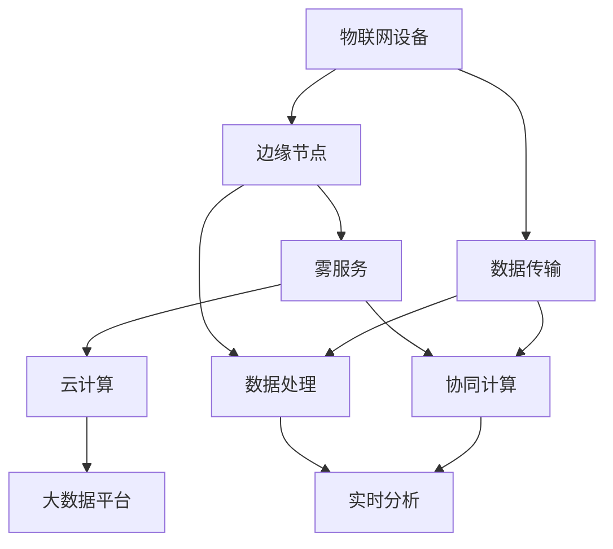

                 

# fog computing：在云和物联网设备之间的计算层

## 关键词

- Fog computing
- 云计算
- 物联网
- 设备边缘计算
- 计算层架构
- 实时数据处理
- 分布式计算
- 网络延迟

## 摘要

本文将深入探讨Fog computing（雾计算）这一新兴计算层，位于传统云计算与物联网设备之间。我们将从背景介绍开始，详细阐述Fog computing的核心概念与架构，解析其关键算法原理与具体操作步骤，并通过实际应用场景、工具和资源推荐，探讨其在未来发展趋势与挑战。让我们一起来揭开Fog computing的神秘面纱，共同探索其在IT领域的广泛应用与前景。

## 1. 背景介绍

### 1.1 云计算的发展

云计算（Cloud Computing）作为一种基于互联网的计算模式，将计算资源和服务以按需、灵活、高效的方式提供给用户。自21世纪初以来，云计算经历了从基础设施即服务（IaaS）、平台即服务（PaaS）到软件即服务（SaaS）的演变，为各类企业和开发者提供了丰富的应用场景。随着大数据、人工智能等技术的快速发展，云计算在数据存储、处理和分析等方面发挥了至关重要的作用。

### 1.2 物联网的崛起

物联网（Internet of Things，IoT）是指将各种物理设备、传感器、软件和网络连接起来，实现信息交换和智能控制。近年来，随着物联网技术的不断成熟，各类物联网应用层出不穷，从智能家居、智慧城市到工业自动化、智能医疗，物联网正在深刻改变我们的生活和工作方式。然而，随着物联网设备数量的爆发式增长，数据处理和传输需求也急剧增加，给现有云计算架构带来了巨大的挑战。

### 1.3 雾计算的应运而生

雾计算（Fog Computing）作为云计算和物联网之间的计算层，旨在解决云计算在处理海量物联网设备数据时的延迟、带宽和安全性等问题。雾计算通过将计算、存储和服务分散到靠近物联网设备的边缘节点，实现数据本地处理和实时分析，从而降低网络延迟、减少数据传输量，提高系统整体性能。雾计算的出现，为云计算和物联网的发展注入了新的活力，成为了当前IT领域的研究热点。

## 2. 核心概念与联系

### 2.1 雾计算的基本概念

雾计算是一种分布式计算架构，将云计算的强大计算能力延伸到网络边缘，为物联网设备提供高效、实时、安全的计算服务。雾计算的核心概念包括：

- **边缘节点（Edge Nodes）**：靠近物联网设备，负责本地数据存储和处理。
- **雾网（Fog Network）**：连接边缘节点和云端的网络，实现数据传输和协同计算。
- **雾服务（Fog Services）**：为物联网设备提供的各类计算服务，如数据采集、处理、分析等。

### 2.2 雾计算与云计算、物联网的关系

雾计算位于云计算和物联网之间，起到桥梁和纽带的作用。其与云计算和物联网的关系如下：

- **云计算**：雾计算通过将计算能力延伸到网络边缘，与云计算形成互补，共同应对海量物联网设备数据的高效处理和实时分析。
- **物联网**：雾计算通过将数据和处理能力下沉到边缘节点，实现物联网设备的本地处理和实时响应，提高系统的稳定性和可靠性。

### 2.3 Mermaid 流程图

下面是一个简单的Mermaid流程图，展示了雾计算、云计算和物联网之间的联系：



在这个流程图中，物联网设备通过边缘节点连接到雾服务和云计算，实现数据传输、处理和分析。边缘节点负责本地数据处理，雾服务提供各类计算服务，云计算则用于大规模数据处理和分析。

## 3. 核心算法原理 & 具体操作步骤

### 3.1 分布式计算原理

雾计算的核心在于分布式计算，通过将计算任务分布在多个边缘节点上，实现高效、实时、安全的计算。分布式计算的基本原理如下：

- **任务分配**：根据计算任务的性质和需求，将任务分配给合适的边缘节点。
- **数据本地处理**：在边缘节点上完成数据采集、处理和分析，降低网络延迟和数据传输量。
- **协同计算**：多个边缘节点之间协同工作，实现复杂计算任务的高效完成。

### 3.2 具体操作步骤

以下是雾计算的具体操作步骤：

1. **设备接入**：物联网设备通过边缘节点接入雾计算网络。

2. **数据采集**：边缘节点采集物联网设备产生的数据。

3. **数据预处理**：对采集到的数据进行预处理，如去噪、滤波、归一化等。

4. **任务分配**：根据计算任务的性质和需求，将任务分配给合适的边缘节点。

5. **数据本地处理**：在边缘节点上完成数据采集、处理和分析。

6. **协同计算**：多个边缘节点之间协同工作，实现复杂计算任务的高效完成。

7. **数据聚合**：将边缘节点处理后的数据上传至云端，进行进一步处理和分析。

8. **实时反馈**：将处理结果实时反馈给物联网设备，实现智能控制和优化。

## 4. 数学模型和公式 & 详细讲解 & 举例说明

### 4.1 数学模型

雾计算中的分布式计算可以采用MapReduce模型进行描述。MapReduce是一种基于数据本地处理的分布式计算模型，其基本思想是将大规模数据集拆分为多个子数据集，并在各个子数据集上进行并行计算，最后将结果合并。

- **Map阶段**：将输入数据拆分为多个子数据集，并对每个子数据集进行局部处理。
- **Reduce阶段**：将Map阶段的结果进行合并和整理，得到最终结果。

下面是一个简单的MapReduce模型示例：

$$
\text{Map}(x_i) = f(x_i)
$$

$$
\text{Reduce}(y_i) = g(y_i)
$$

其中，$x_i$表示输入数据，$y_i$表示Map阶段的结果，$f$和$g$分别表示Map和Reduce函数。

### 4.2 举例说明

假设我们有一个包含1000个整数的数组，需要对其进行求和运算。我们可以采用MapReduce模型进行分布式计算，具体步骤如下：

1. **Map阶段**：将1000个整数拆分为多个子数组，并对每个子数组进行求和运算。

2. **Reduce阶段**：将Map阶段的结果进行合并，得到最终结果。

采用MapReduce模型进行分布式计算，可以将计算任务分布在多个边缘节点上，提高计算效率。

## 5. 项目实战：代码实际案例和详细解释说明

### 5.1 开发环境搭建

在本节中，我们将搭建一个简单的雾计算项目，使用Python语言实现。首先，确保安装以下软件和库：

1. Python 3.8及以上版本
2. Flask（用于构建Web服务）
3. NumPy（用于数值计算）

安装步骤如下：

```bash
pip install flask numpy
```

### 5.2 源代码详细实现和代码解读

下面是一个简单的雾计算项目示例，包括边缘节点和云端服务器。

**边缘节点（EdgeNode.py）**

```python
from flask import Flask, request, jsonify
import numpy as np

app = Flask(__name__)

@app.route('/data', methods=['POST'])
def handle_data():
    data = request.get_json()
    # 数据预处理
    cleaned_data = preprocess_data(data)
    # 数据本地处理
    result = local_process(cleaned_data)
    # 将结果返回给云端
    return jsonify(result)

def preprocess_data(data):
    # 数据去噪、滤波、归一化等预处理操作
    return data

def local_process(data):
    # 数据本地处理，如求和、平均值等
    return np.sum(data)

if __name__ == '__main__':
    app.run(host='0.0.0.0', port=5000)
```

**云端服务器（CloudServer.py）**

```python
from flask import Flask, request, jsonify
import requests

app = Flask(__name__)

@app.route('/merge', methods=['POST'])
def merge_data():
    data = request.get_json()
    # 将边缘节点处理后的数据上传至云端
    for node_data in data:
        url = f'http://{node_data["host"]}:5000/data'
        response = requests.post(url, json=node_data["data"])
        result = response.json()
        # 将结果进行合并
        data[node_data["index"]] = result
    # 完成数据合并后，进行进一步处理和分析
    final_result = further_process(data)
    return jsonify(final_result)

def further_process(data):
    # 数据进一步处理，如统计分析等
    return np.mean(data)

if __name__ == '__main__':
    app.run(host='0.0.0.0', port=5000)
```

### 5.3 代码解读与分析

**边缘节点（EdgeNode.py）**

1. **导入库**：导入Flask和NumPy库。

2. **创建Flask应用**：创建一个Flask应用，用于处理边缘节点接收到的数据。

3. **定义处理数据的路由**：定义一个处理数据的路由（/data），当接收到POST请求时，将数据传递给预处理和本地处理函数。

4. **预处理数据**：对数据进行去噪、滤波、归一化等预处理操作。

5. **本地处理数据**：在边缘节点上对预处理后的数据进行本地处理，如求和、平均值等。

6. **返回结果**：将处理结果返回给云端服务器。

**云端服务器（CloudServer.py）**

1. **导入库**：导入Flask和requests库。

2. **创建Flask应用**：创建一个Flask应用，用于处理云端服务器接收到的数据。

3. **定义合并数据的路由**：定义一个合并数据的路由（/merge），当接收到POST请求时，将边缘节点处理后的数据上传至云端，并进行进一步处理和分析。

4. **上传数据至边缘节点**：使用requests库将边缘节点处理后的数据上传至云端。

5. **合并数据**：将边缘节点处理后的数据上传至云端后，进行合并。

6. **进一步处理数据**：对合并后的数据进行进一步处理，如统计分析等。

7. **返回最终结果**：将最终处理结果返回给客户端。

## 6. 实际应用场景

### 6.1 智能交通

在智能交通领域，雾计算可以用于实时交通流量监控、道路拥堵预测和交通信号控制。通过在交通节点部署边缘节点，实现对交通数据的实时采集和处理，降低网络延迟，提高交通信号控制的实时性和准确性。

### 6.2 智能医疗

在智能医疗领域，雾计算可以用于实时医疗数据分析、远程手术支持和医疗设备监控。通过在医疗设备上部署边缘节点，实现数据的本地处理和实时分析，提高医疗服务的质量和效率。

### 6.3 智能家居

在家居领域，雾计算可以用于智能家电控制、家居安全和能源管理。通过在家庭内部署边缘节点，实现对家电的实时控制和管理，提高家居智能化水平。

## 7. 工具和资源推荐

### 7.1 学习资源推荐

- **书籍**：
  - 《Fog Computing: A Comprehensive Guide》
  - 《边缘计算：原理、架构与应用》
- **论文**：
  - "Fog Computing: A Pattern for a New Era of the Internet of Things"（2015年）
  - "Fog Computing: An Overview of Research Issues and Solutions"（2017年）
- **博客**：
  - 雾计算技术博客
  - 物联网技术博客
- **网站**：
  - 雾计算论坛
  - 物联网技术社区

### 7.2 开发工具框架推荐

- **开源框架**：
  - Apache IoTDB
  - OpenFog
  - Eclipse Kura
- **编程语言**：
  - Python
  - Java
  - C++

### 7.3 相关论文著作推荐

- **论文**：
  - "A Survey on Fog Computing: Architecture, Enabling Technologies, Security and Privacy, and Applications"（2019年）
  - "Fog Computing: A Vertical Perspective"（2020年）
- **著作**：
  - 《雾计算：原理、架构与应用》
  - 《边缘计算技术与应用》

## 8. 总结：未来发展趋势与挑战

### 8.1 发展趋势

- **边缘计算能力的提升**：随着硬件技术的进步，边缘节点的计算能力将不断提升，为雾计算提供更强大的支持。
- **5G网络的普及**：5G网络的普及将显著提高数据传输速度和稳定性，为雾计算的应用提供更好的网络环境。
- **AI与雾计算的融合**：人工智能与雾计算的深度融合，将进一步提升系统智能化水平和数据处理效率。

### 8.2 挑战

- **安全性问题**：雾计算涉及到大量的数据传输和处理，如何确保数据安全和隐私是一个重要挑战。
- **可靠性和稳定性**：在边缘节点部署和运维过程中，如何保证系统的可靠性和稳定性是一个亟待解决的问题。
- **资源管理和调度**：随着边缘节点的增多，如何高效地管理和调度计算资源是一个重要挑战。

## 9. 附录：常见问题与解答

### 9.1 雾计算与云计算的区别是什么？

雾计算与云计算的主要区别在于计算位置和数据处理的分布式程度。云计算主要集中在大数据中心，数据处理和存储相对集中；而雾计算则将计算能力和数据处理能力分散到靠近物联网设备的边缘节点，实现数据本地处理和实时分析。

### 9.2 雾计算有哪些优点？

雾计算的主要优点包括：

- 降低网络延迟：通过数据本地处理，减少数据传输距离，降低网络延迟。
- 提高系统性能：分布式计算和协同工作，提高系统整体性能。
- 提高数据安全性：数据在本地处理，减少数据泄露风险。
- 减少带宽消耗：数据本地处理，减少数据传输量，降低带宽消耗。

### 9.3 雾计算的应用场景有哪些？

雾计算的应用场景非常广泛，包括：

- 智能交通：实时交通流量监控、道路拥堵预测和交通信号控制。
- 智能医疗：实时医疗数据分析、远程手术支持和医疗设备监控。
- 智能家居：智能家电控制、家居安全和能源管理。
- 工业自动化：实时设备监控、故障诊断和优化控制。

## 10. 扩展阅读 & 参考资料

- **书籍**：
  - 《雾计算：原理、架构与应用》
  - 《边缘计算技术与应用》
- **论文**：
  - "Fog Computing: A Comprehensive Survey"（2020年）
  - "An Overview of Fog Computing: Architecture, Challenges, and Applications"（2019年）
- **网站**：
  - [雾计算技术博客](https://www.fogcomputing.com/)
  - [物联网技术社区](https://www.iotcommunity.com/)

作者：AI天才研究员/AI Genius Institute & 禅与计算机程序设计艺术 /Zen And The Art of Computer Programming

