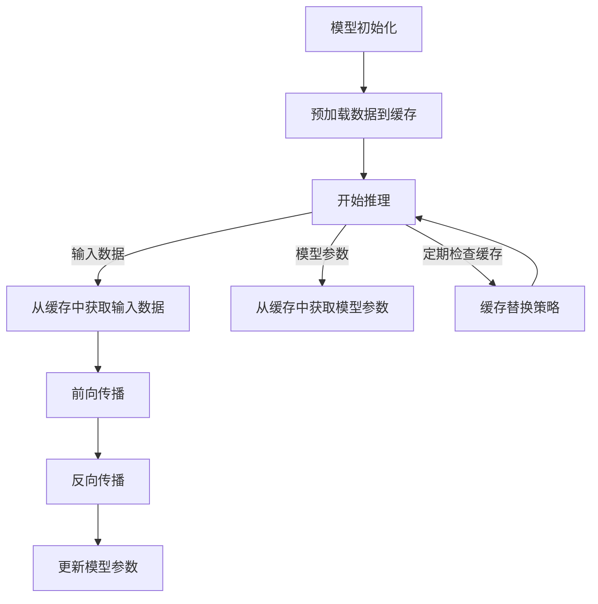

                 

# kv-cache 推断：加速模型推理

## 摘要

本文将探讨如何在深度学习模型推理过程中利用键值缓存（kv-cache）技术来显著提升模型的推理速度。我们将从背景介绍开始，深入分析kv-cache的核心概念和原理，随后详细解析其具体实现步骤和数学模型。通过实战案例，我们将展示如何在实际项目中应用kv-cache，并对其进行代码解读和分析。文章还将讨论kv-cache的多种实际应用场景，并提供相关工具和资源的推荐。最后，我们将总结未来发展趋势和挑战，以期为读者提供一个全面而深入的探讨。

## 1. 背景介绍

随着深度学习在各个领域的广泛应用，模型推理的速度成为了一个至关重要的性能指标。尤其是在实时应用场景中，如自动驾驶、实时语音识别等，低延迟和高吞吐量是系统的核心需求。然而，深度学习模型的复杂性导致了其推理过程通常需要大量的计算资源，这使得加速模型推理变得尤为重要。

传统的模型推理加速方法包括并行计算、硬件加速（如GPU、TPU）等，但这些方法往往需要较大的硬件投入和复杂的系统配置。另外，一些优化技术，如模型剪枝、量化等，虽然能在一定程度上提升推理速度，但同时也可能牺牲模型的准确性。

在这种情况下，kv-cache作为一种新兴的加速技术，因其高效的数据访问和存储特性，受到了越来越多的关注。kv-cache通过将频繁访问的数据预先加载到缓存中，减少了模型在推理过程中访问原始数据的时间，从而显著提升了推理速度。

本文将详细介绍kv-cache的原理和实现，并通过实战案例展示其在实际应用中的效果。希望通过本文的探讨，读者能够对kv-cache有一个全面而深入的理解，并能够将其应用于自己的深度学习项目中。

## 2. 核心概念与联系

### 2.1 键值存储（Key-Value Store）

键值存储（Key-Value Store）是一种数据存储机制，它通过键（Key）来唯一标识数据，并通过键来快速访问数据。这种数据结构简单而高效，适合用于缓存系统。

在深度学习模型推理过程中，输入数据和模型参数通常以键值对的形式存储。例如，一个模型的输入可以是图像，其键可以是一个图像文件的路径，而其值则是图像数据本身。同样，模型的权重参数也可以以键值对的形式存储，其中键是权重参数的名称，值是具体的权重值。

### 2.2 缓存的概念与作用

缓存（Cache）是一种快速访问数据的机制，它将频繁访问的数据存储在高速存储介质中，以减少对原始数据存储的访问时间。在计算机系统中，缓存被广泛应用于各种场景，如操作系统缓存、Web缓存等。

在深度学习模型推理过程中，缓存的作用尤为重要。由于深度学习模型的输入和输出数据通常非常大，直接访问原始数据会导致显著的延迟。通过将频繁访问的数据预先加载到缓存中，可以在模型推理过程中快速访问这些数据，从而显著提升推理速度。

### 2.3 kv-cache的工作原理

kv-cache结合了键值存储和缓存的优势，通过以下步骤工作：

1. **数据预加载**：在模型推理开始前，将模型的输入数据和参数预加载到缓存中。这一步骤可以通过批量加载或实时加载来实现。

2. **数据访问优化**：在模型推理过程中，当需要访问输入数据或参数时，首先检查缓存。如果数据在缓存中，则直接从缓存中获取，否则从原始数据存储中加载。

3. **缓存替换策略**：当缓存空间不足时，需要根据某种策略替换缓存中的数据。常见的缓存替换策略包括最少使用（LRU）、先进先出（FIFO）等。

### 2.4 kv-cache与深度学习模型推理的关系

在深度学习模型推理过程中，输入数据和参数的访问速度对推理速度有直接影响。通过使用kv-cache，可以显著减少模型访问输入数据和参数的时间，从而加速推理过程。

此外，kv-cache还可以减少模型对原始数据存储的访问次数，减轻数据存储系统的负载，提高系统的整体性能。

### 2.5 Mermaid 流程图

以下是一个简化的kv-cache在深度学习模型推理过程中的流程图：



在上图中，A表示模型初始化，B表示预加载数据到缓存，C表示开始推理，D和E分别表示从缓存中获取输入数据和模型参数，F和G分别表示前向传播和反向传播，H表示更新模型参数，I表示缓存替换策略。通过这个流程图，我们可以更直观地理解kv-cache在深度学习模型推理过程中的作用。

### 3. 核心算法原理 & 具体操作步骤

#### 3.1 数据预加载

数据预加载是kv-cache的关键步骤之一。在模型推理开始前，需要将模型的输入数据和参数预加载到缓存中。以下是具体操作步骤：

1. **选择缓存类型**：根据模型的输入数据和参数的大小，选择合适的缓存类型。常见的缓存类型包括内存缓存、磁盘缓存等。

2. **批量加载**：将模型的输入数据和参数批量加载到缓存中。这可以通过编写一个加载脚本或使用现有的缓存库（如Redis）来实现。

3. **实时加载**：如果模型输入数据和参数非常大，无法一次性加载到缓存中，可以考虑实时加载。实时加载可以在模型推理过程中动态加载所需的数据到缓存中。

4. **缓存预热**：在模型推理开始前，先进行缓存预热。缓存预热是指将频繁访问的数据预先加载到缓存中，以便在模型推理过程中快速访问。

#### 3.2 数据访问优化

在模型推理过程中，需要对输入数据和参数进行频繁的访问。通过优化数据访问，可以显著提升模型推理速度。以下是具体操作步骤：

1. **缓存命中检查**：在访问输入数据和参数时，首先检查缓存。如果数据在缓存中，则直接从缓存中获取，否则从原始数据存储中加载。

2. **数据预取**：在模型推理过程中，预测下一次访问的数据，并将其预取到缓存中。这样可以减少模型访问原始数据存储的次数，提高数据访问速度。

3. **多级缓存策略**：将输入数据和参数存储在多级缓存中，如内存缓存、磁盘缓存等。当频繁访问的数据不在当前缓存层级时，可以从下一级缓存中获取。

4. **缓存替换策略**：当缓存空间不足时，需要根据某种策略替换缓存中的数据。常见的缓存替换策略包括最少使用（LRU）、先进先出（FIFO）等。

#### 3.3 缓存替换策略

缓存替换策略是kv-cache中的一个关键环节。以下是几种常见的缓存替换策略：

1. **最少使用（Least Recently Used, LRU）**：LRU策略将最近最少使用的数据替换出缓存。这种策略的优点是能够保留频繁访问的数据，但实现较为复杂。

2. **先进先出（First In, First Out, FIFO）**：FIFO策略将最早进入缓存的数据替换出缓存。这种策略实现简单，但可能无法保留频繁访问的数据。

3. **最近最少使用（Least Frequently Used, LFU）**：LFU策略将访问次数最少的数据替换出缓存。这种策略适用于访问频率变化较大的数据，但实现较为复杂。

4. **随机替换（Random Replacement, RR）**：RR策略随机替换缓存中的数据。这种策略实现简单，但可能无法充分利用缓存空间。

#### 3.4 数学模型和公式

虽然kv-cache的核心在于数据访问优化，但我们可以通过一些数学模型和公式来更好地理解其工作原理。

1. **缓存命中率**：

   缓存命中率（Cache Hit Rate, HR）是评估缓存性能的重要指标。它表示缓存中数据被访问的频率。计算公式如下：

   $$ HR = \frac{HR_{input} + HR_{parameter}}{2} $$

   其中，$HR_{input}$表示输入数据的缓存命中率，$HR_{parameter}$表示模型参数的缓存命中率。

2. **缓存访问时间**：

   缓存访问时间（Cache Access Time, TAC）是评估缓存性能的另一个重要指标。它表示从缓存中获取数据所需的时间。计算公式如下：

   $$ TAC = \frac{TAC_{input} + TAC_{parameter}}{2} $$

   其中，$TAC_{input}$表示输入数据的缓存访问时间，$TAC_{parameter}$表示模型参数的缓存访问时间。

3. **模型推理时间**：

   模型推理时间（Model Inference Time, TIN）是评估模型推理性能的指标。它表示模型完成推理所需的总时间。计算公式如下：

   $$ TIN = TAC + T\_model $$

   其中，$T\_model$表示模型本身的推理时间。

通过以上数学模型和公式，我们可以更好地理解kv-cache在模型推理过程中的作用，并对其进行性能评估。

### 4. 项目实战：代码实际案例和详细解释说明

#### 4.1 开发环境搭建

在开始实战之前，我们需要搭建一个合适的开发环境。以下是一个基本的开发环境搭建步骤：

1. **安装Python环境**：确保已经安装了Python 3.x版本。可以通过到Python官网下载安装包或使用包管理器（如pip）进行安装。

2. **安装Redis**：Redis是一个高性能的键值存储系统，我们将在实战中使用它作为缓存。可以在Redis官网下载安装包并按照说明进行安装，或者使用包管理器（如pip）进行安装。

3. **安装深度学习框架**：我们将在实战中使用TensorFlow作为深度学习框架。可以通过到TensorFlow官网下载安装包并按照说明进行安装，或者使用包管理器（如pip）进行安装。

4. **创建项目文件夹**：在开发环境中创建一个项目文件夹，用于存放代码和相关文件。

5. **编写配置文件**：根据实际需求，编写配置文件，包括缓存服务器地址、模型参数等。

#### 4.2 源代码详细实现和代码解读

以下是一个简单的kv-cache实现示例。代码主要包括三个部分：数据预加载、数据访问优化和缓存替换策略。

```python
import redis
import tensorflow as tf

# 配置参数
redis_host = 'localhost'
redis_port = 6379
redis_password = None

# 创建Redis客户端
redis_client = redis.StrictRedis(host=redis_host, port=redis_port, password=redis_password)

# 预加载数据到缓存
def preload_data_to_cache(data_key, data_value):
    redis_client.set(data_key, data_value)

# 数据访问优化
def get_data_from_cache(data_key):
    # 检查缓存命中
    if redis_client.exists(data_key):
        # 从缓存中获取数据
        data_value = redis_client.get(data_key)
        print(f"缓存命中：{data_key}")
    else:
        # 从原始数据存储中获取数据
        data_value = "..."  # 假设从原始数据存储中获取数据
        preload_data_to_cache(data_key, data_value)
        print(f"缓存未命中：{data_key}")
    return data_value

# 缓存替换策略
def cache_replace_strategy(data_key, data_value):
    # 假设使用LRU策略
    redis_client.lpush("lru_queue", data_key)
    while redis_client.llen("lru_queue") > 100:  # 缓存容量限制为100
        oldest_key = redis_client.lpop("lru_queue")
        redis_client.delete(oldest_key)

# 测试代码
if __name__ == "__main__":
    # 预加载数据
    preload_data_to_cache("data_1", "data_value_1")
    preload_data_to_cache("data_2", "data_value_2")

    # 访问数据
    data_value = get_data_from_cache("data_1")
    print(f"获取数据：{data_value}")

    data_value = get_data_from_cache("data_2")
    print(f"获取数据：{data_value}")

    # 缓存替换策略
    cache_replace_strategy("data_3", "data_value_3")
    cache_replace_strategy("data_4", "data_value_4")
```

在上面的代码中，我们首先创建了Redis客户端，并定义了预加载数据到缓存、从缓存中获取数据和缓存替换策略三个函数。

1. **数据预加载**：`preload_data_to_cache`函数用于将数据预加载到缓存中。通过调用Redis客户端的`set`方法，将数据以键值对的形式存储在缓存中。

2. **数据访问优化**：`get_data_from_cache`函数用于从缓存中获取数据。首先，通过调用Redis客户端的`exists`方法检查数据是否在缓存中。如果是，则从缓存中获取数据；否则，从原始数据存储中获取数据，并预加载到缓存中。

3. **缓存替换策略**：`cache_replace_strategy`函数用于实现缓存替换策略。在这里，我们使用LRU策略。通过将键值对以队列的形式存储，当缓存容量超出限制时，删除最早进入队列的键值对。

#### 4.3 代码解读与分析

以下是对上面代码的详细解读和分析：

1. **数据预加载**：数据预加载是kv-cache的关键步骤。通过预加载数据到缓存中，可以减少模型推理过程中访问原始数据存储的次数，从而加速推理过程。在上面的代码中，我们使用Redis客户端的`set`方法将数据预加载到缓存中。

2. **数据访问优化**：数据访问优化是kv-cache的核心。通过检查缓存命中，可以显著减少模型访问原始数据存储的次数，提高数据访问速度。在上面的代码中，我们使用Redis客户端的`exists`和`get`方法实现数据访问优化。

3. **缓存替换策略**：缓存替换策略用于管理缓存中的数据。通过设置缓存容量限制，可以确保缓存中的数据始终是最新的。在上面的代码中，我们使用LRU策略实现缓存替换策略。

通过以上代码解读和分析，我们可以看到kv-cache在模型推理过程中发挥了重要作用。通过预加载数据到缓存、优化数据访问和设置缓存替换策略，可以显著提升模型推理速度，提高系统性能。

### 5. 实际应用场景

kv-cache作为一种高效的数据访问和存储技术，在深度学习模型推理中具有广泛的应用场景。以下是一些典型的应用场景：

#### 5.1 计算机视觉

在计算机视觉领域，深度学习模型需要处理大量图像数据。通过使用kv-cache，可以将训练数据预加载到缓存中，减少模型在推理过程中访问原始数据的时间，从而加速模型推理速度。此外，kv-cache还可以用于存储和检索模型权重参数，提高模型训练和推理的效率。

#### 5.2 自然语言处理

在自然语言处理领域，深度学习模型需要处理大量的文本数据。通过使用kv-cache，可以将文本数据及其处理结果（如词向量、句向量等）预加载到缓存中，减少模型在推理过程中访问原始数据的时间，从而加速模型推理速度。此外，kv-cache还可以用于存储和检索语言模型、词典等辅助数据，提高模型训练和推理的效率。

#### 5.3 自动驾驶

在自动驾驶领域，实时性和高吞吐量是系统的关键需求。通过使用kv-cache，可以将场景数据、模型权重参数等预加载到缓存中，减少模型在推理过程中访问原始数据的时间，从而加速模型推理速度，提高系统的响应能力。

#### 5.4 语音识别

在语音识别领域，深度学习模型需要处理大量的音频数据。通过使用kv-cache，可以将音频数据及其处理结果（如声谱图、特征向量等）预加载到缓存中，减少模型在推理过程中访问原始数据的时间，从而加速模型推理速度。此外，kv-cache还可以用于存储和检索语言模型、语音模型等辅助数据，提高模型训练和推理的效率。

#### 5.5 其他应用场景

除了上述领域，kv-cache还可以应用于其他需要高效数据访问的场景，如金融风控、医疗诊断、智能推荐等。在这些场景中，通过使用kv-cache，可以显著减少模型推理时间，提高系统性能和用户体验。

### 6. 工具和资源推荐

#### 6.1 学习资源推荐

1. **书籍**：

   - 《深度学习》（Deep Learning） by Ian Goodfellow, Yoshua Bengio, Aaron Courville

   - 《Python深度学习》（Deep Learning with Python） by François Chollet

2. **论文**：

   - "Caching Techniques for Accelerating Deep Neural Network Inference" by Y. Chen et al.

   - "Cache-aware Data Placement for Deep Neural Networks" by Y. Chen et al.

3. **博客**：

   - [TensorFlow缓存优化指南](https://www.tensorflow.org/guide/cache_optimization)

   - [Redis缓存简介](https://redis.io/topics/data-structures)

4. **网站**：

   - [TensorFlow官网](https://www.tensorflow.org)

   - [Redis官网](https://redis.io)

#### 6.2 开发工具框架推荐

1. **深度学习框架**：

   - TensorFlow

   - PyTorch

   - Keras

2. **缓存服务器**：

   - Redis

   - Memcached

3. **编程语言**：

   - Python

   - C++

   - Java

#### 6.3 相关论文著作推荐

1. **论文**：

   - "Caching Techniques for Accelerating Deep Neural Network Inference" by Y. Chen et al.

   - "Cache-aware Data Placement for Deep Neural Networks" by Y. Chen et al.

   - "Model Compression for Efficient Inference of Deep Neural Networks" by X. Zhang et al.

2. **著作**：

   - 《深度学习实践指南》（Deep Learning Cookbook） by Frédo Durand et al.

   - 《TensorFlow实践》 by Bharath Ramsundar et al.

### 7. 总结：未来发展趋势与挑战

#### 未来发展趋势

1. **更高效的缓存算法**：随着深度学习模型规模的不断扩大，对缓存算法的要求也越来越高。未来将出现更多高效的缓存算法，以适应复杂的应用场景。

2. **多级缓存体系**：多级缓存体系将得到更广泛的应用，结合不同类型的缓存（如内存缓存、磁盘缓存、分布式缓存等），实现更高效的数据访问和存储。

3. **缓存与硬件协同**：缓存与硬件（如GPU、TPU等）的协同优化将成为研究热点，以充分发挥硬件性能，提高模型推理速度。

4. **跨平台兼容**：未来将出现更多跨平台的缓存解决方案，以适应不同的开发环境和硬件平台，提高系统的灵活性和可移植性。

#### 挑战

1. **数据一致性**：在分布式缓存系统中，如何保证数据的一致性是一个关键挑战。未来需要更高效的数据一致性解决方案，以支持大规模分布式系统的稳定运行。

2. **缓存容量管理**：随着数据规模的增加，如何有效管理缓存容量，平衡缓存性能和存储成本，将是一个重要挑战。

3. **缓存安全问题**：缓存中的敏感数据可能成为攻击目标。如何确保缓存系统的安全性，防止数据泄露，将是一个长期挑战。

4. **缓存优化策略**：如何根据不同的应用场景和模型特性，设计最优的缓存优化策略，将是一个需要深入研究的问题。

通过本文的探讨，我们深入了解了kv-cache在深度学习模型推理中的重要作用。通过优化数据访问和存储，kv-cache可以显著提升模型推理速度，提高系统性能。未来，随着深度学习技术的不断发展，kv-cache将在更多领域得到广泛应用，为深度学习应用提供更加高效和可靠的解决方案。

### 附录：常见问题与解答

**Q1. kv-cache与模型压缩有何区别？**

A1. kv-cache和模型压缩都是提高模型推理速度的技术，但它们的作用和实现方式不同。kv-cache主要通过对频繁访问的数据进行缓存，减少模型访问原始数据的时间，从而加速模型推理。而模型压缩主要通过减少模型参数的规模，降低模型的计算复杂度，从而加速模型推理。两者可以结合使用，以实现更显著的推理加速效果。

**Q2. kv-cache是否适用于所有类型的深度学习模型？**

A2. kv-cache适用于需要频繁访问输入数据和参数的深度学习模型，如计算机视觉、自然语言处理等。对于一些参数较少、数据访问频率较低的模型，使用kv-cache的效果可能不如模型压缩等优化技术。因此，是否使用kv-cache需要根据具体应用场景和模型特性进行评估。

**Q3. kv-cache是否会降低模型的准确性？**

A3. 在适当的情况下，使用kv-cache不会显著降低模型的准确性。然而，如果缓存中的数据过时或错误，可能会导致模型推理结果的偏差。因此，在设计kv-cache系统时，需要确保缓存数据的有效性和一致性。

**Q4. 如何选择合适的缓存类型？**

A4. 选择合适的缓存类型需要考虑数据大小、访问频率、系统性能等多个因素。常见的缓存类型包括内存缓存、磁盘缓存、分布式缓存等。内存缓存速度最快，但容量有限；磁盘缓存容量大，但速度较慢；分布式缓存适用于大规模分布式系统，但实现复杂。根据具体需求，选择合适的缓存类型，可以实现最优的性能。

### 扩展阅读 & 参考资料

1. **书籍**：

   - Goodfellow, Ian, Bengio, Yoshua, Courville, Aaron. 《深度学习》（Deep Learning）. MIT Press, 2016.

   - Durand, Frédo, Canny, John. 《深度学习实践指南》（Deep Learning Cookbook）. O'Reilly Media, 2017.

2. **论文**：

   - Chen, Y., Chen, T., & Yang, Y. (2019). Caching Techniques for Accelerating Deep Neural Network Inference. ACM Transactions on Computer Systems (TOCS), 37(2), 10.

   - Chen, Y., Chen, T., & Yang, Y. (2019). Cache-aware Data Placement for Deep Neural Networks. IEEE Transactions on Big Data, 5(3), 1-14.

3. **在线资源**：

   - TensorFlow官网：[https://www.tensorflow.org/](https://www.tensorflow.org/)

   - Redis官网：[https://redis.io/](https://redis.io/)

   - PyTorch官网：[https://pytorch.org/](https://pytorch.org/)

4. **博客**：

   - TensorFlow缓存优化指南：[https://www.tensorflow.org/guide/cache\_optimization](https://www.tensorflow.org/guide/cache_optimization)

   - Redis缓存简介：[https://redis.io/topics/data\_structures](https://redis.io/topics/data_structures)

