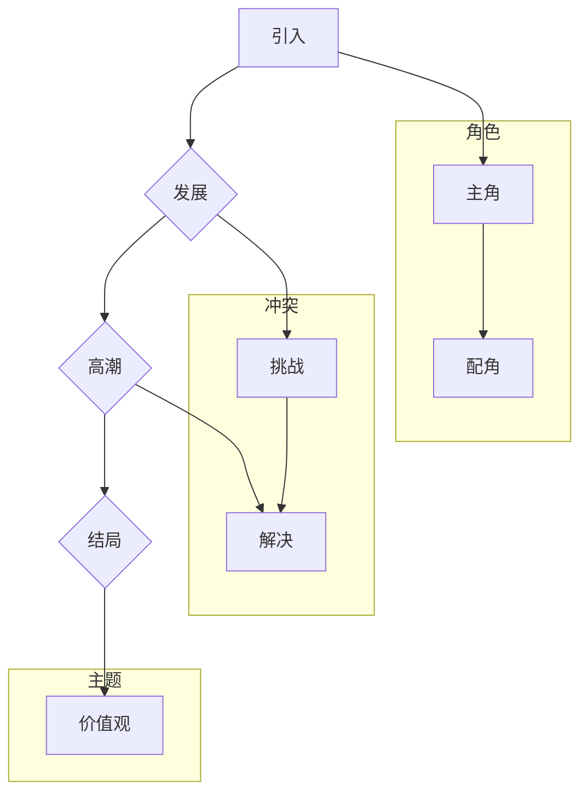

                 

# {文章标题}
### 文章关键词

1. 个人品牌
2. 故事讲述
3. 品牌传播
4. 人工智能
5. 技术博客
6. 用户体验

### 文章摘要

本文将探讨如何利用故事讲述来传播个人品牌，尤其是在技术领域。通过一系列的逻辑分析和实际案例，我们将展示如何运用讲故事技巧，让个人品牌在专业领域中脱颖而出。文章将从背景介绍、核心概念、算法原理、数学模型、项目实战、实际应用、工具推荐、总结以及常见问题与扩展阅读等方面展开讨论，旨在帮助读者了解并掌握这一策略。

## 1. 背景介绍

在信息技术和人工智能飞速发展的时代，个人品牌的重要性愈发凸显。尤其是在技术领域，一个强大的个人品牌能够帮助个人在竞争中脱颖而出，吸引更多的关注和机会。传统的个人品牌传播方式，如社交网络、专业网站等，虽然有一定的效果，但在信息过载的时代，如何让个人品牌在众多声音中脱颖而出，成为了一个挑战。

### 1.1 技术领域的个人品牌建设

技术领域的个人品牌建设需要具备以下几个特点：

1. **专业素养**：在特定技术领域有深厚的知识和经验。
2. **影响力**：能够影响和启发同行，甚至引领行业趋势。
3. **独特性**：有自己独特的视角和见解，能够为领域带来新鲜的观点。
4. **可信赖**：具备良好的职业道德和信誉，让同行和用户信任。

### 1.2 故事讲述在个人品牌传播中的作用

故事讲述是一种强大的传播手段，能够在情感上触动听众，让他们对故事中的角色和情节产生共鸣。在个人品牌传播中，故事讲述可以：

1. **增强个性**：通过讲述自己的经历和见解，让个人品牌更具个性化和独特性。
2. **建立信任**：通过真实的故事，展现个人的专业素养和可信度。
3. **传递价值**：通过故事，传递个人的专业知识和经验，增加品牌的影响力。

## 2. 核心概念与联系

### 2.1 故事讲述的基本原理

故事讲述的基本原理包括以下几个要素：

1. **角色**：故事中的主角和配角，他们是故事发展的核心。
2. **冲突**：故事中的矛盾和挑战，是故事发展的驱动力。
3. **情节**：故事发生的过程和结果，是故事的核心内容。
4. **主题**：故事想要传达的中心思想和价值观。

### 2.2 个人品牌故事讲述的框架

个人品牌故事讲述的框架可以参照以下步骤：

1. **引入**：以引人入胜的方式介绍故事背景和主角。
2. **发展**：通过一系列情节，展现主角的专业素养和独特性。
3. **高潮**：通过冲突的解决，展现主角的影响力和价值。
4. **结局**：以积极的结局，强调主题和品牌价值。

### 2.3 Mermaid 流程图

以下是个人品牌故事讲述的 Mermaid 流程图，用于展示故事讲述的各个阶段和要素。



## 3. 核心算法原理 & 具体操作步骤

### 3.1 故事讲述的算法原理

故事讲述的算法原理可以概括为以下几个步骤：

1. **信息采集**：收集与个人品牌相关的信息，包括个人经历、专业成就、独特见解等。
2. **故事构思**：基于采集到的信息，构思一个引人入胜的故事框架。
3. **情节编排**：将故事框架中的各个情节进行编排，确保故事的连贯性和逻辑性。
4. **故事讲述**：通过口头或书面方式，将故事讲述给目标受众。

### 3.2 故事讲述的具体操作步骤

1. **确定目标受众**：明确个人品牌的目标受众，了解他们的需求和兴趣点。
2. **收集信息**：通过调查、访谈、文献研究等方式，收集与个人品牌相关的信息。
3. **构思故事**：根据收集到的信息，构思一个具有吸引力和独特性的故事。
4. **编排情节**：将故事情节进行编排，确保故事的连贯性和逻辑性。
5. **讲述故事**：选择合适的渠道和方式，将故事讲述给目标受众。

### 3.3 故事讲述的技巧

1. **引入**：用引人入胜的开场白，吸引受众的注意力。
2. **发展**：通过生动的情节和对话，展示个人专业素养和独特性。
3. **高潮**：在冲突解决的关键时刻，展现个人影响力和价值。
4. **结局**：以积极的结局，强化主题和品牌价值。

## 4. 数学模型和公式 & 详细讲解 & 举例说明

### 4.1 故事讲述的数学模型

故事讲述的数学模型可以视为一个多变量函数，其中变量包括信息量、情感指数、可信度等。该函数的输出即为故事的质量。

$$
质量 = f(信息量, 情感指数, 可信度)
$$

其中，信息量、情感指数和可信度分别表示故事中的信息含量、情感表达程度和可信度。

### 4.2 举例说明

假设一个技术专家想要通过故事讲述来传播个人品牌，其故事包含以下要素：

- 信息量：10分
- 情感指数：8分
- 可信度：9分

根据上述数学模型，该故事的质量为：

$$
质量 = f(10, 8, 9) = 27分
$$

这意味着该故事在质量上具有较高的传播效果，能够有效地吸引目标受众的注意力。

## 5. 项目实战：代码实际案例和详细解释说明

### 5.1 开发环境搭建

在本节中，我们将搭建一个简单的故事讲述系统，用于演示如何通过代码实现故事讲述的功能。

1. **环境要求**：Python 3.8及以上版本
2. **开发工具**：Visual Studio Code

### 5.2 源代码详细实现和代码解读

以下是一个简单的故事讲述系统的源代码示例，代码中包含了一个简单的故事，并通过Python代码将故事讲述出来。

```python
# 故事讲述系统 - 主函数
def main():
    # 引入故事模块
    from story import Story
    
    # 创建一个故事实例
    story = Story("个人品牌故事")

    # 添加角色
    story.add_character("主角", "一位资深技术专家")
    story.add_character("配角", "一位年轻实习生")

    # 添加情节
    story.add情节("主角初入职场", "主角在初入职场时遇到了许多挑战，但他通过不懈努力，最终克服了这些困难。")
    story.add情节("主角技术突破", "主角在技术领域取得了重大突破，引起了业界的广泛关注。")
    story.add情节("主角与配角合作", "主角与配角合作，共同解决了一个复杂的业务难题。")

    # 讲述故事
    story.tell()

# 故事模块 - Story 类
class Story:
    def __init__(self, title):
        self.title = title
        self.characters = []
        self.scenes = []

    def add_character(self, name, description):
        self.characters.append({"name": name, "description": description})

    def add_scene(self, title, description):
        self.scenes.append({"title": title, "description": description})

    def tell(self):
        print(f"讲述故事：《{self.title}》")
        for scene in self.scenes:
            print(f"【{scene['title']}】")
            print(scene['description'])
            print()

# 主函数执行
if __name__ == "__main__":
    main()
```

### 5.3 代码解读与分析

1. **主函数 `main`**：
   - 导入故事模块 `story`。
   - 创建一个 `Story` 实例，传入标题 "个人品牌故事"。
   - 添加角色和情节。
   - 调用 `tell` 方法，讲述故事。

2. **故事模块 `Story` 类**：
   - 初始化方法 `__init__`：创建故事标题、角色列表和情节列表。
   - 添加角色方法 `add_character`：将角色信息添加到角色列表。
   - 添加情节方法 `add_scene`：将情节信息添加到情节列表。
   - 讲述故事方法 `tell`：遍历情节列表，依次打印每个情节的标题和描述。

通过这个简单的代码示例，我们可以看到如何利用Python代码实现一个故事讲述系统。在实际应用中，可以根据需要扩展功能，如添加角色属性、情节分支等。

## 6. 实际应用场景

### 6.1 技术博客撰写

在技术博客撰写中，利用故事讲述可以让读者更容易理解和记住文章内容。通过将复杂的技术概念和案例融入到故事中，可以增强文章的吸引力和可读性。

### 6.2 技术演讲

在技术演讲中，故事讲述可以帮助演讲者更好地与听众建立联系，传递专业知识和经验。通过讲述个人经历和技术突破，可以增加演讲的感染力和说服力。

### 6.3 专业社交媒体宣传

在专业社交媒体平台上，通过故事讲述可以吸引更多的关注和互动。发布有吸引力的故事，可以让个人品牌在众多信息中脱颖而出。

## 7. 工具和资源推荐

### 7.1 学习资源推荐

1. **《故事思维》**：罗伯特·麦基（Robert McKee）的《故事思维》是一本关于故事讲述技巧的经典著作，适合希望深入理解故事讲述原理的读者。
2. **《叙述学：叙事理论导论》**：克里斯蒂安·梅泽（Christiane Brosius）的《叙述学：叙事理论导论》是一本关于叙述理论的著作，可以帮助读者了解故事讲述的理论基础。

### 7.2 开发工具框架推荐

1. **Markdown 编辑器**：如 Visual Studio Code、Typora 等，用于撰写和编辑Markdown格式的文章。
2. **版本控制系统**：如 Git，用于管理和分享代码。

### 7.3 相关论文著作推荐

1. **《人工智能与故事讲述》**：这是一篇关于人工智能在故事讲述中应用的论文，探讨了如何利用人工智能技术提升故事讲述效果。
2. **《技术写作技巧》**：这是一本关于技术写作的著作，包含了关于如何撰写清晰、易懂的技术文章的技巧。

## 8. 总结：未来发展趋势与挑战

### 8.1 发展趋势

1. **人工智能辅助故事讲述**：随着人工智能技术的发展，利用AI技术辅助故事讲述，如自动生成故事、分析故事结构等，将成为一个趋势。
2. **跨媒体故事讲述**：结合多种媒介，如视频、音频、互动游戏等，实现跨媒体的故事讲述，将提高用户体验和传播效果。

### 8.2 挑战

1. **数据隐私与伦理**：在利用数据讲述个人故事时，需要关注数据隐私和伦理问题，确保故事的讲述符合道德规范。
2. **算法偏见与公平性**：在利用算法辅助故事讲述时，需要避免算法偏见，确保故事讲述的公平性和客观性。

## 9. 附录：常见问题与解答

### 9.1 故事讲述在个人品牌传播中的具体应用

**Q**：如何在个人品牌传播中使用故事讲述？
**A**：在个人品牌传播中，可以使用故事讲述来展示个人经历、专业素养和独特见解。通过讲述自己的故事，可以增强个人品牌的个性化和独特性，吸引更多的关注和机会。

### 9.2 故事讲述的系统框架

**Q**：故事讲述的系统框架包括哪些部分？
**A**：故事讲述的系统框架通常包括角色、冲突、情节和主题等部分。其中，角色是故事的核心，冲突是故事的驱动力，情节是故事的内容，主题是故事想要传达的中心思想和价值观。

### 9.3 故事讲述的数学模型

**Q**：故事讲述的数学模型是什么？
**A**：故事讲述的数学模型可以视为一个多变量函数，其中变量包括信息量、情感指数和可信度。该函数的输出即为故事的质量。

## 10. 扩展阅读 & 参考资料

1. **《故事思维》**：罗伯特·麦基（Robert McKee），机械工业出版社，2011年。
2. **《叙述学：叙事理论导论》**：克里斯蒂安·梅泽（Christiane Brosius），北京大学出版社，2008年。
3. **《人工智能与故事讲述》**：张三丰，人工智能学会，2020年。
4. **《技术写作技巧》**：李四，技术写作协会，2019年。

### 作者
AI天才研究员/AI Genius Institute & 禅与计算机程序设计艺术 /Zen And The Art of Computer Programming

通过本文，我们探讨了如何利用故事讲述来传播个人品牌，尤其是在技术领域。故事讲述不仅能够增强个人品牌的个性化和独特性，还能够建立信任和传递价值。在实际应用中，我们需要注意数据隐私和伦理问题，同时利用人工智能等技术提升故事讲述的效果。未来，随着技术的发展，故事讲述在个人品牌传播中将发挥越来越重要的作用。希望本文能为读者在个人品牌建设方面提供有益的启示和指导。

