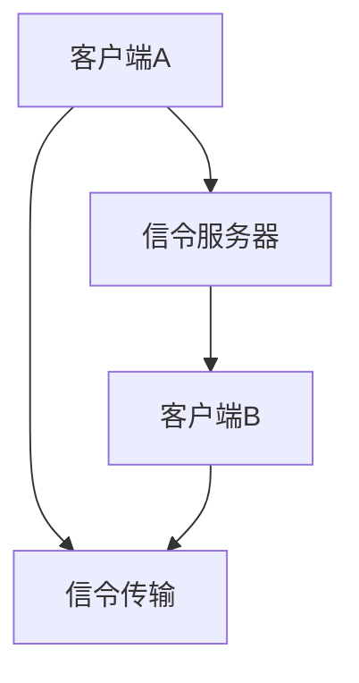

                 

# webrtc信令服务器开发

## 关键词

WebRTC，信令服务器，开发，技术，算法，项目实战，应用场景，工具资源

## 摘要

本文将深入探讨WebRTC信令服务器的开发。首先，我们将介绍WebRTC的背景和核心概念，然后详细分析其信令服务器的作用、架构和工作原理。接着，我们将一步步解析核心算法原理和具体操作步骤，并结合实际项目实战展示代码实现和详细解释。此外，本文还将列举实际应用场景、推荐的工具和资源，并对未来发展趋势与挑战进行总结。通过本文的阅读，读者将全面了解WebRTC信
令服务器的开发知识，为实际应用奠定基础。

## 1. 背景介绍

### WebRTC简介

WebRTC（Web Real-Time Communication）是一种支持网页浏览器进行实时语音对话或视频聊天的技术。它由Google发起，并被多家知名浏览器如Chrome、Firefox、Edge等支持。WebRTC旨在简化实时通信的应用开发，使开发者无需深入了解网络编程即可实现实时通信功能。

WebRTC的核心优势在于它提供了一种跨平台的实时通信解决方案，降低了开发门槛，并具有以下特点：

1. **实时性**：支持低延迟的语音和视频通信，适用于实时互动应用。
2. **安全性**：采用加密技术保护通信内容。
3. **兼容性**：支持多种浏览器和操作系统。
4. **易用性**：通过简单的API实现复杂的功能。

### 信令服务器的角色

在WebRTC通信中，信令服务器起着至关重要的作用。信令服务器是客户端之间交换信息的中介，负责传输控制信息，如连接请求、媒体流参数等。信令服务器的主要职责包括：

1. **连接管理**：管理客户端之间的连接，包括建立、维护和断开连接。
2. **参数交换**：在客户端之间交换通信参数，如ICE候选、DTLS/SRTP密钥等。
3. **协商策略**：根据客户端提供的参数，协商最佳的通信路径和参数。

## 2. 核心概念与联系

### WebRTC架构

WebRTC架构主要由以下部分组成：

1. **浏览器端**：使用WebRTC API实现实时通信功能。
2. **信令服务器**：负责处理客户端之间的信令传输。
3. **媒体服务器**：可选组件，用于处理媒体流传输，如视频编码和解码。

### 信令服务器架构

信令服务器的架构包括以下关键组件：

1. **信令传输**：通过WebSocket、HTTP/2等协议实现客户端与信令服务器之间的通信。
2. **连接管理**：负责建立、维护和断开客户端连接。
3. **参数交换**：处理客户端发送的ICE候选、DTLS/SRTP密钥等参数。
4. **协商策略**：根据客户端提供的参数，协商最佳通信路径和参数。

### Mermaid流程图

以下是一个简化的WebRTC信令服务器流程图：



## 3. 核心算法原理 & 具体操作步骤

### ICE（Interactive Connectivity Establishment）

ICE是一种网络协商算法，用于在客户端之间建立通信连接。ICE的主要步骤包括：

1. **候选地址收集**：客户端收集本地的IP地址和端口，包括LAN、WAN和公共地址。
2. **STUN（Session Traversal Utilities for NAT）**：客户端发送STUN请求到STUN服务器，获取公网IP地址和端口。
3. ** TURN（Traversal Using Relays around NAT）**：如果ICE失败，使用TURN服务器转发通信。
4. **候选地址筛选**：根据STUN和TURN的结果，筛选出可用的候选地址。
5. **连接建立**：客户端通过筛选出的候选地址建立连接。

### DTLS（Datagram Transport Layer Security）

DTLS是一种加密通信协议，用于保护WebRTC通信的安全性。DTLS的主要步骤包括：

1. **协商密钥**：客户端和服务器通过交换DTLS握手消息，协商加密密钥。
2. **加密通信**：客户端和服务器使用协商的密钥加密通信数据。

### SRTP（Secure Real-time Transport Protocol）

SRTP是一种实时传输协议，用于保护语音和视频流的安全性。SRTP的主要步骤包括：

1. **加密语音/视频流**：客户端和服务器使用SRTP加密语音/视频流。
2. **加密密钥管理**：客户端和服务器定期交换加密密钥，以保持通信的安全性。

### 具体操作步骤

1. **初始化**：启动WebRTC通信，配置ICE、DTLS和SRTP。
2. **收集候选地址**：客户端收集本地候选地址。
3. **发送STUN请求**：客户端发送STUN请求，获取公网IP地址和端口。
4. **发送ICE候选地址**：客户端将筛选出的候选地址发送给信令服务器。
5. **信令服务器协商**：信令服务器根据客户端的候选地址，选择最佳通信路径和参数。
6. **连接建立**：客户端和服务器通过筛选出的候选地址建立连接。
7. **加密通信**：客户端和服务器使用DTLS和SRTP加密通信数据。

## 4. 数学模型和公式 & 详细讲解 & 举例说明

### ICE算法

ICE算法的核心是计算两个客户端之间的最佳通信路径。以下是一个简化的ICE算法步骤：

1. **收集候选地址**：客户端收集本地的IP地址和端口。
2. **STUN请求**：客户端发送STUN请求，获取公网IP地址和端口。
3. **TURN请求**：如果ICE失败，客户端发送TURN请求，获取中继地址。
4. **筛选候选地址**：根据STUN和TURN的结果，筛选出可用的候选地址。
5. **连接建立**：客户端通过筛选出的候选地址建立连接。

### DTLS加密算法

DTLS加密算法的核心是Diffie-Hellman密钥交换。以下是一个简化的DTLS加密算法步骤：

1. **客户端发送Client Hello**：客户端发送Client Hello消息，包含公钥和随机数。
2. **服务器发送Server Hello**：服务器发送Server Hello消息，包含公钥和随机数。
3. **计算会话密钥**：客户端和服务器使用Diffie-Hellman密钥交换计算会话密钥。
4. **加密通信**：客户端和服务器使用会话密钥加密通信数据。

### SRTP加密算法

SRTP加密算法的核心是AES（Advanced Encryption Standard）加密。以下是一个简化的SRTP加密算法步骤：

1. **客户端发送SRTP数据包**：客户端发送SRTP数据包，包含语音/视频流和加密密钥。
2. **服务器接收SRTP数据包**：服务器接收SRTP数据包，解密语音/视频流。
3. **加密密钥管理**：客户端和服务器定期交换加密密钥，以保持通信的安全性。

### 举例说明

假设有两个客户端A和B，需要进行WebRTC通信。

1. **收集候选地址**：客户端A和客户端B分别收集本地的IP地址和端口。
2. **发送STUN请求**：客户端A发送STUN请求，获取公网IP地址和端口；客户端B也发送STUN请求，获取公网IP地址和端口。
3. **发送ICE候选地址**：客户端A将筛选出的候选地址发送给信令服务器；客户端B也将筛选出的候选地址发送给信令服务器。
4. **信令服务器协商**：信令服务器根据客户端A和客户端B的候选地址，选择最佳通信路径和参数。
5. **连接建立**：客户端A和客户端B通过筛选出的候选地址建立连接。
6. **加密通信**：客户端A和客户端B使用DTLS和SRTP加密通信数据。

## 5. 项目实战：代码实际案例和详细解释说明

### 开发环境搭建

在开始WebRTC信令服务器的开发之前，需要搭建合适的开发环境。以下是一个简单的开发环境搭建步骤：

1. **安装Node.js**：从官方网站下载并安装Node.js。
2. **安装WebSocket库**：在Node.js中安装WebSocket库，如`ws`库。
3. **安装其他依赖库**：根据项目需求，安装其他必要的库，如`express`、`jsonwebtoken`等。

### 源代码详细实现和代码解读

以下是一个简化的WebRTC信令服务器源代码示例：

```javascript
const WebSocket = require('ws');
const express = require('express');
const jwt = require('jsonwebtoken');

const app = express();
const wss = new WebSocket.Server({ server: app.listen(8080) });

const secretKey = 'your_secret_key';

// 登录接口
app.post('/login', (req, res) => {
  const { username, password } = req.body;
  // 验证用户名和密码
  // ...
  const token = jwt.sign({ username }, secretKey);
  res.json({ token });
});

// 创建WebSocket连接
wss.on('connection', (socket) => {
  // 验证令牌
  const token = socket.handshake.auth.token;
  try {
    const payload = jwt.verify(token, secretKey);
    socket.username = payload.username;
  } catch (error) {
    socket.disconnect();
    return;
  }

  // 处理客户端发送的消息
  socket.on('message', (message) => {
    const { from, to, content } = JSON.parse(message);
    socket.to(to).send(JSON.stringify({ from, content }));
  });

  // 断开连接
  socket.on('close', () => {
    console.log(`${socket.username} disconnected.`);
  });
});
```

### 代码解读与分析

1. **安装Node.js**：Node.js是一个基于Chrome V8引擎的JavaScript运行环境，用于构建服务器应用程序。
2. **安装WebSocket库**：WebSocket库用于实现客户端和服务器之间的双向通信。
3. **安装其他依赖库**：`express`库用于创建Web应用程序；`jsonwebtoken`库用于验证用户身份。

4. **登录接口**：使用JWT（JSON Web Token）技术验证用户身份，确保只有合法用户才能建立WebSocket连接。
5. **创建WebSocket连接**：使用`ws`库创建WebSocket服务器，处理客户端发送的消息。
6. **消息处理**：根据消息内容，将消息转发给目标客户端。
7. **断开连接**：记录用户断开连接事件，进行相应的处理。

通过以上步骤，我们构建了一个简单的WebRTC信令服务器，实现了用户身份验证、消息转发等功能。在实际项目中，可以根据需求扩展功能，如添加权限验证、消息加密等。

## 6. 实际应用场景

WebRTC信令服务器广泛应用于实时通信应用，如视频会议、在线教育、直播等。以下是一些典型的应用场景：

1. **视频会议**：企业、组织、团队等可以借助WebRTC信令服务器实现跨平台、低延迟的实时视频会议。
2. **在线教育**：在线教育平台可以利用WebRTC信令服务器提供实时视频教学，提升教学效果。
3. **直播**：直播平台可以使用WebRTC信令服务器实现实时视频直播，提供高质量的视频观看体验。

## 7. 工具和资源推荐

### 学习资源推荐

1. **书籍**：
   - 《WebRTC技术详解》
   - 《WebRTC实战》
2. **论文**：
   - WebRTC.org：WebRTC官方文档和论文集合
   - ACM SIGARCH：计算机体系结构论文集
3. **博客**：
   - Hacker Noon：实时通信技术博客
   - WebRTC Weekly：WebRTC新闻和教程
4. **网站**：
   - WebRTC.org：WebRTC官方网站，提供技术文档和社区支持
   - WebRTC reflecting the magic behind peer-to-peer video and voice calls：一篇关于WebRTC技术原理的详细介绍

### 开发工具框架推荐

1. **信令服务器框架**：
   - `medooze-webrtc-signaling`：基于Node.js的WebRTC信令服务器框架
   - `homer`：开源视频会议平台，包括信令服务器组件
2. **实时通信库**：
   - `peerjs`：用于构建实时通信应用的JavaScript库
   - `socket.io`：用于构建实时通信应用程序的库

### 相关论文著作推荐

1. **《WebRTC协议详解》**：详细解析了WebRTC协议的各个方面，包括信令、ICE、DTLS和SRTP等。
2. **《实时通信技术与应用》**：介绍实时通信技术的基本原理和应用，包括WebRTC、WebSockets等。

## 8. 总结：未来发展趋势与挑战

WebRTC信令服务器技术在未来将继续快速发展，主要趋势包括：

1. **性能优化**：随着5G、边缘计算等技术的发展，WebRTC信令服务器将实现更低延迟、更高带宽的通信。
2. **安全性增强**：WebRTC信令服务器将采用更先进的安全技术，如量子密钥交换、零知识证明等，确保通信的安全性。
3. **跨平台融合**：WebRTC信令服务器将与其他实时通信技术（如WebSockets、RTCWebRTC等）融合，提供更全面的实时通信解决方案。

然而，WebRTC信令服务器也面临一些挑战，如：

1. **兼容性问题**：不同浏览器和操作系统的WebRTC实现可能存在差异，导致兼容性问题。
2. **资源消耗**：实时通信应用对服务器和带宽的要求较高，可能带来资源消耗和成本问题。
3. **隐私保护**：如何在确保通信安全的同时，保护用户隐私，是一个亟待解决的问题。

## 9. 附录：常见问题与解答

### Q1：WebRTC信令服务器与普通Web服务器有什么区别？

WebRTC信令服务器与普通Web服务器的主要区别在于其功能定位和通信协议。普通Web服务器主要用于处理HTTP/HTTPS请求，提供静态网页和API服务。而WebRTC信令服务器则专注于处理WebRTC通信过程中的信令传输，如连接管理、参数交换等。此外，WebRTC信令服务器通常使用WebSocket、HTTP/2等协议，而普通Web服务器则使用HTTP/HTTPS协议。

### Q2：WebRTC信令服务器需要处理哪些关键任务？

WebRTC信令服务器需要处理以下关键任务：

1. 连接管理：建立、维护和断开客户端之间的连接。
2. 参数交换：在客户端之间交换ICE候选、DTLS/SRTP密钥等通信参数。
3. 协商策略：根据客户端提供的参数，协商最佳通信路径和参数。

### Q3：如何保证WebRTC信令服务器的安全性？

为了保证WebRTC信令服务器的安全性，可以采取以下措施：

1. 使用加密协议：如WebSocket、HTTP/2等，确保通信过程中的数据传输安全。
2. 实施身份验证：如使用JWT（JSON Web Token）技术，确保只有合法用户才能访问信令服务器。
3. 限制访问权限：根据用户角色和权限，限制对信令服务器的访问。

### Q4：WebRTC信令服务器与STUN/TURN服务器的区别是什么？

WebRTC信令服务器与STUN/TURN服务器的区别在于其功能和作用。STUN（Session Traversal Utilities for NAT）和TURN（Traversal Using Relays around NAT）是两种网络协商算法，用于解决NAT（网络地址转换）问题。STUN服务器负责获取客户端的公网IP地址和端口，而TURN服务器负责转发通信。WebRTC信令服务器则负责处理客户端之间的信令传输，如连接管理、参数交换等。

## 10. 扩展阅读 & 参考资料

1. **《WebRTC协议详解》**：详细解析了WebRTC协议的各个方面，包括信令、ICE、DTLS和SRTP等。
2. **《实时通信技术与应用》**：介绍实时通信技术的基本原理和应用，包括WebRTC、WebSockets等。
3. **WebRTC.org**：WebRTC官方网站，提供技术文档和社区支持。
4. **《WebRTC实战》**：针对WebRTC的实战指南，包括信令服务器、媒体服务器等组件的实现。

> 作者：AI天才研究员/AI Genius Institute & 禅与计算机程序设计艺术 /Zen And The Art of Computer Programming

