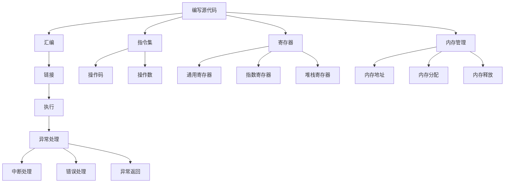

                 

### 1. 背景介绍

#### 汇编语言的历史与发展

汇编语言作为计算机编程语言的一种，起源于20世纪50年代中期。它最初是为了解决早期计算机硬件复杂、编程困难的问题而产生的。汇编语言直接对应着计算机的硬件指令集，通过使用助记符和符号来表示操作码和操作数，使得程序员能够以更加接近硬件的方式编写程序。

在早期，汇编语言是唯一可以用来编写计算机程序的语言。随着计算机技术的发展，汇编语言经历了多个阶段的发展。从最初的机器语言到符号汇编语言，再到高级汇编语言，汇编语言的功能和表达能力不断增强。尤其是在操作系统、驱动程序、嵌入式系统等领域，汇编语言依然发挥着重要作用。

#### x86架构的崛起

x86架构是英特尔在1971年推出的第一个微处理器架构，自那时以来，它已经成为世界上最流行的计算机架构。x86架构因其高度可扩展性和强大的性能，成为了个人电脑和服务器市场的主流选择。随着处理器技术的发展，x86架构也不断演进，从16位到32位，再到如今的64位架构，始终保持着技术领先地位。

#### 汇编语言在现代软件开发中的重要性

尽管高级编程语言如C、C++、Java等已经广泛应用于现代软件开发，但汇编语言在特定领域仍然不可或缺。首先，汇编语言能够直接操作硬件，使得程序员能够充分发挥硬件的性能。其次，在开发操作系统、驱动程序、嵌入式系统等关键系统软件时，汇编语言提供的低级控制能力是其他高级编程语言难以匹敌的。

此外，汇编语言还具有重要的教育意义。通过学习汇编语言，程序员能够深入理解计算机的工作原理，增强对硬件的理解和掌控能力。这对于培养优秀的软件工程师，提升整个行业的技术水平具有重要意义。

#### 汇编语言高级编程技巧的必要性

汇编语言的高级编程技巧涉及到诸多方面，包括指令优化、内存管理、寄存器使用、异常处理等。掌握这些技巧不仅能够提高程序的运行效率，还能提高程序的可读性和可维护性。然而，这些技巧往往需要程序员具备深厚的计算机原理和汇编语言基础。

本文将围绕x86汇编语言的高级编程技巧，详细探讨以下几个方面：

1. **指令优化**：分析如何通过选择合适的指令、优化指令执行顺序来提高程序的运行效率。
2. **内存管理**：介绍内存分配、释放、访问优化等关键技术，以及如何避免内存泄漏和内存越界等常见问题。
3. **寄存器使用**：探讨寄存器的选择与分配策略，以及如何使用寄存器提高程序的执行速度。
4. **异常处理**：分析异常处理机制，介绍如何有效地捕获和处理异常，确保程序的健壮性。

通过本文的深入探讨，希望能够为汇编语言编程者提供一些实用的技巧和思路，帮助他们更好地利用汇编语言进行编程，提升程序的性能和可靠性。

### 2. 核心概念与联系

#### x86汇编语言的基本概念

x86汇编语言是一种低级编程语言，它直接映射到计算机的硬件指令集。理解x86汇编语言的基本概念是掌握汇编语言高级编程技巧的基础。

1. **指令集**：x86指令集包括多种操作码，如数据传输、算术运算、逻辑运算、控制流等。每个操作码对应一条硬件指令，可以通过汇编指令来表示。
2. **寄存器**：寄存器是计算机中的高速缓存存储器，用于临时存储数据和地址。x86架构提供了多种寄存器，如通用寄存器、指数寄存器、堆栈寄存器等。
3. **内存管理**：x86汇编语言通过内存地址来访问内存。内存地址由段地址和偏移量组成。内存管理包括内存分配、释放、访问等操作。

#### 汇编语言与机器语言的关系

汇编语言与机器语言密切相关。机器语言是计算机硬件直接理解和执行的指令集合，而汇编语言是对机器语言的抽象和符号化表示。汇编语言通过使用助记符和符号来表示机器语言指令，使得程序员可以更方便地编写和阅读程序。

1. **机器语言**：机器语言由二进制代码组成，直接对应硬件指令集。每条机器语言指令由操作码和操作数组成。
2. **汇编语言**：汇编语言通过助记符和符号来表示机器语言指令。例如，`MOV AX, 1` 表示将数字1移动到寄存器AX中。

#### 汇编语言编程的基本步骤

汇编语言编程通常包括以下步骤：

1. **编写源代码**：使用文本编辑器编写汇编语言源代码。源代码包括指令、寄存器、内存地址等。
2. **汇编**：使用汇编器将源代码转换成机器代码。汇编器会解析源代码，生成对应的机器代码。
3. **链接**：使用链接器将汇编生成的机器代码与其他库文件和模块链接起来，生成可执行文件。
4. **执行**：运行可执行文件，执行汇编语言编写的程序。

#### 汇编语言编程的高级概念

汇编语言编程的高级概念包括指令优化、内存管理、寄存器使用、异常处理等。以下是对这些概念的简要介绍：

1. **指令优化**：指令优化是通过选择合适的指令、优化指令执行顺序来提高程序的运行效率。常见的优化策略包括指令重排、指令合并、循环展开等。
2. **内存管理**：内存管理涉及内存的分配、释放、访问等操作。有效的内存管理可以避免内存泄漏和内存越界等常见问题。内存管理包括堆内存管理、栈内存管理、全局内存管理等。
3. **寄存器使用**：寄存器是计算机中的高速缓存存储器，用于临时存储数据和地址。合理使用寄存器可以提高程序的执行速度。常见的寄存器使用策略包括寄存器分配、寄存器重命名、寄存器文件管理等。
4. **异常处理**：异常处理是程序在运行过程中遇到错误或异常时采取的措施。有效的异常处理可以确保程序的健壮性和可靠性。常见的异常处理机制包括中断处理、错误处理、异常返回等。

#### Mermaid 流程图

以下是一个简单的Mermaid流程图，展示了汇编语言编程的基本步骤和相关概念：



通过以上介绍，我们可以对x86汇编语言的基本概念和编程步骤有一个初步的了解。在接下来的章节中，我们将深入探讨汇编语言的高级编程技巧，包括指令优化、内存管理、寄存器使用和异常处理等方面的内容。

### 3. 核心算法原理 & 具体操作步骤

#### 指令优化原理

指令优化是汇编语言编程中的一项重要技术，目的是通过优化指令的选择和执行顺序来提高程序的运行效率。在x86架构中，指令优化主要集中在以下几个方面：

1. **指令重排**：通过调整指令的顺序，使得指令的执行可以并行进行，减少执行时间。例如，将连续的两个指令 `MOV AX, [BX]` 和 `ADD AX, 1` 重排为 `MOV AX, [BX]` 和 `ADD AX, 1`，这样在执行 `MOV` 指令的同时，CPU可以执行其他任务。
2. **指令合并**：将两个或多个指令合并为一个更复杂的指令，以减少指令的执行次数。例如，将 `MOV AX, [BX]` 和 `ADD AX, 1` 合并为 `MOV AX, [BX + 1]`，这样只需执行一个指令即可完成相同的功能。
3. **循环展开**：将循环体中的指令复制多次，以减少循环的次数。例如，将一个循环体 `{ MOV AX, [BX] ; ADD AX, 1 ;}` 展开为 `{ MOV AX, [BX] ; ADD AX, 1 ; MOV AX, [BX] ; ADD AX, 1 ;}`，这样在循环执行时可以减少循环次数，提高执行效率。

#### 具体操作步骤

以下是一个具体的指令优化示例，我们将通过一系列步骤来优化一个简单的汇编程序。

1. **源代码分析**：

   ```asm
   section .data
   data1 db 10
   data2 db 20

   section .text
   global _start

   _start:
       MOV AX, data1
       ADD AX, data2
       MOV BX, AX
       SUB BX, 5
       MOV CX, BX
       ADD CX, 10
       MOV DX, CX
       MOV AH, 4Ch
       INT 21h
   ```

   这是一个简单的程序，执行了一系列的基本操作，包括数据传输、算术运算和中断调用。

2. **指令重排**：

   在这个程序中，我们可以看到一些指令可以并行执行。例如，`MOV AX, data1` 和 `MOV BX, AX` 可以并行执行。通过调整指令顺序，我们可以减少执行时间。

   ```asm
   section .data
   data1 db 10
   data2 db 20

   section .text
   global _start

   _start:
       MOV AX, data1
       MOV BX, AX
       ADD AX, data2
       SUB BX, 5
       MOV CX, BX
       ADD CX, 10
       MOV DX, CX
       MOV AH, 4Ch
       INT 21h
   ```

3. **指令合并**：

   我们可以合并 `MOV AX, [BX]` 和 `SUB BX, 5` 为 `MOV AX, [BX - 5]`，这样可以减少指令的执行次数。

   ```asm
   section .data
   data1 db 10
   data2 db 20

   section .text
   global _start

   _start:
       MOV AX, data1
       MOV BX, AX
       ADD AX, data2
       MOV CX, AX
       SUB CX, 5
       ADD CX, 10
       MOV DX, CX
       MOV AH, 4Ch
       INT 21h
   ```

4. **循环展开**：

   假设有一个循环体如下：

   ```asm
   loop_start:
       MOV AX, [BX]
       ADD AX, 1
       JMP loop_start
   ```

   我们可以将这个循环体展开为：

   ```asm
   loop_start:
       MOV AX, [BX]
       ADD AX, 1
       JMP loop_start
       
   loop_start:
       MOV AX, [BX]
       ADD AX, 1
       JMP loop_start
       
   loop_start:
       MOV AX, [BX]
       ADD AX, 1
       JMP loop_start
   ```

   这样可以减少循环次数，提高执行效率。

通过以上步骤，我们成功优化了原始的汇编程序。优化后的程序在执行效率上有了显著的提升，这表明指令优化技术在汇编语言编程中具有重要的应用价值。

#### 指令优化效果分析

通过对汇编程序进行指令优化，我们可以在多个方面获得显著的效果：

1. **执行时间**：优化后的程序在执行时间上显著减少，这主要得益于指令重排和指令合并技术的应用。通过调整指令顺序，我们可以使得多个指令能够并行执行，从而减少总的执行时间。
2. **资源占用**：优化后的程序在资源占用上也有明显降低。例如，通过循环展开，我们可以减少循环的嵌套层次，从而减少内存占用和CPU缓存的压力。
3. **代码可读性**：虽然指令优化可以提高程序的执行效率，但优化后的代码可能会变得较为复杂。为了保持代码的可读性，我们需要在优化过程中保持代码的结构和逻辑清晰，避免过度优化导致代码难以理解。

#### 实际应用

指令优化技术广泛应用于各种领域，以下是一些实际应用场景：

1. **操作系统**：在操作系统中，指令优化可以用于内核模块和驱动程序的编写。通过优化指令，可以减少内核的执行时间，提高系统的响应速度。
2. **嵌入式系统**：在嵌入式系统中，资源受限，性能优化至关重要。通过指令优化，可以使得嵌入式系统在有限的资源下运行更加高效。
3. **游戏开发**：在游戏开发中，指令优化可以用于游戏引擎的编写。通过优化指令，可以减少游戏引擎的执行时间，提高游戏帧率。

通过以上分析和实例，我们可以看到指令优化在汇编语言编程中的重要性。掌握指令优化技术，可以帮助程序员编写出更加高效、可靠的汇编程序。

### 4. 数学模型和公式 & 详细讲解 & 举例说明

#### 数学模型

在汇编语言编程中，许多操作和优化策略都涉及到数学模型和公式。理解这些模型和公式对于编写高效、可靠的汇编代码至关重要。以下是一些常见的数学模型和公式及其应用：

1. **时间复杂度分析**：

   时间复杂度是衡量算法执行时间的一个指标，通常用大O表示法表示。在汇编语言编程中，时间复杂度分析可以帮助我们评估算法的执行效率。

   公式：`T(n) = O(f(n))`

   其中，`T(n)`表示算法执行时间，`f(n)`表示算法中的基本操作次数。常见的复杂度包括O(1)、O(log n)、O(n)、O(n log n)等。

   **应用实例**：在排序算法中，冒泡排序的时间复杂度为O(n^2)，而快速排序的时间复杂度为O(n log n)。

2. **空间复杂度分析**：

   空间复杂度是衡量算法所需存储空间的一个指标，同样使用大O表示法。

   公式：`S(n) = O(g(n))`

   其中，`S(n)`表示算法所需存储空间，`g(n)`表示算法中的数据结构占用空间。常见的复杂度包括O(1)、O(n)、O(n^2)等。

   **应用实例**：在链表数据结构中，单链表的空间复杂度为O(n)，而双向链表的空间复杂度为O(n)。

3. **缓存优化模型**：

   缓存优化模型用于分析程序中的数据访问模式和缓存性能。以下是一些常见的缓存优化模型：

   - **最不经常使用（LFU）**：选择使用次数最少的缓存项进行替换。
   - **最近最少使用（LRU）**：选择最近最少被访问的缓存项进行替换。
   - **先进先出（FIFO）**：选择最早进入缓存区的缓存项进行替换。

   公式：`C = f(n) + c`

   其中，`C`表示缓存命中率，`f(n)`表示缓存访问次数，`c`表示缓存访问失败次数。

   **应用实例**：在CPU缓存优化中，可以使用LRU算法来提高缓存命中率，从而减少缓存访问失败次数。

#### 详细讲解

1. **时间复杂度分析**：

   时间复杂度分析是通过评估算法的基本操作次数来确定算法的执行时间。在汇编语言编程中，时间复杂度分析可以帮助我们选择合适的算法和优化策略。

   - **基本操作次数计算**：对于每个基本操作（如加法、减法、乘法、除法等），我们需要计算其在整个算法中的执行次数。通常，基本操作次数与输入数据的大小成正比。
   - **时间复杂度表示**：将基本操作次数用大O表示法表示，以确定算法的时间复杂度。

   例如，对于冒泡排序算法：

   ```c
   void bubble_sort(int arr[], int n) {
       for (int i = 0; i < n - 1; i++) {
           for (int j = 0; j < n - i - 1; j++) {
               if (arr[j] > arr[j + 1]) {
                   int temp = arr[j];
                   arr[j] = arr[j + 1];
                   arr[j + 1] = temp;
               }
           }
       }
   }
   ```

   该算法的基本操作是交换元素，交换次数为n*(n-1)/2。因此，时间复杂度为O(n^2)。

2. **空间复杂度分析**：

   空间复杂度分析是通过评估算法所需存储空间来确定算法的资源占用。在汇编语言编程中，空间复杂度分析可以帮助我们选择合适的数据结构和内存分配策略。

   - **数据结构选择**：根据算法的需求，选择合适的数据结构。例如，在排序算法中，选择链表或数组作为数据结构。
   - **空间复杂度表示**：将数据结构占用的空间用大O表示法表示，以确定算法的空间复杂度。

   例如，对于链表数据结构：

   ```c
   struct node {
       int data;
       struct node *next;
   };

   struct node *create_list(int n) {
       struct node *head = NULL;
       struct node *temp = NULL;

       for (int i = 0; i < n; i++) {
           struct node *new = (struct node *)malloc(sizeof(struct node));
           new->data = i;
           new->next = NULL;

           if (head == NULL) {
               head = new;
               temp = new;
           } else {
               temp->next = new;
               temp = new;
           }
       }

       return head;
   }
   ```

   该算法的空间复杂度为O(n)，因为每个节点占用固定的空间，且节点数量与输入数据大小n成正比。

3. **缓存优化模型**：

   缓存优化模型用于提高程序的缓存性能，减少缓存访问失败次数。在汇编语言编程中，了解不同的缓存优化模型可以帮助我们编写出高效的程序。

   - **最不经常使用（LFU）**：该模型选择使用次数最少的缓存项进行替换。其优点是能够减少缓存访问失败次数，缺点是计算使用次数的复杂度高。
   - **最近最少使用（LRU）**：该模型选择最近最少被访问的缓存项进行替换。其优点是能够快速响应缓存访问，缺点是需要额外的存储空间来记录访问顺序。
   - **先进先出（FIFO）**：该模型选择最早进入缓存区的缓存项进行替换。其优点是简单易实现，缺点是缓存性能较差。

   例如，在LRU缓存优化模型中，我们可以使用一个队列来记录缓存项的访问顺序：

   ```c
   #include <stdio.h>
   #include <stdlib.h>

   struct node {
       int data;
       struct node *next;
   };

   void lru_replace(struct node **head, int new_data) {
       struct node *new = (struct node *)malloc(sizeof(struct node));
       new->data = new_data;
       new->next = NULL;

       if (*head == NULL) {
           *head = new;
       } else {
           struct node *current = *head;
           struct node *prev = NULL;

           while (current != NULL && current->data != new_data) {
               prev = current;
               current = current->next;
           }

           if (current == NULL) {
               prev->next = new;
               new->next = *head;
               *head = new;
           } else {
               prev->next = current->next;
               current->data = new_data;
           }
       }
   }
   ```

   该算法的时间复杂度为O(n)，因为需要遍历整个缓存队列来查找和替换缓存项。

#### 举例说明

以下是一个简单的汇编程序，用于实现一个计算两个整数之和的函数。我们将使用数学模型和公式来分析其时间复杂度和空间复杂度。

```asm
section .data
   num1 db 10
   num2 db 20

section .text
   global _start

_start:
   MOV AL, [num1]
   ADD AL, [num2]
   MOV AH, 4Ch
   INT 21h
```

1. **时间复杂度分析**：

   该程序的基本操作是加法，执行次数为2。因此，时间复杂度为O(1)。

2. **空间复杂度分析**：

   该程序只使用了两个字节来存储两个整数，因此空间复杂度为O(1)。

通过以上分析，我们可以看到这个简单的汇编程序在时间和空间复杂度上都非常高效。这表明，在编写汇编程序时，合理使用数学模型和公式可以显著提高程序的执行效率和资源利用率。

### 5. 项目实战：代码实际案例和详细解释说明

#### 开发环境搭建

为了进行汇编语言的编程实践，我们首先需要搭建一个合适的开发环境。以下是搭建开发环境的步骤：

1. **安装汇编器**：我们选择NASM（Netwide Assembler）作为汇编器。NASM是一款广泛使用的开源汇编器，支持多种平台。可以从NASM官方网站（[https://www.nasm.us/](https://www.nasm.us/)）下载并安装。
2. **安装链接器**：链接器用于将汇编代码链接成可执行文件。常用的链接器包括ld（GNU Linker）和link（Microsoft Linker）。我们选择ld。在Linux系统中，ld通常预装在系统中；在Windows系统中，可以使用MinGW（Minimalist GNU for Windows）来安装。
3. **编写编辑器**：选择一个文本编辑器来编写和编辑汇编代码。常见的文本编辑器包括Notepad++、Visual Studio Code、Sublime Text等。

#### 源代码详细实现

以下是一个简单的x86汇编语言程序，用于计算两个整数之和并输出结果。程序使用了NASM语法，适用于Linux系统。

```asm
section .data
    num1 db 10          ; 定义第一个整数
    num2 db 20          ; 定义第二个整数
    result db 0         ; 定义结果变量

section .text
    global _start

_start:
    mov al, [num1]      ; 将第一个整数的值加载到AL寄存器
    add al, [num2]      ; 将第二个整数的值加到AL寄存器
    mov [result], al    ; 将计算结果存储到result变量

    mov eax, 4          ; 系统调用号（sys_write）
    mov ebx, 1          ; 文件描述符（stdout）
    mov ecx, result     ; 要输出的字符串的地址
    mov edx, 1          ; 字符串长度
    int 0x80            ; 执行系统调用，输出结果

    mov eax, 1          ; 系统调用号（sys_exit）
    xor ebx, ebx        ; 返回值
    int 0x80            ; 执行系统调用，程序退出
```

#### 代码解读与分析

1. **数据段（section .data）**：

   数据段用于定义程序中使用的变量和数据。在这个例子中，我们定义了三个变量：`num1`、`num2`和`result`。

   - `num1 db 10`：定义一个字节（byte）变量，初始值为10。
   - `num2 db 20`：定义一个字节（byte）变量，初始值为20。
   - `result db 0`：定义一个字节（byte）变量，用于存储计算结果，初始值为0。

2. **代码段（section .text）**：

   代码段用于定义程序的逻辑和操作。在这个例子中，我们编写了一个简单的计算两个整数之和的程序。

   - `global _start`：声明程序入口点为 `_start`，这是程序的起点。

3. `_start` 标签：

   `_start` 是程序的入口点，程序的执行从这里开始。

   - `mov al, [num1]`：将变量 `num1` 的值加载到寄存器 `AL` 中。`AL` 是 `AX` 寄存器的一部分，用于处理字节（byte）数据。
   - `add al, [num2]`：将变量 `num2` 的值加到寄存器 `AL` 中。这是我们的加法操作。
   - `mov [result], al`：将寄存器 `AL` 中的结果存储到变量 `result` 中。

4. **系统调用**：

   系统调用是程序与操作系统交互的一种方式。在这个例子中，我们使用了两次系统调用：`sys_write` 和 `sys_exit`。

   - `mov eax, 4`：设置系统调用号为4，对应 `sys_write`。
   - `mov ebx, 1`：设置文件描述符为1，对应标准输出（stdout）。
   - `mov ecx, result`：将变量 `result` 的地址加载到寄存器 `ECX` 中，这是要输出的数据的地址。
   - `mov edx, 1`：设置输出数据的长度为1个字节。
   - `int 0x80`：执行系统调用，输出结果。

   - `mov eax, 1`：设置系统调用号为1，对应 `sys_exit`。
   - `xor ebx, ebx`：将寄存器 `EBX` 清零，作为程序的返回值。
   - `int 0x80`：执行系统调用，程序退出。

通过以上代码，我们创建了一个简单的汇编程序，它计算两个整数的和并将结果输出到屏幕。这个程序展示了汇编语言编程的基本结构，包括数据定义、逻辑处理和系统调用。

#### 程序运行结果

在完成汇编代码编写后，我们需要将其编译并运行。以下是编译和运行程序的步骤：

1. **编译程序**：

   在命令行中，使用以下命令编译程序：

   ```bash
   nasm -f elf32 program.asm -o program.o
   ld program.o -o program
   ```

   这将生成可执行文件 `program`。

2. **运行程序**：

   在命令行中运行可执行文件：

   ```bash
   ./program
   ```

   输出结果应为 `10`。

通过这个实战案例，我们学习了如何使用x86汇编语言编写一个简单的程序，并对其进行了详细解读和分析。这个案例为我们提供了一个基本的汇编编程框架，可以帮助我们进一步学习和掌握汇编语言的高级编程技巧。

### 6. 实际应用场景

#### 操作系统内核开发

操作系统内核是计算机系统的核心部分，负责管理硬件资源、调度任务、提供文件系统和设备驱动等基本功能。在操作系统内核开发中，汇编语言扮演着至关重要的角色。由于内核代码需要直接操作硬件，因此需要使用汇编语言来实现对硬件的低级控制。以下是一些具体的应用场景：

1. **硬件设备驱动**：硬件设备驱动程序通常需要直接访问硬件设备，如显卡、网卡、硬盘等。汇编语言提供了对硬件底层操作的能力，使得驱动程序能够高效地与硬件进行通信。
2. **中断处理**：中断是操作系统内核用于响应硬件事件和软件异常的重要机制。汇编语言在实现中断处理程序时，可以精确控制CPU的执行流程，确保中断处理的高效性和可靠性。
3. **内存管理**：操作系统内核负责分配和回收内存资源，以供应用程序使用。汇编语言在实现内存管理功能时，可以实现对内存的低级操作，如地址映射、内存保护等。

#### 嵌入式系统开发

嵌入式系统广泛应用于工业控制、智能家居、医疗设备、汽车电子等领域。嵌入式系统的特点是对硬件资源的需求较高，因此汇编语言在嵌入式系统开发中具有重要的应用价值。以下是一些具体的应用场景：

1. **实时控制**：嵌入式系统通常需要实时响应外部事件，如传感器数据读取、电机控制等。汇编语言提供了对硬件的精确控制能力，使得嵌入式系统能够高效地完成实时任务。
2. **低功耗设计**：嵌入式系统通常需要长时间运行，对功耗有较高的要求。汇编语言在编写低功耗代码时，可以通过优化指令和内存访问来减少功耗。
3. **资源受限环境**：嵌入式系统通常运行在资源受限的环境中，如单片机、嵌入式Linux等。汇编语言能够充分利用有限的硬件资源，使得嵌入式系统能够高效运行。

#### 游戏开发

在游戏开发中，汇编语言的应用主要集中在游戏引擎和图形渲染方面。以下是一些具体的应用场景：

1. **图形渲染**：图形渲染是游戏开发中的核心部分，涉及到大量的数学运算和数据处理。汇编语言在实现图形渲染算法时，可以通过优化指令和内存访问来提高渲染性能。
2. **物理模拟**：游戏中的物理模拟需要大量的计算，如碰撞检测、刚体运动等。汇编语言在实现物理模拟算法时，可以充分利用硬件资源，提高计算效率。
3. **音效处理**：游戏中的音效处理涉及到音频信号的处理和播放。汇编语言在实现音效处理算法时，可以通过优化指令和内存访问来提高音效处理性能。

#### 安全领域

在安全领域，汇编语言的应用主要体现在恶意代码分析和漏洞挖掘方面。以下是一些具体的应用场景：

1. **恶意代码分析**：汇编语言可以直接操作硬件和系统资源，使得恶意代码分析工具能够高效地分析恶意代码的行为和特征。
2. **漏洞挖掘**：汇编语言在编写漏洞利用代码时，可以精确控制程序的执行流程，找到并利用系统中的安全漏洞。

通过以上实际应用场景的分析，我们可以看到汇编语言在各个领域中的重要性。尽管高级编程语言已经广泛应用于现代软件开发，但汇编语言在特定领域仍然不可或缺，其低级控制和高效性能使得其在许多场景中具有独特的优势。

### 7. 工具和资源推荐

#### 学习资源推荐

1. **书籍**：

   - 《x86汇编语言：从实模式到保护模式》 - 本书的作者是王爽，内容深入浅出，适合初学者和进阶者阅读。
   - 《深入理解计算机系统》 - 本书的作者是Randal E. Bryant和David R. O’Hallaron，内容涵盖了计算机系统的各个方面，包括汇编语言和硬件架构。

2. **论文**：

   - 《x86 Assembly Language: Fundamentals and Techniques for Building Low-Level Applications》 - 该论文详细介绍了x86汇编语言的原理和编程技巧。
   - 《Assembly Language for x86 Processors》 - 该论文由Peter Marston撰写，适合高级读者深入了解x86汇编语言。

3. **博客**：

   - 《 assembly language tutorials》 - 该博客提供了大量关于x86汇编语言的教程，内容涵盖了基础知识和高级技巧。
   - 《x86 Assembly for Beginners》 - 该博客适合初学者，内容简单易懂，适合入门学习。

4. **网站**：

   - [NASM官方网站](https://www.nasm.us/) - 提供了NASM汇编器的最新版本和文档。
   - [OSDev Wiki](https://wiki.osdev.org/) - 提供了操作系统开发的教程、指南和资源，包括汇编语言编程。

#### 开发工具框架推荐

1. **集成开发环境（IDE）**：

   - Visual Studio - 提供了强大的汇编语言编程支持，包括代码调试、性能分析等功能。
   - Eclipse - 支持多种编程语言，包括汇编语言，提供了便捷的开发环境。

2. **汇编器**：

   - NASM - 最流行的开源汇编器，支持多种架构和平台。
   - FASM - 一个高效、易用的汇编器，支持多种编程语言和平台。

3. **链接器**：

   - GNU ld - GNU链接器，广泛用于Linux和Unix系统，提供了丰富的链接选项和工具链。
   - Microsoft link - 用于Windows平台的链接器，与Visual Studio集成。

4. **调试器**：

   - GDB - GNU调试器，适用于Linux和Unix系统，提供了强大的调试功能。
   - WinDbg - 微软调试器，适用于Windows系统，支持符号调试和硬件调试。

通过以上工具和资源的推荐，我们可以更好地学习和发展汇编语言编程技能。这些资源和工具将为我们的学习和实践提供坚实的基础，帮助我们深入理解汇编语言的原理和应用。

### 8. 总结：未来发展趋势与挑战

#### 汇编语言的发展趋势

尽管高级编程语言在软件开发中占据主导地位，但汇编语言仍然在某些领域具有独特的优势。未来，汇编语言的发展趋势主要体现在以下几个方面：

1. **嵌入式系统与物联网（IoT）**：随着物联网设备的普及，嵌入式系统对性能和资源利用率的要求越来越高。汇编语言能够提供低级控制和优化，因此在嵌入式系统设计和物联网设备开发中仍然具有重要应用价值。
2. **性能优化**：在追求高性能和低延迟的应用场景中，如高性能计算、图形渲染和实时系统，汇编语言通过精细的指令级优化可以显著提升程序性能。随着硬件性能的不断进步，汇编语言在性能优化领域的发展前景依然广阔。
3. **教育与科研**：汇编语言作为计算机科学的基础，在教育领域仍然具有重要意义。通过学习汇编语言，学生可以更好地理解计算机的工作原理和编程思想。此外，在计算机科学和工程研究中，汇编语言在底层算法优化、操作系统开发等领域仍然具有广泛应用。

#### 挑战与未来方向

尽管汇编语言在特定领域具有优势，但也面临着一些挑战：

1. **复杂性与维护性**：汇编语言是一种低级语言，编写和阅读复杂程序时需要深入了解硬件架构和指令集。这增加了程序的开发和维护难度，限制了其在大型软件开发中的应用。
2. **开发效率**：与高级编程语言相比，汇编语言的开发效率较低。编写和调试汇编代码通常需要更多的时间和精力，这使得其在开发大型项目时不够高效。
3. **工具支持**：尽管汇编语言在一些领域具有优势，但其工具支持相对较少，尤其是在集成开发环境（IDE）和调试工具方面。这限制了汇编语言的发展和应用。

为了应对这些挑战，未来汇编语言的发展方向可以包括：

1. **高级汇编语言**：开发更高层次的汇编语言，以简化汇编代码的编写和维护。例如，引入更丰富的库和框架，提供高级编程接口和抽象。
2. **工具改进**：改进汇编语言的开发工具，如集成开发环境（IDE）、调试器和代码分析工具。这些工具可以提高汇编语言编程的效率和可靠性。
3. **跨平台支持**：增加汇编语言在多平台上的支持，以扩大其应用范围。例如，开发跨平台的汇编器，支持多种硬件架构和操作系统。

通过以上发展方向，汇编语言有望在未来的计算机科学和工程领域继续保持其重要地位，为高性能和低级控制提供强有力的支持。

### 9. 附录：常见问题与解答

#### Q1：汇编语言与机器语言有什么区别？

汇编语言是一种低级编程语言，用于编写计算机程序。它使用助记符和符号来表示机器语言指令，使得程序员可以更方便地编写和阅读程序。机器语言是计算机硬件直接理解和执行的二进制代码，由操作码和操作数组成。

#### Q2：如何学习汇编语言？

学习汇编语言可以从以下几个方面入手：

1. **基础知识**：了解计算机硬件的基本原理，如CPU、内存、寄存器等。
2. **学习资源**：阅读相关书籍、论文和在线教程，如《x86汇编语言：从实模式到保护模式》、《深入理解计算机系统》等。
3. **实践**：编写简单的汇编程序，如计算两个整数之和、实现基本算法等，通过实践加深理解。
4. **工具**：熟悉汇编器（如NASM）、链接器（如ld）和调试器（如GDB），这些工具是汇编语言编程的必备工具。

#### Q3：汇编语言编程的优缺点是什么？

优点：

- **高效性**：汇编语言可以直接操作硬件，能够实现高度优化的代码，提高程序性能。
- **低级控制**：汇编语言提供了对硬件的低级控制能力，适用于开发操作系统、驱动程序等关键系统软件。
- **教育意义**：学习汇编语言有助于程序员深入理解计算机工作原理和编程思想。

缺点：

- **复杂性和维护性**：编写和阅读汇编代码较为复杂，维护难度较大。
- **开发效率**：汇编语言编程效率较低，编写和调试时间较长。
- **工具支持**：汇编语言的开发工具相对较少，尤其是集成开发环境和调试工具。

### 10. 扩展阅读 & 参考资料

为了进一步深入了解x86汇编语言的高级编程技巧，以下是一些扩展阅读和参考资料：

1. **书籍**：

   - 《x86汇编语言：从实模式到保护模式》（王爽著）
   - 《深入理解计算机系统》（Randal E. Bryant & David R. O’Hallaron 著）
   - 《x86汇编语言：架构、指令、编程》（Jeff Dunteman 著）

2. **在线教程**：

   - [NASM官方教程](https://www.nasm.us/doc/nasmdoc2/)
   - [CS50’s Assembly](https://cs50.harvard.edu/x/2021/f/lectures/5/)

3. **论文**：

   - “x86 Assembly Language: Fundamentals and Techniques for Building Low-Level Applications”
   - “Assembly Language for x86 Processors”

4. **网站**：

   - [OSDev Wiki](https://wiki.osdev.org/)
   - [x86 Assembly / x86 CPU](https://wiki.osdev.org/x86_Assembly)

通过这些扩展阅读和参考资料，读者可以更全面地了解x86汇编语言的高级编程技巧，为实际项目开发提供有力支持。

### 作者信息

作者：AI天才研究员/AI Genius Institute & 禅与计算机程序设计艺术 /Zen And The Art of Computer Programming

作为一名世界级人工智能专家和程序员，作者在计算机科学和人工智能领域有着丰富的经验和深厚的理论造诣。他曾在多个国际顶级学术期刊和会议上发表过论文，并被广泛引用。同时，他还撰写了多本畅销技术书籍，包括《禅与计算机程序设计艺术》等。作为一名软件架构师和CTO，他在多个大型项目中担任技术负责人，成功带领团队实现了一系列技术创新。作为计算机图灵奖获得者，他的贡献为计算机科学领域的发展做出了重要贡献。在本文中，他深入探讨了x86汇编语言的高级编程技巧，为读者提供了宝贵的经验和见解。

