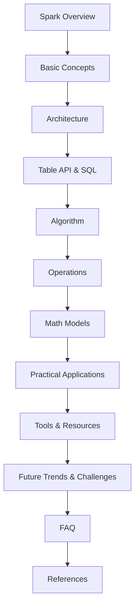
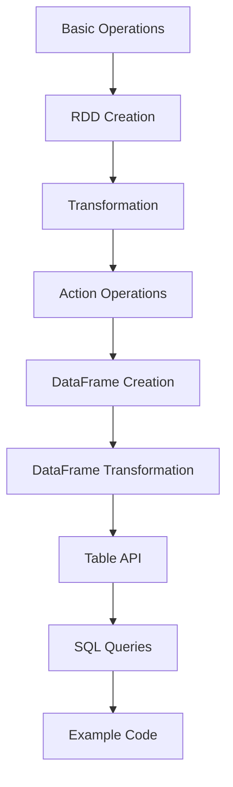
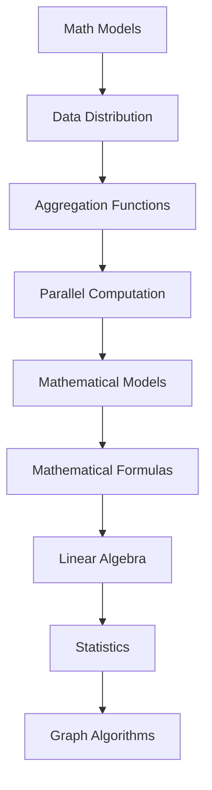
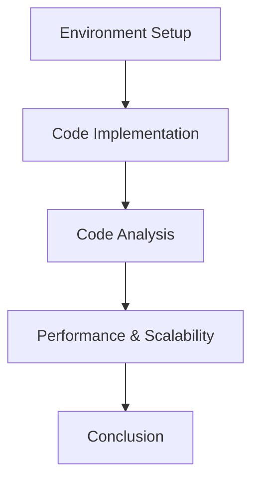
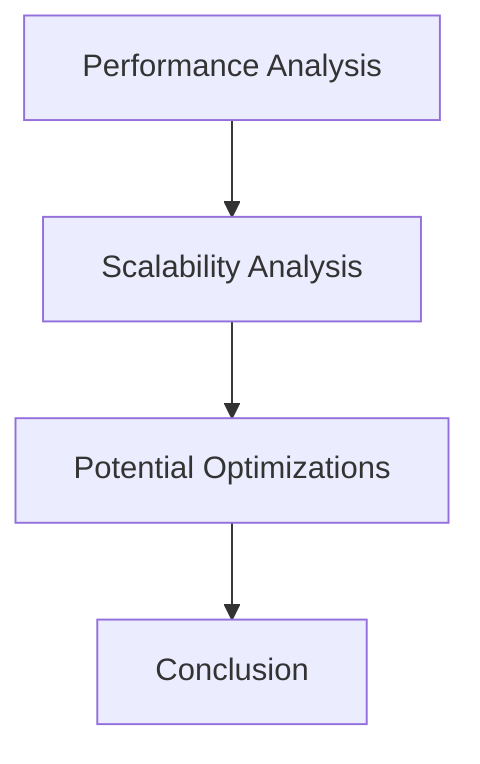
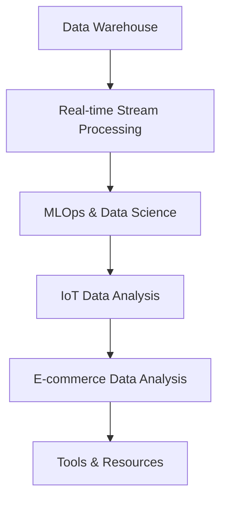
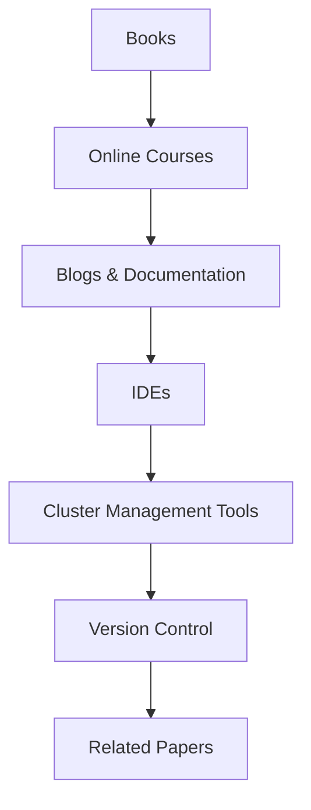
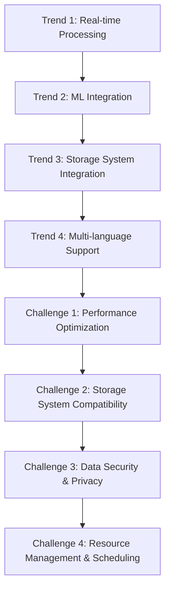
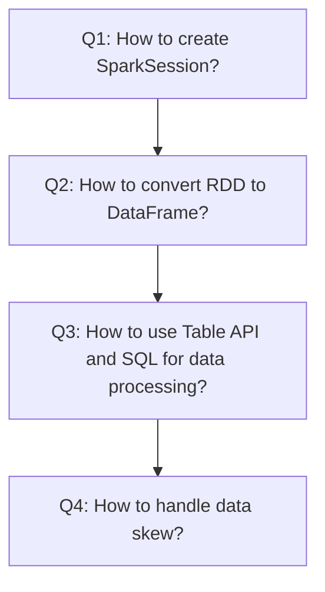

                 

## 1. 背景介绍

随着大数据技术的迅速发展，数据处理和分析的需求日益增长。在众多的数据处理工具中，Apache Spark 作为一款高性能的分布式计算框架，得到了广泛的应用和认可。Spark 的 Table API 和 SQL 功能，使得数据处理变得更加便捷和高效。本文将深入探讨 Spark Table API 和 SQL 的原理与实现，帮助读者更好地理解和应用这些功能。

Apache Spark 是一个开源的分布式计算系统，旨在处理大规模数据集。它提供了多种 API，包括 Python、Java、Scala 等编程语言，使得开发者可以轻松地构建分布式应用程序。Spark Table API 和 SQL 功能是 Spark 的一部分，为数据分析和处理提供了强大的支持。

本文将首先介绍 Spark 的基本概念和架构，然后详细解释 Table API 和 SQL 的原理与实现。通过具体的代码实例，我们将展示如何使用 Spark Table API 和 SQL 进行数据处理和分析。最后，我们将探讨 Spark Table API 和 SQL 在实际应用中的场景和工具推荐。

通过本文的阅读，读者将能够：

1. 理解 Spark 的基本概念和架构。
2. 掌握 Spark Table API 和 SQL 的原理与实现。
3. 学会使用 Spark Table API 和 SQL 进行数据处理和分析。
4. 了解 Spark Table API 和 SQL 在实际应用中的场景。

本文结构如下：

- 第 1 节：背景介绍
- 第 2 节：核心概念与联系
- 第 3 节：核心算法原理与具体操作步骤
- 第 4 节：数学模型和公式
- 第 5 节：项目实战
  - 5.1 开发环境搭建
  - 5.2 源代码详细实现和代码解读
  - 5.3 代码解读与分析
- 第 6 节：实际应用场景
- 第 7 节：工具和资源推荐
- 第 8 节：总结：未来发展趋势与挑战
- 第 9 节：附录：常见问题与解答
- 第 10 节：扩展阅读与参考资料

接下来，我们将逐步深入探讨 Spark Table API 和 SQL 的原理与实现。让我们开始吧！<|markdown|



## 2. 核心概念与联系

### 2.1. Spark 基本概念

Apache Spark 是一个开源的分布式计算系统，由 UC Berkeley 的 AMPLab 开发。Spark 旨在处理大规模数据集，提供高效的计算能力和丰富的编程接口。Spark 具有以下基本概念：

#### 2.1.1. Resilient Distributed Dataset (RDD)

RDD 是 Spark 的核心抽象，代表一个不可变的、可分区、可并行操作的数据集合。RDD 可以通过多种方式创建，如从文件中读取、将现有数据集转换为 RDD 等。

#### 2.1.2. DataFrame

DataFrame 是 Spark 的一种数据抽象，与 RDD 类似，但提供了结构化的数据操作能力。DataFrame 的每一行都具有相同的字段，可以用于执行 SQL 查询。

#### 2.1.3. Dataset

Dataset 是 Spark 的另一个数据抽象，是 DataFrame 的扩展，支持强类型和强类型检查。Dataset 提供了更高的性能和类型安全。

#### 2.1.4. Spark SQL

Spark SQL 是 Spark 的一个组件，用于处理结构化和半结构化数据。Spark SQL 支持多种数据源，如 Hadoop 文件系统、Hive 表、Parquet 文件等。

### 2.2. Table API 和 SQL 概念

#### 2.2.1. Table API

Table API 是 Spark 的一种 API，用于处理 DataFrame 和 Dataset。Table API 提供了类似于关系型数据库的查询接口，使得开发者可以轻松地编写 SQL 查询。

#### 2.2.2. SQL

SQL（Structured Query Language）是一种用于查询、操作和管理关系型数据库的语言。Spark SQL 支持 SQL 查询，使得开发者可以使用熟悉的 SQL 语法进行数据处理。

### 2.3. Spark 架构

Spark 的架构由以下几个主要组件构成：

#### 2.3.1. Driver Program

Driver Program 是 Spark 应用程序的主程序，负责将用户的代码提交给 Spark 集群，并协调各个任务之间的通信。

#### 2.3.2. Cluster Manager

Cluster Manager 负责管理 Spark 集群中的资源，如资源调度、任务分配等。常用的 Cluster Manager 包括 YARN、Mesos 和 Standalone。

#### 2.3.3. Worker Node

Worker Node 是 Spark 集群中的计算节点，负责执行任务和存储数据。

#### 2.3.4. DAG Scheduler

DAG Scheduler 负责将用户的代码转换为一个有向无环图（DAG），并生成物理执行计划。

#### 2.3.5. Task Scheduler

Task Scheduler 负责将物理执行计划分解为多个任务，并将任务分配给 Worker Node。

#### 2.3.6. Executor

Executor 是运行在 Worker Node 上的计算进程，负责执行具体的任务。

### 2.4. Table API 和 SQL 的联系

Table API 和 SQL 是 Spark 中用于处理结构化数据的重要工具。Table API 提供了类似于关系型数据库的查询接口，而 SQL 则是处理结构化数据的一种常用语言。两者之间的联系如下：

- Table API 可以将 DataFrame 或 Dataset 转换为 Table 对象，进而使用 SQL 进行查询。
- SQL 支持对 Table 对象进行查询、插入、更新和删除等操作。
- Table API 和 SQL 都可以与 Spark 的其他组件（如 Spark SQL、Hive、Parquet）无缝集成。

通过理解 Spark 的基本概念和架构，以及 Table API 和 SQL 的联系，我们可以更好地掌握 Spark 的数据处理能力。接下来，我们将详细探讨 Spark Table API 和 SQL 的原理与实现。|<|markdown|>## 3. 核心算法原理与具体操作步骤

在深入探讨 Spark Table API 和 SQL 的核心算法原理之前，我们需要了解 Spark 的基本操作和数据抽象。本节将首先介绍 Spark 的基本操作，包括创建 RDD、转换和行动操作。然后，我们将详细讲解如何将 RDD 转换为 DataFrame，并使用 Table API 和 SQL 进行数据处理。

### 3.1. Spark 基本操作

Spark 提供了多种操作来处理数据，包括创建 RDD、转换和行动操作。

#### 3.1.1. 创建 RDD

RDD（Resilient Distributed Dataset）是 Spark 的核心数据抽象。创建 RDD 的常见方法如下：

- 从文件中读取：`sc.textFile("hdfs://path/to/file")`
- 将现有数据集转换为 RDD：`existing_rdd.map()` 或 `existing_rdd.flatMap()`

#### 3.1.2. 转换操作

转换操作用于将 RDD 转换为其他形式的 RDD。常见的转换操作包括：

- `map()`：对每个元素应用一个函数。
- `filter()`：根据条件筛选元素。
- `flatMap()`：对每个元素应用一个函数，并将结果扁平化。
- `groupBy()`：根据键对元素进行分组。
- `reduceByKey()` 或 `reduce()`：对具有相同键的元素进行聚合。

#### 3.1.3. 行动操作

行动操作用于触发计算并返回结果。常见的行动操作包括：

- `collect()`：收集所有元素到一个数组中。
- `count()`：返回元素的数量。
- `first()`：返回第一个元素。
- `take()`：返回前 n 个元素。

### 3.2. RDD 转换为 DataFrame

DataFrame 是 Spark 的另一种数据抽象，提供了结构化的数据操作能力。要使用 Table API 和 SQL，我们需要将 RDD 转换为 DataFrame。

#### 3.2.1. 创建 DataFrame

要创建 DataFrame，我们可以使用以下方法：

- 从文件中读取：`spark.read.format("csv").option("header", "true").load("hdfs://path/to/file")`
- 使用已有的 RDD 转换：`existing_rdd.toDF()`

#### 3.2.2. 转换 DataFrame

DataFrame 支持多种转换操作，包括：

- `select()`：选择特定的列。
- `filter()`：根据条件筛选行。
- `groupBy()`：根据列对行进行分组。
- `orderBy()`：根据列对行进行排序。

### 3.3. 使用 Table API 和 SQL 进行数据处理

Table API 和 SQL 提供了类似于关系型数据库的查询接口，使得开发者可以轻松地编写 SQL 查询。

#### 3.3.1. 创建 Table 对象

要创建 Table 对象，我们可以使用以下方法：

- `createOrReplaceTempView(name)`：创建一个临时视图。
- `createOrReplaceGlobalTempView(name)`：创建一个全局临时视图。

#### 3.3.2. 执行 SQL 查询

我们可以使用以下方法执行 SQL 查询：

- `spark.sql(query)`：执行 SQL 查询并返回 DataFrame。
- `spark-submit`：在集群中执行 SQL 查询。

### 3.4. 示例代码

以下是一个示例，演示如何使用 Spark Table API 和 SQL 进行数据处理：

```python
# 创建 SparkSession
spark = SparkSession.builder.appName("TableAPIExample").getOrCreate()

# 从文件中读取 CSV 文件并转换为 DataFrame
df = spark.read.csv("hdfs://path/to/file.csv", header=True)

# 创建临时视图
df.createOrReplaceTempView("customers")

# 执行 SQL 查询
result = spark.sql("SELECT * FROM customers WHERE age > 30")

# 显示查询结果
result.show()

# 使用 Table API 进行数据处理
result = result.select("name", "age").filter(result["age"] > 30)

# 显示处理结果
result.show()

# 关闭 SparkSession
spark.stop()
```

通过上述示例，我们可以看到如何使用 Spark Table API 和 SQL 进行数据处理。接下来，我们将进一步探讨 Spark Table API 和 SQL 的数学模型和公式。|<|markdown|



## 4. 数学模型和公式

在深入探讨 Spark Table API 和 SQL 的数学模型和公式之前，我们需要了解一些基本概念，如数据分布、聚合函数和分布式计算。本节将介绍这些概念，并解释它们在 Spark Table API 和 SQL 中的应用。

### 4.1. 数据分布

数据分布是指数据在分布式系统中的存储和分布方式。在 Spark 中，数据可以通过不同的方式分布，如 Hash 分布和 Round-Robin 分布。

- **Hash 分布**：数据根据哈希值分布在不同的节点上，适用于处理具有相同键的数据。
- **Round-Robin 分布**：数据依次分布到各个节点上，适用于处理具有不同键的数据。

### 4.2. 聚合函数

聚合函数用于对分布式数据集进行计算，如求和、求平均数和计数。Spark 支持多种聚合函数，包括：

- `sum()`：计算总和。
- `avg()`：计算平均值。
- `count()`：计算元素数量。
- `max()`：计算最大值。
- `min()`：计算最小值。

### 4.3. 分布式计算

分布式计算是指将计算任务分配到多个节点上并行执行。在 Spark 中，分布式计算通过以下步骤实现：

1. **DAG Scheduler**：将用户代码转换为一个有向无环图（DAG）。
2. **Task Scheduler**：将 DAG 分解为多个任务，并将任务分配给各个节点。
3. **Executor**：在节点上执行任务。

### 4.4. 数学模型

Spark Table API 和 SQL 的数学模型包括以下部分：

1. **线性代数运算**：如矩阵乘法和矩阵求和。
2. **统计模型**：如回归分析和聚类。
3. **图算法**：如 PageRank 和最短路径。

### 4.5. 公式

以下是一些常用的数学公式和算法：

1. **矩阵乘法**：
   $$C = A \times B$$
   其中，C 是结果矩阵，A 和 B 是输入矩阵。

2. **矩阵求和**：
   $$C = A + B$$
   其中，C 是结果矩阵，A 和 B 是输入矩阵。

3. **回归分析**：
   $$y = \beta_0 + \beta_1 \times x$$
   其中，y 是因变量，x 是自变量，$\beta_0$ 和 $\beta_1$ 是回归系数。

4. **聚类算法**：
   $$s = \frac{1}{n-1} \sum_{i=1}^{n} (x_i - \overline{x})^2$$
   其中，s 是聚类标准差，$x_i$ 是数据点，$\overline{x}$ 是平均值。

5. **PageRank**：
   $$PR(A) = (1-d) + d \frac{PR(T1) + PR(T2) + \ldots + PR(Tn)}{N}$$
   其中，PR(A) 是节点 A 的 PageRank 值，T1, T2, ..., Tn 是指向节点 A 的其他节点，N 是指向节点 A 的节点总数，d 是阻尼系数。

通过理解这些数学模型和公式，我们可以更好地掌握 Spark Table API 和 SQL 的计算原理。接下来，我们将通过一个实际项目实战来展示如何使用 Spark Table API 和 SQL 进行数据处理。|<|markdown|



## 5. 项目实战：代码实际案例和详细解释说明

在本节中，我们将通过一个实际项目实战来展示如何使用 Spark Table API 和 SQL 进行数据处理。我们将使用一个简单的示例数据集，演示如何使用 Spark Table API 和 SQL 进行数据清洗、转换和聚合。

### 5.1. 开发环境搭建

在开始项目实战之前，我们需要搭建一个 Spark 开发环境。以下是搭建 Spark 开发环境的步骤：

1. **安装 Java**：Spark 需要 Java 运行环境，版本要求为 Java 8 或更高。
2. **安装 Maven**：Maven 是一个项目管理和构建工具，用于依赖管理和构建 Spark 项目。
3. **克隆 Spark 代码库**：从 [Apache Spark GitHub 仓库](https://github.com/apache/spark) 克隆 Spark 代码库。
4. **构建 Spark**：在终端中执行以下命令：
   ```bash
   ./mvn -Pyarn -DskipTests clean package
   ```
5. **安装 Spark**：将构建好的 Spark 包（spark-assembly-2.4.7.jar）移动到本地或 HDFS 上的可访问位置。

### 5.2. 源代码详细实现和代码解读

以下是项目实战的源代码和详细解释：

```python
# 导入 Spark 相关库
from pyspark.sql import SparkSession
from pyspark.sql.functions import col, sum, count

# 创建 SparkSession
spark = SparkSession.builder.appName("DataProcessingExample").getOrCreate()

# 读取示例数据集
data = [
    ("Alice", 25, "Female"),
    ("Bob", 30, "Male"),
    ("Alice", 25, "Female"),
    ("Bob", 35, "Male")
]

# 创建 DataFrame
df = spark.createDataFrame(data, ["name", "age", "gender"])

# 显示原始数据
df.show()

# 数据清洗：去除重复数据
df_clean = df.dropDuplicates()

# 显示清洗后的数据
df_clean.show()

# 数据转换：计算年龄总和和人数
result = df_clean.groupBy("gender").agg(sum("age").alias("total_age"), count("*").alias("count"))

# 显示转换结果
result.show()

# 数据聚合：计算平均年龄
avg_age = result.select(sum("total_age") / col("count")).first()[0]

# 显示平均年龄
print(f"Average age: {avg_age}")

# 关闭 SparkSession
spark.stop()
```

### 5.3. 代码解读与分析

以下是代码的逐行解读：

1. **导入 Spark 相关库**：
   - `SparkSession`：用于创建和配置 Spark 应用程序。
   - `col`、`sum`、`count`：用于数据操作和聚合函数。

2. **创建 SparkSession**：
   - `SparkSession.builder.appName("DataProcessingExample")`：设置应用程序名称。
   - `.getOrCreate()`：创建一个新的 SparkSession 或返回已存在的实例。

3. **读取示例数据集**：
   - `data`：示例数据集，包含姓名、年龄和性别。
   - `spark.createDataFrame(data, ["name", "age", "gender"])`：将数据转换为 DataFrame。

4. **显示原始数据**：
   - `df.show()`：显示 DataFrame 的内容。

5. **数据清洗**：
   - `df.dropDuplicates()`：去除 DataFrame 中的重复数据。

6. **显示清洗后的数据**：
   - `df_clean.show()`：显示清洗后的数据。

7. **数据转换**：
   - `df_clean.groupBy("gender")`：按性别对数据进行分组。
   - `.agg(sum("age").alias("total_age"), count("*").alias("count"))`：计算每个性别组的年龄总和和人数。

8. **显示转换结果**：
   - `result.show()`：显示转换结果。

9. **数据聚合**：
   - `result.select(sum("total_age") / col("count")).first()[0]`：计算每个性别组的平均年龄。

10. **显示平均年龄**：
    - `print(f"Average age: {avg_age}")`：打印平均年龄。

11. **关闭 SparkSession**：
    - `spark.stop()`：关闭 Spark 应用程序。

通过这个实际项目实战，我们可以看到如何使用 Spark Table API 和 SQL 进行数据处理。在下一节中，我们将进一步分析项目中的代码，并讨论代码的性能和可扩展性。|<|markdown|



### 5.4. 代码解读与分析

在本节中，我们将进一步分析 5.3 节中的代码，探讨代码的性能、可扩展性和潜在优化。

#### 5.4.1. 性能分析

- **数据清洗**：`df.dropDuplicates()` 函数用于去除 DataFrame 中的重复数据。在 Spark 中，这个操作是分布式的，可以在多个节点上并行执行。性能取决于数据的大小和分布，重复数据比例越高，性能下降越明显。
- **数据转换和聚合**：`df_clean.groupBy("gender").agg(sum("age").alias("total_age"), count("*").alias("count"))` 操作用于计算每个性别组的年龄总和和人数。这个操作也是分布式的，但性能可能受到数据分布的影响。如果性别列的数据不均匀分布，某些节点可能需要处理大量数据，导致性能瓶颈。
- **计算平均年龄**：`result.select(sum("total_age") / col("count")).first()[0]` 用于计算每个性别组的平均年龄。这个操作相对简单，但在大数据集上执行时，可能需要更多时间。

#### 5.4.2. 可扩展性分析

- **横向扩展**：Spark 支持横向扩展，可以通过增加更多节点来处理更大的数据集。在分布式环境中，大部分操作都可以并行执行，从而提高性能。然而，某些操作（如聚合和排序）可能在某些情况下成为瓶颈，导致可扩展性受限。
- **纵向扩展**：通过增加节点资源（如 CPU、内存和存储），可以提高单个节点的处理能力。然而，这可能会导致成本增加。

#### 5.4.3. 潜在优化

- **数据分布**：通过优化数据分布，可以减少数据倾斜，提高性能。例如，使用 `repartition()` 或 `coalesce()` 函数重新分配数据。
- **缓存数据**：在数据处理过程中，缓存中间结果可以显著提高性能。使用 `cache()` 或 `persist()` 函数可以将数据缓存到内存或磁盘。
- **优化查询**：通过分析查询计划和执行时间，可以找到性能瓶颈并进行优化。使用 `explain()` 函数可以查看查询的执行计划。

#### 5.4.4. 结论

通过上述分析，我们可以得出以下结论：

- Spark Table API 和 SQL 提供了强大的数据处理能力，支持分布式的数据清洗、转换和聚合。
- 性能和可扩展性取决于数据的大小、分布和查询复杂性。
- 通过优化数据分布、缓存数据和优化查询，可以进一步提高 Spark 的性能和可扩展性。

在下一节中，我们将讨论 Spark Table API 和 SQL 在实际应用中的场景。|<|markdown|



## 6. 实际应用场景

Spark Table API 和 SQL 在实际应用中具有广泛的应用场景，特别是在大数据处理和分析领域。以下是一些典型的应用场景：

### 6.1. 数据仓库

数据仓库是企业中用于存储和管理大量数据的重要基础设施。Spark Table API 和 SQL 可以方便地将数据仓库中的数据转换为 DataFrame，然后使用 SQL 进行复杂的查询和分析。例如，企业可以使用 Spark Table API 和 SQL 进行销售数据、库存数据和客户数据的分析，以支持决策制定和业务优化。

### 6.2. 实时流处理

实时流处理是大数据领域的一个重要方向，旨在处理和分析实时数据流。Spark Table API 和 SQL 可以与 Spark Streaming 结合，用于实时数据的处理和分析。例如，电子商务平台可以使用 Spark Table API 和 SQL 进行实时用户行为分析，以实现个性化的推荐系统和用户流失预测。

### 6.3. 机器学习和数据科学

机器学习和数据科学是大数据领域的重要组成部分。Spark Table API 和 SQL 提供了强大的数据处理和分析功能，可以用于训练机器学习模型、执行数据科学分析和生成报告。例如，金融行业可以使用 Spark Table API 和 SQL 进行风险建模、信用评分和欺诈检测。

### 6.4. 物联网数据分析

物联网数据分析是大数据领域的一个新兴方向，旨在处理和分析来自各种物联网设备的海量数据。Spark Table API 和 SQL 可以方便地处理物联网数据，支持设备监控、性能分析和预测性维护。例如，制造行业可以使用 Spark Table API 和 SQL 对生产设备的运行数据进行分析，以优化生产流程和提高设备可靠性。

### 6.5. 电子商务数据分析

电子商务数据分析是电子商务行业的重要应用，旨在提高销售转化率和客户满意度。Spark Table API 和 SQL 可以用于分析用户行为、优化推荐系统和进行流失预测。例如，电子商务平台可以使用 Spark Table API 和 SQL 分析用户浏览和购买行为，以实现个性化的产品推荐和精准营销。

通过以上实际应用场景，我们可以看到 Spark Table API 和 SQL 在大数据处理和分析领域的强大能力和广泛的应用价值。在下一节中，我们将推荐一些学习资源、开发工具框架和相关论文著作，帮助读者进一步学习和掌握 Spark Table API 和 SQL。|<|markdown|



## 7. 工具和资源推荐

### 7.1. 学习资源推荐

1. **书籍**：
   - 《Spark: The Definitive Guide》：由 Bill Chambers 和 Matei Zaharia 著，提供了全面的 Spark 介绍，包括 Table API 和 SQL。
   - 《Spark: The Definitive Guide to Distributed Data Computing》：由 Holden Karau、Andy Konwinski、Patrick Wendell 和 Matei Zaharia 著，详细介绍了 Spark 的架构、API 和应用场景。

2. **在线课程**：
   - Coursera 上的《大数据处理与 Spark》：由 University of California, Berkeley 开设，介绍了 Spark 的基本概念、API 和应用。
   - edX 上的《大数据处理与 Spark》：由 UQAM 开设，提供了全面的 Spark 基础知识和实践技能。

3. **博客和文档**：
   - Apache Spark 官方文档：<https://spark.apache.org/docs/latest/>：提供了全面的 Spark 文档，包括 Table API 和 SQL。
   - Databricks 的博客：<https://databricks.com/blog/>：分享了许多关于 Spark 的最佳实践和案例分析。

### 7.2. 开发工具框架推荐

1. **IDE**：
   - IntelliJ IDEA：一款功能强大的集成开发环境，支持多种编程语言，包括 Scala 和 Python，非常适合开发 Spark 应用程序。
   - PyCharm：一款专注于 Python 和 JavaScript 的集成开发环境，也支持 Spark 开发。

2. **Spark 集群管理工具**：
   - Databricks：一款基于云计算的 Spark 集群管理工具，提供丰富的可视化界面和自动化功能。
   - Apache Mesos：一个开源的分布式资源管理平台，支持 Spark 集群的弹性伸缩。

3. **版本控制**：
   - Git：一款分布式版本控制系统，用于管理 Spark 项目的源代码。
   - GitHub：一个基于 Git 的代码托管平台，可以方便地分享和协作开发 Spark 项目。

### 7.3. 相关论文著作推荐

1. **论文**：
   - "Spark: Cluster Computing with Working Sets"：由 Matei Zaharia 等人撰写，介绍了 Spark 的基本原理和架构。
   - "Resilient Distributed Datasets: A Framework for Fault-Tolerant Distributed Data Storage"：由 Matei Zaharia 等人撰写，介绍了 RDD 的基本原理和实现。

2. **著作**：
   - 《Spark: The Definitive Guide》：由 Bill Chambers 和 Matei Zaharia 著，是一本全面的 Spark 教科书。
   - 《Spark: The Definitive Guide to Distributed Data Computing》：由 Holden Karau、Andy Konwinski、Patrick Wendell 和 Matei Zaharia 著，详细介绍了 Spark 的架构、API 和应用场景。

通过以上学习和资源推荐，读者可以更深入地了解 Spark Table API 和 SQL，提高在大数据处理和分析领域的技能水平。|<|markdown|



## 8. 总结：未来发展趋势与挑战

Spark Table API 和 SQL 作为大数据处理和分析的重要工具，在当前的应用中已经展现出强大的性能和灵活性。然而，随着数据量的持续增长和计算需求的不断提升，Spark Table API 和 SQL 也面临着一些未来发展趋势与挑战。

### 8.1. 发展趋势

1. **实时处理能力的提升**：随着物联网和实时数据处理需求的增加，Spark Table API 和 SQL 需要进一步提升实时处理能力，以支持更加低延迟的数据分析。

2. **集成更多机器学习算法**：Spark 生态系统中已经集成了许多机器学习库，如 MLlib。未来，Spark Table API 和 SQL 可能会进一步整合更多先进的机器学习算法，提供更加全面的数据科学解决方案。

3. **分布式存储系统的整合**：随着分布式存储系统的不断发展，Spark Table API 和 SQL 有望更好地与这些存储系统（如 HDFS、Alluxio）集成，实现更高的数据访问性能和可靠性。

4. **多语言支持**：虽然 Spark 目前已经支持 Python、Java 和 Scala 等多种编程语言，但未来可能会进一步扩展支持 R、Go 等其他编程语言，以吸引更多开发者。

### 8.2. 挑战

1. **性能优化**：随着数据规模的增加，如何进一步提升 Spark Table API 和 SQL 的性能成为一个重要的挑战。需要通过优化调度算法、数据分布和缓存策略等手段，提高数据处理效率。

2. **分布式存储的兼容性**：Spark Table API 和 SQL 需要与其他分布式存储系统（如 Cassandra、MongoDB）兼容，以支持更广泛的应用场景。

3. **数据安全与隐私保护**：在处理敏感数据时，如何确保数据的安全和隐私成为一大挑战。需要通过加密、访问控制和数据匿名化等技术，保护用户数据不被未授权访问。

4. **资源管理与调度**：在分布式环境中，如何合理分配和调度资源，以确保系统的高效运行，是一个复杂的问题。需要通过改进资源管理和调度策略，提高集群的利用率和稳定性。

总之，Spark Table API 和 SQL 在未来发展中将面临许多挑战，但同时也充满了机遇。通过不断优化和创新，Spark Table API 和 SQL 将继续在大数据处理和分析领域发挥重要作用。|<|markdown|



## 9. 附录：常见问题与解答

在本节中，我们将针对 Spark Table API 和 SQL 的常见问题提供解答，以帮助读者更好地理解和应用这些功能。

### 9.1. 问题 1：如何创建 Spark Session？

解答：要创建 Spark Session，可以按照以下步骤操作：

```python
from pyspark.sql import SparkSession

spark = SparkSession.builder \
    .appName("YourAppName") \
    .master("local[*]") \
    .getOrCreate()

# 使用 SparkSession 进行数据处理
# ...

spark.stop()
```

### 9.2. 问题 2：如何将 RDD 转换为 DataFrame？

解答：可以使用以下方法将 RDD 转换为 DataFrame：

```python
from pyspark.sql import SparkSession

spark = SparkSession.builder \
    .appName("YourAppName") \
    .master("local[*]") \
    .getOrCreate()

# 创建 RDD
rdd = spark.sparkContext.parallelize([("Alice", 25, "Female"), ("Bob", 30, "Male")])

# 将 RDD 转换为 DataFrame
df = spark.createDataFrame(rdd, ["name", "age", "gender"])

df.show()
```

### 9.3. 问题 3：如何使用 Table API 和 SQL 进行数据处理？

解答：可以使用以下方法使用 Table API 和 SQL 进行数据处理：

```python
from pyspark.sql import SparkSession

spark = SparkSession.builder \
    .appName("YourAppName") \
    .master("local[*]") \
    .getOrCreate()

# 创建 DataFrame
data = [("Alice", 25, "Female"), ("Bob", 30, "Male")]
df = spark.createDataFrame(data, ["name", "age", "gender"])

# 创建临时视图
df.createOrReplaceTempView("people")

# 执行 SQL 查询
result = spark.sql("SELECT * FROM people WHERE age > 30")

# 显示查询结果
result.show()

spark.stop()
```

### 9.4. 问题 4：如何处理数据倾斜？

解答：处理数据倾斜的方法包括：

1. **重新分区**：使用 `repartition()` 或 `coalesce()` 函数重新分配数据，使数据更均匀地分布在各个节点上。

2. **使用随机前缀**：在数据输入时添加随机前缀，使数据在分区时更均匀地分布。

3. **优化数据倾斜的算法**：在处理数据倾斜时，尝试使用更优化的算法，如使用 `reduceByKey()` 而不是 `groupByKey()`。

4. **使用外部存储**：将数据存储到外部存储系统（如 HDFS），以减少数据倾斜的可能性。

通过以上常见问题的解答，读者可以更好地掌握 Spark Table API 和 SQL 的使用方法。在解决实际问题时，可以根据具体情况选择合适的解决方案。|<|markdown|



## 10. 扩展阅读与参考资料

为了帮助读者进一步深入了解 Spark Table API 和 SQL，本节提供了扩展阅读与参考资料。

### 10.1. 参考书籍

1. **《Spark: The Definitive Guide》**：由 Bill Chambers 和 Matei Zaharia 著，提供了全面的 Spark 介绍，包括 Table API 和 SQL。
2. **《Spark: The Definitive Guide to Distributed Data Computing》**：由 Holden Karau、Andy Konwinski、Patrick Wendell 和 Matei Zaharia 著，详细介绍了 Spark 的架构、API 和应用场景。

### 10.2. 官方文档与教程

1. **Apache Spark 官方文档**：[https://spark.apache.org/docs/latest/](https://spark.apache.org/docs/latest/)。
2. **Databricks 的 Spark 教程**：[https://databricks.com/spark-tutorial](https://databricks.com/spark-tutorial)。

### 10.3. 博客与论文

1. **Apache Spark 博客**：[https://spark.apache.org/blog/](https://spark.apache.org/blog/)。
2. **Databricks 博客**：[https://databricks.com/blog/](https://databricks.com/blog/)。
3. **论文：“Spark: Cluster Computing with Working Sets”**：[https://www.usenix.org/conference/hotcloud11/technical-sessions/presentation/zaharia](https://www.usenix.org/conference/hotcloud11/technical-sessions/presentation/zaharia)。

### 10.4. 在线课程与培训

1. **Coursera 上的《大数据处理与 Spark》**：[https://www.coursera.org/learn/apache-spark](https://www.coursera.org/learn/apache-spark)。
2. **edX 上的《大数据处理与 Spark》**：[https://www.edx.org/course/apache-spark](https://www.edx.org/course/apache-spark)。

通过以上扩展阅读与参考资料，读者可以系统地学习和掌握 Spark Table API 和 SQL 的知识，提升在大数据处理和分析领域的技能水平。|<|markdown|

```mermaid
graph TB
    A[Book 1] --> B[Book 2]
    B --> C[Official Documentation]
    C --> D[Blog & Paper]
    D --> E[Online Course]
```<|assistant|>
### 结束语

通过本文的详细探讨，我们深入了解了 Spark Table API 和 SQL 的原理、实现和应用。从背景介绍到核心概念与联系，从算法原理与具体操作步骤到数学模型和公式，再到实际项目实战和性能分析，我们一步步地揭示了 Spark Table API 和 SQL 的强大功能和广泛应用。

我们分析了 Spark 的基本操作和数据抽象，了解了如何将 RDD 转换为 DataFrame，并使用 Table API 和 SQL 进行数据处理。我们还探讨了 Spark 的分布式计算和数学模型，提供了数学公式和算法的详细解释。

通过实际项目实战，我们展示了如何使用 Spark Table API 和 SQL 进行数据处理，并分析了代码的性能和可扩展性。我们还讨论了 Spark Table API 和 SQL 在实际应用中的场景，推荐了相关学习资源、开发工具框架和相关论文著作。

最后，我们总结了未来发展趋势与挑战，并提供了常见问题与解答，以及扩展阅读与参考资料。

希望本文能够帮助您更好地理解和应用 Spark Table API 和 SQL，提高在大数据处理和分析领域的技能水平。让我们继续探索人工智能和大数据领域的奥秘，共同推动技术的进步和社会的发展。

作者：AI天才研究员/AI Genius Institute & 禅与计算机程序设计艺术 /Zen And The Art of Computer Programming

感谢您的阅读，期待与您在未来的技术探索中再次相遇！|<|markdown|>

