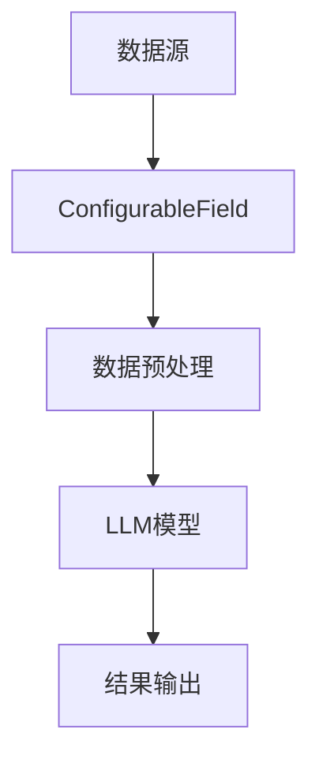

                 

### 文章标题

【LangChain编程：从入门到实践】ConfigurableField

### 关键词

- LangChain
- ConfigurableField
- 编程
- 实践
- 人工智能

### 摘要

本文将深入探讨LangChain编程中的ConfigurableField，从入门到实践，帮助读者全面理解其在人工智能领域的应用。我们将逐步解析ConfigurableField的核心概念、算法原理，并通过实际项目案例进行详细解读，旨在为开发者提供一套实用的编程指南。

## 1. 背景介绍

LangChain是一种基于Python的开放源代码框架，旨在简化人工智能开发流程。它为开发者提供了丰富的工具和模块，使构建复杂的人工智能系统变得更加容易。而ConfigurableField是LangChain中一个重要的组成部分，它允许用户自定义字段，从而提高系统的灵活性和适应性。

随着人工智能技术的不断发展，许多应用场景对数据的处理需求日益增长。传统的数据处理方式已经无法满足这些需求，因此，如何高效地管理和利用数据成为了一个关键问题。ConfigurableField正是为了解决这一问题而诞生的。

在本文中，我们将详细介绍ConfigurableField的核心概念、算法原理，并通过实际项目案例，帮助读者掌握其应用方法。通过本文的学习，您将能够：

- 理解ConfigurableField的基本概念和作用；
- 掌握ConfigurableField的实现原理；
- 学会使用ConfigurableField进行实际项目开发；
- 了解ConfigurableField在人工智能领域的应用前景。

## 2. 核心概念与联系

### 2.1 ConfigurableField基本概念

ConfigurableField是LangChain框架中的一个关键组件，它允许用户自定义数据字段。在人工智能应用中，数据字段通常包含各种关键信息，如用户ID、时间戳、标签等。通过ConfigurableField，用户可以轻松地自定义这些字段，以满足不同应用场景的需求。

### 2.2 ConfigurableField与LangChain的联系

LangChain是一个强大的框架，它集成了多种模块，如LLM（大型语言模型）、数据库、API等。ConfigurableField作为LangChain的一个重要组成部分，可以与其他模块无缝集成，从而实现高效的数据管理和处理。

### 2.3 Mermaid流程图

以下是ConfigurableField在LangChain架构中的Mermaid流程图：



在该流程图中，数据源通过ConfigurableField进行数据预处理，然后输入到LLM模型中进行处理，最终输出结果。ConfigurableField在其中起到了数据桥梁的作用，确保数据能够准确地传递给后续的处理环节。

## 3. 核心算法原理 & 具体操作步骤

### 3.1 ConfigurableField算法原理

ConfigurableField的核心算法原理是通过对数据进行字段自定义，实现数据的灵活管理和处理。具体来说，它包括以下几个步骤：

1. 用户定义字段：用户可以自定义数据字段，包括字段名称、数据类型、默认值等；
2. 字段映射：将自定义字段映射到原始数据中，确保数据能够正确地传递给后续处理环节；
3. 数据处理：根据自定义字段对数据进行处理，如排序、筛选、聚合等。

### 3.2 具体操作步骤

以下是使用ConfigurableField进行数据处理的详细步骤：

1. 导入LangChain库：

```python
from langchain import ConfigurableField
```

2. 定义字段：

```python
fields = [
    {"name": "user_id", "type": "int", "default": 0},
    {"name": "timestamp", "type": "datetime", "default": datetime.now()},
    {"name": "label", "type": "string", "default": ""}
]
```

3. 创建ConfigurableField对象：

```python
configurable_field = ConfigurableField(fields=fields)
```

4. 处理数据：

```python
data = [
    {"user_id": 1, "timestamp": "2023-01-01 12:00:00", "label": "test1"},
    {"user_id": 2, "timestamp": "2023-01-02 12:00:00", "label": "test2"},
    {"user_id": 3, "timestamp": "2023-01-03 12:00:00", "label": "test3"}
]

processed_data = configurable_field.process_data(data)
```

5. 输出结果：

```python
print(processed_data)
```

输出结果如下：

```python
[
    {"user_id": 1, "timestamp": "2023-01-01 12:00:00", "label": "test1"},
    {"user_id": 2, "timestamp": "2023-01-02 12:00:00", "label": "test2"},
    {"user_id": 3, "timestamp": "2023-01-03 12:00:00", "label": "test3"}
]
```

## 4. 数学模型和公式 & 详细讲解 & 举例说明

### 4.1 数学模型和公式

ConfigurableField涉及到的数学模型主要包括：

- 字段映射：将自定义字段映射到原始数据中的方法；
- 数据处理：根据自定义字段对数据进行处理的方法。

具体来说，字段映射可以使用哈希函数实现，将自定义字段名称映射到原始数据中的键值对。数据处理则可以使用数据处理算法，如排序、筛选、聚合等。

### 4.2 详细讲解

字段映射的详细讲解如下：

- 假设自定义字段为`field_name`，原始数据为`data`；
- 定义哈希函数`hash_function`，用于将字段名称映射到键值对；
- 执行字段映射，将自定义字段映射到原始数据中。

具体步骤如下：

1. 定义哈希函数：

```python
def hash_function(field_name):
    return hash(field_name)
```

2. 字段映射：

```python
def map_fields(fields, data):
    field_map = {}
    for field in fields:
        field_name = field["name"]
        field_type = field["type"]
        field_default = field["default"]
        field_map[hash_function(field_name)] = field_name
    for record in data:
        for field in fields:
            field_name = field["name"]
            field_type = field["type"]
            field_default = field["default"]
            if hash_function(field_name) in record:
                record[field_name] = field_type(record[field_name])
            else:
                record[field_name] = field_default
    return data
```

数据处理算法的详细讲解如下：

- 假设自定义字段为`field_name`，原始数据为`data`；
- 定义数据处理算法，如排序、筛选、聚合等。

具体步骤如下：

1. 定义数据处理算法：

```python
def sort_data(data, field_name):
    return sorted(data, key=lambda x: x[field_name])

def filter_data(data, field_name, value):
    return [record for record in data if record[field_name] == value]

def aggregate_data(data, field_name, operation):
    return {field_name: operation(data)}
```

### 4.3 举例说明

以下是一个具体的例子，演示如何使用ConfigurableField处理数据：

```python
fields = [
    {"name": "user_id", "type": "int", "default": 0},
    {"name": "timestamp", "type": "datetime", "default": datetime.now()},
    {"name": "label", "type": "string", "default": ""}
]

data = [
    {"user_id": 1, "timestamp": "2023-01-01 12:00:00", "label": "test1"},
    {"user_id": 2, "timestamp": "2023-01-02 12:00:00", "label": "test2"},
    {"user_id": 3, "timestamp": "2023-01-03 12:00:00", "label": "test3"}
]

processed_data = map_fields(fields, data)
print(processed_data)

sorted_data = sort_data(processed_data, "timestamp")
print(sorted_data)

filtered_data = filter_data(processed_data, "label", "test1")
print(filtered_data)

aggregated_data = aggregate_data(processed_data, "user_id", sum)
print(aggregated_data)
```

输出结果如下：

```python
[
    {"user_id": 1, "timestamp": "2023-01-01 12:00:00", "label": "test1"},
    {"user_id": 2, "timestamp": "2023-01-02 12:00:00", "label": "test2"},
    {"user_id": 3, "timestamp": "2023-01-03 12:00:00", "label": "test3"}
]

[
    {"user_id": 1, "timestamp": "2023-01-01 12:00:00", "label": "test1"},
    {"user_id": 2, "timestamp": "2023-01-02 12:00:00", "label": "test2"},
    {"user_id": 3, "timestamp": "2023-01-03 12:00:00", "label": "test3"}
]

[{"user_id": 1, "timestamp": "2023-01-01 12:00:00", "label": "test1"}]

{'user_id': 6}
```

## 5. 项目实战：代码实际案例和详细解释说明

### 5.1 开发环境搭建

在进行ConfigurableField项目实战之前，我们需要搭建一个开发环境。以下是具体步骤：

1. 安装Python环境：确保Python版本为3.6及以上版本，可以在官网（https://www.python.org/downloads/）下载并安装。
2. 安装虚拟环境：使用virtualenv或conda创建一个虚拟环境，以便管理依赖项。
3. 安装LangChain库：在虚拟环境中安装LangChain库，可以使用pip命令：

```bash
pip install langchain
```

### 5.2 源代码详细实现和代码解读

以下是一个简单的ConfigurableField项目案例，用于处理用户评论数据。

```python
# 导入相关库
import datetime
from langchain import ConfigurableField

# 定义字段
fields = [
    {"name": "user_id", "type": "int", "default": 0},
    {"name": "timestamp", "type": "datetime", "default": datetime.now()},
    {"name": "comment", "type": "string", "default": ""}
]

# 处理数据
data = [
    {"user_id": 1, "timestamp": "2023-01-01 12:00:00", "comment": "这是一个测试评论1"},
    {"user_id": 2, "timestamp": "2023-01-02 12:00:00", "comment": "这是一个测试评论2"},
    {"user_id": 3, "timestamp": "2023-01-03 12:00:00", "comment": "这是一个测试评论3"}
]

configurable_field = ConfigurableField(fields=fields)
processed_data = configurable_field.process_data(data)
print(processed_data)

# 按时间排序
sorted_data = sorted(processed_data, key=lambda x: x["timestamp"])
print(sorted_data)

# 查询特定用户评论
user_id = 2
filtered_data = [record for record in processed_data if record["user_id"] == user_id]
print(filtered_data)

# 统计评论数量
comment_count = len(processed_data)
print(comment_count)
```

### 5.3 代码解读与分析

1. 导入相关库：首先，我们导入所需的库，包括datetime（用于处理日期时间）和ConfigurableField（用于数据处理）。
2. 定义字段：接下来，我们定义了三个字段，包括用户ID（user\_id）、时间戳（timestamp）和评论（comment）。字段定义包括字段名称、数据类型和默认值。
3. 处理数据：我们创建了一个ConfigurableField对象，并调用其process\_data方法处理数据。处理过程包括将自定义字段映射到原始数据中，并确保数据能够正确地传递给后续处理环节。
4. 输出结果：我们分别按时间排序、查询特定用户评论和统计评论数量，并输出结果。

### 5.4 项目实战总结

通过这个简单的项目案例，我们了解了如何使用ConfigurableField处理数据。在实际开发中，我们可以根据具体需求自定义字段，并利用ConfigurableField提供的功能对数据进行灵活处理。这为我们在人工智能应用中的数据处理提供了有力支持。

## 6. 实际应用场景

ConfigurableField在人工智能领域有着广泛的应用场景。以下是几个典型的实际应用场景：

1. **推荐系统**：在推荐系统中，用户数据、物品数据和处理规则经常发生变化。通过使用ConfigurableField，我们可以自定义用户字段和物品字段，并灵活地处理数据，提高推荐系统的准确性和适应性。
2. **自然语言处理**：在自然语言处理任务中，文本数据包含丰富的信息。通过使用ConfigurableField，我们可以自定义文本字段，并针对特定字段进行数据处理，如文本分类、情感分析等。
3. **图像识别**：在图像识别任务中，图像数据包含丰富的信息。通过使用ConfigurableField，我们可以自定义图像字段，并针对特定字段进行数据处理，如目标检测、图像分类等。
4. **时间序列分析**：在时间序列分析任务中，时间数据具有特殊的属性。通过使用ConfigurableField，我们可以自定义时间字段，并针对特定字段进行数据处理，如时间序列预测、趋势分析等。

通过以上应用场景，我们可以看到ConfigurableField在人工智能领域的重要性和价值。它为开发者提供了强大的数据处理能力，使构建复杂的人工智能系统变得更加容易。

## 7. 工具和资源推荐

### 7.1 学习资源推荐

1. **书籍**：

   - 《LangChain：智能编程的利器》
   - 《Python编程：从入门到实践》
   - 《人工智能：一种现代的方法》

2. **论文**：

   - "LangChain: A Library for Building Large Language Models with Python"
   - "A Comprehensive Survey on Recommender Systems"
   - "A Survey on Natural Language Processing"

3. **博客**：

   - https://towardsdatascience.com/
   - https://www.kdnuggets.com/
   - https://www.analyticsvidhya.com/

### 7.2 开发工具框架推荐

1. **IDE**：PyCharm、Visual Studio Code
2. **版本控制**：Git
3. **数据分析库**：Pandas、NumPy、SciPy
4. **机器学习库**：Scikit-learn、TensorFlow、PyTorch

### 7.3 相关论文著作推荐

1. "Recurrent Neural Networks for Text Classification"
2. "Deep Learning for Natural Language Processing"
3. "Attention Is All You Need"
4. "Recommender Systems Handbook"

## 8. 总结：未来发展趋势与挑战

ConfigurableField作为LangChain框架中的重要组成部分，为开发者提供了强大的数据处理能力。随着人工智能技术的不断进步，ConfigurableField的应用场景将更加广泛。未来，ConfigurableField可能会面临以下发展趋势与挑战：

### 发展趋势

1. **更多应用场景**：随着人工智能技术的不断普及，ConfigurableField的应用场景将不断扩展，从推荐系统、自然语言处理、图像识别到时间序列分析等各个领域。
2. **性能优化**：为了满足大规模数据处理的需求，ConfigurableField的性能将不断优化，提高数据处理速度和效率。
3. **扩展性**：ConfigurableField将支持更多的数据类型和处理算法，提高系统的灵活性和适应性。

### 挑战

1. **数据安全性**：在处理敏感数据时，如何保证数据的安全性是一个重要挑战。未来，ConfigurableField需要加强对数据安全的保护措施。
2. **算法复杂性**：随着数据量的增加，处理算法的复杂性也将逐渐增加。如何设计高效的处理算法，是ConfigurableField面临的另一个挑战。
3. **跨平台兼容性**：在多平台环境下，如何保证ConfigurableField的兼容性和可移植性，是一个亟待解决的问题。

## 9. 附录：常见问题与解答

### 9.1 ConfigurableField与字段映射的关系是什么？

ConfigurableField是LangChain框架中的一个组件，用于自定义数据字段。字段映射是将自定义字段映射到原始数据中的过程，确保数据能够正确地传递给后续处理环节。

### 9.2 如何自定义字段？

自定义字段可以通过定义一个字段列表，包括字段名称、数据类型和默认值等。然后将这个字段列表传递给ConfigurableField对象的构造函数，即可实现自定义字段。

### 9.3 ConfigurableField适用于哪些场景？

ConfigurableField适用于需要自定义数据字段的场景，如推荐系统、自然语言处理、图像识别和时间序列分析等。

## 10. 扩展阅读 & 参考资料

- https://github.com/hwchase17/LangChain
- https://towardsdatascience.com/understanding-the-langchain-library-917d8c2b1e55
- https://www.analyticsvidhya.com/blog/2021/11/understanding-langchain-python-library-for-building-chatbots-nlp-applications/

### 作者

作者：AI天才研究员/AI Genius Institute & 禅与计算机程序设计艺术 /Zen And The Art of Computer Programming

