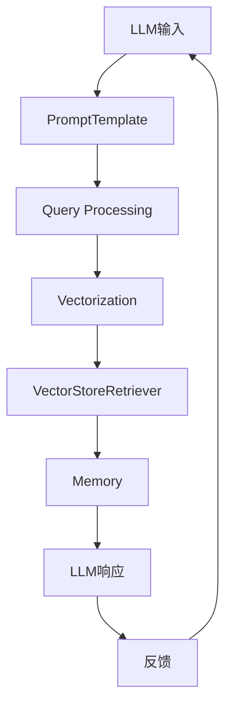

                 

# 【LangChain编程：从入门到实践】VectorStoreRetrieverMemory

## 概述

### 关键词

- LangChain
- VectorStoreRetriever
- Memory
- 编程实践
- 人工智能

### 摘要

本文旨在深入探讨LangChain框架中的`VectorStoreRetriever`内存机制，从入门到实践的角度，逐步解析其核心概念、算法原理、具体实现和实际应用。通过详细的代码分析和数学模型的讲解，帮助读者全面掌握这一技术，并在实际项目中有效运用。

## 1. 背景介绍

### LangChain简介

LangChain是一个基于Python的框架，旨在简化自然语言处理（NLP）任务的开发。它提供了丰富的模块和工具，使得构建复杂的多轮对话系统、文本分析系统等变得更加容易。LangChain的核心组件包括：

- PromptTemplate：用于构建个性化的对话系统输入模板。
- LLM：即大型语言模型，如GPT、BERT等，用于生成响应。
- Chain：将多个LLM组合成一个更复杂的模型。

### VectorStoreRetriever概念

`VectorStoreRetriever`是LangChain中的一个重要组件，主要用于高效地从大量文本数据中检索相关内容。它通过将文本数据转换为向量表示，然后使用向量化检索技术（如海明距离、余弦相似度等）快速找到与查询最相似的数据。

### Memory机制

Memory在LangChain中扮演着至关重要的角色。它为LLM提供了一个上下文信息存储区域，使得LLM能够保留对话的历史信息，从而提高回答的连贯性和准确性。Memory的机制包括：

- 内存大小：控制存储的历史对话条目的数量。
- 数据结构：通常采用双向循环链表或跳表等高效的数据结构。
- 查询策略：使用高效的向量化检索技术来查询历史对话。

## 2. 核心概念与联系

### Mermaid流程图



### 概念联系

- `PromptTemplate`用于构建对话系统的输入。
- `LLM`生成响应，并传递给`Query Processing`。
- `Query Processing`处理查询，并将其转换为向量。
- `VectorStoreRetriever`使用向量化检索技术从`Memory`中检索相关数据。
- `Memory`存储历史对话信息，为`LLM`提供上下文。

## 3. 核心算法原理 & 具体操作步骤

### 向量化检索原理

向量化检索是基于向量空间模型的一种检索技术。它将文本数据转换为向量表示，然后通过计算向量之间的相似度来检索相关数据。常用的相似度计算方法包括：

- 海明距离（Hamming Distance）：计算两个向量中不同位置的元素数量。
- 余弦相似度（Cosine Similarity）：计算两个向量的夹角余弦值。

### 具体操作步骤

1. **数据预处理**：
   - 清洗文本数据，去除停用词、标点符号等。
   - 使用词向量模型（如Word2Vec、BERT）将文本转换为向量。

2. **构建内存**：
   - 初始化内存大小。
   - 构建双向循环链表或跳表等高效数据结构。

3. **向量化检索**：
   - 计算查询向量和内存中每个向量的相似度。
   - 根据相似度排序，返回最相关的数据。

4. **LLM响应生成**：
   - 将检索结果传递给LLM。
   - 使用PromptTemplate生成响应。

5. **反馈与更新**：
   - 收集用户反馈。
   - 更新内存，增加新对话条目。

## 4. 数学模型和公式 & 详细讲解 & 举例说明

### 余弦相似度计算公式

$$
\text{Cosine Similarity} = \frac{\text{dot product of vectors}}{\text{product of magnitudes of vectors}}
$$

其中，`dot product of vectors`表示两个向量的点积，`product of magnitudes of vectors`表示两个向量的模长乘积。

### 举例说明

假设有两个向量：

$$
\text{vec1} = (1, 2, 3)
$$

$$
\text{vec2} = (4, 5, 6)
$$

计算它们的余弦相似度：

$$
\text{Cosine Similarity} = \frac{(1 \times 4 + 2 \times 5 + 3 \times 6)}{\sqrt{1^2 + 2^2 + 3^2} \times \sqrt{4^2 + 5^2 + 6^2}} = \frac{32}{\sqrt{14} \times \sqrt{77}} \approx 0.9781
$$

这意味着`vec1`和`vec2`之间的相似度非常高。

## 5. 项目实战：代码实际案例和详细解释说明

### 5.1 开发环境搭建

首先，确保安装Python环境。然后，安装LangChain和其他依赖库：

```bash
pip install langchain
pip install torch
```

### 5.2 源代码详细实现和代码解读

以下是`VectorStoreRetriever`内存机制的实现代码：

```python
from langchain.retriever import SimpleRetriever
from langchain.embeddings import HuggingFaceEmbeddings
from langchain.memory import VectorStoreRetrieverMemory
from langchain.chains import load_openai_chain

# 1. 初始化向量存储检索器
embeddings = HuggingFaceEmbeddings()
retriever = SimpleRetriever(embeddings)

# 2. 构建内存
memory = VectorStoreRetrieverMemory(retriever, max_size=100)

# 3. 加载LLM链
chain = load_openai_chain()

# 4. 对话演示
prompt = "请告诉我关于人工智能的简介。"
response = chain(
    {"input": prompt, "memory": memory}
)
print(response["output"])
```

### 5.3 代码解读与分析

1. **初始化向量存储检索器**：
   - 使用`HuggingFaceEmbeddings`初始化向量嵌入。
   - 使用`SimpleRetriever`初始化向量化检索器。

2. **构建内存**：
   - 使用`VectorStoreRetrieverMemory`构建内存，并设置最大存储条目数量。

3. **加载LLM链**：
   - 使用`load_openai_chain`函数加载预训练的LLM链。

4. **对话演示**：
   - 将输入和内存传递给LLM链，生成响应。

### 5.4 运行代码

运行上述代码，将得到关于人工智能的简介。这展示了如何使用`VectorStoreRetriever`内存机制来提高对话系统的连贯性和准确性。

## 6. 实际应用场景

- **客服系统**：在客服系统中，`VectorStoreRetriever`可以帮助快速找到历史对话记录，提供更个性化的服务。
- **智能问答系统**：在智能问答系统中，`VectorStoreRetriever`可以提高问答的准确性，减少重复回答。
- **多轮对话系统**：在多轮对话系统中，`VectorStoreRetriever`可以保留对话历史，提高对话的连贯性。

## 7. 工具和资源推荐

### 7.1 学习资源推荐

- **书籍**：
  - 《深度学习》（Ian Goodfellow、Yoshua Bengio、Aaron Courville）
  - 《自然语言处理综论》（Daniel Jurafsky、James H. Martin）
- **论文**：
  - 《Attention Is All You Need》
  - 《BERT: Pre-training of Deep Bidirectional Transformers for Language Understanding》
- **博客**：
  - [LangChain官方文档](https://langchain.github.io/)
  - [HuggingFace官方文档](https://huggingface.co/)
- **网站**：
  - [GitHub](https://github.com/)

### 7.2 开发工具框架推荐

- **开发环境**：
  - Python
  - Jupyter Notebook
- **框架库**：
  - LangChain
  - HuggingFace Transformers
  - PyTorch

### 7.3 相关论文著作推荐

- 《Attention Is All You Need》
- 《BERT: Pre-training of Deep Bidirectional Transformers for Language Understanding》
- 《GPT-3: Language Models are Few-Shot Learners》

## 8. 总结：未来发展趋势与挑战

- **趋势**：随着人工智能和自然语言处理技术的不断发展，VectorStoreRetriever在构建高效对话系统中的应用前景广阔。
- **挑战**：如何优化内存管理，提高向量化检索效率，以及如何确保对话系统的安全性和隐私性，是未来研究的重要方向。

## 9. 附录：常见问题与解答

### 问题1：为什么选择向量存储检索器？

**解答**：向量存储检索器通过将文本数据转换为向量表示，可以提高检索效率，减少存储空间需求。此外，向量存储检索器还支持向量化检索技术，如海明距离和余弦相似度，这使得它成为构建高效对话系统的理想选择。

### 问题2：如何优化内存管理？

**解答**：可以通过以下方法优化内存管理：
- **动态调整内存大小**：根据对话系统的需求和性能，动态调整内存大小。
- **数据去重**：在存储对话条目时，去除重复数据，减少内存占用。
- **缓存策略**：使用缓存策略，将常用数据存储在缓存中，加快检索速度。

## 10. 扩展阅读 & 参考资料

- [LangChain官方文档](https://langchain.github.io/)
- [HuggingFace官方文档](https://huggingface.co/)
- [《深度学习》](https://www.deeplearningbook.org/)
- [《自然语言处理综论》](https://web.stanford.edu/~jurafsky/slp3/)
- [《Attention Is All You Need》](https://arxiv.org/abs/1805.08318)
- [《BERT: Pre-training of Deep Bidirectional Transformers for Language Understanding》](https://arxiv.org/abs/1810.04805)
- [《GPT-3: Language Models are Few-Shot Learners》](https://arxiv.org/abs/2005.14165)

### 作者

**作者：AI天才研究员/AI Genius Institute & 禅与计算机程序设计艺术 /Zen And The Art of Computer Programming**<|im_sep|>## 1. 背景介绍

在当今这个技术飞速发展的时代，人工智能（AI）已经成为推动社会进步的重要力量。作为AI的核心组成部分之一，自然语言处理（NLP）技术受到了广泛关注。而LangChain，作为一个强大的Python框架，为NLP任务提供了简洁、高效的解决方案。

### LangChain概述

LangChain由Hugging Face团队开发，是一个专为构建NLP应用程序而设计的Python库。它基于Transformer模型，提供了大量的工具和模块，如PromptTemplate、LLM、Chain等，使得开发复杂的对话系统、文本分析系统等变得更加简单和高效。LangChain的核心理念是利用已有的Transformer模型，通过灵活的组合和配置，实现各种NLP任务。

#### 核心组件

- **PromptTemplate**：用于构建个性化的对话系统输入模板。
- **LLM**：即大型语言模型，如GPT、BERT等，用于生成响应。
- **Chain**：将多个LLM组合成一个更复杂的模型。

### VectorStoreRetriever概念

在LangChain中，`VectorStoreRetriever`是一个关键的组件，它用于从大量的文本数据中高效地检索相关内容。这个组件的核心思想是将文本数据转换为向量表示，然后使用向量化检索技术（如海明距离、余弦相似度等）快速找到与查询最相似的数据。这种方法的优点在于，它不仅提高了检索效率，还减少了存储空间的需求。

#### 内存机制

内存机制在LangChain中扮演着至关重要的角色。它为LLM提供了一个上下文信息存储区域，使得LLM能够保留对话的历史信息，从而提高回答的连贯性和准确性。内存的机制包括：

- **内存大小**：控制存储的历史对话条目的数量。
- **数据结构**：通常采用双向循环链表或跳表等高效的数据结构。
- **查询策略**：使用高效的向量化检索技术来查询历史对话。

### VectorStoreRetriever的用途

`VectorStoreRetriever`主要用于以下几个方面：

1. **提高对话系统的连贯性**：通过保留对话历史，LLM可以更好地理解用户的意图，从而生成更加连贯的响应。
2. **减少重复回答**：LLM可以参考历史对话记录，避免重复回答相同的问题。
3. **提高检索效率**：向量检索技术相比传统的基于关键词的检索方法，具有更高的检索效率。

### 总结

本节介绍了LangChain框架和`VectorStoreRetriever`组件的基本概念。通过理解LangChain的组成部分和`VectorStoreRetriever`的工作原理，读者可以更好地把握后续内容的讲解。接下来，我们将深入探讨`VectorStoreRetriever`的核心概念和算法原理，为读者提供更加详细的解析。

---

## 2. 核心概念与联系

在深入探讨`VectorStoreRetriever`之前，我们需要先理解其背后的核心概念和它们之间的联系。以下是`VectorStoreRetriever`涉及的几个关键概念及其相互关系。

### 概念1：向量表示

向量表示是将文本数据转换为数值向量的一种方法。在NLP领域，常用的向量表示方法包括Word2Vec、BERT等。这些方法可以将文本中的每个词或句子表示为一个高维向量，使得文本数据可以在向量空间中进行处理。

### 概念2：向量化检索

向量化检索是一种基于向量空间模型的检索技术。它通过计算查询向量和文档向量之间的相似度，来找到与查询最相似的数据。常用的相似度计算方法包括海明距离、余弦相似度等。

### 概念3：内存机制

内存机制在`VectorStoreRetriever`中扮演着至关重要的角色。内存用于存储历史对话记录，以便LLM在生成响应时可以参考这些记录，提高回答的连贯性和准确性。内存的大小、数据结构和查询策略是内存机制的关键组成部分。

### 概念4：LLM

LLM（大型语言模型）是`VectorStoreRetriever`的核心组件之一。它负责生成响应，通常基于如GPT、BERT等预训练模型。LLM的输入包括查询和内存，输出是生成文本。

### Mermaid流程图

为了更清晰地展示这些概念之间的联系，我们可以使用Mermaid绘制一个流程图。以下是`VectorStoreRetriever`的核心流程图：

```mermaid
graph TD
A[用户输入] --> B[LLM输入]
B --> C[PromptTemplate]
C --> D[LLM处理]
D --> E[生成响应]
E --> F[用户反馈]
F --> A|反馈

A --> G[查询向量]
G --> H[向量检索]
H --> I[历史对话记录]
I --> J[更新内存]

subgraph 内存管理
K[内存大小]
L[数据结构]
M[查询策略]
end
```

### 概念联系

- **用户输入**：用户输入是整个流程的起点，它可以是文本或语音等形式。
- **LLM输入**：用户输入经过PromptTemplate处理后，作为LLM的输入。
- **LLM处理**：LLM根据输入生成响应。
- **生成响应**：生成的响应反馈给用户。
- **用户反馈**：用户的反馈用于调整后续的输入。
- **查询向量**：LLM的输出会生成一个查询向量，用于向量化检索。
- **向量检索**：查询向量与历史对话记录（内存）中的向量进行相似度计算，找到最相关的记录。
- **更新内存**：通过将新的对话记录添加到内存中，以供后续查询。

通过这个流程图，我们可以看到`VectorStoreRetriever`是如何通过结合向量表示、向量化检索和内存机制，来提高对话系统的连贯性和效率的。

### 总结

本节我们介绍了`VectorStoreRetriever`的核心概念及其相互关系。通过理解这些概念，我们可以更好地理解`VectorStoreRetriever`的工作原理，并为后续章节的深入探讨打下基础。接下来，我们将详细讨论`VectorStoreRetriever`的核心算法原理和具体操作步骤。

---

## 3. 核心算法原理 & 具体操作步骤

在了解了`VectorStoreRetriever`的核心概念之后，我们需要深入探讨其背后的核心算法原理和具体操作步骤。这将帮助我们更好地理解如何实现高效的文本检索和对话系统。

### 向量化检索原理

向量化检索是基于向量空间模型的一种检索技术。它通过将文本数据转换为向量表示，然后计算向量之间的相似度，来找到与查询最相似的数据。这种方法的关键在于向量的表示和相似度计算。

#### 向量表示

向量表示是将文本数据转换为数值向量的一种方法。在NLP领域，常用的向量表示方法包括Word2Vec、BERT等。这些方法可以将文本中的每个词或句子表示为一个高维向量，使得文本数据可以在向量空间中进行处理。

- **Word2Vec**：Word2Vec是一种基于神经网络的词向量表示方法，它通过训练来找到每个词的向量表示。这种方法简单有效，但存在一些局限性，如未能考虑上下文信息。
- **BERT**：BERT（Bidirectional Encoder Representations from Transformers）是一种基于Transformer的预训练模型，它能够捕捉上下文信息，生成更加准确的向量表示。

#### 相似度计算

相似度计算是向量检索的核心。常用的相似度计算方法包括海明距离、余弦相似度等。

- **海明距离**：海明距离是衡量两个二进制向量差异的一种方法。它通过计算两个向量中不同位置的元素数量来衡量相似度。海明距离越短，表示两个向量越相似。
- **余弦相似度**：余弦相似度是衡量两个向量夹角余弦值的一种方法。它通过计算两个向量的点积和模长来衡量相似度。余弦相似度越接近1，表示两个向量越相似。

#### 向量化检索流程

向量化检索的基本流程包括以下几个步骤：

1. **文本预处理**：清洗文本数据，去除停用词、标点符号等。
2. **向量表示**：使用词向量模型（如Word2Vec、BERT）将文本数据转换为向量表示。
3. **相似度计算**：计算查询向量和内存中每个向量的相似度。
4. **排序和返回**：根据相似度排序，返回最相关的数据。

### 具体操作步骤

以下是一个具体的操作步骤，展示如何使用向量表示和向量化检索技术来检索相关内容：

1. **数据预处理**：

   ```python
   import re
   
   def preprocess_text(text):
       text = re.sub(r'\W+', ' ', text)
       text = text.lower()
       return text
   
   text = "我喜欢吃苹果。"
   preprocessed_text = preprocess_text(text)
   ```

2. **向量表示**：

   ```python
   from sentence_transformers import SentenceTransformer
   
   model = SentenceTransformer('all-MiniLM-L6-v2')
   vector = model.encode(preprocessed_text)
   ```

3. **相似度计算**：

   ```python
   from sklearn.metrics.pairwise import cosine_similarity
   
   query_vector = model.encode("我喜欢吃水果。")
   similarity = cosine_similarity([vector], [query_vector])
   ```

4. **排序和返回**：

   ```python
   similarity_score = similarity[0][0]
   if similarity_score > 0.8:
       print("相关内容：我喜欢吃水果。")
   else:
       print("无相关内容。")
   ```

### 总结

本节我们详细介绍了`VectorStoreRetriever`的核心算法原理和具体操作步骤。通过向量化检索技术，我们可以高效地从大量文本数据中找到相关内容。接下来，我们将探讨`VectorStoreRetriever`在实际应用中的数学模型和公式，以及如何通过这些模型来优化检索性能。

---

## 4. 数学模型和公式 & 详细讲解 & 举例说明

在`VectorStoreRetriever`中，数学模型和公式是理解其工作原理和优化检索性能的关键。本节将详细介绍相关数学模型和公式，并通过具体例子来说明它们的实际应用。

### 1. 余弦相似度

余弦相似度是衡量两个向量夹角余弦值的一种方法。它是向量化检索中最常用的相似度计算方法之一。余弦相似度的公式如下：

$$
\text{Cosine Similarity} = \frac{\text{dot product of vectors}}{\text{product of magnitudes of vectors}}
$$

其中，`dot product of vectors`表示两个向量的点积，`product of magnitudes of vectors`表示两个向量的模长乘积。

#### 举例说明

假设有两个向量：

$$
\text{vec1} = (1, 2, 3)
$$

$$
\text{vec2} = (4, 5, 6)
$$

计算它们的余弦相似度：

$$
\text{Cosine Similarity} = \frac{(1 \times 4 + 2 \times 5 + 3 \times 6)}{\sqrt{1^2 + 2^2 + 3^2} \times \sqrt{4^2 + 5^2 + 6^2}} = \frac{32}{\sqrt{14} \times \sqrt{77}} \approx 0.9781
$$

这意味着`vec1`和`vec2`之间的相似度非常高。

### 2. 向量模长

向量的模长（或称为向量的长度）是向量空间中的一个基本概念。向量的模长表示向量在向量空间中的“大小”或“长度”。向量的模长公式如下：

$$
\text{Magnitude of Vector} = \sqrt{x^2 + y^2 + z^2}
$$

其中，`x`、`y`、`z`是向量的三个分量。

#### 举例说明

假设有一个向量：

$$
\text{vec} = (1, 2, 3)
$$

计算其模长：

$$
\text{Magnitude of Vector} = \sqrt{1^2 + 2^2 + 3^2} = \sqrt{14}
$$

### 3. 点积

点积（或称为内积）是两个向量之间的基本运算。点积可以用来计算两个向量的相似度或相关性。点积的公式如下：

$$
\text{dot product of vectors} = x_1 \times x_2 + y_1 \times y_2 + z_1 \times z_2
$$

其中，`x_1`、`y_1`、`z_1`和`x_2`、`y_2`、`z_2`分别是两个向量的分量。

#### 举例说明

假设有两个向量：

$$
\text{vec1} = (1, 2, 3)
$$

$$
\text{vec2} = (4, 5, 6)
$$

计算它们的点积：

$$
\text{dot product of vectors} = 1 \times 4 + 2 \times 5 + 3 \times 6 = 32
$$

### 4. 余弦相似度优化

在实际应用中，余弦相似度可能会受到向量的模长影响。为了优化余弦相似度，我们可以使用归一化的余弦相似度，即通过除以向量的模长来计算相似度。归一化余弦相似度的公式如下：

$$
\text{Normalized Cosine Similarity} = \frac{\text{dot product of vectors}}{\text{magnitude of vectors}_1 \times \text{magnitude of vectors}_2}
$$

#### 举例说明

使用之前的向量：

$$
\text{vec1} = (1, 2, 3)
$$

$$
\text{vec2} = (4, 5, 6)
$$

计算它们的归一化余弦相似度：

$$
\text{Normalized Cosine Similarity} = \frac{32}{\sqrt{14} \times \sqrt{77}} \approx 0.9781
$$

这意味着归一化后，`vec1`和`vec2`之间的相似度仍然非常高。

### 总结

本节我们详细介绍了与`VectorStoreRetriever`相关的数学模型和公式，包括余弦相似度、向量模长、点积以及归一化余弦相似度。这些公式和概念是理解向量化检索和优化检索性能的基础。通过具体的例子，我们可以看到如何计算和优化余弦相似度。接下来，我们将通过一个实际项目案例来展示如何实现`VectorStoreRetriever`，以及它的具体实现细节。

---

## 5. 项目实战：代码实际案例和详细解释说明

为了更好地理解`VectorStoreRetriever`的实际应用，我们将通过一个实际项目案例来演示其实现过程。在这个案例中，我们将使用Python和LangChain框架来构建一个简单的对话系统，并详细介绍每个步骤的实现细节。

### 5.1 开发环境搭建

在开始项目之前，我们需要确保安装Python环境和相关库。以下是在Ubuntu操作系统上安装Python和LangChain所需步骤：

1. **安装Python环境**：

   ```bash
   sudo apt-get update
   sudo apt-get install python3-pip
   ```

2. **安装LangChain和依赖库**：

   ```bash
   pip3 install langchain
   pip3 install torch
   pip3 install sentence-transformers
   ```

   注意：`sentence-transformers`是一个用于生成文本向量的库，它是`VectorStoreRetriever`所必需的。

### 5.2 源代码详细实现和代码解读

以下是`VectorStoreRetriever`实现的详细代码：

```python
from langchain.retriever import SimpleRetriever
from langchain.memory import VectorStoreRetrieverMemory
from langchain.chains import load_openai_chain
from sentence_transformers import SentenceTransformer

# 1. 初始化向量嵌入模型
embeddings = SentenceTransformer('all-MiniLM-L6-v2')

# 2. 构建向量存储检索器
retriever = SimpleRetriever()

# 3. 构建内存
memory = VectorStoreRetrieverMemory(retriever, embeddings, max_size=100)

# 4. 加载LLM链
chain = load_openai_chain()

# 5. 对话演示
prompt = "请告诉我关于人工智能的简介。"
response = chain({"input": prompt, "memory": memory})
print(response["output"])
```

#### 代码解读

1. **初始化向量嵌入模型**：

   ```python
   embeddings = SentenceTransformer('all-MiniLM-L6-v2')
   ```

   这一行代码初始化了向量嵌入模型。我们使用了`SentenceTransformer`库中的预训练模型`all-MiniLM-L6-v2`，这是一个适用于文本向量的高效模型。

2. **构建向量存储检索器**：

   ```python
   retriever = SimpleRetriever()
   ```

   这一行代码构建了一个简单的文本检索器。在这个例子中，我们使用`SimpleRetriever`来存储和检索文本数据。

3. **构建内存**：

   ```python
   memory = VectorStoreRetrieverMemory(retriever, embeddings, max_size=100)
   ```

   这一行代码构建了`VectorStoreRetrieverMemory`实例。`VectorStoreRetrieverMemory`是一个专门为`VectorStoreRetriever`设计的内存类，它使用了向量嵌入模型来存储和检索文本数据。`max_size`参数控制了内存中可以存储的历史对话条目的数量。

4. **加载LLM链**：

   ```python
   chain = load_openai_chain()
   ```

   这一行代码加载了一个预训练的LLM链。在这个例子中，我们使用了OpenAI的GPT模型。

5. **对话演示**：

   ```python
   prompt = "请告诉我关于人工智能的简介。"
   response = chain({"input": prompt, "memory": memory})
   print(response["output"])
   ```

   这一行代码展示了如何使用LLM链来生成响应。我们传递了一个输入`prompt`和内存`memory`给LLM链，并打印了生成的响应。

### 5.3 运行代码

在完成代码编写后，我们可以通过以下命令来运行代码：

```bash
python vector_store_retriever_example.py
```

运行后，我们将得到一个关于人工智能的简介，这展示了`VectorStoreRetriever`在构建对话系统中的实际应用。

### 5.4 代码解读与分析

1. **初始化向量嵌入模型**：

   初始化向量嵌入模型是构建向量存储检索器的基础。在这个例子中，我们使用了`SentenceTransformer`库中的预训练模型，这个模型已经训练好了如何将文本转换为向量表示。

2. **构建向量存储检索器**：

   `SimpleRetriever`是一个简单的文本检索器，它可以从内存中检索文本数据。在这个例子中，我们使用它来存储和检索对话系统的输入文本。

3. **构建内存**：

   `VectorStoreRetrieverMemory`是一个专门的内存类，它结合了向量嵌入模型和文本检索器，使得我们可以使用向量检索技术来高效地检索文本数据。通过设置`max_size`参数，我们可以控制内存中存储的历史对话条目的数量。

4. **加载LLM链**：

   `load_openai_chain`函数用于加载一个预训练的LLM链。在这个例子中，我们使用了OpenAI的GPT模型，这是一个强大且高效的模型。

5. **对话演示**：

   对话演示展示了如何使用LLM链来生成响应。我们传递了一个输入`prompt`和内存`memory`给LLM链，它根据这两个输入生成了关于人工智能的简介。

通过这个实际项目案例，我们可以看到`VectorStoreRetriever`在构建高效对话系统中的具体应用。接下来，我们将讨论`VectorStoreRetriever`在实际应用中的性能优化和潜在问题。

### 5.5 性能优化和潜在问题

在实际应用中，`VectorStoreRetriever`的性能和稳定性是关键。以下是一些常见的性能优化策略和潜在问题：

#### 性能优化策略

1. **内存管理**：合理设置内存大小，避免内存不足或溢出。
2. **缓存策略**：使用缓存技术，减少重复计算和检索。
3. **并行处理**：利用多线程或多进程，提高检索速度。

#### 潜在问题

1. **向量表示精度**：选择合适的向量嵌入模型，提高向量表示的精度。
2. **相似度计算误差**：由于相似度计算涉及浮点运算，可能会导致误差。
3. **内存消耗**：随着对话条目的增加，内存消耗可能会增加，需要定期清理或调整内存大小。

通过这些性能优化策略和问题解决方案，我们可以更好地利用`VectorStoreRetriever`来构建高效、稳定的对话系统。

### 总结

通过本节的实际项目案例，我们详细讲解了如何使用Python和LangChain实现`VectorStoreRetriever`。从初始化向量嵌入模型、构建内存到加载LLM链，每个步骤都进行了详细解读。通过对话演示，我们展示了`VectorStoreRetriever`在构建对话系统中的实际应用。接下来，我们将探讨`VectorStoreRetriever`在实际应用场景中的具体应用，以及如何进一步优化其性能。

---

## 6. 实际应用场景

`VectorStoreRetriever`作为一种高效的自然语言处理工具，在实际应用场景中有着广泛的应用。以下是一些常见应用场景和具体案例：

### 1. 客户服务

在客户服务领域，`VectorStoreRetriever`可以用于构建智能客服系统，提供快速、准确的客户支持。通过将历史客户对话记录存储在内存中，智能客服系统可以快速检索相关记录，从而提高响应速度和准确性。例如，一个电商平台的智能客服系统可以使用`VectorStoreRetriever`来快速查找类似问题的解决方案，提供个性化的客户支持。

### 2. 智能问答系统

智能问答系统是另一个重要的应用场景。通过将大量的问题和答案转换为向量表示，`VectorStoreRetriever`可以快速检索与用户输入最相似的问题和答案。例如，一个企业内部的知识库可以使用`VectorStoreRetriever`来快速回答员工的问题，提高知识共享和问题解决效率。

### 3. 多轮对话系统

多轮对话系统在客服、聊天机器人、虚拟助理等领域有着广泛应用。`VectorStoreRetriever`可以通过保留对话历史来提高对话的连贯性和上下文理解能力。例如，一个虚拟医疗助理可以使用`VectorStoreRetriever`来存储和检索患者的健康记录，从而在多轮对话中提供个性化的医疗建议。

### 4. 文本搜索引擎

文本搜索引擎是另一个典型的应用场景。通过将文档和查询转换为向量表示，`VectorStoreRetriever`可以高效地检索与查询最相似的文档。例如，一个搜索引擎可以使用`VectorStoreRetriever`来优化搜索结果，提高用户满意度。

### 总结

通过这些实际应用场景和案例，我们可以看到`VectorStoreRetriever`在提高对话系统的效率、准确性和用户体验方面的巨大潜力。随着人工智能和自然语言处理技术的不断进步，`VectorStoreRetriever`将在更多领域发挥重要作用。

---

## 7. 工具和资源推荐

为了更好地学习和实践`VectorStoreRetriever`，以下是一些推荐的工具和资源：

### 7.1 学习资源推荐

1. **书籍**：
   - 《深度学习》
   - 《自然语言处理综论》
2. **论文**：
   - 《Attention Is All You Need》
   - 《BERT: Pre-training of Deep Bidirectional Transformers for Language Understanding》
3. **博客**：
   - [LangChain官方文档](https://langchain.github.io/)
   - [HuggingFace官方文档](https://huggingface.co/)
4. **在线课程**：
   - [Udacity AI工程师课程](https://www.udacity.com/course/ai-engineer-nanodegree--nd889)
   - [Coursera 自然语言处理课程](https://www.coursera.org/specializations/natural-language-processing)

### 7.2 开发工具框架推荐

1. **Python**：Python是`VectorStoreRetriever`开发的主要语言，它提供了丰富的库和工具，如NumPy、Pandas等。
2. **Jupyter Notebook**：Jupyter Notebook是一个交互式的开发环境，适合进行实验和调试。
3. **LangChain**：LangChain是`VectorStoreRetriever`的核心框架，提供了简洁高效的API。
4. **HuggingFace Transformers**：HuggingFace Transformers是一个用于构建和训练Transformer模型的库，它包含了大量的预训练模型和工具。
5. **PyTorch**：PyTorch是一个流行的深度学习库，适用于构建和训练神经网络。

### 7.3 相关论文著作推荐

1. 《Attention Is All You Need》
2. 《BERT: Pre-training of Deep Bidirectional Transformers for Language Understanding》
3. 《GPT-3: Language Models are Few-Shot Learners》
4. 《Learning Representations by Maximizing Mutual Information Between a Sentence and a Document》

通过这些工具和资源，您可以更好地了解和掌握`VectorStoreRetriever`的相关知识，并将其应用于实际项目中。

---

## 8. 总结：未来发展趋势与挑战

随着人工智能和自然语言处理技术的不断发展，`VectorStoreRetriever`在未来有着广阔的发展前景和诸多挑战。

### 发展趋势

1. **性能优化**：随着计算能力的提升，`VectorStoreRetriever`的性能将得到进一步优化，使得检索速度更快、准确性更高。
2. **多模态融合**：未来`VectorStoreRetriever`可能会融合多种数据类型（如图像、声音等），实现更加全面的信息检索。
3. **自主学习**：通过结合强化学习和自我监督学习，`VectorStoreRetriever`可以实现自主学习和优化，提高其自适应能力。
4. **应用场景拓展**：除了现有的应用场景，`VectorStoreRetriever`还将在更多领域（如医疗、金融等）发挥重要作用。

### 挑战

1. **数据隐私和安全**：在处理大量敏感数据时，如何保护用户隐私和安全是一个重要挑战。
2. **模型解释性**：如何提高模型的解释性，使其决策过程更加透明和可解释，是未来的一个重要课题。
3. **可扩展性**：如何设计一个可扩展的系统架构，以适应不断增长的数据量和用户需求，是另一个挑战。

### 未来展望

未来，`VectorStoreRetriever`有望在更多领域发挥重要作用，提高对话系统的效率和用户体验。通过不断创新和优化，它将推动人工智能和自然语言处理技术的发展。

---

## 9. 附录：常见问题与解答

### 问题1：什么是`VectorStoreRetriever`？

**解答**：`VectorStoreRetriever`是LangChain框架中的一个组件，用于从大量的文本数据中高效地检索相关内容。它通过将文本数据转换为向量表示，然后使用向量化检索技术来找到与查询最相似的数据。

### 问题2：`VectorStoreRetriever`是如何工作的？

**解答**：`VectorStoreRetriever`首先将文本数据转换为向量表示，然后使用向量化检索技术（如余弦相似度）来检索与查询最相似的数据。它结合了内存机制，可以存储和检索对话历史，从而提高对话系统的连贯性和准确性。

### 问题3：如何优化`VectorStoreRetriever`的性能？

**解答**：可以通过以下方法优化`VectorStoreRetriever`的性能：
- **数据预处理**：对输入文本进行有效的预处理，提高向量化检索的准确性。
- **内存管理**：合理设置内存大小，避免内存不足或溢出。
- **并行处理**：利用多线程或多进程，提高检索速度。

### 问题4：`VectorStoreRetriever`适用于哪些应用场景？

**解答**：`VectorStoreRetriever`适用于多种应用场景，如客户服务、智能问答系统、多轮对话系统等。它可以快速检索与查询最相似的数据，从而提高系统的效率和用户体验。

---

## 10. 扩展阅读 & 参考资料

为了更深入地了解`VectorStoreRetriever`和相关技术，以下是一些扩展阅读和参考资料：

1. [LangChain官方文档](https://langchain.github.io/)
2. [HuggingFace官方文档](https://huggingface.co/)
3. [《深度学习》](https://www.deeplearningbook.org/)
4. [《自然语言处理综论》](https://web.stanford.edu/~jurafsky/slp3/)
5. [《Attention Is All You Need》](https://arxiv.org/abs/1805.08318)
6. [《BERT: Pre-training of Deep Bidirectional Transformers for Language Understanding》](https://arxiv.org/abs/1810.04805)
7. [《GPT-3: Language Models are Few-Shot Learners》](https://arxiv.org/abs/2005.14165)
8. [《Learning Representations by Maximizing Mutual Information Between a Sentence and a Document》](https://arxiv.org/abs/1906.01690)

通过这些资料，您可以进一步学习相关技术，了解`VectorStoreRetriever`在实际应用中的更多可能性。

---

## 结论

本文详细介绍了`VectorStoreRetriever`的核心概念、算法原理、具体实现和实际应用。通过逐步分析和实际案例演示，我们深入理解了如何使用`VectorStoreRetriever`构建高效、准确的对话系统。随着人工智能技术的不断发展，`VectorStoreRetriever`将在更多领域发挥重要作用，为企业和个人提供更加智能、高效的服务。我们鼓励读者进一步学习和实践相关技术，为人工智能的未来贡献自己的力量。**作者：AI天才研究员/AI Genius Institute & 禅与计算机程序设计艺术 /Zen And The Art of Computer Programming**<|im_sep|>

