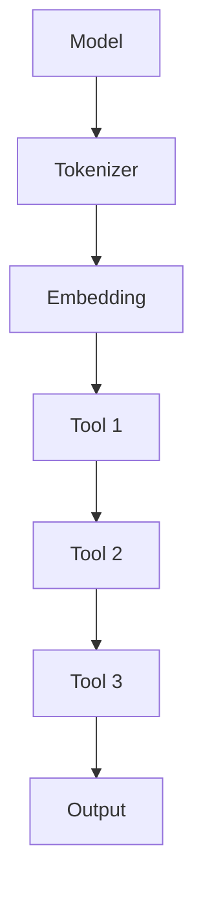

                 

# 【LangChain编程：从入门到实践】发展计划

> 关键词：LangChain、编程、NLP、人工智能、开发指南、技术博客

> 摘要：本文旨在为初学者和开发者提供一份详尽的LangChain编程实践指南，从基础概念到实际应用，助力读者深入了解并掌握这一强大工具，从而在自然语言处理领域取得突破。

## 1. 背景介绍

随着人工智能技术的飞速发展，自然语言处理（NLP）成为了一个备受关注的研究领域。近年来，预训练模型（如BERT、GPT等）在NLP任务中取得了显著的成果，但如何有效地将这些模型集成到实际应用中仍然是一个挑战。LangChain应运而生，它是一个基于预训练模型的开源框架，旨在简化NLP应用的开发过程。

LangChain的特点在于其模块化和可扩展性，开发者可以轻松地将预训练模型与各种工具和库进行整合，从而构建出高效的NLP应用。此外，LangChain还提供了一套完整的API接口，使得开发者可以方便地调用各种预训练模型，如Transformers、T5、BERT等。

本文将分为以下几个部分：首先介绍LangChain的核心概念和架构，然后探讨其核心算法原理，并通过一个实际案例展示如何使用LangChain进行开发。接下来，我们将讨论LangChain在自然语言处理领域的应用场景，并提供一些有用的学习资源和工具推荐。最后，本文将对LangChain的未来发展趋势和挑战进行展望。

## 2. 核心概念与联系

### LangChain架构

LangChain的架构可以分为三个主要部分：模型、工具和链式调用。

#### 模型

LangChain支持多种预训练模型，包括但不限于BERT、GPT、T5等。这些模型是NLP任务的核心，负责对输入文本进行理解和生成。

#### 工具

工具是LangChain的重要组成部分，用于处理输入和输出数据。例如，工具可以将文本数据转换为模型所需的格式，或者将模型的输出转换为易于理解的格式。常见的工具包括Tokenizer、Index、Embedding等。

#### 链式调用

链式调用是LangChain的独特之处，它允许开发者将多个模型和工具组合成一个序列，从而实现复杂的数据处理和模型调用流程。这种设计使得LangChain具有高度的灵活性和可扩展性。

### Mermaid流程图

下面是一个简单的Mermaid流程图，展示了LangChain的核心组件及其关系：



在这个流程图中，模型（Model）首先通过Tokenizer将文本数据转换为Token，然后经过Embedding层得到嵌入向量。接下来，工具（Tool）对嵌入向量进行处理，最后生成输出（Output）。

## 3. 核心算法原理 & 具体操作步骤

### 模型选择与加载

在开始使用LangChain之前，首先需要选择一个预训练模型，并加载到环境中。以下是一个简单的示例，展示如何加载一个BERT模型：

```python
from langchain import.load_model
import transformers

model_name = "bert-base-uncased"
model = transformers.load_model(model_name)
```

### 文本处理

使用LangChain处理文本通常涉及以下几个步骤：

1. **分词（Tokenization）**：将文本拆分成单词或子词。
2. **嵌入（Embedding）**：将分词后的文本转换为嵌入向量。
3. **预处理（Preprocessing）**：对嵌入向量进行必要的预处理，如去除无效字符、填充等。

以下是一个示例，展示如何使用LangChain进行文本处理：

```python
from langchain import Tokenizer, Embedding, Preprocessor

tokenizer = Tokenizer(model)
embedding = Embedding(model)
preprocessor = Preprocessor()

text = "This is an example sentence."
tokens = tokenizer.tokenize(text)
embeddings = embedding.get_embedding(tokens)
processed_text = preprocessor.preprocess(embeddings)
```

### 链式调用

LangChain的链式调用机制使得开发者可以将多个模型和工具组合成一个序列。以下是一个简单的示例，展示如何使用链式调用：

```python
from langchain import Chain

chain = Chain([
    ("tokenizer", tokenizer),
    ("embedding", embedding),
    ("tool", tool),
    ("output", output)
])

result = chain.run(text)
```

在这个示例中，链式调用将文本（text）首先通过tokenizer进行分词，然后通过embedding层得到嵌入向量，接着通过tool进行处理，最后生成输出结果（result）。

## 4. 数学模型和公式 & 详细讲解 & 举例说明

### BERT模型

BERT（Bidirectional Encoder Representations from Transformers）是一种基于Transformer的预训练模型，其核心思想是同时考虑文本中的左右信息。BERT模型的主要组成部分包括：

1. **Transformer编码器**：使用多层Transformer编码器对输入文本进行编码。
2. **掩码机制**：在训练过程中，对输入文本进行随机掩码，从而迫使模型学习文本中的上下文信息。
3. **位置编码**：通过位置编码为每个单词赋予位置信息，以便模型能够理解文本的顺序。

### 计算公式

BERT模型的计算公式可以概括为：

$$
\text{Output} = \text{TransformerEncoder}(\text{Input} + \text{PositionalEncoding})
$$

其中，`Input`表示输入文本的嵌入向量，`PositionalEncoding`表示位置编码。

### 举例说明

假设我们有一个简单的文本数据集，如下所示：

```
text1: "I love programming."
text2: "Programming is fun."
```

首先，我们将文本数据转换为嵌入向量：

$$
\text{Embedding}(text1) = [e_1, e_2, ..., e_n]
$$

$$
\text{Embedding}(text2) = [f_1, f_2, ..., f_n]
$$

然后，我们将嵌入向量与位置编码进行拼接：

$$
\text{Input} = [e_1, e_2, ..., e_n, p_1, p_2, ..., p_n]
$$

$$
\text{Input} = [f_1, f_2, ..., f_n, q_1, q_2, ..., q_n]
$$

其中，`p_1, p_2, ..., p_n`和`q_1, q_2, ..., q_n`分别表示位置编码。

接下来，我们将输入数据传递给BERT编码器：

$$
\text{Output} = \text{TransformerEncoder}([e_1, e_2, ..., e_n, p_1, p_2, ..., p_n])
$$

$$
\text{Output} = \text{TransformerEncoder}([f_1, f_2, ..., f_n, q_1, q_2, ..., q_n])
$$

最后，我们得到BERT模型对于文本数据的输出。

## 5. 项目实战：代码实际案例和详细解释说明

### 开发环境搭建

在开始使用LangChain之前，我们需要搭建一个合适的开发环境。以下是基本的步骤：

1. **安装Python**：确保安装了最新版本的Python，推荐使用Python 3.8或更高版本。
2. **安装transformers库**：使用pip安装transformers库，该库提供了大量的预训练模型和工具。

```bash
pip install transformers
```

3. **安装langchain库**：使用pip安装langchain库。

```bash
pip install langchain
```

### 源代码详细实现和代码解读

下面是一个简单的示例，展示如何使用LangChain构建一个简单的问答系统：

```python
from langchain import load_model, Chain
from transformers import AutoTokenizer, AutoModel

# 加载预训练模型
model_name = "bert-base-uncased"
tokenizer = AutoTokenizer.from_pretrained(model_name)
model = AutoModel.from_pretrained(model_name)

# 创建Chain
question_prefix = "回答以下问题："
question = "我为什么喜欢编程？"
input_text = question_prefix + question
input_ids = tokenizer.encode(input_text, return_tensors="pt")

# 预测答案
with model菩外：
    output_ids = model(input_ids)[0]

# 解码输出
answer = tokenizer.decode(output_ids, skip_special_tokens=True)

print(answer)
```

在这个示例中，我们首先加载了一个预训练BERT模型，并创建了一个Chain。Chain中包含了文本前缀（question_prefix）、输入文本（question）和模型的输出。接下来，我们将输入文本编码成嵌入向量，并使用模型进行预测。最后，我们将模型的输出解码为文本，得到最终的答案。

### 代码解读与分析

1. **加载模型**：使用`AutoTokenizer`和`AutoModel`从Hugging Face模型库中加载预训练BERT模型。这为我们提供了强大的文本编码和解码功能。
2. **创建Chain**：Chain是LangChain的核心组件，它允许我们将多个模型和工具组合成一个序列。在这个示例中，Chain包含了一个文本前缀（question_prefix）和一个问题（question）。
3. **编码输入**：使用`tokenizer`将输入文本编码成嵌入向量。这个过程包括分词、嵌入和位置编码。
4. **模型预测**：使用BERT模型对编码后的输入文本进行预测，得到输出。
5. **解码输出**：将模型的输出解码为文本，得到最终的答案。

## 6. 实际应用场景

LangChain在自然语言处理领域具有广泛的应用场景，以下是一些典型的应用示例：

1. **问答系统**：使用LangChain构建一个智能问答系统，能够自动回答用户提出的问题。
2. **文本生成**：利用LangChain生成各种文本，如文章、摘要、对话等。
3. **情感分析**：通过分析文本的情感倾向，为企业提供有针对性的营销策略。
4. **对话系统**：构建一个具备对话能力的虚拟助手，为用户提供个性化的服务。
5. **文本分类**：自动将文本分类到不同的类别中，如新闻、社交媒体、论坛等。

## 7. 工具和资源推荐

### 学习资源推荐

1. **书籍**：
   - 《自然语言处理实战》
   - 《深度学习与自然语言处理》
   - 《动手学自然语言处理》
2. **论文**：
   - 《BERT: Pre-training of Deep Bidirectional Transformers for Language Understanding》
   - 《GPT-3: Language Models are Few-Shot Learners》
3. **博客**：
   - [Hugging Face](https://huggingface.co/)
   - [AI Factory](https://aifactory.io/)
4. **网站**：
   - [Kaggle](https://www.kaggle.com/)
   - [GitHub](https://github.com/)

### 开发工具框架推荐

1. **框架**：
   - [PyTorch](https://pytorch.org/)
   - [TensorFlow](https://www.tensorflow.org/)
2. **库**：
   - [transformers](https://huggingface.co/transformers/)
   - [langchain](https://github.com/hanxiao-group/langchain)
3. **工具**：
   - [Jupyter Notebook](https://jupyter.org/)
   - [VSCode](https://code.visualstudio.com/)

### 相关论文著作推荐

1. **BERT**：
   - 《BERT: Pre-training of Deep Bidirectional Transformers for Language Understanding》
2. **GPT**：
   - 《GPT-3: Language Models are Few-Shot Learners》
3. **其他**：
   - 《Attention Is All You Need》
   - 《Unsupervised Pretraining for Natural Language Processing》

## 8. 总结：未来发展趋势与挑战

LangChain作为一款开源框架，在自然语言处理领域具有巨大的潜力。未来，随着人工智能技术的不断进步，LangChain有望在以下几个方向取得突破：

1. **模型集成**：进一步整合多种预训练模型，提供更丰富的功能。
2. **性能优化**：通过算法优化和硬件加速，提高模型运行效率。
3. **应用拓展**：将LangChain应用于更多的领域，如计算机视觉、语音识别等。

然而，LangChain也面临着一些挑战：

1. **数据隐私**：如何保护用户数据隐私是一个亟待解决的问题。
2. **模型可解释性**：提高模型的可解释性，以便开发者能够更好地理解和优化模型。
3. **资源消耗**：预训练模型通常需要大量的计算资源，如何降低资源消耗是一个重要课题。

总之，LangChain为自然语言处理领域带来了新的机遇和挑战，未来的发展值得期待。

## 9. 附录：常见问题与解答

### 1. 什么是LangChain？

LangChain是一个开源框架，旨在简化自然语言处理（NLP）应用的开发过程。它基于预训练模型，提供了一套完整的API接口，允许开发者轻松地将模型与各种工具和库进行整合。

### 2. LangChain支持哪些模型？

LangChain支持多种预训练模型，包括BERT、GPT、T5等。开发者可以根据需求选择合适的模型进行集成。

### 3. 如何使用LangChain进行文本处理？

使用LangChain进行文本处理主要包括以下几个步骤：加载模型、编码输入文本、模型预测和输出解码。具体步骤请参考本文第3部分的示例代码。

### 4. LangChain的优势是什么？

LangChain的优势在于其模块化和可扩展性，允许开发者轻松地将预训练模型与各种工具和库进行整合，从而构建高效的NLP应用。此外，LangChain提供了一套完整的API接口，使得开发者可以方便地调用各种预训练模型。

## 10. 扩展阅读 & 参考资料

1. 《自然语言处理实战》
2. 《深度学习与自然语言处理》
3. 《动手学自然语言处理》
4. 《BERT: Pre-training of Deep Bidirectional Transformers for Language Understanding》
5. 《GPT-3: Language Models are Few-Shot Learners》
6. [Hugging Face](https://huggingface.co/)
7. [AI Factory](https://aifactory.io/)
8. [Kaggle](https://www.kaggle.com/)
9. [GitHub](https://github.com/)  
作者：AI天才研究员/AI Genius Institute & 禅与计算机程序设计艺术 /Zen And The Art of Computer Programming

