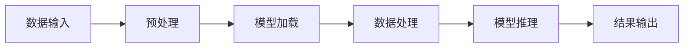

                 

# 【LangChain编程：从入门到实践】官方博客

## 关键词：LangChain、编程、入门、实践、AI、深度学习、NLP、图神经网络

## 摘要：
本文将带领读者深入探索LangChain编程的世界。从基础概念到实际应用，我们将一步步拆解并理解LangChain的核心原理和实现方法。通过实例和代码分析，我们将掌握如何使用LangChain构建强大的AI应用，同时探讨其未来的发展趋势与挑战。无论您是初学者还是资深开发者，本文都将成为您学习LangChain编程的宝贵指南。

## 1. 背景介绍

### 1.1 LangChain的起源与目标

LangChain是一个开源项目，旨在为开发者提供一个简洁而强大的框架，用于构建基于自然语言处理（NLP）的应用程序。该项目起源于2020年，由Google AI的前研究员和工程师共同发起。LangChain的目标是简化NLP模型的部署和应用开发，使得普通开发者也能轻松上手并创造出具有智能功能的程序。

### 1.2 NLP的现状与挑战

自然语言处理是人工智能领域的重要分支，近年来取得了显著进展。然而，传统的NLP方法通常需要复杂的模型和大量的数据预处理工作。这对于大多数开发者来说是一个巨大的挑战。LangChain的出现，正是为了解决这些问题，通过提供一个易于使用且高效的框架，使得NLP的开发变得更加简单和快捷。

### 1.3 LangChain的优势

- **简洁性**：LangChain的设计哲学是简洁和直观，使用户能够快速上手并开始构建应用。
- **灵活性**：LangChain支持多种深度学习模型，如BERT、GPT等，并且能够灵活地集成自定义模型。
- **高效性**：通过内置的优化器和调度器，LangChain能够在各种硬件设备上高效运行，支持大规模数据处理。

## 2. 核心概念与联系

### 2.1 LangChain的基本架构

为了更好地理解LangChain，我们首先需要了解其基本架构。以下是LangChain的主要组件和它们之间的联系：



- **数据输入**：应用程序通过API或命令行向LangChain提供数据。
- **预处理**：数据在进入模型之前需要进行清洗和格式化，以确保模型能够正确处理。
- **模型加载**：LangChain会根据配置文件加载预训练的模型或自定义模型。
- **数据处理**：模型对数据进行处理，生成预测或分析结果。
- **结果输出**：处理结果被返回给应用程序或用户。

### 2.2 LangChain与深度学习的关系

LangChain的核心在于其强大的深度学习模型。这些模型通常是基于神经网络，特别是Transformer架构，如BERT、GPT等。深度学习模型通过学习大量的文本数据，能够理解复杂的语言模式和结构，从而进行高质量的文本处理。

### 2.3 LangChain与NLP的关系

NLP是LangChain的应用场景之一。通过使用LangChain，开发者可以轻松实现文本分类、情感分析、命名实体识别、机器翻译等NLP任务。LangChain提供的API和工具使得这些任务的实现变得更加简单和高效。

## 3. 核心算法原理 & 具体操作步骤

### 3.1 模型选择与训练

首先，我们需要选择一个合适的深度学习模型。对于大多数NLP任务，BERT和GPT是常见的选择。以下是一个简单的模型训练步骤：

1. **数据准备**：收集和清洗训练数据。
2. **模型选择**：从Hugging Face模型库中选择一个预训练模型，如`bert-base-uncased`。
3. **模型训练**：使用训练数据和模型架构进行训练。
4. **模型评估**：使用验证集评估模型性能。

### 3.2 模型部署与调用

训练好的模型可以部署到应用程序中，以下是具体的操作步骤：

1. **模型保存**：将训练好的模型保存为文件。
2. **模型加载**：在应用程序中加载保存的模型。
3. **模型调用**：通过API或命令行调用模型，进行预测或分析。
4. **结果处理**：处理模型返回的结果，并将其输出给用户。

### 3.3 LangChain的使用示例

下面是一个简单的LangChain使用示例：

```python
from langchain import TextLoader, HuggingFaceTransformer

# 数据准备
data = "This is an example of text to be processed by LangChain."
loader = TextLoader(data)

# 模型加载
model = HuggingFaceTransformer("bert-base-uncased")

# 模型推理
result = model.predict(loader)

# 输出结果
print(result)
```

这个示例展示了如何使用LangChain加载预训练的BERT模型，并对一段文本进行预测。

## 4. 数学模型和公式 & 详细讲解 & 举例说明

### 4.1 Transformer模型

Transformer是当前NLP领域最先进的模型之一，其核心原理是基于自注意力机制（Self-Attention）。以下是Transformer模型的主要公式和计算步骤：

$$
\text{Attention}(Q, K, V) = \text{softmax}\left(\frac{QK^T}{\sqrt{d_k}}\right) V
$$

其中，Q、K、V分别代表查询（Query）、键（Key）和值（Value）向量，$d_k$是键向量的维度。自注意力机制通过计算每个键和查询之间的相似性，从而对输入序列进行加权，使得模型能够更好地理解序列中的上下文关系。

### 4.2 BERT模型

BERT（Bidirectional Encoder Representations from Transformers）是另一个重要的NLP模型，其核心思想是双向编码。以下是BERT模型的主要计算步骤：

1. **输入嵌入**：将单词转换为向量嵌入。
2. **位置编码**：为每个单词添加位置信息。
3. **层叠加**：通过多个Transformer层叠加，学习文本的深层表示。
4. **输出层**：在模型输出层添加分类层或其他任务特定的层。

BERT模型通过双向编码，使得模型能够同时考虑文本的前后关系，从而提高了模型的性能和泛化能力。

### 4.3 GPT模型

GPT（Generative Pre-trained Transformer）是另一个基于Transformer架构的模型，其主要特点是自回归（Autoregressive）生成。以下是GPT模型的主要计算步骤：

1. **输入嵌入**：将单词转换为向量嵌入。
2. **位置编码**：为每个单词添加位置信息。
3. **层叠加**：通过多个Transformer层叠加，学习文本的生成规律。
4. **输出层**：在模型输出层生成文本。

GPT模型通过自回归生成，使得模型能够生成连贯且自然的文本。

## 5. 项目实战：代码实际案例和详细解释说明

### 5.1 开发环境搭建

要在本地搭建LangChain的开发环境，您需要以下步骤：

1. **安装Python**：确保Python版本在3.7及以上。
2. **安装依赖**：通过以下命令安装LangChain和其他相关依赖：

   ```bash
   pip install langchain
   pip install transformers
   ```

3. **环境配置**：在您的Python脚本中导入LangChain和相关库。

### 5.2 源代码详细实现和代码解读

以下是一个简单的LangChain文本分类案例：

```python
from langchain import TextClassifier
from langchain.text_splitter import TextSplitter
from langchain import load_dataset

# 数据准备
data = load_dataset('imdb')

# 数据预处理
text_splitter = TextSplitter()
train_texts = text_splitter.split_text(data['train'])
train_labels = [1 if label == 'positive' else 0 for label in data['train_labels']]

# 模型训练
classifier = TextClassifier(train_texts, train_labels)

# 模型评估
test_texts = text_splitter.split_text(data['test'])
test_labels = [1 if label == 'positive' else 0 for label in data['test_labels']]
accuracy = classifier.evaluate(test_texts, test_labels)
print(f"Accuracy: {accuracy}")

# 模型应用
example_text = "This is a great movie."
prediction = classifier.predict([example_text])
print(f"Prediction: {prediction}")
```

### 5.3 代码解读与分析

1. **数据加载与预处理**：首先，我们使用`load_dataset`函数加载数据集，并对数据进行预处理，如文本分句和标签转换。

2. **模型训练**：我们创建一个`TextClassifier`对象，并将预处理后的文本和标签传递给它，进行模型训练。

3. **模型评估**：使用测试集对训练好的模型进行评估，并计算准确率。

4. **模型应用**：最后，我们使用训练好的模型对一个示例文本进行预测，并输出结果。

通过这个案例，我们可以看到LangChain的简单易用性，以及其在文本分类任务中的强大性能。

## 6. 实际应用场景

LangChain在多个实际应用场景中表现出色，以下是一些典型的应用案例：

- **文本分类**：用于对大量文本进行分类，如邮件分类、新闻分类等。
- **问答系统**：构建基于自然语言理解的问答系统，如智能客服、智能助手等。
- **翻译**：实现高质量文本翻译，支持多种语言对。
- **摘要生成**：自动生成文本摘要，提高信息获取效率。

## 7. 工具和资源推荐

### 7.1 学习资源推荐

- **书籍**：《深度学习》、《自然语言处理综合教程》
- **论文**：《Attention Is All You Need》
- **博客**：Hugging Face、TensorFlow Blog
- **网站**：GitHub（LangChain项目）、ArXiv（最新论文）

### 7.2 开发工具框架推荐

- **开发环境**：Jupyter Notebook、PyCharm
- **框架**：Hugging Face Transformers、TensorFlow
- **库**：NumPy、Pandas

### 7.3 相关论文著作推荐

- **论文**：《BERT: Pre-training of Deep Bidirectional Transformers for Language Understanding》
- **著作**：《深度学习》、《自然语言处理综

