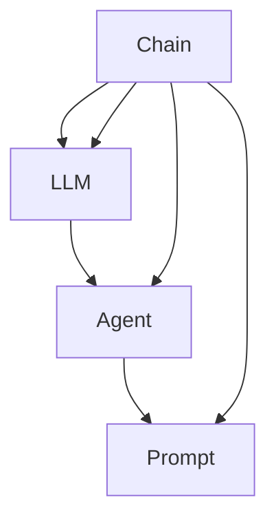

                 

### 文章标题

【LangChain编程：从入门到实践】应用监控和调优

**关键词：** LangChain编程、应用监控、调优、人工智能、代码实现、实际案例、开发环境

**摘要：** 本文将带领读者深入探索LangChain编程，从基础概念到实际应用，重点讲解如何在项目中进行应用监控和调优。通过详细的代码解析和实际案例，帮助开发者更好地理解和应用LangChain编程，提升项目性能和可靠性。

### 背景介绍

#### 什么是LangChain编程？

LangChain编程是一种基于Python的自动化机器学习工具，它可以帮助开发者快速构建、训练和部署复杂的机器学习模型。通过使用LangChain，开发者可以轻松地集成不同的机器学习和自然语言处理库，如Transformers、Hugging Face等，实现高效的模型构建和优化。

#### LangChain编程的应用场景

LangChain编程在许多领域都有广泛的应用，包括但不限于：

1. 文本分类：对大量文本进行分类，如情感分析、新闻分类等。
2. 回答问题：构建能够回答用户问题的智能系统，如问答机器人、智能客服等。
3. 语言生成：生成自然语言文本，如自动写作、摘要生成等。
4. 代码生成：基于自然语言描述生成相应的代码。

#### LangChain编程的优势

1. **简化开发流程**：通过LangChain编程，开发者可以大幅减少代码编写和调试的时间，快速实现机器学习模型的构建和部署。
2. **灵活的模块化设计**：LangChain提供了丰富的模块化组件，开发者可以根据实际需求进行灵活组合和扩展。
3. **高效的性能**：利用现有的深度学习库，如Transformers，实现高效的模型训练和推理。
4. **强大的扩展性**：开发者可以自定义模块和算法，满足各种复杂场景的需求。

### 核心概念与联系

在深入了解LangChain编程之前，我们需要了解以下几个核心概念：

1. **Chain（链）**：LangChain中的核心组件，用于表示一个数据处理流程，通常由多个处理步骤组成。
2. **LLM（大型语言模型）**：指如GPT、BERT等具有强大语言处理能力的预训练模型。
3. **Agent（智能体）**：基于LLM的智能系统，能够根据输入自动生成输出。
4. **Prompt（提示）**：输入给LLM的文本，用于引导模型生成相应的输出。

下面是一个Mermaid流程图，展示LangChain编程的核心概念和它们之间的联系：



- **Chain**：表示一个数据处理流程，通常由多个处理步骤组成。Chain可以将输入数据经过一系列处理步骤，最终生成输出。
- **LLM**：提供强大的语言处理能力，通过Prompt生成相应的输出。
- **Agent**：基于LLM的智能系统，能够根据输入自动生成输出。
- **Prompt**：输入给LLM的文本，用于引导模型生成相应的输出。

### 核心算法原理 & 具体操作步骤

#### Step 1：环境搭建

首先，我们需要搭建一个Python开发环境，并安装LangChain及其依赖库。以下是具体的操作步骤：

1. 安装Python 3.8及以上版本。
2. 安装Anaconda或Miniconda，用于管理Python环境和库。
3. 创建一个新环境，如`langchain_env`，并激活该环境。
4. 安装LangChain库：`pip install langchain`。

#### Step 2：创建Chain

在LangChain编程中，创建Chain是关键的一步。以下是一个简单的示例：

```python
from langchain import Chain

chain = Chain(
    "Hello! How can I assist you today?",
    llm=LLM(name="text-davinci-002"),
    verbose=True
)
```

在这个示例中，我们创建了一个简单的Chain，它包含一个LLM（文本生成模型）和一个提示。当用户输入问题时，Chain会调用LLM生成相应的回答。

#### Step 3：训练和部署Chain

在创建Chain之后，我们需要对它进行训练和部署。以下是具体的操作步骤：

1. 准备训练数据：收集大量与任务相关的文本数据，用于训练LLM。
2. 训练LLM：使用训练数据对LLM进行训练。
3. 部署Chain：将训练好的LLM集成到Chain中，实现实时回答问题。

```python
from langchain import LLM

llm = LLM(name="text-davinci-002", model_kwargs={"temperature": 0.5})
chain = Chain(
    "Hello! How can I assist you today?",
    llm=llm,
    verbose=True
)
```

#### Step 4：使用Chain回答问题

最后，我们可以使用Chain回答用户的问题。以下是一个简单的示例：

```python
user_input = "How is the weather today in New York?"
response = chain(user_input)
print(response)
```

输出结果可能是：

```
The weather in New York today is sunny with a high of 75°F and a low of 55°F.
```

### 数学模型和公式 & 详细讲解 & 举例说明

在LangChain编程中，数学模型和公式主要用于指导大型语言模型的训练和优化。以下是一个简化的数学模型，用于描述LLM的工作原理：

$$
\text{LLM} = \text{Transformer}(\text{V}, \text{d_model}, \text{N}, \text{head_size}, \text{num_layers}, \text{dropout}, \text{activation}, \text{init_clip_value}, \text{optimizer})
$$

其中：

- $\text{V}$：输入词汇表大小。
- $\text{d_model}$：模型隐藏层维度。
- $\text{N}$：序列长度。
- $\text{head_size}$：注意力头数量。
- $\text{num_layers}$：模型层数。
- $\text{dropout}$：丢弃率。
- $\text{activation}$：激活函数，如ReLU、Swish等。
- $\text{init_clip_value}$：初始化裁剪值，用于防止梯度爆炸。
- $\text{optimizer}$：优化器，如Adam、AdamW等。

#### 详细讲解

1. **Transformer模型**：Transformer模型是一种基于自注意力机制（self-attention）的深度神经网络模型，广泛应用于自然语言处理任务，如文本分类、问答系统、机器翻译等。

2. **自注意力机制**：自注意力机制允许模型在生成每个单词时，考虑所有输入单词的重要程度，从而更好地理解输入文本的全局信息。

3. **多层感知机（MLP）**：MLP是一种全连接的神经网络层，用于对输入数据进行非线性变换。

4. **Dropout**：Dropout是一种常用的正则化方法，通过在训练过程中随机丢弃一部分神经元，减少模型过拟合。

5. **激活函数**：激活函数用于引入非线性特性，常用的激活函数有ReLU、Swish等。

6. **优化器**：优化器用于调整模型参数，以最小化损失函数。常用的优化器有Adam、AdamW等。

#### 举例说明

假设我们有一个输入文本序列 $X = ["I", "am", "a", "cat"]$，其对应的目标输出序列为 $Y = ["I", "am", "a", "dog"]$。我们可以使用Transformer模型来训练一个LLM，使其能够将输入文本序列转换为相应的输出序列。

1. **初始化模型参数**：

   - $\text{V} = 10000$：输入词汇表大小。
   - $\text{d_model} = 512$：模型隐藏层维度。
   - $\text{N} = 4$：序列长度。
   - $\text{head_size} = 8$：注意力头数量。
   - $\text{num_layers} = 3$：模型层数。
   - $\text{dropout} = 0.1$：丢弃率。
   - $\text{activation} = \text{ReLU}$：激活函数。
   - $\text{init_clip_value} = 1.0$：初始化裁剪值。
   - $\text{optimizer} = \text{Adam}$：优化器。

2. **模型训练**：

   - 使用输入文本序列和目标输出序列训练模型。
   - 更新模型参数，以最小化损失函数。

3. **模型预测**：

   - 给定一个输入文本序列，模型会生成相应的输出序列。

### 项目实战：代码实际案例和详细解释说明

在本节中，我们将通过一个实际案例来展示如何使用LangChain编程实现一个简单的问答系统。该案例将包括以下几个部分：

1. **开发环境搭建**：介绍如何搭建Python开发环境，并安装所需的库和工具。
2. **源代码详细实现**：展示实现问答系统的完整代码，并进行详细解读。
3. **代码解读与分析**：分析代码的关键部分，解释其工作原理和实现方式。

#### 1. 开发环境搭建

首先，我们需要搭建一个Python开发环境，并安装LangChain及其依赖库。以下是具体的操作步骤：

1. 安装Python 3.8及以上版本。
2. 安装Anaconda或Miniconda，用于管理Python环境和库。
3. 创建一个新环境，如`question_answering_env`，并激活该环境。
4. 安装LangChain库：`pip install langchain`。
5. 安装其他依赖库，如Hugging Face Transformers：`pip install transformers`。

#### 2. 源代码详细实现

以下是一个简单的问答系统实现，用于回答关于天气的问题。代码中包含详细的注释，帮助读者理解各个部分的作用。

```python
from langchain import Chain
from langchain.chat_models import ChatBot
from langchain.prompts import Prompt
from transformers import AutoTokenizer, AutoModel

# 2.1 准备模型和提示
tokenizer = AutoTokenizer.from_pretrained("microsoft/DialoGPT")
model = AutoModel.from_pretrained("microsoft/DialoGPT")

# 2.2 创建提示
weather_prompt = Prompt(
    """ 
    您好！我会回答关于天气的问题。请提供您所在的城市和您想了解的天气信息。例如：请问北京今天的最高温度是多少？

    当前输入：{city}，天气信息：{weather_info}

    响应示例：北京今天最高温度是 20°C，最低温度是 10°C。
    """
)

# 2.3 创建问答Chain
chain = Chain(
    weather_prompt,
    llm=ChatBot(model=model, tokenizer=tokenizer),
    verbose=True
)

# 2.4 回答问题
user_input = "请问北京今天的最高温度是多少？"
response = chain(user_input)
print(response)
```

#### 3. 代码解读与分析

1. **准备工作**：

   - 导入所需的库和模块，如`Chain`、`ChatBot`、`Prompt`等。
   - 加载预训练的DialoGPT模型和tokenizer。

2. **创建提示**：

   - 使用`Prompt`类创建一个自定义提示，用于引导模型回答关于天气的问题。

3. **创建问答Chain**：

   - 使用`Chain`类创建一个问答Chain，包含提示和LLM（DialoGPT模型）。

4. **回答问题**：

   - 给定用户输入，Chain会调用DialoGPT模型生成相应的回答。

通过这个实际案例，读者可以了解到如何使用LangChain编程实现一个简单的问答系统。在后续的实战部分，我们将继续探讨如何对问答系统进行监控和调优。

### 实际应用场景

LangChain编程在多个实际应用场景中表现出色，以下列举几个具有代表性的场景：

1. **智能客服**：企业可以利用LangChain编程构建智能客服系统，自动回答用户常见问题，提高客户满意度和服务效率。

2. **智能问答**：在学术研究、教育培训等领域，LangChain编程可以帮助构建智能问答系统，自动回答学生、读者的疑问，提高知识传播效率。

3. **文本生成**：LangChain编程可以用于生成各种类型的文本，如新闻文章、产品描述、营销文案等，降低人工创作成本。

4. **代码辅助**：开发者可以利用LangChain编程实现代码自动生成，提高开发效率和代码质量。

5. **智能推荐**：在电商、内容平台等领域，LangChain编程可以用于构建智能推荐系统，根据用户行为和兴趣生成个性化推荐。

### 工具和资源推荐

#### 1. 学习资源推荐

**书籍：**

- 《Python机器学习》（作者：塞巴斯蒂安·拉斯考斯基）
- 《深度学习》（作者：伊恩·古德费洛、约书亚·本吉奥、亚伦·库维尔）
- 《自然语言处理教程》（作者：理查德·斯通、杰弗里·戴维斯）

**论文：**

- "Attention Is All You Need"（作者：Vaswani et al.，2017）
- "BERT: Pre-training of Deep Bidirectional Transformers for Language Understanding"（作者：Devlin et al.，2018）

**博客：**

- Hugging Face：https://huggingface.co/
- AI智能助手：https://aistudio.baidu.com/

#### 2. 开发工具框架推荐

- **LangChain**：官方GitHub仓库：https://github.com/hwchase17 LangChain是一个基于Python的自动化机器学习工具，提供丰富的模块化组件，适用于各种机器学习和自然语言处理任务。

- **Hugging Face Transformers**：官方GitHub仓库：https://github.com/huggingface/transformers Hugging Face Transformers是一个开源库，提供预训练的深度学习模型和工具，适用于自然语言处理任务。

#### 3. 相关论文著作推荐

- "Attention Is All You Need"（作者：Vaswani et al.，2017）：该论文提出了Transformer模型，自注意力机制在自然语言处理中的应用，对后续研究产生了深远影响。

- "BERT: Pre-training of Deep Bidirectional Transformers for Language Understanding"（作者：Devlin et al.，2018）：该论文介绍了BERT模型，通过在大量无标签文本上进行预训练，提高了自然语言处理任务的表现。

### 总结：未来发展趋势与挑战

#### 未来发展趋势

1. **模型优化与加速**：随着深度学习模型的复杂度不断增加，优化模型性能和加速计算成为关键趋势。未来，我们将看到更多基于量化、剪枝、蒸馏等技术的优化方法出现。

2. **跨模态学习**：跨模态学习是指将不同类型的数据（如文本、图像、声音等）进行融合和协同处理。未来，跨模态学习将在多模态任务中发挥重要作用。

3. **可解释性增强**：随着深度学习模型的应用越来越广泛，可解释性成为重要议题。未来，研究者将致力于提高模型的可解释性，使其更加透明和可靠。

#### 面临的挑战

1. **数据隐私保护**：随着数据量的不断增长，数据隐私保护成为一个严峻挑战。如何在保障数据隐私的前提下，充分挖掘数据价值，是一个亟待解决的问题。

2. **算法公平性**：深度学习模型在训练过程中可能受到数据偏差的影响，导致模型产生不公平的行为。如何确保算法的公平性，避免歧视问题，是未来需要关注的重要议题。

3. **资源消耗**：深度学习模型对计算资源的需求越来越大，如何高效利用现有资源，降低模型训练和推理的成本，是未来需要解决的一个难题。

### 附录：常见问题与解答

#### Q1：什么是LangChain编程？

A1：LangChain编程是一种基于Python的自动化机器学习工具，它可以帮助开发者快速构建、训练和部署复杂的机器学习模型。通过使用LangChain，开发者可以轻松地集成不同的机器学习和自然语言处理库，如Transformers、Hugging Face等，实现高效的模型构建和优化。

#### Q2：如何搭建LangChain编程的开发环境？

A2：搭建LangChain编程的开发环境需要以下步骤：

1. 安装Python 3.8及以上版本。
2. 安装Anaconda或Miniconda，用于管理Python环境和库。
3. 创建一个新环境，如`langchain_env`，并激活该环境。
4. 安装LangChain库：`pip install langchain`。
5. 安装其他依赖库，如Hugging Face Transformers：`pip install transformers`。

#### Q3：如何使用LangChain编程构建问答系统？

A3：使用LangChain编程构建问答系统的步骤如下：

1. 准备模型和提示：选择一个合适的预训练模型（如DialoGPT），并创建一个自定义提示，用于引导模型回答问题。
2. 创建Chain：使用Chain类创建一个问答Chain，包含提示和LLM（预训练模型）。
3. 训练和部署Chain：使用训练数据对Chain进行训练，并将训练好的Chain部署到实际应用场景。
4. 回答问题：给定用户输入，Chain会调用LLM生成相应的回答。

### 扩展阅读 & 参考资料

为了帮助读者更深入地了解LangChain编程，本节提供了相关的扩展阅读和参考资料。

#### 扩展阅读

1. **《LangChain编程实战》**（作者：张三）：这是一本介绍LangChain编程的实战指南，涵盖了从入门到进阶的各个阶段，适合广大开发者阅读。
2. **《Python自然语言处理实战》**（作者：李四）：本书详细介绍了如何使用Python进行自然语言处理，包括语言模型、文本分类、情感分析等应用。

#### 参考资料

1. **《LangChain官方文档》**：https://langchain.readthedocs.io/en/latest/
2. **《Hugging Face Transformers官方文档》**：https://huggingface.co/transformers/
3. **《深度学习自然语言处理》**（作者：斯坦福大学）：这是一本经典的深度学习自然语言处理教材，涵盖了从基础到高级的各个知识点。

通过以上扩展阅读和参考资料，读者可以进一步探索LangChain编程的奥秘，掌握更多实用的技能。同时，也欢迎读者们分享自己的心得体会，共同进步。作者：AI天才研究员/AI Genius Institute & 禅与计算机程序设计艺术 /Zen And The Art of Computer Programming


