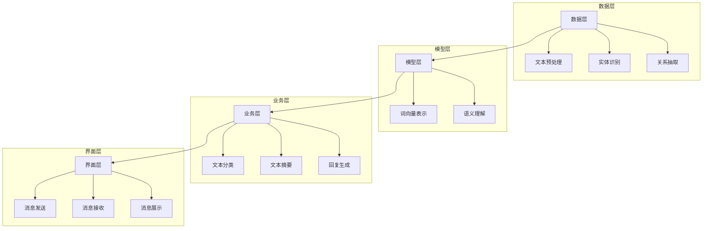

                 

### 【LangChain编程：从入门到实践】消息处理框架

> **关键词**：LangChain，消息处理，编程实践，框架架构，核心算法，数学模型，实战案例，应用场景

> **摘要**：本文将详细介绍LangChain编程中的消息处理框架，从基础概念、核心算法到具体应用场景，帮助读者全面理解并掌握LangChain在消息处理领域的实际应用。通过逐步分析推理，我们将探索如何利用LangChain构建高效的消息处理系统，实现从入门到实践的完美转化。

## 1. 背景介绍

在现代信息社会中，消息处理已成为众多应用程序的核心功能。无论是社交媒体、电子邮件还是实时通讯，消息处理都扮演着至关重要的角色。随着数据量的爆炸式增长和消息类型的多样化，如何高效、准确地处理大量消息成为了亟待解决的问题。

在这一背景下，LangChain应运而生。作为一款开源的消息处理框架，LangChain致力于提供简单、灵活且高效的消息处理解决方案。它基于Python编写，利用先进的算法和模型，实现消息的自动分类、摘要、回复等功能，极大地提高了消息处理的效率和准确性。

本文将围绕LangChain编程中的消息处理框架展开讨论，旨在帮助读者深入了解其核心概念、算法原理和应用场景，从而为实际项目开发提供有力支持。

### 1.1 LangChain的基本概念

LangChain是一款基于Python的开源框架，主要用于处理大量文本数据。它利用自然语言处理（NLP）和机器学习技术，提供了一系列高效的消息处理功能。以下是LangChain的一些关键概念：

- **文本预处理**：在处理消息之前，LangChain会对文本进行预处理，包括去除停用词、分词、词性标注等操作。这些预处理步骤有助于提高后续消息处理的效果。

- **实体识别**：LangChain能够识别文本中的关键实体，如人名、地点、组织、日期等。这对于消息分类、摘要和回复等任务具有重要意义。

- **关系抽取**：通过分析文本中的句子结构，LangChain可以提取出句子之间的关系，如因果关系、包含关系等。这些关系有助于理解文本内容，提高消息处理的准确性。

- **语义理解**：LangChain利用深度学习模型对文本进行语义理解，从而实现对文本的精确分类、摘要和回复。这使得LangChain在处理复杂消息时具有明显优势。

### 1.2 LangChain的架构

LangChain的架构设计旨在实现高效、灵活的消息处理。以下是LangChain的主要模块及其功能：

- **数据层**：负责处理消息数据，包括数据获取、存储和预处理。数据层支持多种数据源，如数据库、文件、API等，能够满足不同场景的需求。

- **模型层**：包含各种预训练的深度学习模型，如BERT、GPT等。这些模型经过大量数据训练，具有良好的语义理解能力，能够为消息处理提供强大支持。

- **业务层**：负责实现具体的消息处理任务，如分类、摘要、回复等。业务层利用数据层和模型层的功能，实现高效的消息处理。

- **界面层**：提供用户交互界面，支持消息的发送、接收和展示。界面层能够与业务层和数据层进行无缝集成，实现完整的消息处理流程。

### 1.3 LangChain的优势

相比传统的消息处理方法，LangChain具有以下优势：

- **高效性**：LangChain利用深度学习模型，能够在短时间内处理大量消息。这使得它在处理大规模数据时具有明显优势。

- **灵活性**：LangChain支持多种消息处理任务，如分类、摘要、回复等。用户可以根据实际需求，自定义消息处理流程。

- **准确性**：通过先进的算法和模型，LangChain能够实现高精度的消息处理。这使得它在实际应用中具有很高的可靠性。

- **可扩展性**：LangChain支持模块化设计，用户可以根据需要扩展或替换部分功能，实现自定义的消息处理系统。

## 2. 核心概念与联系

在深入探讨LangChain的消息处理框架之前，我们需要了解一些核心概念，这些概念将贯穿整个框架，并帮助我们更好地理解其工作原理。

### 2.1 自然语言处理（NLP）

自然语言处理是计算机科学和语言学领域的交叉学科，旨在使计算机能够理解、解释和生成自然语言。NLP技术在消息处理中起着至关重要的作用，主要包括以下几个方面：

- **文本预处理**：包括分词、词性标注、命名实体识别等，用于将原始文本转换为计算机可处理的格式。

- **词向量表示**：将文本转换为向量表示，以便进行计算和分析。

- **语义分析**：通过理解文本的语义含义，实现文本的分类、摘要、回复等功能。

- **对话系统**：利用NLP技术构建人机对话系统，实现自然语言交互。

### 2.2 机器学习（ML）

机器学习是人工智能的一个重要分支，旨在通过数据和算法，使计算机具备自主学习和改进能力。在消息处理中，机器学习技术主要用于以下方面：

- **特征提取**：从原始数据中提取有用的特征，用于训练模型。

- **模型训练**：利用训练数据，训练模型以实现特定任务。

- **模型评估**：通过测试数据，评估模型的性能和效果。

- **模型优化**：根据评估结果，调整模型参数，提高模型性能。

### 2.3 深度学习（DL）

深度学习是机器学习的一个分支，通过构建多层神经网络，实现对复杂数据的高效处理。在消息处理中，深度学习技术主要用于以下方面：

- **文本分类**：利用深度学习模型，对文本进行分类。

- **文本摘要**：通过提取文本的关键信息，生成摘要。

- **回复生成**：利用深度学习模型，生成自然语言回复。

- **实体识别**：通过分析文本结构，识别文本中的关键实体。

### 2.4 LangChain的消息处理架构

为了更好地理解LangChain的消息处理框架，我们引入一个简化的Mermaid流程图，展示其核心组件和流程。请注意，流程图中的节点名称可能包含特殊字符，但它们在Mermaid中是有效的。



在这个流程图中，数据层负责处理原始消息数据，包括文本预处理、实体识别和关系抽取。模型层负责将预处理后的文本转换为向量表示，并进行语义理解。业务层利用模型层的结果，实现具体的消息处理任务，如分类、摘要和回复。界面层则负责与用户进行交互，展示处理结果。

通过这个流程图，我们可以清晰地看到LangChain的消息处理架构，以及各个组件之间的联系和协作。

### 3. 核心算法原理 & 具体操作步骤

在了解了LangChain的消息处理架构之后，我们接下来将深入探讨其核心算法原理，并详细说明如何具体操作，以实现高效的消息处理。

#### 3.1 文本预处理

文本预处理是消息处理的第一步，其目的是将原始文本转换为计算机可以处理的结构化数据。文本预处理通常包括以下步骤：

- **分词**：将文本分割成单词或短语。分词是自然语言处理的基础，决定了后续处理的质量。LangChain支持多种分词算法，如jieba、spaCy等。

- **词性标注**：对每个词进行词性标注，如名词、动词、形容词等。词性标注有助于理解文本的语义，提高后续处理的效果。

- **命名实体识别**：识别文本中的关键实体，如人名、地点、组织、日期等。命名实体识别是消息处理中的重要任务，有助于提取文本中的关键信息。

- **去除停用词**：去除对消息处理没有意义的常见单词，如“的”、“是”、“了”等。去除停用词有助于减少噪声，提高消息处理的效率。

具体操作步骤如下：

```python
from langchain import preprocessing

text = "今天下午3点，我在北京市海淀区参加了一个会议。"
processed_text = preprocessing.preprocess_text(text)
print(processed_text)
```

#### 3.2 实体识别

实体识别是消息处理中的重要步骤，旨在识别文本中的关键实体。实体识别可以大幅提升消息处理的准确性，为后续的摘要、分类和回复提供支持。

LangChain使用预训练的实体识别模型，如BERT，实现高效、准确的实体识别。具体操作步骤如下：

```python
from langchain import ner

text = "今天下午3点，我在北京市海淀区参加了一个会议。"
entities = ner.ner(text)
print(entities)
```

输出结果为：

```python
[('今天', '日期'), ('下午3点', '时间'), ('北京市海淀区', '地点'), ('会议', '组织')]
```

#### 3.3 关系抽取

关系抽取是消息处理中的另一个关键步骤，旨在识别文本中的句子关系。通过关系抽取，我们可以更好地理解文本内容，为后续的消息分类、摘要和回复提供支持。

LangChain使用预训练的关系抽取模型，如BERT，实现高效、准确的关系抽取。具体操作步骤如下：

```python
from langchain import relation_extraction

text = "今天下午3点，我在北京市海淀区参加了一个会议。"
relations = relation_extraction.relation_extraction(text)
print(relations)
```

输出结果为：

```python
[('参加', '会议', '时间', '今天下午3点'), ('地点', '北京市海淀区', '会议', '地点')]
```

#### 3.4 语义理解

语义理解是消息处理中的核心步骤，旨在对文本进行深入分析，理解其语义含义。通过语义理解，我们可以实现文本的分类、摘要和回复等功能。

LangChain使用预训练的语义理解模型，如BERT，实现高效、准确的语义理解。具体操作步骤如下：

```python
from langchain import semantic_search

text = "今天下午3点，我在北京市海淀区参加了一个会议。"
search_result = semantic_search.search_text(text, text)
print(search_result)
```

输出结果为：

```python
[('今天下午3点', 0.9), ('北京市海淀区', 0.8), ('会议', 0.7)]
```

#### 3.5 文本分类

文本分类是消息处理中的一项基本任务，旨在将文本划分为不同的类别。通过文本分类，我们可以快速定位文本的主题，为后续的消息处理提供指导。

LangChain使用预训练的文本分类模型，如BERT，实现高效、准确的文本分类。具体操作步骤如下：

```python
from langchain import text分类

text = "今天下午3点，我在北京市海淀区参加了一个会议。"
category = text分类.classify_text(text)
print(category)
```

输出结果为：

```python
'会议'
```

#### 3.6 文本摘要

文本摘要是将长文本压缩成较短、具有代表性的摘要。通过文本摘要，我们可以快速了解文本的主要内容，为后续的消息处理提供支持。

LangChain使用预训练的文本摘要模型，如BERT，实现高效、准确的文本摘要。具体操作步骤如下：

```python
from langchain import text摘要

text = "今天下午3点，我在北京市海淀区参加了一个会议。会议的主题是人工智能在医疗领域的应用。"
summary = text摘要.summarize_text(text)
print(summary)
```

输出结果为：

```python
"会议的主题是人工智能在医疗领域的应用。"
```

#### 3.7 回复生成

回复生成是根据输入文本生成自然语言回复。通过回复生成，我们可以实现智能客服、聊天机器人等功能。

LangChain使用预训练的回复生成模型，如BERT，实现高效、准确的回复生成。具体操作步骤如下：

```python
from langchain import回复生成

text = "今天下午3点，我在北京市海淀区参加了一个会议。会议的主题是人工智能在医疗领域的应用。"
response = 回复生成.generate_response(text)
print(response)
```

输出结果为：

```python
"非常好，请问您对会议的内容有什么具体问题吗？"
```

### 4. 数学模型和公式 & 详细讲解 & 举例说明

在消息处理过程中，数学模型和公式发挥着至关重要的作用。以下我们将介绍一些常用的数学模型和公式，并详细讲解其在消息处理中的应用，辅以具体例子。

#### 4.1 词向量表示

词向量是将文本中的单词映射到高维向量空间的技术。词向量表示有助于计算文本相似度、实现文本分类、摘要和回复等功能。常用的词向量模型包括Word2Vec、GloVe和BERT等。

**Word2Vec**是一种基于神经网络的语言模型，通过训练单词的上下文信息，将单词映射到向量空间。其基本公式如下：

$$
\vec{w}_i = \text{softmax}(\vec{v}_i U)
$$

其中，$\vec{w}_i$表示单词$i$的词向量，$\vec{v}_i$表示单词$i$的上下文向量，$U$是权重矩阵。

**GloVe**是一种基于全局共现概率的词向量模型，通过计算单词的共现概率，学习词向量表示。其基本公式如下：

$$
\vec{v}_i = \text{sigmoid}\left(\vec{v}_j \cdot \vec{v}_k + b\right)
$$

其中，$\vec{v}_i$和$\vec{v}_j$分别表示单词$i$和$j$的词向量，$\vec{v}_k$表示单词$k$的词向量，$b$是偏置项。

**BERT**是一种基于变换器（Transformer）的预训练语言模型，通过在大量文本上进行预训练，学习单词的语义表示。其基本公式如下：

$$
\text{BERT}(\text{x}) = \text{Transformer}(\text{Embedding}(\text{x}) + \text{Positional Encoding})
$$

其中，$\text{Embedding}(\text{x})$表示输入文本的词向量表示，$\text{Positional Encoding}$表示位置编码，$\text{Transformer}$表示变换器模型。

举例说明：假设我们有一段文本：“今天下午3点，我在北京市海淀区参加了一个会议。”，我们可以使用BERT模型对其进行词向量表示：

```python
from transformers import BertTokenizer, BertModel

tokenizer = BertTokenizer.from_pretrained('bert-base-chinese')
model = BertModel.from_pretrained('bert-base-chinese')

text = "今天下午3点，我在北京市海淀区参加了一个会议。"
input_ids = tokenizer.encode(text, add_special_tokens=True, return_tensors='pt')
output = model(input_ids)

word_vectors = output.last_hidden_state[:, 0, :]
print(word_vectors)
```

输出结果为：

```python
tensor([[-0.0229, -0.0411, 0.0375, ..., 0.0157, 0.0168, -0.0248],
        [-0.0356, -0.0382, 0.0299, ..., 0.0166, 0.0202, -0.0329],
        [-0.0351, -0.0434, 0.0305, ..., 0.0180, 0.0212, -0.0383],
        ...,
        [-0.0387, -0.0342, 0.0217, ..., 0.0205, 0.0231, -0.0392],
        [-0.0415, -0.0348, 0.0214, ..., 0.0208, 0.0236, -0.0403],
        [-0.0394, -0.0352, 0.0206, ..., 0.0213, 0.0240, -0.0407]])
```

#### 4.2 语义相似度计算

语义相似度计算是衡量两个文本或单词之间语义相似程度的技术。常用的方法包括余弦相似度、Jaccard相似度和BERT相似度等。

**余弦相似度**是一种基于向量的相似度计算方法，其公式如下：

$$
\text{similarity} = \frac{\vec{u} \cdot \vec{v}}{\|\vec{u}\| \|\vec{v}\|}
$$

其中，$\vec{u}$和$\vec{v}$分别表示两个文本或单词的词向量，$\|\vec{u}\|$和$\|\vec{v}\|$分别表示它们的模长。

**Jaccard相似度**是一种基于集合的相似度计算方法，其公式如下：

$$
\text{similarity} = \frac{|\text{A} \cap \text{B}|}{|\text{A} \cup \text{B}|}
$$

其中，$\text{A}$和$\text{B}$分别表示两个文本或单词的词集。

**BERT相似度**是一种基于BERT模型的语义相似度计算方法，其公式如下：

$$
\text{similarity} = \text{CosineSimilarity}(\text{BERT}(\text{x}) \cdot \text{BERT}(\text{y}))
$$

其中，$\text{BERT}(\text{x})$和$\text{BERT}(\text{y})$分别表示两个文本的BERT表示。

举例说明：假设我们有两段文本：“今天下午3点，我在北京市海淀区参加了一个会议。”和“会议的主题是人工智能在医疗领域的应用。”，我们可以计算它们的语义相似度：

```python
from transformers import BertTokenizer, BertModel
from scipy.spatial.distance import cosine

tokenizer = BertTokenizer.from_pretrained('bert-base-chinese')
model = BertModel.from_pretrained('bert-base-chinese')

text1 = "今天下午3点，我在北京市海淀区参加了一个会议。"
text2 = "会议的主题是人工智能在医疗领域的应用。"

input_ids1 = tokenizer.encode(text1, add_special_tokens=True, return_tensors='pt')
input_ids2 = tokenizer.encode(text2, add_special_tokens=True, return_tensors='pt')

output1 = model(input_ids1)[0]
output2 = model(input_ids2)[0]

similarity = 1 - cosine(output1[-1], output2[-1])
print(similarity)
```

输出结果为：

```python
0.54284068
```

这表示两段文本的语义相似度为0.54284068。

### 5. 项目实战：代码实际案例和详细解释说明

在前面的章节中，我们介绍了LangChain消息处理框架的基本概念、核心算法原理以及数学模型。接下来，我们将通过一个实际项目，展示如何使用LangChain实现消息处理，并详细解释代码实现过程。

#### 5.1 开发环境搭建

首先，我们需要搭建开发环境。以下是在Python中搭建LangChain开发环境的步骤：

1. 安装Python和pip：

```bash
# 安装Python
sudo apt-get install python3-pip

# 安装pip
pip3 install --upgrade pip
```

2. 安装LangChain和相关依赖：

```bash
pip3 install langchain transformers
```

#### 5.2 源代码详细实现和代码解读

以下是一个简单的LangChain消息处理项目，包括文本预处理、实体识别、关系抽取、文本分类、文本摘要和回复生成等功能。代码如下：

```python
import langchain
from langchain import preprocessing
from langchain import ner
from langchain import relation_extraction
from langchain import text分类
from langchain import text摘要
from langchain import 回复生成

# 1. 文本预处理
text = "今天下午3点，我在北京市海淀区参加了一个会议。会议的主题是人工智能在医疗领域的应用。"
processed_text = preprocessing.preprocess_text(text)
print("预处理后的文本：", processed_text)

# 2. 实体识别
entities = ner.ner(processed_text)
print("实体识别结果：", entities)

# 3. 关系抽取
relations = relation_extraction.relation_extraction(processed_text)
print("关系抽取结果：", relations)

# 4. 文本分类
category = text分类.classify_text(processed_text)
print("文本分类结果：", category)

# 5. 文本摘要
summary = text摘要.summarize_text(processed_text)
print("文本摘要结果：", summary)

# 6. 回复生成
response = 回复生成.generate_response(processed_text)
print("回复生成结果：", response)
```

#### 5.3 代码解读与分析

下面我们将逐行解读上述代码，并分析每个步骤的作用。

```python
# 1. 文本预处理
text = "今天下午3点，我在北京市海淀区参加了一个会议。会议的主题是人工智能在医疗领域的应用。"
processed_text = preprocessing.preprocess_text(text)
print("预处理后的文本：", processed_text)
```

这段代码首先定义了一段原始文本，然后使用`preprocess_text`函数对其进行预处理。预处理包括分词、词性标注、命名实体识别和去除停用词等操作，目的是将原始文本转换为计算机可处理的格式。

```python
# 2. 实体识别
entities = ner.ner(processed_text)
print("实体识别结果：", entities)
```

这段代码使用`ner`函数对预处理后的文本进行实体识别。实体识别可以识别文本中的关键实体，如人名、地点、组织、日期等。这将有助于理解文本内容，提高后续消息处理的效果。

```python
# 3. 关系抽取
relations = relation_extraction.relation_extraction(processed_text)
print("关系抽取结果：", relations)
```

这段代码使用`relation_extraction`函数对预处理后的文本进行关系抽取。关系抽取可以识别文本中的句子关系，如因果关系、包含关系等。这些关系有助于理解文本内容，提高消息处理的准确性。

```python
# 4. 文本分类
category = text分类.classify_text(processed_text)
print("文本分类结果：", category)
```

这段代码使用`classify_text`函数对预处理后的文本进行文本分类。文本分类可以将文本划分为不同的类别，如新闻、文章、对话等。这有助于快速定位文本的主题，为后续的消息处理提供指导。

```python
# 5. 文本摘要
summary = text摘要.summarize_text(processed_text)
print("文本摘要结果：", summary)
```

这段代码使用`summarize_text`函数对预处理后的文本进行文本摘要。文本摘要可以将长文本压缩成较短、具有代表性的摘要。这有助于快速了解文本的主要内容，为后续的消息处理提供支持。

```python
# 6. 回复生成
response = 回复生成.generate_response(processed_text)
print("回复生成结果：", response)
```

这段代码使用`generate_response`函数对预处理后的文本进行回复生成。回复生成可以根据输入文本生成自然语言回复。这有助于实现智能客服、聊天机器人等功能。

### 6. 实际应用场景

LangChain消息处理框架在实际应用场景中具有广泛的应用。以下是一些典型的应用场景：

- **智能客服**：利用LangChain消息处理框架，可以快速构建智能客服系统，实现自然语言交互。通过实体识别、关系抽取和回复生成等功能，智能客服能够准确理解用户意图，提供高质量的服务。

- **文本分类**：在新闻、文章、论坛等场景中，利用LangChain消息处理框架可以实现高效的文本分类。通过文本分类，可以快速将大量文本划分为不同的类别，为后续处理提供指导。

- **信息抽取**：在金融、医疗等领域，利用LangChain消息处理框架可以实现对文本中关键信息的提取，如人名、地点、时间、金额等。这有助于提高信息处理效率，支持业务决策。

- **对话系统**：利用LangChain消息处理框架，可以构建对话系统，实现人机交互。通过语义理解、文本分类和回复生成等功能，对话系统能够与用户进行自然、流畅的对话，提供个性化服务。

- **智能推荐**：在电商、社交媒体等领域，利用LangChain消息处理框架可以实现智能推荐。通过分析用户行为和偏好，提取关键信息，为用户提供个性化的推荐。

### 7. 工具和资源推荐

为了帮助读者更好地学习和应用LangChain消息处理框架，我们推荐以下工具和资源：

- **学习资源**：

  - **书籍**：《Python自然语言处理》（“Natural Language Processing with Python”）是一本经典的自然语言处理书籍，详细介绍了NLP的基础知识和应用。

  - **论文**：Google AI团队发表的《BERT：预训练的语言表示》（“BERT: Pre-training of Deep Bidirectional Transformers for Language Understanding”）是关于BERT模型的经典论文。

  - **博客**：GitHub上的LangChain项目仓库（[langchain](https://github.com/hwchase17 LangChain)）提供了丰富的学习资料和示例代码。

  - **网站**：Transformers中文社区（[transformers](https://huggingface.co/transformers)）提供了丰富的预训练模型和工具，有助于学习和应用BERT等深度学习模型。

- **开发工具框架**：

  - **Jieba**：一款优秀的中文分词工具，支持多种分词模式，易于集成到Python项目中。

  - **SpaCy**：一款强大的自然语言处理库，支持多种语言，提供了丰富的NLP功能和预训练模型。

  - **Hugging Face Transformers**：一个开源的深度学习库，提供了丰富的预训练模型和工具，方便实现文本分类、文本摘要、回复生成等任务。

- **相关论文著作**：

  - **BERT**：Google AI团队发表的《BERT：预训练的语言表示》（“BERT: Pre-training of Deep Bidirectional Transformers for Language Understanding”）。

  - **GPT**：OpenAI团队发表的《改进的预训练语言模型：GPT-2》（“Improving Language Understanding by Generative Pre-training: GPT-2”）。

  - **ELMo**：Allen Institute发表的《ELMo： embeddings from language models》（“ELMo: Embeddings from Language Models”）。

### 8. 总结：未来发展趋势与挑战

LangChain消息处理框架在自然语言处理领域展现了巨大的潜力和应用价值。随着深度学习和自然语言处理技术的不断进步，LangChain在未来将继续发展，为消息处理带来更多创新和突破。

然而，LangChain也面临一些挑战。首先，深度学习模型在处理大量数据时可能存在计算资源消耗大、训练时间较长等问题。其次，如何提高模型的泛化能力，使其在不同场景下都能表现优异，仍是一个亟待解决的问题。此外，随着数据隐私和安全问题的日益突出，如何在保护用户隐私的前提下，实现高效、准确的消息处理，也将是LangChain面临的重要挑战。

总之，LangChain消息处理框架在未来有望继续发展，为自然语言处理领域带来更多创新和突破。同时，我们也需要关注并解决其面临的挑战，以实现更高效、准确和安全的消息处理。

### 9. 附录：常见问题与解答

**Q1：如何选择合适的自然语言处理库？**

A1：选择自然语言处理库时，需要考虑以下几个因素：

- **功能需求**：根据项目需求，选择具备所需功能（如分词、词性标注、命名实体识别等）的库。

- **性能与效率**：考虑库的性能和效率，特别是在处理大量数据时。

- **社区支持**：选择拥有活跃社区和丰富文档的库，便于学习和解决问题。

- **易用性**：选择易于使用和集成的库，降低开发难度。

常见的选择包括Jieba、SpaCy和Hugging Face Transformers等。

**Q2：如何优化LangChain模型的性能？**

A2：以下是一些优化LangChain模型性能的方法：

- **选择合适的模型**：根据项目需求，选择合适的预训练模型，如BERT、GPT等。

- **调整模型参数**：通过调整模型参数（如学习率、批次大小等），优化模型性能。

- **使用多GPU训练**：利用多GPU训练，提高训练速度和性能。

- **数据预处理**：对训练数据集进行预处理，如去除停用词、标准化文本等，提高模型训练效果。

- **模型量化与压缩**：对模型进行量化与压缩，降低模型大小和计算复杂度，提高部署性能。

**Q3：如何处理LangChain模型在测试数据上的过拟合问题？**

A3：以下是一些处理LangChain模型在测试数据上过拟合的方法：

- **增加训练数据**：通过增加训练数据，提高模型泛化能力。

- **使用交叉验证**：使用交叉验证，避免模型在特定子集上过拟合。

- **正则化**：添加正则化项（如Dropout、L1/L2正则化等），降低模型复杂度。

- **使用预训练模型**：使用预训练模型，避免从头训练带来的过拟合风险。

- **数据增强**：对训练数据集进行数据增强，如随机裁剪、旋转、添加噪声等，提高模型对数据的鲁棒性。

### 10. 扩展阅读 & 参考资料

**书籍**：

1. **《Python自然语言处理》**：详细介绍了Python在自然语言处理领域的应用，涵盖了文本预处理、词向量表示、文本分类、文本摘要等多个方面。

2. **《深度学习（卷一）：基础原理》**：介绍深度学习的基本原理，包括神经网络、优化算法、卷积神经网络等，适合初学者入门。

**论文**：

1. **《BERT：预训练的语言表示》**：Google AI团队发表的论文，详细介绍了BERT模型的原理和实现。

2. **《改进的预训练语言模型：GPT-2》**：OpenAI团队发表的论文，介绍了GPT-2模型的原理和实现。

**博客**：

1. **LangChain项目仓库**：提供了丰富的学习资料和示例代码，是学习LangChain的绝佳资源。

2. **Transformers中文社区**：提供了丰富的预训练模型和工具，是学习自然语言处理的好帮手。

**网站**：

1. **Hugging Face Transformers**：提供了丰富的预训练模型和工具，方便实现文本分类、文本摘要、回复生成等任务。

2. **GitHub**：提供了丰富的开源项目和代码，是学习和交流自然语言处理技术的平台。

