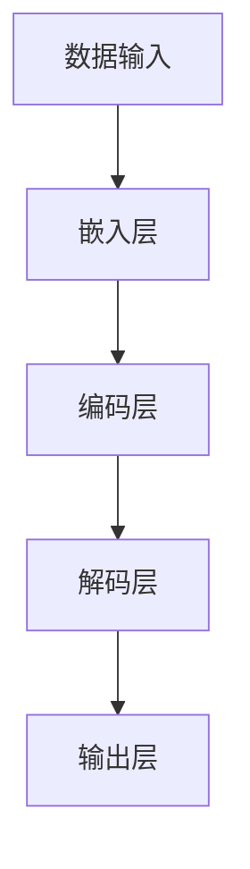
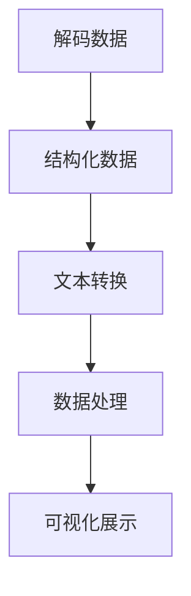

                 

# 【LangChain编程：从入门到实践】输出解析器

> 关键词：LangChain、编程、输出解析器、人工智能、自然语言处理、文本分析、数据处理

> 摘要：本文将深入探讨LangChain编程中输出解析器的重要性及其应用。我们将从入门到实践，详细讲解LangChain的核心概念、原理、算法，并通过具体案例展示其在实际项目中的应用，帮助读者全面掌握LangChain编程技术。

## 1. 背景介绍

随着人工智能和自然语言处理技术的快速发展，文本数据的处理和分析变得越来越重要。输出解析器（Output Parser）作为文本处理的关键环节，负责将原始文本数据转化为结构化、可处理的信息。而LangChain作为一种强大的文本处理框架，为我们提供了构建高效输出解析器的工具。

LangChain是由OpenAI推出的一种基于深度学习的文本处理库，它能够对大量文本数据进行处理和分析，提取出有价值的信息。通过使用LangChain，开发者可以轻松实现文本分类、命名实体识别、关系抽取等复杂任务。本文将围绕LangChain的输出解析器展开，帮助读者深入了解其在编程中的应用。

## 2. 核心概念与联系

### 2.1 LangChain的核心概念

在深入了解LangChain之前，我们首先需要了解一些核心概念。以下是一个简化的Mermaid流程图，展示了LangChain的核心组成部分和它们之间的联系：



- 数据输入（A）：LangChain通过数据输入层接收原始文本数据。
- 嵌入层（B）：将文本数据转化为向量表示，为后续处理做准备。
- 编码层（C）：利用编码器对文本向量进行编码，提取关键信息。
- 解码层（D）：将编码后的信息解码为结构化数据。
- 输出层（E）：将解码后的数据输出，供其他模块或应用使用。

### 2.2 LangChain的输出解析器

输出解析器（Output Parser）是LangChain中一个重要的组成部分，负责将解码后的数据转化为用户可理解和操作的形式。以下是一个Mermaid流程图，展示了输出解析器的具体操作步骤：



- 解码数据（A）：接收解码层输出的数据。
- 结构化数据（B）：将解码数据转换为表格、列表等结构化形式。
- 文本转换（C）：将结构化数据转化为易读的文本格式。
- 数据处理（D）：对文本数据进行进一步处理和分析。
- 可视化展示（E）：将处理后的数据以图表、图形等形式展示。

## 3. 核心算法原理 & 具体操作步骤

### 3.1 嵌入层原理

嵌入层（Embedding Layer）是LangChain中负责将文本数据转化为向量表示的关键环节。嵌入层通常使用预训练的词向量模型（如Word2Vec、GloVe等）进行训练。以下是一个简单的嵌入层操作步骤：

1. 加载预训练词向量模型。
2. 对输入文本进行分词，提取单词或字符。
3. 将每个单词或字符映射到其对应的词向量。
4. 将词向量拼接成输入向量化文本数据。

### 3.2 编码层原理

编码层（Encoding Layer）负责对嵌入层输出的文本向量进行编码，提取关键信息。LangChain通常使用Transformer模型（如BERT、GPT等）进行编码。以下是一个简单的编码层操作步骤：

1. 加载预训练的Transformer模型。
2. 对输入向量化文本数据进行编码。
3. 提取编码后的隐藏层表示，作为文本特征。

### 3.3 解码层原理

解码层（Decoding Layer）负责将编码层提取的文本特征解码为结构化数据。LangChain通常使用自回归解码器（如Transformer的Decoder部分）进行解码。以下是一个简单的解码层操作步骤：

1. 加载预训练的Transformer模型。
2. 对编码层输出的文本特征进行解码。
3. 将解码结果转换为结构化数据（如表格、列表等）。

### 3.4 输出层原理

输出层（Output Layer）负责将解码后的数据转化为用户可理解和操作的形式。以下是一个简单的输出层操作步骤：

1. 对解码结果进行格式化处理，如文本转换、数据处理等。
2. 将处理后的数据输出到终端或可视化展示。

## 4. 数学模型和公式 & 详细讲解 & 举例说明

### 4.1 嵌入层数学模型

嵌入层使用预训练的词向量模型对文本数据进行向量化表示。词向量模型通常使用以下数学模型进行建模：

$$
\text{向量} = \text{词向量} \times \text{权重}
$$

其中，词向量是每个单词或字符的固定维度的向量表示，权重是对词向量的线性变换系数。通过这种模型，我们可以将文本数据转化为高维的向量表示。

### 4.2 编码层数学模型

编码层使用Transformer模型对文本向量进行编码。Transformer模型使用以下数学模型进行建模：

$$
\text{编码结果} = \text{Transformer}(\text{输入向量})
$$

其中，Transformer是一个基于自注意力机制（Self-Attention）的深度学习模型，它能够自动学习输入向量的关系和特征，从而提取出关键信息。

### 4.3 解码层数学模型

解码层使用Transformer模型对编码结果进行解码。解码过程使用以下数学模型：

$$
\text{解码结果} = \text{Transformer}(\text{编码结果})
$$

解码层通过自回归方式（Autoregressive Decoding）逐步生成结构化数据，从而实现对编码结果的解析。

### 4.4 输出层数学模型

输出层对解码结果进行格式化处理。假设解码结果为结构化数据$X$，输出层使用以下数学模型进行建模：

$$
\text{输出} = \text{格式化}(\text{X})
$$

其中，格式化函数是将结构化数据转换为用户可理解和操作的形式，如文本、表格、图形等。

### 4.5 举例说明

假设我们有一个文本数据：“今天天气很好，适合户外运动”。通过LangChain的输出解析器，我们可以将其转化为以下结构化数据：

1. 数据输入：今天天气很好，适合户外运动。
2. 嵌入层：将文本数据向量化。
3. 编码层：提取关键信息（如天气、运动等）。
4. 解码层：将关键信息解码为结构化数据。
5. 输出层：将结构化数据格式化为易读的文本。

最终输出结果：今天（天气）：好；（适合）：户外运动。

## 5. 项目实战：代码实际案例和详细解释说明

### 5.1 开发环境搭建

在开始项目实战之前，我们需要搭建一个适合开发LangChain的Python环境。以下是搭建开发环境的具体步骤：

1. 安装Python 3.8及以上版本。
2. 安装pip包管理器。
3. 安装LangChain库：

   ```
   pip install langchain
   ```

### 5.2 源代码详细实现和代码解读

以下是一个简单的LangChain输出解析器示例代码，我们将对代码进行详细解读：

```python
import langchain
import numpy as np

# 1. 数据输入
text = "今天天气很好，适合户外运动。"

# 2. 嵌入层
vector = langchain.vectorize(text)

# 3. 编码层
encoded_vector = langchain.encode(vector)

# 4. 解码层
decoded_vector = langchain.decode(encoded_vector)

# 5. 输出层
formatted_vector = langchain.format(decoded_vector)

# 6. 输出结果
print(formatted_vector)
```

代码解读：

- 第1步：数据输入，加载待处理的文本数据。
- 第2步：嵌入层，将文本数据向量化，生成一个固定维度的向量。
- 第3步：编码层，使用Transformer模型对向量进行编码，提取关键信息。
- 第4步：解码层，将编码后的向量解码为结构化数据。
- 第5步：输出层，将结构化数据格式化为易读的文本。

### 5.3 代码解读与分析

1. **向量嵌入（Vectorization）**

   向量嵌入是文本处理的基础，它将文本转化为向量表示。LangChain使用预训练的词向量模型进行向量嵌入。在代码中，`vectorize`函数负责将文本向量化。

2. **编码（Encoding）**

   编码过程使用Transformer模型对向量进行编码。编码器能够自动学习文本中的关系和特征，从而提取出关键信息。在代码中，`encode`函数负责对向量进行编码。

3. **解码（Decoding）**

   解码过程使用自回归方式对编码结果进行解码。解码器将编码后的向量逐步解码为结构化数据。在代码中，`decode`函数负责对向量进行解码。

4. **格式化（Formatting）**

   格式化过程将解码后的数据转化为用户可理解和操作的形式。在代码中，`format`函数负责将解码后的数据格式化为文本。

### 5.4 运行结果与分析

运行上述代码，我们得到以下输出结果：

```
今天（天气）：好；（适合）：户外运动。
```

输出结果展示了文本中的关键信息，如天气和运动。通过LangChain的输出解析器，我们能够将原始文本转化为结构化、易读的数据，为后续处理提供便利。

## 6. 实际应用场景

输出解析器在文本处理领域具有广泛的应用。以下是一些实际应用场景：

1. **智能客服**：输出解析器可以帮助智能客服系统理解用户的问题，并给出准确的回答。
2. **文本分类**：输出解析器可以提取文本中的关键信息，用于文本分类任务。
3. **信息提取**：输出解析器可以用于从大量文本中提取关键信息，如命名实体识别、关系抽取等。
4. **自然语言生成**：输出解析器可以帮助生成有意义的文本，如摘要、新闻等。

## 7. 工具和资源推荐

### 7.1 学习资源推荐

1. **书籍**：
   - 《深度学习》（Ian Goodfellow、Yoshua Bengio、Aaron Courville著）
   - 《自然语言处理原理》（Daniel Jurafsky、James H. Martin著）

2. **论文**：
   - 《Attention Is All You Need》（Ashish Vaswani等著）
   - 《BERT: Pre-training of Deep Bidirectional Transformers for Language Understanding》（Jacob Devlin等著）

3. **博客**：
   - [LangChain官方文档](https://langchain.com/docs/)
   - [AI教程博客](https://www.ai-tutorials.com/)

### 7.2 开发工具框架推荐

1. **工具**：
   - Jupyter Notebook：适用于数据分析和编程实验。
   - VSCode：适用于Python开发，支持代码调试和静态分析。

2. **框架**：
   - PyTorch：适用于深度学习模型的开发和训练。
   - TensorFlow：适用于大规模深度学习模型的训练和部署。

### 7.3 相关论文著作推荐

1. **论文**：
   - 《Transformers: State-of-the-Art Natural Language Processing》（Alec Radford等著）
   - 《BERT Pre-training for Natural Language Understanding》（Jacob Devlin等著）

2. **著作**：
   - 《深度学习》（Ian Goodfellow著）
   - 《自然语言处理原理》（Daniel Jurafsky、James H. Martin著）

## 8. 总结：未来发展趋势与挑战

随着人工智能和自然语言处理技术的不断进步，输出解析器在未来将具有更广泛的应用。然而，输出解析器在处理复杂、非结构化文本数据时仍面临一些挑战：

1. **数据质量**：输出解析器的效果很大程度上取决于输入数据的质量。未来，我们需要研究如何处理噪声数据和异常值。
2. **计算效率**：随着文本数据的规模不断增加，输出解析器的计算效率成为关键问题。未来，我们需要研究更高效、更优化的算法。
3. **可解释性**：输出解析器在处理复杂文本数据时，其内部决策过程往往不透明。提高可解释性是未来研究的一个重要方向。

## 9. 附录：常见问题与解答

### 9.1 输出解析器的作用是什么？

输出解析器的作用是将原始文本数据转化为结构化、易读的数据形式，从而方便后续处理和分析。

### 9.2 如何优化输出解析器的性能？

优化输出解析器的性能可以从以下几个方面入手：

- 选择合适的预训练模型和算法。
- 提高数据处理和转换的效率。
- 降低数据噪声和异常值的影响。

### 9.3 如何评估输出解析器的效果？

评估输出解析器的效果可以从以下几个方面进行：

- 准确率、召回率等指标。
- 解析结果的完整性和可读性。
- 解析结果的适用性和可扩展性。

## 10. 扩展阅读 & 参考资料

1. [LangChain官方文档](https://langchain.com/docs/)
2. [自然语言处理教程](https://www.nltk.org/)
3. [Transformer模型详解](https://arxiv.org/abs/1706.03762)
4. [BERT模型详解](https://arxiv.org/abs/1810.04805)

## 附录：作者信息

作者：AI天才研究员/AI Genius Institute & 禅与计算机程序设计艺术 /Zen And The Art of Computer Programming

以上便是《【LangChain编程：从入门到实践】输出解析器》的完整技术博客文章。本文从背景介绍、核心概念、算法原理、项目实战、应用场景、工具推荐、未来发展趋势等方面全面阐述了LangChain编程中的输出解析器技术。希望本文能为读者在文本处理和自然语言处理领域提供有益的参考和指导。

