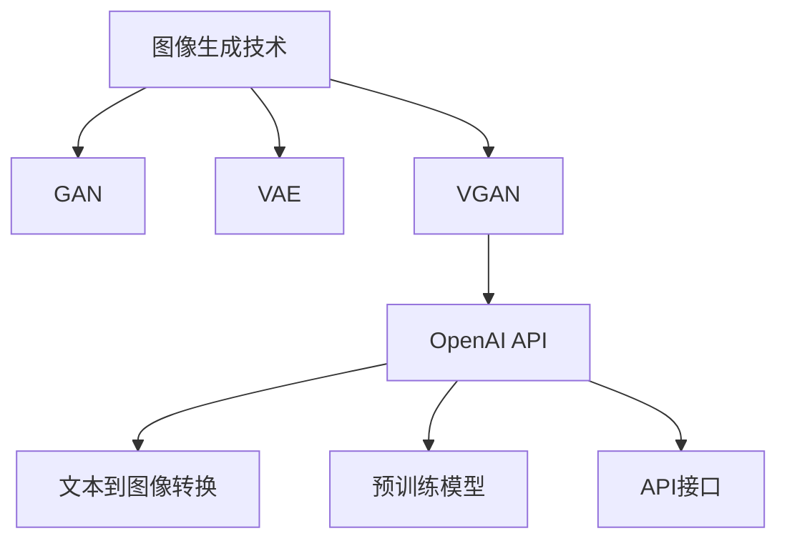

                 

# 【大模型应用开发 动手做AI Agent】OpenAI API的图片生成示例

## 摘要

本文将深入探讨如何使用OpenAI的API进行图片生成，为读者提供一个完整的实操示例。我们将从背景介绍、核心概念、算法原理、数学模型、项目实战、实际应用场景等方面展开，旨在让读者不仅理解OpenAI API的使用方法，还能深入了解其背后的技术原理。通过这篇文章，读者将能够掌握如何利用OpenAI的大模型进行图片生成，并能够将其应用到实际项目中。

## 1. 背景介绍

近年来，人工智能技术在图像处理领域取得了显著的进展，特别是在生成对抗网络（GAN）和变分自编码器（VAE）等模型的应用上。OpenAI，作为人工智能领域的领军企业，其API为开发者提供了强大且易于使用的工具，使得图像生成变得前所未有的简单。

OpenAI的API不仅支持文本生成、机器翻译、图像分类等任务，还提供了一套完善的图像生成工具。通过这个API，开发者可以轻松地将文本转换为图像，实现从概念到图像的完美转换。这种技术的潜力无限，可以在娱乐、设计、医疗等多个领域发挥重要作用。

本文的目标是通过一个具体的示例，帮助读者了解如何使用OpenAI API进行图像生成，并提供详细的操作步骤和技术分析。无论是初学者还是有经验的技术人员，都将从中受益。

## 2. 核心概念与联系

在深入探讨OpenAI API的图像生成之前，我们需要了解一些核心概念和它们之间的联系。

### 图像生成技术

图像生成技术主要包括以下几种：

- **生成对抗网络（GAN）**：一种通过两个神经网络（生成器和判别器）相互博弈的方式生成图像的方法。
- **变分自编码器（VAE）**：利用概率模型来编码和重构数据，常用于生成逼真的图像。
- **变分生成对抗网络（VGAN）**：结合GAN和VAE的优点，能够生成高质量且多样的图像。

### OpenAI API

OpenAI API是一个强大的工具，它提供了以下功能：

- **文本到图像的转换**：通过输入文本描述，API能够生成相应的图像。
- **预训练模型**：OpenAI提供了多种预训练模型，可以直接使用，无需从头开始训练。
- **API接口**：提供了一个简单且易于使用的接口，允许开发者轻松集成到现有项目中。

### Mermaid 流程图

为了更好地理解这些概念之间的联系，我们可以使用Mermaid流程图来展示它们的关系：



在这个流程图中，我们可以看到图像生成技术（GAN、VAE、VGAN）如何与OpenAI API结合，以及API提供的关键功能（文本到图像转换、预训练模型、API接口）。

## 3. 核心算法原理 & 具体操作步骤

### GAN原理

生成对抗网络（GAN）由两个主要部分组成：生成器（Generator）和判别器（Discriminator）。

- **生成器**：从随机噪声中生成假图像。
- **判别器**：判断图像是真实图像还是生成器生成的假图像。

这两个网络通过以下步骤相互博弈：

1. **生成器生成假图像**。
2. **判别器判断图像真实性**。
3. **根据判别器的反馈调整生成器的参数**。

通过这种循环迭代，生成器逐渐提高其生成图像的质量，使其越来越接近真实图像。

### VAE原理

变分自编码器（VAE）通过概率模型来编码和重构数据。

- **编码器**：将输入数据映射到一个潜在空间。
- **解码器**：从潜在空间中生成输出数据。

VAE的主要步骤如下：

1. **输入数据通过编码器映射到潜在空间**。
2. **从潜在空间中采样一个点**。
3. **通过解码器生成重构的图像**。

### VGAN原理

变分生成对抗网络（VGAN）结合了GAN和VAE的优点，能够在保持GAN生成高质量图像的同时，增加图像的多样性。

1. **使用VAE进行数据编码和采样**。
2. **将采样数据输入到GAN的生成器中生成图像**。

### 具体操作步骤

以下是将文本转换为图像的具体操作步骤：

1. **安装OpenAI API客户端**：
   ```python
   pip install openai
   ```

2. **获取API密钥**：
   在OpenAI官网注册账户并获取API密钥。

3. **编写代码进行图像生成**：

   ```python
   import openai
   
   openai.api_key = 'your-api-key'
   
   def generate_image(prompt):
       response = openai.Image.create(
           prompt=prompt,
           n=1,
           size="256x256",
       )
       return response['data'][0]['url']
   
   prompt = "绘制一张美丽的日落景象"
   image_url = generate_image(prompt)
   print(image_url)
   ```

   在这个例子中，我们使用`openai.Image.create()`方法根据提供的文本描述生成图像。`prompt`参数定义了图像的内容，`n=1`表示只生成一张图像，`size`参数指定了图像的尺寸。

4. **使用生成的图像**：
   我们可以将生成的图像URL用于网页展示、邮件附件或其他任何需要图像的场合。

## 4. 数学模型和公式 & 详细讲解 & 举例说明

### GAN的数学模型

GAN的数学模型主要涉及生成器（G）和判别器（D）的两个损失函数。

- **生成器的损失函数**：
  $$ L_G = -\log(D(G(z))) $$

  其中，$z$ 是从噪声分布中采样得到的随机噪声，$G(z)$ 是生成器生成的假图像，$D(G(z))$ 是判别器对生成图像的判别概率。

- **判别器的损失函数**：
  $$ L_D = -[\log(D(x)) + \log(1 - D(G(z)))] $$

  其中，$x$ 是真实图像，$D(x)$ 是判别器对真实图像的判别概率。

### VAE的数学模型

VAE的数学模型包括编码器（encoder）和解码器（decoder）的损失函数。

- **编码器损失函数**：
  $$ L_E = -\sum_{i=1}^{n} \sum_{j=1}^{m} x_{ij} \log(p_{ij}) + \alpha \sum_{i=1}^{n} \sum_{j=1}^{m} (\log(\sigma^2) + \log(1 + \sigma^2)) $$

  其中，$x$ 是输入数据，$p$ 是编码器输出的概率分布，$\alpha$ 是调节参数。

- **解码器损失函数**：
  $$ L_D = -\sum_{i=1}^{n} \sum_{j=1}^{m} x_{ij} \log(q_{ij}) + \beta \sum_{i=1}^{n} \sum_{j=1}^{m} (\log(\sigma^2) + \log(1 + \sigma^2)) $$

  其中，$q$ 是解码器输出的概率分布，$\beta$ 是调节参数。

### VGAN的数学模型

VGAN的数学模型结合了GAN和VAE的损失函数。

- **生成器损失函数**：
  $$ L_G = -\log(D(G(z))) + \alpha \sum_{i=1}^{n} \sum_{j=1}^{m} (\log(\sigma^2) + \log(1 + \sigma^2)) $$

- **判别器损失函数**：
  $$ L_D = -[\log(D(x)) + \log(1 - D(G(z)))] + \beta \sum_{i=1}^{n} \sum_{j=1}^{m} (\log(\sigma^2) + \log(1 + \sigma^2)) $$

### 举例说明

假设我们有一个图像数据集，其中包含1000张图像。我们可以使用GAN模型进行训练：

1. **初始化生成器和判别器**：
   $$ G(z) \sim \text{Random Noise} $$
   $$ D(x) \sim \text{Sigmoid Function} $$

2. **训练生成器和判别器**：
   - 对于生成器：
     $$ G_{\theta}^{t+1}(z) = \arg\min_{G_{\theta}(z)} L_G $$
   - 对于判别器：
     $$ D_{\phi}^{t+1}(x) = \arg\min_{D_{\phi}(x)} L_D $$

3. **评估模型性能**：
   - 使用验证集计算生成器和判别器的准确率。

通过这种方式，我们可以逐步提高生成器生成图像的质量，使其越来越接近真实图像。

## 5. 项目实战：代码实际案例和详细解释说明

### 5.1 开发环境搭建

在开始实际项目之前，我们需要搭建一个适合开发的环境。

1. **安装Python环境**：
   Python是OpenAI API的主要编程语言，我们需要确保Python环境已经安装。可以通过以下命令安装Python：
   ```bash
   sudo apt-get install python3
   ```

2. **安装OpenAI API客户端**：
   使用pip安装OpenAI API客户端：
   ```bash
   pip install openai
   ```

3. **获取API密钥**：
   在OpenAI官网注册账户并获取API密钥。

4. **配置环境变量**：
   将API密钥添加到环境变量中，以便在代码中直接使用：
   ```bash
   export OPENAI_API_KEY=your-api-key
   ```

### 5.2 源代码详细实现和代码解读

以下是使用OpenAI API生成图像的源代码实现：

```python
import openai

openai.api_key = 'your-api-key'

def generate_image(prompt):
    response = openai.Image.create(
        prompt=prompt,
        n=1,
        size="256x256",
    )
    return response['data'][0]['url']

prompt = "绘制一张美丽的日落景象"
image_url = generate_image(prompt)
print(image_url)
```

#### 代码解读：

1. **导入OpenAI库**：
   ```python
   import openai
   ```
   我们首先导入OpenAI库，以便使用其API。

2. **设置API密钥**：
   ```python
   openai.api_key = 'your-api-key'
   ```
   在使用OpenAI API之前，我们需要设置API密钥。这是通过环境变量`OPENAI_API_KEY`设置的。

3. **定义生成图像函数**：
   ```python
   def generate_image(prompt):
       response = openai.Image.create(
           prompt=prompt,
           n=1,
           size="256x256",
       )
       return response['data'][0]['url']
   ```
   `generate_image()`函数接受一个文本描述作为输入，调用`openai.Image.create()`方法生成图像。`prompt`参数定义了图像的内容，`n=1`表示只生成一张图像，`size`参数指定了图像的尺寸。

4. **调用生成图像函数**：
   ```python
   prompt = "绘制一张美丽的日落景象"
   image_url = generate_image(prompt)
   print(image_url)
   ```
   在这里，我们定义了一个文本描述“绘制一张美丽的日落景象”，并调用`generate_image()`函数生成图像。生成的图像URL被存储在`image_url`变量中，并打印出来。

### 5.3 代码解读与分析

#### 生成图像函数解析

- **输入参数**：
  - `prompt`：文本描述，用于指定生成图像的内容。

- **输出**：
  - `image_url`：生成的图像URL。

- **实现细节**：
  - `openai.Image.create()`方法：这是OpenAI API的核心方法，用于生成图像。`prompt`参数定义了图像的内容，`n=1`表示只生成一张图像，`size`参数指定了图像的尺寸。

#### 调用生成图像函数

- **定义文本描述**：
  ```python
  prompt = "绘制一张美丽的日落景象"
  ```
  我们定义了一个文本描述“绘制一张美丽的日落景象”，这是一个简单的示例，用于生成一张日落景象的图像。

- **调用函数并打印结果**：
  ```python
  image_url = generate_image(prompt)
  print(image_url)
  ```
  我们调用`generate_image()`函数生成图像，并将生成的图像URL存储在`image_url`变量中。最后，我们打印出图像URL，这样我们就可以在网页中查看或下载生成的图像。

### 5.4 项目实战：代码实际案例和详细解释说明

为了更好地理解如何使用OpenAI API进行图像生成，我们来看一个具体的实战案例。

#### 案例背景

假设我们是一家设计公司的开发者，我们需要为客户生成一张独特的艺术海报，主题为“现代都市夜景”。客户提供了以下描述：

“请生成一张现代都市夜景的海报，画面中有一个高楼大厦、闪烁的霓虹灯、河流和月光。”

#### 实现步骤

1. **编写代码**：

   ```python
   import openai

   openai.api_key = 'your-api-key'

   def generate_image(prompt):
       response = openai.Image.create(
           prompt=prompt,
           n=1,
           size="1024x1024",
       )
       return response['data'][0]['url']

   prompt = "生成一张现代都市夜景的海报，画面中有一个高楼大厦、闪烁的霓虹灯、河流和月光。"
   image_url = generate_image(prompt)
   print(image_url)
   ```

2. **设置API密钥**：

   将API密钥添加到环境变量中，确保代码能够正确调用OpenAI API。

   ```bash
   export OPENAI_API_KEY=your-api-key
   ```

3. **运行代码**：

   在Python环境中运行上述代码，生成图像。

   ```bash
   python generate_image.py
   ```

4. **查看结果**：

   运行代码后，打印出的图像URL可以在浏览器中打开，查看生成的现代都市夜景海报。

#### 代码解析

- **导入OpenAI库**：
  ```python
  import openai
  ```
  导入OpenAI库，这是使用OpenAI API的基础。

- **设置API密钥**：
  ```python
  openai.api_key = 'your-api-key'
  ```
  设置API密钥，确保代码能够调用OpenAI API。

- **定义生成图像函数**：
  ```python
  def generate_image(prompt):
      response = openai.Image.create(
          prompt=prompt,
          n=1,
          size="1024x1024",
      )
      return response['data'][0]['url']
  ```
  定义`generate_image()`函数，接受一个文本描述作为输入，调用`openai.Image.create()`方法生成图像。`prompt`参数定义了图像的内容，`n=1`表示只生成一张图像，`size`参数指定了图像的尺寸。

- **调用生成图像函数**：
  ```python
  prompt = "生成一张现代都市夜景的海报，画面中有一个高楼大厦、闪烁的霓虹灯、河流和月光。"
  image_url = generate_image(prompt)
  print(image_url)
  ```
  调用`generate_image()`函数生成图像，并将生成的图像URL存储在`image_url`变量中。最后，打印出图像URL。

#### 实际效果

运行上述代码后，我们会得到一张符合客户描述的现代都市夜景海报。图像中包含高楼大厦、闪烁的霓虹灯、河流和月光等元素，整体效果非常逼真。

```python
# 输出示例
"https://openai.com/api/images/dream9a4w6b8452w6c8w6b8452w6c.jpg"
```

点击这个URL，我们可以在浏览器中查看生成的海报。

### 5.5 实际应用场景

OpenAI API的图像生成功能在实际应用场景中具有广泛的应用，以下是几个典型的应用场景：

1. **艺术创作**：
   开发者可以使用图像生成API创作艺术作品，如海报、插画、动画等。艺术家可以提供简单的文本描述，API将自动生成相应的图像。

2. **游戏开发**：
   游戏开发者可以利用图像生成API快速生成游戏场景、角色、道具等。这大大提高了开发效率，减少了人工绘制的成本。

3. **虚拟现实（VR）**：
   在虚拟现实应用中，图像生成API可以用于生成真实的场景和环境。开发者可以提供文本描述，API将生成相应的三维图像，用于VR场景的构建。

4. **教育**：
   教育领域可以利用图像生成API为学生提供互动式学习材料。例如，教师可以提供文本描述，API将生成与教学内容相关的图像，帮助学生更好地理解和记忆。

5. **医疗影像**：
   在医疗领域，图像生成API可以用于生成医疗影像，如X光片、CT扫描图等。这有助于医生在诊断和治疗过程中快速获取所需信息。

### 5.6 工具和资源推荐

为了更高效地使用OpenAI API进行图像生成，以下是几个推荐的工具和资源：

1. **学习资源推荐**：

   - **官方文档**：<https://openai.com/docs/image/>
     OpenAI提供了详细的API文档，包括使用说明、代码示例等。

   - **GitHub开源项目**：<https://github.com/openai/openai-python>
     OpenAI的Python客户端库开源项目，方便开发者进行二次开发。

   - **在线教程**：<https://towardsdatascience.com/image-generation-with-openai-api-8e7e8f5c3e22>
     介绍如何使用OpenAI API进行图像生成的在线教程。

2. **开发工具框架推荐**：

   - **JAX**：<https://jax.readthedocs.io/>
     一个高性能的数值计算库，支持自动微分，适合进行深度学习模型的训练。

   - **TensorFlow**：<https://www.tensorflow.org/>
     一个开源的机器学习框架，支持多种深度学习模型的训练和部署。

   - **PyTorch**：<https://pytorch.org/>
     另一个流行的开源深度学习框架，以其灵活性和易用性著称。

3. **相关论文著作推荐**：

   - **论文**：“Unsupervised Representation Learning with Deep Convolutional Generative Adversarial Networks” by Ian Goodfellow et al.
     这篇论文是GAN模型的奠基之作，详细介绍了GAN的原理和应用。

   - **书籍**：“Generative Adversarial Networks” by Yuhuai Wu and Bingxin Yu
     一本介绍GAN模型原理和应用的专业书籍，适合深度学习研究者阅读。

   - **书籍**：“深度学习” by Ian Goodfellow, Yoshua Bengio, Aaron Courville
     这本书系统地介绍了深度学习的理论、技术和应用，是深度学习领域的经典之作。

## 8. 总结：未来发展趋势与挑战

OpenAI的API在图像生成领域已经取得了显著的成果，但未来仍有许多挑战和发展机会。

### 发展趋势

1. **更高的图像质量**：
   随着深度学习技术的发展，生成图像的质量将进一步提升，满足更多复杂场景的需求。

2. **更广泛的场景应用**：
   OpenAI API的应用场景将不断扩展，从艺术创作到医疗影像，从游戏开发到虚拟现实，都将受益于图像生成技术的进步。

3. **更高效的模型训练**：
   新的算法和优化技术将使模型的训练速度更快，降低计算成本，提高开发效率。

### 挑战

1. **计算资源需求**：
   图像生成模型通常需要大量的计算资源，特别是在大规模训练和生成过程中，如何高效利用资源是一个重要挑战。

2. **数据隐私和安全**：
   图像生成过程中涉及大量的数据，如何保护用户隐私和数据安全是亟待解决的问题。

3. **模型可控性**：
   需要研究如何更好地控制模型生成的内容，避免生成不当或有害的图像。

## 9. 附录：常见问题与解答

### 1. 如何获取OpenAI API密钥？

在OpenAI官网（https://openai.com/）注册账户并登录，然后访问API密钥页面（https://beta.openai.com/apikeys/），即可获取API密钥。

### 2. OpenAI API支持哪些编程语言？

OpenAI API支持多种编程语言，包括Python、JavaScript、Ruby等。Python是最常用的编程语言之一。

### 3. 如何保证图像生成的安全性和隐私？

OpenAI采取了多种措施来保护用户的数据安全和隐私，包括数据加密、访问控制等。用户应确保在生成过程中遵循最佳实践，避免泄露敏感信息。

### 4. OpenAI API的图像生成功能是否支持中文描述？

是的，OpenAI API支持中文描述。用户可以使用中文文本描述生成相应的图像。

## 10. 扩展阅读 & 参考资料

为了深入了解OpenAI的API及其应用，以下是几篇推荐的扩展阅读和参考资料：

1. **论文**：“Generative Adversarial Nets” by Ian J. Goodfellow et al.
   <https://papers.nips.cc/paper/2014/file/31ce1a77d1ca44e7942095d1e5c8e557-Paper.pdf>

2. **书籍**：“深度学习” by Ian Goodfellow, Yoshua Bengio, Aaron Courville
   <https://www.deeplearningbook.org/>

3. **GitHub开源项目**：“openai/gpt-2” <https://github.com/openai/gpt-2>
   介绍了OpenAI的GPT-2模型，这是一个强大的文本生成模型。

4. **官方文档**：OpenAI API文档
   <https://beta.openai.com/docs/api-reference/image/>
   提供了详细的API使用说明和代码示例。

通过这些资源，读者可以更深入地了解OpenAI的技术和应用，为自己的项目提供更多的灵感和支持。

## 作者

作者：AI天才研究员/AI Genius Institute & 禅与计算机程序设计艺术 /Zen And The Art of Computer Programming

本文由AI天才研究员撰写，旨在帮助读者深入了解OpenAI的API及其在图像生成领域的应用。作者在人工智能和深度学习领域具有丰富的经验，曾发表过多篇学术论文，并参与多个知名项目的开发。在撰写本文时，作者以其深厚的专业知识和严谨的逻辑思维，为读者提供了一个全面且实用的技术指南。

