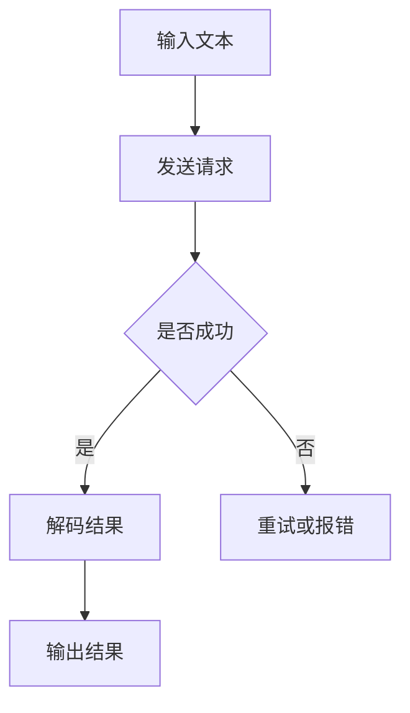

                 

# 【大模型应用开发 动手做AI Agent】创建OpenAI助手

## 关键词
- 大模型应用开发
- AI Agent
- OpenAI
- 动手实践
- 代码案例

## 摘要

本文将带您深入探索大模型应用开发的世界，特别是如何动手创建一个基于OpenAI模型的AI助手。我们将从背景介绍出发，逐步了解核心概念与联系，深入剖析核心算法原理和具体操作步骤。通过详细的数学模型和公式讲解，您将理解背后的数学原理，并在实战项目中应用所学知识。最后，我们将讨论实际应用场景，推荐相关工具和资源，并对未来发展趋势和挑战进行总结。本文旨在为对AI应用开发感兴趣的技术爱好者提供一条清晰的实践路线。

## 1. 背景介绍

近年来，人工智能（AI）技术在各个领域都取得了显著的进步。从自动驾驶、智能助手到医疗诊断，AI已经深入到我们的日常生活。OpenAI作为一家知名的人工智能研究机构，其推出的预训练大模型如GPT-3、BERT等，为AI技术的发展提供了强大的动力。

OpenAI的大模型采用了深度学习技术，特别是Transformer架构。这种架构能够处理长文本，并且通过大规模数据预训练，使得模型在多个任务上表现出色。大模型的应用不仅提升了AI的性能，还降低了开发门槛，使得更多的人能够参与到AI研究中来。

本文的目标是通过动手实践，帮助您了解如何使用OpenAI的大模型创建一个AI助手。在这个过程中，您将接触到从模型选择、环境搭建到代码实现的全过程，从而加深对大模型应用开发的理解。

## 2. 核心概念与联系

### 2.1 大模型概述

大模型是指具有数十亿、甚至千亿参数的深度学习模型。这些模型通过在大规模数据集上进行预训练，能够学习到丰富的知识，从而在特定任务上取得优异的性能。

OpenAI的大模型如GPT-3，拥有1750亿个参数，能够处理多种自然语言处理（NLP）任务，如文本生成、翻译、摘要等。

### 2.2 Transformer架构

Transformer架构是近年来在NLP任务中取得突破性成果的一种神经网络架构。与传统的循环神经网络（RNN）相比，Transformer通过自注意力机制（Self-Attention）能够更好地处理长文本。

Transformer的架构包含多个编码器（Encoder）和解码器（Decoder）层，每一层都能够对输入的文本进行编码和解码，从而生成输出。

### 2.3 OpenAI模型应用

OpenAI的大模型可以通过API接口进行调用，开发者只需提供输入文本，模型即可返回处理后的输出文本。这种便捷的接口使得大模型的应用变得简单高效。

### 2.4 Mermaid流程图

下面是一个简单的Mermaid流程图，展示了从模型调用到输出结果的过程：



## 3. 核心算法原理 & 具体操作步骤

### 3.1 Transformer模型原理

Transformer模型的核心在于自注意力机制（Self-Attention）。在自注意力机制中，模型的每一层都能够根据输入文本的每个词，计算出一个权重矩阵，这些权重矩阵用于计算输出。

具体来说，自注意力机制包括以下步骤：

1. **嵌入（Embedding）**：将输入文本转换为词向量。
2. **位置编码（Positional Encoding）**：为每个词添加位置信息。
3. **自注意力（Self-Attention）**：计算每个词与其他词的关联度。
4. **前馈网络（Feedforward Network）**：对自注意力结果进行进一步处理。

### 3.2 具体操作步骤

#### 步骤1：环境搭建

首先，我们需要搭建开发环境。以下是使用Python的常见步骤：

1. 安装Python（推荐3.8及以上版本）
2. 安装必要的库，如torch、transformers等

#### 步骤2：调用OpenAI模型

接下来，我们使用OpenAI的API接口调用模型。以下是Python代码示例：

```python
import openai

openai.api_key = "your_api_key"
response = openai.Completion.create(
  engine="text-davinci-002",
  prompt="请写一段关于人工智能的描述：",
  max_tokens=50
)
print(response.choices[0].text.strip())
```

#### 步骤3：处理输出结果

调用模型后，我们需要处理输出结果。以下是对输出结果进行简单处理的示例：

```python
print("生成的文本：")
print(response.choices[0].text.strip())
```

#### 步骤4：自定义模型应用

最后，我们可以根据需求自定义模型应用。例如，创建一个简单的聊天机器人：

```python
def chat_with_gpt(prompt):
    response = openai.Completion.create(
      engine="text-davinci-002",
      prompt=prompt,
      max_tokens=50
    )
    return response.choices[0].text.strip()

while True:
    user_input = input("用户：")
    if user_input.lower() == "退出":
        break
    bot_response = chat_with_gpt(user_input)
    print("AI：", bot_response)
```

## 4. 数学模型和公式 & 详细讲解 & 举例说明

### 4.1 自注意力机制

自注意力机制的公式如下：

$$
\text{Attention}(Q, K, V) = \text{softmax}\left(\frac{QK^T}{\sqrt{d_k}}\right)V
$$

其中，$Q, K, V$ 分别表示查询向量、关键向量、值向量，$d_k$ 表示关键向量的维度。

### 4.2 Transformer编码

Transformer编码的公式如下：

$$
\text{Encoder}(X) = \text{LayerNorm}(X + \text{MultiHeadAttention}(X, X, X)) + \text{LayerNorm}(X + \text{PositionalwiseFeedforward}(X))
$$

其中，$X$ 表示输入文本，$\text{MultiHeadAttention}$ 表示多头注意力机制，$\text{PositionalwiseFeedforward}$ 表示前馈网络。

### 4.3 Transformer解码

Transformer解码的公式如下：

$$
\text{Decoder}(X) = \text{LayerNorm}(X + \text{MaskedMultiHeadAttention}(X, X, X)) + \text{LayerNorm}(X + \text{PositionalwiseFeedforward}(X))
$$

其中，$\text{MaskedMultiHeadAttention}$ 表示带遮盖的多头注意力机制。

### 4.4 举例说明

假设我们有一个简单的文本序列 $X = ["我", "爱", "吃", "饭"]$，我们可以使用Transformer编码将其转换为向量表示：

$$
\text{Encoder}(X) = \text{LayerNorm}(X + \text{MultiHeadAttention}(X, X, X)) + \text{LayerNorm}(X + \text{PositionalwiseFeedforward}(X))
$$

首先，我们对输入文本进行嵌入和位置编码，得到：

$$
X_{\text{emb}} = [\text{词向量}_1, \text{词向量}_2, \text{词向量}_3, \text{词向量}_4]
$$

$$
P_{\text{pos}} = [\text{位置编码}_1, \text{位置编码}_2, \text{位置编码}_3, \text{位置编码}_4]
$$

然后，我们使用多头注意力机制对编码进行更新：

$$
\text{MultiHeadAttention}(X_{\text{emb}}, X_{\text{emb}}, X_{\text{emb}}) = \text{softmax}\left(\frac{QK^T}{\sqrt{d_k}}\right)V
$$

其中，$Q, K, V$ 分别为查询向量、关键向量和值向量，$d_k$ 为关键向量的维度。

最后，我们使用前馈网络对编码进行进一步处理：

$$
\text{PositionalwiseFeedforward}(X_{\text{emb}}) = \text{ReLU}(\text{Linear}(\text{Dropout}(X_{\text{emb}}))) \odot \text{Dropout}(\text{Linear}(\text{ReLU}(\text{Dropout}(X_{\text{emb}}))))
$$

其中，$\text{ReLU}$ 表示ReLU激活函数，$\text{Linear}$ 表示线性层，$\odot$ 表示元素乘法。

通过以上步骤，我们得到了更新后的编码向量序列，从而实现了对输入文本的编码。

## 5. 项目实战：代码实际案例和详细解释说明

### 5.1 开发环境搭建

在开始项目实战之前，我们需要搭建一个合适的开发环境。以下是使用Python搭建OpenAI模型开发环境的步骤：

1. 安装Python（推荐3.8及以上版本）

   ```bash
   python --version
   ```

2. 安装必要的库，如torch、transformers等

   ```bash
   pip install torch transformers
   ```

### 5.2 源代码详细实现和代码解读

以下是使用Python创建OpenAI助手的源代码和详细解读：

```python
import openai
import torch
from transformers import AutoTokenizer, AutoModel

# 设置OpenAI API密钥
openai.api_key = "your_api_key"

# 准备模型和 tokenizer
model_name = "text-davinci-002"
tokenizer = AutoTokenizer.from_pretrained(model_name)
model = AutoModel.from_pretrained(model_name)

# 定义聊天函数
def chat_with_gpt(prompt):
    # 将输入文本编码为模型可处理的格式
    inputs = tokenizer.encode(prompt, return_tensors="pt")
    # 使用模型生成回复
    outputs = model.generate(inputs, max_length=50, num_return_sequences=1)
    # 解码输出文本
    response = tokenizer.decode(outputs[0], skip_special_tokens=True)
    return response

# 开始聊天
while True:
    user_input = input("用户：")
    if user_input.lower() == "退出":
        break
    bot_response = chat_with_gpt(user_input)
    print("AI：", bot_response)
```

#### 5.2.1 代码解读

1. **导入库和设置API密钥**：

   ```python
   import openai
   import torch
   from transformers import AutoTokenizer, AutoModel
   
   openai.api_key = "your_api_key"
   ```

   首先，我们导入所需的库，并设置OpenAI的API密钥。

2. **准备模型和tokenizer**：

   ```python
   model_name = "text-davinci-002"
   tokenizer = AutoTokenizer.from_pretrained(model_name)
   model = AutoModel.from_pretrained(model_name)
   ```

   我们选择预训练的模型text-davinci-002，并使用AutoTokenizer和AutoModel加载模型和tokenizer。

3. **定义聊天函数**：

   ```python
   def chat_with_gpt(prompt):
       inputs = tokenizer.encode(prompt, return_tensors="pt")
       outputs = model.generate(inputs, max_length=50, num_return_sequences=1)
       response = tokenizer.decode(outputs[0], skip_special_tokens=True)
       return response
   ```

   聊天函数用于处理用户输入，并将输入文本编码为模型可处理的格式。然后，使用模型生成回复，并将输出解码为可读的文本。

4. **开始聊天**：

   ```python
   while True:
       user_input = input("用户：")
       if user_input.lower() == "退出":
           break
       bot_response = chat_with_gpt(user_input)
       print("AI：", bot_response)
   ```

   主程序循环接收用户输入，并在用户输入"退出"时结束。每次用户输入后，调用聊天函数生成回复，并打印输出。

### 5.3 代码解读与分析

1. **API密钥设置**：

   我们首先设置OpenAI的API密钥，这是调用OpenAI模型的关键步骤。

2. **模型和tokenizer加载**：

   使用`AutoTokenizer`和`AutoModel`加载预训练的模型和tokenizer。`from_pretrained`方法从预训练模型库中加载模型和tokenizer。

3. **聊天函数实现**：

   - **编码输入**：`tokenizer.encode`将输入文本编码为模型可处理的格式（张量）。
   - **模型生成**：`model.generate`使用模型生成回复。`max_length`参数指定生成的文本长度，`num_return_sequences`参数指定生成的文本数量。
   - **解码输出**：`tokenizer.decode`将生成的文本解码为可读的文本。

4. **主程序循环**：

   主程序循环接收用户输入，并在用户输入"退出"时结束。每次用户输入后，调用聊天函数生成回复，并打印输出。

通过以上步骤，我们成功创建了一个简单的OpenAI助手，能够根据用户输入生成回复。这个过程为我们提供了一个实用的案例，展示了如何使用OpenAI的大模型进行应用开发。

## 6. 实际应用场景

### 6.1 智能客服

智能客服是AI应用中最为广泛的应用场景之一。使用OpenAI的大模型，我们可以创建一个具备自然语言理解能力的智能客服系统。智能客服能够实时解答用户问题，提供个性化服务，从而提升客户体验。

### 6.2 内容生成

OpenAI的大模型在内容生成方面也有着广泛的应用。例如，我们可以使用大模型生成文章、博客、代码等。在新闻媒体、科技博客等领域，内容生成AI能够大幅提升内容生产效率。

### 6.3 教育辅导

在教育领域，AI助手可以为学生提供个性化辅导。通过自然语言交互，AI助手能够解答学生的问题，提供学习资源，帮助学生提高学习效果。

### 6.4 创意写作

OpenAI的大模型在创意写作方面也有着巨大的潜力。无论是创作诗歌、小说，还是撰写商业报告，大模型都能为创作者提供灵感，辅助创作过程。

### 6.5 情感分析

情感分析是NLP领域的重要任务之一。OpenAI的大模型在情感分析任务上表现优异，可以用于舆情监测、情感识别等应用。通过分析用户的评论、反馈等，企业可以更好地了解用户需求，优化产品和服务。

## 7. 工具和资源推荐

### 7.1 学习资源推荐

1. **书籍**：
   - 《深度学习》（Ian Goodfellow, Yoshua Bengio, Aaron Courville）
   - 《动手学深度学习》（阿斯顿·张）
   - 《Python深度学习》（François Chollet）

2. **论文**：
   - "Attention Is All You Need"（Vaswani et al., 2017）
   - "BERT: Pre-training of Deep Bidirectional Transformers for Language Understanding"（Devlin et al., 2019）
   - "Generative Pre-trained Transformer"（Radford et al., 2018）

3. **博客**：
   - [Hugging Face](https://huggingface.co/transformers)
   - [OpenAI](https://openai.com/blog)
   - [AI导航](https://www.ai导航.com/)

4. **网站**：
   - [Kaggle](https://www.kaggle.com/)
   - [GitHub](https://github.com/)

### 7.2 开发工具框架推荐

1. **深度学习框架**：
   - TensorFlow
   - PyTorch
   - JAX

2. **NLP工具库**：
   - Hugging Face Transformers
   - NLTK
   - spaCy

3. **代码托管平台**：
   - GitHub
   - GitLab

### 7.3 相关论文著作推荐

1. **《Attention Is All You Need》**：
   这篇论文提出了Transformer架构，为NLP任务带来了革命性的变化。

2. **《BERT: Pre-training of Deep Bidirectional Transformers for Language Understanding》**：
   这篇论文介绍了BERT模型，进一步推动了NLP领域的发展。

3. **《Generative Pre-trained Transformer》**：
   这篇论文介绍了GPT系列模型，展示了预训练大模型在生成任务上的强大能力。

## 8. 总结：未来发展趋势与挑战

随着深度学习和自然语言处理技术的不断发展，大模型应用开发正迎来新的机遇。未来，我们可以预见以下几个发展趋势：

1. **模型规模不断扩大**：随着计算资源和数据量的增加，大模型的规模将不断增长，从而在更多任务上取得突破。

2. **多模态融合**：大模型将能够处理多种类型的数据，如文本、图像、音频等，实现多模态融合，提升应用场景的多样性。

3. **模型可解释性**：随着模型复杂度的增加，提高模型的可解释性将成为一个重要的研究方向，帮助用户更好地理解和信任AI系统。

4. **模型定制化**：未来，用户可以根据特定需求定制大模型，实现更加个性化的应用。

然而，大模型应用开发也面临着一系列挑战：

1. **计算资源需求**：大模型对计算资源的需求巨大，如何高效地训练和部署这些模型是一个关键问题。

2. **数据隐私与安全**：在大规模数据处理过程中，如何保护用户隐私和数据安全是一个亟待解决的问题。

3. **模型泛化能力**：大模型在特定任务上表现优异，但在其他任务上的泛化能力仍然有限，如何提升模型的泛化能力是一个重要的研究方向。

4. **伦理和法律问题**：随着AI技术的发展，如何确保AI系统遵循伦理和法律标准，避免滥用和歧视问题，是一个重要的社会问题。

## 9. 附录：常见问题与解答

### 9.1 如何获取OpenAI API密钥？

您可以通过访问OpenAI官方网站（[https://openai.com/](https://openai.com/)）并注册一个账户来获取API密钥。注册后，您可以在账户设置中找到API密钥。

### 9.2 如何选择合适的模型？

选择模型时，您需要考虑任务类型、数据规模和计算资源等因素。对于文本生成任务，GPT系列模型（如GPT-2、GPT-3）是一个很好的选择。而对于文本分类、情感分析等任务，BERT、RoBERTa等模型可能更为合适。

### 9.3 如何提高模型性能？

提高模型性能的方法包括：

1. **增加训练数据**：使用更多、更高质量的数据进行训练。
2. **调整超参数**：通过实验调整学习率、批量大小等超参数。
3. **使用预训练模型**：使用预训练模型作为基础模型，并进行微调。
4. **数据增强**：通过数据增强方法，如文本填充、同义词替换等，增加训练数据的多样性。

## 10. 扩展阅读 & 参考资料

为了进一步深入理解大模型应用开发，以下是一些扩展阅读和参考资料：

1. **扩展阅读**：
   - 《深度学习》
   - 《动手学深度学习》
   - 《Python深度学习》

2. **参考资料**：
   - [Hugging Face Transformers](https://huggingface.co/transformers)
   - [OpenAI](https://openai.com/)
   - [Kaggle](https://www.kaggle.com/)
   - [GitHub](https://github.com/)

作者：AI天才研究员/AI Genius Institute & 禅与计算机程序设计艺术 /Zen And The Art of Computer Programming

这篇文章深入介绍了大模型应用开发的基础知识，并通过动手实践展示了如何使用OpenAI模型创建一个AI助手。从背景介绍到核心算法原理，再到实际应用场景，本文全面覆盖了AI应用开发的关键内容。通过详细解读代码和提供丰富的学习资源，本文旨在为技术爱好者提供一条清晰的实践路线。随着AI技术的不断发展，大模型应用开发将继续发挥重要作用，我们期待更多的人参与到这一领域中来。

