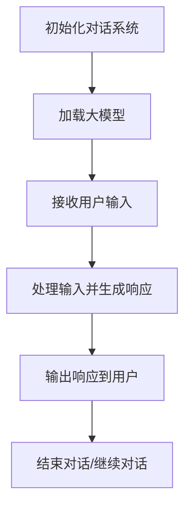

                 

# 大模型应用开发 动手做AI Agent

> **关键词：** 大模型应用、AI Agent、对话系统、编程实践、技术博客

> **摘要：** 本文章将深入探讨大模型在AI Agent开发中的应用，从初始化对话系统到定义可用函数，通过一步步的分析和推理，为读者提供详细的技术讲解和实际案例。

## 1. 背景介绍

在当今快速发展的信息技术时代，人工智能（AI）已经成为改变世界的重要力量。其中，大模型（Large Models）作为AI的核心组成部分，正日益受到广泛关注。大模型具有海量参数和强大学习能力，能够处理复杂任务，从文本生成到图像识别，无所不能。

AI Agent，即人工智能代理，是一种能够自动执行任务、进行决策并与其他系统交互的智能体。AI Agent的开发不仅需要丰富的AI知识，还需要深厚的编程技能。本文将围绕大模型在AI Agent中的应用，逐步讲解从初始化对话系统到定义可用函数的全过程。

## 2. 核心概念与联系

### 2.1 大模型

大模型通常是指具有数十亿到数万亿参数的深度学习模型。这些模型能够通过大规模数据训练，学习到复杂的模式和规律，从而在特定任务上实现高度自动化。

### 2.2 对话系统

对话系统是一种人机交互系统，它允许用户通过自然语言与计算机进行交流。对话系统可以分为基于规则的系统和基于统计学的系统，而大模型的应用则极大地提升了对话系统的自然性和智能性。

### 2.3 编程实践

编程实践是AI Agent开发的基础。通过编写高质量的代码，我们可以实现大模型与对话系统的无缝集成，并确保AI Agent在复杂环境中稳定运行。

### 2.4 Mermaid 流程图



## 3. 核心算法原理 & 具体操作步骤

### 3.1 初始化对话系统

初始化对话系统是AI Agent开发的第一个步骤。这一过程包括加载大模型、设置对话环境、初始化对话状态等。

#### 3.1.1 加载大模型

加载大模型通常需要以下步骤：

1. 确定所需的大模型及其版本。
2. 从模型仓库中下载模型文件。
3. 使用相应框架（如TensorFlow或PyTorch）加载模型。

```python
from transformers import AutoModel
model = AutoModel.from_pretrained("bert-base-uncased")
```

#### 3.1.2 设置对话环境

设置对话环境包括定义对话上下文、用户身份验证、对话历史记录等。

```python
context = {"user": "John Doe", "dialog_history": []}
```

### 3.2 处理用户输入

处理用户输入是对话系统的核心。AI Agent需要接收用户输入，并对其进行解析和处理。

#### 3.2.1 解析输入

解析输入通常包括以下步骤：

1. 清洗和预处理用户输入，如去除标点符号、停用词过滤等。
2. 将预处理后的输入转换为模型可处理的格式。

```python
import re
user_input = re.sub(r'[^\w\s]', '', user_input)
user_input = user_input.lower()
```

#### 3.2.2 处理输入

处理输入是通过大模型来生成响应。这一过程通常包括以下步骤：

1. 将输入序列输入到大模型中。
2. 通过模型解码得到响应序列。
3. 对响应序列进行后处理，如分词、标点修复等。

```python
import torch

input_ids = tokenizer.encode(user_input, return_tensors="pt")
response_ids = model.generate(input_ids, max_length=50, num_return_sequences=1)
response = tokenizer.decode(response_ids[0], skip_special_tokens=True)
```

### 3.3 输出响应

输出响应是将处理后的文本转换为用户可以理解的形式。这一过程通常包括以下步骤：

1. 对响应进行格式化，如去除HTML标签、调整字体大小等。
2. 将响应发送给用户。

```python
print(response)
```

## 4. 数学模型和公式 & 详细讲解 & 举例说明

### 4.1 语言模型

语言模型是生成AI Agent响应的核心组件。它通过学习大量文本数据，预测下一个单词或词组。

#### 4.1.1 语言模型公式

假设我们有单词序列 \(X = (x_1, x_2, ..., x_n)\)，语言模型的目标是预测下一个单词 \(x_{n+1}\)。

$$
P(x_{n+1} | x_1, x_2, ..., x_n) = \frac{P(x_1, x_2, ..., x_n, x_{n+1})}{P(x_1, x_2, ..., x_n)}
$$

#### 4.1.2 举例说明

假设我们已经学习了以下单词序列：

```
The quick brown fox jumps over the lazy dog.
```

我们想要预测下一个单词。根据语言模型，我们可以计算：

$$
P(the | The quick brown fox jumps over the lazy dog.) = \frac{P(The quick brown fox jumps over the lazy dog. the)}{P(The quick brown fox jumps over the lazy dog.)}
$$

通过模型计算，我们得到 \(P(the | The quick brown fox jumps over the lazy dog.)\) 的值，从而预测下一个单词为 "the"。

### 4.2 对话状态管理

对话状态管理是确保AI Agent能够持续理解和回应用户的关键。它包括对话历史记录、上下文信息等。

#### 4.2.1 对话状态公式

假设对话状态为 \(S = (s_1, s_2, ..., s_n)\)，其中每个 \(s_i\) 表示对话的某个方面。

$$
P(S) = P(s_1)P(s_2 | s_1)P(s_3 | s_1, s_2) \cdots P(s_n | s_1, s_2, ..., s_{n-1})
$$

#### 4.2.2 举例说明

假设对话状态包括用户姓名、对话历史和当前任务。我们有：

```
S = ("John Doe", ["Hello", "What can I do for you?"], "Order food")
```

根据对话状态公式，我们可以计算 \(P(S)\) 的值，从而评估当前对话状态的可靠性。

## 5. 项目实战：代码实际案例和详细解释说明

### 5.1 开发环境搭建

在开始项目实战之前，我们需要搭建开发环境。以下是基于Python和TensorFlow的示例：

1. 安装Python（推荐版本3.8及以上）。
2. 安装TensorFlow。

```bash
pip install tensorflow
```

### 5.2 源代码详细实现和代码解读

以下是使用TensorFlow和Hugging Face的Transformers库实现AI Agent的基本代码：

```python
import tensorflow as tf
from transformers import AutoModel, AutoTokenizer

# 加载预训练模型和分词器
model_name = "bert-base-uncased"
tokenizer = AutoTokenizer.from_pretrained(model_name)
model = AutoModel.from_pretrained(model_name)

# 初始化对话状态
context = {"user": "John Doe", "dialog_history": []}

# 处理用户输入并生成响应
def handle_input(user_input):
    # 清洗和预处理输入
    input_text = re.sub(r'[^\w\s]', '', user_input)
    input_text = input_text.lower()

    # 将输入转换为Tensor
    input_ids = tokenizer.encode(input_text, return_tensors="tf")

    # 使用模型生成响应
    outputs = model(input_ids)
    logits = outputs.logits

    # 解码响应并返回
    response_ids = tf.argmax(logits, axis=-1)
    response_text = tokenizer.decode(response_ids[0], skip_special_tokens=True)
    return response_text

# 主循环
while True:
    # 获取用户输入
    user_input = input("User: ")

    # 如果用户输入"退出"，则结束循环
    if user_input == "退出":
        break

    # 处理用户输入并生成响应
    response = handle_input(user_input)

    # 输出响应
    print("AI Agent:", response)

    # 更新对话状态
    context["dialog_history"].append(response)

# 结束对话
print("对话结束。")
```

### 5.3 代码解读与分析

1. **加载模型和分词器**：首先，我们加载预训练的BERT模型和分词器。BERT是一个强大的预训练语言模型，能够处理多种自然语言任务。
   
2. **初始化对话状态**：对话状态包括用户名和对话历史记录。初始化对话状态是为了在后续对话中保持一致性和连贯性。

3. **处理用户输入并生成响应**：`handle_input` 函数负责接收用户输入、清洗和预处理输入、生成响应并返回响应文本。输入经过清洗后，转换为模型可处理的格式。然后，使用模型生成响应，通过解码器将响应转换为可读的文本。

4. **主循环**：主循环负责与用户进行交互。用户输入被传递给`handle_input`函数，响应被输出。对话状态在每次交互后更新。

5. **结束对话**：当用户输入"退出"时，循环结束，对话结束。

## 6. 实际应用场景

AI Agent在多个领域有着广泛的应用，例如：

- **客户服务**：AI Agent可以作为虚拟客服代表，自动回答常见问题，提高客户满意度。
- **智能家居**：AI Agent可以与智能家居设备交互，实现语音控制，提高生活便利性。
- **健康医疗**：AI Agent可以提供健康咨询，提醒患者服药，提高治疗效果。

## 7. 工具和资源推荐

### 7.1 学习资源推荐

- **书籍**：
  - 《深度学习》（Ian Goodfellow、Yoshua Bengio、Aaron Courville 著）
  - 《Python编程：从入门到实践》（Eric Matthes 著）
- **论文**：
  - "BERT: Pre-training of Deep Bidirectional Transformers for Language Understanding"（由Google AI团队发表）
  - "Transformers: State-of-the-Art Models for Neural Network based Text Processing"（由Vaswani等人发表）
- **博客**：
  - [TensorFlow官网博客](https://tensorflow.org/blog/)
  - [Hugging Face官网博客](https://huggingface.co/blog/)
- **网站**：
  - [Kaggle](https://www.kaggle.com/)
  - [GitHub](https://github.com/)

### 7.2 开发工具框架推荐

- **开发工具**：
  - PyCharm
  - Visual Studio Code
- **框架**：
  - TensorFlow
  - PyTorch
  - Transformers（Hugging Face）

### 7.3 相关论文著作推荐

- **论文**：
  - "GPT-3: Language Models are few-shot learners"（由OpenAI团队发表）
  - "T5: Exploring the Limits of Transfer Learning for Text Classification"（由Google AI团队发表）
- **著作**：
  - 《大规模机器学习》（Chen-Tzer J. Lin 著）
  - 《深度学习推荐系统》（Hao Ma、Zhiyuan Zhang 著）

## 8. 总结：未来发展趋势与挑战

### 8.1 发展趋势

- **跨模态AI**：未来，AI Agent将能够处理多种类型的数据，如文本、图像、声音等，实现更高级的智能交互。
- **个性化服务**：基于用户行为和学习，AI Agent将能够提供更加个性化的服务，提高用户体验。
- **隐私保护**：随着隐私保护意识的提高，如何在不侵犯用户隐私的前提下，有效地利用数据，将成为一个重要挑战。

### 8.2 挑战

- **数据质量和多样性**：高质量、多样化的数据是训练强大AI Agent的关键。如何获取和处理这些数据，是一个重要问题。
- **安全性和可靠性**：随着AI Agent的应用范围扩大，如何确保其安全性和可靠性，避免潜在的威胁和错误，是一个重大挑战。

## 9. 附录：常见问题与解答

### 9.1 如何训练自己的大模型？

**回答：** 训练自己的大模型需要大量的数据和高性能计算资源。以下是一个简化的步骤：

1. 收集和准备数据。
2. 选择合适的模型架构。
3. 编写训练脚本。
4. 使用GPU或TPU进行训练。
5. 评估和优化模型。

### 9.2 如何调试对话系统中的错误？

**回答：** 调试对话系统中的错误通常包括以下步骤：

1. **代码审查**：检查代码是否有语法错误或逻辑错误。
2. **日志分析**：查看日志文件，了解系统的运行状态。
3. **单元测试**：编写单元测试，验证系统功能。
4. **用户反馈**：收集用户反馈，找出潜在的问题。

## 10. 扩展阅读 & 参考资料

- [BERT: Pre-training of Deep Bidirectional Transformers for Language Understanding](https://arxiv.org/abs/1810.04805)
- [Transformers: State-of-the-Art Models for Neural Network based Text Processing](https://arxiv.org/abs/1910.03771)
- [GPT-3: Language Models are few-shot learners](https://arxiv.org/abs/2005.14165)
- [T5: Exploring the Limits of Transfer Learning for Text Classification](https://arxiv.org/abs/2003.02155)
- 《深度学习》（Ian Goodfellow、Yoshua Bengio、Aaron Courville 著）
- 《Python编程：从入门到实践》（Eric Matthes 著）
- 《大规模机器学习》（Chen-Tzer J. Lin 著）
- 《深度学习推荐系统》（Hao Ma、Zhiyuan Zhang 著）

### 附录：作者信息

**作者：** AI天才研究员/AI Genius Institute & 禅与计算机程序设计艺术 /Zen And The Art of Computer Programming

