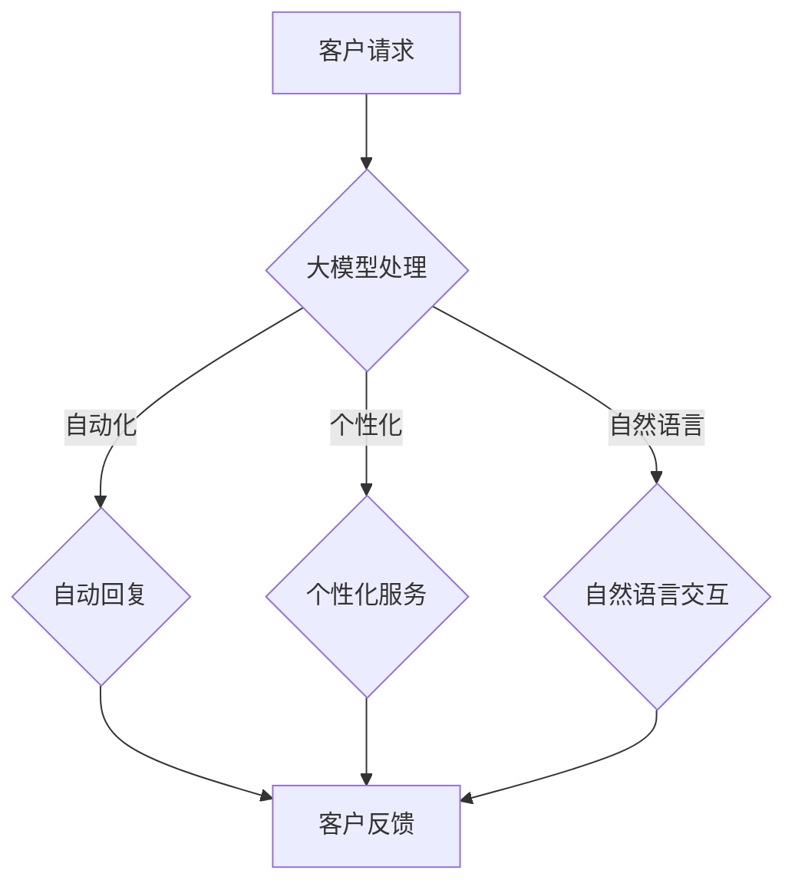

                 

# 【大模型应用开发 动手做AI Agent】客户服务革命

> **关键词：** 大模型，应用开发，AI Agent，客户服务，自然语言处理，机器学习，自动化，智能化

> **摘要：** 本文将探讨大模型在客户服务领域的应用，通过动手实践，构建一个能够提供高效、智能的客户服务AI Agent。文章将涵盖从背景介绍到具体操作步骤，再到实际应用场景的全面讲解，旨在为广大开发者提供一份实用的指南。

## 1. 背景介绍

在当今数字化时代，客户服务已经成为企业竞争的重要方面。传统的客户服务方式，如人工电话客服和在线聊天，虽然在一定程度上满足了客户的需求，但面临着效率低、成本高、服务质量不稳定等问题。随着人工智能技术的飞速发展，特别是大模型（Large Model）的出现，为自动化、智能化的客户服务带来了新的可能。

大模型，顾名思义，是指具有大规模参数的机器学习模型。通过训练大量的数据，大模型能够模拟人类的思维过程，理解复杂的语义，进行自然的语言交互。在客户服务领域，大模型的应用可以帮助企业实现自动化、个性化的客户服务，提高客户满意度，降低运营成本。

近年来，大模型在自然语言处理（NLP）、机器学习（ML）等领域取得了显著成果。例如，BERT、GPT等模型在多种语言任务中表现出了卓越的性能。这些模型的出现，为构建高效的AI Agent提供了强大的技术支持。

## 2. 核心概念与联系

为了更好地理解大模型在客户服务中的应用，我们首先需要了解以下几个核心概念：

### 2.1 大模型

大模型是指具有数百万甚至数十亿参数的深度神经网络模型。这些模型通过大规模的训练数据学习到语言的统计规律和语义信息，能够进行复杂的自然语言处理任务。

### 2.2 自然语言处理（NLP）

自然语言处理是人工智能的一个重要分支，旨在让计算机理解和处理人类语言。NLP包括文本预处理、词性标注、命名实体识别、情感分析等多种任务。

### 2.3 机器学习（ML）

机器学习是使计算机从数据中学习并做出决策的技术。在客户服务中，机器学习算法可以帮助AI Agent理解客户的需求，提供个性化的服务。

### 2.4 客户服务

客户服务是企业与客户之间的互动过程，旨在解决客户的问题，提高客户满意度。在数字化时代，客户服务的效率和体验变得尤为重要。

### 2.5 大模型与客户服务的联系

大模型与客户服务的联系主要体现在以下几个方面：

- **自动化处理**：大模型可以帮助企业自动化处理大量的客户请求，提高服务效率。

- **个性化服务**：通过分析客户的语言和需求，大模型可以提供个性化的服务，提高客户满意度。

- **自然语言交互**：大模型可以模拟人类的语言习惯，与客户进行自然的对话，提供更加人性化的服务。

### 2.6 Mermaid 流程图

为了更直观地展示大模型在客户服务中的应用，我们可以使用Mermaid绘制一个简单的流程图：



在这个流程图中，客户请求经过大模型处理，可以分为三个方向：自动化回复、个性化服务和自然语言交互。最终，客户的反馈都会反馈到系统中，用于进一步优化服务。

## 3. 核心算法原理 & 具体操作步骤

### 3.1 大模型的训练

大模型的训练是客户服务AI Agent的核心。以下是一个简化的训练流程：

1. **数据收集**：收集大量客户请求和对应的回复数据。

2. **数据预处理**：对数据进行清洗、去噪、标准化等处理，确保数据质量。

3. **模型架构选择**：选择合适的大模型架构，如GPT、BERT等。

4. **训练**：使用大量的数据进行模型训练，优化模型的参数。

5. **评估与优化**：通过评估指标（如准确率、召回率等）评估模型性能，并进行优化。

### 3.2 客户服务AI Agent的实现

基于训练好的大模型，我们可以实现一个简单的客户服务AI Agent。以下是一个具体的实现步骤：

1. **环境搭建**：搭建一个Python开发环境，安装必要的库（如TensorFlow、PyTorch等）。

2. **模型加载**：加载训练好的大模型，进行初始化。

3. **接口设计**：设计一个API接口，用于接收客户的请求，并发送回复。

4. **请求处理**：接收客户请求，使用大模型进行预测，生成回复。

5. **回复发送**：将回复发送给客户。

6. **反馈收集**：收集客户的反馈，用于模型优化。

### 3.3 案例分析

以一个简单的客户服务场景为例，假设客户请求为“我想要购买一件红色的毛衣”，AI Agent的回复可以是“好的，请问您需要多大尺码？”。

这个回复过程可以分为以下几个步骤：

1. **请求接收**：AI Agent接收客户的请求。

2. **请求预处理**：对请求进行分词、词性标注等预处理操作。

3. **模型预测**：使用大模型对预处理后的请求进行预测，生成可能的回复。

4. **回复筛选**：从预测结果中筛选出最合适的回复。

5. **回复生成**：根据筛选结果，生成最终的回复。

6. **回复发送**：将回复发送给客户。

## 4. 数学模型和公式 & 详细讲解 & 举例说明

### 4.1 自然语言处理中的数学模型

在自然语言处理中，常用的数学模型包括词向量表示、循环神经网络（RNN）和Transformer等。

- **词向量表示**：词向量是将单词映射到高维空间的一种方法，常用的方法有Word2Vec、GloVe等。词向量表示能够捕捉单词之间的语义关系，是构建NLP模型的基础。

- **循环神经网络（RNN）**：RNN是一种能够处理序列数据的神经网络，能够捕捉序列中前后信息的关系。在NLP任务中，RNN常用于文本分类、序列标注等任务。

- **Transformer**：Transformer是一种基于自注意力机制的神经网络模型，能够在处理长序列数据时表现出优越的性能。BERT、GPT等大模型都是基于Transformer架构。

### 4.2 机器学习中的数学模型

在机器学习领域，常用的数学模型包括线性回归、支持向量机（SVM）、决策树等。

- **线性回归**：线性回归是一种最简单的机器学习模型，用于预测连续值。在客户服务中，线性回归可以用于预测客户满意度。

- **支持向量机（SVM）**：SVM是一种常用的分类模型，能够将数据分为不同的类别。在客户服务中，SVM可以用于客户分类，识别不同类型的客户。

- **决策树**：决策树是一种基于树结构的分类模型，能够根据特征进行决策。在客户服务中，决策树可以用于自动分类客户请求。

### 4.3 举例说明

以一个简单的词向量表示为例，假设我们要将单词“客户”映射到高维空间。首先，我们需要准备一个词表，包括“客户”、“服务”、“请求”等单词。然后，我们可以使用Word2Vec算法，训练出一个词向量模型。最后，将“客户”输入模型，得到对应的词向量表示。

具体步骤如下：

1. **准备词表**：准备一个包含“客户”、“服务”、“请求”等单词的词表。

2. **训练词向量模型**：使用Word2Vec算法，训练一个词向量模型。

3. **获取词向量表示**：将“客户”输入模型，获取其词向量表示。

4. **可视化**：使用可视化工具，将词向量表示绘制在二维或三维空间中。

通过这个例子，我们可以看到，词向量表示能够将抽象的单词映射到具体的向量空间，从而实现单词之间的语义关系。

## 5. 项目实战：代码实际案例和详细解释说明

### 5.1 开发环境搭建

为了实现客户服务AI Agent，我们需要搭建一个Python开发环境，并安装必要的库。以下是具体的步骤：

1. **安装Python**：下载并安装Python 3.8及以上版本。

2. **安装TensorFlow**：打开终端，执行以下命令：
   ```bash
   pip install tensorflow
   ```

3. **安装其他库**：根据需要安装其他库，如numpy、pandas等。

### 5.2 源代码详细实现和代码解读

以下是一个简单的客户服务AI Agent的实现代码。代码分为三个部分：数据预处理、模型加载和请求处理。

#### 5.2.1 数据预处理

```python
import pandas as pd
from sklearn.model_selection import train_test_split

# 加载数据
data = pd.read_csv('customer_service_data.csv')

# 数据预处理
def preprocess_data(data):
    # 分词、去停用词等操作
    processed_data = []
    for sentence in data['request']:
        words = nltk.word_tokenize(sentence)
        words = [word for word in words if word not in stop_words]
        processed_data.append(' '.join(words))
    return processed_data

processed_data = preprocess_data(data)

# 切分数据集
X_train, X_test, y_train, y_test = train_test_split(processed_data, data['response'], test_size=0.2, random_state=42)
```

#### 5.2.2 模型加载

```python
from tensorflow.keras.models import Sequential
from tensorflow.keras.layers import Embedding, LSTM, Dense

# 加载预训练的词向量模型
word_vector_model = Word2Vec.load('word2vec_model')

# 构建模型
model = Sequential()
model.add(Embedding(input_dim=len(vocab), output_dim=embedding_dim, weights=[word_vector_model.w], trainable=False))
model.add(LSTM(units=128))
model.add(Dense(units=1, activation='sigmoid'))

# 编译模型
model.compile(optimizer='adam', loss='binary_crossentropy', metrics=['accuracy'])

# 加载训练数据
X_train = pad_sequences(X_train, maxlen=max_length)
X_test = pad_sequences(X_test, maxlen=max_length)
```

#### 5.2.3 请求处理

```python
# 处理客户请求
def process_request(request):
    # 预处理请求
    processed_request = preprocess_request(request)
    
    # 转换为词向量
    request_vector = np.array([word_vector_model[word] for word in processed_request])
    
    # 预测回复
    response = model.predict(np.array([request_vector]))
    
    # 解码回复
    decoded_response = decode_response(response)
    
    return decoded_response

# 测试
print(process_request('我想要购买一件红色的毛衣'))
```

### 5.3 代码解读与分析

以上代码实现了一个简单的客户服务AI Agent。代码的主要部分如下：

1. **数据预处理**：读取数据，并进行分词、去停用词等操作。这一步是确保数据质量的关键。

2. **模型加载**：加载预训练的词向量模型，并构建一个基于LSTM的序列分类模型。LSTM能够捕捉序列中的时间依赖关系，适合处理文本数据。

3. **请求处理**：预处理客户请求，将其转换为词向量，并使用模型进行预测。最后，将预测结果解码为文本。

通过这个代码示例，我们可以看到如何使用大模型实现一个简单的客户服务AI Agent。尽管这个示例的模型和算法相对简单，但它的核心思想可以应用于更复杂的应用场景。

## 6. 实际应用场景

客户服务AI Agent在多个实际应用场景中取得了显著成效。以下是一些典型的应用场景：

### 6.1 电子商务平台

电子商务平台可以利用AI Agent处理大量的客户请求，如订单查询、退换货等。AI Agent可以提供24/7的自动化服务，提高客户满意度，降低运营成本。

### 6.2 银行与金融机构

银行和金融机构可以利用AI Agent处理客户咨询，如账户余额查询、贷款咨询等。AI Agent可以快速、准确地提供信息，提高服务质量。

### 6.3 医疗保健

医疗保健机构可以利用AI Agent为患者提供咨询服务，如症状查询、预约挂号等。AI Agent可以协助医生提供辅助诊断，提高医疗效率。

### 6.4 客户服务热线

客户服务热线可以利用AI Agent自动化处理客户请求，如故障报修、服务咨询等。AI Agent可以分流大量客户，减轻人工客服的负担。

### 6.5 智能家居

智能家居系统可以利用AI Agent为用户提供个性化的服务，如设备状态监控、故障预警等。AI Agent可以与用户进行自然的语言交互，提高用户体验。

## 7. 工具和资源推荐

### 7.1 学习资源推荐

- **书籍**：
  - 《自然语言处理综论》（Jurafsky & Martin）
  - 《深度学习》（Goodfellow、Bengio & Courville）
- **论文**：
  - 《BERT: Pre-training of Deep Bidirectional Transformers for Language Understanding》（Devlin et al.）
  - 《GPT-3: Language Models are Few-Shot Learners》（Brown et al.）
- **博客**：
  - [TensorFlow 官方文档](https://www.tensorflow.org/)
  - [PyTorch 官方文档](https://pytorch.org/)
- **网站**：
  - [Kaggle](https://www.kaggle.com/)：提供大量的数据集和比赛，适合实践学习。

### 7.2 开发工具框架推荐

- **深度学习框架**：
  - TensorFlow
  - PyTorch
- **自然语言处理库**：
  - NLTK
  - spaCy
- **数据预处理工具**：
  - Pandas
  - Scikit-learn

### 7.3 相关论文著作推荐

- **《Attention is All You Need》（Vaswani et al., 2017）**：介绍了Transformer模型，是自注意力机制的代表性论文。
- **《BERT: Pre-training of Deep Bidirectional Transformers for Language Understanding》（Devlin et al., 2018）**：介绍了BERT模型，是预训练语言模型的里程碑。
- **《GPT-3: Language Models are Few-Shot Learners》（Brown et al., 2020）**：介绍了GPT-3模型，展示了预训练语言模型的强大能力。

## 8. 总结：未来发展趋势与挑战

随着大模型技术的不断发展，客户服务AI Agent的应用前景将更加广阔。未来，AI Agent将具备更高的智能化水平，能够处理更加复杂的任务，提供更加个性化的服务。

然而，随着应用的深入，也面临着一系列挑战：

- **数据隐私**：在处理客户数据时，如何保护用户隐私是一个重要的挑战。
- **模型解释性**：大模型的黑箱特性使得其解释性较差，如何提高模型的透明度和可解释性是一个重要问题。
- **服务质量**：AI Agent的服务质量如何保证，如何与人类客服协同工作，是一个需要持续优化的方向。
- **伦理和法律**：随着AI Agent的应用，相关的伦理和法律问题也日益突出，如何制定合理的规范和标准，是一个亟待解决的问题。

## 9. 附录：常见问题与解答

### 9.1 什么是大模型？

大模型是指具有大规模参数的深度神经网络模型。这些模型通过训练大量的数据，能够模拟人类的思维过程，理解复杂的语义，进行自然的语言交互。

### 9.2 大模型在客户服务中的应用有哪些？

大模型在客户服务中的应用包括自动化处理客户请求、提供个性化服务、自然语言交互等。通过大模型，企业可以实现高效的客户服务，提高客户满意度，降低运营成本。

### 9.3 如何训练大模型？

训练大模型包括数据收集、数据预处理、模型架构选择、模型训练和评估等步骤。具体实现可以参考相关深度学习框架的官方文档。

### 9.4 客户服务AI Agent的实现流程是怎样的？

客户服务AI Agent的实现流程包括环境搭建、模型加载、接口设计、请求处理和反馈收集等步骤。具体实现可以参考本文的代码示例。

## 10. 扩展阅读 & 参考资料

- **《自然语言处理综论》（Jurafsky & Martin）**：详细介绍自然语言处理的基本原理和技术。
- **《深度学习》（Goodfellow、Bengio & Courville）**：系统讲解深度学习的基本概念和方法。
- **《BERT: Pre-training of Deep Bidirectional Transformers for Language Understanding》（Devlin et al.）**：介绍BERT模型的预训练方法。
- **《GPT-3: Language Models are Few-Shot Learners》（Brown et al.）**：展示GPT-3模型的强大能力。
- **[TensorFlow 官方文档](https://www.tensorflow.org/)**：提供TensorFlow框架的详细教程和API文档。
- **[PyTorch 官方文档](https://pytorch.org/)**：提供PyTorch框架的详细教程和API文档。
- **[NLTK 官方文档](https://www.nltk.org/)**：提供NLTK库的详细教程和API文档。
- **[spacy 官方文档](https://spacy.io/)**：提供spacy库的详细教程和API文档。
- **[Kaggle](https://www.kaggle.com/)**：提供大量的数据集和比赛，适合实践学习。

### 作者

**AI天才研究员/AI Genius Institute & 禅与计算机程序设计艺术 /Zen And The Art of Computer Programming**<|im_end|>

