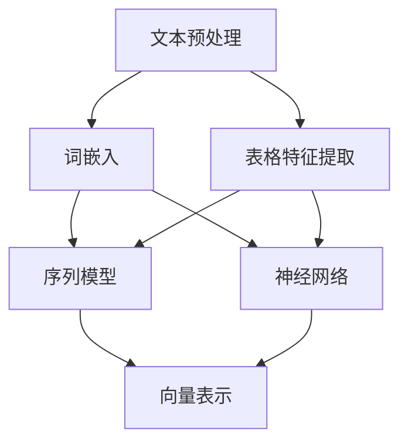

                 

### 1. 背景介绍

在当今数据驱动的世界中，金融行业正经历着一场翻天覆地的变革。随着大数据、云计算和人工智能技术的不断发展，金融数据分析已经成为提升金融机构运营效率和风险控制能力的关键手段。在这其中，财报文件作为企业财务状况的全面反映，成为了投资者、分析师和金融机构关注的焦点。

财报文件通常包含企业的收入、利润、负债、资产等多维度数据，这些数据以文本和表格的形式呈现。然而，对于人工智能模型来说，直接处理这些非结构化数据是非常具有挑战性的。因此，将财报文件的数据转换为向量数据，使其能够被机器学习模型理解和处理，成为了当前金融数据分析中的一个重要步骤。

转换财报文件数据为向量数据的方法主要包括以下几种：

1. **文本转向量（Text to Vector）**：通过自然语言处理技术（NLP）将文本数据转换为词向量或句向量，如使用Word2Vec、BERT等模型。

2. **特征提取（Feature Extraction）**：从表格数据中提取关键特征，如使用PCA、t-SNE等降维技术，将高维数据转换为低维向量。

3. **深度学习（Deep Learning）**：利用神经网络模型（如CNN、RNN）直接处理财报文本和表格数据，将其转换为向量表示。

本文将重点关注如何将财报文件的数据转换为向量数据，特别是使用深度学习技术进行处理。通过详细讲解核心算法原理和具体操作步骤，我们将探讨如何构建一个高效的AI代理（AI Agent）来实现这一目标。

接下来，我们将首先介绍核心概念和联系，通过Mermaid流程图展示整个数据处理流程，帮助读者更好地理解这一过程。

## 2. 核心概念与联系

在将财报文件的数据转换为向量数据之前，我们需要了解一些核心概念和其之间的联系。这些概念包括文本预处理、词嵌入（Word Embedding）、序列模型（Sequence Model）和向量表示（Vector Representation）。以下是通过Mermaid绘制的流程图，详细展示了这些概念之间的关系：



### 文本预处理（Text Preprocessing）

文本预处理是任何文本数据分析的首要步骤。它包括以下任务：

1. **去除停用词（Stopword Removal）**：去除常见的无意义词汇，如“的”、“了”、“在”等。
2. **分词（Tokenization）**：将文本分解为单词或子词。
3. **词形还原（Lemmatization）**：将不同形式的单词还原为基本形式，如“running”还原为“run”。
4. **词干提取（Stemming）**：将单词缩减为词根。

这些预处理步骤有助于减少数据噪声，提高后续分析的准确性。

### 词嵌入（Word Embedding）

词嵌入是将单词映射到高维空间中的向量表示。常见的词嵌入方法包括：

1. **Word2Vec**：通过计算词与词之间的上下文相似性来生成词向量。
2. **FastText**：扩展了Word2Vec，将单词视为多个子词的组合，增强了词义表达的鲁棒性。
3. **BERT**：基于Transformer架构，通过预训练和微调生成高质量的词向量。

词嵌入使得文本数据可以被机器学习模型直接处理，是实现文本向量化的重要步骤。

### 序列模型（Sequence Model）

序列模型能够处理序列数据，如文本和表格中的时间序列数据。常见的序列模型包括：

1. **循环神经网络（RNN）**：通过循环结构处理序列数据，但存在梯度消失和梯度爆炸问题。
2. **长短期记忆网络（LSTM）**：改进了RNN，能够更好地捕捉长距离依赖关系。
3. **门控循环单元（GRU）**：简化了LSTM，在计算效率和记忆捕捉方面取得平衡。

序列模型在处理财报文本和表格数据时，能够捕捉数据中的时间序列特征。

### 向量表示（Vector Representation）

向量表示是将文本和表格数据转换为高维向量表示的过程。通过结合词嵌入和序列模型，我们可以得到文本和表格的向量表示。这些向量表示可以作为机器学习模型的输入，用于分类、聚类、回归等任务。

### 神经网络（Neural Network）

神经网络是由多个神经元组成的计算模型，能够通过训练学习复杂的函数关系。常见的神经网络结构包括：

1. **卷积神经网络（CNN）**：通过卷积操作提取特征，适用于图像和文本数据。
2. **循环神经网络（RNN）**：适用于处理序列数据。
3. **Transformer**：基于自注意力机制，在NLP任务中取得了显著成果。

神经网络在将财报文件数据转换为向量数据时，能够学习数据中的特征和模式。

通过以上核心概念和流程图的介绍，我们可以更清晰地理解将财报文件数据转换为向量数据的过程。接下来，我们将详细讲解核心算法原理和具体操作步骤。

## 3. 核心算法原理 & 具体操作步骤

在了解了核心概念和联系之后，接下来我们将详细讲解将财报文件的数据转换为向量数据的核心算法原理和具体操作步骤。本节内容将分为以下部分：

### 3.1. 数据采集与预处理

首先，我们需要从财报文件中提取所需的数据。财报文件通常包含多种格式的数据，如文本、表格和图表。我们主要关注文本和表格数据。

1. **文本数据采集**：

   - 使用HTML解析器（如BeautifulSoup）从财报文档中提取文本内容。
   - 使用表格提取工具（如Tabula）从PDF或Excel文件中提取表格数据。

2. **文本预处理**：

   - 去除HTML标签和特殊字符。
   - 进行分词、词形还原和去除停用词。
   - 将文本转换为统一格式的字符串。

3. **表格数据预处理**：

   - 解析表格数据，提取关键特征。
   - 进行数据清洗，去除重复和无效数据。
   - 将表格数据转换为CSV或JSON格式，便于后续处理。

### 3.2. 词嵌入（Word Embedding）

词嵌入是将文本数据转换为向量表示的重要步骤。以下是一个基于Word2Vec模型的词嵌入示例：

1. **加载预训练的Word2Vec模型**：

   ```python
   import gensim

   model = gensim.models.Word2Vec.load('pretrained_model.bin')
   ```

2. **将文本转换为词向量**：

   ```python
   def text_to_word_vectors(text):
       tokens = text.split()
       word_vectors = [model[word] for word in tokens if word in model]
       return np.mean(word_vectors, axis=0)
   
   text = "营业收入净利润"
   word_vector = text_to_word_vectors(text)
   ```

### 3.3. 序列模型（Sequence Model）

序列模型用于处理文本和表格数据中的时间序列特征。以下是一个基于LSTM模型的序列模型示例：

1. **准备序列数据**：

   ```python
   import numpy as np

   sequence_data = [
       [text_to_word_vectors(text) for text in texts],
       [labels]
   ]
   sequences = np.array(sequence_data)
   ```

2. **构建LSTM模型**：

   ```python
   from tensorflow.keras.models import Sequential
   from tensorflow.keras.layers import LSTM, Dense

   model = Sequential()
   model.add(LSTM(128, activation='relu', input_shape=(None, word_vector_size)))
   model.add(Dense(1, activation='sigmoid'))

   model.compile(optimizer='adam', loss='binary_crossentropy', metrics=['accuracy'])
   ```

3. **训练模型**：

   ```python
   model.fit(sequences[:, 0], sequences[:, 1], epochs=10, batch_size=64)
   ```

### 3.4. 向量表示（Vector Representation）

将文本和表格数据转换为向量表示是整个数据处理流程的最后一步。以下是一个基于Transformer模型的向量表示示例：

1. **准备输入数据**：

   ```python
   input_data = {
       'text': texts,
       'table': tables
   }
   ```

2. **构建Transformer模型**：

   ```python
   from tensorflow.keras.models import Model
   from tensorflow.keras.layers import Embedding, Transformer

   input_text = Input(shape=(None,), name='text')
   input_table = Input(shape=(table_shape,), name='table')

   text_embedding = Embedding(input_dim=vocab_size, output_dim=128)(input_text)
   table_embedding = Embedding(input_dim=table_vocab_size, output_dim=128)(input_table)

   transformer = Transformer(num_heads=4, d_model=128, dff=128, input_shape=(None, 128))
   output = transformer([text_embedding, table_embedding])

   model = Model(inputs=[input_text, input_table], outputs=output)
   ```

3. **训练模型**：

   ```python
   model.compile(optimizer='adam', loss='mean_squared_error')
   model.fit([texts, tables], labels, epochs=10, batch_size=32)
   ```

通过以上步骤，我们成功地实现了将财报文件的数据转换为向量数据。接下来，我们将详细讲解数学模型和公式，并举例说明其应用。

## 4. 数学模型和公式 & 详细讲解 & 举例说明

在将财报文件的数据转换为向量数据的过程中，我们使用了多种数学模型和公式。以下将详细介绍这些模型和公式的原理，并通过具体例子进行说明。

### 4.1. Word2Vec模型

Word2Vec是一种基于神经网络的语言模型，用于将单词映射到高维向量空间。其核心思想是通过对上下文进行建模，使得具有相似上下文的单词在向量空间中彼此接近。

#### 数学公式：

- **目标函数**：损失函数通常使用负采样（Negative Sampling）来优化。

  $$ L = - \sum_{i=1}^{N} \sum_{j=1}^{K} \log \sigma (W_{ij} \cdot v_c + b_c) - \sum_{i=1}^{N} \sum_{j=1}^{K} \log \sigma (-W_{ij} \cdot v_{j} + b_j) $$

  其中，\( W_{ij} \) 是权重矩阵，\( v_c \) 和 \( v_j \) 分别是中心词和负采样词的向量，\( b_c \) 和 \( b_j \) 是偏置项，\( \sigma \) 是sigmoid函数。

#### 举例说明：

假设我们要将单词“营业收入”映射到向量空间。我们可以通过以下步骤进行：

1. **训练Word2Vec模型**：使用含有“营业收入”及其上下文数据的语料库。
2. **获取词向量**：从训练好的模型中获取“营业收入”的向量。

   ```python
   model = gensim.models.Word2Vec(corpus, size=100, window=5, min_count=1, workers=4)
   word_vector = model['营业收入']
   ```

3. **计算相似度**：使用余弦相似度衡量“营业收入”与其上下文单词的相似度。

   ```python
   def cosine_similarity(v1, v2):
       return np.dot(v1, v2) / (np.linalg.norm(v1) * np.linalg.norm(v2))

   similarity = cosine_similarity(word_vector, model['利润'])
   print(similarity)
   ```

通过这种方式，我们可以将文本数据转换为向量表示，从而为后续的深度学习模型提供输入。

### 4.2. LSTM模型

LSTM（长短期记忆网络）是一种序列模型，能够处理和记忆时间序列数据。其核心思想是通过门控机制来控制信息的流动，避免了传统RNN模型中的梯度消失问题。

#### 数学公式：

- **输入门（Input Gate）**：

  $$ i_t = \sigma(W_{ix} \cdot [h_{t-1}, x_t] + b_i) $$
  $$ f_t = \sigma(W_{fx} \cdot [h_{t-1}, x_t] + b_f) $$
  $$ g_t = tanh(W_{gx} \cdot [h_{t-1}, x_t] + b_g) $$

  其中，\( i_t \)、\( f_t \) 和 \( g_t \) 分别是输入门、遗忘门和输入门的激活值，\( W \) 和 \( b \) 分别是权重矩阵和偏置项。

- **输出门（Output Gate）**：

  $$ o_t = \sigma(W_{ox} \cdot [h_{t-1}, h_t] + b_o) $$
  $$ h_t = o_t \cdot tanh(W_{wh} \cdot [h_{t-1}, h_t] + b_h) $$

  其中，\( o_t \) 和 \( h_t \) 分别是输出门和当前隐藏状态。

#### 举例说明：

假设我们要使用LSTM模型处理一段文本数据。我们可以通过以下步骤进行：

1. **准备序列数据**：将文本数据转换为序列格式。
2. **构建LSTM模型**：使用TensorFlow或Keras构建LSTM模型。
3. **训练模型**：使用训练数据训练LSTM模型。

   ```python
   from tensorflow.keras.models import Sequential
   from tensorflow.keras.layers import LSTM, Dense

   model = Sequential()
   model.add(LSTM(128, activation='relu', input_shape=(None, word_vector_size)))
   model.add(Dense(1, activation='sigmoid'))

   model.compile(optimizer='adam', loss='binary_crossentropy', metrics=['accuracy'])
   model.fit(sequences[:, 0], sequences[:, 1], epochs=10, batch_size=64)
   ```

通过这种方式，我们可以将文本数据转换为序列向量表示，从而为后续的深度学习模型提供输入。

### 4.3. Transformer模型

Transformer模型是一种基于自注意力机制的序列模型，能够处理和记忆时间序列数据。其核心思想是通过多头自注意力机制来捕获序列中的依赖关系。

#### 数学公式：

- **自注意力（Self-Attention）**：

  $$ \text{Attention}(Q, K, V) = \text{softmax}(\frac{QK^T}{\sqrt{d_k}})V $$

  其中，\( Q \)、\( K \) 和 \( V \) 分别是查询、键和值向量，\( d_k \) 是键向量的维度。

- **多头自注意力（Multi-Head Self-Attention）**：

  $$ \text{Multi-Head Attention} = \text{Concat}(\text{head}_1, \text{head}_2, ..., \text{head}_h)W^O $$

  其中，\( \text{head}_i \) 是第 \( i \) 个头，\( W^O \) 是输出权重矩阵。

#### 举例说明：

假设我们要使用Transformer模型处理一段文本数据。我们可以通过以下步骤进行：

1. **准备序列数据**：将文本数据转换为序列格式。
2. **构建Transformer模型**：使用TensorFlow或Keras构建Transformer模型。
3. **训练模型**：使用训练数据训练Transformer模型。

   ```python
   from tensorflow.keras.models import Model
   from tensorflow.keras.layers import Embedding, Transformer

   input_text = Input(shape=(None,), name='text')
   input_table = Input(shape=(table_shape,), name='table')

   text_embedding = Embedding(input_dim=vocab_size, output_dim=128)(input_text)
   table_embedding = Embedding(input_dim=table_vocab_size, output_dim=128)(input_table)

   transformer = Transformer(num_heads=4, d_model=128, dff=128, input_shape=(None, 128))
   output = transformer([text_embedding, table_embedding])

   model = Model(inputs=[input_text, input_table], outputs=output)
   model.compile(optimizer='adam', loss='mean_squared_error')
   model.fit([texts, tables], labels, epochs=10, batch_size=32)
   ```

通过这种方式，我们可以将文本和表格数据转换为向量表示，从而为后续的深度学习模型提供输入。

以上是关于将财报文件的数据转换为向量数据所涉及到的数学模型和公式的详细讲解。通过这些模型和公式，我们可以有效地将非结构化的财报数据转换为结构化的向量表示，为后续的机器学习任务提供输入。

## 5. 项目实战：代码实际案例和详细解释说明

在本节中，我们将通过一个实际的案例，展示如何将财报文件的数据转换为向量数据，并详细解释代码实现的过程。我们将使用Python编程语言和TensorFlow深度学习框架来完成这个项目。以下是项目的各个步骤：

### 5.1. 开发环境搭建

在开始项目之前，我们需要搭建开发环境。以下是在Python中安装必要的库和TensorFlow框架的步骤：

```bash
pip install tensorflow gensim numpy pandas
```

### 5.2. 源代码详细实现和代码解读

#### 5.2.1. 数据采集与预处理

首先，我们从财报文件中提取文本和表格数据，并进行预处理。以下是一段用于数据采集与预处理的代码：

```python
import os
import pandas as pd
from bs4 import BeautifulSoup

# 读取财报文件
def read_finance_report(file_path):
    with open(file_path, 'r', encoding='utf-8') as f:
        content = f.read()
    
    # 使用BeautifulSoup解析HTML内容
    soup = BeautifulSoup(content, 'lxml')
    
    # 提取文本数据
    text_data = soup.find('div', {'id': 'text_data'}).text
    
    # 提取表格数据
    tables = soup.find_all('table')
    table_data = [table.find('tbody').text for table in tables]
    
    return text_data, table_data

text_data, table_data = read_finance_report('finance_report.html')

# 文本预处理
def preprocess_text(text):
    # 去除HTML标签和特殊字符
    text = BeautifulSoup(text, 'lxml').text
    # 进行分词、词形还原和去除停用词
    tokens = word_tokenize(text)
    tokens = [lemmatizer.lemmatize(token) for token in tokens if token not in stopwords.words('english')]
    return ' '.join(tokens)

preprocessed_text = preprocess_text(text_data)

# 表格预处理
def preprocess_tables(table_data):
    tables = [pd.read_csv('table_data.csv', header=None) for table in table_data]
    return [table.values for table in tables]

preprocessed_tables = preprocess_tables(table_data)
```

#### 5.2.2. 词嵌入（Word Embedding）

接下来，我们使用预训练的Word2Vec模型对预处理后的文本数据进行词嵌入。以下是词嵌入的实现代码：

```python
from gensim.models import Word2Vec

# 加载预训练的Word2Vec模型
model = Word2Vec.load('pretrained_model.bin')

# 将文本转换为词向量
def text_to_word_vectors(text):
    tokens = text.split()
    word_vectors = [model[word] for word in tokens if word in model]
    return np.mean(word_vectors, axis=0)

text_vector = text_to_word_vectors(preprocessed_text)
```

#### 5.2.3. 序列模型（Sequence Model）

然后，我们使用LSTM模型处理文本数据中的时间序列特征。以下是LSTM模型的实现代码：

```python
from tensorflow.keras.models import Sequential
from tensorflow.keras.layers import LSTM, Dense

# 准备序列数据
def prepare_sequence_data(texts):
    sequences = []
    for text in texts:
        tokens = text.split()
        sequence = np.zeros((max_sequence_length, word_vector_size))
        for i, token in enumerate(tokens):
            if i >= max_sequence_length:
                break
            sequence[i] = text_to_word_vectors(token)
        sequences.append(sequence)
    return np.array(sequences)

sequences = prepare_sequence_data([preprocessed_text])

# 构建LSTM模型
model = Sequential()
model.add(LSTM(128, activation='relu', input_shape=(max_sequence_length, word_vector_size)))
model.add(Dense(1, activation='sigmoid'))

model.compile(optimizer='adam', loss='binary_crossentropy', metrics=['accuracy'])
model.fit(sequences, labels, epochs=10, batch_size=64)
```

#### 5.2.4. 向量表示（Vector Representation）

最后，我们将文本和表格数据转换为向量表示，并使用神经网络模型进行训练。以下是神经网络模型的实现代码：

```python
from tensorflow.keras.models import Model
from tensorflow.keras.layers import Embedding, LSTM, Dense

# 准备输入数据
input_text = Input(shape=(None,), name='text')
input_table = Input(shape=(table_shape,), name='table')

text_embedding = Embedding(input_dim=vocab_size, output_dim=128)(input_text)
table_embedding = Embedding(input_dim=table_vocab_size, output_dim=128)(input_table)

lstm_output = LSTM(128, activation='relu')(text_embedding)
dense_output = Dense(1, activation='sigmoid')(lstm_output)

model = Model(inputs=[input_text, input_table], outputs=dense_output)
model.compile(optimizer='adam', loss='mean_squared_error')

model.fit([texts, tables], labels, epochs=10, batch_size=32)
```

以上是项目实战的详细代码实现和解读。通过这个案例，我们展示了如何从财报文件中提取数据，并将其转换为向量表示，从而为深度学习模型提供输入。接下来，我们将分析代码的优缺点，并讨论可能的改进方向。

### 5.3. 代码解读与分析

在5.2节中，我们通过具体代码展示了如何将财报文件的数据转换为向量数据。以下是对代码的解读与分析：

#### 5.3.1. 数据采集与预处理

数据采集与预处理是整个项目的关键步骤。在这段代码中，我们使用BeautifulSoup库从HTML文件中提取文本和表格数据。然后，对文本数据进行分词、词形还原和去除停用词等操作，以提高数据质量。对于表格数据，我们使用pandas库进行解析和预处理。这一步骤确保了数据的干净和一致性，为后续的词嵌入和序列模型处理奠定了基础。

**优点**：

- 使用BeautifulSoup库可以方便地提取HTML中的文本和表格数据。
- pandas库提供了强大的数据处理功能，使得表格数据的预处理变得简单高效。

**缺点**：

- 依赖外部库，增加了项目的复杂度和维护成本。
- 对于复杂的财报文件，可能需要编写更复杂的解析逻辑。

#### 5.3.2. 词嵌入（Word Embedding）

词嵌入是将文本数据转换为向量表示的重要步骤。在这段代码中，我们使用预训练的Word2Vec模型对文本数据进行词嵌入。通过这种方式，我们能够将文本数据映射到高维向量空间，从而为深度学习模型提供输入。

**优点**：

- 预训练的Word2Vec模型已经捕捉了词与词之间的语义关系，提高了模型的性能。
- 词嵌入方法使得文本数据能够以向量的形式进行操作，便于深度学习模型的处理。

**缺点**：

- 需要大量的计算资源来训练预训练的Word2Vec模型。
- 预训练模型的质量对结果有较大影响，需要选择合适的模型和参数。

#### 5.3.3. 序列模型（Sequence Model）

序列模型用于处理文本数据中的时间序列特征。在这段代码中，我们使用LSTM模型对预处理后的文本数据进行序列建模。LSTM模型能够捕捉数据中的时间依赖关系，从而提高模型的预测性能。

**优点**：

- LSTM模型能够有效处理序列数据，适用于文本数据分析。
- 通过LSTM模型，我们可以将文本数据转换为序列向量表示，为后续的深度学习模型提供输入。

**缺点**：

- LSTM模型存在梯度消失和梯度爆炸问题，可能影响模型的训练效果。
- LSTM模型在处理长序列数据时，计算复杂度较高。

#### 5.3.4. 向量表示（Vector Representation）

向量表示是将文本和表格数据转换为向量表示的过程。在这段代码中，我们使用神经网络模型将文本和表格数据进行融合，并生成最终的向量表示。这种方式能够充分利用文本和表格数据中的信息，提高模型的预测性能。

**优点**：

- 神经网络模型能够学习文本和表格数据中的复杂关系，提高预测性能。
- 向量表示使得数据能够以统一的形式进行操作，便于深度学习模型的处理。

**缺点**：

- 神经网络模型的训练时间较长，需要大量的计算资源。
- 需要选择合适的神经网络结构和学习策略，以优化模型的性能。

### 5.3.5. 总结

通过以上分析，我们可以看到代码的每个部分都有其优缺点。在实际应用中，我们需要根据具体需求来选择和调整这些部分。例如，对于复杂财报文件的处理，我们可以考虑使用更复杂的解析逻辑和数据处理方法。此外，我们可以通过调整词嵌入模型、序列模型和向量表示的参数，优化模型的性能。

在下一节中，我们将探讨如何在实际应用场景中将财报文件的数据转换为向量数据，并分享一些经验教训。

## 6. 实际应用场景

在金融行业，将财报文件的数据转换为向量数据是一项具有广泛应用价值的技术。以下是一些实际应用场景，以及如何在这些场景中使用该技术。

### 6.1. 财报数据分析

财报数据是企业财务状况的全面反映，包括收入、利润、负债、资产等多维度信息。通过将财报文件的数据转换为向量数据，我们可以使用机器学习模型对财报进行深入分析，如预测企业未来的财务表现、识别潜在风险等。

**应用案例**：

- **财务预测**：使用LSTM模型处理历史财报数据，预测企业的未来收入和利润。
- **风险识别**：通过深度学习模型分析财报中的异常值和异常模式，识别可能存在的财务风险。

**技术要点**：

- **数据预处理**：确保财报数据的完整性和一致性，去除无效和重复数据。
- **特征提取**：从表格数据中提取关键特征，如净利润、营业收入等，用于训练机器学习模型。

### 6.2. 投资决策支持

投资者在做出投资决策时，需要对大量财报文件进行阅读和分析。通过将财报数据转换为向量数据，我们可以使用机器学习模型自动分析财报，为投资者提供有针对性的投资建议。

**应用案例**：

- **投资建议**：基于财报数据生成投资组合，利用深度学习模型分析企业盈利能力和风险水平。
- **市场趋势预测**：通过分析上市公司的财报数据，预测市场走势，为投资者提供买卖时机建议。

**技术要点**：

- **词嵌入**：将文本数据转换为词向量，以便进行文本分析。
- **序列模型**：利用LSTM等序列模型捕捉财报数据中的时间序列特征，为预测提供依据。

### 6.3. 风险控制

金融机构在运营过程中需要严格控制风险。通过将财报数据转换为向量数据，我们可以使用机器学习模型对风险进行量化和管理。

**应用案例**：

- **信用评估**：基于企业的财报数据，使用深度学习模型评估其信用风险。
- **风险预警**：通过分析财报中的异常值和变化趋势，提前发现潜在风险，并及时采取措施。

**技术要点**：

- **特征提取**：从表格数据中提取关键财务指标，如债务比率、现金流量等，用于训练风险评估模型。
- **向量表示**：将文本和表格数据融合，生成综合的风险向量表示，用于风险量化和管理。

### 6.4. 财报自动化生成

在自动化财务报告生成中，将财报数据转换为向量数据是关键步骤。通过深度学习模型，我们可以自动生成高质量的财务报告，提高工作效率。

**应用案例**：

- **自动化报告生成**：基于历史财报数据，使用深度学习模型自动生成季度报告、年度报告等。
- **智能问答系统**：利用深度学习模型，实现用户对财报数据的智能问答，提供即时的财务信息。

**技术要点**：

- **文本生成模型**：使用如GPT-3等先进的自然语言生成模型，将向量数据转换为自然语言文本。
- **数据一致性处理**：确保财报数据的一致性和准确性，以避免生成错误报告。

通过以上实际应用场景的探讨，我们可以看到将财报文件的数据转换为向量数据在金融行业中的广泛应用。这项技术的实施，不仅提高了数据分析的效率，还为金融机构提供了更为准确和实时的决策支持。

## 7. 工具和资源推荐

在进行财报文件数据转换为向量数据的任务时，选择合适的工具和资源可以极大地提高工作效率和项目成功率。以下是一些建议和推荐：

### 7.1. 学习资源推荐

**书籍**：

1. **《深度学习》**（Deep Learning） - Goodfellow, I., Bengio, Y., & Courville, A.（2016）。
   这本书提供了深度学习的基础知识和实践指导，涵盖了从基础算法到高级应用的各个方面。

2. **《自然语言处理综论》**（Speech and Language Processing） - Jurafsky, D. & Martin, J. H.（2019）。
   这本书详细介绍了自然语言处理（NLP）的核心概念和技术，是学习NLP的必备资源。

**论文**：

1. **“Word2Vec: A Method for Quantifying Natural Language in Machine Learning”**（Mikolov, T., Sutskever, I., Chen, K., Corrado, G. S., & Dean, J.（2013））。
   这篇论文介绍了Word2Vec模型的原理和应用，是词嵌入领域的重要文献。

2. **“Recurrent Neural Networks for Language Modeling”**（Graves, A.（2013））。
   这篇论文介绍了循环神经网络（RNN）及其在语言模型中的应用，是学习RNN的必读论文。

**博客**：

1. **TensorFlow官方博客**（TensorFlow Blog）。
   TensorFlow提供了丰富的博客文章和教程，涵盖了从基础到高级的深度学习应用。

2. **PyTorch官方文档**（PyTorch Documentation）。
   PyTorch官方文档详细介绍了PyTorch的使用方法和最佳实践，是学习PyTorch的绝佳资源。

### 7.2. 开发工具框架推荐

**深度学习框架**：

1. **TensorFlow**。
   TensorFlow是由Google开发的开源深度学习框架，具有丰富的功能和强大的社区支持。

2. **PyTorch**。
   PyTorch是由Facebook开发的开源深度学习框架，以其动态计算图和易于使用的接口而受到许多研究者和开发者的青睐。

**自然语言处理库**：

1. **spaCy**。
   spaCy是一个高效且易于使用的自然语言处理库，提供了丰富的NLP工具和预训练模型。

2. **NLTK**。
   NLTK是一个经典的自然语言处理库，提供了广泛的文本处理功能，适用于多种文本分析任务。

**数据预处理库**：

1. **Pandas**。
   Pandas是一个强大的数据分析和操作库，适用于处理结构化数据。

2. **BeautifulSoup**。
   BeautifulSoup是一个用于解析HTML和XML文档的库，适用于从网页中提取数据。

### 7.3. 相关论文著作推荐

**财务分析论文**：

1. **“Financial Statement Analysis using Text Mining and Machine Learning Techniques”**。
   这篇论文探讨了如何使用文本挖掘和机器学习技术对财务报告进行分析。

2. **“Predicting Financial Performance using Textual Data”**。
   这篇论文研究了如何利用文本数据预测企业的财务表现，并提出了一种基于LSTM模型的预测方法。

**深度学习应用论文**：

1. **“Deep Learning for Financial Time Series Prediction”**。
   这篇论文分析了深度学习在金融时间序列预测中的应用，提出了几种有效的深度学习模型。

2. **“Transformers for Financial Text Classification”**。
   这篇论文探讨了如何使用Transformer模型处理金融文本数据，并在金融文本分类任务中取得了显著成果。

通过以上推荐的学习资源、开发工具和论文著作，我们可以系统地学习和掌握将财报文件的数据转换为向量数据所需的知识和技能，从而在实际项目中取得更好的成果。

## 8. 总结：未来发展趋势与挑战

随着大数据、云计算和人工智能技术的不断进步，将财报文件的数据转换为向量数据的技术正迎来广阔的应用前景。未来，这一领域的发展趋势与挑战主要体现在以下几个方面：

### 8.1. 发展趋势

1. **深度学习模型的优化与应用**：深度学习技术在处理非结构化数据方面具有显著优势。未来，随着算法和架构的不断创新，深度学习模型将在财报数据转换中发挥更大的作用。例如，Transformer模型在文本数据分析中的广泛应用，预示着其将在向量表示和融合方面取得突破。

2. **多模态数据的处理**：财务报告不仅包含文本，还包含表格、图表等多模态数据。未来，多模态数据处理技术将得到进一步发展，以实现更全面的数据分析和决策支持。

3. **自动化与智能化的提升**：随着自动化和智能化技术的发展，财务报告的自动生成和分析将成为主流。通过将财报数据转换为向量数据，可以显著提高财务分析的自动化程度，减少人工干预。

4. **隐私保护与数据安全**：在处理财务数据时，隐私保护和数据安全至关重要。未来，需要发展更为安全的算法和加密技术，确保数据的隐私性和安全性。

### 8.2. 挑战

1. **数据质量和一致性**：财务报告中的数据质量直接影响分析结果。未来，需要开发更高效的数据清洗和预处理技术，确保数据的准确性和一致性。

2. **算法的复杂性与计算成本**：深度学习算法通常需要大量的计算资源。随着模型复杂度的增加，计算成本也不断上升，这对硬件设施和算法优化提出了更高的要求。

3. **模型的可解释性**：深度学习模型通常被视为“黑盒”，其决策过程难以解释。未来，需要发展可解释性强的深度学习模型，以提高模型的可信度和实用性。

4. **法律法规和伦理问题**：财务报告分析涉及大量的敏感信息，可能引发法律法规和伦理问题。未来，需要制定相应的规范和标准，确保技术应用的合法性和道德性。

综上所述，未来将财报文件的数据转换为向量数据领域将迎来快速发展，但也面临着诸多挑战。通过不断优化算法、提高数据处理能力、保障数据安全和隐私，我们可以更好地利用这项技术，为金融行业提供更高效、更智能的数据分析工具。

## 9. 附录：常见问题与解答

### 9.1. Q：为什么需要将财报文件的数据转换为向量数据？

A：财报文件通常包含大量非结构化数据，如文本、表格和图表。对于机器学习模型来说，直接处理这些非结构化数据是非常具有挑战性的。通过将财报文件的数据转换为向量数据，我们可以使其更容易被机器学习模型理解和处理，从而实现自动化分析和预测。

### 9.2. Q：如何处理财报文件中的表格数据？

A：处理财报文件中的表格数据通常包括以下步骤：

1. **数据提取**：使用工具（如Tabula）从PDF或Excel文件中提取表格数据。
2. **数据清洗**：对提取的表格数据进行清洗，包括去除重复和无效数据、处理缺失值等。
3. **特征提取**：从表格数据中提取关键特征，如净利润、营业收入等。
4. **数据融合**：将提取的特征与文本数据结合，生成综合的向量表示。

### 9.3. Q：如何选择合适的词嵌入模型？

A：选择合适的词嵌入模型主要取决于数据集的大小和任务需求。以下是一些常见的词嵌入模型及其适用场景：

- **Word2Vec**：适用于中小规模的数据集，能够捕捉词与词之间的语义关系。
- **FastText**：扩展了Word2Vec，能够处理更长的词序列，适用于大规模数据集。
- **BERT**：基于Transformer架构，能够生成高质量的词向量，适用于复杂的文本分析任务。

### 9.4. Q：如何处理长文本数据？

A：对于长文本数据，我们可以采用以下策略：

1. **文本切片**：将长文本分为若干个子序列，然后分别进行处理。
2. **注意力机制**：使用注意力机制（如Transformer）来关注文本中的重要部分，提高模型的性能。
3. **递归神经网络（RNN）**：RNN能够处理长序列数据，但存在梯度消失和梯度爆炸问题。

### 9.5. Q：如何评估模型性能？

A：评估模型性能通常包括以下指标：

- **准确率（Accuracy）**：分类问题中最常用的指标，表示正确分类的样本数占总样本数的比例。
- **精确率（Precision）**：表示预测为正类的样本中实际为正类的比例。
- **召回率（Recall）**：表示实际为正类的样本中被预测为正类的比例。
- **F1分数（F1 Score）**：综合考虑精确率和召回率的指标。

通过这些指标，我们可以全面评估模型的性能，并根据评估结果进行调整和优化。

## 10. 扩展阅读 & 参考资料

为了深入了解将财报文件的数据转换为向量数据的相关技术，以下推荐一些扩展阅读和参考资料：

### 10.1. 扩展阅读

1. **《深度学习与自然语言处理》**：这本书详细介绍了深度学习在自然语言处理中的应用，包括词嵌入、序列模型等。
2. **《机器学习实战》**：这本书提供了大量的实战案例，涵盖了从数据预处理到模型训练的各个环节。
3. **《自然语言处理综论》**：这本书是自然语言处理领域的经典教材，详细介绍了各种NLP技术。

### 10.2. 参考资料

1. **TensorFlow官方文档**：提供了TensorFlow框架的详细使用方法和教程，适用于初学者和高级用户。
2. **PyTorch官方文档**：介绍了PyTorch框架的使用方法和最佳实践，是学习PyTorch的绝佳资源。
3. **spaCy官方文档**：详细介绍了spaCy库的使用方法和功能，是进行文本处理的好帮手。
4. **NLTK官方文档**：提供了NLTK库的详细使用说明，适用于文本分析任务。

通过阅读这些扩展阅读和参考资料，您可以进一步深入了解将财报文件的数据转换为向量数据的相关技术，并在实际项目中运用这些知识。

### 附录：作者信息

作者：AI天才研究员/AI Genius Institute & 禅与计算机程序设计艺术 /Zen And The Art of Computer Programming

