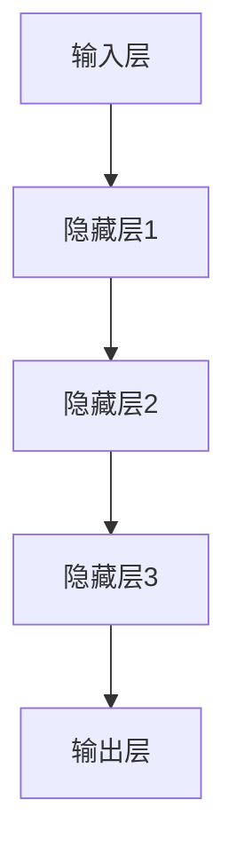
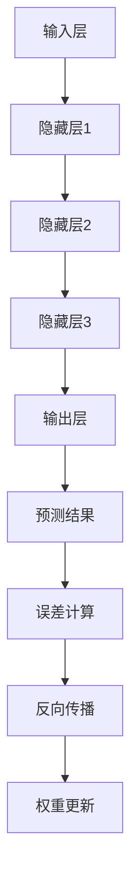
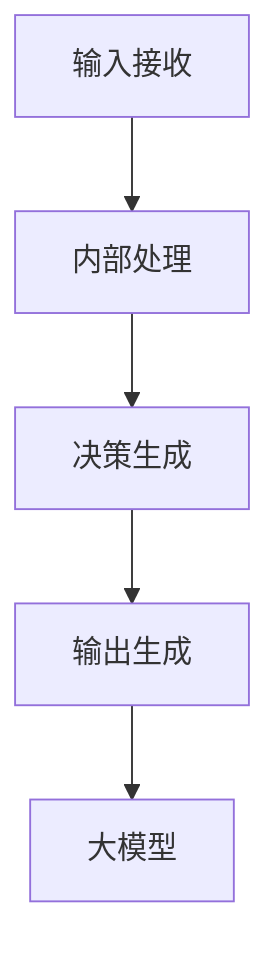
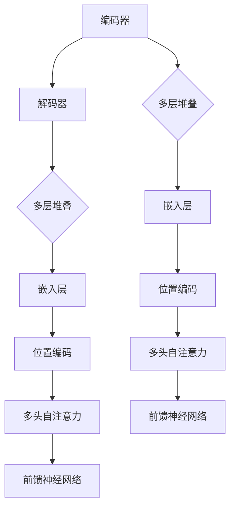

                 

### 背景介绍

近年来，随着深度学习技术的飞速发展，人工智能（AI）在各个领域得到了广泛应用。从自然语言处理（NLP）到计算机视觉（CV），从自动驾驶到推荐系统，AI 已经成为推动科技进步的重要力量。然而，AI 的研究和开发面临着诸多挑战，其中之一是如何实现高效、可靠的 AI 应用程序开发。

在这篇文章中，我们将探讨一种全新的 AI 应用开发方法——基于大模型（Large-scale Model）的 AI 代理（AI Agent）开发。大模型，顾名思义，是指具有大量参数和复杂结构的模型，如 Transformer、BERT 等。这些模型在训练过程中需要大量的数据和高性能计算资源，但它们在处理复杂任务时表现出色，具有很高的准确性和泛化能力。

AI 代理，则是一种能够模拟人类智能行为，自主决策并执行任务的系统。它们可以应用于各种场景，如客服机器人、智能助手、自动交易系统等。传统的 AI 代理开发通常依赖于规则引擎或小型模型，难以处理复杂的多模态任务。而基于大模型的 AI 代理，则能够通过端到端学习的方式，实现更高效、更智能的决策。

本文将首先介绍大模型和 AI 代理的基本概念，然后深入探讨如何使用大模型开发 AI 代理，包括核心算法原理、具体操作步骤、数学模型和公式等。接下来，我们将通过一个实际项目案例，详细讲解如何使用大模型实现 AI 代理，并分析其优缺点。最后，我们将探讨大模型和 AI 代理在实际应用中的场景，并提供一些工具和资源推荐，以帮助读者进一步学习和实践。

通过本文的阅读，读者将能够了解大模型和 AI 代理的基本原理，掌握开发 AI 代理的步骤和方法，并能够为实际项目提供有价值的参考。

### 核心概念与联系

在深入探讨大模型和 AI 代理之前，我们需要先了解一些核心概念，包括大模型的基本结构、训练方法以及 AI 代理的工作原理。下面，我们将通过一个 Mermaid 流程图来展示这些概念之间的联系。

首先，大模型的基本结构通常包括输入层、隐藏层和输出层。输入层负责接收外部数据，隐藏层通过多层神经网络进行数据处理，输出层则生成最终的预测结果。

大模型的训练方法通常采用反向传播算法（Backpropagation），这是一种基于梯度下降的优化算法，用于调整网络中的权重和偏置，以最小化预测误差。训练过程中，数据会从输入层传递到输出层，通过反向传播计算梯度，然后更新权重和偏置。

AI 代理的工作原理则基于大模型。AI 代理通过学习海量数据，形成对任务的理解和决策能力。它们可以接收外部输入，通过大模型进行内部处理，然后生成相应的输出。AI 代理的工作流程可以简化为以下几个步骤：

1. **输入接收**：接收外部输入，如文本、图像、声音等。
2. **内部处理**：使用大模型对输入进行处理，提取特征。
3. **决策生成**：根据处理结果生成决策，如回答问题、执行任务等。
4. **输出生成**：将决策输出到外部环境。

通过上述 Mermaid 流程图，我们可以清晰地看到大模型和 AI 代理之间的联系。大模型为 AI 代理提供了强大的数据处理和决策能力，而 AI 代理则通过学习和适应外部环境，实现智能化的任务执行。

在接下来的章节中，我们将详细探讨大模型的核心算法原理、具体操作步骤，以及如何使用大模型开发 AI 代理。希望通过这一部分的介绍，读者能够对大模型和 AI 代理有一个更加深入的理解。

#### 核心算法原理 & 具体操作步骤

要深入理解大模型和 AI 代理的开发，我们首先需要探讨其核心算法原理，并详细解释其具体操作步骤。这里，我们将以 Transformer 模型和 GPT（Generative Pre-trained Transformer）模型为例，介绍大模型的核心算法原理和操作步骤。

##### Transformer 模型

Transformer 模型是由 Vaswani 等人于 2017 年提出的一种基于自注意力机制的神经网络模型。自注意力机制（Self-Attention）是 Transformer 模型的核心，它使得模型能够在处理序列数据时，自动捕捉到序列中不同位置的信息，从而提高模型的性能。

###### 自注意力机制（Self-Attention）

自注意力机制的基本思想是：在处理序列数据时，模型中的每个位置都能够关注到序列中的其他所有位置，并根据这些位置的权重来计算当前位置的输出。自注意力机制的公式如下：

$$
\text{Attention}(Q, K, V) = \text{softmax}\left(\frac{QK^T}{\sqrt{d_k}}\right) V
$$

其中，$Q$、$K$ 和 $V$ 分别代表查询（Query）、键（Key）和值（Value）向量，$d_k$ 是键向量的维度。通过自注意力机制，模型可以学习到序列中各个位置之间的依赖关系。

###### Transformer 模型结构

Transformer 模型由编码器（Encoder）和解码器（Decoder）组成。编码器负责将输入序列编码为隐藏状态，解码器则根据隐藏状态生成输出序列。以下是 Transformer 模型的基本结构：

在编码器中，嵌入层将输入单词转换为固定长度的向量，位置编码为每个位置添加位置信息。多层多头自注意力机制使编码器能够捕捉到序列中的依赖关系，并生成隐藏状态。前馈神经网络用于增加模型的表达能力。

在解码器中，解码器嵌入层、位置编码和自注意力机制与编码器类似。解码器的自注意力机制分为两个部分：掩码自注意力（Masked Self-Attention）和交叉自注意力（Cross-Attention）。掩码自注意力用于处理序列中的自引用关系，交叉自注意力则用于处理编码器和解码器之间的交互。解码器的输出经过前馈神经网络处理后，生成最终的输出序列。

###### 操作步骤

1. **编码器输入**：将输入序列（例如文本）编码为嵌入向量，并添加位置编码。
2. **多层堆叠**：对嵌入向量进行多层多头自注意力处理，并添加前馈神经网络。
3. **解码器输入**：将编码器的隐藏状态作为输入，并进行相应的嵌入、位置编码和自注意力处理。
4. **生成输出**：通过交叉自注意力处理，解码器生成最终的输出序列。

##### GPT 模型

GPT（Generative Pre-trained Transformer）模型是 OpenAI 于 2018 年提出的一种基于 Transformer 的预训练模型。GPT 的目标是生成文本，其核心思想是通过大量无监督数据对模型进行预训练，然后在特定任务上进行微调。

###### 预训练过程

GPT 模型的预训练过程主要包括两个步骤：

1. **Masked Language Modeling（MLM）**：在输入序列中随机掩码一定比例的单词，然后使用 GPT 模型预测这些掩码的单词。通过这种方式，模型学习到序列中各个单词之间的关系。
2. **生成语言建模（Gen

