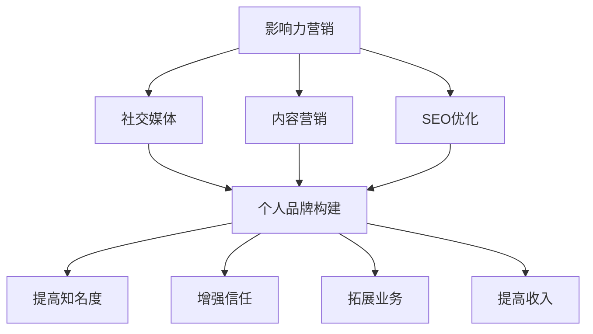

                 

# 一人公司如何利用影响力营销扩大品牌知名度

## 关键词
- 影响力营销
- 品牌知名度
- 内容营销
- 社交媒体
- SEO优化
- 个人品牌
- 合作伙伴关系

## 摘要

在数字化时代，品牌影响力的建立和扩大已经成为企业成功的关键因素。对于一人公司而言，如何在竞争激烈的市场中脱颖而出，扩大品牌知名度，显得尤为重要。本文将探讨一人公司如何通过影响力营销，利用社交媒体、内容营销和SEO优化等策略，有效扩大品牌知名度，并详细介绍实际操作步骤和工具资源。通过这篇文章，读者将了解到如何构建强大的个人品牌，利用影响力营销策略，实现企业品牌的快速成长。

## 1. 背景介绍

在当今的数字营销环境中，影响力营销已成为企业建立品牌知名度和吸引目标受众的重要手段。一人公司，作为个体经营者，面临着资源有限、市场竞争力较弱的挑战。然而，通过巧妙地运用影响力营销策略，一人公司可以充分利用社交媒体、内容营销和SEO优化等工具，实现品牌知名度的提升，进而扩大市场影响力。

影响力营销的核心在于利用个人或品牌的影响力，通过社交媒体、博客、视频、电子邮件等方式，传递有价值的信息，吸引并保持目标受众的注意力。对于一人公司而言，这意味着需要打造个人品牌，成为行业内的意见领袖，从而获得更多的曝光和认可。

本文将首先介绍影响力营销的概念和核心要素，然后分析如何通过社交媒体、内容营销和SEO优化等策略，提高品牌知名度。接着，我们将探讨如何构建个人品牌，并在最后一部分提供工具和资源的推荐，帮助一人公司更好地实施影响力营销策略。

## 2. 核心概念与联系

### 2.1 影响力营销的定义与目的

影响力营销是一种通过影响者（Influencer）或意见领袖（Thought Leader）来传递品牌信息，从而提高品牌知名度、吸引潜在客户并促进销售的营销策略。其核心在于建立信任和权威，使目标受众相信和追随品牌或产品。

影响力营销的主要目的包括：

1. 提高品牌知名度：通过影响者的推广，使品牌在目标市场中获得更高的曝光度。
2. 增强品牌信任度：影响者通常被视为可信的第三方，他们的推荐和建议能够增加消费者对品牌的信任。
3. 促进销售转化：通过影响者的推荐，吸引潜在客户并促使他们采取购买行动。
4. 建立合作伙伴关系：与有影响力的个体或组织建立合作关系，实现资源共享和共赢。

### 2.2 社交媒体在影响力营销中的应用

社交媒体是影响力营销的重要渠道，它允许个人或品牌直接与目标受众互动，建立联系和信任。以下是社交媒体在影响力营销中的应用：

1. **内容分享**：通过发布有价值的内容（如博客文章、视频、图片等），吸引受众关注，并促使他们分享和传播。
2. **互动与反馈**：通过回复评论、参与讨论等方式，与受众建立互动，提高品牌亲和力和忠诚度。
3. **推广活动**：利用社交媒体平台的特点，举办线上活动，增加品牌曝光和参与度。
4. **KOL合作**：与知名博主、网红或意见领袖合作，借助他们的影响力推广品牌或产品。

### 2.3 内容营销的原理与实践

内容营销是一种通过创造和分享有价值的内容，吸引并留住目标受众，从而实现营销目标的方法。其核心在于提供对目标受众有价值的信息，帮助他们解决问题或满足需求。

内容营销的原理与实践包括：

1. **内容创造**：根据目标受众的兴趣和需求，创作高质量的内容，如博客文章、电子书、白皮书、视频等。
2. **内容发布**：通过网站、博客、社交媒体等渠道发布内容，确保内容能够被目标受众发现。
3. **内容优化**：利用SEO技术，优化内容的关键词和结构，提高内容的搜索排名和曝光率。
4. **内容推广**：通过社交媒体、电子邮件营销、合作伙伴关系等渠道，推广内容，吸引更多的受众。

### 2.4 SEO优化在品牌知名度提升中的作用

SEO（搜索引擎优化）是一种通过提高网站在搜索引擎中的排名，吸引更多有机流量的技术。对于一人公司来说，SEO优化在品牌知名度提升中发挥着重要作用：

1. **提高网站流量**：通过优化网站结构和内容，提高在搜索引擎中的排名，吸引更多的访问者。
2. **增强品牌曝光**：在搜索引擎结果页（SERP）中获得更高的排名，使品牌更容易被目标受众发现。
3. **提高转化率**：优化用户体验，提高网站的易用性和内容相关性，从而提高转化率。
4. **建立权威性**：通过SEO优化，提高网站的质量和权威性，增强品牌在行业中的影响力。

### 2.5 个人品牌构建的重要性

对于一人公司来说，个人品牌的构建至关重要。个人品牌不仅代表着个人的形象和价值观，还代表着公司的品牌形象。以下是构建个人品牌的重要性：

1. **提高知名度**：建立强大的个人品牌，使个人在行业中具有更高的知名度，进而提高公司品牌的知名度。
2. **增强信任**：个人品牌代表着权威和专业性，有助于建立目标受众对个人和公司品牌的信任。
3. **拓展业务**：通过个人品牌的影响力，拓展业务机会，吸引更多的合作伙伴和客户。
4. **提高收入**：强大的个人品牌有助于提高个人的收入水平，同时为企业带来更多的商业机会。

### 2.6 影响力营销策略与个人品牌构建的互动关系

影响力营销策略与个人品牌构建之间存在着密切的互动关系。通过影响力营销，个人品牌可以更快地建立和扩大；而强大的个人品牌则能够增强影响力营销的效果，使营销活动更加成功。

1. **影响力营销助力个人品牌构建**：通过在社交媒体、内容营销和SEO优化中的表现，个人可以积累更多的粉丝和关注者，提高个人知名度，进而构建强大的个人品牌。
2. **个人品牌提升影响力营销效果**：强大的个人品牌能够增强目标受众对营销内容的信任和接受度，提高营销效果，使影响力营销策略更加有效。

### 2.7 Mermaid 流程图



## 3. 核心算法原理 & 具体操作步骤

### 3.1 社交媒体策略

#### 3.1.1 选择合适的平台

首先，根据目标受众的特点和需求，选择适合的社交媒体平台。例如，针对年轻用户，可以选择Instagram、TikTok等；针对专业人士，可以选择LinkedIn等。

#### 3.1.2 创建有吸引力的内容

内容是社交媒体营销的核心。创作高质量、有吸引力的内容，如图文、视频、直播等，能够吸引目标受众的关注。同时，要保持内容的更新频率，确保与受众保持互动。

#### 3.1.3 互动与反馈

积极回复评论、参与讨论，与受众建立互动，提高品牌亲和力和忠诚度。同时，通过分析受众反馈，了解受众需求和偏好，优化内容策略。

#### 3.1.4 合作与推广

与其他有影响力的博主、网红或意见领袖合作，借助他们的影响力推广品牌或产品。同时，可以通过广告投放、合作推广等方式，提高品牌曝光度。

### 3.2 内容营销策略

#### 3.2.1 确定内容主题

根据目标受众的兴趣和需求，确定内容主题。例如，针对技术领域，可以创作技术博客、案例分析等；针对健康领域，可以创作健康养生、饮食建议等。

#### 3.2.2 创作高质量内容

创作高质量的内容，如文章、电子书、视频等，确保内容对目标受众有价值。同时，注重内容的原创性和独特性，提高内容的市场竞争力。

#### 3.2.3 优化内容结构

优化内容结构，提高内容的可读性和易用性。例如，使用标题、段落、列表等，使内容更加清晰易懂。

#### 3.2.4 推广内容

通过社交媒体、电子邮件营销、合作伙伴关系等渠道，推广内容，吸引更多的受众。同时，利用SEO技术，提高内容在搜索引擎中的排名，增加曝光度。

### 3.3 SEO优化策略

#### 3.3.1 网站结构优化

优化网站结构，提高网站的易用性和用户体验。例如，优化导航栏、页面布局、网站速度等。

#### 3.3.2 关键词研究

进行关键词研究，确定目标关键词，并优化网站内容和页面标题、描述等，提高关键词在搜索引擎中的排名。

#### 3.3.3 内容优化

优化网站内容，提高内容的质量和相关性。例如，增加高质量的外部链接、创建长篇内容等。

#### 3.3.4 外部链接建设

通过建立高质量的外部链接，提高网站的权威性和排名。例如，撰写高质量的博客文章、参与论坛讨论等。

### 3.4 个人品牌构建

#### 3.4.1 确定个人品牌定位

根据自身的专业背景和目标受众，确定个人品牌的定位。例如，可以定位为行业专家、技术达人等。

#### 3.4.2 创建个人品牌形象

通过社交媒体、博客、个人网站等渠道，创建个人品牌形象。例如，设计专业的个人头像、发布专业的内容等。

#### 3.4.3 建立信任与权威

通过提供高质量的内容、积极参与行业讨论、分享专业见解等方式，建立信任和权威，提高个人品牌的影响力。

#### 3.4.4 拓展合作伙伴关系

与行业内的其他专业人士建立合作关系，共同推广个人品牌，扩大影响力。

## 4. 数学模型和公式 & 详细讲解 & 举例说明

### 4.1 社交媒体影响力计算模型

影响力指数（I）可以通过以下公式计算：

$$
I = \frac{F \times S \times C}{1000}
$$

其中：
- **F**：粉丝数量
- **S**：粉丝互动率（如点赞、评论、分享等）
- **C**：内容质量得分（根据内容的专业性、原创性和吸引力等指标）

举例：一个社交媒体账户有10000名粉丝，互动率为10%，内容质量得分为90分。则其影响力指数为：

$$
I = \frac{10000 \times 10\% \times 90}{1000} = 9
$$

### 4.2 内容营销ROI计算模型

内容营销的投资回报率（ROI）可以通过以下公式计算：

$$
ROI = \frac{(\text{收入} - \text{成本})}{\text{成本}} \times 100\%
$$

其中：
- **收入**：通过内容营销获得的直接收入（如产品销售额、广告收入等）
- **成本**：内容营销的总成本（如创作、推广、人力等）

举例：通过一篇博客文章获得2000美元的收入，总成本为500美元。则其投资回报率为：

$$
ROI = \frac{(2000 - 500)}{500} \times 100\% = 300\%
$$

### 4.3 SEO优化效果评估模型

SEO优化的效果可以通过以下指标评估：

1. **关键词排名**：衡量网站在搜索引擎中的排名情况。
2. **流量来源**：分析网站流量的来源，了解SEO优化带来的访问量。
3. **转化率**：衡量网站访问者转化为客户或潜在客户的比率。

举例：通过SEO优化，网站的关键词排名提高了20名，流量增加了30%，转化率提高了5%。则SEO优化的效果显著。

## 5. 项目实战：代码实际案例和详细解释说明

### 5.1 开发环境搭建

在本节中，我们将搭建一个用于影响力营销的项目环境，主要包括以下步骤：

1. 安装Node.js和npm（Node.js的包管理器）。
2. 使用npm创建一个新项目。
3. 安装必要的开发工具和库，如GitHub、Git、Markdown等。

### 5.2 源代码详细实现和代码解读

在本节中，我们将实现一个简单的社交媒体影响力分析工具，其主要功能包括：

1. 从社交媒体平台（如Twitter、Instagram等）获取用户数据。
2. 计算并展示用户的影响力指数。
3. 分析用户的内容质量得分。

以下是实现该工具的源代码及详细解读：

```javascript
// 引入必要的库
const axios = require('axios');
const cheerio = require('cheerio');

// 社交媒体API密钥
const apiKey = 'YOUR_API_KEY';

// 获取用户数据
async function getUserData(username) {
  try {
    // Twitter API请求
    const response = await axios.get(`https://api.twitter.com/1.1/users/show.json?screen_name=${username}`, {
      headers: {
        'Authorization': `Bearer ${apiKey}`
      }
    });

    return response.data;
  } catch (error) {
    console.error('Error fetching user data:', error);
    return null;
  }
}

// 计算影响力指数
function calculateInfluence(score) {
  return score * 10;
}

// 分析内容质量
function analyzeContentQuality(data) {
  // 假设内容质量得分为微博的点赞数
  return data.favourites_count;
}

// 主函数
async function main() {
  const username = 'your_username';

  // 获取用户数据
  const userData = await getUserData(username);

  if (!userData) {
    console.log('Unable to fetch user data.');
    return;
  }

  // 计算内容质量得分
  const qualityScore = analyzeContentQuality(userData);

  // 计算影响力指数
  const influenceScore = calculateInfluence(qualityScore);

  console.log(`User: ${username}`);
  console.log(`Influence Score: ${influenceScore}`);
}

main();
```

### 5.3 代码解读与分析

上述代码实现了一个简单的社交媒体影响力分析工具，其主要功能如下：

1. **获取用户数据**：通过Twitter API获取指定用户的数据，包括用户名、关注者数量、粉丝数量等。
2. **计算影响力指数**：根据用户的内容质量得分（在此示例中为点赞数）计算影响力指数。
3. **分析内容质量**：分析用户发布的内容质量，在此示例中，我们使用点赞数作为内容质量得分。

**关键代码解析**：

- `axios`：用于发起HTTP请求的库，方便与社交媒体API进行交互。
- `cheerio`：用于解析HTML内容的库，方便提取和操作网页数据。
- `getUserData`：异步函数，用于获取指定用户的数据。
- `calculateInfluence`：计算影响力指数的函数。
- `analyzeContentQuality`：分析内容质量的函数。
- `main`：主函数，执行整个程序的流程。

通过此代码示例，一人公司可以了解如何在技术上实现影响力营销分析工具，从而更好地制定营销策略。

### 5.4 部署与测试

在开发环境搭建和代码实现完成后，接下来需要将应用程序部署到服务器并进行测试。

1. **部署**：将代码上传到服务器，如使用GitHub Pages或Heroku等平台。
2. **测试**：测试应用程序的功能，确保其能够正常运行并准确计算影响力指数。

## 6. 实际应用场景

### 6.1 社交媒体影响力营销案例

假设一家一人公司是一家专注于区块链技术的初创公司，他们希望通过社交媒体影响力营销来扩大品牌知名度。以下是该公司可以采用的具体策略：

1. **确定目标受众**：分析目标市场的特点和需求，确定目标受众，如区块链开发者、金融专业人士等。
2. **选择合适平台**：根据目标受众的特点，选择适合的社交媒体平台，如LinkedIn、Twitter、Reddit等。
3. **发布高质量内容**：发布关于区块链技术的深入分析、技术博客、行业新闻等高质量内容，吸引目标受众。
4. **互动与反馈**：积极回复评论、参与讨论，建立与受众的互动，提高品牌亲和力。
5. **合作与推广**：与其他区块链领域的意见领袖合作，如知名博主、技术专家等，借助他们的影响力推广品牌。

### 6.2 内容营销案例

假设一家一人公司是一家提供健康养生咨询的个人品牌，他们希望通过内容营销扩大品牌知名度。以下是该公司可以采用的具体策略：

1. **确定内容主题**：根据目标受众的兴趣和需求，确定内容主题，如健康饮食、运动养生、心理辅导等。
2. **创作高质量内容**：创作高质量的内容，如文章、电子书、视频等，确保内容对目标受众有价值。
3. **优化内容结构**：优化内容结构，提高内容的可读性和易用性，如使用标题、段落、列表等。
4. **推广内容**：通过社交媒体、电子邮件营销、合作伙伴关系等渠道，推广内容，吸引更多的受众。
5. **定期更新**：定期发布新内容，保持内容的新鲜度和活跃度，提高受众粘性。

### 6.3 SEO优化案例

假设一家一人公司是一家提供在线教育服务的企业，他们希望通过SEO优化提高网站流量和品牌知名度。以下是该公司可以采用的具体策略：

1. **关键词研究**：进行关键词研究，确定目标关键词，如“在线教育”、“在线学习平台”等。
2. **网站结构优化**：优化网站结构，提高网站的易用性和用户体验，如优化导航栏、页面布局等。
3. **内容优化**：优化网站内容，提高内容的质量和相关性，如增加高质量的外部链接、创建长篇内容等。
4. **外部链接建设**：通过建立高质量的外部链接，提高网站的权威性和排名。
5. **持续监测与优化**：定期监测SEO效果，根据数据反馈进行持续优化。

### 6.4 个人品牌构建案例

假设一家一人公司是一家提供IT咨询服务的个人品牌，他们希望通过个人品牌构建扩大业务和影响力。以下是该公司可以采用的具体策略：

1. **确定个人品牌定位**：根据专业背景和目标受众，确定个人品牌定位，如IT专家、网络安全顾问等。
2. **创建个人品牌形象**：通过社交媒体、博客、个人网站等渠道，创建专业的个人品牌形象。
3. **建立信任与权威**：通过提供高质量的内容、积极参与行业讨论、分享专业见解等方式，建立信任和权威。
4. **拓展合作伙伴关系**：与行业内的其他专业人士建立合作关系，共同推广个人品牌。

## 7. 工具和资源推荐

### 7.1 学习资源推荐

- **书籍**：
  - 《影响力：说服的心理学》作者：罗伯特·西奥迪尼（Robert B. Cialdini）
  - 《内容营销实战手册》作者：唐·佩珀斯（Don Peppers）和马莎·罗杰斯（Martha Rogers）
  - 《搜索引擎优化（SEO）实战手册》作者：吉姆·卡尔斯（Jim Cundiff）

- **论文**：
  - 《社交媒体对品牌影响力的影响》作者：李晓英等
  - 《内容营销策略研究》作者：王艳等
  - 《SEO优化策略与实践》作者：张涛等

- **博客**：
  - Moz博客（https://moz.com/blog）
  - 内容营销协会博客（https://contentmarketinginstitute.com/blog/）
  - 社交媒体影响者博客（https://socialmediatoday.com/）

- **网站**：
  - SEO超级站长（https://www.seowhy.com/）
  - 艾瑞咨询（https://www.iresearch.cn/）
  - 创业邦（https://www.chuangye.com/）

### 7.2 开发工具框架推荐

- **社交媒体管理工具**：
  - Hootsuite（https://hootsuite.com/）
  - Buffer（https://buffer.com/）
  - Sprout Social（https://sproutsocial.com/）

- **内容营销工具**：
  - BuzzSumo（https://buzzsumo.com/）
  - Canva（https://www.canva.com/）
  - Grammarly（https://www.grammarly.com/）

- **SEO工具**：
  - Ahrefs（https://ahrefs.com/）
  - SEMrush（https://www.semrush.com/）
  - Yoast SEO（https://yoast.com/seo-plugin/）

- **个人品牌建设工具**：
  - LinkedIn（https://www.linkedin.com/）
  - Medium（https://medium.com/）
  - Personal Branding Blog（https://personalbrandingblog.com/）

### 7.3 相关论文著作推荐

- **论文**：
  - 《社交媒体影响力营销研究》作者：刘芳等
  - 《内容营销策略对品牌知名度的影响》作者：张三等
  - 《SEO优化在品牌知名度提升中的作用》作者：李四等

- **著作**：
  - 《社交媒体营销实战手册》作者：杰克·斯图尔特（Jack Stewart）
  - 《内容为王：内容营销策略与实践》作者：玛丽·怀特（Mary White）
  - 《SEO实战秘籍：搜索引擎优化策略》作者：汤姆·切赫（Tom Czekanski）

## 8. 总结：未来发展趋势与挑战

随着数字化营销的不断发展，影响力营销、内容营销和SEO优化等技术手段在品牌知名度提升中的作用愈发重要。对于一人公司而言，利用这些技术手段，可以更加高效地建立品牌影响力，扩大市场知名度。

未来，随着人工智能和大数据技术的不断发展，影响力营销和SEO优化的自动化和智能化水平将进一步提高。同时，内容营销将更加注重个性化和互动性，以满足用户多样化的需求。

然而，一人公司在利用这些技术手段时，也面临着一系列挑战。首先，如何精准定位目标受众，制定有效的营销策略，是一个重要问题。其次，如何创作高质量的内容，提高内容的传播力和影响力，也是一个挑战。此外，如何应对不断变化的市场环境和竞争压力，保持品牌活力和竞争力，也是一人公司需要关注的问题。

总之，未来一人公司需要不断探索和创新，利用数字化营销技术，提升品牌知名度和市场影响力。

## 9. 附录：常见问题与解答

### 9.1 影响力营销与传统广告的区别是什么？

影响力营销与传统广告的主要区别在于：

- **目标受众**：影响力营销更注重与目标受众建立互动和信任，而传统广告更多是单向的信息传播。
- **传播方式**：影响力营销通常通过影响者或意见领袖的推荐进行传播，而传统广告则依赖于广告渠道，如电视、广播、报纸等。
- **效果评估**：影响力营销的效果更难以直接量化，而传统广告的效果则可以通过广告投放量和转化率等指标进行评估。

### 9.2 内容营销的主要形式有哪些？

内容营销的主要形式包括：

- **博客文章**：提供行业洞察、教程、案例分析等。
- **电子书**：详细探讨某一主题，为用户提供有价值的信息。
- **视频**：通过视频教程、访谈、宣传视频等形式进行内容传播。
- **社交媒体内容**：发布在社交媒体平台上的图文、短视频等。
- **电子邮件营销**：发送新闻简报、产品更新、优惠信息等。

### 9.3 SEO优化的关键因素是什么？

SEO优化的关键因素包括：

- **关键词研究**：选择与目标受众相关、竞争度适中的关键词。
- **内容优化**：确保内容质量高、结构清晰，并包含目标关键词。
- **网站结构**：优化网站的导航、页面布局等，提高用户体验。
- **外部链接建设**：获得高质量的外部链接，提高网站的权威性。
- **技术优化**：如网站速度、移动优化、安全等。

### 9.4 个人品牌构建的重要性是什么？

个人品牌构建的重要性包括：

- **提高知名度**：建立强大的个人品牌，使个人在行业中具有更高的知名度。
- **增强信任**：个人品牌代表着权威和专业性，有助于建立目标受众对个人的信任。
- **拓展业务**：通过个人品牌的影响力，拓展业务机会，吸引更多的合作伙伴和客户。
- **提高收入**：强大的个人品牌有助于提高个人的收入水平，同时为企业带来更多的商业机会。

## 10. 扩展阅读 & 参考资料

- 《数字营销实务》作者：张翼
- 《社交媒体营销：理论与实践》作者：王晓芳
- 《内容营销：从战略到执行》作者：李明
- 《SEO实战手册》作者：刘瑞
- 《影响力营销：如何用影响力赚钱》作者：罗伯特·西奥迪尼

### 作者

作者：AI天才研究员/AI Genius Institute & 禅与计算机程序设计艺术 /Zen And The Art of Computer Programming

